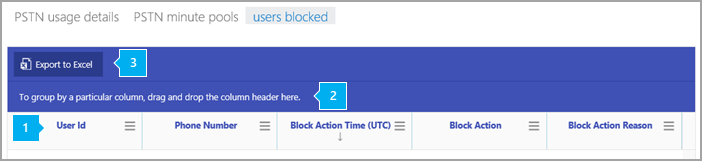

# ブロックされているユーザーのレポート

[!INCLUDE [sfbo-retirement](../../Hub/includes/sfbo-retirement.md)]

新しい [Skype for Business **レポート**] ダッシュボードには、組織内の複数のSkype for Businessアクティビティの概要が表示されます。 これにより、個々の製品レベルのレポートにドリルダウンして、各製品内のアクティビティに関するより詳細な分析情報を提供できます。 たとえば、PSTN 通話を **ブロックSkype for Business** ユーザーブロック レポートを使用して、組織内のユーザーを確認できます。 このレポートは、他の Skype for Business レポートと共に、組織全体の PSTN の使用状況など、アクティビティの詳細を示します。
  
 利用可能なその [他のレポートについては](https://support.office.com/article/0d6dfb17-8582-4172-a9a9-aed798150263) 、「レポートの概要」を参照してください。
  
> [!NOTE]
> 管理者として管理センターにSkype for Businessすると、すべてのレポートをMicrosoft 365できます。 
  
## ユーザーがブロックするレポートSkype for Businessアクセスする方法

 **Skype for Business 管理センターの使用**

- 管理センターに移動し、[管理センター] **>[**  >  **ユーザー Skype for Businessブロック]**  >    >  **をクリックします**。
    
## ユーザーがブロックSkype for Businessレポートを解釈する

表示される各列を見て、ブロックされたユーザーにビューを表示できます。
  
レポートは、このように表示されます。 
  

次の表は、通話をブロックしているすべてのユーザーの内訳を示しています。 これにより、電話会議または電話会議電話システム割り当てられているすべてのユーザーが表示されます。 表では、列を追加したり、削除したりすることができます。
***

*   **ユーザー ID** は、ユーザーのサインインです。
*   **電話は**、ユーザーに割り当てられている番号です。 
*   **ブロック アクション時間は** 、ユーザーが呼び出しをブロックされた時刻 (UTC) です。
*   **ブロック アクション** は、ユーザーをブロックするために実行されたアクションの種類です。
*   **ブロック アクションの理由** は、ユーザーが呼び出しをブロックされた理由です。
***
 
1 つ以上の列の全データをまとめたビューを作成したい場合は、列を [ **特定の列を基準にグループ化するには、ここに列ヘッダーをドラッグ アンド ドロップします**] にクリック アンド ドラッグします。
***
 
また、[ **Excel にエクスポート**] をクリックまたはタップして、レポート データを Excel の .csv ファイルにエクスポートすることもできます。

これにより、すべてのユーザーのデータがエクスポートされ、単純な並べ替えとフィルター処理を行ってさらに分析することができます。 ユーザー数が 2,000 人未満の場合は、レポート自体のテーブル内で並べ替えとフィルター処理を行います。 ユーザー数が 2000 を超える場合は、フィルター処理と並べ替えを行うために、データをエクスポートする必要があります。
***

## Skype for Business のその他のレポートを表示しますか?

- [Skype for Business アクティビティ レポート](activity-report.md) - ユーザーがどの程度ピアツーピア、開催、参加で電話会議セッションを使用しているかを確認できます。
    
- [Skype for Business クライアントの使用レポート](device-usage-report.md) - Windows ベースのオペレーティング システムとモバイル デバイスを含む、Skype for Business アプリがインストールされていて IM と会議に使用されるデバイスを確認できます。
    
- [Skype for Business 電話会議開催者アクティビティ レポート](conference-organizer-activity-report.md) - ユーザーがどの程度 IM、音声/ビデオ、アプリケーション共有、Web、ダイヤルイン/アウト - サード パーティ、ダイヤルイン/アウト - Microsoft を使用した電話会議を開催しているかを確認できます。
    
- [Skype for Business参加者アクティビティ レポートの作成](conference-participant-activity-report.md)参加している IM、音声/ビデオ、アプリケーション共有、Web 会議、ダイヤルイン/アウト会議の数を確認できます。
    
- [Skype for Business ピアツーピア アクティビティ レポート](peer-to-peer-activity-report.md) - ユーザーがどの程度 IM、音声/ビデオ、アプリケーション共有、ファイル転送を使用しているかを確認できます。
    
- [Skype for Business PSTN 使用状況レポート](pstn-usage-report.md)受信/送信呼び出しに費やされた分数と、これらの呼び出しのコストを確認できます。

- [Skype for Business PSTN 分](pstn-minute-pools-report.md)プール レポートでは、組織内の当月に消費された分数を確認できます。

- [Skype for Business詳細レポート](session-details-report.md)個々のユーザーの通話エクスペリエンスに関する詳細を確認できます。
   
## 関連トピック
[管理センターのアクティビティ レポート](https://support.office.com/article/0d6dfb17-8582-4172-a9a9-aed798150263)

  
 
