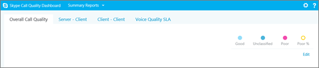

# 通話分析と通話品質ダッシュボードの違いを教えてください

[] Skype for Business では、通話品質の問題を監視してトラブルシューティングするために、通話分析と通話品質ダッシュボードという 2 つの方法を利用できます。この記事では、これらの両方について説明し、どのような場合にそれぞれの方法を使用するべきかを示します。
  
> [!NOTE]
> 通話分析は現在プレビューとして提供されています。ここに記載されるテキストと画像は実際の使用時のものと一致しない可能性があります。 
  
## 通話分析とは何ですか? どのような場合に使用するものですか?

通話分析は、Skype for Business アカウント内の各ユーザーの特定の通話および会議に関係するデバイス、ネットワーク、接続性についての詳細情報を示します。Skype for Business 管理者である場合は、Skype for Business の通話品質と接続に関する問題をトラブルシューティングするために通話分析を使用できます。
  
管理者以外の、たとえば外部ベンダーからのヘルプデスク エージェントなどの人に通話分析を使用してほしい場合は、その人に通話分析を使用できる、ただし Skype for Business 管理センターの他の部分にはアクセスできないアクセス許可を割り当てることができます。 
  
- **階層 1 のアクセス許可を持つヘルプデスク エージェント**: エージェントは、通話分析において制限されたデータのセットと個人を特定できる情報 (PII) を見ることができます。通話に対してはトラブルシューティングを行えますが、会議に関する問題は階層 2 のエージェントに引き渡すことになります。
    
- **階層 2 のアクセス許可を持つヘルプデスク エージェント**: エージェントは通話分析において利用できるデータをすべて見ることができ、通話と会議の両方についてトラブルシューティングできます。通話ログやユーザー情報に対するフル アクセスが付与されています。
    
通話分析のセットアップの詳細については、「[Skype for Business の通話分析のセットアップ](set-up-call-analytics.md)」をご覧ください。 ヘルプデスクの担当者が分析機能の呼び出しを機能させる方法の詳細については、[品質の低い呼び出しのトラブルシューティングを行うコール分析機能の使用](use-call-analytics-to-troubleshoot-poor-call-quality.md)を参照してください。
  
## 通話品質ダッシュボードとは何ですか? どのような場合に使用するものですか?

通話分析では、ユーザーが経験した通話品質についての詳細な特定の情報が提供されます。Tony Smith というユーザーが今日の午後に低品質の通話を経験した原因を突き止めるために、通話分析を使用して、Skype for Business 管理者または訓練されたヘルプデスク エージェントがデバイス、ネットワーク、接続性その他の Tony の通話に関係する要素を調査することができます。
  
通話分析が、特定の通話の品質に関する問題を管理者やヘルプデスク エージェントがトラブルシューティングできるように設計されているのに対し、通話品質ダッシュボード (CQD) は Skype for Business 管理者やネットワーク エンジニアがネットワークを最適化できるように設計されています。CQD では特定のユーザーから焦点を外して、代わりに Skype for Business 組織全体の集計された情報について考察することになります。 
  
Tony の通話が低品質であったことは、他の数多くのユーザーにも影響を及ぼしている、ネットワークの問題がおそらく原因だと考えられます。Tony の個人的な通話経験については CQD で見ることはできませんが、Skype for Business を使用した通話の品質の全体像を把握できます。CQD では、全体のパターンが明らかに示され、ネットワーク エンジニアは確かな情報に基づく通話品質の評価を行えるようになります。CQD は通話品質の指標のレポートを提供し、全体的な通話品質、サーバーとクライアント間およびクライアント同士の間のストリーム、および音声品質の [SLA](https://go.microsoft.com/fwlink/p/?linkid=846252) についての洞察を得られます。 
  

  
詳細については、「[Skype for Business Online の通話品質ダッシュボードの機能](turning-on-and-using-call-quality-dashboard.md#BKMKFeaturesOfTheCQD)」をご覧ください。
  
通話分析と CQD を並行して実行し、それぞれ別個に使用したり一緒に組み合わせて使用することができます。たとえば、階層 1 のエージェントが、通話の問題をトラブルシューティングするためにより多くのサポートが必要である場合を考えます。階層 1 のエージェントは、通話を階層 2 のエージェントに渡します。階層 2 のエージェントは、階層 1 のエージェントよりも多くの通話分析の情報にアクセスできます。さらに、階層 2 のエージェントはネットワーク エンジニアが問題を見逃さないようにアラートを出すことができます。ネットワーク エンジニアは CQD をチェックして全体的なサイト関連の問題が通話の問題の原因を成しているかを確認します。
  
救難に関する詳細について[を有効にしてマイクロソフトのチームとビジネス オンラインの Skype の品質ダッシュ ボードの呼び出しを使用して](turning-on-and-using-call-quality-dashboard.md)、[ディメンションとメジャーのマイクロソフトのチームとビジネス オンラインの Skype の品質ダッシュ ボードの呼び出しで使用可能な](dimensions-and-measures-available-in-call-quality-dashboard.md)を参照してください。
  
## このモジュールは、64 ビットのコンピューターでのみサポートされ、Microsoft ダウンロード センターの「Skype for Business Online 用 Windows PowerShell モジュール」からダウンロードできます。
[Skype for Business の通話分析をセットアップする](set-up-call-analytics.md)

[通話分析を使用して Skype for Business の低い通話品質をトラブルシューティングする](use-call-analytics-to-troubleshoot-poor-call-quality.md)