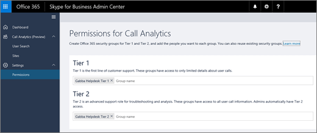

# Skype for Business 通話分析を設定します。

Skype for Business Online の管理者にするには、Skype for Business のトラブルシューティングに通話の分析を使用して Microsoft チーム通話の品質との接続の問題。通話の分析では、次の機能を設定すると便利です。
  
- ヘルプデスク エージェントなど、その他の担当者ができるように、通話の分析を使用する権限を設定して、Skype for Business 管理センターの残りの部分にアクセスすることができません。 
    
- 通話の分析に .tsv または .csv のデータ ファイルをアップロードして、文書、サイト、およびテナントの情報を追加します。
    
> [!NOTE]
> 通話の分析は、現在のプレビューです。テキストと画像がここに示されたは、操作が一致しない場合があります。 
  
## 通話の分析の権限を設定します。

管理者は、通話の分析のすべての機能へのフル アクセスを取得します。さらに、着信分析層 1 と第 2 のアクセス許可グループを含むでヘルプデスク モデルを使用することができます。階層の 1 の権限を持つユーザーは、通話の分析の制限付きビューだけにアクセスできます。第 2 の権限を持つユーザーは、通話の分析のすべての機能にアクセスできます。両方のアクセス許可レベルは、残りの Skype for Business 管理センターへのアクセスを防止します。階層へのアクセスの許可を付与するには、階層 1 または権限のページの [第 2] セクションに、ユーザーが含まれているグループを追加します。詳細については、[通話の分析の階層型のアクセス許可を設定する](set-up-call-analytics.md#BKMK_SetUpTier)を参照してください。
  
階層 1 ヘルプデスク担当者は、通話品質の基本的な問題を処理します。第 1 層エージェントは、会議が、ユーザーに関する問題を調査しません。関連する情報を収集、第 2 のエージェントにエスカレートします。第 2 エージェントは、階層 1 エージェントからが非表示にする詳細な通話ログの情報を参照してください。次の表は、通話の分析を使用してエージェントに使用できる情報の概要を示します。

|**アクティビティ**|**通話の分析などの情報**|**階層 1 エージェントが表示されます。**|**第 2 エージェントが表示されます。**|
|:-----|:-----|:-----|:-----|
|**通話**   |発信者の名前    |のみ、エージェントの検索対象のユーザーの名前。    |ユーザーの名前です。    |
||受信者の名前    |ユーザーの内部と外部のユーザーが表示されます。    |受信者の名前です。    |
||発信者の電話番号    |最後の 3 つの数字を除く全体の電話番号は、アスタリスク記号と特殊文字で解読されます。たとえば、15552823。 します。    |最後の 3 つの数字を除く全体の電話番号は、アスタリスク記号と特殊文字で解読されます。たとえば、15552823。 します。    |
||受信者の電話番号    |最後の 3 つの数字を除く全体の電話番号は、アスタリスク記号と特殊文字で解読されます。たとえば、15552823。 します。    |最後の 3 つの数字を除く全体の電話番号は、アスタリスク記号と特殊文字で解読されます。たとえば、15552823。 します。    |
||**通話の詳細** > **詳細設定**] タブ   |情報は表示されません。    |すべて詳細については、デバイスの名前、IP アドレス、サブネット マッピング、およびなどに表示されます。    |
||**通話の詳細** > **詳細** > **デバッグ**] タブ   |情報は表示されません。    |DNS サフィックスと SSID など、表示されるすべての詳細。    |
|**会議**   |参加者の名前    |のみ、エージェントの検索対象のユーザーの名前。他の参加者は、内部ユーザーまたは外部ユーザーに識別します。    |すべての名前が表示されます。    |
||参加者の数    |参加者の数です。    |参加者の数です。    |
||セッションの詳細    |セッションの詳細については以下の例外が表示されます。エージェントが検索対象のユーザーの名前のみが表示されます。他の参加者は、内部ユーザーまたは外部ユーザーに識別します。最後の電話番号のアスタリスク記号と特殊文字で解読の 3 つの数字です。    |セッションの詳細が表示されます。ユーザー名とセッションの詳細を表示します。最後の電話番号のアスタリスク記号と特殊文字で解読の 3 つの数字です。    |
   
 **通話の分析の階層型のアクセス許可を設定する**
 
  
1. 層 1 と 2 の層の Office 365 セキュリティ グループを作成し、各グループに人を追加します。既存のセキュリティ グループ再利用することもできます。詳細については、[作成、編集、または Office 365 管理センターでセキュリティ グループを削除する](https://support.office.com/article/55c96b32-e086-4c9e-948b-a018b44510cb)を参照してください。
    
2. Office 365 管理センターで、**管理センター**に移動 > **Skype for Business**します。
    
    > [!NOTE]
    > 古い Skype for Business 管理センターにアクセスする場合は、**付属の新しい管理センターを実行してください**] をクリックして、新しいバージョンに移動します。 
  
3. 新しい Skype for Business 管理センターでは、[**権限**] をクリックします。
    
4. [**階層の 1**と**第 2** ] ボックスに、Office 365 セキュリティ グループを追加します。役割ごとに複数のグループを追加することができます。
    
     
  
 どちらのアクセス許可レベルを持つユーザーは、専用の URL *https://adminportal.services.skypeforbusiness.com*経由で通話の分析を表示します。
  
## サイトの構築を追加して、情報のテナントに .tsv または .csv ファイルをアップロードします。

.Csv または .tsv ファイルをアップロードして、通話の分析に文書、サイト、およびテナントの情報を追加できます。このすべての情報を通話分析は、物理的な場所に IP アドレスをマップすることができます。ヘルプデスクまたはするエージェント役に立つ情報傾向通話の問題のためにします。たとえば、品質に問題を呼び出すのような多くのユーザーが同じ文書はなぜですか。 
  
![スクリーン ショットは、サイトの数およびサブネット数の値を持つサイト] ページと、.tsv または .csv ファイルをアップロードすることで、サイトのデータをインポートするファイルの選択] ボタンが表示されます。](../images/b2f3a5cb-32b5-4f60-a9af-0691aa6ff1e8.png)
  
Skype for Business の管理者の場合、ビジネス オンライン通話品質のダッシュ ボードの Skype から既存のデータ ファイルを使用することができます。最初に、通話品質のダッシュ ボード] からファイルをダウンロードしてを呼び出す分析にアップロードします。既存のデータ ファイルをダウンロードするには、 **Skype for Business 管理センター**に移動 > **ツール** > **Skype for Business Online 通話品質のダッシュ ボード** > **アップロードするようになりました**。**[アップロード**] ボックスの一覧で、目的のファイルの横にある [**ダウンロード**] をクリックします。
  
ゼロから .tsv または .csv ファイルを作成する場合は、[テナントのデータ ファイルの形式と文書のデータ ファイルの構造](turning-on-and-using-call-quality-dashboard.md#BKMKTenantDataFile)を参照してください。
  
## 関連トピック

[不適切な Skype for Business のトラブルシューティングに使用する通話分析通話品質](use-call-analytics-to-troubleshoot-poor-call-quality.md)

[通話の分析手法と通話品質のダッシュ ボードの違いは何ですか。](difference-between-call-analytics-and-call-quality-dashboard.md)