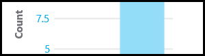
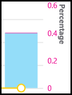
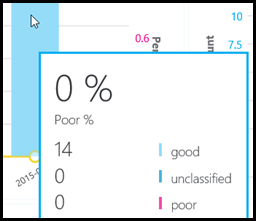
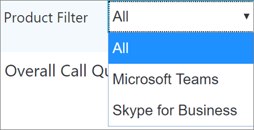
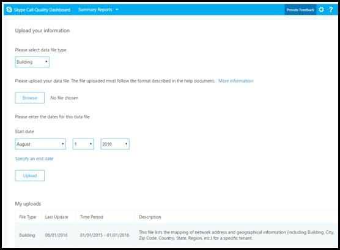
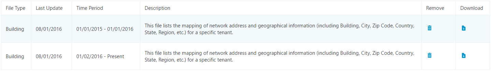

# 有効にして、マイクロソフトのチームと Skype のオンライン ビジネスの品質のダッシュ ボードの呼び出しを使用して

呼び出し品質ダッシュ ボードを使用して、通話の品質を監視するために Office 365 の組織を構成する方法について説明します。
  
マイクロソフト チームの呼び出し品質ダッシュ ボード (救難) とオンライン ビジネスの Skype では、ビジネス サービスのマイクロソフトのチームと Skype を使用して行われた通話の品質の洞察を得るために。 このトピックでは、データの収集を開始するために完了する必要があります手順について説明します。
  
> [!NOTE]
> 救難の詳細なレポートは、現在テクニカル プレビューとして使用可能ですが、すべての顧客に利用できます。 
  
## 最新の変更と更新

救難に最新の変更内容は次のとおりです。
  
- ビジネスをオンラインでのデータの Skype の他のマイクロソフトのチーム データが含まれます。
    
- サマリー レポートには、ビジネスをオンラインでのデータのすべてのデータ、マイクロソフトのチームのデータ、または Skype を選択するのには製品のフィルターが含まれます。

- ビデオおよび VBSS のストリームの品質分類ロジックが更新されました。 最新の分類子の定義については、[品質のダッシュ ボードの呼び出しでストリームの分類](stream-classification-in-call-quality-dashboard.md)を参照してください。

[ディメンションとメジャーのコール品質のダッシュ ボードで使用可能な](dimensions-and-measures-available-in-call-quality-dashboard.md)一覧については、この資料を参照してください。
  
> [!NOTE]
> リンクをクリックしてダッシュ ボードに対する更新や変更についての情報を参照して、**朗報!** ダッシュ ボードに表示する場合のバナーです。
  
## Microsoft 呼び出し品質ダッシュ ボード (救難) の要約レポートをアクティブにします。

救難を使用する前に、Office 365 の組織を有効にする必要があります。
 
 **Skype for Business の管理センターを使用する**
 
1. 、管理者アカウントを使用して、Office 365 の組織にサインインし、管理センターを開くに**管理者**のタイルを選択します。
    
2. **管理センター**を、下の左側のウィンドウで開くには、Skype のビジネス管理センターに**ビジネス用の Skype**を選択します。
    
3. Skype のビジネス管理センターでは、左側のウィンドウで**ツール**を選択し、 **Skype**ビジネス オンライン コール品質のダッシュ ボードのします。
    
     
  
4. [開く] ページで、グローバル管理者アカウントでサインインし、が表示されたら、アカウントの資格情報を提供します。
    
     
  
サインイン後、1 回だけをアクティブ化、CQD はデータの収集と処理を開始します。
  
> [!NOTE]
> いくつかのレポートには意味のある結果を表示するための十分なデータの処理に時間がかかる場合があります。 
  
## オンライン ビジネスの Skype の通話品質のダッシュ ボードの機能

救難の概要のレポートでは、計画の詳細なレポート機能のサブセットを提供します。 ここで 2 つのエディションの相違点の概要します。
  
|**機能**|**サマリー ・ レポート**|**詳細なレポート**|
|:-----|:-----|:-----|
|アプリケーション共有の指標    |なし    |あり    |
|お客様の情報のサポートを構築します。    |あり    |あり    |
|ドリルダウン分析サポート    |なし    |あり    |
|メディアの信頼性の指標    |なし    |あり    |
|ボックスのレポート    |あり    |あり    |
|プロジェクト概要のレポート    |あり    |あり    |
|ユーザーごとにレポートのセット    |なし    |あり    |
|レポートのカスタマイズの設定 (追加、削除、レポートの変更)    |なし    |あり    |
|ビデオ ベースの画面の測定値を共有    |なし    |あり    |
|ビデオの測定基準    |なし    |あり    |
|利用可能なデータ量です。    |過去 6 か月    |過去 6 か月    |
|マイクロソフト チームのデータ    |あり    |あり    |
   
### ボックスのレポート

救難の両方のエディションは、- の標準を提供する経験をすることが、新しいレポートを作成する必要のない品質基準を呼び出します。 表示を開始するには、バックエンドのデータが処理されると、レポートのデータの品質を呼び出します。
  
### プロジェクト概要のレポート

救難の両方のエディションに、全体的な通話品質については、高度なエントリ ポイントを提供するが、サマリー レポートに情報を表示する方法の詳細なレポートの場合と異なる。
  
サマリー ・ レポートを簡単に参照し、全体的な通話品質のステータスと傾向を理解できるようにするシンプルなタブ付きページのレポート ビューを提供します。
  
4 つのタブは次のとおりです。
  
- **呼び出しの全体的な品質**のでは、すべてのストリームは、ストリームのクライアント サーバーの集約とクライアント ストリームと同様に別々 のサーバー ・ クライアントと毎月と毎日の傾向として、クライアントのストリームに関する情報を提供します。
    
- **サーバ ・ クライアント**・ サーバーとクライアントのエンドポイント間でのストリームの追加の詳細情報を提供します。
    
- **クライアント - クライアント**- クライアントの 2 つのエンドポイント間でのストリームの追加の詳細情報を提供します。
    
- **音声品質の SLA**では、呼び出し、Skype ビジネス オンライン音声品質の SLA に含まれているに関する情報を提供します。
    
### 全体的な品質の電話] タブ

ストリームの数と割合の低下を見て、通話品質のステータスと傾向を評価するために、このタブでデータを使用します。 右上隅の凡例は、どの色と視覚的な要素は、これらの測定値を表すかを示しています。
  

  
ストリームは、3 つのグループに分類されます: 良い、悪い、および未分類。 あるも計算 *% が不適切な*値はように分類されたストリームの合計数*が低い*と分類するストリームの比率です。 *% の低下 = 低下ストリーム/(不適切なストリーム + 良いストリーム) * 100* 、これにより、 *% の低下*は、*未分類*の複数のストリームが存在することによって影響を受けていません。 用途として不適切なまたは適切なストリームをクラス分けするため、[品質のダッシュ ボードの呼び出しでストリームの分類](stream-classification-in-call-quality-dashboard.md)を参照してください。
  
左側のスケールを使用すると、ストリームの数の値を測定できます。
  

  
右側のスケールを使用すると、低下の % 値を測定できます。
  

  
バーの上にマウスを合わせると、実際の数値を取得することもできます。
  
> [!NOTE]
> 次の例では、非常に小規模なサンプル データ セットから、値は実際の展開を写実的です。 
  

  
ストリームの全体のボリュームは、重要な要因を判断する方法に関連する集計の割合は低いのです。 報告された不適切な割合の値は、ストリームの全体的な量が小さいほど、信頼性が低いです。
  
### クライアント サーバー] タブと [クライアントのタブ

これら 2 つのタブは、そのエンドポイントのエンドポイントへのシナリオで行われたストリームの追加の詳細情報を提供します。 両方のタブには、メディア ストリームがフローする 4 つのシナリオを表す 4 つの折りたたみ可能なセクションがあります。
  
- 内ワイヤード (有線)
    
- 外ワイヤード (有線)
    
- Wifi の内側
    
- Wifi 外
    
#### 内部テスト

処理中に救難のバックエンドは、存在する場合*の内側*または*外側*建物の情報を使用してストリームを分類します。 各ストリームのエンドポイントでは、サブネット アドレスに関連付けられます。 アップロードされた建物の情報で InsideCorp をマークするサブネットの一覧で、サブネットがある場合は、*内部*見なされます。 建物情報がまだアップロードされていない場合、テスト中は常にストリームとして分類*外側*。 クライアント サーバー シナリオのテストの中にクライアント エンドポイントのみと見なされることに注意してください。 サーバーであるため常に外部ユーザーの観点からこの加算されません、テストします。
  
#### Wifi とワイヤード (有線)

名前が示す、これは、クライアント接続の種類に基づく分類の基準。 もう一度、サーバーが常にワイヤード (有線) し、それは計算に含まれていません。
  
> [!NOTE]
> Wifi ネットワークに接続されている 2 つのエンドポイントのいずれかの場合に、ストリームを指定し、として分類されます救難の Wifi。 
  
## レポートに表示する製品データを選択します。

製品のすべてのデータを表示するのには**製品のフィルター**のドロップダウン メニューを使用する概要および強化されたレポートの場所では、マイクロソフトのチームのデータのみに使用する場合、またはオンライン ビジネスのデータを Skype だけです。
  

  
詳細なレポートは、マイクロソフトのチームまたは Skype のオンライン ビジネスのデータをレポートの定義の一部としてデータをフィルター選択するのには **、チーム**の分析コードを使用できます。
  
## アップロードの構築について

救難の概要レポートのダッシュ ボードには、**テナントのデータのアップロード**] ページで、右上隅で [設定] メニューから**テナントのデータのアップロード**を選択することによってアクセスが含まれています。 このページは地理的な情報は、IP アドレスのマッピングなど、独自の情報をアップロードするのには管理者の使用などの各ワイヤレス AP とその MAC アドレスのマッピング、します。
  

  
1. **テナント データのアップロード**] ページで、アップロードするファイルの種類を選択するのにドロップ ダウン メニューを使用します。 ファイルのデータ型は、ファイルの内容を表します (たとえば、「建物」は、IP アドレスのマッピングと同様に他の地理的な情報を構築) します。 現在構築のデータ型はサポートのみです。 以降のリリースでは、いくつかの複数のデータ型が追加されます。
    
2. ファイルのデータ型を選択すると、データ ファイルを選択する**参照**ををクリックします。
    
  - .Tsv (タブ区切り) ファイルまたは .csv (コンマ区切り値) ファイル、データ ファイルがある必要があります。 .Csv ファイルを使用する場合は、コンマを含む任意のフィールド引用符で囲む必要がありますもコンマを削除します。 などの場合は、建物の名前は、ニューヨーク州、ニューヨーク州、.csv ファイルで、必要がありますとして入力する「ニューヨーク州、ニューヨーク州」。
    
  - データ ファイルは、サイズが 50 MB を超えるする必要があります。
    
  - ファイル内の各列は、データ ファイルごとに、このトピックの後半で説明、定義済みのデータ型を一致しなければなりません。
    
3. データ ファイルを選択すると、**開始日**と、必要に応じて、**終了日を指定**を指定します。
    
4. **開始日**を選択すると、救難サーバーにファイルをアップロードして**アップロード**を選択します。
    
    ファイルをアップロードすると、前に、最初に検証されます。 検証、Azure blob に格納されます。 Azure blob に格納する検証が失敗した場合またはファイルが失敗したかどうか、ファイルへの修正を要求するエラー メッセージが表示されます。 次の図は、データ ファイル内の列の数が正しくないときに発生するエラーを示しています。
    
     
  
5. 検証中にエラーが発生しない場合、ファイルのアップロードは成功します。 そのページの下部にある現在のテナントのすべてのアップロードされたファイルの完全な一覧を表示 **、アップロード**の表にデータがアップロードされたファイルを表示できます。
    
    各レコードは、データ ファイル、ファイルの種類、最終更新時刻、期間、説明、[削除] アイコンと、ダウンロード アイコンのアップロードされたテナントの 1 つを示しています。 ファイルを削除するには、表に、ごみ箱] アイコンを選択します。 ファイルをダウンロードするには、テーブルの [**ダウンロード**] 列でのダウンロード アイコンを選択します。
    
     
  
### テナント データのファイル形式とデータ ファイルの構造を構築

アップロードするデータ ファイルの形式では、アップロードする前に検証チェックに合格するのには以下を満たす必要があります。
  
- .Tsv ファイルには、行ごとに列がタブで区切られたまたはコンマで区切られた各列を含む .csv ファイルのいずれか、ファイルがある必要があります。
    
- データ ファイルの内容には、テーブルの見出しが含まれていません。 ヘッダーではないなどの「ネットワーク」は、データ ファイルの最初の行には、実際のデータ必要があることなどです。
    
- 列ごとにデータ型は、必ず文字列、数値、またはブール値です。 値が数値値をする必要があります数の場合は、Bool の場合、値は 0 または 1 のいずれかにする必要があります。
    
- 列ごとにデータ型が文字列である場合、データ空にすることができます (ですが、まだ、適切な区切り文字 (つまり、タブまたはカンマ) で区切る必要があります。 これだけでフィールドに割り当て、その空の文字列値。
    
- 行ごとに 14 の列が存在する必要があります各列には、次のデータ型、および列は、次の表に記載されている順序である必要があります。
    
|**列名**|**データ型**|**例**|
|:-----|:-----|:-----|
|ネットワーク    |文字列    |192.168.1.0    |
|ネットワーク名リソース    |文字列    |米国/シアトル/シアトル-海-1    |
|NetworkRange    |数値    |26    |
|BuildingName    |文字列    |シアトル-海-1    |
|OwnershipType    |文字列    |Contoso 社    |
|BuildingType    |文字列    |IT 終了    |
|BuildingOfficeType    |文字列    |エンジニア リング    |
|市区町村    |文字列    |調布市調布ヶ丘    |
|ZipCode    |文字列    |98001    |
|国    |文字列    |ご    |
|都道府県    |文字列    |WA    |
|Region    |文字列    |MSU    |
|InsideCorp    |ブール値    |1    |
|ExpressRoute    |ブール値    |0    |
   
> [!IMPORTANT]
> スーパー (1 つのルーティング プレフィックスを持つ複数のサブネットの組み合わせ) を表すには、ネットワークの範囲を使用できます。 任意の重複する範囲のすべての新しい文書のアップロードがチェックされます。 以前構築ファイルをアップロードした場合は、現在のファイルをダウンロードし、再すべての重複を識別し、再度アップロードする前に問題を修正するのには。 レポート内にある建物にサブネットの誤ったマッピング以前アップロードしたファイルの重複している可能性があります。 特定の VPN 実装では、サブネット情報は正確に報告はありません。 お勧めする、サブネットの 1 つのエントリではなく、ファイルを作成する VPN のサブネットを追加するときに別のエントリとして追加されます VPN のサブネットのアドレスごとに別の 32 ビット ネットワーク。 各行には、同じ文書のメタデータを持つことができます。 などの 172.16.18.0/24 の 1 つの行ではなく 256 行は、172.16.18.0/32 と 172.16.18.255/32、包括的なアドレスごとに 1 行を持つ必要があります。 
  
## 詳細なレポートにメディアの種類を選択します。

詳細なレポートでは、オーディオ、ビデオ、アプリケーション共有、および画面共有するメディアの種類のビデオ ・ ベースの品質とメディアの信頼性を見るをサポートします。 ディメンション、メジャー、および 1 つのメディアの種類に固有のフィルターをプレフィックスとして「オーディオ」、「ビデオ」、「AppSharing」、または「VBSS」があります。
  

  
ディメンションと 1 つのメディア タイプのメジャーを表示する場合は、新しいメディアの種類のディメンションとフィルターが必要な可能性があります。 たとえば、合計のセッションは、別のメディアの種類を示すレポートを表示するには、メディアの種類のディメンションが含まれます。
  

## このモジュールは、64 ビットのコンピューターでのみサポートされ、Microsoft ダウンロード センターの「Skype for Business Online 用 Windows PowerShell モジュール」からダウンロードできます。
[Skype for Business の通話分析をセットアップする](set-up-call-analytics.md)

[分析機能の呼び出しを使用して不適切な通話の音質をトラブルシューティングするには](use-call-analytics-to-troubleshoot-poor-call-quality.md)

[呼び出しを分析し、通話品質のダッシュ ボード](difference-between-call-analytics-and-call-quality-dashboard.md)

  
 