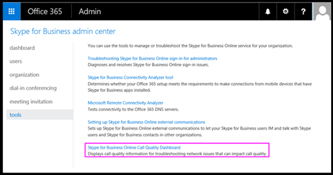
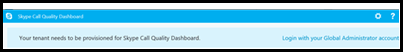
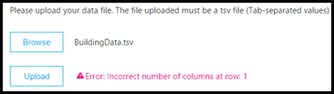
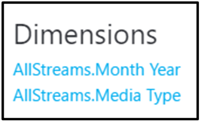

# 有効にして、Microsoft チームと Skype for Business Online 通話品質のダッシュ ボードを使用します。

通話品質を監視する通話品質のダッシュ ボードを使用する Office 365 の組織を設定する方法について説明します。
  
Microsoft チームの通話品質のダッシュ ボード (CQD) と Skype for Business Online を使用すると、Business services 用 Microsoft チームと Skype を使用して通話の品質をより深く洞察を取得できます。ここでは、手順を完了すると、データの収集を開始する必要があります。
  
> [!NOTE]
> 詳細な CQD レポートは現在 Tech Preview として利用可能なすべてのユーザーに提供します。 
  
## 最新の変更と更新プログラム

CQD に最新の変更は、次のとおりです。
  
- に加えて、Skype for Business Online のデータの Microsoft チーム データが含まれます。
    
- サマリー レポートには、製品フィルターすべてのデータ、マイクロソフトのチームのデータ、または Skype for Business Online のデータにはが含まれます。
    
[ディメンション](dimensions-and-measures-available-in-call-quality-dashboard.md)とメジャー Microsoft チームと Skype for Business Online の品質ダッシュ ボードの電話で利用可能な一覧については、この記事を参照してください。
  
> [!NOTE]
> 更新プログラムとダッシュ ボードへの変更について参照してください] をクリックして**すばらしい!**ダッシュ ボードにします。[[通話品質のダッシュ ボード](https://aka.ms/CQDOnline)に移動できます。 
  
## Microsoft 通話品質のダッシュ ボード (CQD) の概要レポートのライセンス認証を行う

CQD の使用を開始する前に、Office 365 の組織のアクティブ化する必要があります。
  
1. 管理者アカウントを使用して、Office 365 の組織にサインインし、[**管理**] タイル、管理センターを開く] を選びます。
    
2. **管理センター**] の下の左側のウィンドウでは、Skype for Business 管理センターを開くには、 **Skype for Business**を選択します。
    
3. Skype for Business 管理センターでは、左側のウィンドウで**ツール**を選択し、[ **Skype for Business Online 通話品質のダッシュ ボード**] を選びます。
    
     
  
4. 表示されるページをグローバル管理者アカウントでログインしが表示されたら、アカウントの資格情報を提供します。
    
     
  
1 回アクティブ化されている、ログインした後、CQD によってデータの収集と処理が開始されます。
  
> [!NOTE]
> 2 つのレポートに意味のある結果を表示するには、十分なデータを処理するに時間がかかる場合があります。 
  
## オンラインの Skype for Business 通話品質のダッシュ ボードの機能

CQD 概要のレポートでは、予定の詳細なレポート機能のサブセットを提供します。ここでは、2 つのエディションの相違点。
  
|**機能**|**サマリー レポート**|**詳細レポート**|
|:-----|:-----|:-----|
|アプリケーション共有メートル法    |×    |○    |
|顧客の情報のサポート    |○    |○    |
|ドリル ダウン分析のサポート    |×    |○    |
|メディアの信頼性メトリックス    |×    |○    |
|既定のレポート    |○    |○    |
|プロジェクト概要のレポート    |○    |○    |
|ユーザーごとのレポートの設定    |×    |○    |
|レポートのカスタマイズを設定する (追加、削除、レポートの変更)    |×    |○    |
|ビデオを使った画面をメトリックを共有します。    |×    |○    |
|ビデオの基準    |×    |○    |
|データの量    |最後の 6 か月    |最後の 6 か月    |
|Microsoft チーム データ    |○    |○    |
   
### 既定のレポート

CQD のエディションの両方の [の組み込みを提供するエクスペリエンスを提供する通話品質の基準の新しいレポートを作成する必要はありません。表示を開始するには、バックエンドのデータが処理されると、レポートでデータの品質に電話します。
  
### プロジェクト概要のレポート

CQD のエディションの両方が全体の通話品質の情報に高度なエントリ ポイントを提供が要約レポートで情報を表示する方法の詳細なレポートの異なるです。
  
サマリー レポートでは、ユーザーが迅速に参照し、全体的な通話品質の状態と傾向を把握できるようにするタブ ページを簡素化されたレポート ビューを提供します。
  
4 つのタブは次のとおりです。
  
- **通話品質の全体的な**は、すべてのストリームで、サーバー クライアント ストリームの集約とクライアント ストリームに別のサーバー クライアントと傾向の月と日単位の形式でクライアント ストリームに関する情報を表示します。
    
- **サーバーのクライアント**のでは、サーバーとクライアントの端点の間でストリームの詳細についてを提供します。
    
- **クライアント**の - では、2 つのクライアントの端点の間でストリーム追加の詳細情報を提供します。
    
- **音声品質の SLA**には、通話に含まれている、Skype for Business Online の音声品質 SLA に関する情報を表示します。
    
### [通話品質の全体的な] タブ

このタブでデータを使用して、ストリーム カウントと低下パーセンテージを見て、通話品質の状態と傾向を評価します。右上隅の凡例は、これらの測定値を表す色と視覚的な要素を示しています。
  

  
次の 3 つのグループに分類ストリーム: 低い、不明なします。あるも計算*が低下 %*の値として分類をストリームの比率ように * 悪い * 分類ストリームの合計数にします。*低下 % = 低下ストリーム/(低いストリーム + 良いストリーム) * 100* 、これにより、*低下率*は、*未分類*ストリームが複数存在することによって影響を受けません。どのような低下または適切なストリームの分類に使う、[通話品質のしきい値](https://aka.ms/cqd_quality_thresholds)を参照してください。
  
左側の目盛を使用すると、通話の値のカウントを測定できます。
  

  
右側の低下 % の値を測定するのにスケールを使用します。
  

  
バーの上にマウスを置いて、実際の数値を取得することもできます。
  
> [!NOTE]
> 次の例は、非常に小さいサンプル データ セットからし、値は、実際に配置する現実的なします。 
  

  
全体的なストリーム ボリュームは、どのように関連する計算が低下率はの決定に重要な要因です。全体的なストリーム量が小さいほど、信頼性が低いほど低下率を報告された値があります。
  
### クライアント サーバー] タブの [とクライアントのタブ

これら 2 つのタブは、そのエンドポイントの両端のシートのシナリオで行われたストリームに追加の詳細情報を提供します。両方のタブには、[メディア ストリームをフローは 4 つのシナリオを表す、折りたたみ可能な 4 つのセクションがあります。
  
- 内部ワイヤード (有線)
    
- 外部ワイヤード (有線)
    
- Wifi 内側
    
- Wifi 外
    
#### 内側のテスト

処理中に存在する場合、CQD バックエンドは*内側*または*外側*建物の情報を使用する名前を付けてストリームを分類します。各ストリームの端点は、サブネット アドレスに関連付けられます。サブネットがアップロードされた建物の情報のサブネットの一覧である場合は、内部見なされます。建物情報がまだアップロードされていない場合、[内のテストが常にストリームとして分類*外側*します。内部テスト Server クライアントのシナリオのみクライアント エンドポイントを考慮することに注意してください。サーバーが常にための外部ユーザーの観点から、この加算されませんテストします。
  
#### Wifi とワイヤード (有線)

名前が示すクライアント接続の種類に基づいて分類基準です。もう一度、サーバーが常にワイヤード (有線) し、計算に含まれていないこと。
  
> [!NOTE]
> ストリームを指定すると 2 つのエンドポイントのいずれかの Wifi ネットワークに接続されている場合、[として分類されます CQD で Wifi します。 
  
## レポートを表示する製品データを選択します。

すべての製品データを表示する**製品フィルター**のドロップダウン メニューを使用する概要と強化されたレポートの場所で、マイクロソフトのチーム データだけまたは [のみ Skype for Business Online のデータします。
  

  
詳細なレポートは、Microsoft チームまたは Skype for Business Online のデータ レポートの定義の一部としてデータをフィルター処理するのにチーム ディメンションを使用することができます。
  
## アップロード建物の情報

CQD の概要レポートのダッシュ ボードには、右上隅にある [設定] メニューから**テナントのデータのアップロード**を選択してアクセス、**テナントのデータをアップロード**したページが含まれています。このページを使用管理者用の IP アドレスと地理的な情報は、マッピングなどの独自の情報をアップロードするなどの各ワイヤレス アクセス ポイントと MAC アドレスをマッピングします。
  

  
1. **テナントのデータのアップロード**] ページで、[ドロップダウン メニューを使用して、アップロードするファイルの種類を選択します。ファイルのデータ型は、ファイルの内容を示します (たとえば、「作成」を参照する IP アドレスのマッピングをも、その他の地理的な情報を使った)。現在「文書」データ型はサポートのみです。今後のリリースでは、いくつかの他のデータ型が追加されます。
    
2. ファイルのデータ型を選択すると、**参照**をデータ ファイルを選択する] をクリックします。
    
  - データ ファイルは、.tsv (タブ区切り値) ファイルまたは .csv (カンマ区切り値) ファイルである必要があります。場合 .csv ファイルを使用するには、カンマが含まれている任意のフィールドする必要があります引用符を含むがないか、カンマを削除します。たとえば、文書名が NY、NY] の場合、.csv ファイルで、必要がありますとして入力する"NY、NY"。
    
  - データ ファイルを 50 MB を超えることがあります。
    
  - 個々 のデータ ファイル、ファイル内の各列が、このトピックの後半で説明されている定義済みのデータ型と一致する必要があります。
    
3. データ ファイルを選択すると、**開始日**と、必要に応じて、**終了日が指定**を指定します。
    
4. **開始日**を選択すると、**アップロード**CQD サーバーにファイルをアップロードする] を選びます。
    
    ファイルをアップロードする前に、まず検証されます。検証された後、Azure blob に保存されます。Azure blob に格納される検証が失敗したか、ファイルが失敗したかどうか、ファイルへの修正を要求するエラー メッセージが表示されます。次の図では、データ ファイルの列の数が正しくないときに発生するエラーが表示されます。
    
     
  
5. 入力規則の中にエラーが発生しない場合、ファイルのアップロードは成功します。表内の**自分のアップロード**、そのページの下部に現在のテナントのすべてアップロードされたファイルの完全な一覧を表示するデータをアップロードしたファイルを表示できます。
    
    各レコードの表示にアップロードした 1 つのテナント データ ファイル、ファイルの種類、最終更新日時、期間、説明、削除、およびダウンロード アイコンにします。ファイルを削除するには、表内のごみ箱アイコンを選択します。ファイルをダウンロードするには、[テーブルの [**ダウンロード**] 列でダウンロード アイコンを選択します。
    
     
  
### テナント データ ファイル形式で文書のデータ ファイルの構造

アップロードするデータ ファイルの書式には、アップロードする前に確認を通過するのには、次を満たす必要があります。
  
- つまり、行ごとに、列見出しをで区切られて .tsv ファイル、または .csv ファイルをカンマで区切られた各列のいずれかのファイルがあります。
    
- データ ファイルの内容には、テーブルの見出しが含まれていません。ヘッダーしないなどの「ネットワーク」は、データ ファイルの最初の行には、実際のデータ必要があることなどです。
    
- 各列のデータ型できるだけ文字列、数値、またはブール値です。数値の場合は、値があります数値を指定します。ブール値の場合は、値は 0 または 1 は必要があります。
    
- 各列のデータ型が文字列の場合は、データ空 (まだ、適切な区切りで区切る必要がありますが、(タブまたはコンマなど)。これは、したフィールドに割り当て、その空の文字列値。
    
- 必要があります、各行の 14 列と、各列は次のデータが必要です型、および列は、次の表に記載されている順序である必要があります。
    
|**列名**|**データ型**|**{例}**|
|:-----|:-----|:-----|
|ネットワーク    |String    |192.168.1.0    |
|チーム    |String    |米国/シアトル/シアトル-海-1    |
|NetworkRange    |番号    |26    |
|BuildingName    |String    |シアトル-海-1    |
|OwnershipType    |String    |Contoso 社    |
|BuildingType    |String    |IT の終了    |
|BuildingOfficeType    |String    |エンジニア リング    |
|市区町村    |String    |港区    |
|一括    |String    |98001    |
|国    |String    |US    |
|州    |String    |34-2    |
|地域    |String    |MSUS    |
|InsideCorp    |ブール値    |1    |
|ExpressRoute    |ブール値    |0    |
   
> [!IMPORTANT]
> スーパー (1 つのルーティング プレフィックスをいくつかのサブネットの組み合わせ) を表示するのには、ネットワークの範囲を使用できます。重複する範囲のすべての新しい文書のアップロードがチェックされます。文書ファイルを以前にアップロードした場合は、現在のファイルをダウンロードし、もう一度、重複を識別してもう一度アップロードする前に、問題を解決するのには、ください。レポート内の建物サブネットの問題が発生のマッピングで以前にアップロードされたファイルが重複可能性があります。特定の VPN 実装サブネット情報を正確に報告しません。お勧めする VPN サブネットを追加、サブネットの 1 つのエントリの代わりに、[ファイルを作成するときに別のエントリとして追加されます VPN サブネットのアドレスごとに個別の 32 ビット ネットワーク。各行には、同じ文書メタデータをことができます。たとえば、172.16.18.0/24 の 1 つの行ではなく、172.16.18.0/32 と 172.16.18.255/32、範囲のそれぞれのアドレスに 1 つの行を持つ 256 の行が必要です。 
  
## 詳細なレポートでメディアの種類を選択します。

詳細なレポートでは、音声、ビデオ、アプリケーションの共有、および画面共有メディアの種類のビデオを使ったの品質とメディアの信頼性を見てをサポートします。ディメンション、メジャー、および、1 つのメディアの種類に固有のフィルターと接頭辞を「オーディオ」、「ビデオ」、"AppSharing"、または"VBSS"であります。
  

  
ディメンションとメジャーの 1 つのメディアの種類を表示する場合は、新しいメディアの種類のディメンションとフィルター必要があります。たとえば、合計セッションを別のメディアの種類にわたってカウントが表示されているレポートを表示するには、メディアの種類のディメンションを追加します。
  

## 関連トピック
[Skype for Business 通話分析を設定します。](set-up-call-analytics.md)

[通話の分析を使って低下通話品質のトラブルシューティングを行う](use-call-analytics-to-troubleshoot-poor-call-quality.md)

[通話の分析手法と通話品質のダッシュ ボードの違いですか。](difference-between-call-analytics-and-call-quality-dashboard.md)
