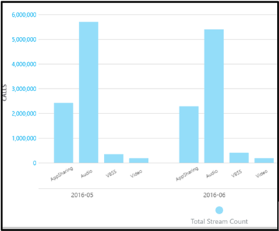

# 有効にして、Microsoft チームと Skype for Business Online 通話品質のダッシュ ボードを使用します。Turning on and using Call Quality Dashboard for Microsoft Teams and Skype for Business Online

通話品質を監視する通話品質のダッシュ ボードを使用する Office 365 の組織を設定する方法について説明します。Learn how to configure your Office 365 organization to use the Call Quality Dashboard to monitor call quality.
  
Microsoft チームの通話品質のダッシュ ボード (CQD) と Skype for Business Online を使用すると、Business services 用 Microsoft チームと Skype を使用して通話の品質をより深く洞察を取得できます。ここでは、手順を完了すると、データの収集を開始する必要があります。The Call Quality Dashboard (CQD) for Microsoft Teams and Skype for Business Online allows you to gain insights into the quality of calls made using Microsoft Teams and Skype for Business services. This topic describes the steps you'll need to complete to start collecting data.
  
> [!NOTE]
> 詳細な CQD レポートは現在 Tech Preview として利用可能なすべてのユーザーに提供します。The CQD detailed reports are currently available as Tech Preview but available to all customers. 
  
## 最新の変更と更新プログラムLatest changes and updates

CQD に最新の変更は、次のとおりです。The most recent changes to CQD are as follows:
  
- に加えて、Skype for Business Online のデータの Microsoft チーム データが含まれます。Includes Microsoft Teams data in addition to Skype for Business Online data.
    
- サマリー レポートには、製品フィルターすべてのデータ、マイクロソフトのチームのデータ、または Skype for Business Online のデータにはが含まれます。Summary reports include a product filter to select all data, Microsoft Teams data, or Skype for Business Online data.
    
[ディメンション](dimensions-and-measures-available-in-call-quality-dashboard.md)とメジャー Microsoft チームと Skype for Business Online の品質ダッシュ ボードの電話で利用可能な一覧については、この記事を参照してください。Refer to this article for a list of [Dimensions and measures available in Call Quality Dashboard for Microsoft Teams and Skype for Business Online](dimensions-and-measures-available-in-call-quality-dashboard.md).
  
> [!NOTE]
> 更新プログラムとダッシュ ボードへの変更について参照してください] をクリックして**すばらしい!**ダッシュ ボードにします。[[通話品質のダッシュ ボード](https://aka.ms/CQDOnline)に移動できます。Information about updates and changes to the dashboard can be found by clicking **Good news!** in the dashboard. You can go to [Call Quality dashboard](https://aka.ms/CQDOnline). 
  
## Microsoft 通話品質のダッシュ ボード (CQD) の概要レポートのライセンス認証を行うActivate Microsoft Call Quality Dashboard (CQD) Summary Reports

CQD の使用を開始する前に、Office 365 の組織のアクティブ化する必要があります。Before you can start using the CQD, you'll need to activate it for your Office 365 organization.
  
1. 管理者アカウントを使用して、Office 365 の組織にサインインし、[**管理**] タイル、管理センターを開く] を選びます。Sign in to your Office 365 organization using an admin account, and then select the **Admin** tile to open the Admin center.
    
2. **管理センター**] の下の左側のウィンドウでは、Skype for Business 管理センターを開くには、 **Skype for Business**を選択します。In the left pane, under **Admin centers**, select **Skype for Business** to open the Skype for Business admin center.
    
3. Skype for Business 管理センターでは、左側のウィンドウで**ツール**を選択し、[ **Skype for Business Online 通話品質のダッシュ ボード**] を選びます。In the Skype for Business admin center, select **Tools** in the left pane, and then select **Skype for Business Online Call Quality Dashboard**.
    
     
  
4. 表示されるページをグローバル管理者アカウントでログインしが表示されたら、アカウントの資格情報を提供します。On the page that opens, log in with your Global Administrator account, and then provide the credentials for the account when prompted.
    
     
  
1 回アクティブ化されている、ログインした後、CQD によってデータの収集と処理が開始されます。After you login, once activated, the CQD will begin collecting and processing data.
  
> [!NOTE]
> 2 つのレポートに意味のある結果を表示するには、十分なデータを処理するに時間がかかる場合があります。It may take a couple of hours to process enough data to display meaningful results in the reports. 
  
## オンラインの Skype for Business 通話品質のダッシュ ボードの機能Features of the Call Quality Dashboard for Skype for Business Online

CQD 概要のレポートでは、予定の詳細なレポート機能のサブセットを提供します。ここでは、2 つのエディションの相違点。CQD Summary Reports provide a subset of the features planned for Detailed Reports. The differences between the two editions are summarized here:
  
|**機能****Feature**|**サマリー レポート****Summary Reports**|**詳細レポート****Detailed Reports**|
|:-----|:-----|:-----|
|アプリケーション共有メートル法Application sharing metric    |×No    |○Yes    |
|顧客の情報のサポートCustomer building information support    |○Yes    |○Yes    |
|ドリル ダウン分析のサポートDrill-down analysis support    |×No    |○Yes    |
|メディアの信頼性メトリックスMedia reliability metrics    |×No    |○Yes    |
|既定のレポートOut-of-the-box reports    |○Yes    |○Yes    |
|プロジェクト概要のレポートOverview reports    |○Yes    |○Yes    |
|ユーザーごとのレポートの設定Per-user report set    |×No    |○Yes    |
|レポートのカスタマイズを設定する (追加、削除、レポートの変更)Report set customization (add, delete, modify reports)    |×No    |○Yes    |
|ビデオを使った画面をメトリックを共有します。Video-based screen sharing metrics    |×No    |○Yes    |
|ビデオの基準Video metrics    |×No    |○Yes    |
|データの量Amount of data available    |最後の 6 か月Last 6 months    |最後の 6 か月Last 6 months    |
|Microsoft チーム データMicrosoft Teams data    |○Yes    |○Yes    |
   
### 既定のレポートOut-of-the-box reports

CQD のエディションの両方の [の組み込みを提供するエクスペリエンスを提供する通話品質の基準の新しいレポートを作成する必要はありません。表示を開始するには、バックエンドのデータが処理されると、レポートでデータの品質に電話します。Both editions of CQD provide an out-of-the-box experience, giving you call quality metrics without the need to create any new reports. Once data is processed in the back-end, you can start seeing call quality data in the reports.
  
### プロジェクト概要のレポートOverview reports

CQD のエディションの両方が全体の通話品質の情報に高度なエントリ ポイントを提供が要約レポートで情報を表示する方法の詳細なレポートの異なるです。Both editions of the CQD provide a high-level entry point to the overall call quality information, but the way information is presented in Summary Reports is different from that of Detailed Reports.
  
サマリー レポートでは、ユーザーが迅速に参照し、全体的な通話品質の状態と傾向を把握できるようにするタブ ページを簡素化されたレポート ビューを提供します。Summary Reports provide a simplified tabbed page report view that enables users to quickly browse and understand the overall call quality status and trends.
  
4 つのタブは次のとおりです。The four tabs include:
  
- **通話品質の全体的な**は、すべてのストリームで、サーバー クライアント ストリームの集約とクライアント ストリームに別のサーバー クライアントと傾向の月と日単位の形式でクライアント ストリームに関する情報を表示します。**Overall Call Quality** - provides information about all streams, which is an aggregation of Server-Client streams and Client-Client streams, as well as separate Server-Client and Client-Client streams, in the form of monthly and daily trends.
    
- **サーバーのクライアント**のでは、サーバーとクライアントの端点の間でストリームの詳細についてを提供します。**Server - Client** - provides additional details for the streams between Server and Client endpoints.
    
- **クライアント**の - では、2 つのクライアントの端点の間でストリーム追加の詳細情報を提供します。**Client - Client** - provides additional details for the streams between two Client endpoints.
    
- **音声品質の SLA**には、通話に含まれている、Skype for Business Online の音声品質 SLA に関する情報を表示します。**Voice Quality SLA** - provides information about calls that are included in the Skype for Business Online Voice Quality SLA.
    
### [通話品質の全体的な] タブOverall Call Quality tab

このタブでデータを使用して、ストリーム カウントと低下パーセンテージを見て、通話品質の状態と傾向を評価します。右上隅の凡例は、これらの測定値を表す色と視覚的な要素を示しています。Use the data on this tab to evaluate call quality status and trends by looking at the stream counts and poor percentages. The legend in the upper-right corner shows which color and visual elements represent these metrics.
  

  
次の 3 つのグループに分類ストリーム: 低い、不明なします。あるも計算*が低下 %*の値として分類をストリームの比率ように \* 悪い \* 分類ストリームの合計数にします。*低下 % = 低下ストリーム/(低いストリーム + 良いストリーム) \* 100* 、これにより、*低下率*は、*未分類*ストリームが複数存在することによって影響を受けません。どのような低下または適切なストリームの分類に使う、[通話品質のしきい値](https://aka.ms/cqd_quality_thresholds)を参照してください。Streams are classified in three groups: Good, Poor, and Unclassified. There are also calculated  *Poor %*  values that give you the ratio of streams classified as \* Poor\*  to the total classified stream count. Since *Poor % = Poor streams/ (Poor streams+ Good streams) \* 100*  , this makes the *Poor %*  unaffected by the presence with multiple *Unclassified*  streams. For what is used for classifying a stream as poor or good, refer to [Call Quality Thresholds](https://aka.ms/cqd_quality_thresholds).
  
左側の目盛を使用すると、通話の値のカウントを測定できます。Use the scale on the left to measure the call count values.
  

  
右側の低下 % の値を測定するのにスケールを使用します。Use the scale on the right to measure the Poor % values.
  

  
バーの上にマウスを置いて、実際の数値を取得することもできます。You can also obtain the actual numerical values by hovering the mouse over a bar.
  
> [!NOTE]
> 次の例は、非常に小さいサンプル データ セットからし、値は、実際に配置する現実的なします。The following example is from a very small sample data set, and the values aren't realistic for an actual deployment. 
  

  
全体的なストリーム ボリュームは、どのように関連する計算が低下率はの決定に重要な要因です。全体的なストリーム量が小さいほど、信頼性が低いほど低下率を報告された値があります。The overall stream volume is an important factor in determining how relevant the calculated Poor percentages are. The smaller the volume of overall stream, the less reliable the reported Poor percentage values are.
  
### クライアント サーバー] タブの [とクライアントのタブServer-Client tab and Client-Client tabs

これら 2 つのタブは、そのエンドポイントの両端のシートのシナリオで行われたストリームに追加の詳細情報を提供します。両方のタブには、[メディア ストリームをフローは 4 つのシナリオを表す、折りたたみ可能な 4 つのセクションがあります。These two tabs provide additional details for the streams that took place in their endpoint-to-endpoint scenarios. Both tabs have four collapsible sections, representing four scenarios under which media streams would flow.
  
- 内部ワイヤード (有線)Wired Inside
    
- 外部ワイヤード (有線)Wired Outside
    
- Wifi 内側Wifi Inside
    
- Wifi 外Wifi Outside
    
#### 内側のテストInside Test

処理中に存在する場合、CQD バックエンドは*内側*または*外側*建物の情報を使用する名前を付けてストリームを分類します。各ストリームの端点は、サブネット アドレスに関連付けられます。サブネットがアップロードされた建物の情報のサブネットの一覧である場合は、内部見なされます。建物情報がまだアップロードされていない場合、[内のテストが常にストリームとして分類*外側*します。内部テスト Server クライアントのシナリオのみクライアント エンドポイントを考慮することに注意してください。サーバーが常にための外部ユーザーの観点から、この加算されませんテストします。During processing, the CQD back-end classifies a stream as  *Inside*  or *Outside*  using Building information, if it exists. Endpoints of each stream are associated with a subnet address. If the subnet is in the list of the subnets in the uploaded Building information, then it is considered Inside. If Building information has not yet been uploaded, then Inside Test will always classify the streams as *Outside*  . Please note that Inside Test for Server-Client scenario only considers the client endpoint. Because servers are always outside from a user's perspective, this isn't accounted for in the test.
  
#### Wifi とワイヤード (有線)Wired vs. wifi

名前が示すクライアント接続の種類に基づいて分類基準です。もう一度、サーバーが常にワイヤード (有線) し、計算に含まれていないこと。As the names indicate, this is a classification criteria based on the type of client connections. Again, server is always wired and it isn't included in the calculation.
  
> [!NOTE]
> ストリームを指定すると 2 つのエンドポイントのいずれかの Wifi ネットワークに接続されている場合、[として分類されます CQD で Wifi します。Given a stream, if one of the two endpoints is connected to a Wifi network, then it is classified as Wifi in CQD. 
  
## レポートを表示する製品データを選択します。Selecting product data to see in reports

すべての製品データを表示する**製品フィルター**のドロップダウン メニューを使用する概要と強化されたレポートの場所で、マイクロソフトのチーム データだけまたは [のみ Skype for Business Online のデータします。In the Summary and Location Enhanced Reports, you can use the **Product Filter** drop-down to show all product data, only Microsoft Teams data, or only Skype for Business Online data.
  

  
詳細なレポートは、Microsoft チームまたは Skype for Business Online のデータ レポートの定義の一部としてデータをフィルター処理するのにチーム ディメンションを使用することができます。In Detailed reports, you can use the Teams dimension to filter the data to Microsoft Teams or Skype for Business Online data as part of defining the report.
  
## アップロード建物の情報Upload Building information

CQD の概要レポートのダッシュ ボードには、右上隅にある [設定] メニューから**テナントのデータのアップロード**を選択してアクセス、**テナントのデータをアップロード**したページが含まれています。このページを使用管理者用の IP アドレスと地理的な情報は、マッピングなどの独自の情報をアップロードするなどの各ワイヤレス アクセス ポイントと MAC アドレスをマッピングします。The CQD Summary Reports dashboard includes a **Tenant Data Upload** page, accessed by selecting **Tenant Data Upload** from the settings menu in the top-right corner. This page is used for admins to upload their own information, such as mapping of IP address and geographical information, mapping each wireless AP and its MAC address, etc.
  

  
1. **テナントのデータのアップロード**] ページで、[ドロップダウン メニューを使用して、アップロードするファイルの種類を選択します。ファイルのデータ型は、ファイルの内容を示します (たとえば、「作成」を参照する IP アドレスのマッピングをも、その他の地理的な情報を使った)。現在「文書」データ型はサポートのみです。今後のリリースでは、いくつかの他のデータ型が追加されます。On the **Tenant Data Upload** page, use the drop-down menu to choose a data file type for uploading. The file data type denotes the content of the file (for example, "Building" refers to mapping of IP address and building as well as other geographical information). Currently we are only supporting the "Building" data type. A few more data types will be added with subsequent releases.
    
2. ファイルのデータ型を選択すると、**参照**をデータ ファイルを選択する] をクリックします。After selecting the file data type, click **Browse** to choose a data file.
    
  - データ ファイルは、.tsv (タブ区切り値) ファイルまたは .csv (カンマ区切り値) ファイルである必要があります。場合 .csv ファイルを使用するには、カンマが含まれている任意のフィールドする必要があります引用符を含むがないか、カンマを削除します。たとえば、文書名が NY、NY] の場合、.csv ファイルで、必要がありますとして入力する"NY、NY"。The data file must be a .tsv (Tab-separated values) file or a .csv (Comma-separated value) file. If using a .csv file, any field that contains a comma must contain quotes or have the comma removed. For example, if your building name is NY,NY, in the .csv file it should be entered as "NY,NY".
    
  - データ ファイルを 50 MB を超えることがあります。The data file must be no larger than 50MB in size.
    
  - 個々 のデータ ファイル、ファイル内の各列が、このトピックの後半で説明されている定義済みのデータ型と一致する必要があります。For each data file, each column in the file must match a predefined data type, discussed later in this topic.
    
3. データ ファイルを選択すると、**開始日**と、必要に応じて、**終了日が指定**を指定します。After selecting a data file, specify **Start date** and, optionally, **Specify an end date**.
    
4. **開始日**を選択すると、**アップロード**CQD サーバーにファイルをアップロードする] を選びます。After selecting **Start date**, select **Upload** to upload the file to the CQD server.
    
    ファイルをアップロードする前に、まず検証されます。検証された後、Azure blob に保存されます。Azure blob に格納される検証が失敗したか、ファイルが失敗したかどうか、ファイルへの修正を要求するエラー メッセージが表示されます。次の図では、データ ファイルの列の数が正しくないときに発生するエラーが表示されます。Before the file is uploaded, it is first validated. Once validated, it is stored in an Azure blob. If validation fails or the file fails to be stored in an Azure blob, an error message is displayed requesting a correction to the file. The following image shows an error occurring when the number of columns in the data file is incorrect.
    
     
  
5. 入力規則の中にエラーが発生しない場合、ファイルのアップロードは成功します。表内の**自分のアップロード**、そのページの下部に現在のテナントのすべてアップロードされたファイルの完全な一覧を表示するデータをアップロードしたファイルを表示できます。If no errors occur during validation, the file upload will succeed. You can then see the uploaded data file in the **My uploads** table, which shows the full list of all uploaded files for the current tenant at the bottom of that page.
    
    各レコードの表示にアップロードした 1 つのテナント データ ファイル、ファイルの種類、最終更新日時、期間、説明、削除、およびダウンロード アイコンにします。ファイルを削除するには、表内のごみ箱アイコンを選択します。ファイルをダウンロードするには、[テーブルの [**ダウンロード**] 列でダウンロード アイコンを選択します。Each record shows one uploaded tenant data file, with file type, last update time, time period, description, remove, and a download icon. To remove a file, select the trash bin icon in the table. To download a file, select the download icon in the **Download** column of the table.
    
     
  
### テナント データ ファイル形式で文書のデータ ファイルの構造Tenant data file format and Building data file structure

アップロードするデータ ファイルの書式には、アップロードする前に確認を通過するのには、次を満たす必要があります。The format of the data file you upload must meet the following to pass the validation check before uploading.
  
- つまり、行ごとに、列見出しをで区切られて .tsv ファイル、または .csv ファイルをカンマで区切られた各列のいずれかのファイルがあります。The file must be either a .tsv file, which means, in each row, columns are separated by a TAB, or a .csv file with each column separated by a comma.
    
- データ ファイルの内容には、テーブルの見出しが含まれていません。ヘッダーしないなどの「ネットワーク」は、データ ファイルの最初の行には、実際のデータ必要があることなどです。The content of the data file doesn't include table headers. That means the first line of the data file should be real data, not headers like "Network," etc.
    
- 各列のデータ型できるだけ文字列、数値、またはブール値です。数値の場合は、値があります数値を指定します。ブール値の場合は、値は 0 または 1 は必要があります。For each column, the data type can only be String, Number, or Bool. If it is Number, the value must be a numeric value; if it is Bool, the value must be either 0 or 1.
    
- 各列のデータ型が文字列の場合は、データ空 (まだ、適切な区切りで区切る必要がありますが、(タブまたはコンマなど)。これは、したフィールドに割り当て、その空の文字列値。For each column, if the data type is string, the data can be empty (but still must be separated by an appropriate delimited (i.e., a tab or comma). This just assigns that field an empty string value.
    
- 必要があります、各行の 14 列と、各列は次のデータが必要です型、および列は、次の表に記載されている順序である必要があります。There must be 14 columns for each row, and each column must have the following data type, and the columns must be in the order listed in the following table:
    
|**列名****Column Name**|**データ型****Data type**|**{例}****Example**|
|:-----|:-----|:-----|
|ネットワークNetwork    |StringString    |192.168.1.0192.168.1.0    |
|チームNetworkName    |StringString    |米国/シアトル/シアトル-海-1USA/Seattle/SEATTLE-SEA-1    |
|NetworkRangeNetworkRange    |番号Number    |2626    |
|BuildingNameBuildingName    |StringString    |シアトル-海-1SEATTLE-SEA-1    |
|OwnershipTypeOwnershipType    |StringString    |Contoso 社Contoso    |
|BuildingTypeBuildingType    |StringString    |IT の終了IT Termination    |
|BuildingOfficeTypeBuildingOfficeType    |StringString    |エンジニア リングEngineering    |
|市区町村City    |StringString    |港区Seattle    |
|一括ZipCode    |StringString    |9800198001    |
|国Country    |StringString    |USUS    |
|州State    |StringString    |34-2WA    |
|地域Region    |StringString    |MSUSMSUS    |
|InsideCorpInsideCorp    |ブール値Bool    |11    |
|ExpressRouteExpressRoute    |ブール値Bool    |00    |
   
> [!IMPORTANT]
> スーパー (1 つのルーティング プレフィックスをいくつかのサブネットの組み合わせ) を表示するのには、ネットワークの範囲を使用できます。重複する範囲のすべての新しい文書のアップロードがチェックされます。文書ファイルを以前にアップロードした場合は、現在のファイルをダウンロードし、もう一度、重複を識別してもう一度アップロードする前に、問題を解決するのには、ください。レポート内の建物サブネットの問題が発生のマッピングで以前にアップロードされたファイルが重複可能性があります。特定の VPN 実装サブネット情報を正確に報告しません。お勧めする VPN サブネットを追加、サブネットの 1 つのエントリの代わりに、[ファイルを作成するときに別のエントリとして追加されます VPN サブネットのアドレスごとに個別の 32 ビット ネットワーク。各行には、同じ文書メタデータをことができます。たとえば、172.16.18.0/24 の 1 つの行ではなく、172.16.18.0/32 と 172.16.18.255/32、範囲のそれぞれのアドレスに 1 つの行を持つ 256 の行が必要です。The network range can be used to represent a supernet (combination of several subnets with a single routing prefix). All new building uploads will be checked for any overlapping ranges. If you have previously uploaded a building file, you should download the current file and re-upload it to identify any overlaps and fix the issue before uploading again. Any overlap in previously uploaded files may result in the wrong mappings of subnets to buildings in the reports. Certain VPN implementations do not accurately report the subnet information. It is recommended that when adding a VPN subnet to the building file, instead of one entry for the subnet, separate entries are added for each address in the VPN subnet as a separate 32-bit network. Each row can have the same building metadata. For example, instead of one row for 172.16.18.0/24, you should have 256 rows, with one row for each address between 172.16.18.0/32 and 172.16.18.255/32, inclusive. 
  
## 詳細なレポートでメディアの種類を選択します。Selecting media type in detailed reports

詳細なレポートでは、音声、ビデオ、アプリケーションの共有、および画面共有メディアの種類のビデオを使ったの品質とメディアの信頼性を見てをサポートします。ディメンション、メジャー、および、1 つのメディアの種類に固有のフィルターと接頭辞を「オーディオ」、「ビデオ」、"AppSharing"、または"VBSS"であります。The detailed reports support looking at quality and media reliability for audio, video, application sharing, and video-based screen-sharing media types. Dimensions, measures, and filters that are specific for a single media type have "Audio", "Video", "AppSharing", or "VBSS" as a prefix.
  

  
ディメンションとメジャーの 1 つのメディアの種類を表示する場合は、新しいメディアの種類のディメンションとフィルター必要があります。たとえば、合計セッションを別のメディアの種類にわたってカウントが表示されているレポートを表示するには、メディアの種類のディメンションを追加します。If you want to view the dimensions and measures for a single media type, the new MediaType dimension and filter may be required. For example, to have a report that shows the total session counts across different media types, include the MediaType dimension.
  

## 関連トピックRelated topics
[Skype for Business 通話分析を設定します。Set up Skype for Business Call Analytics](set-up-call-analytics.md)

[通話の分析を使って低下通話品質のトラブルシューティングを行うUse Call Analytics to troubleshoot poor  call quality](use-call-analytics-to-troubleshoot-poor-call-quality.md)

[通話の分析手法と通話品質のダッシュ ボードの違いですか。Difference between Call Analytics and Call Quality Dashboard?](difference-between-call-analytics-and-call-quality-dashboard.md)
