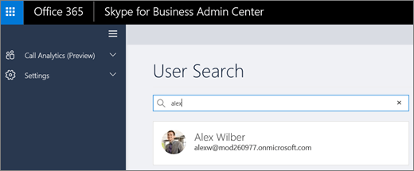

# 通話分析を使用して低い通話品質をトラブルシューティングするUse Call Analytics to troubleshoot poor call quality

呼び出しの分析では、Microsof チームと、ビジネスの Skype の呼び出し、または接続の問題をトラブルシューティングすることができます。Call Analytics helps you to troubleshoot call or connection problems with Microsof Teams and Skype for Business. コール分析では、Office 365 アカウントでデバイス、ネットワーク、および呼び出しと各ユーザーの会議のための接続に関する詳細情報が表示されます。Call Analytics shows detailed information about the devices, networks, and connectivity for the calls and meetings of each user in your Office 365 account. サイトを作成する場合と、テナント情報が追加されました分析機能の呼び出しを呼び出し、およびセッションごとにも表示されます。If building, site, and tenant information has been added to Call Analytics, it will also be shown for each call and session. 情報分析機能の呼び出しを使用できます不適切な呼び出しを持っていた理由の解明や、会議を経験します。Information available via Call Analytics can help you figure out why a user had a poor call or meeting experience. 
  
> [!NOTE]
> 呼び出しの分析では、マイクロソフトのチームと Skype ビジネス管理センターのhttps://admin.teams.microsoft.com。Call Analytics is now available in the Microsoft Teams and Skype for Business admin center at https://admin.teams.microsoft.com.  ヘルプデスク エージェントのアクセス許可とネットワーク トポロジのアップロードがで使用できる新しい管理ポータルで、今後数か月。Helpdesk agent permissions and network topology upload will be available in the new admin portal in the coming months.  エンドポイントを使用する続行する間に、https://adminportal.services.skypeforbusiness.comの第 1 層および第 2 層のヘルプデスクへのアクセス。In the meantime you can continue to use the endpoint at https://adminportal.services.skypeforbusiness.com for Tier 1 and Tier 2 helpdesk access.
  
## 分析機能の呼び出しを使用して通話品質の問題のトラブルシューティングを行うTroubleshoot call quality problems using Call Analytics

自分に割り当てられたアクセス許可レベルは、どのような種類の情報へのアクセスにある分析機能を呼び出すかを決定します。The permissions level assigned to you determines what type of information you have access to in Call Analytics:
  
- **ビジネス管理者の Skype**: 分析機能を呼び出すと、Skype のビジネス管理センターですべての情報へのアクセスがあります。**Skype for Business admin**: You have access to all the information in Call Analytics and in the Skype for Business Admin center.
    
- **第 1 層のアクセス許可を持つヘルプデスク エージェント**: 限られた分析機能の呼び出しでデータを参照してください。**Helpdesk agent with Tier 1 permissions**: You see a limited set of data in Call Analytics. 呼び出しのトラブルシューティングを行うことができますが、第 2 層のエージェントに会議の問題を入稿するでしょう。You can troubleshoot calls, but you'll hand off problems with meetings to a Tier 2 agent. ビジネス管理センターは、Skype の残りの部分にアクセスする必要はありません。You don't have access to the rest of the Skype for Business Admin center.
    
- **層 2 のアクセス許可を持つヘルプデスク エージェント**: 分析の呼び出しで使用可能なすべてのデータを参照してくださいし、通話や会議の両方に関する問題のトラブルシューティングに役立ちます。**Helpdesk agent with Tier 2 permissions**: You see all available data in Call Analytics and can help troubleshoot problems with both calls and meetings. ビジネス管理センターは、Skype の残りの部分にアクセスする必要はありません。You don't have access to the rest of the Skype for Business Admin center.
    
アクセス許可についてのヘルプが必要な場合は、ビジネス管理者は、Skype を参照してください。See your Skype for Business admin if you need help with permissions.
  
 **第 1 層または 2 層のヘルプデスク エージェントとしての分析機能の呼び出しを開く****Open Call Analytics as a Tier 1 or Tier 2 helpdesk agent**
  
1. Office 365 の管理ページに移動し、職場、学校のアカウントを使用してサインインします。Go to the Office 365 admin center and sign in using your work or school account. Web ブラウザーには、 *https://adminportal.services.skypeforbusiness.com*。Then in your web browser go to *https://adminportal.services.skypeforbusiness.com*.
    
2. で**ユーザーの検索**呼び出しのトラブルシューティングを行うし、一覧からユーザーを選択するをユーザーの名前または sip のいずれかのアドレスを入力します。In **User Search**, start typing either the name or sip address of the user whose calls you want to troubleshoot and then select the user from the list.
    
    
  
3. **履歴を呼び出す**には、トラブルシューティングを行う、電話または会議を選択します。In **Call history**, select the call or meeting that you want to troubleshoot.
    
    ![スクリーン ショットは、日付と時刻、受信者、およびオーディオの品質の概要と、7 日間の品質との会議や呼び出し、アクティビティの概要、ユーザーの連絡先の詳細などの情報を持つユーザーの呼び出し履歴] ページを示しています。](../images/aef80e09-3b37-46db-8e7b-8cf71712349b.png)
  
4. [**詳細設定**] タブを選択し、不適切な呼び出しの品質または接続の問題を示す黄色と赤色の項目を検索します。Select the **Advanced** tab, and then look for yellow and red items which indicate poor call quality or connection problems.
    
    各コールまたは会議のセッションの詳細] では、軽微な問題は黄色で表示されます。In the session details for each call or meeting, minor issues appear in yellow. (たとえば、次のスクリーン ショットでは、値、平均変位、変位の最大値、および平均パケット損失の割合が黄色で)。何かが黄色の場合正常範囲の外にあるとそれが原因になっている問題は、問題の主な原因をする可能性があります。(For example, in the following screenshot, the values are in yellow for Average jitter, Max jitter, and Average packet loss rate.) If something is yellow, it's outside of normal range, and it may be contributing to the problem, but it's unlikely to be the main cause of the problem. 何かが赤い場合は、これは重大な問題と、このセッションの呼び出しが不適切な品質の主な原因である可能性が。If something is red, it's a significant problem, and it's likely the main cause of the poor call quality for this session. 
    
    ![スクリーン ショットは、軽微な問題があり、受信ネットワーク セクションが展開され、平均変位、最大のジッターおよび平均パケット損失率のデータが、色を黄色で表示されているユーザーの呼び出し履歴の詳細設定] タブを示します。](../images/13f314ce-97cf-4bd0-a147-14b177d07040.png)
  
まれに、経験のデータの品質はありませんオーディオ ・ セッションを受信しました。In rare cases, quality of experience data isn't received for audio sessions. 多くの場合これはによる呼び出しを削除し、接続を終了して、クライアントを使用しています。Often this is caused by the call dropping and connection with the client terminating. このような場合は、セッションの評価は「使用可能」ではありません。When this occurs, the session rating is "unavailable".
  
エクスペリエンス (QoE) データの品質を持っているオーディオ ・ セッションには、次の表は「が低下します。」としてセッションに適用される主な問題点を示します。For audio sessions that do have quality of experience (QoE) data, the following table describes major issues that qualify a session as "poor."
  
|**問題****Issue**|**エリア****Area**|**説明****Description**|
|:-----|:-----|:-----|
|呼び出しのセットアップCall setup    |セッションSession    |20 ~ 29 の Ms の diag のエラーコードでは、呼び出しのセットアップが失敗したことを示します。The error code Ms-diag 20-29 indicates the call setup failed. ユーザーは、通話や会議に参加できませんでした。The user couldn't join the call or meeting.    |
|オーディオ ネットワークに不適切な呼び出しが分類されます。Audio network classified poor call    |セッションSession    |ネットワークの品質の問題は、パケット損失、ジッター、NMOS の低下、RTT などの分野において発生したまたは比率を非表示。Network quality issues were encountered in areas such as packet loss, jitter, NMOS degradation, RTT, or concealed ratio. 不適切な呼び出しを分類するための条件の詳細については、この[マイクロソフトのブログ記事](https://go.microsoft.com/fwlink/p/?linkid=852133)を参照してください。For more information about the conditions used to classify poor calls, see this [Microsoft blog post](https://go.microsoft.com/fwlink/p/?linkid=852133).    |
|デバイスが機能しません。Device not functioning    |デバイスDevice    | デバイスが正常に機能はありません。A device isn't functioning correctly. 比率が機能していないデバイスは次のとおりです。Device not functioning ratios are :    DeviceRenderNotFunctioningEventRatio > = 0.005DeviceRenderNotFunctioningEventRatio >= 0.005    DeviceCaptureNotFunctioningEventRatio > = 0.005DeviceCaptureNotFunctioningEventRatio >= 0.005   |
   
## このモジュールは、64 ビットのコンピューターでのみサポートされ、Microsoft ダウンロード センターの「Skype for Business Online 用 Windows PowerShell モジュール」からダウンロードできます。Related topics
[Skype for Business の通話分析をセットアップするSet up Skype for Business Call Analytics](set-up-call-analytics.md)

[呼び出しを分析し、通話品質のダッシュ ボードCall Analytics and Call Quality Dashboard](difference-between-call-analytics-and-call-quality-dashboard.md)

  
 
