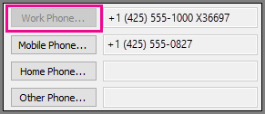

# 割り当て、変更、またはユーザーの電話番号を削除Assign, change, or remove a phone number for a user

Office 365 のプランの呼び出しを設定すると、ユーザーに電話番号を割り当てます。When you set up Calling Plans in Office 365, you assign phone numbers to your users. 

マイクロソフト チーム クライアントで、**呼び出し**をクリックしたときに割り当てる電話番号が表示されます。In the Microsoft Teams client, the phone number you assign will be listed when they click **Calls**.

ビジネス クライアント用の Skype、電話番号を割り当てる、[**勤務先電話番号**] ボックスに表示されますでのユーザーによって変更することはできません。In the Skype for Business client, the phone number you assign will be listed in the **Work Phone** box and can't be changed by a user.
  

  
> [!IMPORTANT]
> ユーザーは、[ビジネス用の Skype を自分の電話番号を変更](https://support.office.com/article/20e03cc1-c023-4e5d-bafd-064ddb59ed5e)し、内の電話番号を希望する場合ビジネス アプリケーションの Skype は変更できませんまたは淡色表示、それらによって管理者が設定では、それらの方法を変更できないことです。If a user wants to [change his or her phone number for Skype for Business](https://support.office.com/article/20e03cc1-c023-4e5d-bafd-064ddb59ed5e) and the phone number in the Skype for Business app can't be changed or is grayed out, that means an admin has set it for them and it can't be changed by them.
  
## 番号を割り当てることAssigning a number

時を設定するユーザーを行う、電話をかけたり受けたり、まずビジネス管理センターは、Skype を使用し、電話番号を割り当てる必要がありますを変更したりする必要がある場合は、電話番号を削除するようにします。When you are setting up users so they can make and receive phone calls, you must first use the Skype for Business admin center and assign a phone number, but you can change or remove the phone number if you need to.
  
Office 365 のプランを呼び出すことを取得する方法とをかかる費用については、 [Skype](../skype-for-business-and-microsoft-teams-add-on-licensing/skype-for-business-and-microsoft-teams-add-on-licensing.md)を参照してください。To learn how to get Calling Plans in Office 365 and how much they cost, see [Skype for Business and Microsoft Teams add-on licensing](../skype-for-business-and-microsoft-teams-add-on-licensing/skype-for-business-and-microsoft-teams-add-on-licensing.md).
  
> [!NOTE]
> **ビジネス管理センターの Skype**では、ユーザーが割り当てられているライセンスを持っているかどうかを確認する方法の 1 つ > **音声** > **音声ユーザー**とユーザーを選択します。One way to see whether a user has a license assigned is by going to **Skype for Business admin center** > **Voice** > **Voice users** and selecting the user. ライセンスが割り当てられている場合は、**割り当てられたライセンス**の下で表示されます。If a license is assigned, it will be noted under **Assigned license**. Office 365 の管理ページを使用できます。You also can use the Office 365 admin center. 
  
 **ユーザーに電話番号を割り当てる****Assign a phone number to a user**
  
1. 職場または学校のアカウントを使用して、Office 365 にサインインします。Sign in to Office 365 with your work or school account.
    
2. **Office 365 管理センター**を参照して > **管理センター** > **ビジネス用の Skype**です。Go to **Office 365 admin center** > **Admin centers** > **Skype for Business**.
    
3. 左のメニューの [**音声**] をクリックします > **音声ユーザー**です。In the left navigation, click **Voice** > **Voice users**.
    
    **重要**: Skype for Business 管理センターの左のナビゲーションに [ **音声**] オプションが表示されるようにするには、最初に **Enterprise E5 ライセンス**、 **電話システム**アドオン ライセンス、または **電話会議**アドオン ライセンスを少なくとも 1 件購入する必要があります。**IMPORTANT**: For you to see the **Voice** option in the left navigation in the Skype for Business admin center, you must first buy at least one **Enterprise E5 license**, one **Phone System** add-on license, or one **Audio Conferencing** add-on license.
    
4. **ボイス ユーザー**ページを見つけて、ユーザーまたはユーザーに電話番号を指定するを選択します。On the **Voice users** page, locate and select the user or users that you want to assign a phone number to.
    
5. [操作] ウィンドウで、**割り当てる番号**をクリックします。In the Action pane, click **Assign number**.
    
6. [**割り当てる番号の選択**] ボックスの一覧で**番号を割り当てる**] ページで、ユーザーの電話番号を選択します。On the **Assign number** page in the **Select number to assign** list, select the phone number for the user.
    
    > [!TIP]
    > 任意の電話番号一覧が表示されない場合する必要があります[、ユーザーの電話番号を取得](getting-phone-numbers-for-your-users.md)する最初にします。If you don't see any phone numbers listed, you need to [Getting phone numbers for your users](getting-phone-numbers-for-your-users.md) first. または、 **Skype**を使用する場合は > **音声** > **電話番号**] ページで、**追加**] をクリックし、[**新しいユーザーの番号**] をクリックします。Or, if you use the **Skype for Business admin center** > **Voice** > **Phone numbers** page, click **Add**, and then click **New user numbers**. 
  
7. 割り当てまたは**緊急の場所を検証する] を選択**するにはを [関連付けられている緊急アドレスを変更するには、か、一覧から場所を選択または、多くの場所が定義されている場合は、検索ボックスに、都市の名前を入力し、[**検索**] をクリックします。To assign or change the associated emergency address, under **Select validated emergency location**, either select the location from the list or, if you have many locations defined, enter the name of the city in the search box and click **Search**.
    
8. 電話番号と緊急時の場所を選択した後 [**保存**] をクリックします。After you pick the phone number and emergency location, click **Save**.
    
    > [!NOTE]
    > により、Office 365 とオンライン ビジネスの Skype との間の遅延時間、かかることが可能性のあるユーザーを有効にするには、最大で 24 時間です。Because of the latency between Office 365 and Skype for Business Online, it can possibly take up to 24 hours for users to be enabled. 後 24 時間、電話番号が正しく割り当てられていない場合は、[管理者ヘルプのビジネス製品のお問い合わせ](https://support.office.com/article/32a17ca7-6fa0-4870-8a8d-e25ba4ccfd4b)をしてください。If after 24 hours, if the phone number isn't assigned correctly, please [Contact support for business products - Admin Help](https://support.office.com/article/32a17ca7-6fa0-4870-8a8d-e25ba4ccfd4b). 私たちはここに役立つ!We're here to help! 
  
## 数値を変更します。Changing a number

 **ユーザーの電話番号を変更するのには****To change a phone number for a user**
  
1. 職場または学校のアカウントを使用して、Office 365 にサインインします。Sign in to Office 365 with your work or school account.
    
2. **Office 365 管理センター**を参照して > **管理センター** > **ビジネス用の Skype**です。Go to **Office 365 admin center** > **Admin centers** > **Skype for Business**.
    
3. 左のメニューの [**音声**] をクリックします > **音声ユーザー**です。In the left navigation, click **Voice** > **Voice users**.
    
4. **ボイス ユーザー**ページを見つけて、または複数のユーザー用の電話番号を変更するを選択します。On the **Voice users** page, locate and select the user or users that you want to change a phone number for.
    
5. [操作] ウィンドウで、**割り当て番号**の下の [**変更**] をクリックします。In the Action pane, under **Assigned number**, click **Change**. 
    
6. **番号の割り当て**] ページで、**変更番号**をクリックします。On the **Assign number** page, click **Change number**.
    
7. **番号を割り当てる**] ページの [**割り当てる番号を選択して**、リストを使用して、新しい電話番号を選択します。On the **Assign number** page, under **Select number to assign**, use the list to select the new phone number. 
    
8. 関連の緊急時のアドレスを変更するには、**場所を変更**] をクリックしてください [**緊急時のアドレスを変更**するか、場所を一覧から選択したり、定義されている多くの場所があれば、検索ボックスに、都市の名前を入力し] をクリックしてください**検索**します。To change the associated emergency address, click **Change location**, and then under **Change emergency address to**, either select the location from the list or, if you have many locations defined, enter the name of the city in the search box and click **Search**.
    
9. [ **保存**] をクリックします。Click **Save**.
    
## 数値を削除します。Removing a number

 **ユーザーから電話番号を削除するのには****To remove a phone number from a user**
  
1. 職場または学校のアカウントを使用して、Office 365 にサインインします。Sign in to Office 365 with your work or school account.
    
2. **Office 365 管理センター**を参照して > **管理センター** > **ビジネス用の Skype**です。Go to **Office 365 admin center** > **Admin centers** > **Skype for Business**.
    
3. 左のメニューの [**音声**] をクリックします > **音声ユーザー**です。In the left navigation, click **Voice** > **Voice users**.
    
4. **ボイス ユーザー**ページを見つけて、または複数のユーザーの電話番号を削除するを選択します。On the **Voice users** page, locate and select the user or users that you want to remove the phone number for.
    
5. [操作] ウィンドウで、[**割り当ての数**、[**削除**] をクリックします。In the Action pane, under **Assigned number**, click **Remove**. 
    
6. **削除が選択されている番号を割り当てられているですか?** ] ページで、[**はい**] をクリックします。On the **Remove selected assigned number?** page, click **Yes**.
    

## このモジュールは、64 ビットのコンピューターでのみサポートされ、Microsoft ダウンロード センターの「Skype for Business Online 用 Windows PowerShell モジュール」からダウンロードできます。Related topics
[住所検証についてWhat is address validation?](what-is-address-validation.md)

[[Skype for Business 新しい電話番号の申請](../what-are-calling-plans-in-office-365/manage-phone-numbers-for-your-organization/manage-phone-numbers-for-your-organization.md)] に移動することによって、電話番号を取得するために利用できるすべてのフォームを一覧表示してダウンロードすることができます。[Manage phone numbers for your organization](../what-are-calling-plans-in-office-365/manage-phone-numbers-for-your-organization/manage-phone-numbers-for-your-organization.md)

[緊急通話の利用条件Emergency calling terms and conditions](emergency-calling-terms-and-conditions.md)

[Skype for Business Online: 緊急通話の免責事項ラベルSkype for Business Online: Emergency Calling disclaimer label](https://go.microsoft.com/fwlink/?LinkID=692099)

  
 