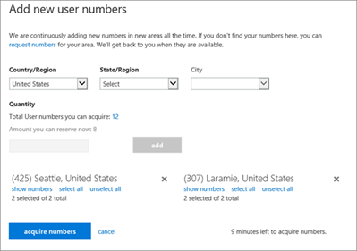
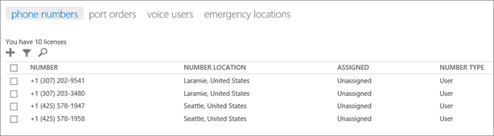

# プランの呼び出しを設定します

ビジネス ユーザー向けの他の Skype への呼び出しを自由が、ユーザーが、組織では、外からの電話を呼び出せるようにする場合、国内を呼び出すことを計画、または、国際の呼び出し Office 365 で。 お客様のビジネスにこれを設定するのには簡単です。 
  
## 手順 1: ライセンスを購入して割り当てる

1. Office 365 の機能では、電話システムが計画に含まれていない場合は、**電話システム**のアドオンのライセンスを購入する必要があります。 **電話システム**用のライセンスを取得したら、 [Office 365 のプランを呼び出すこと](../skype-for-business-and-microsoft-teams-add-on-licensing/calling-plans-for-office-365.md)を購入します。 [Skype](../skype-for-business-and-microsoft-teams-add-on-licensing/skype-for-business-and-microsoft-teams-add-on-licensing.md)を参照してくださいし、計画とのライセンスを購入します。 
    
    > [!TIP]
    > **電話システム**用のライセンスと Office 365 のプランを呼び出すことは、計画の呼び出しを購入するためのオプションを表示するには、**電話システム**のライセンスを最初にいる必要がありますので、移動します。
  
2. 最初のライセンスを割り当てるし、計画を呼び出して、組織内のユーザーに割り当てます。 「[Skype for Business と Microsoft Teams のライセンスを割り当てる](../skype-for-business-and-microsoft-teams-add-on-licensing/assign-skype-for-business-and-microsoft-teams-licenses.md)」をご覧ください。
    
## 手順 2: 電話番号を取得する

米国外に居住している場合は、セットアップの手順が多少異なります。 一部の国/地域で Office 365 から取得する電話番号や電話番号を転送する緊急アドレスを取得するためです。 、米国以外の場合は、最初は[手順 3: 緊急時のアドレスと、組織の場所を追加](set-up-calling-plans.md#bkmk_add_addresses)、操作を行いますし、**ステップ 2: 電話番号を取得する**。
  
1. Office 365 から電話番号を使用する場合は、以下の手順を実行します。 **別のサービス プロバイダーでは、既存の電話番号を転送する必要がある場合の手順で[Office 365 に電話番号を転送](transfer-phone-numbers-to-office-365.md)**います。
    
2. 職場または学校のアカウントを使用して、Office 365 にサインインします。
    
3. Go to the **Office 365 admin center** > **Admin centers** > **Skype for Business >** **Voice**.

    > [!IMPORTANT] 
    > ビジネス管理センターの Skype では、左側のナビゲーションの**音声**オプションを表示するため、まず**E5 のエンタープライズ ライセンス**を少なくとも 1 つ、1 つの**電話システム**のアドオン ライセンスまたはアドオンのライセンスが 1 つの**電話会議**を購入する必要があります。
   
4. Choose **Phone numbers**. あるアイディアを提供する方法に、**電話システム**のライセンス数が表示されます多くの電話番号を要求します。
    
    > [!TIP]
    > ライセンスを保有する電話番号より多くの電話番号を取得できます。 電話番号の数を取得することを確認するのに、ライセンス数を取得、ライセンスの数の 10% を追加し、10 します。 たとえば、100 ライセンスを購入している場合は、120 の電話番号を取得できます。 参照してください[番号の数を取得しますか?](how-many-phone-numbers-can-you-get.md) 
  
5. **追加新しい番号**を選択して > **新しいユーザーの数**、**新しいユーザー番号の追加**] ページで、[国/地域、都道府県名、市区町村から番号を選択するを選択します。
    
6.  この地域で組織に必要な電話番号の数を [ **数量**] に入力し、[ **追加**] をクリックして予約を作成します。
    
    > [!CAUTION]
    > 電話番号を選ぶ時間は 10 分間あります。 10 分後は、電話番号は Office 365 に電話番号のプールに返されます。 
  
    次の図では、9 分を取得するのには左に 2 つの異なる都市の電話番号が追加されているかを確認できます。 
    
     
  
7. [ **番号の表示**] を選択すると、電話番号の完全なリストが表示されます。これは、特定の電話番号を希望しない場合に役立ちます。
    
8. 電話番号を選択し、[**番号を取得**します。
    
9. **音声**ページに戻りますすべての番号が表示されるを買収しました。
    
    
  
## 手順 3: 組織用の緊急対応の住所と場所を追加する

1. **緊急の場所**を選択して [**音声**] ページで、 > **新しいアドレスを追加**します。
    
2. [ **新しい住所**] ウィンドウで、住所の名前を入力し、残りのボックスの入力を完了します。
    
     
  
    > [!TIP]
    > 上の図のように、英語圏のお客様で街路名が数字の場合は、必ず末尾に「st」または「th」を付けます。 
  
3. [ **検証**] を選択します。
    
    必要な場合は、住所の訂正を求められます。 
    
    > [!CAUTION]
    > 住所または公的アドレスの検証では、住所が正規の住所で、形式が正しいことが確認されます。 緊急アドレスは部分的に正しいなど、市区町村の名前を誤って入力する場合と渡すことがまだ検証が可能です。 誤記があっても検証をパスした場合、誤記がある市区町村名と住所の他の正しい部分の組み合わせによって、適切な緊急派遣センターに通話をルーティングするために十分な情報になります。 
  
    > [!TIP]
    > 緊急応答用に住所に修正が必要な場合は、住所が更新されたことを通知する緑色のバナーが表示されます。 
  
4. 住所が検証されたら、[ **保存**] を選びます。
    
## 手順 4: ユーザーに電話番号と緊急対応の住所を割り当てる

> [!TIP]
> この手順を実行する直前にさらにユーザーを追加すると、[ **音声ユーザー**] ページにユーザーが表示されるまでに **数時間** かかることがあります。これには遅延時間があります。
  
1. **ボイス ユーザー**ページで、電話番号と緊急時のアドレスを割り当てたいユーザーを選択します。
    
2. [操作] ウィンドウで、**割り当てる番号**をクリックします。
    
3. **番号の割り当て**] ページで、**割り当てる番号の選択**] ボックスの一覧で、ユーザーの電話番号を選択します。
    
4. 緊急アドレスを選択するには、都市の名前をボックスに入力し、**検索**を選択します。
    
    > [!IMPORTANT]
    > 米国外である場合、数値既に緊急アドレスでは、ですが、ここで変更することができます。 「[ユーザーの緊急対応の住所を割り当てるまたは変更する](assign-or-change-an-emergency-address-for-a-user.md)」をご覧ください。 
  
5. 電話番号と緊急対応の住所の両方を割り当てたら、[ **保存**] を選びます。
    
## 手順 5: 新しい電話番号をユーザーに通知する

新しい電話番号をユーザーに通知する場合は、メールを送信するか、または各組織が指定する方法で行うことをお勧めします。 

以下は、**ビジネスの Skype**アプリでは、その電話番号を表示できる方法です。
  
1. デスクトップで Skype for Business にサインインします。
    
2. Choose **Settings** > **Tools** > **Options**. 
    
     
  
3. 次に、[ **電話**] を選びます。 
    
    
 
**マイクロソフトのチーム**では、ユーザーは、左側のナビゲーションで**の呼び出し**をクリックすると、その電話番号を表示できます。 電話番号は、ダイヤル パッドの上に表示されます。

## その他の情報

- 緊急対応の住所は、行政上の住所、所在地住所、または現住所と呼ばれることがあります。緊急対応の住所は、組織の事業所の場所を示す所在地住所または行政上の住所のことです。
    
- 緊急対応の場所は検証されません。緊急対応の住所だけが検証されます。
    
- 緊急対応の住所の詳細については、「[緊急対応の場所、アドレス、通話ルーティングの概要](what-are-emergency-locations-addresses-and-call-routing.md)」をご覧ください。
    
## 電話番号の割り当ての自動化

Windows PowerShell を使うことができる場合は、次のコマンドレットを使用して、ユーザーへの電話番号の割り当てを自動化できます。 
  
- [Get-CsOnlineTelephoneNumber](https://technet.microsoft.com/en-us/library/mt243818.aspx): Business Voice Directory から電話番号を取得します。
    
- [Set-CsOnlineVoiceUser](https://technet.microsoft.com/en-us/library/mt243817.aspx): 電話番号を設定します。
    
詳しくは、「[クイック リファレンス: Windows PowerShell を使用した一般的な Skype for Business Online の管理タスクの実行](https://technet.microsoft.com/en-us/library/dn362776%28v=ocs.15%29.aspx)」ご覧ください。
  
    > [!NOTE]
    > If you need to get more telephone numbers than this, please [contact support for business products - Admin Help](https://support.office.com/en-us/article/32a17ca7-6fa0-4870-8a8d-e25ba4ccfd4b)

[!INCLUDE [LinkedIn Learning Info](../../common/office/linkedin-learning-info.md)]

## [米国 (無料の電話番号) 用の承認状 (LOA) (v.2.0)](http://download.microsoft.com/download/F/0/1/F01AE714-0F3C-4D9D-B41A-DFD180EC1622/Letter of Authorization %28LOA%29 for the U.S. (Toll Free numbers) (v.3.1) (en-US).pdf)
電話番号の管理フォームのダウンロード

[通話プランで使用されるさまざまな種類の電話番号](different-kinds-of-phone-numbers-used-for-calling-plans.md)

[[Skype for Business 新しい電話番号の申請](../what-are-calling-plans-in-office-365/manage-phone-numbers-for-your-organization/manage-phone-numbers-for-your-organization.md)] に移動することによって、電話番号を取得するために利用できるすべてのフォームを一覧表示してダウンロードすることができます。

[緊急通話の利用条件](emergency-calling-terms-and-conditions.md)

[Skype for Business Online: 緊急通話の免責事項ラベル](https://go.microsoft.com/fwlink/?LinkID=692099)

## フィードバックですか。
製品に関するフィードバックを提供するには、かをお知らせいただいて、取り組み方は、 [Skype](https://www.skypefeedback.com)を参照してください。