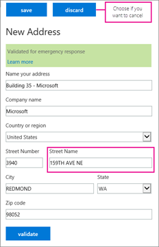

# プランの呼び出しを設定します。

他の Skype for Business ユーザーの呼び出し、無料ですが、ユーザーを組織の外部で電話をかけることができる場合は、Office 365 で、された国内通話プランまたは、国際通話プランを取得します。ビジネス用にこれを設定するのには簡単です。 
  
## 手順 1: 購入して、ライセンスを割り当てる

1. 電話システムで Office 365 の機能では、現在のプランに含まれていない場合、は、**電話システムで**アドオン ライセンスを購入する必要があります。**電話システムで**のライセンスを取得したら、 [Office 365 のプランの呼び出し](../skype-for-business-and-microsoft-teams-add-on-licensing/calling-plans-for-office-365.md)を購入します。[Skype for Business や Microsoft チーム アドオンのライセンス](../skype-for-business-and-microsoft-teams-add-on-licensing/skype-for-business-and-microsoft-teams-add-on-licensing.md)を表示し、ライセンス、プランを購入します。 
    
    > [!TIP]
    > ライセンスの**電話システム**と Office 365 のプランの呼び出しは、プランの呼び出しを購入する] オプションを表示するには、**電話システムで**ライセンスを最初にいる必要がありますので、まとめて移動します。
  
2. まず、ライセンスを割り当てるし、呼び出しを計画、組織のユーザーに割り当てます。[ビジネスや Microsoft チームのライセンスを割り当てる Skype](../skype-for-business-and-microsoft-teams-add-on-licensing/assign-skype-for-business-and-microsoft-teams-licenses.md)を参照してください。
    
## 手順 2: は、電話番号を取得します。

米国外の場合は、手順の順序を少し変更します。一部の国/地域で Office 365 から取得した電話番号に電話番号に転送する緊急アドレスを取得するためです。、米国以外の場合は、まずは[手順 3: 緊急アドレスと、組織の場所を追加する](set-up-calling-plans.md#bkmk_add_addresses)、し操作**手順 2: 電話番号を取得する**します。
  
1. Office 365 からの電話番号を使用している場合は、次の手順に従います。**別のサービス プロバイダーから既存の電話番号に転送する必要がある場合の手順[を Office 365 に電話番号を転送](transfer-phone-numbers-to-office-365.md)**います。
    
2. 職場または学校のアカウントで Office 365 にサインインします。
    
3. **Office 365 管理センター**に移動 > **管理センター** > **Skype for Business >** **音声**します。

    > [!IMPORTANT] 
    > Skype for Business 管理センターの左のナビゲーションで [**音声**] オプションが表示するには、少なくとも 1 つの**エンタープライズ E5 ライセンス**、**電話システムで**アドオン ライセンスは 1 つ、または 1 つの**音声会議**アドオン ライセンスを購入する必要があります。
   
4. **電話番号**を選択します。ある比べた場合にどのようにして、**電話システムで**のライセンス数が表示されます多くの電話番号を要求します。
    
    > [!TIP]
    > その他の電話番号のライセンス数を超えるを取得することができます。数の電話番号を取得することを確認するのには、ライセンス数を取る、ライセンスの数を 10% を追加し、10 を追加します。たとえば、100 のライセンスを購入した場合は、120 の電話番号を取得できます。表示[数の数値で入手できますか?](how-many-phone-numbers-can-you-get.md) 
  
5. [**新しい番号を追加**] を選びます > **新しいユーザー番号**、**新しいユーザーの番号を追加する**ページで、[国/地域、/地域、都道府県、市区町村から番号を選択する] を選びます。
    
6.  [**数量**] は、この領域では、組織に必要な電話番号の数を入力し、予約を作成するのには**追加**] をクリックします。
    
    > [!CAUTION]
    > 自分の電話番号を選択する 10 分しか時間があります。10 分後、Office 365 での電話番号のプールに電話番号が返されます。 
  
    次の図は、9 分間を左から入手するには、次の 2 つの別の都市の電話番号が追加されているかを確認できます。 
    
     ![追加するユーザーの電話番号] ページでの番号を取得するには、目的の領域を指定します。](../images/f6dc1ef3-0bf2-4b4f-b32c-ca27e69c5553.png)
  
7. **数値を表示する**電話番号の完全な一覧を表示することができます。これは、リスト内の特定の電話番号をしたくない場合に便利です。
    
8. 、必要な電話番号を選択し、**番号を取得**します。
    
9. [**音声**] のページに戻ります。 すべての数値が表示される入手しました。
    
    ![[音声のダッシュ ボード] で入手したすべての電話番号が表示されます。](../images/4a9c681c-13f9-4cdc-a25b-93eb00d06b6c.png)
  
## 手順 3: 緊急アドレスや、組織の場所を追加します。

1. [**音声**] ページで、**緊急の場所**を選択 > **新しいアドレスを追加**します。
    
2. **アドレスを新しい**ウィンドウで、[、アドレスの名前を入力し、残りのボックスです。
    
     
  
    > [!TIP]
    > 英語お客様は、住所が数値の場合は、必ず"st"または"th"最後に、上記の図に示すようにします。 
  
3. **検証**] を選びます。
    
    必要な場合は、アドレスを修正するように求められます。 
    
    > [!CAUTION]
    > 番地またはクールなアドレスを検証するには、正当なし、正しい形式であることを確認します。緊急アドレスは部分的に正しいなど、市区町村の名前を入力する場合は、渡すことがまだの入力規則が考えられます。スペルミスがあることがあり、検証、市区町村と他のアドレスの正しい部分のスペルが間違っている名の組み合わせは、適切な緊急ディスパッチ センターに通話をルーティングするには、十分な情報。 
  
    > [!TIP]
    > アドレス緊急の応答を修正する場合は、アドレスが更新されたことを示す緑色のバナーが表示されます。 
  
4. アドレスが検証されると、[**保存**] を選びます。
    
## 手順 4: ユーザーに電話番号と緊急のアドレスを割り当てる

> [!TIP]
> この手順を実行する前に、ビジネスの右側に他の人を追加すると、[**音声ユーザー** ] ページに表示するの**に数時間**がかかることがあります。待機時間があります。
  
1. [**音声ユーザー** ] ページで、電話番号と緊急のアドレスを割り当てたいユーザーを選択します。
    
2. 操作ウィンドウで、**番号を割り当てる**] をクリックします。
    
3. [**番号の割り当て**] ページで、**割り当てる番号の選択**] の一覧で、ユーザーの電話番号を選択します。
    
4. 緊急のアドレスを選択するには、ボックスに市区町村の名前を入力し、**検索**] を選びます。
    
    > [!IMPORTANT]
    > 米国外の場合は、番号を既に緊急のアドレスがここで、変更することができます。[割り当てまたはユーザーの緊急のアドレスを変更する](assign-or-change-an-emergency-address-for-a-user.md)を参照してください。 
  
5. 緊急のアドレスと電話番号を割り当てるした後、[**保存**] を選びます。
    
## 手順 5: ユーザーに通知する、新しい電話番号について

メールを送信する、または、仕事の好みの連絡方法を使用して、新しい電話番号を他のユーザーに伝えるをお勧めします。 

**Skype for Business**アプリでは、その電話番号を表示する方法を示します。
  
1. デスクトップで Skype for Business にサインインします。
    
2. [**設定**] を選びます > **ツール** > **オプション**。 
    
     
  
3. [**電話**] を選びます。 
    
    
 
**Microsoft チーム**は、ユーザーは、左のナビゲーションで**通話**] をクリックして、電話番号を表示できます。ダイヤル パッド上にある、電話番号が表示されます。

![ユーザーは、左のナビゲーションで通話] をクリックして Microsoft チームでその人の番号を表示することができます。](../images/teams-phone-number.png)

## 他に知っておく必要ですか。

- 緊急アドレスはクールなアドレス、住所、住所とも呼ばれます。組織のための適切な場所の住所またはクールなアドレスです。
    
- 緊急の場所が検証は、緊急アドレスのみです。
    
- 緊急アドレスに関するさらに詳しく調べする場合は、「[緊急の場所、アドレスや通話をルーティングする機能ですか?](what-are-emergency-locations-addresses-and-call-routing.md)
    
## 電話番号の割り当てを自動化しますか。

Windows PowerShell がわかっている場合は、ユーザーに割り当てる電話番号を自動化するために、次のコマンドレットを使用することができます。 
  
- [Get CsOnlineTelephoneNumber](https://technet.microsoft.com/en-us/library/mt243818.aspx): Business ボイス ディレクトリからの電話番号を取得します。
    
- [セット CsOnlineVoiceUser](https://technet.microsoft.com/en-us/library/mt243817.aspx): 電話番号を設定します。
    
詳細については、次を参照してください。[のクイック リファレンス: 共通の Skype for Business Online の管理タスクを実行する Windows PowerShell を使用して](https://technet.microsoft.com/en-us/library/dn362776%28v=ocs.15%29.aspx)します。
  
    > [!NOTE]
    > If you need to get more telephone numbers than this, please [contact support for business products - Admin Help](https://support.office.com/en-us/article/32a17ca7-6fa0-4870-8a8d-e25ba4ccfd4b)

[!INCLUDE [LinkedIn Learning Info](../../common/office/linkedin-learning-info.md)]

## 関連トピック
[電話番号のよく寄せられる質問を転送します。](transferring-phone-numbers-common-questions.md)

[さまざまなプランの呼び出し用の電話番号](different-kinds-of-phone-numbers-used-for-calling-plans.md)

[組織の電話番号を管理します。](../what-are-calling-plans-in-office-365/manage-phone-numbers-for-your-organization/manage-phone-numbers-for-your-organization.md)

[緊急の呼び出し元の条項および条件](emergency-calling-terms-and-conditions.md)

[Skype for Business Online: 緊急発信免責事項のラベル](https://go.microsoft.com/fwlink/?LinkID=692099)

