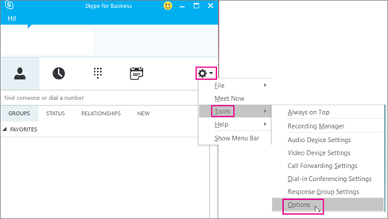

# プランの呼び出しを設定しますSet up Calling Plans
ビジネス ユーザー向けの他の Skype への呼び出しを自由が、ユーザーが、組織では、外からの電話を呼び出せるようにする場合、国内を呼び出すことを計画、または、国際の呼び出し Office 365 で。Calls to other Skype for Business users are free, but if you want your users to be able to call phones outside of your business, get a Domestic Calling Plan or an International Calling Plan in Office 365. お客様のビジネスにこれを設定するのには簡単です。It's easy to set this up for your business. 

## 手順 1: を確認する計画を呼び出し、国/地域で利用可能ですStep 1: Find out if Calling Plans are available in your country/region
[オーディオ会議や予定を呼び出すことで可用性を国や地域](..//country-and-region-availability-for-audio-conferencing-and-calling-plans/country-and-region-availability-for-audio-conferencing-and-calling-plans.md)に移動し、国または地域に関する計画を呼び出すには、利用可能時間情報だけでなく有料の電話会議、電話システム、およびフリー ダイヤル情報を取得するを選択数字、および通信のクレジットです。Go to [Country and region availability for Audio Conferencing and Calling Plans](..//country-and-region-availability-for-audio-conferencing-and-calling-plans/country-and-region-availability-for-audio-conferencing-and-calling-plans.md) and select your country or region to get availability information about Calling Plans, as well as information about Audio Conferencing, Phone System, toll and toll-free numbers, and Communications Credits.
  
## 手順 2: 購入し、ライセンスを割り当てるStep 2: Buy and assign licenses
1. Office 365 の機能では、電話システムが計画に含まれていない場合は、**電話システム**のアドオンのライセンスを購入する必要があります。If the Phone System in Office 365 feature isn't included in your plan, you may need to purchase **Phone System** add-on licenses. **電話システム**用のライセンスを取得したら、 [Office 365 のプランを呼び出すこと](../skype-for-business-and-microsoft-teams-add-on-licensing/calling-plans-for-office-365.md)を購入します。After you have **Phone System** licenses, purchase [Calling Plans for Office 365](../skype-for-business-and-microsoft-teams-add-on-licensing/calling-plans-for-office-365.md). [Skype](../skype-for-business-and-microsoft-teams-add-on-licensing/skype-for-business-and-microsoft-teams-add-on-licensing.md)を参照してくださいし、計画とのライセンスを購入します。See [Skype for Business and Microsoft Teams add-on licensing](../skype-for-business-and-microsoft-teams-add-on-licensing/skype-for-business-and-microsoft-teams-add-on-licensing.md), and buy the licenses and plan. 
    
    > [!TIP]
    > **電話システム**用のライセンスと Office 365 のプランを呼び出すことは、計画の呼び出しを購入するためのオプションを表示するには、**電話システム**のライセンスを最初にいる必要がありますので、移動します。**Phone System** licenses and Calling Plans in Office 365 go together, so to see the option to purchase Calling Plans, you must first have the **Phone System** licenses.
  
2. 最初のライセンスを割り当てるし、計画を呼び出して、組織内のユーザーに割り当てます。First assign the licenses, and then assign a Calling Plan to the people in your organization. 「[Skype for Business と Microsoft Teams のライセンスを割り当てる](../skype-for-business-and-microsoft-teams-add-on-licensing/assign-skype-for-business-and-microsoft-teams-licenses.md)」をご覧ください。See [Assign Skype for Business and Microsoft Teams licenses](../skype-for-business-and-microsoft-teams-add-on-licensing/assign-skype-for-business-and-microsoft-teams-licenses.md).
    
## 手順 3: 電話番号を取得します。Step 3: Get phone numbers
新しいユーザーの数を取得する 3 つの方法があります。There are three ways to get new user numbers:

- **ビジネス管理センターは、Skype を使用します。****Use the Skype for Business admin center.** 一部の国/地域のビジネス管理センターは、Skype を使用してユーザーの番号を取得するを参照してください[、ユーザーの e の電話番号を取得します。](getting-phone-numbers-for-your-users.md)。For some countries/regions, you can get numbers for your users using the Skype for Business admin center, see [Getting e phone numbers for your users.](getting-phone-numbers-for-your-users.md).
    
- **既存の番号を移植します。****Port your existing numbers.** ポート、または現在のサービス プロバイダーまたは電話のキャリアからの既存の番号を Office 365 に転送できます。You can port or transfer existing numbers from your current service provider or phone carrier to Office 365. [Office 365 に電話番号を転送](transfer-phone-numbers-to-office-365.md)または詳細については[、組織の電話番号の管理](manage-phone-numbers-for-your-organization/manage-phone-numbers-for-your-organization.md)作業を行いやすくにを参照してください。See [Transfer phone numbers to Office 365](transfer-phone-numbers-to-office-365.md) or [Manage phone numbers for your organization](manage-phone-numbers-for-your-organization/manage-phone-numbers-for-your-organization.md) for more information to help you do this.  
  
- **新しい番号の要求フォームを使用します。****Use a request form for new numbers.** 場合があります (国または地域) によってことはできません、Skype を使用するビジネス管理センターでは、新しい電話番号を取得するか、特定の電話番号または市外局番が必要です。Sometimes (depending on your country/region) you won't be able to get your new phone numbers using the Skype for Business admin center, or you will need specific phone numbers or area codes. その場合は、フォームをダウンロードして記入してからマイクロソフトに返送する必要があります。If so, you will need to download a form and send it back to us. 詳細については[、組織の電話番号の管理](manage-phone-numbers-for-your-organization/manage-phone-numbers-for-your-organization.md)を参照してください。See [Manage phone numbers for your organization](manage-phone-numbers-for-your-organization/manage-phone-numbers-for-your-organization.md) for more information. 

## 手順 4: 緊急時のアドレスと、組織の場所を追加します。Step 4: Add emergency addresses and locations for your organization
 、緊急時のアドレス、電話番号に関連付けられている必要がありますこの関連付けの場合は、国や地域の間で変更できます。 An emergency address must be associated with a phone number; when this association happens can vary among country and regions. など、米国の電話番号をユーザーに割り当てると、緊急時のアドレスを関連付ける必要があります。For example, in the United States, you need to associate an emergency address when you assign the phone number to the user. 、英国では、Office 365 から電話番号を取得するか、現在のサービス プロバイダーからの電話番号を転送するときは、緊急電話番号をアドレスを関連付ける必要があります。In the United Kingdom, you need to associate an emergency address to the phone number when you are getting the phone numbers from Office 365 or transferring phone numbers from your current service provider. 

組織の緊急時のアドレスを追加するには、ビジネス管理センターの Skype に移動**音声** > **緊急場所** > **新しいアドレスを追加**します。To add an emergency address for your organization, in the Skype for Business admin center go to  **Voice** > **Emergency locations** > **Add new address**. 詳細については、[追加または削除、および組織の緊急時のアドレス](../what-are-calling-plans-in-office-365/add-or-remove-an-emergency-address-for-your-organization.md)を参照してください。See [Add or remove and emergency address for your organization](../what-are-calling-plans-in-office-365/add-or-remove-an-emergency-address-for-your-organization.md) for details.

ビジネス管理センターの Skype で、組織には、緊急の場所を追加するには、**音声**に移動 > **緊急場所** > **新しいアドレスを追加**します。To add an emergency location for your organization, in the Skype for Business admin center, go to **Voice** > **Emergency locations** > **Add new address**. 詳細については、[追加、変更、または組織には、緊急時の場所を削除する](../what-are-calling-plans-in-office-365/add-or-remove-an-emergency-address-for-your-organization.md)を参照してください。See [Add, change, or remove an emergency location  for your organization](../what-are-calling-plans-in-office-365/add-or-remove-an-emergency-address-for-your-organization.md) for details.

    
## 手順 5: 緊急時のアドレスと電話番号をユーザーに割り当てるStep 5: Assign an emergency address and a phone number to a user
 Office 365 のプランの呼び出しを設定している場合する個々 のユーザーに電話番号と緊急時のアドレスを割り当てる必要があります。 When you are setting up Calling Plans in Office 365, you must assign a phone number and emergency address to each of your users. 電話番号に関連付けることができる前に、緊急のアドレスを作成する必要があります。The emergency address must be created before you can associate it with a phone number. 

ビジネス管理センターの Skype のユーザーは、緊急時のアドレスを追加するには、**音声**に移動 > **音声ユーザー** > **緊急場所** > **番号を割り当てる** > **の位置を変更**します。To add an emergency address for a user, in the Skype for Business admin center, go to **Voice** > **Voice users** > **Emergency location** > **Assign number** > **Change location**. 詳細については、[割り当て、またはユーザーのシステムのアドレスを変更する](../what-are-calling-plans-in-office-365/assign-or-change-an-emergency-address-for-a-user.md)を参照してください。See [Assign or change an emergency address for a user](../what-are-calling-plans-in-office-365/assign-or-change-an-emergency-address-for-a-user.md) for more details.

   > [!NOTE]
   > 電話番号を割り当てる場合も、緊急時のアドレスを割り当てることができます。You can also assign an emergency address when you assign a phone number.

ビジネス管理センターでは、Skype で、ユーザーに電話番号を割り当てるには、**音声** > **音声ユーザー** > **番号を割り当てる** > **の位置を変更**します。To assign a phone number to a user, in the Skype for Business admin center, go to **Voice** > **Voice users** > **Assign number** > **Change location**. 詳細については、[割り当て、変更、またはユーザーの電話番号を削除する](../what-are-calling-plans-in-office-365/assign-change-or-remove-a-phone-number-for-a-user.md)を参照してください。See [Assign, change, or remove a phone number for a user](../what-are-calling-plans-in-office-365/assign-change-or-remove-a-phone-number-for-a-user.md) for more details.

## 手順 6: ユーザーに、新しい電話番号の連絡します。Step 6: Tell your users about their new phone numbers

新しい電話番号をユーザーに通知する場合は、メールを送信するか、または各組織が指定する方法で行うことをお勧めします。We recommend sending mail or using your business's preferred communication method to tell the people about their new phone numbers. 

以下は、**ビジネスの Skype**アプリでは、その電話番号を表示できる方法です。Here's how they can see that phone number in their **Skype for Business** app:
  
1. デスクトップで Skype for Business にサインインします。Sign in to Skype for Business on your desktop.
    
2. Choose **Settings** > **Tools** > **Options**.Choose **Settings** > **Tools** > **Options**. 
    
     
  
3. 次に、[ **電話**] を選びます。Then choose **Phones**. 
    
    
 
**マイクロソフトのチーム**では、ユーザーは、左側のナビゲーションで**の呼び出し**をクリックすると、その電話番号を表示できます。In **Microsoft Teams**, users can see their phone number by clicking **Calls** in the left navigation. 電話番号は、ダイヤル パッドの上に表示されます。The phone number is shown above the dial pad.

## その他の情報What else do you need to know?

- 緊急対応の住所は、行政上の住所、所在地住所、または現住所と呼ばれることがあります。緊急対応の住所は、組織の事業所の場所を示す所在地住所または行政上の住所のことです。An emergency address is often referred to as a civic address, street address, or a physical address. It is the street or civic address of a place of business for your organization.
    
- 緊急対応の場所は検証されません。緊急対応の住所だけが検証されます。Emergency locations aren't validated, only emergency addresses are.
    
- 緊急対応の住所の詳細については、「[緊急対応の場所、アドレス、通話ルーティングの概要](../what-are-calling-plans-in-office-365/what-are-emergency-locations-addresses-and-call-routing.md)」をご覧ください。If you want to know more about emergency addresses, see [What are emergency locations, addresses and call routing?](../what-are-calling-plans-in-office-365/what-are-emergency-locations-addresses-and-call-routing.md)
    
## 電話番号の割り当ての自動化Do you want to automate assigning phone numbers?

Windows PowerShell を使うことができる場合は、次のコマンドレットを使用して、ユーザーへの電話番号の割り当てを自動化できます。If you know Windows PowerShell, you can use the following cmdlets to automate assigning phone numbers to your users. 
  
- [Get-CsOnlineTelephoneNumber](https://technet.microsoft.com/en-us/library/mt243818.aspx): Business Voice Directory から電話番号を取得します。[Get-CsOnlineTelephoneNumber](https://technet.microsoft.com/en-us/library/mt243818.aspx): Retrieves the telephone numbers from the Business Voice Directory.
    
- [Set-CsOnlineVoiceUser](https://technet.microsoft.com/en-us/library/mt243817.aspx): 電話番号を設定します。[Set-CsOnlineVoiceUser](https://technet.microsoft.com/en-us/library/mt243817.aspx): Sets the telephone numbers.
    
詳しくは、「[クイック リファレンス: Windows PowerShell を使用した一般的な Skype for Business Online の管理タスクの実行](https://technet.microsoft.com/en-us/library/dn362776%28v=ocs.15%29.aspx)」ご覧ください。To learn more, see [Quick reference: Using Windows PowerShell to do common Skype for Business Online management tasks](https://technet.microsoft.com/en-us/library/dn362776%28v=ocs.15%29.aspx).
  
   > [!NOTE]
   > さらに追加で電話番号が必要な場合は、「[一般法人向け Office 365 のサポートへのお問い合わせ - 管理者向けヘルプ](https://support.office.com/en-us/article/32a17ca7-6fa0-4870-8a8d-e25ba4ccfd4b)」をご覧ください。If you need to get more telephone numbers than this, please [contact support for business products - Admin Help](https://support.office.com/en-us/article/32a17ca7-6fa0-4870-8a8d-e25ba4ccfd4b).

[!INCLUDE [LinkedIn Learning Info](../../common/office/linkedin-learning-info.md)]

## [米国 (無料の電話番号) 用の承認状 (LOA) (v.2.0)](http://download.microsoft.com/download/F/0/1/F01AE714-0F3C-4D9D-B41A-DFD180EC1622/Letter of Authorization %28LOA%29 for the U.S. (Toll Free numbers) (v.3.1) (en-US).pdf)Related topics
電話番号の管理フォームのダウンロード[Transferring phone numbers common questions](transferring-phone-numbers-common-questions.md)

[通話プランで使用されるさまざまな種類の電話番号Different kinds of phone numbers used for Calling Plans](different-kinds-of-phone-numbers-used-for-calling-plans.md)

[[Skype for Business 新しい電話番号の申請](../what-are-calling-plans-in-office-365/manage-phone-numbers-for-your-organization/manage-phone-numbers-for-your-organization.md)] に移動することによって、電話番号を取得するために利用できるすべてのフォームを一覧表示してダウンロードすることができます。[Manage phone numbers for your organization](../what-are-calling-plans-in-office-365/manage-phone-numbers-for-your-organization/manage-phone-numbers-for-your-organization.md)

[緊急通話の利用条件Emergency calling terms and conditions](emergency-calling-terms-and-conditions.md)

[Skype for Business Online: 緊急通話の免責事項ラベルSkype for Business Online: Emergency Calling disclaimer label](https://go.microsoft.com/fwlink/?LinkID=692099)

  
 