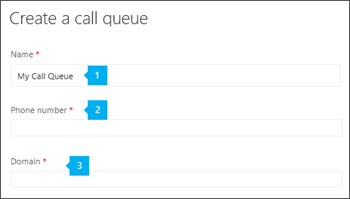
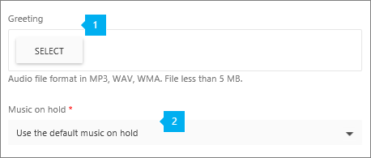
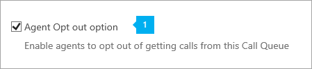
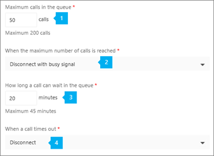

# <a name="create-a-phone-system-call-queue"></a><span data-ttu-id="59847-104">電話システムの呼び出しキューを作成する</span><span class="sxs-lookup"><span data-stu-id="59847-104">Create a Phone System call queue</span></span>

<span data-ttu-id="59847-p102">Phone System call queues include greetings that are used when someone calls in to a phone number for your organization, the ability to automatically put the calls on hold, and the ability to search for the next available call agent to handle the call while the people who call are listening to music on hold. You can create single or multiple call queues for your organization.</span><span class="sxs-lookup"><span data-stu-id="59847-p102">Phone System call queues include greetings that are used when someone calls in to a phone number for your organization, the ability to automatically put the calls on hold, and the ability to search for the next available call agent to handle the call while the people who call are listening to music on hold. You can create single or multiple call queues for your organization.</span></span>
  
<span data-ttu-id="59847-107">電話システムの通話キューは次の機能を提供します:</span><span class="sxs-lookup"><span data-stu-id="59847-107">Phone System call queues can provide:</span></span>
  
- <span data-ttu-id="59847-108">組織の応答メッセージ。</span><span class="sxs-lookup"><span data-stu-id="59847-108">An organizational greeting.</span></span>
- <span data-ttu-id="59847-109">通話の保留中に再生される保留音。</span><span class="sxs-lookup"><span data-stu-id="59847-109">Music while people are waiting on hold.</span></span>
- <span data-ttu-id="59847-110">メールが有効な配布リストおよびセキュリティ グループ内のエージェントを呼び出しへの呼び出しをリダイレクトします。</span><span class="sxs-lookup"><span data-stu-id="59847-110">Redirecting of calls to call agents in mail-enabled distribution lists and security groups.</span></span>
- <span data-ttu-id="59847-111">呼び出しキューの最大サイズ、タイムアウト、および呼び出しの処理オプションの設定を行っています。</span><span class="sxs-lookup"><span data-stu-id="59847-111">Making settings for call queue maximum size, timeout, and call handling options.</span></span>

<span data-ttu-id="59847-112">呼び出しキューに設定されている電話番号へ呼び出し、それら、あいさつのメッセージが聞こえます (いずれかの設定されている) 場合、その後に、キューを保存して、次の呼び出しを使用可能なエージェントを待機します。</span><span class="sxs-lookup"><span data-stu-id="59847-112">When someone calls in to a phone number that is set up with a call queue, they will hear a greeting first (if any is set up), and then they will be put in the queue and wait for the next available call agent.</span></span> <span data-ttu-id="59847-113">待機中、保留中であるし、呼び出し*最初に、先入れ先出し*(FIFO) の方法で呼び出しエージェントに提供するときに、相手呼び出しは音楽を聞きます。</span><span class="sxs-lookup"><span data-stu-id="59847-113">The person calling in will hear music while they are on hold waiting, and the calls will be offered to the call agents in the  *First In, First Out*  (FIFO) manner.</span></span>
  
<span data-ttu-id="59847-114">キューで待機しているすべての呼び出しは、アテンダントのルーティング モードまたはシリアル ルーティング モードを使用して配布されます。</span><span class="sxs-lookup"><span data-stu-id="59847-114">All calls waiting in the queue will be distributed using an attendant routing mode or serial routing mode:</span></span>
  
- <span data-ttu-id="59847-115">応答のルーティングでは、キュー内の最初の呼び出しを同時にすべてのエージェントが呼び出されます。</span><span class="sxs-lookup"><span data-stu-id="59847-115">With attendant routing, the first call in the queue will ring all agents at the same time.</span></span>
- <span data-ttu-id="59847-116">シリアル・ルーティングでは、キュー内の最初の呼び出しがすべてのコールエージェントを一件ずつ呼び出します。</span><span class="sxs-lookup"><span data-stu-id="59847-116">With serial routing, the first call in the queue will ring all call agents one by one.</span></span>

    > [!NOTE]
    > <span data-ttu-id="59847-117">**オフライン**中のコールエージェントは、 **取り込み中** のプレゼンスを設定するか、通話キューからの呼び出しをオプトアウトしてください。</span><span class="sxs-lookup"><span data-stu-id="59847-117">Call agents who are **Offline**, have set their presence to **Do not Disturb,** or have opted out of the call queue won't be called.</span></span>
  
- <span data-ttu-id="59847-118">一度に 1 回のみの着信通知 (キューの最初にある通話) がコール エージェントに送信されます。</span><span class="sxs-lookup"><span data-stu-id="59847-118">Only one incoming call notification (for the call at the head of the queue) at a time will be sent to the call agents.</span></span>
- <span data-ttu-id="59847-119">コール エージェントが通話を受けると、キューにある次の着信がコール エージェントを呼び出します。</span><span class="sxs-lookup"><span data-stu-id="59847-119">After a call agent accepts the call, the next incoming call in the queue will start ringing call agents.</span></span>

## <a name="step-1---getting-started"></a><span data-ttu-id="59847-120">ステップ 1 - はじめに</span><span class="sxs-lookup"><span data-stu-id="59847-120">Step 1 - Getting started</span></span>

<span data-ttu-id="59847-121">通話キューを使用する場合は、次の重要な点について留意してください。</span><span class="sxs-lookup"><span data-stu-id="59847-121">To get started using call queues, it's important to remember a few things:</span></span>
  
- <span data-ttu-id="59847-p104">Your organization must have (at a minimum) an Enterprise E3 plus **Phone System** license or an Enterprise E5 license. The number of **Phone System** user licenses that are assigned affects the number of service numbers that are available to be used for call queues. The number of call queues you can have is dependent on the number of **Phone System** and **Audio Conferencing** licenses that are assigned in your organization. To learn more about licensing, go [here](../skype-for-business-and-microsoft-teams-add-on-licensing/skype-for-business-and-microsoft-teams-add-on-licensing.md).</span><span class="sxs-lookup"><span data-stu-id="59847-p104">Your organization must have (at a minimum) an Enterprise E3 plus **Phone System** license or an Enterprise E5 license. The number of **Phone System** user licenses that are assigned affects the number of service numbers that are available to be used for call queues. The number of call queues you can have is dependent on the number of **Phone System** and **Audio Conferencing** licenses that are assigned in your organization. To learn more about licensing, go [here](../skype-for-business-and-microsoft-teams-add-on-licensing/skype-for-business-and-microsoft-teams-add-on-licensing.md).</span></span>

    > [!NOTE]
    > <span data-ttu-id="59847-p105">To redirect calls to people in your organization who are Online, they must have a **Phone System** license and be enabled for Enterprise Voice or have Office 365 Calling Plans. See [Assign Skype for Business and Microsoft Teams licenses](../skype-for-business-and-microsoft-teams-add-on-licensing/assign-skype-for-business-and-microsoft-teams-licenses.md). To enable them for Enterprise Voice, you can use Windows PowerShell. For example run:  `Set-CsUser -identity "Amos Marble" -EnterpriseVoiceEnabled $true`</span><span class="sxs-lookup"><span data-stu-id="59847-p105">To redirect calls to people in your organization who are Online, they must have a **Phone System** license and be enabled for Enterprise Voice or have Office 365 Calling Plans. See [Assign Skype for Business and Microsoft Teams licenses](../skype-for-business-and-microsoft-teams-add-on-licensing/assign-skype-for-business-and-microsoft-teams-licenses.md). To enable them for Enterprise Voice, you can use Windows PowerShell. For example run:  `Set-CsUser -identity "Amos Marble" -EnterpriseVoiceEnabled $true`</span></span>
  
- <span data-ttu-id="59847-130">Office 365 のプランを呼び出す方法の詳細については、[電話システムを呼び出すことを計画](/microsoftteams/calling-plan-landing-page)し、 [Office 365 のプランを呼び出す](/microsoftteams/calling-plans-for-office-365)を参照してください。</span><span class="sxs-lookup"><span data-stu-id="59847-130">To learn more about Office 365 Calling Plans, see [Phone System and Calling Plans](/microsoftteams/calling-plan-landing-page) and [Calling Plans for Office 365](/microsoftteams/calling-plans-for-office-365).</span></span>

    > [!NOTE]
    > <span data-ttu-id="59847-131">ユーザーには、設置がホストされているキューを呼び出すエージェントとしては、Lync Server 2010 を使用してがサポートされていません。</span><span class="sxs-lookup"><span data-stu-id="59847-131">Users hosted on-premises using Lync Server 2010 aren't supported as a Call Queue Agents.</span></span> 
  
- <span data-ttu-id="59847-p106">You can only assign toll and toll-free service phone numbers that you got in the **Skype for Business admin center** or transferred from another service provider to Phone System call queues. To get and use toll-free service numbers, you need to set up Communications Credits.</span><span class="sxs-lookup"><span data-stu-id="59847-p106">You can only assign toll and toll-free service phone numbers that you got in the **Skype for Business admin center** or transferred from another service provider to Phone System call queues. To get and use toll-free service numbers, you need to set up Communications Credits.</span></span>

    > [!NOTE]
    > <span data-ttu-id="59847-134">ユーザー (購読者) の電話番号を通話キューに割り当てることはできません。サービスの有料電話番号または無料電話番号のみを使用できます。</span><span class="sxs-lookup"><span data-stu-id="59847-134">User (subscriber) phone numbers can't be assigned to call queues - only service toll or toll-free phone numbers can be used.</span></span> 
  
- <span data-ttu-id="59847-135">電話システム呼び出しキューからの着信呼び出しを配布するときは、コール エージェントのこれらのクライアントがサポートされます。</span><span class="sxs-lookup"><span data-stu-id="59847-135">When you are distributing the incoming calls from an Phone System call queue, these clients are supported for call agents:</span></span>

  - <span data-ttu-id="59847-136">Skype for Business デスクトップ クライアント 2016 (32 および 64 ビット バージョン)</span><span class="sxs-lookup"><span data-stu-id="59847-136">Skype for Business desktop client 2016 (32 and 64-bit versions)</span></span>

  - <span data-ttu-id="59847-137">Lync デスクトップ クライアント 2013 (32 および 64 ビット バージョン)</span><span class="sxs-lookup"><span data-stu-id="59847-137">Lync desktop client 2013 (32 and 64-bit versions)</span></span>

  - <span data-ttu-id="59847-p107">All IP phone models supported for Skype for Business Online. See [Getting phones for Skype for Business Online](getting-phones-for-skype-for-business-online/getting-phones-for-skype-for-business-online.md).</span><span class="sxs-lookup"><span data-stu-id="59847-p107">All IP phone models supported for Skype for Business Online. See [Getting phones for Skype for Business Online](getting-phones-for-skype-for-business-online/getting-phones-for-skype-for-business-online.md).</span></span>

  - <span data-ttu-id="59847-140">Mac版  Skype for Business クライアント (バージョン 16.8.196 以降)</span><span class="sxs-lookup"><span data-stu-id="59847-140">Mac Skype for Business Client (version 16.8.196 and later)</span></span> 

  - <span data-ttu-id="59847-141">Aandroid Skype for Business クライアント (バージョン 6.16.0.9 以降)</span><span class="sxs-lookup"><span data-stu-id="59847-141">Android Skype for Business Client (version 6.16.0.9 and later)</span></span>

  - <span data-ttu-id="59847-142">iPhone Skype for Business Client クライアント(バージョン 6.16.0 以降)</span><span class="sxs-lookup"><span data-stu-id="59847-142">iPhone Skype for Business Client (version 6.16.0 and later)</span></span>

  - <span data-ttu-id="59847-143">Mac版  Skype for Business クライアント (バージョン 6.16.0 以降)</span><span class="sxs-lookup"><span data-stu-id="59847-143">iPad Skype for Business Client (version 6.16.0 and later)</span></span>

  - <span data-ttu-id="59847-144">Microsoft Teams Windows クライアント (バージョン 32 および 64 ビット)</span><span class="sxs-lookup"><span data-stu-id="59847-144">Microsoft Teams Windows client (32 and 64-bit versions)</span></span>

  - <span data-ttu-id="59847-145">Microsoft Teams Mac クライアント</span><span class="sxs-lookup"><span data-stu-id="59847-145">Microsoft Teams Mac client</span></span>

  - <span data-ttu-id="59847-146">マイクロソフト チームの iPhone アプリ</span><span class="sxs-lookup"><span data-stu-id="59847-146">Microsoft Teams iPhone app</span></span>

  - <span data-ttu-id="59847-147">マイクロソフト チーム Android アプリ</span><span class="sxs-lookup"><span data-stu-id="59847-147">Microsoft Teams Android app</span></span>

## <a name="step-2---getting-or-transferring-toll-or-toll-free-service-phone-numbers"></a><span data-ttu-id="59847-148">ステップ 2 - 有料またはフリーダイヤルのサービス電話番号の取得または移行</span><span class="sxs-lookup"><span data-stu-id="59847-148">Step 2 - Getting or transferring toll or toll-free service phone numbers</span></span>

<span data-ttu-id="59847-p108">Before you can create and set up your call queues, you will need to get or transfer your existing toll or toll-free service numbers. After you get the toll or toll-free service phone numbers, they will show up in **Skype for Business admin center** > **Voice** > **Phone numbers**, and the **Number type** listed will be listed as **Service - Toll-Free**. To get your service numbers, see [Getting service phone numbers for Skype for Business and Microsoft Teams](getting-service-phone-numbers.md) or if you want to transfer and existing service number, see [Transfer phone numbers to Office 365](/microsoftteams/transfer-phone-numbers-to-office-365).</span><span class="sxs-lookup"><span data-stu-id="59847-p108">Before you can create and set up your call queues, you will need to get or transfer your existing toll or toll-free service numbers. After you get the toll or toll-free service phone numbers, they will show up in **Skype for Business admin center** > **Voice** > **Phone numbers**, and the **Number type** listed will be listed as **Service - Toll-Free**. To get your service numbers, see [Getting service phone numbers for Skype for Business and Microsoft Teams](getting-service-phone-numbers.md) or if you want to transfer and existing service number, see [Transfer phone numbers to Office 365](/microsoftteams/transfer-phone-numbers-to-office-365).</span></span>
  
> [!NOTE]
> <span data-ttu-id="59847-p109">If you are outside the United States, you can't use the Skype for Business admin center to get service numbers. Go to [Manage phone numbers for your organization](/microsoftteams/manage-phone-numbers-for-your-organization) instead to see how to do it from the outside of the United States.</span><span class="sxs-lookup"><span data-stu-id="59847-p109">If you are outside the United States, you can't use the Skype for Business admin center to get service numbers. Go to [Manage phone numbers for your organization](/microsoftteams/manage-phone-numbers-for-your-organization) instead to see how to do it from the outside of the United States.</span></span>
  
## <a name="step-3---create-a-new-call-queue"></a><span data-ttu-id="59847-154">ステップ 3 - 新しい通話キューの作成</span><span class="sxs-lookup"><span data-stu-id="59847-154">Step 3 - Create a new Call Queue</span></span>

 <span data-ttu-id="59847-155">**マイクロソフトのチーム管理センターを使用してください。**</span><span class="sxs-lookup"><span data-stu-id="59847-155">**Using the Microsoft Teams admin center**</span></span>

<span data-ttu-id="59847-156">**マイクロソフトのチーム管理センター**でをクリックして **レガシー ポータル** >  **呼のルーティング** > **キューを呼び出す**には、 **+ 新規追加**] をクリックします。</span><span class="sxs-lookup"><span data-stu-id="59847-156">In the **Microsoft Teams admin center**, click  **Legacy Portal** >  **Call routing** > **Call queues**, then click **+ Add new**:</span></span>
  
### <a name="set-the-call-queue-display-name-phone-number-and-domain-if-any"></a><span data-ttu-id="59847-157">通話キューの表示名、電話番号、ドメイン (存在する場合) を設定します。</span><span class="sxs-lookup"><span data-stu-id="59847-157">Set the call queue display name, phone number and domain (if any)</span></span>


***
<span data-ttu-id="59847-159"></span><span class="sxs-lookup"><span data-stu-id="59847-159"></span></span><br/>
<span data-ttu-id="59847-p110">**名前** 通話キューの分かりやすい名前を入力します。この項目は必須で、空白を含む最大 64 文字を含めることができます。</span><span class="sxs-lookup"><span data-stu-id="59847-p110">**Name** Enter a descriptive display name for the call queue. This is required and can contain up to 64 characters, including spaces. </span></span><br/> <span data-ttu-id="59847-162">この名前は着信の通知に表示されます。</span><span class="sxs-lookup"><span data-stu-id="59847-162">This name will be displayed in the notification for the incoming call.</span></span>
***
<span data-ttu-id="59847-163"></span><span class="sxs-lookup"><span data-stu-id="59847-163"></span></span><br/><span data-ttu-id="59847-p111">**Phone number** Select a service toll or toll-free phone number for the call queue. This is optional. </span><span class="sxs-lookup"><span data-stu-id="59847-p111">**Phone number** Select a service toll or toll-free phone number for the call queue. This is optional. </span></span><br/> <span data-ttu-id="59847-p112">If there aren't any listed, you need to get service numbers before you can create this call queue. To get your service numbers, see [Getting service phone numbers for Skype for Business and Microsoft Teams](getting-service-phone-numbers.md)</span><span class="sxs-lookup"><span data-stu-id="59847-p112">If there aren't any listed, you need to get service numbers before you can create this call queue. To get your service numbers, see [Getting service phone numbers for Skype for Business and Microsoft Teams](getting-service-phone-numbers.md)</span></span>
***
<span data-ttu-id="59847-168"></span><span class="sxs-lookup"><span data-stu-id="59847-168"></span></span><br/><span data-ttu-id="59847-p113">**ドメイン** 利用可能な場合は、使用する Office 365 ドメインを選択します。この項目は、Office 365 で使用しているドメインが 1 つ以上存在する場合にのみ利用できます。1 つ以上存在する場合は、リストからドメイン名を選択します。 </span><span class="sxs-lookup"><span data-stu-id="59847-p113">**Domain** If this is available, choose the Office 365 domain you want to use. This is only available if you have more than one domain being used with Office 365. If you have more than one, you must chose the domain name from the list. </span></span><br/> <span data-ttu-id="59847-172">たとえば、次のようなドメインが存在します。 _contoso.com or redmond.contoso.com_</span><span class="sxs-lookup"><span data-stu-id="59847-172">For example, you could have a domain like:  _contoso.com or redmond.contoso.com_</span></span>

### <a name="set-the-greeting-and-music-played-while-on-hold"></a><span data-ttu-id="59847-173">応答メッセージおよび保留中の保留音を設定する</span><span class="sxs-lookup"><span data-stu-id="59847-173">Set the greeting and music played while on hold</span></span>


  
***
<span data-ttu-id="59847-175"></span><span class="sxs-lookup"><span data-stu-id="59847-175"></span></span><br/><span data-ttu-id="59847-p114">**Greeting** is optional. This is the greeting that is played for people who call in to the call queue number. </span><span class="sxs-lookup"><span data-stu-id="59847-p114">**Greeting** is optional. This is the greeting that is played for people who call in to the call queue number. </span></span><br/> <span data-ttu-id="59847-178">オーディオ ファイル (.wav、.mp3、.wma 形式) をアップロードすることができます。</span><span class="sxs-lookup"><span data-stu-id="59847-178">You can upload an audio file (.wav, .mp3, or .wma formats).</span></span>
***
<span data-ttu-id="59847-179"></span><span class="sxs-lookup"><span data-stu-id="59847-179"></span></span><br/><span data-ttu-id="59847-180">**上の音楽を保持**呼び出しキューで提供されている保留中のデフォルトの音楽を使用するか、または保留中のカスタムの音楽として使用する .wav、mp3、または .wma ファイルの形式でのオーディオ ファイルをアップロードすることができます。</span><span class="sxs-lookup"><span data-stu-id="59847-180">**Music on hold** You can either use the default Music on Hold provided with the call queue, or you can upload an audio file in .wav, mp3, or .wma formats to use as your custom Music on Hold.</span></span>

### <a name="select-the-call-distribution-method"></a><span data-ttu-id="59847-181">着信分配メソッドを選択する</span><span class="sxs-lookup"><span data-stu-id="59847-181">Select the call distribution method</span></span>


  
***
<span data-ttu-id="59847-183"></span><span class="sxs-lookup"><span data-stu-id="59847-183"></span></span><br/><span data-ttu-id="59847-p115">**Call distribution method** You can choose either **Attendant** or **Serial** for your call queue distribution method. All new and existing call queues will have attendant routing selected by default. To use serial routing, you must explicitly choose the **Serial** routing option in UI and cmdlets. </span><span class="sxs-lookup"><span data-stu-id="59847-p115">**Call distribution method** You can choose either **Attendant** or **Serial** for your call queue distribution method. All new and existing call queues will have attendant routing selected by default. To use serial routing, you must explicitly choose the **Serial** routing option in UI and cmdlets. </span></span><br/><br/> <span data-ttu-id="59847-p116">When serial routing is chosen and the call queue is saved, the calls from the queue will ring your agents one by one, starting from the beginning of the agent list. If an agent dismisses or does not pick up a call, the call will ring the next agent on the list and will try all agents one by one until it is picked up or times out waiting in the queue.</span><span class="sxs-lookup"><span data-stu-id="59847-p116">When serial routing is chosen and the call queue is saved, the calls from the queue will ring your agents one by one, starting from the beginning of the agent list. If an agent dismisses or does not pick up a call, the call will ring the next agent on the list and will try all agents one by one until it is picked up or times out waiting in the queue.</span></span>   

> [!NOTE]
> <span data-ttu-id="59847-189">**オフライン**中、**取り込み中**表示、またはこのキューからの着信を **オプトアウト** したエージェントは、シリアルルーティングからスキップされます。</span><span class="sxs-lookup"><span data-stu-id="59847-189">Serial routing will skip agents who are **Offline**, have set their presence to **Do not Disturb**, or have **opted out** of getting calls from this queue.</span></span> 

### <a name="select-an-agent-opt-out-option"></a><span data-ttu-id="59847-190">エージェントのオプトアウトのオプションを選択する</span><span class="sxs-lookup"><span data-stu-id="59847-190">Select an agent opt out option</span></span>


  
***
<span data-ttu-id="59847-192"></span><span class="sxs-lookup"><span data-stu-id="59847-192"></span></span><br/><span data-ttu-id="59847-193">**エージェント オプトアウト オプション** **エージェントのオプトアウト オプション**選択して特定のキューからの着信をオプトアウトすることができます。</span><span class="sxs-lookup"><span data-stu-id="59847-193">**Agent Opt out option** You can choose to allow call queue agents to opt out of taking calls from a particular queue by selecting **Agent Opt out option**.</span></span>  <br/> <span data-ttu-id="59847-p117">Enabling this option allows all agents in this queue to start or stop receiving call from this call queue at will. You can revoke the agent opt-out privilege at any time by clearing the check box, causing agents to become automatically opted in for this queue again (the default setting for all agents).  </span><span class="sxs-lookup"><span data-stu-id="59847-p117">Enabling this option allows all agents in this queue to start or stop receiving call from this call queue at will. You can revoke the agent opt-out privilege at any time by clearing the check box, causing agents to become automatically opted in for this queue again (the default setting for all agents).  </span></span><br/><br/> <span data-ttu-id="59847-196">エージェントは次の操作を行うと、オプトアウトのオプションにアクセスできます:</span><span class="sxs-lookup"><span data-stu-id="59847-196">To access the opt-out option, agents can do the following:</span></span>
 1. <span data-ttu-id="59847-197">Skype for Business クライアントデスクトップで、 **オプション** を開きます。</span><span class="sxs-lookup"><span data-stu-id="59847-197">Open **Options** in their desktop Skype for Business client.</span></span> 
 2. <span data-ttu-id="59847-198">**[通話転送]** タブで、 **[オンライン編集の設定]** リンクをクリックします。</span><span class="sxs-lookup"><span data-stu-id="59847-198">On the **Call Forwarding** tab, click the **Edit settings online** link.</span></span>
 3. <span data-ttu-id="59847-199">ユーザー設定ページで、 **通話キュー**をクリックし、次にオプトアウトしたいキューのチェック ボックスを削除します。</span><span class="sxs-lookup"><span data-stu-id="59847-199">On the user settings page, click **Call Queues**, and then clear the check boxes for any queues for which they want to opt out.</span></span>

    > [!NOTE] 
    > <span data-ttu-id="59847-200">Mac、モバイル、または Lync 2013 クライアントを使用しているエージェント、または Skype for Business 2015 サーバーを使用しているオンプレミスでホストされている Hybrid Voice ユーザーは、 [https://aka.ms/cqsettings](https://aka.ms/cqsettings) で、オプトアウトのオプションにアクセスすることができます。</span><span class="sxs-lookup"><span data-stu-id="59847-200">Agents using Mac, mobile, or Lync 2013 clients, or Hybrid Voice users who are hosted on-premises using Skype for Business 2015 server, can go to [https://aka.ms/cqsettings](https://aka.ms/cqsettings) to access the opt out option.</span></span>

### <a name="add-call-agents-to-a-call-queue"></a><span data-ttu-id="59847-201">コール エージェントを通話キューに追加する</span><span class="sxs-lookup"><span data-stu-id="59847-201">Add call agents to a call queue</span></span>


  
***
<br/><br/><span data-ttu-id="59847-204">コール エージェント (最大で 200) を指定できます。</span><span class="sxs-lookup"><span data-stu-id="59847-204">Call agents (200 maximum) can be:</span></span>
* <span data-ttu-id="59847-205">**電話システム** のライセンスを持つオンラインのユーザーとして、エンタープライズ ボイスまたは 通話の計画を有効にします。</span><span class="sxs-lookup"><span data-stu-id="59847-205">An Online user with a **Phone System** license and enabled for Enterprise Voice or with a Calling Plan.</span></span> <br/><br/> <span data-ttu-id="59847-p118">**Note:**  To redirect calls to people in your organization who are Online, they must have a **Phone System** license and be enabled for Enterprise Voice or have a Calling Plan. See [Assign Skype for Business and Microsoft Teams licenses](../skype-for-business-and-microsoft-teams-add-on-licensing/assign-skype-for-business-and-microsoft-teams-licenses.md). To enable them for Enterprise Voice, you can use Windows PowerShell. For example run:  `Set-CsUser -identity "Amos Marble" -EnterpriseVoiceEnabled $true`</span><span class="sxs-lookup"><span data-stu-id="59847-p118">**Note:**  To redirect calls to people in your organization who are Online, they must have a **Phone System** license and be enabled for Enterprise Voice or have a Calling Plan. See [Assign Skype for Business and Microsoft Teams licenses](../skype-for-business-and-microsoft-teams-add-on-licensing/assign-skype-for-business-and-microsoft-teams-licenses.md). To enable them for Enterprise Voice, you can use Windows PowerShell. For example run:  `Set-CsUser -identity "Amos Marble" -EnterpriseVoiceEnabled $true`</span></span> <br/><br/>
* <span data-ttu-id="59847-p119">Online users with a **Phone System** license and a Calling Plan that are added to an Office 365 Group, a mail-enabled Distribution List, or a Security Group. It might take up to 30 minutes for a new agent added for a distribution list or a security group to start receiving calls from a call queue. A newly created distribution list or security group might take up to 48 hours to become available to be used with call queues. Newly created Office 365 Groups are available almost immediately. </span><span class="sxs-lookup"><span data-stu-id="59847-p119">Online users with a **Phone System** license and a Calling Plan that are added to an Office 365 Group, a mail-enabled Distribution List, or a Security Group. It might take up to 30 minutes for a new agent added for a distribution list or a security group to start receiving calls from a call queue. A newly created distribution list or security group might take up to 48 hours to become available to be used with call queues. Newly created Office 365 Groups are available almost immediately. </span></span><br/> 

  > [!NOTE] 
  > <span data-ttu-id="59847-214">ユーザーには、設置がホストされている Lync Server 2010 の使用はサポートされていません。</span><span class="sxs-lookup"><span data-stu-id="59847-214">Users hosted on-premises using Lync Server 2010 aren't supported.</span></span>

### <a name="set-the-maximum-queue-size-and-maximum-wait-time"></a><span data-ttu-id="59847-215">最大キュー サイズと最大待機時間を設定する</span><span class="sxs-lookup"><span data-stu-id="59847-215">Set the maximum queue size and maximum wait time</span></span>


  
***
<span data-ttu-id="59847-217"></span><span class="sxs-lookup"><span data-stu-id="59847-217"></span></span><br/><br/><span data-ttu-id="59847-p120">**Maximum calls in the queue** Use this to set the maximum calls that can wait in the queue at the same time. The default is 50, but it can range from 0 to 200.When this limit is reached, the call will be handled in way you have set on the **When the maximum number of calls is reached** setting below.</span><span class="sxs-lookup"><span data-stu-id="59847-p120">**Maximum calls in the queue** Use this to set the maximum calls that can wait in the queue at the same time. The default is 50, but it can range from 0 to 200.When this limit is reached, the call will be handled in way you have set on the **When the maximum number of calls is reached** setting below.</span></span>
***
<span data-ttu-id="59847-220"></span><span class="sxs-lookup"><span data-stu-id="59847-220"></span></span><br/><br/><span data-ttu-id="59847-221">**呼び出しの最大数に達したとき**呼び出しキューでは、(**キューの最大数を呼び出す**設定を使用して設定) の最大のサイズに達すると、新しくかかってきた呼び出しの動作を選択します。</span><span class="sxs-lookup"><span data-stu-id="59847-221">**When the maximum number of calls is reached** When the call queue reaches its maximum size (set using the **Maximum calls in the queue** setting), you can choose what happens to new incoming calls.</span></span>
* <span data-ttu-id="59847-222">**ビジー信号を切断します** 通話は切断されます。</span><span class="sxs-lookup"><span data-stu-id="59847-222">**Disconnect with a busy signal** The call will be disconnected.</span></span>
* <span data-ttu-id="59847-223">**呼び出しを転送します。** これを選択するとこれらのオプションが用意されます。</span><span class="sxs-lookup"><span data-stu-id="59847-223">**Forward this call to** When you choose this, you will have these options:</span></span>
  * <span data-ttu-id="59847-p121">**Person in your company** An Online user with a **Phone System** license and be enabled for Enterprise Voice or have a Calling Plan. You can set it up so the person calling in can be sent to voicemail. To do this, select a **Person in your company** and set this person to have their calls forwarded directly to voicemail. </span><span class="sxs-lookup"><span data-stu-id="59847-p121">**Person in your company** An Online user with a **Phone System** license and be enabled for Enterprise Voice or have a Calling Plan. You can set it up so the person calling in can be sent to voicemail. To do this, select a **Person in your company** and set this person to have their calls forwarded directly to voicemail. </span></span><br/> <br/><span data-ttu-id="59847-227">ボイスメールに必要なライセンスについては、 [電話システムのボイス メールの設定](/microsoftteams/set-up-phone-system-voicemail)を参照してください。</span><span class="sxs-lookup"><span data-stu-id="59847-227">To learn about licensing required for voicemail, see [Set up Phone System voicemail](/microsoftteams/set-up-phone-system-voicemail).</span></span> 

    > [!Note]
    > <span data-ttu-id="59847-228">ユーザーには、設置がホストされている Lync Server 2010 の使用はサポートされていません。</span><span class="sxs-lookup"><span data-stu-id="59847-228">Users hosted on-premises using Lync Server 2010 aren't supported.</span></span><br/>

  * <span data-ttu-id="59847-229">**キューを呼び出す**作成する必要が既に別の呼び出しは、キューが、その呼び出しキューを選択するには後、。</span><span class="sxs-lookup"><span data-stu-id="59847-229">**Call Queue** You must have already created another call queue, but after you do, you can select that call queue.</span></span>
  * <span data-ttu-id="59847-p122">**Auto Attendant** You must have already created an auto attendant, but after you do, you can select that auto attendant. See [Set up a Phone System auto attendant](set-up-a-phone-system-auto-attendant.md).</span><span class="sxs-lookup"><span data-stu-id="59847-p122">**Auto Attendant** You must have already created an auto attendant, but after you do, you can select that auto attendant. See [Set up a Phone System auto attendant](set-up-a-phone-system-auto-attendant.md).</span></span>
***
<span data-ttu-id="59847-232"></span><span class="sxs-lookup"><span data-stu-id="59847-232"></span></span><br/><br/><span data-ttu-id="59847-p123">**通話のキュー内での待機時間** タイムアウトが発生し、通話のリダイレクトまたは切断が必要となるまでに、通話をキュー内で保留できる時間を決定することもできます。リダイレクト先は [ **通話がタイムアウトした場合**] 設定に基づきます。0 から 45 分に設定できます。 </span><span class="sxs-lookup"><span data-stu-id="59847-p123">**How long a call can wait in the queue** You can also decide how much time a call can be on hold in the queue before it times out and needs to be redirected or disconnected. Where it will be redirected is based on how you set the **When a call times out** setting. You can set a time from 0 to 45 minutes. </span></span><br/><br/> <span data-ttu-id="59847-p124">The timeout value can be set in seconds, at 15-second intervals. This allows you to manipulate the call flow with finer granularity. For example, you could specify that any calls that are not answered by an agent within 30 seconds go to a Directory Search Auto Attendant.</span><span class="sxs-lookup"><span data-stu-id="59847-p124">The timeout value can be set in seconds, at 15-second intervals. This allows you to manipulate the call flow with finer granularity. For example, you could specify that any calls that are not answered by an agent within 30 seconds go to a Directory Search Auto Attendant.</span></span> 

***
<span data-ttu-id="59847-239"></span><span class="sxs-lookup"><span data-stu-id="59847-239"></span></span><br/><br/><span data-ttu-id="59847-240">**通話がタイムアウトした場合** [ **通話のキュー内での待機時間**] 設定で指定した制限に達した通話に対する処理方法を選択できます。</span><span class="sxs-lookup"><span data-stu-id="59847-240">**When a call times out** When the call reaches the limit you set on the **How long a call can wait in the queue** setting, you can choose what happens to this call:</span></span>
* <span data-ttu-id="59847-241">**切断** 通話は切断されます。</span><span class="sxs-lookup"><span data-stu-id="59847-241">**Disconnect** The call will be disconnected.</span></span>
* <span data-ttu-id="59847-242">**呼び出しを転送します。** これを選択するとこれらのオプションが用意されます。</span><span class="sxs-lookup"><span data-stu-id="59847-242">**Forward this call to** When you choose this, you will have these options:</span></span>
  * <span data-ttu-id="59847-p125">**Person in your company** An Online user with a **Phone System** license and be enabled for Enterprise Voice or have Calling Plans. You can set it up so the person calling in can be sent to voicemail. To do this, select a **Person in your company** and set this person to have their calls forwarded directly to voicemail. </span><span class="sxs-lookup"><span data-stu-id="59847-p125">**Person in your company** An Online user with a **Phone System** license and be enabled for Enterprise Voice or have Calling Plans. You can set it up so the person calling in can be sent to voicemail. To do this, select a **Person in your company** and set this person to have their calls forwarded directly to voicemail. </span></span></br><br/>  <span data-ttu-id="59847-246">ボイスメールに必要なライセンスについては、 [「電話システムのボイスメールの設定」](/microsoftteams/set-up-phone-system-voicemail) を参照してください。</span><span class="sxs-lookup"><span data-stu-id="59847-246">To learn about licensing required for voicemail, see [Set up Phone System voicemail](/microsoftteams/set-up-phone-system-voicemail).</span></span> 

    > [!Note]
    > <span data-ttu-id="59847-247">ユーザーには、設置がホストされている Lync Server 2010 の使用はサポートされていません。</span><span class="sxs-lookup"><span data-stu-id="59847-247">Users hosted on-premises using Lync Server 2010 aren't supported.</span></span><br/>

  * <span data-ttu-id="59847-248">**キューを呼び出す**作成する必要が既に別の呼び出しは、キューが、その呼び出しキューを選択するには後、。</span><span class="sxs-lookup"><span data-stu-id="59847-248">**Call Queue** You must have already created another call queue, but after you do, you can select that call queue.</span></span>
  * <span data-ttu-id="59847-p126">**Auto Attendant** You must have already created an auto attendant, but after you do, you can select that auto attendant. See [Set up a Phone System auto attendant](set-up-a-phone-system-auto-attendant.md).</span><span class="sxs-lookup"><span data-stu-id="59847-p126">**Auto Attendant** You must have already created an auto attendant, but after you do, you can select that auto attendant. See [Set up a Phone System auto attendant](set-up-a-phone-system-auto-attendant.md).</span></span>
   
## <a name="changing-the-users-caller-id-to-be-a-call-queues-phone-number"></a><span data-ttu-id="59847-251">ユーザーの発信者番号通知を通話キューの電話番号に変更する</span><span class="sxs-lookup"><span data-stu-id="59847-251">Changing the user's Caller ID to be a call queue's phone number</span></span>

<span data-ttu-id="59847-252">**New-CallingLineIdentity** コマンドレットを使用してポリシーを作成する代わりに、アウトバウンドコールの発信者番号通知を通話キューに変更することでユーザーIDを保護します。</span><span class="sxs-lookup"><span data-stu-id="59847-252">You can protect a user's identity by changing their caller ID for the outbound calls to a call queue instead by creating a policy using the **New-CallingLineIdentity** cmdlet.</span></span>
  
<span data-ttu-id="59847-253">これを行う場合は、次を実行します。</span><span class="sxs-lookup"><span data-stu-id="59847-253">To do this, run:</span></span>
  
```
New-CsCallingLineIdentity -Identity "UKSalesQueue" -CallingIdSubstitute "Service" -ServiceNumber 14258828080 -EnableUserOverride $False -Verbose
```

<span data-ttu-id="59847-p127">Then apply the policy to the user using the **Grant-CallingLineIdentity** cmdlet. To do this, run:</span><span class="sxs-lookup"><span data-stu-id="59847-p127">Then apply the policy to the user using the **Grant-CallingLineIdentity** cmdlet. To do this, run:</span></span>
  
```
Grant-CsCallingLineIdentity -PolicyName UKSalesQueue -Identity "AmosMarble@contoso.com"
```

<span data-ttu-id="59847-256">組織内の発信者番号通知の変更方法の詳細については、 [こちら](../what-are-calling-plans-in-office-365/how-can-caller-id-be-used-in-your-organization.md)です。</span><span class="sxs-lookup"><span data-stu-id="59847-256">You can get more information on how to make changes to caller ID settings in your organization [here](../what-are-calling-plans-in-office-365/how-can-caller-id-be-used-in-your-organization.md).</span></span>
  
## <a name="want-to-know-more"></a><span data-ttu-id="59847-257">詳細情報</span><span class="sxs-lookup"><span data-stu-id="59847-257">Want to know more?</span></span>

<span data-ttu-id="59847-258">Windows PowerShell を使用して通話キューを作成し、設定することもできます。</span><span class="sxs-lookup"><span data-stu-id="59847-258">You can also use Windows PowerShell to create and set up call queues.</span></span>
  
### <a name="call-queue-cmdlets"></a><span data-ttu-id="59847-259">通話キューのコマンドレット</span><span class="sxs-lookup"><span data-stu-id="59847-259">Call queue cmdlets</span></span>

<span data-ttu-id="59847-260">通話キューの管理で必要なコマンドレットを以下に示します。</span><span class="sxs-lookup"><span data-stu-id="59847-260">Here are the cmdlets that you need to manage a call queue.</span></span>
  
- [<span data-ttu-id="59847-261">New--CsHuntgroup</span><span class="sxs-lookup"><span data-stu-id="59847-261">New-CsHuntgroup</span></span>](https://technet.microsoft.com/en-us/library/mt796459.aspx)

- [<span data-ttu-id="59847-262">Set-CsHuntgroup</span><span class="sxs-lookup"><span data-stu-id="59847-262">Set-CsHuntgroup</span></span>](https://technet.microsoft.com/en-us/library/mt796457.aspx)

- [<span data-ttu-id="59847-263">Get-CsHuntgroup</span><span class="sxs-lookup"><span data-stu-id="59847-263">Get-CsHuntgroup</span></span>](https://technet.microsoft.com/en-us/library/mt796458.aspx)

- [<span data-ttu-id="59847-264">Remove-CsHuntgroup</span><span class="sxs-lookup"><span data-stu-id="59847-264">Remove-CsHuntgroup</span></span>](https://technet.microsoft.com/en-us/library/mt796456.aspx)

### <a name="more-about-windows-powershell"></a><span data-ttu-id="59847-265">Windows PowerShell の詳細について</span><span class="sxs-lookup"><span data-stu-id="59847-265">More about Windows PowerShell</span></span>

- <span data-ttu-id="59847-p128">Windows PowerShell is all about managing users and what users are allowed or not allowed to do. With Windows PowerShell, you can manage Office 365 and Skype for Business Online using a single point of administration that can simplify your daily work, when you have multiple tasks to do. To get started with Windows PowerShell, see these topics:</span><span class="sxs-lookup"><span data-stu-id="59847-p128">Windows PowerShell is all about managing users and what users are allowed or not allowed to do. With Windows PowerShell, you can manage Office 365 and Skype for Business Online using a single point of administration that can simplify your daily work, when you have multiple tasks to do. To get started with Windows PowerShell, see these topics:</span></span>

  - [<span data-ttu-id="59847-269">Windows PowerShell と Skype for Business Online の概要</span><span class="sxs-lookup"><span data-stu-id="59847-269">An introduction to Windows PowerShell and Skype for Business Online</span></span>](https://go.microsoft.com/fwlink/?LinkId=525039)

  - [<span data-ttu-id="59847-270">Office 365 PowerShell を使用する必要がある理由</span><span class="sxs-lookup"><span data-stu-id="59847-270">Why you need to use Office 365 PowerShell</span></span>](https://go.microsoft.com/fwlink/?LinkId=525041)

- <span data-ttu-id="59847-p129">Windows PowerShell には、ただ Office 365 管理センターを使用するだけではなく、速度、単純さ、生産性において多くの利点があります。次のトピックでこれらの利点について説明します。</span><span class="sxs-lookup"><span data-stu-id="59847-p129">Windows PowerShell has many advantages in speed, simplicity, and productivity over only using the Office 365 admin center such as when you are making setting changes for many users at one time. Learn about these advantages in the following topics:</span></span>

  - [<span data-ttu-id="59847-273">Windows PowerShell で Office 365 を管理するための最善の方法</span><span class="sxs-lookup"><span data-stu-id="59847-273">Best ways to manage Office 365 with Windows PowerShell</span></span>](https://go.microsoft.com/fwlink/?LinkId=525142)

  - [<span data-ttu-id="59847-274">Windows PowerShell による Skype for Business Online の管理</span><span class="sxs-lookup"><span data-stu-id="59847-274">Using Windows PowerShell to manage Skype for Business Online</span></span>](https://go.microsoft.com/fwlink/?LinkId=525453)

  - [<span data-ttu-id="59847-275">クイック リファレンス: Windows PowerShell を使用した一般的な Lync Online の管理タスクの実行</span><span class="sxs-lookup"><span data-stu-id="59847-275">Using Windows PowerShell to do common Skype for Business Online management tasks</span></span>](https://go.microsoft.com/fwlink/?LinkId=525038)

## <a name="related-topics"></a><span data-ttu-id="59847-276">関連項目</span><span class="sxs-lookup"><span data-stu-id="59847-276">Related topics</span></span>
[<span data-ttu-id="59847-277">Office 365 での電話システムで利用できる機能</span><span class="sxs-lookup"><span data-stu-id="59847-277">Here's what you get with Phone System in Office 365</span></span>](/MicrosoftTeams/here-s-what-you-get-with-phone-system)

[<span data-ttu-id="59847-278">Skype for Business および Microsoft Teams のサービス電話番号の取得</span><span class="sxs-lookup"><span data-stu-id="59847-278">Getting service phone numbers for Skype for Business and Microsoft Teams</span></span>](getting-service-phone-numbers.md)

[<span data-ttu-id="59847-279">国および地域ごとの電話会議および通話プランの利用可能性</span><span class="sxs-lookup"><span data-stu-id="59847-279">Country and region availability for Audio Conferencing and Calling Plans</span></span>](/microsoftteams/country-and-region-availability-for-audio-conferencing-and-calling-plans/country-and-region-availability-for-audio-conferencing-and-calling-plans)
