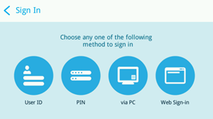
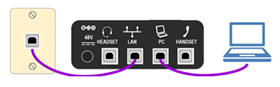

# Skype for Business Online 電話機の展開レポートDeploying Skype for Business Online phones

[] このガイドは Skype for Business Online IP 電話機の展開をサポートするガイドです。This is deployment guide will help you deploy Skype for Business Online IP phones.
  
あらゆる種類のビジネスにおいて、音声通話を発受信するための電話番号を確保することは、ビジネスを運営する上で重要な条件です。電話番号を有するユーザーは、IP 電話機、PC、モバイル デバイスを含むすべての Skype for Business デバイスで音声通話を行うことができます。Skype for Business IP 電話機の詳細については、「[Skype for Business Online で使う電話を入手する](getting-phones-for-skype-for-business-online.md)」をご覧ください。In all types of businesses, having a phone number allows users to make and get voice calls, and it is an important requirement to do business. Users who have phone numbers will be able to make voice calls across all Skype for Business devices including IP phones, PCs, and mobile devices. You can learn more about Skype for Business IP phones by reading [Getting phones for Skype for Business Online](getting-phones-for-skype-for-business-online.md).
  
## IP 電話機の展開手順Deployment steps for IP phones

### ステップ 1 - メーカーの管理者ガイドと電話機のマニュアルのダウンロードStep 1 - Download the manufacturer's administrator guides and phone manuals

まず最初に、メーカーの管理ガイドと電話機のマニュアルをダウンロードすることをお勧めします。Before you get started, it's a good idea to download the phone manufacturer's administration guides and phone user manuals.
  
- Polycom 電話の場合は、 [Poly ドキュメントライブラリ](https://documents.polycom.com/category/voice)を参照してください。For Polycom phones, see the [Poly Documentation Library](https://documents.polycom.com/category/voice).
    
- Yealink 電話機については、『[Yealink Skype for Business HD SIP Phones Solution (Yealink Skype for Business HD SIP 電話機のソリューション)](http://www.yealink.com/products_top_2.html)』をご覧ください。For Yealink phones, see [Yealink Skype for Business HD SIP Phones Solution](http://www.yealink.com/products_top_2.html).
    
- AudioCodes 電話機については、『[Audiocodes Provisioning Management Guide (Audiocodes プロビジョニング管理ガイド)](https://www.audiocodes.com/solutions-products/products/products-for-microsoft-365/ip-phones-room-solutions)』をご覧ください。For AudioCodes phones, see the [Audiocodes Provisioning Management Guide](https://www.audiocodes.com/solutions-products/products/products-for-microsoft-365/ip-phones-room-solutions).
    
### ステップ 2 - Skype for Business 対応 IP 電話機およびファームウェアを購入または移行していることを確認するStep 2 - Make sure you're purchasing or migrating a Skype for Business Supported IP phone and firmware

Skype for Business Online 対応の電話機およびファームウェアは、Skype for Business Server にも互換性がありますが、その逆の互換性は必ずしも保証されません。対応している電話機とファームウェアを購入またはプロビジョニングしていることを確認するには、「[Skype for Business Online で使う電話を入手する](getting-phones-for-skype-for-business-online.md)」の説明をご覧ください。A Skype for Business Online supported phone and firmware is compatible for Skype for Business Server as well, but the opposite isn't always true. To make sure you are buying or provisioning a supported phone and firmware, see [Getting phones for Skype for Business Online](getting-phones-for-skype-for-business-online.md).
  
### ステップ 3 - 正しいファームウェアがインストールされていることを確認し、必要に応じてファームウェアを更新するStep 3 - Checking that the right firmware is installed and update the firmware if required

お使いの電話機のファームウェア バージョンを、それぞれ以下の方法で確認します。Check the firmware version on your phones. For:
  
- **Polycom VVX 電話**の場合は、**[設定]** > **[ステータス]** > **[プラットフォーム]** > **[アプリケーション]** > **[メイン]** に移動します。**Polycom VVX phones**, go to **Settings** > **Status** > **Platform** > **Application** > **Main**.
    
- **Yealink 電話機** の場合は、メインの電話画面で [ **Status (情報)** ] に移動します。**Yealink phones**, go to **Status** on the main phone screen.
    
- **AudioCodes 電話**の場合は、**[メニュー]** > **[デバイス ステータス]** > **[ファームウェア バージョン]** に移動します。**AudioCodes phones**, go to **Menu** > **Device Status** > **Firmware version** from the start screen.
    
    > [!NOTE]
    > 電話機の詳細設定へのリモート アクセスについては、メーカーの管理ガイドをご覧ください。ユーザー ガイドおよび電話機マニュアルについては、上記のリンクをご覧ください。For remote access to phone details, refer to manufacturer administration guides. See the links above for the user guides and phone manuals. 
  
- **Lync Phone Edition (LPE) 電話**: スタート画面から \*\*[メニュー] \*\* > \*\*[システム情報] \*\*に移動します。**Lync Phone Edition (LPE) phones**, go to **Menu** > **System Information** from the start screen.
    
### ステップ 4 - デバイス更新の考慮事項Step 4 - Device Update Considerations

> [!NOTE]
> 5.5.1.X より前の Polycom ファームウェアには、メーカー独自のデバイスのロック メカニズムが導入されています。このメカニズムは Skype for Business 実装の「電話のロック」に置換されています。「デバイスのロック」で保護されていた 5.4.X.X から「電話のロック」を備える 5.5.1.X に電話機をアップグレードすると、「デバイスのロック」から PIN コードが継承されないため、電話機が保護されていない状態になります。「デバイスのロック」を有効にしていたユーザーは、次の Polycom デバイスのプロファイル パラメーターを有効にして、ユーザーがアップグレードのタイミングを制御できるようにする必要があります (lync.deviceUpdate.popUpSK.enabled=1)。Polycom firmware prior to 5.5.1.X had a manufacturer-specific device-lock mechanism that is replaced with a Skype for Business implementation "Phone-Lock." Upgrading a phone from 5.4.X.X that was secured with "Device-Lock" to 5.5.1.X with "Phone-Lock" won't inherit the PIN code from "Device-Lock," which can leave the phone unsecured. Users who have activated "Device-Lock" need to enable the following Polycom Device Profile parameter to give users control of time of upgrade (lync.deviceUpdate.popUpSK.enabled=1). 
  
ファームウェアの更新は Skype for Business Service によって管理されます。Skype for Business 認定済みの電話機のファームウェアは Skype for Business Update サーバーにアップロードされます。既定では、デバイスの更新はすべての電話機で有効になっています。電話機の無通信時間およびポーリング間隔に応じて、電話機では最新の認定済みビルドがダウロードされ、インストールされます。デバイスの更新設定は [Set-CsIPPhonePolicy](https://technet.microsoft.com/library/mt629497.aspx) コマンドレットを使用して、 _EnableDeviceUpdate_ パラメーターを `false` に設定することで無効にできます。Firmware updates are managed by the Skype for Business Service. Every Skype for Business certified phone's firmware is uploaded to the Skype for Business Update server, and device update is enabled on all phones by default. Depending on the inactivity time on the phone and polling intervals, phones will automatically download and install the latest certified builds. You can disable the device update settings by using the [Set-CsIPPhonePolicy](https://technet.microsoft.com/library/mt629497.aspx) cmdlet and setting the _EnableDeviceUpdate_ parameter to `false`.
  

  
新しいファームウェアが利用可能になり、ダウンロードとインストールの準備が整うと、電話機が通知を受信します。Polycom 電話機では、ユーザーは通知を受信し、[ **Update (更新)** ] または [ **Postpone (延期)** ] のいずれかを選択できます。When a new firmware is available and ready for download and install, the phone will notify the user. Polycom phones will notify the user and provide them with an option to **Update** or **Postpone**.
  

  
Polycom 電話機の場合は、 **SwUpdate** を選択することで電話機のファームウェアを更新できます。For a Polycom phone, you can update the firmware on the phone by selecting **SwUpdate**.
  

  
パートナーのプロビジョニング システムを使用してファームウェアの更新を管理するように選択することもできます。高度な電話機カスタマイズなど、パートナー プロビジョニング システム管理を行う場合は、製造元の管理ガイドをご覧ください。You can also choose to manage firmware updates using a partner provisioning system. For partner provisioning system management including advanced phone customization, refer to manufacturer administration guides.
  
> [!CAUTION]
> 更新のループを回避するため、単一のデバイス更新機関 (インバンド デバイス更新またはサードパーティー プロビジョニング サーバー) を利用してください。Make sure to have a single device update authority (In-band device update or a third-party provisioning server) to avoid update loops. 
  
### ステップ 5 - 電話の設定の構成とインフラ整備Step 5 - Configuration and infrastructure phone settings

Skype for Business インバンド管理の Windows PowerShell コマンドレットを使用して最も一般的に使用される電話機オプションをセットアップできます。これらのパラメーターおよび設定の詳細については、「[Set-CsIPPhonePolicy](https://technet.microsoft.com/library/mt629497.aspx)」をご覧ください。You can set up the most commonly used phone options and policies using Skype for Business In-band management Windows PowerShell cmdlets. See [Set-CsIPPhonePolicy](https://technet.microsoft.com/library/mt629497.aspx) for details of those parameters and settings.
  
ネットワーク インフラストラクチャの計画については、「[Skype Operations Framework (Skype の運用フレームワーク](https://www.skypeoperationsframework.com/)」をご覧ください。For network infrastructure planning, see [Skype Operations Framework](https://www.skypeoperationsframework.com/).
  
### ステップ 6 - ユーザーのサインインの準備Step 6 - Preparing for users to sign in

ユーザーが正常に Skype for Business Online 電話機にサインインし、通話できるようにするには、ユーザーに正しいライセンスが割り当てられていることを確認する必要があります。To enable users to successfully sign in to a Skype for Business Online phone and make calls, you need to make sure users are assigned the correct licenses. 最低でも、電話システムのライセンスと通話プランを割り当てる必要があります。At a minimum, you will need to assign a Phone System license and a Calling Plan. 詳細については、「 [skype For business および Microsoft teams のアドオンライセンス](../../skype-for-business-and-microsoft-teams-add-on-licensing/skype-for-business-and-microsoft-teams-add-on-licensing.md)」を参照して、 [skype For Business および microsoft teams のライセンスを割り当てる](../../skype-for-business-and-microsoft-teams-add-on-licensing/assign-skype-for-business-and-microsoft-teams-licenses.md)ことができます。For additional information, you can see [Skype for Business and Microsoft Teams add-on licensing](../../skype-for-business-and-microsoft-teams-add-on-licensing/skype-for-business-and-microsoft-teams-add-on-licensing.md) and [Assign Skype for Business and Microsoft Teams licenses](../../skype-for-business-and-microsoft-teams-add-on-licensing/assign-skype-for-business-and-microsoft-teams-licenses.md).
  
通話プランの詳細については、「[電話システムと通話プラン](/microsoftteams/calling-plan-landing-page)」を参照してください。You can find out more about Calling Plans by reading [Phone System and Calling Plans](/microsoftteams/calling-plan-landing-page)
  
- Online ユーザーが利用できる **サインイン オプション** は次のとおりです。**Sign-in options** that are available for Online users are:
    
  - **Polycom VVX 5XX/6XX** 電話機のユーザーには次の画面が表示されます。Users with **Polycom VVX 5XX/6XX** phones will see:
    
     
  
  - **Yealink T48G/T46G** 電話機のユーザーには次の画面が表示されます。Users with **Yealink T48G/T46G** phones will see:
    
     
  
    製造元ごとのサポートされるサインイン オプションの詳細については、「[Skype for Business Online で使う電話を入手する](getting-phones-for-skype-for-business-online.md)」をご覧ください。For details on sign-in options supported by the manufacturer, see [Getting phones for Skype for Business Online](getting-phones-for-skype-for-business-online.md).
    
- **ユーザー ID** ユーザーは、電話機のキーパッドまたは画面上のキーボード (利用可能な場合) を使用して、組織のユーザー名およびパスワードで電話機にサインインできます。たとえば、ユーザー名として <em>amosm@contoso.com</em>  のような UPN 形式を使用します。**User ID** Using the phone's keypad or on-screen keyboard (if available), users can use their organization's user name and password to sign in to the phone. For example, they should use the UPN format like <em>amosm@contoso.com</em>  for their user name.
    
     
  
    > [!NOTE]
    > PIN 認証は、LPE およびパートナーの IP 電話機向けの Skype for Business Online ではサポートされていません。PIN authentication isn't supported for Skype for Business Online for LPE and Partner IP phones. 
  
- **PC の使用** ユーザーの PC に Better Together over Ethernet (BToE) ソフトウェアがインストールされ、有効化されている場合、ユーザーは Windows Skype for Business アプリの認証ウィンドウを使用して電話機にログインできます。**Using a PC** When Better Together over Ethernet (BToE) software is installed on user's PC and enabled, users can log in to their phones using the authentication window on their Windows Skype for Business App. 他の情報については、「手順 7 (オプション)」を参照してください。[デバイスのペアリングとイーサネット (BToE) 経由での共同作業がより](deploying-skype-for-business-online-phones.md#BK_BTOE)簡単になります。See [Step 7 (optional) - If you have device pairing and Better Together over Ethernet (BToE)](deploying-skype-for-business-online-phones.md#BK_BTOE) for other information.
    
  > [!NOTE]
  > ユーザーは、電話機にサインインするために組織のユーザー名およびパスワードを使用する必要があります。たとえば、ユーザー名として  <em>amosm@contoso.com</em>  のような UPN 形式を使用します。Users are required to use their organization's user name and password to sign in to the phone. For example, they should use the UPN format like  <em>amosm@contoso.com</em>  for their user name.
  
     
  
- **Web サインインの使用**: これは、Online ユーザーが標準の Web ブラウザを使用して認証を行うことができる新しい方法です。ユーザーには、ブラウザを使ってサインインするときの手順が提供されます。**Using a Web Sign-in**: This is a new way for Online users to authenticate using a standard web browser. Users will be provided with a set of instructions to follow when they use a browser to sign in.
    
  - **Polycom VVX 5XX/6XX** 電話機のユーザーには次の画面が表示されます。Users with **Polycom VVX 5XX/6XX** phones will see:
    
     
  
  - **Yealink T48G/T46G** 電話機のユーザーには次の画面が表示されます。Users with **Yealink T48G/T46G** phones will see:
    
     
  
    生成されるコードの有効期限は 15 分です。期限が切れると、ユーザーは電話機に応じて [ **再試行**] または [ **OK**] をクリックして新しいコードを生成する必要があります。The code that is generated will expire in 15 minutes. When it expires, the user will have to click **Retry** or **OK** to generate a new code, depending on the phone.
    
  - **Polycom VVX 5XX/6XX** 電話機のユーザーには次の画面が表示されます。Users with **Polycom VVX 5XX/6XX** phones will see:
    
     
  
  - **Yealink T48G/T46G** 電話機のユーザーには次の画面が表示されます。Users with **Yealink T48G/T46G** phones will see:
    
     
  
    ブラウザを使用して、電話機に表示されるアドレスに移動して、Skype for Business ユーザー名を入力します。Using a browser, navigate to the address displayed on the phone and enter your Skype for Business username.
    
     
  
    電話機に表示されるコードを入力します。Enter the code shown on the phone.
    
     
  
    サイトに「[電話機メーカーの名前] **Skype for Business Certified Phone (Skype for Business 認定済みの電話機)**」と表示されていることを確認し、[ **続行**] をクリックします。Verify that the site shows "[Phone Manufacturer name] **Skype for Business Certified Phone**," and click **Continue**.
    
     
  
    ユーザーの資格情報をクリックするか、[ **Use another account (別のアカウントを使用する)**] をクリックします。Click the user's credentials or click **Use another account**:
    
     
  
    下記のページが表示されたら、ブラウザを安全に閉じることができます。When the following page is displayed, it is safe to close the browser.
    
     
  
    > [!NOTE]
    > Skype for Business Online 向けの LPE 電話機は USB テザリングを介したサインインのみをサポートします。LPE phones for Skype for Business Online support sign-in through USB tethering only. 
  
- **サポートされる展開** 次の表は、Exchange 統合、多要素認証 (MFA) による先進認証、Skype for Business Online およびオンプレミスといった現在サポートされている展開モデルの対応認証方法を示しています。**Supported deployments** The table below shows the supported authentication types for the currently supported deployment models including Exchange Integration, Modern authentication with Multi-factor Authentication (MFA), and Skype for Business Online and on-premises.
    
|||||||
|:-----|:-----|:-----|:-----|:-----|:-----|
|**Skype for Business****Skype for Business**   |**交換****Exchange**   |**電話機のサインイン方法****Phone Sign-In method**   |**Skype For Business アクセス****Skype for Business access**   |**先進認証と MFA を無効にした Exchange アクセス****Exchange Access with Modern Auth and MFA disabled**   |**先進認証と MFA を有効にした Exchange アクセス****Exchange Access with Modern Auth and MFA enabled**   |
|オンラインOnline    |オンラインOnline    |Web サイン インWeb Sign-in    |はいYes    |はいYes    |はいYes    |
|オンラインOnline    |オンラインOnline    |ユーザー名/パスワードUsername/Password    |はいYes    |はいYes    |いいえNo    |
|オンラインOnline    |オンプレミスOn-premises    |Web サイン インWeb Sign-in    |はいYes    |いいえNo    |いいえNo    |
|オンラインOnline    |オンプレミスOn-Premises    |ユーザー名/パスワードUsername/Password    |はいYes    |はいYes    |なしNo    |
|オンプレミスOn-premises    |オンライン/オンプレミスOnline/On-Premises    |PIN 認証PIN Authentication    |はいYes    |いいえNo    |なしNo    |
|オンプレミスOn-premises    |オンライン/オンプレミスOnline/On-Premises    |ユーザー名/パスワードUsername/Password    |はいYes    |はいYes    |該当なしN/A    |
|オンプレミスOn-premises    |オンライン/オンプレミスOnline/On-Premises    |PC 経由のサイン イン(BTOE)Sign-in via PC (BTOE)    |はいYes    |はいYes    |該当なしN/A    |
   
- **電話機の機能** 機能セットは IP 電話機パートナーによって多少異なる場合があります。**Phone features** The feature set may vary slightly based on the IP phone partner. すべての機能セットと、各電話の製造元の各機能の詳細については、「 [Skype For Business Online の電話を取得](getting-phones-for-skype-for-business-online.md)する」を参照してください。For the complete feature set and for more information on the features for each phone manufacturer, see [Getting phones for Skype for Business Online](getting-phones-for-skype-for-business-online.md).
    
- **電話のロック** は、電話機を保護するために Skype for Business 認定済み電話機に最近導入されてた機能です。この機能が有効な場合、ユーザーは正常な認証後に PIN を作成するように求められます。PIN の作成後、定義したアイドル タイムアウトを過ぎると電話機がロックされます。さらに、ユーザーは電話機を手動でロックするか、電話のペアリングを使用して電話のロックを同期させることもできます。電話のロックの PIN を複数回誤って入力すると、ユーザーが電話機からサインアウトされるか、管理者のコードを使用して電話機をロック解除する必要があります。ただし、これは電話機パートナーによって異なります。ユーザーの PIN は 6 桁から 15 桁です。**Phone-Lock** is a recently introduced feature in Skype for Business certified phones that is used to secure a phone. If enabled, users will be asked to create a PIN upon successful authentication. Once created, phones will lock when the idle-timeout that you define expires, a user manually locks their phone, or they sync their phone-lock with their PC lock using Phone Pairing. If the phone-lock PIN is entered wrong several times, the phone will either sign the user out or require an administrator's code to unlock the phone, but this will vary depending on the phone partner. The user's PIN should be between 6 and 15 digits.
    
    既定で有効化されている組織の電話のロックの無効化、アイドル タイムアウトの変更、ロック時またはインバンド設定の未使用時にユーザーが通話できるかどうかの設定を行うことができます。You can disable Phone-Lock for your organization (which is enabled by default), change the idle-timeout, and choose whether users can make phone calls while they are locked or not using inband-settings. これらの設定の詳細については[、「Set-CsUCPhoneConfiguration](https://docs.microsoft.com/powershell/module/skype/set-csucphoneconfiguration?view=skype-ps) 」を参照してください。See [Set-CsUCPhoneConfiguration](https://docs.microsoft.com/powershell/module/skype/set-csucphoneconfiguration?view=skype-ps) for more details on those settings.
    
## ステップ 7 (省略可能) - デバイス ペアリングおよび Better Together over Ethernet (BToE) を使用する場合Step 7 (optional) - If you have device pairing and Better Together over Ethernet (BToE)

BToE は、ユーザーの電話機を Windows Skype for Business アプリとペアリングさせるパートナー IP 電話機の電話ペアリング メカニズムです。BToE により、ユーザーを次の操作を行うことができます。BToE is a phone paining mechanism for Partner IP phones that pairs a user's phone with their Windows Skype for Business app. BToE enables users to:
  
- Skype for Business デスクトップ アプリ (PC を使用) を使用して IP 電話機にサインインするSign in to their IP phone using their Skype for Business desktop app (using a PC)
    
- 電話のロックを PC のロックと同期するSynchronize Phone-Lock with PC lock
    
- クリックして通話するClick to call
    
BToE の動作は [ *自動*  ] (既定) および [ *手動*  ] の 2 つのモードで構成できます。Skype for Business のインバンド設定を使用して、ユーザーに対して有効 (既定) または無効にすることもできます。[ *手動*  ] モードでの動作では、電話機と Windows アプリをペアリングするために追加の手順が必要になります。BToE can be configured to operate in two modes:  *Auto*  (default) and *Manual*  . It can also be enabled (default)/disabled for users using Skype for Business in-band settings. When operating in *Manual*  mode, users will have to take an additional step to pair their phone with their Windows app.
  
 **ユーザーに BToE を展開する方法****To deploy BToE to users**
  
1. PC ポートを使用して PC を電話機に接続します。Connect their PC to their phone using the PC port.
    
     
  
2. 次に示すリンクを使ってメーカーの Web サイトから最新の BToE ソフトウェアをダウンロードし、インストールします。Download and install the latest BToE software from the manufacturer website from the links below. 優れたユーザーエクスペリエンスを実現するには、Microsoft Endpoint Configuration Manager などの管理者配布ソリューションを使用して、BToE ソフトウェアの配布とインストールを行うことができます。For a better user experience, you can distribute and install the BToE software using an admin distribution solution such as Microsoft Endpoint Configuration Manager. 構成マネージャーの使い方については、「[構成マネージャーでのパッケージとプログラム](https://docs.microsoft.com/configmgr/apps/deploy-use/packages-and-programs)」を参照してください。For help using Configuration Manager, See [Packages and programs in Configuration Manager](https://docs.microsoft.com/configmgr/apps/deploy-use/packages-and-programs).
    
   - [Polycom BToE ソフトウェア ダウンロード サイトPolycom BToE Software Download site](http://www.polycom.com/voice-conferencing-solutions/microsoft-phones.html)
    
   - [Yealink BToE ソフトウェア ダウンロードYealink BToE Software Download](http://www.yealink.com/products_list_10.html)
    
   - [AudioCodes BToE ソフトウェア ダウンロードAudioCodes BToE Software Downloads](https://www.audiocodes.com/solutions-products/solutions/skype-for-business-microsoft-teams/skype-for-business-online)
    
3. 既定では、BToE のサーバー設定は [ **有効** ] および **自動モード** です。The server setting for BToE is set to **Enabled** and **Auto mode** by default. これらの設定を変更するには、 [セット CsIPPhonePolicy](https://technet.microsoft.com/library/mt629497.aspx)を参照してください。To change those settings, see [Set-CsIPPhonePolicy](https://technet.microsoft.com/library/mt629497.aspx).
    
> [!NOTE]
> BToE は Mac および VDI プラットフォームでは現在サポートされていません。BToE isn't currently supported on Mac and VDI platforms. 
  
## 関連トピックRelated topics
[Skype for Business および Microsoft Teams のサービス電話番号の取得Getting service phone numbers for Skype for Business and Microsoft Teams](../../what-is-phone-system-in-office-365/getting-service-phone-numbers.md)

[Office 365 の電話システムでできることHere's what you get with Phone System in Office 365](/MicrosoftTeams/here-s-what-you-get-with-phone-system)

[国および地域ごとの電話会議および通話プランの利用可能性Country and region availability for Audio Conferencing and Calling Plans](/microsoftteams/country-and-region-availability-for-audio-conferencing-and-calling-plans/country-and-region-availability-for-audio-conferencing-and-calling-plans)

  
 
