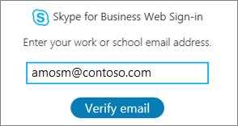

# 展開の Skype for Business Online フォン

これは、展開ガイドが展開をサポート Skype for Business Online IP フォンします。
  
企業のすべての種類] でが生じる電話番号を行い、音声通話を取得するユーザーは、ビジネスの重要な要件はします。電話番号を持つユーザーはビジネス デバイスが IP 電話、コンピューター、モバイル デバイスなどのすべての Skype の間での音声通話の発信できるようにします。ことができます詳細について Skype ビジネス IP 電話用[Skype for Business Online の取得電話](getting-phones-for-skype-for-business-online.md)を参照してください。
  
## IP 電話用展開の手順を実行します。

### 手順 1 - 製造元の管理者ガイドと電話のマニュアルをダウンロードします。

作業を開始する前に、電話の製造元の管理ガイドと電話ユーザー マニュアルをダウンロードすることをお勧めします。
  
- Polycom 電話、ドキュメントを参照して、[Polycom 展開] ((http://www.polycom.com/voice-conferencing-solutions/desktop-ip-phones.html)。
    
- Yealink 電話、[ビジネス HD SIP 電話ソリューションの Yealink Skype](http://www.yealink.com/products_top_2.html)を参照してください。
    
- 携帯電話[はプロビジョニング管理ガイド](https://www.audiocodes.com/solutions-products/products/products-for-microsoft-365/ip-phones-room-solutions)を参照してください。
    
### 手順 2 - 購入または移行する Skype for Business のサポートされている IP 電話とファームウェアを使用しているかどうかを確認

Skype for Business Online サポートの電話とファームウェアが同様に、Skype for Business Server の互換性のあるは、反対が true では常にします。確認するには、購入またはサポートされている電話およびファームウェアのプロビジョニングしているが、 [Skype for Business Online の取得電話](getting-phones-for-skype-for-business-online.md)を参照してください。
  
### 手順 3 - 右ファームウェアがインストールされていることを確認して、ファームウェアのアップデートが必要な場合

自分の携帯電話にファームウェアのバージョンを確認してください。場合。
  
- **Polycom VVX 携帯電話**、**設定**に移動 > **状態** > **プラットフォーム** > **アプリケーション** > **メイン**します。
    
- **Yealink 携帯電話**、携帯電話のメイン画面での**状態**に移動します。
    
- **は携帯電話**、**メニュー**に移動 > **デバイスのステータス** > スタート画面から**ファームウェアのバージョン**。
    
    > [!NOTE]
    > 電話の詳細をリモート アクセスは、製造元の管理ガイドを参照してください。電話のマニュアル、ユーザー ガイドの上にあるリンクを参照してください。 
  
- **携帯電話の Lync Phone Edition (LPE)**、**メニュー**に移動 > スタート画面から**システム情報**。
    
### 手順 4 - デバイスの更新に関する考慮事項

> [!NOTE]
> 5.5.1.X よりも前の Polycom ファームウェアが Skype for Business の実装「電話のロック」に置き換え、製造元が特定のデバイスのロック メカニズム「デバイスのロック」で保護された 5.4.X.X から「電話ロック」5.5.1.X に電話をアップグレードする「デバイス ロック」のままに保護されていない電話から PIN コードを継承されません。「デバイスのロック」がアクティブになっているユーザーは、ユーザーにアップグレード (lync.deviceUpdate.popUpSK.enabled=1) の時間の制御を渡す次 Polycom デバイスのプロファイルのパラメーターを有効にする必要があります。 
  
ファームウェアのアップデートは、ビジネスのサービスの Skype によって管理されます。すべての Skype for Business には、スマート フォンのファームウェアが Skype for Business 更新サーバーにアップロードされ、デバイスの更新が既定ですべての電話で有効になってが認められています。携帯電話とポーリング間隔の待ち時間によって電話をダウンロードしてインストール認定最新ビルド自動的にします。[セット CsIPPhonePolicy](https://technet.microsoft.com/en-us/library/mt629497.aspx)コマンドレットを使用して、 _EnableDeviceUpdate_パラメーターを設定してデバイスの更新プログラムの設定を無効にすることができます`false`します。
  

  
新しいファームウェアをいるときに使用できる進む準備ができたらをダウンロードしてインストールする、ユーザーが携帯電話に通知されます。Polycom 電話は、ユーザーに通知され、**更新**または**延期**するオプションを提供してされます。
  

  
Polycom 先の電話番号の**SwUpdate**を選択して、電話のファームウェアを更新できます。
  

  
パートナー プロビジョニング システムを使用してファームウェアのアップデートを管理することもできます。電話の高度なカスタマイズを含むシステムの管理を提供するパートナー、製造元の管理ガイドを参照してください。
  
> [!CAUTION]
> 単一のデバイス (インバンド デバイスの更新またはサード パーティの準備サーバー) 更新ループを避けるための権限の更新を確認します。 
  
### 手順 5 - の構成とインフラストラクチャ電話の設定

ポリシーに Skype for Business インバンド管理 Windows PowerShell コマンドレットを使い、頻繁に使用する電話のオプションを設定できます。これらのパラメーターを設定の詳細については、[セット CsIPPhonePolicy](https://technet.microsoft.com/en-us/library/mt629497.aspx)を参照してください。
  
ネットワーク インフラストラクチャの計画、 [Skype 運用フレームワーク](https://www.skypeoperationsframework.com/)を参照してください。
  
### 手順 6: ユーザーのサインイン用に準備します。

正常に Skype for Business Online の電話にサインインして、通話の発信にユーザーを有効にするには、ユーザーが正しいライセンスを割り当てられているかどうかを確認する必要があります。最低でもは、電話システムでライセンス、プランの呼び出しを割り当てる必要があります。詳細については、 [Skype for Business や Microsoft チーム アドオンのライセンス](../../skype-for-business-and-microsoft-teams-add-on-licensing/skype-for-business-and-microsoft-teams-add-on-licensing.md)を割り当てると[Skype](../../skype-for-business-and-microsoft-teams-add-on-licensing/assign-skype-for-business-and-microsoft-teams-licenses.md)とビジネスや Microsoft チームのライセンスを確認できます。
  
読みの詳細については、プランの呼び出しを確認できます[Office 365 のプランの呼び出しとは何ですか?](../../what-are-calling-plans-in-office-365/what-are-calling-plans-in-office-365.md)
  
- オンライン ユーザーはサポートされている**サインイン オプション**:
    
  - **Polycom VVX 5 xx/6 xx**電話を持つユーザーが表示されます。
    
     
  
  - **Yealink T48G/T46G**電話を持つユーザーが表示されます。
    
     
  
    製造元がサポートされているサインイン オプションの詳細については、 [Skype for Business Online の取得電話](getting-phones-for-skype-for-business-online.md)を参照してください。
    
- **ユーザー ID**電話のキーパッドを使用して、スクリーン キーボードの (使用可能な場合)、またはユーザーが携帯電話へのサインインに、組織のユーザー名とパスワードを使うことができます。たとえば、 *amosm@contoso.com*のような UPN 形式を使用すると、ユーザー名の必要がありますがします。
    
     
  
    > [!NOTE]
    > PIN 認証ではサポートされない Skype for Business Online LPE とパートナー IP 電話用します。 
  
- **PC を使用します。**相乗効果イーサネット (BToE) ソフトウェアは、ユーザーの PC にインストールされているし、有効になっている、ユーザーはで、windows 版の Skype for Business アプリの認証] ウィンドウの使用が携帯電話にログインことができます。その他の情報は、[手順 7 (省略可能): デバイスのペアリングと相乗効果イーサネット (BToE) がある場合](deploying-skype-for-business-online-phones.md#BK_BTOE)を参照してください。
    
    > [!NOTE]
    > ユーザーは、組織のユーザー名とパスワードを使用して、携帯電話にサインインする必要があります。たとえば、 *amosm@contoso.com*のような UPN 形式を使用すると、ユーザー名の必要がありますがします。
  
     
  
- **Web のサインインに使用する**: オンライン ユーザー認証標準の web ブラウザーを使用するための新しい方法です。一連の指示に従って、ブラウザーを使用してサインインするときにユーザーが提供されます。
    
  - **Polycom VVX 5 xx/6 xx**電話を持つユーザーが表示されます。
    
     
  
  - **Yealink T48G/T46G**電話を持つユーザーが表示されます。
    
     
  
    生成されたコードの有効期限は、15 分以内にします。期限切れ、ユーザーは**再試行**をクリックして**[ok]**によっては、電話、新しいコードを生成する必要があります。
    
  - **Polycom VVX 5 xx/6 xx**電話を持つユーザーが表示されます。
    
     
  
  - **Yealink T48G/T46G**電話を持つユーザーが表示されます。
    
     
  
    ブラウザーを使用してでは、携帯端末で表示されるアドレスに移動して、ビジネス ユーザー名の Skype を入力します。
    
     
  
    携帯端末でコードを入力します。
    
     
  
    サイトが表示されていることを確認"[電話の製造元の名前] **Skype for Business 認定済み Phone**の場合は、"**続行**] をクリックします。
    
     
  
    ユーザーの資格情報をクリックするか、**別のアカウントを使用**] をクリックします。
    
     
  
    次のページが表示されたら、ブラウザーを閉じるには安全です。
    
     
  
    > [!NOTE]
    > LPE は、skype for Business Online サポート サインイン USB ケーブル接続」のみを電話します。 
  
- **サポートされている展開**次の表は、現在サポートされている配置モデルなどの Exchange の統合、多要素認証 (MFA) と Skype for Business Online や社内の先進認証のサポートされている認証の種類を示しています。
    
|||||||
|:-----|:-----|:-----|:-----|:-----|:-----|
|**Skype for Business**   |**Exchange**   |**携帯電話へのサインイン方法**   |**Skype for Business アクセス**   |**最新の認証と MFA を無効になっている Exchange のアクセス**   |**最新の認証と MFA を有効になっている Exchange のアクセス**   |
|オンライン    |オンライン    |Web にサインイン    |○    |○    |○    |
|オンライン    |オンライン    |ユーザー名とパスワードを入力    |○    |○    |×    |
|オンライン    |オンプレミス    |Web にサインイン    |○    |×    |×    |
|オンライン    |内部設置型    |ユーザー名とパスワードを入力    |○    |○    |×    |
|オンプレミス    |オンライン/内部設置型    |PIN 認証    |○    |×    |×    |
|オンプレミス    |オンライン/内部設置型    |ユーザー名とパスワードを入力    |○    |○    |該当なし    |
|オンプレミス    |オンライン/内部設置型    |PC (BTOE) でサインイン    |○    |○    |該当なし    |
   
- **電話の機能**IP 電話パートナーに基づいてやや機能セットが異なる場合があります。完全な機能の設定し、各電話の製造元の機能の詳細については、 [Skype for Business Online の取得電話](getting-phones-for-skype-for-business-online.md)を参照してください。
    
- **電話ロック**は、Skype for Business 電話が認められて、電話をセキュリティで保護するためで最近導入された機能です。有効な場合、ユーザーは認証に失敗した暗証番号 (pin) を作成するように求められます。いったん作成した場合、携帯電話がアイドル状態で定義したタイムアウト、ユーザーが手動で電話をロックまたは携帯電話のペアリングを使用して、PC のロックと電話のロックを同期するときにロックされます。電話ロック PIN は、必要な回数だけが正しく入力は、電話がユーザーをサインアウトするか、電話のロックを解除する管理者向けのコードの要求] しますが、電話パートナーによって異なります。ユーザーの PIN は、6、15 桁の数字でなければなりません。
    
    (これは既定で有効に)、組織の携帯電話のロックを無効にする、アイドル状態のタイムアウト、変更、ロックされているか使用していないインバンド設定されている間に、ユーザーが電話をかけることができるかどうかを選択したりできます。これらの設定の詳細については、[セット CsIPPhonePolicy](https://technet.microsoft.com/en-us/library/mt629497.aspx)を参照してください。
    
## 手順 7 (省略可能): デバイスのペアがある場合、相乗効果イーサネット (BToE)

BToE は、paining メカニズム パートナー IP 電話は電話をペア ビジネス アプリケーション BToE 用の Windows でユーザーの電話を使用します。
  
- For Business のデスクトップ アプリ (PC を使用して)、Skype を使用して、IP 電話へのサインインします。
    
- PC のロックとロック電話を同期します。
    
- 電話をかける] をクリックします。
    
2 つのモードで動作する BToE を構成することができます: (既定) の*自動*および*手動*します。こともできます (既定) を有効になっている/用 Skype for Business のインバンド設定を使ってユーザーを無効にします。*手動*モードで使用する場合、ユーザーが携帯電話が Windows アプリのペアに追加の手順を実行する必要があります。
  
 **ユーザーに BToE を展開するには**
  
1. PC のポートを使用して、電話、PC に接続します。
    
     
  
2. ダウンロードして、次のリンクからの製造元の web サイトから最新の BToE ソフトウェアをインストールします。ユーザー エクスペリエンスを向上するには、配布し、システム センター構成マネージャー (SCCM) などの管理配布ソリューションを使用して BToE ソフトウェアをインストールできます。ヘルプは SCCM を使用して、[パッケージとシステム センター構成マネージャーのプログラム](https://docs.microsoft.com/en-us/sccm/apps/deploy-use/packages-and-programs)を参照してください。
    
  - [[サイトの Polycom BToE ソフトウェアのダウンロード](http://www.polycom.com/voice-conferencing-solutions/microsoft-phones.html)
    
  - [Yealink BToE ソフトウェアのダウンロード](http://www.yealink.com/products_list_10.html)
    
  - [BToE ソフトウェアをダウンロードします。](https://www.audiocodes.com/solutions-products/solutions/skype-for-business-microsoft-teams/skype-for-business-online)
    
3. BToE のサーバーの設定は、既定で**有効に**して**自動モード**に設定されています。これらの設定を変更するには、[セット CsIPPhonePolicy](https://technet.microsoft.com/en-us/library/mt629497.aspx)を参照してください。
    
> [!NOTE]
> BToE は Mac および VDI プラットフォーム上で現在サポートされていません。 
  
## 関連トピック
[Skype for Business とチームの Microsoft サービスの電話番号を取得します。](../../what-is-phone-system-in-office-365/getting-service-phone-numbers.md)

[ここではされた電話システムで Office 365 での表示](../../what-is-phone-system-in-office-365/here-s-what-you-get-with-phone-system.md)

[電話会議とプランの呼び出しの国と地域の空き時間情報](../../country-and-region-availability-for-audio-conferencing-and-calling-plans/country-and-region-availability-for-audio-conferencing-and-calling-plans.md)

