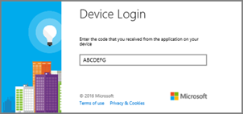
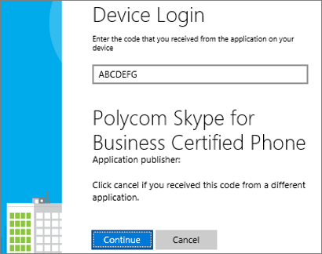

# Skype for Business Online 電話機の展開レポート

[] このガイドは Skype for Business Online IP 電話機の展開をサポートするガイドです。
  
あらゆる種類のビジネスにおいて、音声通話を発受信するための電話番号を確保することは、ビジネスを運営する上で重要な条件です。電話番号を有するユーザーは、IP 電話機、PC、モバイル デバイスを含むすべての Skype for Business デバイスで音声通話を行うことができます。Skype for Business IP 電話機の詳細については、「[Skype for Business Online で使う電話を入手する](getting-phones-for-skype-for-business-online.md)」をご覧ください。
  
## IP 電話機の展開手順

### ステップ 1 - メーカーの管理者ガイドと電話機のマニュアルのダウンロード

まず最初に、メーカーの管理ガイドと電話機のマニュアルをダウンロードすることをお勧めします。
  
- Polycom 電話の場合は、[Polycom 展開ガイド] を参照してください ((http://www.polycom.com/voice-conferencing-solutions/desktop-ip-phones.html)。
    
- Yealink 電話機については、『[Yealink Skype for Business HD SIP Phones Solution (Yealink Skype for Business HD SIP 電話機のソリューション)](http://www.yealink.com/products_top_2.html)』をご覧ください。
    
- AudioCodes 電話機については、『[Audiocodes Provisioning Management Guide (Audiocodes プロビジョニング管理ガイド)](https://www.audiocodes.com/solutions-products/products/products-for-microsoft-365/ip-phones-room-solutions)』をご覧ください。
    
### ステップ 2 - Skype for Business 対応 IP 電話機およびファームウェアを購入または移行していることを確認する

Skype for Business Online 対応の電話機およびファームウェアは、Skype for Business Server にも互換性がありますが、その逆の互換性は必ずしも保証されません。対応している電話機とファームウェアを購入またはプロビジョニングしていることを確認するには、「[Skype for Business Online で使う電話を入手する](getting-phones-for-skype-for-business-online.md)」の説明をご覧ください。
  
### ステップ 3 - 正しいファームウェアがインストールされていることを確認し、必要に応じてファームウェアを更新する

お使いの電話機のファームウェア バージョンを、それぞれ以下の方法で確認します。
  
- **Polycom VVX 電話**の場合は、**[設定]** > **[ステータス]** > **[プラットフォーム]** > **[アプリケーション]** > **[メイン]** に移動します。
    
- **Yealink 電話機** の場合は、メインの電話画面で [ **Status (情報)** ] に移動します。
    
- **AudioCodes 電話**の場合は、**[メニュー]** > **[デバイス ステータス]** > **[ファームウェア バージョン]** に移動します。
    
    > [!NOTE]
    > 電話機の詳細設定へのリモート アクセスについては、メーカーの管理ガイドをご覧ください。ユーザー ガイドおよび電話機マニュアルについては、上記のリンクをご覧ください。 
  
- **Lync Phone Edition (LPE) 電話**: スタート画面から **[メニュー] ** > **[システム情報] **に移動します。
    
### ステップ 4 - デバイス更新の考慮事項

> [!NOTE]
> 5.5.1.X より前の Polycom ファームウェアには、メーカー独自のデバイスのロック メカニズムが導入されています。このメカニズムは Skype for Business 実装の「電話のロック」に置換されています。「デバイスのロック」で保護されていた 5.4.X.X から「電話のロック」を備える 5.5.1.X に電話機をアップグレードすると、「デバイスのロック」から PIN コードが継承されないため、電話機が保護されていない状態になります。「デバイスのロック」を有効にしていたユーザーは、次の Polycom デバイスのプロファイル パラメーターを有効にして、ユーザーがアップグレードのタイミングを制御できるようにする必要があります (lync.deviceUpdate.popUpSK.enabled=1)。 
  
ファームウェアの更新は Skype for Business Service によって管理されます。Skype for Business 認定済みの電話機のファームウェアは Skype for Business Update サーバーにアップロードされます。既定では、デバイスの更新はすべての電話機で有効になっています。電話機の無通信時間およびポーリング間隔に応じて、電話機では最新の認定済みビルドがダウロードされ、インストールされます。デバイスの更新設定は [Set-CsIPPhonePolicy](https://technet.microsoft.com/en-us/library/mt629497.aspx) コマンドレットを使用して、 _EnableDeviceUpdate_ パラメーターを `false` に設定することで無効にできます。
  

  
新しいファームウェアが利用可能になり、ダウンロードとインストールの準備が整うと、電話機が通知を受信します。Polycom 電話機では、ユーザーは通知を受信し、[ **Update (更新)** ] または [ **Postpone (延期)** ] のいずれかを選択できます。
  

  
Polycom 電話機の場合は、 **SwUpdate** を選択することで電話機のファームウェアを更新できます。
  

  
パートナーのプロビジョニング システムを使用してファームウェアの更新を管理するように選択することもできます。高度な電話機カスタマイズなど、パートナー プロビジョニング システム管理を行う場合は、製造元の管理ガイドをご覧ください。
  
> [!CAUTION]
> 更新のループを回避するため、単一のデバイス更新機関 (インバンド デバイス更新またはサードパーティー プロビジョニング サーバー) を利用してください。 
  
### ステップ 5 - 電話の設定の構成とインフラ整備

Skype for Business インバンド管理の Windows PowerShell コマンドレットを使用して最も一般的に使用される電話機オプションをセットアップできます。これらのパラメーターおよび設定の詳細については、「[Set-CsIPPhonePolicy](https://technet.microsoft.com/en-us/library/mt629497.aspx)」をご覧ください。
  
ネットワーク インフラストラクチャの計画については、「[Skype Operations Framework (Skype の運用フレームワーク](https://www.skypeoperationsframework.com/)」をご覧ください。
  
### ステップ 6 - ユーザーのサインインの準備

ユーザーが正常に Skype for Business Online 電話機にサインインし、通話できるようにするには、ユーザーに正しいライセンスが割り当てられていることを確認する必要があります。 最低でも、電話システムのライセンスと通話プランを割り当てる必要があります。 詳細については、 [Skype for Business と Microsoft Teams アドオン ライセンス](../../skype-for-business-and-microsoft-teams-add-on-licensing/skype-for-business-and-microsoft-teams-add-on-licensing.md) および [Skype for Business と Microsoft Teams ライセンスの割り当て](../../skype-for-business-and-microsoft-teams-add-on-licensing/assign-skype-for-business-and-microsoft-teams-licenses.md)を表示できます。
  
通話プランの詳細については、「[Office 365 の通話プランについて](/microsoftteams/what-are-calling-plans-in-office-365)」を読むことで確認できます。
  
- Online ユーザーが利用できる **サインイン オプション** は次のとおりです。
    
  - **Polycom VVX 5XX/6XX** 電話機のユーザーには次の画面が表示されます。
    
     
  
  - **Yealink T48G/T46G** 電話機のユーザーには次の画面が表示されます。
    
     
  
    製造元ごとのサポートされるサインイン オプションの詳細については、「[Skype for Business Online で使う電話を入手する](getting-phones-for-skype-for-business-online.md)」をご覧ください。
    
- **ユーザー ID** ユーザーは、電話機のキーパッドまたは画面上のキーボード (利用可能な場合) を使用して、組織のユーザー名およびパスワードで電話機にサインインできます。たとえば、ユーザー名として *amosm@contoso.com*  のような UPN 形式を使用します。
    
     
  
    > [!NOTE]
    > PIN 認証は、LPE およびパートナーの IP 電話機向けの Skype for Business Online ではサポートされていません。 
  
- **PC の使用** ユーザーの PC に Better Together over Ethernet (BToE) ソフトウェアがインストールされ、有効化されている場合、ユーザーは Windows Skype for Business アプリの認証ウィンドウを使用して電話機にログインできます。 その他の情報については、「[ステップ 7 (省略可能) - デバイス ペアリングおよび Better Together over Ethernet (BToE) を使用する場合](deploying-skype-for-business-online-phones.md#BK_BTOE)」をご覧ください。
    
    > [!NOTE]
    > ユーザーは、電話機にサインインするために組織のユーザー名およびパスワードを使用する必要があります。たとえば、ユーザー名として  *amosm@contoso.com*  のような UPN 形式を使用します。
  
     
  
- **Web サインインの使用**: これは、Online ユーザーが標準の Web ブラウザを使用して認証を行うことができる新しい方法です。ユーザーには、ブラウザを使ってサインインするときの手順が提供されます。
    
  - **Polycom VVX 5XX/6XX** 電話機のユーザーには次の画面が表示されます。
    
     
  
  - **Yealink T48G/T46G** 電話機のユーザーには次の画面が表示されます。
    
     
  
    生成されるコードの有効期限は 15 分です。期限が切れると、ユーザーは電話機に応じて [ **再試行**] または [ **OK**] をクリックして新しいコードを生成する必要があります。
    
  - **Polycom VVX 5XX/6XX** 電話機のユーザーには次の画面が表示されます。
    
     
  
  - **Yealink T48G/T46G** 電話機のユーザーには次の画面が表示されます。
    
     
  
    ブラウザを使用して、電話機に表示されるアドレスに移動して、Skype for Business ユーザー名を入力します。
    
     
  
    電話機に表示されるコードを入力します。
    
     
  
    サイトに「[電話機メーカーの名前] **Skype for Business Certified Phone (Skype for Business 認定済みの電話機)**」と表示されていることを確認し、[ **続行**] をクリックします。
    
     
  
    ユーザーの資格情報をクリックするか、[ **Use another account (別のアカウントを使用する)**] をクリックします。
    
     
  
    下記のページが表示されたら、ブラウザを安全に閉じることができます。
    
     
  
    > [!NOTE]
    > Skype for Business Online 向けの LPE 電話機は USB テザリングを介したサインインのみをサポートします。 
  
- **サポートされる展開** 次の表は、Exchange 統合、多要素認証 (MFA) による先進認証、Skype for Business Online およびオンプレミスといった現在サポートされている展開モデルの対応認証方法を示しています。
    
|||||||
|:-----|:-----|:-----|:-----|:-----|:-----|
|**Skype for Business**   |**交換**   |**電話機のサインイン方法**   |**Skype For Business アクセス**   |**先進認証と MFA を無効にした Exchange アクセス**   |**先進認証と MFA を有効にした Exchange アクセス**   |
|オンライン    |オンライン    |Web サイン イン    |あり    |あり    |あり    |
|オンライン    |オンライン    |ユーザー名/パスワード    |あり    |あり    |なし    |
|オンライン    |オンプレミス    |Web サイン イン    |あり    |なし    |なし    |
|オンライン    |オンプレミス    |ユーザー名/パスワード    |あり    |あり    |なし    |
|オンプレミス    |オンライン/オンプレミス    |PIN 認証    |あり    |なし    |なし    |
|オンプレミス    |オンライン/オンプレミス    |ユーザー名/パスワード    |あり    |あり    |該当なし    |
|オンプレミス    |オンライン/オンプレミス    |PC 経由のサイン イン(BTOE)    |あり    |あり    |該当なし    |
   
- **電話機の機能** 機能セットは IP 電話機パートナーによって多少異なる場合があります。 完全な機能セットについて、および各電話機メーカーの機能の詳細情報については、「[Skype for Business Online で使う電話を入手する](getting-phones-for-skype-for-business-online.md)」をご覧ください。
    
- **電話のロック** は、電話機を保護するために Skype for Business 認定済み電話機に最近導入されてた機能です。この機能が有効な場合、ユーザーは正常な認証後に PIN を作成するように求められます。PIN の作成後、定義したアイドル タイムアウトを過ぎると電話機がロックされます。さらに、ユーザーは電話機を手動でロックするか、電話のペアリングを使用して電話のロックを同期させることもできます。電話のロックの PIN を複数回誤って入力すると、ユーザーが電話機からサインアウトされるか、管理者のコードを使用して電話機をロック解除する必要があります。ただし、これは電話機パートナーによって異なります。ユーザーの PIN は 6 桁から 15 桁です。
    
    既定で有効化されている組織の電話のロックの無効化、アイドル タイムアウトの変更、ロック時またはインバンド設定の未使用時にユーザーが通話できるかどうかの設定を行うことができます。これらの設定の詳細については、「[Set-CsIPPhonePolicy](https://technet.microsoft.com/en-us/library/mt629497.aspx)」をご覧ください。
    
## ステップ 7 (省略可能) - デバイス ペアリングおよび Better Together over Ethernet (BToE) を使用する場合

BToE は、ユーザーの電話機を Windows Skype for Business アプリとペアリングさせるパートナー IP 電話機の電話ペアリング メカニズムです。BToE により、ユーザーを次の操作を行うことができます。
  
- Skype for Business デスクトップ アプリ (PC を使用) を使用して IP 電話機にサインインする
    
- 電話のロックを PC のロックと同期する
    
- クリックして通話する
    
BToE の動作は [ *自動*  ] (既定) および [ *手動*  ] の 2 つのモードで構成できます。Skype for Business のインバンド設定を使用して、ユーザーに対して有効 (既定) または無効にすることもできます。[ *手動*  ] モードでの動作では、電話機と Windows アプリをペアリングするために追加の手順が必要になります。
  
 **ユーザーに BToE を展開する方法**
  
1. PC ポートを使用して PC を電話機に接続します。
    
     
  
2. 次に示すリンクを使ってメーカーの Web サイトから最新の BToE ソフトウェアをダウンロードし、インストールします。ユーザーの利便性を向上するため、System Center Configuration Manager (SCCM) などの管理配布ソリューションを使用して BToE ソフトウェアを配布して、インストールすることができます。SCCM の使用については、「[System Center Configuration Manager のパッケージとプログラム](https://docs.microsoft.com/en-us/sccm/apps/deploy-use/packages-and-programs)」をご覧ください。
    
  - [Polycom BToE ソフトウェア ダウンロード サイト](http://www.polycom.com/voice-conferencing-solutions/microsoft-phones.html)
    
  - [Yealink BToE ソフトウェア ダウンロード](http://www.yealink.com/products_list_10.html)
    
  - [AudioCodes BToE ソフトウェア ダウンロード](https://www.audiocodes.com/solutions-products/solutions/skype-for-business-microsoft-teams/skype-for-business-online)
    
3. 既定では、BToE のサーバー設定は [ **有効** ] および **自動モード** です。 これらの設定を変更するには、 [セット CsIPPhonePolicy](https://technet.microsoft.com/en-us/library/mt629497.aspx)を参照してください。
    
> [!NOTE]
> BToE は Mac および VDI プラットフォームでは現在サポートされていません。 
  
## 関連トピック
[Skype for Business および Microsoft Teams のサービス電話番号の取得](../../what-is-phone-system-in-office-365/getting-service-phone-numbers.md)

[Office 365 での電話システムで利用できる機能](/MicrosoftTeams/here-s-what-you-get-with-phone-system)

[国および地域ごとの電話会議および通話プランの利用可能性](/microsoftteams/country-and-region-availability-for-audio-conferencing-and-calling-plans/country-and-region-availability-for-audio-conferencing-and-calling-plans)

  
 
