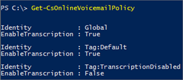

# <a name="set-up-phone-system-voicemail"></a>電話システムのボイス メールを設定します

この資料では、 [Office 365 の管理者用](http://support.office.com/article/da585eea-f576-4f55-a1e0-87090b6aaa9d)ビジネスでのすべてのユーザーの電話システム ボイスメール機能を設定したいのです。
  
> [!NOTE]
> 電話システム ボイスメールでは、ボイスメール メッセージの預かりで Exchange メールボックスのみをサポートし、サードパーティーの電子メール システムはサポートしません。フォールバック メカニズムとして、電話システム ボイスメールでは SMTP を使用してメッセージを再送信できます。このため、サードパーティーの電子メール システムのメールボックスを使っているユーザーは、受信するボイスメール メッセージでサービスの稼働時間が保証されたり、挨拶文やその他の設定の変更などのその他のボイスメール機能が提供されたりすることはありません。 
  
## <a name="cloud-only-environments-set-up-phone-system-voicemail"></a>クラウドのみの環境: 電話システム ボイスメールのセットアップ

Skype for Business Online および通話プランのユーザーには電話システム ボイスメールが自動的にセットアップされ、ユーザーに **電話システム** ライセンスと電話番号を割り当てるとプロビジョニングされます。
  
1. 電話システム機能がプランに含まれていない場合は、 **電話システム** アドオン ライセンスの購入が必要になることがあります。 Exchange Online ライセンスの購入も必要になる可能性があります。 [Skype](../../skype-for-business-and-microsoft-teams-add-on-licensing/skype-for-business-and-microsoft-teams-add-on-licensing.md)を参照してください。
    
2. [一般法人向け Office 365 ライセンスの割り当てまたは解除方法](http://support.office.com/article/997596b5-4173-4627-b915-36abac6786dc)、[Skype for Business と Microsoft Teams のライセンスを割り当てる](../../skype-for-business-and-microsoft-teams-add-on-licensing/assign-skype-for-business-and-microsoft-teams-licenses.md)、および Exchange Online ライセンスを組織のメンバーに割り当てます。これが完了すると、メンバーはボイスメール メッセージを受信できるようになります。
    
3. ボイスメール トランスクリプションに対するサポートは 2017 年 3 月時点で追加されており、すべての組織とユーザーに対して既定で有効になっています。Windows PowerShell を使用し、下記の手順を実行することによって、所属する組織のトランスクリプションを無効にすることができます。
    
## <a name="phone-system-with-on-premises-environments"></a>オンプレミス環境での電話システム

電話システム ボイスメールをオンプレミスの通話プラン環境で動作させる設定に関する情報は以下のとおりです。
  
1. 電話システム機能がプランに含まれていない場合は、 **電話システム** アドオン ライセンスの購入が必要になることがあります。 Exchange Online ライセンスの購入も必要になります。 [Skype](../../skype-for-business-and-microsoft-teams-add-on-licensing/skype-for-business-and-microsoft-teams-add-on-licensing.md)を参照してください。
    
2. [一般法人向け Office 365 ライセンスの割り当てまたは解除方法](http://support.office.com/article/997596b5-4173-4627-b915-36abac6786dc)、[Skype for Business と Microsoft Teams のライセンスを割り当てる](../../skype-for-business-and-microsoft-teams-add-on-licensing/assign-skype-for-business-and-microsoft-teams-licenses.md)、および Exchange Online ライセンスを組織のユーザーに割り当てます。
    
3. [ビジネス クラウド コネクタのエディションについてを構成する Skype](https://technet.microsoft.com/en-us/library/mt605228.aspx)の**ユーザーの電話システムの音声と音声メール サービスを有効にする**] セクションの指示に従います。
    
4. ボイスメール トランスクリプションに対するサポートは 2017 年 3 月時点で追加されており、すべての組織とユーザーに対して既定で有効になっています。Windows PowerShell を使用し、下記の手順を実行することによって、所属する組織のトランスクリプションを無効にすることができます。 
    
5. オンプレミスのメールボックスを持つ電話システム ユーザーのために Azure ボイスメール メッセージの配信を構成する方法については、「[Azure PBX voicemail support for Exchange Server](https://support.microsoft.com/en-us/kb/3195158)」もご覧ください。
    
## <a name="setting-voicemail-policies-in-your-organization"></a>組織内のボイスメール ポリシーの設定

ボイスメールの議事録が既定で有効にして、すべての組織とユーザーの既定での議事録の不適切なマスキングが無効になっています。ただし、[セット CsOnlineVoicemailPolicy](https://technet.microsoft.com/EN-US/library/mt798310.aspx)と[与える CsOnlineVoicemailPolicy](https://technet.microsoft.com/EN-US/library/mt798311.aspx)コマンドレットを使用して、それらを制御できます。
  
> [!IMPORTANT]
> 議事録と議事録の不適切な**新しい CsOnlineVoiceMailPolicy**コマンドレットを使用してマスクの新しいポリシー インスタンスを作成することはできません。 し、**削除 CsOnlineVoiceMailPolicy**コマンドレットを使用して、既存のポリシーのインスタンスを削除することはできません。.
  
ボイスメール ポリシーを使用してユーザーのトランスクリプション設定を管理することができます。 すべての利用可能なボイスメール ポリシーのインスタンスを表示するには、 [Get CsOnlineVoicemailPolicy](https://technet.microsoft.com/library/mt798311.aspx)コマンドレットを使用することができます。
  
 **PS C:\\> Get-CsOnlineVoicemailPolicy**
  

  
### <a name="turning-off-transcription-for-your-organization"></a>組織のトランスクリプションをオフにする

組織のトランスクリプションに関する既定の設定はオンになっており、[Set-CsOnlineVoicemailPolicy](https://technet.microsoft.com/EN-US/library/mt798310.aspx) を使用して無効にすることができます。これを行う場合は、次を実行します。
  
```
Set-CsOnlineVoicemailPolicy -EnableTranscription $false
```

### <a name="turning-on-transcription-profanity-masking-for-your-organization"></a>組織の議事録の不適切なマスキングを有効にします。

組織の既定での議事録の不適切なマスキングが無効です。 有効にするには、ビジネス要件がある場合は、議事録の不適切な[設定 CsOnlineVoicemailPolicy](https://technet.microsoft.com/EN-US/library/mt798310.aspx)を使用して、マスキングを有効にできます。 これを行う場合は、次を実行します。
  
```
Set-CsOnlineVoicemailPolicy -EnableTranscriptionProfanityMasking $true
```

### <a name="turning-off-transcription-for-a-user"></a>ユーザーのトランスクリプションをオフにする

ユーザー ポリシーは組織の既定の設定より前に評価されます。たとえば、ボイスメール トランスクリプションがすべてのユーザーに対して有効になっている場合、[Grant-CsOnlineVoicemailPolicy](https://technet.microsoft.com/library/mt798309.aspx) コマンドレットを使用して、特定のユーザーに対するトランスクリプションを無効にするポリシーを割り当てることができます。
  
単一ユーザーに対するトランスクリプションを無効にするには、次を実行します。
  
```
Grant-CsOnlineVoicemailPolicy -PolicyName TranscriptionDisabled -Identity sip:amosmar@contoso.com
```

### <a name="turning-on-transcription-profanity-masking-for-a-user"></a>ユーザーの議事録の不適切なマスキングを有効にします。

特定のユーザーの議事録の不適切なマスキングを有効にするには、 [Grant CsOnlineVoicemailPolicy](https://technet.microsoft.com/EN-US/library/mt798309.aspx)コマンドレットを使用して特定のユーザーの議事録の不適切なマスキングを有効にするポリシーを割り当てることができます。
  
議事録の不適切な単一のユーザー用のマスキングを有効にするには、次のコマンドを実行します。
  
```
Grant-CsOnlineVoicemailPolicy -PolicyName TranscriptionProfanityMaskingEnabled -Identity sip:amosmar@contoso.com
```

> [!IMPORTANT]
> Office 365 のボイスメール サービスによってボイスメール ポリシーがキャッシュされ、4 時間ごとにキャッシュが更新されます。このため、ポリシーを変更した場合、変更が適用されるまでに最長で 4 時間かかる場合があります。 
  
## <a name="help-your-users-learn-skype-for-business-voicemail-features"></a>Skype for Business ボイスメールの機能に関するユーザーの理解を支援する

ユーザーが Skype for Business ボイスメールを正しく使用できるように支援するためのトレーニング情報と記事が用意されています。以下の記事をユーザーに紹介してください。
  
- [Skype for Business ボイス メールの確認とオプション](http://support.office.com/article/2deea7f8-831f-4e85-a0d4-b34da55945a8): この記事では、Skype for Business でボイスメールを再生し、ボイスメール応答メッセージを変更し、ボイスメールの設定を変更し、ボイスメールを異なる速度で再生する方法について説明します。
    
- [Skype for Business 2016 トレーニング](http://support.office.com/article/eb2081bc-fd0a-4eda-94da-5a39f369ee74)
    
## <a name="related-topics"></a>関連トピック
[Skype for Business Online のセットアップ](../../set-up-skype-for-business-online/set-up-skype-for-business-online.md)

[Office 365 での電話システムで利用できる機能](../../what-is-phone-system-in-office-365/here-s-what-you-get-with-phone-system.md)

## <a name="feedback"></a>フィードバックですか。
製品に関するフィードバックを提供するには、かをお知らせいただいて、取り組み方は、 [Skype](https://www.skypefeedback.com)を参照してください。