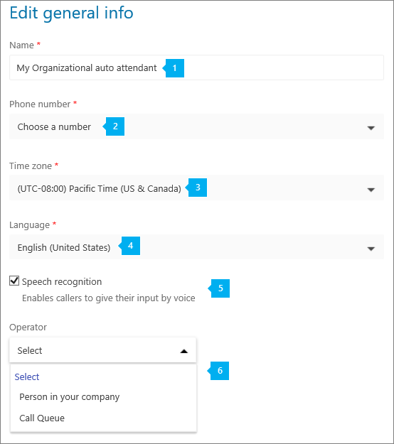
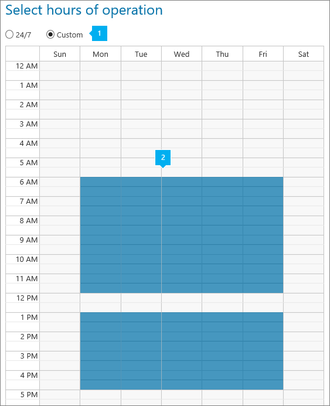
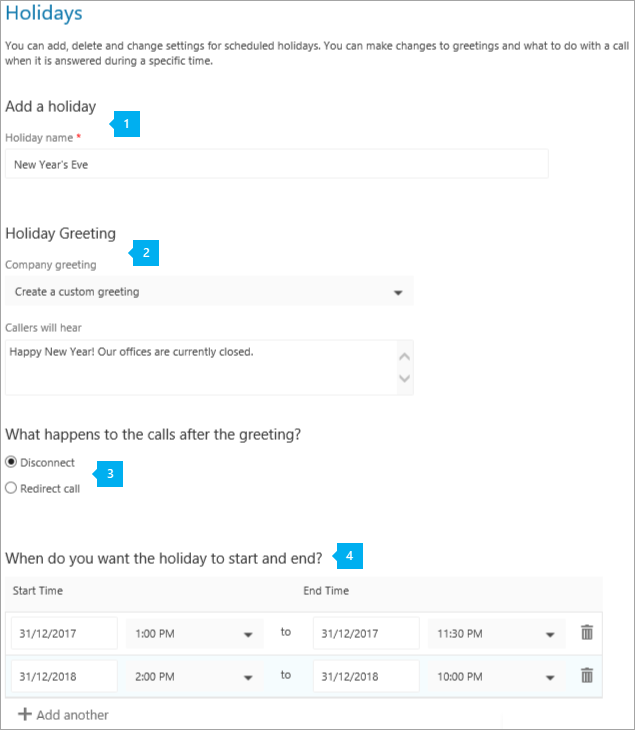
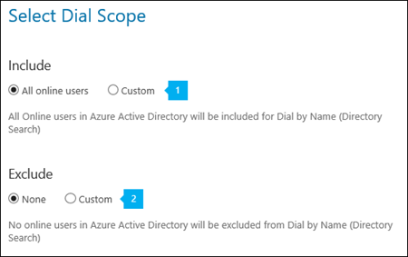

# 電話システムの自動応答を設定します

自動応答は、組織へのコールし、右の部門にそれらを取得するには、キュー、人、または演算子を呼び出すメニュー システムを移動するユーザーを使用できます。 ビジネス管理センターは、Skype を使用して、組織の自動応答を作成できます。 To create a new auto attendant, go to **Call routing** in the left navigation, and then select **Auto attendants** > **Add new**.
  
自動アテンダントの詳細についてはする場合を参照してください[電話システムの自動応答は何ですか?](what-are-phone-system-auto-attendants.md)
  
## ステップ 1 - はじめに

- Before you can create and set up your auto attendants, you will need to get or transfer your existing toll or toll-free service numbers. 有料または無料のサービスの番号を取得した後にで示される**ビジネス管理センターの Skype** > **音声** > **の電話番号**のページです。 サービス番号を取得するには、 [Skype のビジネスおよびマイクロソフトのチームの取得サービスの電話番号](getting-service-phone-numbers.md)を参照するか、転送し、既存のサービス番号にする場合は、 [Office 365 に電話番号を転送する](../what-are-calling-plans-in-office-365/transfer-phone-numbers-to-office-365.md)を参照してください。 **User (subscriber)** numbers can't be assigned to auto attendants. 米国以外の場合は、サービス番号を取得するビジネス管理センターの Skype を使うことはできません。移動[ここでは](../what-are-calling-plans-in-office-365/manage-phone-numbers-for-your-organization/manage-phone-numbers-for-your-organization.md)代わりにします。
    
    > [!CAUTION]
    > 取得し、フリー ダイヤル電話番号を使用して、通信のクレジットを設定する必要があります。 この参照を行うに[通信のクレジットは何ですか?](../skype-for-business-and-microsoft-teams-add-on-licensing/what-are-communications-credits.md)し、[組織の通信のクレジットを設定](../skype-for-business-and-microsoft-teams-add-on-licensing/set-up-communications-credits-for-your-organization.md)。 
  
- 組織は、エンタープライズの E3 と**電話システム**のライセンスまたはエンタープライズ E5 のライセンス (最低) が必要です。 自動応答に使用する利用可能なサービス番号の番号を割り当てられている**電話システム**のユーザー ライセンスの数に影響します。 ことが自動応答の数は、組織に割り当てられている番号の**電話システム**と**オーディオ会議**ライセンスに依存します。 、ライセンスに関する詳細については、移動[は、ここ](../skype-for-business-and-microsoft-teams-add-on-licensing/skype-for-business-and-microsoft-teams-add-on-licensing.md)です。
    
    > [!TIP]
    > 演算子または**電話システム**のライセンスを持つオンラインのユーザーは、メニュー ・ オプションへの呼び出しをリダイレクトするには、エンタープライズ VoIP を有効にするか、Office 365 のプランを呼び出すことを割り当てることにする必要があります。 「[Skype for Business と Microsoft Teams のライセンスを割り当てる](../skype-for-business-and-microsoft-teams-add-on-licensing/assign-skype-for-business-and-microsoft-teams-licenses.md)」をご覧ください。 Windows PowerShell を使用することもできます。 などを実行します。`Set-CsUser -identity "Amos Marble" -EnterpriseVoiceEnabled $true` 
  
## ステップ 2 - 新しい自動応答の作成

In the **Skype for Business admin center**, click **Call routing** > **Auto attendants**, then click **Add new**:
  
### [一般情報の編集] ページ
  

  
***
 **名**自動アテンダントのわかりやすい表示名を入力します。 名前の入力は必須で、空白を含む最大 64 文字を含めることができます。 この名前は [ **自動応答**] タブの [ **名前**] 列に表示されます。
***

 **電話番号**この設定は省略可能です。 必要な場合、自動応答の電話番号を選択します。 任意の利用可能なサービスの有料または無料電話番号が組織のあるを選択することができます。 電話番号が一覧表示されない場合は、サービスの有料またはフリーダイヤルの電話番号を取得する必要があります。 移動[ここで](getting-service-phone-numbers.md)それらを取得します。    

    > [!Note]
    > **User (subscriber)** numbers can't be assigned to auto attendants.
***
 **タイム ゾーン** 自動応答にはタイム ゾーンを設定する必要があります。ただし、組織のメイン アドレスのタイム ゾーンと一致している必要はありません。各自動応答には、異なるタイム ゾーンを設定できます。自動応答の営業時間の設定は、ここで選択したタイムゾーンに基づきます。
***
 **言語**表示されている利用可能な言語のいずれかからの自動応答に使用する言語を選択します。 ここで設定した言語は、この自動の応答へのコールの人と対話する自動応答を使用し、この言語ですべてのシステム プロンプトが再生する言語です。
***
 **音声認識**音声認識機能し、このオプションが選択されているかどうか。 人を呼び出すには、設定した言語で音声入力を使用できます。 のみできるように、電話のキーパッドを使用する場合は、それをオフにして音声認識機能を無効にできます。
***
 **オペレーター** このオプションは省略可能で、自動応答で設定する必要はありません。 ただし、電話することを支援してくれる人に話をするメニューを解除することをする人の**オペレーター**のオプションを設定できます。     オペレーターには、キー 0 が自動的に割り当てられます。     場合はこの設定をして、ユーザーに伝えることで、これは、使用可能なオプションの**編集] メニューのオプション**で、**営業時間の問い合わせ対応**のページを呼び出す人がも必要です。 自動応答でオペレーターを設定する場合は、**発信者が**ボックスに対応するプロンプト テキストを入力または、このオプションを指定するのには、オーディオのファイルを変更する必要があります。 "たとえば、演算子、0 を押します。"     次の項目のいずれかをオペレーターとして設定できます。 
*    エンタープライズ VoIP を有効にするか Office 365 のプランを呼び出すことを割り当てられている**電話システム**のライセンスは、**あなたの会社の人**です。  

        > [!Note] 
        > オンライン ユーザーは、**社内のユーザー**またはユーザーには、設置がホストされているビジネス サーバー 2015 または Lync Server 2013 の Skype を使用します。 Lync Server 2010 の使用はサポートされていません。   

*    設定済みの **通話キュー**。 
*    発信者がボイスメールに送られるように設定できます。 これを行うには、**あなたの会社の担当者**を選択し、ボイスメールに直接転送するのにはこのメンバーの呼び出しを設定します。 
   
### 営業時間の選択ページ

既定では、営業時間内に設定されます、1 日、週 7 日 24 時間すべての時間は営業時間内と見なされるため。 営業時間に含まれない時間は営業時間外として考慮されます。 [**カスタム**] オプションを選択し、[会社の就業時間を設定して場合、**時間処理の呼び出し後**に呼び出される新しいページ追加されます、自動アテンダント業務時間終了後の処理の呼び出しを構成することができます。
  

***
 カレンダーで特定の営業時間を選択するには、[ **カスタム**] オプションを選択します。[ **カスタム**] を選択すると、既定により、営業時間が月曜日から金曜日の午前 9:00 から午後 5:00 に設定されます。
***
 営業時間を変更するには、勤務時間の予定表を使用して設定するを選択します。 予定表を使用すると、営業時間を選択して、30 分間隔でと、ここで選択した営業時間はに基づいて設定する [**全般情報]**ページで設定したタイム ゾーン。 休憩 (昼食休憩など) を設定するには、選択を解除または、予定表の時刻の選択を解除するのにはドラッグします。 営業時間内で複数の破断を設定できます。 
   
### [営業時間は、処理のページを呼び出す

> [!TIP]
> カスタムの営業時間スケジュールを使用する場合は、営業時間外の通話処理を設定する必要があります。[ **営業時間外後の問い合わせ対応**] ページが追加されるので、そこでこのオプションを構成できます。このページには、[ **営業時間の問い合わせ対応**] と同じオプションが表示されます。 
  
その人が勤務時間中に、組織の自動応答の電話番号への呼び出しが聞こえますごきげんよう、プロンプト、およびメニューを設定できます。
  

  
***
 **応答メッセージ** 営業時間の応答メッセージは省略可能で、[ **なし**] に設定できます。 この場合、発信者には選択したオプションによって通話が処理されるまでメッセージまたは応答メッセージは再生されません。 音声ファイル (.wav、mp3 または .wma 形式) をアップロードしたり、テキスト読み上げを使用してカスタムの応答メッセージを作成することもできます。
*    **なし**自動アテンダントの電話番号への人を呼び出すには、あいさつ文は再生されません。
*    **作成するカスタムの案内応答**このオプションを選択する場合は、(1000 文字以内) を読み取るシステムを設定するテキストを入力します。 などの入力があります"Contoso へようこそ。 お電話ありがとうございます。 **相手**ボックスします。
*    **オーディオ ファイルをアップロード**これを選択する場合は、あいさつ文を記録し、オーディオ (.wav、.mp3 や .wma 形式) でファイルをアップロードしています。
***
 営業時間中に着信した呼び出しの動作を選択します。 次のオプションから選択できます。
*    **切断**を選択する場合は、業務時間の案内応答を聞く後相手が切断されます。
*    **呼び出しをリダイレクトします。**呼び出しを自動的に送信するために使用できます。
     *    エンタープライズ VoIP を有効にするか Office 365 のプランを呼び出すことを割り当てられている**電話システム**のライセンスは、**あなたの会社の人**です。 発信中のユーザーがボイスメールに送信されるように設定できます。 これを行うには、**社内の担当者**を選択しの呼び出しは、ボイスメールに直接転送するには、このユーザーを設定します。      
        > [!Note]
        > オンライン ユーザーは、**社内のユーザー**またはユーザーには、設置がホストされているビジネス サーバー 2015 または Lync Server 2013 の Skype を使用します。 Lync Server 2010 はサポートされていません。   

     *    呼び出しキューを使用して**キューの呼び出し**は、呼び出しを設定する既存のキューに転送する呼び出しを許可します。
     *    既存を使用する別**の自動応答**は自動アテンダントのサブメニューを含むメニューのオプションの 2 番目のレベルを作成します。 これらの入れ子になった自動応答と呼ばれます。
*    **メニュー オプションのプロンプトを再生します。**これらは、再生するプロンプトを設定することにも使用できます。
***
 **メニュー プロンプト** メイン メニュー プロンプトを作成するには、テキスト読み上げを使用するか、音声ファイル (.wav, .mp3 または .wma) をアップロードできます。[ **発信者にはこのように聞こえます**] ボックスにプロンプトを入力できます。また、たとえば「セールスの場合は 1 を押すか、1 と言ってください。サービスの場合は 2 を押すか、2 と言ってください。カスタマー サポートの場合は 3 を押すか、3 と言ってください。オペレーターの場合は 0 を押すか、0 と言ってください。このメニューをもう一度お聞きになりたい場合は、アスタリスク キーを押すか、リピートと言ってください。」という音声ファイルを録音できます。 **カスタム プロンプトを作成** このオプションを選択する場合は、システムが読み上げるテキスト (最大 1000 文字) を入力する必要があります。 **音声ファイルをアップロード** このオプションを選択する場合は、応答メッセージを録音して、音声ファイル (.wav, .mp3 または .wma 形式) をアップロードする必要があります。
***
 **名前によるダイヤル**このオプションを選択する場合は、ディレクトリ検索を使用して、組織内の人を検索するに通話する相手を有効にするはこれ。 人が表示されます利用可能または利用できないとダイヤルの名前**スコープのダイヤル**のページでこれらのオプションを設定して、選択することができます。 オンライン、**電話システム**のライセンスを持つユーザーまたはすべてのユーザーに設置がホストされている名前でダイヤルを持つビジネス サーバー 2015 または Lync Server 2013 では、Skype を使用するを参照しています。    **注意:**ユーザーには、設置がホストされている名前によるダイヤルの Lync 2010 に**到達できない**を使用します。
***

 **メニューのオプションを編集します。**メニュー オプションを追加またはキーパッドのキーのボタンを使用して削除できます。 メニュー オプションを追加するには、キーパッドの対応するキーを押します。 カラーで使用中のキーが変更され、以下のオプションに対応する行が表示されます。 メニュー オプションを削除するには、このキーの選択を解除するのにはキーパッド制御に対応するキーをクリックします。 キーのマッピング行が削除されます。    **ヒント:**メニュー プロンプトのテキストを更新または再録音とは別に既存のメニューのプロンプトを自動的に行われませんので、オプションを削除するのに追加する場合する必要があります。      いずれかのメニュー オプションを追加し、任意の順序で削除し、キー ・ マッピングを継続する必要はありません。 たとえば、0、1、および 3 の 2 のキーが使用されていないときにオプションでは、マップのキーを持つメニューを作成します。   

    > [!Note] 
    > The keys * (Repeat) and # (Back) are reserved by the system and can't be reassigned. If speech recognition is enabled, pressing * will correspond with "Repeat" and # will correspond with the "Back" voice commands.   

キーを選択した後に] メニューの [オプション] を設定する必要があります。 
- **オプションの名前を入力**最大 64 文字を入力でき、これと、「顧客サービス」または「操作土地とします」のように複数の単語を含めることができます。 音声認識が有効な場合、名前は自動的に認識され、相手呼び出しはか、3 を押して、「3」と答えることができる 3 をキーにマップされているオプションを選択する「顧客サービス」と答えるとします。 
- 次の手順では、呼び出しのかどうか、対応するキーが押された、またはオプションを選択する音声認識機能を使用して送信する先を選択します。 呼び出しを送信できます。 
    - **演算子**オペレーターが既に設定されて、キー 0 に自動的にマップされているもは、削除または別のキーを再割り当ています。 演算子は、任意のキーに設定されていない、し、音声指示コマンド「演算子」無効になります。 
    - エンタープライズ VoIP を有効にするか Office 365 のプランを呼び出して、割り当てられている**電話システム**のライセンスの**会社の人**です。 発信中のユーザーがボイスメールに送信されるように設定できます。 これを行うには、**社内の担当者**を選択しの呼び出しは、ボイスメールに直接転送するには、このユーザーを設定します。   
    
        > [!Note] 
        > オンライン ユーザーは、**社内のユーザー**またはユーザーには、設置がホストされているビジネス サーバー 2015 または Lync Server 2013 の Skype を使用します。 Lync Server 2010 はサポートされていません。   

    - **キューを呼び出す**設定した既存の呼び出しキューに転送する呼び出しは、呼び出しキュー オプションを使用してできます。 
    - **自動応答**既存の自動応答を使用すると、サブメニューを含むメニューのオプションの 2 番目のレベルを作成します。 これらの入れ子になった自動応答と呼ばれます。  
    
        > [!Note]
        > 入れ子になった (または第 2 レベル) の自動応答の**勤務時間**も使用されます、設定されている他の自動応答から送信された呼び出しを含みます。         
   
### 休日ページを選択します。 

各自動応答には、最大 20 個のスケジュールされた祝日を追加できます。
  

  
***
 **祝日を追加****休日名**」フィールドに、新しい休日の名前を入力します。   祝祭日の名前は最大 64 文字で構成されている可能性があり、同じ自動応答ごとに一意である必要があります。 たとえば、同じ自動応答で「感謝祭」をという 2 つの休日を持つことはできません。  
***
 **祝日の案内応答**祝日の案内応答はオプションであり、 **[なし]**に設定することができます。 この場合、発信者には選択したオプションによって通話が処理されるまでメッセージまたは応答メッセージは再生されません。 音声ファイル (.wav、mp3 または .wma 形式) をアップロードしたり、テキスト読み上げを使用してカスタムの応答メッセージを作成することもできます。
*    **なし**自動アテンダントの電話番号への人を呼び出すには、あいさつ文は再生されません。
*    **作成するカスタムの案内応答**このオプションを選択する場合は、(1000 文字以内) を読み取るシステムを設定するテキストを入力します。 Happy New Year"を入力するたとえば、! オフィスは現在閉じられています。」 **相手**ボックスします。
*    **オーディオ ファイルをアップロード**これを選択する場合は、時候のあいさつを記録し、オーディオ (.wav、.mp3 や .wma 形式) でファイルをアップロードしています。  
***
 **あいさつ文の後の呼び出しに動作しますか。** このホリデー シーズン中に着信した呼び出しの動作を選択します。 次のオプションから選択できます。
*    **切断**時候のあいさつが聞こえてから、相手呼び出しが切断されます。
*    **呼び出しをリダイレクトします。**呼び出しを自動的に送信するために使用できます。
     *    エンタープライズ VoIP を有効にするか Office 365 のプランを呼び出すことを割り当てられている**電話システム**のライセンスの**会社の人**です。 発信中のユーザーがボイスメールに送信されるように設定できます。 これを行うには、**あなたの会社の人**を選択し、この人を通話をボイスメールに直接転送します。    
     
         > [!Note] 
         > オンライン ユーザーは、**社内のユーザー**またはユーザーには、設置がホストされているビジネス サーバー 2015 または Lync Server 2013 の Skype を使用します。 Lync Server 2010 はサポートされていません。  

     *    呼び出し設定する既存のキューに通話を転送する**キューの呼び出し**です。
     *    別**の自動応答**、2 番目のレベルのサブメニューを含むメニュー オプションを作成します。 これらの入れ子になった自動応答と呼ばれます。   
     
         > [!Note]
         > 既定では、休日期間中に到着したすべての呼び出しを設定するとは異なる動作が必要な場合は、リダイレクトを指定する必要がありますので、あいさつ文 (該当する場合) 後に、切断します。

***
 **休日を開始および終了をしますか。** Dd/mm/日の形式で、祝日の開始日を入力し、日付の範囲テーブルに表示されるので、開始時刻、終了日、および終了時刻を選択します。  休日の最大 10 個までの異なる日付範囲を指定できます。 たとえば、最大で 10 年間のクリスマスの休日の日付の範囲を追加できます。 休業日は、複数日にまたがることができます。  追加するには、休日の日付の範囲 (たとえば、次年度)**を追加**する] をクリックし、開始日と終了日、ホリデー シーズン用の新しいセットを入力します。  入れ子になった休日もサポートします。 たとえば、1 つの「休日ブレーク」のタイム フレーム内で複数の休日を入れ子にする可能性があります。 
*    **1 月 3 日から 12 月 24日:**「楽しい休日を! オフィスは現在閉じられています。 私たちが再び表示 1 月 4 日。」
*    **12 月 25 日:**"メリー クリスマス! オフィスは現在閉じられています。 私たちが再び表示 1 月 4 日。」
*    **1 月 1 日:**"Happy New Year! オフィスは現在閉じられています。 私たちが再び表示 1 月 4 日。」
   
自動応答を保存した後、[**休日**] タブの編集、追加、または祝日の設定を変更をする、祝日が表示されます。
  
### ダイヤルの範囲を選択ページ

このページには、組織内のどのユーザーになりますディレクトリに一覧表示されているとダイヤルの利用可能な場合で組織を呼び出す人の名前でを設定することができます。
  

  
***
 [ **含める**] オプションには次の 2 つのオプションがあります。
*    **すべての Online ユーザー** このオプションを使用すると、組織のすべてのユーザーがディレクトリ検索に含められます。 ユーザーだけでなく、**電話システム**のライセンスを持つすべてのオンライン ユーザーには、設置がホストされているビジネス サーバー 2015 または、Office 365 のプランを呼び出すことを持っている Lync Server 2013 の Skype を使用して一覧表示されます。 
*    **カスタム**このオプションを使用して、Office 365 のグループ、配布リスト、または組織内で作成されたセキュリティ グループを検索することができます、人がこの Office 365 のグループ、配布リスト、またはいずれかの**は、ユーザー セキュリティ グループにでオンラインのユーザーを追加する場合、電話システムのライセンス**またはオンプレミスでホストされているビジネス サーバー 2015 または Lync Server 2013 の Skype を使用しています。 複数の Office 365 のグループ、配布リスト、およびセキュリティ グループを追加することができます。    

    > [!Caution]
    > オンプレミス ユーザーが Lync Server 2010 の展開は、名前が他のダイヤルを使用してディレクトリを検索すると表示されません。 
***
 **除外**オプションを使用すると、2 つのオプションがあります。
*    **なし** このオプションを使用すると、いずれの Online ユーザーもディレクトリ検索から除外しません。 
*    **カスタム**このオプションを使用する場合、Office 365 のグループ、配布リスト、または組織内で作成されたセキュリティ グループを検索することができますおよびすべてのユーザーが Office 365、そのグループに配布リストを追加またはセキュリティ グループは、ディレクトリ検索から除外されます。 複数の Office 365 のグループ、配布リスト、およびセキュリティ グループを追加することができます。    

    > [!Caution]
    > オンプレミス ユーザーが Lync Server 2010 の展開は、名前が他のダイヤルを使用してディレクトリを検索すると表示されません。          
   
> [!NOTE]
> ディレクトリに一覧表示、ダイヤルを使用するときに名前で音声認識でその名前を持つ新しいユーザーには、最大で 36 時間がかかる場合があります。 
  
すべての必須フィールドに入力して、メニューとオプションを処理する呼び出しを設定して後、は、**保存**をクリックします。
  
## 編集と自動応答をテストします。

自動応答を保存すると、[ **自動応答**] ページに表示されます。 これによって、迅速にいくつかのオプションを設定するなどの名前、電話番号、言語、およびステータスを参照してください。
  
自動応答を変更する場合は、自動応答を選択し、操作ウィンドウの [**編集**] をクリックします。
  
アクション ペインで、[**テスト**] ボタンを使用して、自動アテンダントをテストの呼び出しも簡単に配置できます。
  
## 詳細情報

Windows PowerShell を使用して自動応答を作成し、設定することもできます。
  
### 自動応答のコマンドレット

自動応答で管理する必要があるコマンドレットを以下に示します。
  
||| 
|---|---|
[新しい-CsOrganizationalAutoAttendant](https://technet.microsoft.com/library/mt796493.aspx)                                                                      | [新しい-CsOrganizationalAutoAttendantPrompt](https://technet.microsoft.com/library/mt796484.aspx)                                                              |
| [セット CsOrganizationalAutoAttendant](https://technet.microsoft.com/library/mt796486.aspx)                                                                      | [新しい-CsOrganizationalAutoAttendantMenuOption](https://technet.microsoft.com/library/mt796485.aspx)                                                           |
| [Get CsOrganizationalAutoAttendant](https://technet.microsoft.com/library/mt796482.aspx)                                                                      | [Get CsOrganizationalAutoAttendantHolidays](https://docs.microsoft.com/powershell/module/skype/get-csorganizationalautoattendantholidays?view=skype-ps)       |
| [削除 CsOrganizationalAutoAttendant](https://technet.microsoft.com/library/mt796492.aspx)                                                                   | [新しい-CsOrganizationalAutoAttendantMenu](https://technet.microsoft.com/library/mt796488.aspx)                                                                  |
| [New- CsOnlineAudioFile](https://technet.microsoft.com/library/mt796479.aspx)                                                                                 | [新しい-CsOrganizationalAutoAttendantCallFlow](https://technet.microsoft.com/library/mt796489.aspx)                                                              |
| [エクスポート CsOrganizationalAutoAttendantHolidays](https://docs.microsoft.com/powershell/module/skype/export-csorganizationalautoattendantholidays?view=skype-ps) | [新しい-CsOnlineTimeRange](https://technet.microsoft.com/library/mt796491.aspx)                                                                                  |
| [新しい-CsOnlineDateTimeRange](https://docs.microsoft.com/powershell/module/skype/new-csonlinedatetimerange?view=skype-ps)                                       | [新しい-CsOnlineSchedule](https://technet.microsoft.com/library/mt796490.aspx)                                                                                   |
| [Get CsOrganizationalAutoAttendantSupportedTimeZone](https://technet.microsoft.com/library/mt796483.aspx)                                                     | [新しい-CsOrganizationalAutoAttendantCallHandlingAssociation](https://technet.microsoft.com/library/mt796487.aspx)                                               |
| [Get CsOrganizationalAutoAttendantSupportedLanguage](https://technet.microsoft.com/library/mt796481.aspx)                                                     | [インポート-CsOrganizationalAutoAttendantHolidays](https://docs.microsoft.com/powershell/module/skype/import-csorganizationalautoattendantholidays?view=skype-ps) |
| [新しい-CsOrganizationalAutoAttendantCallableEntity](https://technet.microsoft.com/library/mt796480.aspx)                                                      |  |   |
   
### Windows PowerShell の詳細について

- Windows PowerShell で行うのは、ユーザーを管理し、ユーザーに何を許可して何を禁止するかを管理することです。Windows PowerShell を利用すると、Office 365 と Skype for Business Online の管理を 1 か所で行うことができるので、複数のタスクを担当する管理者の日常業務を単純化できます。Windows PowerShell の使用を開始するには、次のトピックを参照してください。
    
  - [Windows PowerShell と Skype for Business Online の概要](https://go.microsoft.com/fwlink/?LinkId=525039)
    
  - [Windows PowerShell で Office 365 を管理するための最善の方法](https://go.microsoft.com/fwlink/?LinkId=525041)
    
- Windows PowerShell には、ただ Office 365 管理センターを使用するだけではなく、速度、単純さ、生産性において多くの利点があります。次のトピックでこれらの利点について説明します。
    
  - [Windows PowerShell で Office 365 を管理するための最善の方法](https://go.microsoft.com/fwlink/?LinkId=525142)
    
  - [Windows PowerShell による Skype for Business Online の管理](https://go.microsoft.com/fwlink/?LinkId=525453)
    
  - [クイック リファレンス: Windows PowerShell を使用した一般的な Lync Online の管理タスクの実行](https://go.microsoft.com/fwlink/?LinkId=525038)

## See also
[Office 365 での電話システムで利用できる機能](here-s-what-you-get-with-phone-system.md)

[Skype for Business および Microsoft Teams のサービス電話番号の取得](getting-service-phone-numbers.md)

[国および地域ごとの電話会議および通話プランの利用可能性](../country-and-region-availability-for-audio-conferencing-and-calling-plans/country-and-region-availability-for-audio-conferencing-and-calling-plans.md)
    
  
 
