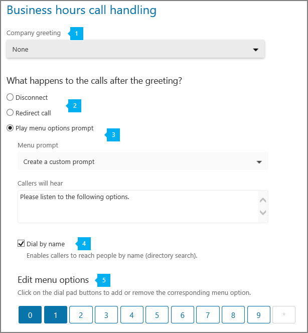

# 電話システムの自動応答をセットアップするSet up a Phone System auto attendant

Auto attendants let people that call in to your organization and navigate a menu system to get them to the right department, call queue, person, or the operator. You can create an auto attendant for your organization by using the Skype for Business admin center. To create a new auto attendant, go to **Call routing** in the left navigation, and then select **Auto attendants** > **Add new**.Auto attendants let people that call in to your organization and navigate a menu system to get them to the right department, call queue, person, or the operator. You can create an auto attendant for your organization by using the Skype for Business admin center. To create a new auto attendant, go to **Call routing** in the left navigation, and then select **Auto attendants** > **Add new**.

自動アテンダントの詳細についてはする場合を参照してください[電話システムの自動応答は何ですか?](/microsoftteams/what-are-phone-system-auto-attendants)If you want to learn more about auto attendants, see [What are Phone System auto attendants?](/microsoftteams/what-are-phone-system-auto-attendants)

## ステップ 1 - はじめにStep 1 - Getting started

- Before you can create and set up your auto attendants, you will need to get or transfer your existing toll or toll-free service numbers. After you get the toll or toll-free service numbers, they will show up on the **Skype for Business admin center** > **Voice** > **Phone numbers** page. To get your service numbers, see [Getting service phone numbers for Skype for Business and Microsoft Teams](getting-service-phone-numbers.md), or if you want to transfer and existing service number, see [Transfer phone numbers to Office 365](/microsoftteams/transfer-phone-numbers-to-office-365). **User (subscriber)** numbers can't be assigned to auto attendants. If you are outside the United States, you can't use the Skype for Business admin center to get service numbers; go [here](/microsoftteams/manage-phone-numbers-for-your-organization) instead.Before you can create and set up your auto attendants, you will need to get or transfer your existing toll or toll-free service numbers. After you get the toll or toll-free service numbers, they will show up on the **Skype for Business admin center** > **Voice** > **Phone numbers** page. To get your service numbers, see [Getting service phone numbers for Skype for Business and Microsoft Teams](getting-service-phone-numbers.md), or if you want to transfer and existing service number, see [Transfer phone numbers to Office 365](/microsoftteams/transfer-phone-numbers-to-office-365). **User (subscriber)** numbers can't be assigned to auto attendants. If you are outside the United States, you can't use the Skype for Business admin center to get service numbers; go [here](/microsoftteams/manage-phone-numbers-for-your-organization) instead.

    > [!CAUTION]
    > To get and use toll-free phone numbers, you need to set up Communications Credits. To do this see [What are Communications Credits?](/microsoftteams/what-are-communications-credits) and [Set up Communications Credits for your organization](/microsoftteams/set-up-communications-credits-for-your-organization).To get and use toll-free phone numbers, you need to set up Communications Credits. To do this see [What are Communications Credits?](/microsoftteams/what-are-communications-credits) and [Set up Communications Credits for your organization](/microsoftteams/set-up-communications-credits-for-your-organization).
  
- Your organization must have (at a minimum) an Enterprise E3 plus **Phone System** license or an Enterprise E5 license. The number of **Phone System** user licenses that are assigned affects the number of service numbers that are available to be used for auto attendants. The numbers of auto attendants you can have is dependent on the number **Phone System** and **Audio Conferencing** licenses that are assigned in your organization. To learn more about licensing, go [here](../skype-for-business-and-microsoft-teams-add-on-licensing/skype-for-business-and-microsoft-teams-add-on-licensing.md).Your organization must have (at a minimum) an Enterprise E3 plus **Phone System** license or an Enterprise E5 license. The number of **Phone System** user licenses that are assigned affects the number of service numbers that are available to be used for auto attendants. The numbers of auto attendants you can have is dependent on the number **Phone System** and **Audio Conferencing** licenses that are assigned in your organization. To learn more about licensing, go [here](../skype-for-business-and-microsoft-teams-add-on-licensing/skype-for-business-and-microsoft-teams-add-on-licensing.md).

    > [!TIP]
    > To redirect calls to an operator or a menu option that is an Online user with a **Phone System** license, you will need to enable them for Enterprise Voice or assign Calling Plans in Office 365 to them. See [Assign Skype for Business and Microsoft Teams licenses](../skype-for-business-and-microsoft-teams-add-on-licensing/assign-skype-for-business-and-microsoft-teams-licenses.md). You can also use Windows PowerShell. For example, run:  `Set-CsUser -identity "Amos Marble" -EnterpriseVoiceEnabled $true`To redirect calls to an operator or a menu option that is an Online user with a **Phone System** license, you will need to enable them for Enterprise Voice or assign Calling Plans in Office 365 to them. See [Assign Skype for Business and Microsoft Teams licenses](../skype-for-business-and-microsoft-teams-add-on-licensing/assign-skype-for-business-and-microsoft-teams-licenses.md). You can also use Windows PowerShell. For example, run:  `Set-CsUser -identity "Amos Marble" -EnterpriseVoiceEnabled $true`
  
## ステップ 2 - 新しい自動応答の作成Step 2 - Create a new auto attendant

 **Skype for Business の管理センターを使用する** **Using the Skype for Business admin center**

**Skype for Business 管理センター**で、[**通話ルーティング**]  >  [**自動応答**] の順にクリックし、次に [**新しく追加**] をクリックします。In the **Skype for Business admin center**, click **Call routing** > **Auto attendants**, then click **Add new**:

### [一般情報の編集] ページEdit general info page

***
 **Name** Enter a descriptive display name for your auto attendant. The name is required and can contain up to 64 characters, including spaces. It will be listed in the **Name** column on the **Auto attendants** tab.**Name** Enter a descriptive display name for your auto attendant. The name is required and can contain up to 64 characters, including spaces. It will be listed in the **Name** column on the **Auto attendants** tab.
***

 **Phone number** This setting is optional. If you like, select a phone number for your auto attendant. You can pick any available service toll or toll-free phone number that you have for your organization. If there are no phone numbers listed, you will need to get a service toll or toll-free phone number. Go [here](getting-service-phone-numbers.md) to get them. **Phone number** This setting is optional. If you like, select a phone number for your auto attendant. You can pick any available service toll or toll-free phone number that you have for your organization. If there are no phone numbers listed, you will need to get a service toll or toll-free phone number. Go [here](getting-service-phone-numbers.md) to get them.    

> [!NOTE]
> **User (subscriber)** numbers can't be assigned to auto attendants.**User (subscriber)** numbers can't be assigned to auto attendants.

***
 **タイム ゾーン** 自動応答にはタイム ゾーンを設定する必要があります。ただし、組織のメイン アドレスのタイム ゾーンと一致している必要はありません。各自動応答には、異なるタイム ゾーンを設定できます。自動応答の営業時間の設定は、ここで選択したタイムゾーンに基づきます。**Time zone** You must set the time zone for your auto attendant, but it doesn't need to correspond to the time zone of the main address listed for your organization. Each auto attendant can have a different time zone, and the business hours set for the auto attendant will be set based on the time zone that you select here.
***
 **Language** Select the language that you want to use for your auto attendant from any of the available languages listed. The language you set here is the language that the auto attendant will use to interact with people that call in to this auto attendant, and all the system prompts will be played in this language.**Language** Select the language that you want to use for your auto attendant from any of the available languages listed. The language you set here is the language that the auto attendant will use to interact with people that call in to this auto attendant, and all the system prompts will be played in this language.
***
 **Speech recognition** Speech recognition is available and if this option is selected. People that call in can use voice input in the language you set. You can disable speech recognition by clearing it if you want to only let people use their phone keypad.**Speech recognition** Speech recognition is available and if this option is selected. People that call in can use voice input in the language you set. You can disable speech recognition by clearing it if you want to only let people use their phone keypad.
***
 **Operator** This is optional and doesn't need to be set for the auto attendant. However, you can set the **Operator** option for people that call in to be able to break out of the menus to speak to a person to help them. **Operator** This is optional and doesn't need to be set for the auto attendant. However, you can set the **Operator** option for people that call in to be able to break out of the menus to speak to a person to help them.     オペレーターには、キー 0 が自動的に割り当てられます。The key 0 is automatically assigned to Operator.     If you set this up, you will also need to tell people who call in that this is an available option in the **Edit menu options** on the **Business hours call handling** page. If you set an operator on your auto attendant, you will need to enter the corresponding prompt text in the **Callers will hear** box or change your audio file to include this option. For example, "For the Operator, press zero." If you set this up, you will also need to tell people who call in that this is an available option in the **Edit menu options** on the **Business hours call handling** page. If you set an operator on your auto attendant, you will need to enter the corresponding prompt text in the **Callers will hear** box or change your audio file to include this option. For example, "For the Operator, press zero."     次の項目のいずれかをオペレーターとして設定できます。You can set one of the following as Operator: 
*    Enterprise Voice で有効にされているか、Office 365 の通話プランを割り当てられた**電話システム**を使用している**社内の担当者**。**Person in your company** with a **Phone System** license that is enabled for Enterprise Voice or assigned Calling Plans in Office 365.  

        > [!Note] 
        > **Person in your company** can be an Online user or a user hosted on-premises using Skype for Business Server 2015 or Lync Server 2013. Lync Server 2010 isn't supported. **Person in your company** can be an Online user or a user hosted on-premises using Skype for Business Server 2015 or Lync Server 2013. Lync Server 2010 isn't supported.   

*    設定済みの **通話キュー**。A **Call Queue** that you have set up. 
*    You can set it up so the person calling will be sent to voicemail. To do this, select **Person in your company** and set this person's calls to be forwarded directly to voicemail.You can set it up so the person calling will be sent to voicemail. To do this, select **Person in your company** and set this person's calls to be forwarded directly to voicemail. 

### 営業時間の選択ページSelect hours of operation page

By default, business hours are set to 24 hours a day, 7 days a week, so all hours are considered business hours. All of the hours that aren't included in business hours are considered after business hours. If you select the **Custom** option and set your business hours, then a new page called **After hours call handling** will be added where you can configure the call handling for after business hours for the auto attendant.By default, business hours are set to 24 hours a day, 7 days a week, so all hours are considered business hours. All of the hours that aren't included in business hours are considered after business hours. If you select the **Custom** option and set your business hours, then a new page called **After hours call handling** will be added where you can configure the call handling for after business hours for the auto attendant.

***
 カレンダーで特定の営業時間を選択するには、[ **カスタム**] オプションを選択します。[ **カスタム**] を選択すると、既定により、営業時間が月曜日から金曜日の午前 9:00 から午後 5:00 に設定されます。Select the **Custom** option to select specific business hours in the calendar. When you select **Custom**, business hours will be set to Monday to Friday, 9:00 am-5:00 pm by default.
***
 To change business hours, highlight the business hours you want to set using the calendar. The calendar allows you to select business hours in 30-minute intervals, and the business hours you select here will be set based on the time zone that you set on the **General info** page. To set up a break (a lunch break, for example), deselect or drag to deselect the time on the calendar. You can set multiple breaks within business hours.To change business hours, highlight the business hours you want to set using the calendar. The calendar allows you to select business hours in 30-minute intervals, and the business hours you select here will be set based on the time zone that you set on the **General info** page. To set up a break (a lunch break, for example), deselect or drag to deselect the time on the calendar. You can set multiple breaks within business hours. 

### 営業時間の通話処理選択ページSelect business hours call handling page

> [!TIP]
> カスタムの営業時間スケジュールを使用する場合は、営業時間外の通話処理を設定する必要があります。[ **営業時間外後の問い合わせ対応**] ページが追加されるので、そこでこのオプションを構成できます。このページには、[ **営業時間の問い合わせ対応**] と同じオプションが表示されます。If you use a custom business hours schedule, you will also need to set up call handing for after business hours. An **After hours call handling** page will be added so you can configure those options, and it will give you the same options as **Business hours call handling**. 

その人が勤務時間中に、組織の自動応答の電話番号への呼び出しが聞こえますごきげんよう、プロンプト、およびメニューを設定できます。You can set up greetings, prompts, and menus that people who call in to your organization's auto attendant phone number will hear during the business hours.

***
 **Company greeting** Business hours greeting is optional and can be set to **None**. In this case, the caller will hear no message or greeting before the call is handled by one of the options you select. You can also upload an audio file (in .wav, mp3 or .wma formats), or create a custom greeting using Text-to-Speech.**Company greeting** Business hours greeting is optional and can be set to **None**. In this case, the caller will hear no message or greeting before the call is handled by one of the options you select. You can also upload an audio file (in .wav, mp3 or .wma formats), or create a custom greeting using Text-to-Speech.
*    **なし**自動アテンダントの電話番号への人を呼び出すには、あいさつ文は再生されません。**None** No greeting will be played when people call in to the auto attendant phone number.
*    **Create a custom greeting** If you choose this option, enter the text you want the system to read (up to 1000 characters). For example, you might enter "Welcome to Contoso. Your call is important to us." in the **Callers will hear** box.**Create a custom greeting** If you choose this option, enter the text you want the system to read (up to 1000 characters). For example, you might enter "Welcome to Contoso. Your call is important to us." in the **Callers will hear** box.
*    **オーディオ ファイルをアップロード**これを選択する場合は、あいさつ文を記録し、オーディオ (.wav、.mp3 や .wma 形式) でファイルをアップロードしています。**Upload an audio file** If you choose this, record the greeting and then upload your audio file (in a .wav, .mp3 or .wma format).
***
 You can select what happens to calls that arrive during business hours. You can chose from the following options:You can select what happens to calls that arrive during business hours. You can chose from the following options:
* **切断** これを選択すると、発信者が営業時間の応答メッセージを聞いた後に切断されます。**Disconnect** If you select it, the person calling in will be disconnected after hearing a business hours greeting.
* **呼び出しをリダイレクト** 以下に対して呼び出しを自動的に送信するために使用できます。**Redirect call** This can be used to automatically send the call to:
  * **Person in your company** with a **Phone System** license that is enabled for Enterprise Voice or assigned Calling Plans in Office 365. You can set it up so the person calling in can be sent to voicemail. To do this, select **Person in your company** and set this person to have their calls forwarded directly to voicemail. **Person in your company** with a **Phone System** license that is enabled for Enterprise Voice or assigned Calling Plans in Office 365. You can set it up so the person calling in can be sent to voicemail. To do this, select **Person in your company** and set this person to have their calls forwarded directly to voicemail.      
    > [!Note]
    > **Person in your company** can be an Online user or a user hosted on-premises using Skype for Business Server 2015 or Lync Server 2013. Lync Server 2010 is not supported. **Person in your company** can be an Online user or a user hosted on-premises using Skype for Business Server 2015 or Lync Server 2013. Lync Server 2010 is not supported.   

  * **コール キュー** コール キューを使用すると、セットアップ済みの既存のコール キューに、呼び出しが転送されます。A **Call Queue** Using a Call Queue allows the call to be transferred to an existing Call Queue that you have set up.
  * Another **Auto attendant** You can use an existing auto attendant to create a second level of menu options containing a submenu. These are called nested auto attendants.Another **Auto attendant** You can use an existing auto attendant to create a second level of menu options containing a submenu. These are called nested auto attendants.

* **メニュー オプションのプロンプトを再生** これらを使用して、再生したいプロンプトを設定することもできます。**Play menu options prompt** These can also be used to let you set up a prompt you want played.
***
 **メニュー プロンプト** メイン メニュー プロンプトを作成するには、テキスト読み上げを使用するか、音声ファイル (.wav, .mp3 または .wma) をアップロードできます。[ **発信者にはこのように聞こえます**] ボックスにプロンプトを入力できます。また、たとえば「セールスの場合は 1 を押すか、1 と言ってください。サービスの場合は 2 を押すか、2 と言ってください。カスタマー サポートの場合は 3 を押すか、3 と言ってください。オペレーターの場合は 0 を押すか、0 と言ってください。このメニューをもう一度お聞きになりたい場合は、アスタリスク キーを押すか、リピートと言ってください。」という音声ファイルを録音できます。 **カスタム プロンプトを作成** このオプションを選択する場合は、システムが読み上げるテキスト (最大 1000 文字) を入力する必要があります。 **音声ファイルをアップロード** このオプションを選択する場合は、応答メッセージを録音して、音声ファイル (.wav, .mp3 または .wma 形式) をアップロードする必要があります。**Menu prompt** To create main menu prompt, you can either use Text-to-Speech or upload an audio file (.wav, .mp3 or .wma). You can type the prompt in the **Callers will hear** box or record an audio file and say, for example: "For Sales, say or press or say 1. For Services, press or say 2. For Customer Support, press or say 3. For the operator, press or say 0. To hear this menu again, press the star key or say repeat." **Create a custom prompt** If you chose this, you should enter the text you want the system to read (up to 1000 characters). **Upload an audio file** If you chose this, you will need to record the greeting and then upload your audio file (in a .wav, mp3 or .wma format).
***
 **Dial by name** If you choose this option, this will enable people who call in to search for people in your organization using Directory Search. You can select which people will be listed as available or not available for Dial by Name by setting up those options on the **Dial scope** page. Any online user with a **Phone System** license, or any user hosted on-premises using Skype for Business Server 2015 or Lync Server 2013, can be found with Dial by Name.**Dial by name** If you choose this option, this will enable people who call in to search for people in your organization using Directory Search. You can select which people will be listed as available or not available for Dial by Name by setting up those options on the **Dial scope** page. Any online user with a **Phone System** license, or any user hosted on-premises using Skype for Business Server 2015 or Lync Server 2013, can be found with Dial by Name.    

> [!WARNING]
> Lync 2010 を使用してオンプレミスでホストされているユーザーは名前によるダイヤルで**探すことはできません**。Users hosted on-premises using Lync 2010 **can't be reached** with Dial by Name.
> ***

 **Edit menu options** Menu options can be added or removed by using key buttons on the keypad. To add a menu option, press the corresponding key on the keypad. The keys in use will change in color and the corresponding row of options will appear below. To delete a menu option, simply click on the corresponding key on the keypad control to deselect this key. The key mapping row will be removed.**Edit menu options** Menu options can be added or removed by using key buttons on the keypad. To add a menu option, press the corresponding key on the keypad. The keys in use will change in color and the corresponding row of options will appear below. To delete a menu option, simply click on the corresponding key on the keypad control to deselect this key. The key mapping row will be removed.    **ヒント:** 削除オプションに追加する場合には、メニュー プロンプト テキストを更新するか、音声を別に再録音する必要があります。既存のメニュー プロンプトに対しては自動的に実行されないためです。**Tip:** You will have to update menu prompts text or re-record the audio separately when adding to removing options because it won't be automatically done for the existing menu prompt.      Any menu option can be added and removed in any order, and the key mappings don't have to be continuous. It is possible, for example, to create a menu with keys 0, 1, and 3 mapped to options, while the key 2 isn't used.Any menu option can be added and removed in any order, and the key mappings don't have to be continuous. It is possible, for example, to create a menu with keys 0, 1, and 3 mapped to options, while the key 2 isn't used.   

> [!NOTE]
> The keys \* (Repeat) and # (Back) are reserved by the system and can't be reassigned. If speech recognition is enabled, pressing \* will correspond with "Repeat" and # will correspond with the "Back" voice commands.The keys \* (Repeat) and # (Back) are reserved by the system and can't be reassigned. If speech recognition is enabled, pressing \* will correspond with "Repeat" and # will correspond with the "Back" voice commands.

メニュー オプションをセットアップするには、キーを選択した後、以下を実行する必要があります。To set up your menu options, after you select the key(s), you will need to: 
- **Enter the Name of the option** This can be up to 64 characters long, and can contain multiple words like "Customer Service" or "Operations and Grounds." If speech recognition is enabled, the name will automatically be recognized, and the person calling in will be able to either press 3, say "three," or say "Customer Service" to select the option mapped to key 3.**Enter the Name of the option** This can be up to 64 characters long, and can contain multiple words like "Customer Service" or "Operations and Grounds." If speech recognition is enabled, the name will automatically be recognized, and the person calling in will be able to either press 3, say "three," or say "Customer Service" to select the option mapped to key 3. 
- The next step is to select where the call is to be sent if the corresponding key is pressed, or the option is selected using speech recognition. The call can be sent to:The next step is to select where the call is to be sent if the corresponding key is pressed, or the option is selected using speech recognition. The call can be sent to: 
    - **Operator** If operator is already set up, it is automatically mapped to key 0, but it can also be deleted or reassigned to a different key. If operator isn't set to any key, then the voice command "Operator" will be disabled too.**Operator** If operator is already set up, it is automatically mapped to key 0, but it can also be deleted or reassigned to a different key. If operator isn't set to any key, then the voice command "Operator" will be disabled too. 
    - A **Person in your company** with a **Phone System** license that is enabled for Enterprise Voice or assigned an Calling Plan in Office 365. You can set it up so the person calling in can be sent to voicemail. To do this, select **Person in your company** and set this person to have their calls forwarded directly to voicemail.A **Person in your company** with a **Phone System** license that is enabled for Enterprise Voice or assigned an Calling Plan in Office 365. You can set it up so the person calling in can be sent to voicemail. To do this, select **Person in your company** and set this person to have their calls forwarded directly to voicemail.   

        > [!Note] 
        > **Person in your company** can be an Online user or a user hosted on-premises using Skype for Business Server 2015 or Lync Server 2013. Lync Server 2010 is not supported. **Person in your company** can be an Online user or a user hosted on-premises using Skype for Business Server 2015 or Lync Server 2013. Lync Server 2010 is not supported.   

    - **コール キュー** コール キューを使用すると、セットアップ済みの既存のコール キューに、呼び出しが転送されます。**Call Queue** Using a call queue option allows the call to be transferred to an existing call queue that you have set up. 
    - **Auto Attendant** You can use an existing auto attendant to create a second level of menu options containing a submenu. These are called nested auto attendants.**Auto Attendant** You can use an existing auto attendant to create a second level of menu options containing a submenu. These are called nested auto attendants.  

        > [!Note]
        > 入れ子 (または第 2 レベル) の自動応答の **営業時間** も使用されます。これには、セットアップされた他の自動応答から送信された呼び出しへ向けたものも含まれます。The **Business Hours** of nested (or second-level) auto attendants will also be used, including for the calls sent from other auto attendants that have been set up.         

### 休業日選択ページSelect holidays page 

各自動応答には、最大 20 個の決められた休業日を追加できます。You can add up to 20 scheduled holidays to each auto attendant.

***
 **休業日を追加** 「**休業日名** 」フィールドに、新しい休業日の名前を入力します。**Add a holiday** Enter a name for your new holiday in the **Holiday name** field.   Holiday names may consist of up to 64 characters and must be unique for the same auto attendant. For example, you cannot have two holidays named "Thanksgiving" in the same auto attendant.Holiday names may consist of up to 64 characters and must be unique for the same auto attendant. For example, you cannot have two holidays named "Thanksgiving" in the same auto attendant.  
***
 **Holiday Greeting** The Holiday Greeting is optional and can be set to **None**. In this case, the caller will hear no message or greeting before the call is handled by one of the options you select. You can also upload an audio file (in .wav, mp3 or .wma formats), or create a custom greeting using Text-to-Speech.**Holiday Greeting** The Holiday Greeting is optional and can be set to **None**. In this case, the caller will hear no message or greeting before the call is handled by one of the options you select. You can also upload an audio file (in .wav, mp3 or .wma formats), or create a custom greeting using Text-to-Speech.
*    **なし**自動アテンダントの電話番号への人を呼び出すには、あいさつ文は再生されません。**None** No greeting will be played when people call in to the auto attendant phone number.
*    **Create a custom greeting** If you choose this option, enter the text you want the system to read (up to 1000 characters). For example, you might enter "Happy New Year! Our offices are currently closed." in the **Callers will hear** box.**Create a custom greeting** If you choose this option, enter the text you want the system to read (up to 1000 characters). For example, you might enter "Happy New Year! Our offices are currently closed." in the **Callers will hear** box.
*    **オーディオ ファイルをアップロード**これを選択する場合は、時候のあいさつを記録し、オーディオ (.wav、.mp3 や .wma 形式) でファイルをアップロードしています。**Upload an audio file** If you choose this, record the holiday greeting and then upload your audio file (in a .wav, .mp3 or .wma format).  
***
 **What happens to the calls after the greeting?** You can select what happens to the calls that arrive during this holiday. You can chose from the following options:**What happens to the calls after the greeting?** You can select what happens to the calls that arrive during this holiday. You can chose from the following options:
* **切断** 休業日の応答メッセージが流れてから、通話が切断されます。**Disconnect** The person calling in will be disconnected after hearing the holiday greeting.
* **呼び出しをリダイレクト** 以下に対して呼び出しを自動的に送信するために使用できます。**Redirect call** This can be used to automatically send the call to:
  * A **Person in your company** with a **Phone System** license that is enabled for Enterprise Voice or assigned Calling Plans in Office 365. You can set it up so the person calling in can be sent to voicemail. To do this, select **Person in your company**, and set this person to have their calls forwarded directly to voicemail. A **Person in your company** with a **Phone System** license that is enabled for Enterprise Voice or assigned Calling Plans in Office 365. You can set it up so the person calling in can be sent to voicemail. To do this, select **Person in your company**, and set this person to have their calls forwarded directly to voicemail.    

    > [!Note] 
    > **Person in your company** can be an Online user or a user hosted on-premises using Skype for Business Server 2015 or Lync Server 2013. Lync Server 2010 is not supported.**Person in your company** can be an Online user or a user hosted on-premises using Skype for Business Server 2015 or Lync Server 2013. Lync Server 2010 is not supported.  

  * セットアップ済みの既存のコール キューに対する呼び出しを転送するための**コール キュー**。A **Call Queue** to transfer the call to an existing Call Queue that you have set up.
  * Another **Auto attendant**, to create a second level of menu options containing a submenu. These are called nested auto attendants. Another **Auto attendant**, to create a second level of menu options containing a submenu. These are called nested auto attendants.   

    > [!Note]
    > 既定では、休業期間中に着信したすべての呼び出しは、応答メッセージの後に切断されます。よって、違うビヘイビアーが望ましい場合には、リダイレクトを指定する必要があります。By default, all calls arriving during a holiday period are set to disconnect after the greeting (if any), so you must specify a redirect if a different behavior is desired.

***
 **When do you want the holiday to start and end?** Enter your holiday start date in dd/mm/yyyy format, and then select a start time, end date, and end time, as prompted in the date range table.**When do you want the holiday to start and end?** Enter your holiday start date in dd/mm/yyyy format, and then select a start time, end date, and end time, as prompted in the date range table.  You can specify up to 10 different date ranges for a holiday. For example, you could add date ranges for New Year's Eve holidays for up to 10 years. A holiday can span multiple days.You can specify up to 10 different date ranges for a holiday. For example, you could add date ranges for New Year's Eve holidays for up to 10 years. A holiday can span multiple days.  さらに休業日の日付範囲 (たとえば、翌年分) を追加するには、[**さらに追加**] をクリックし、休業日の新しい開始日と終了日を入力してください。To add additional holiday date ranges (for example, for the next year), click **Add another**, and then enter a new set of start and end dates for the holiday.  Nested holidays are also supported. For example, you could nest multiple holidays within one "holiday break" time frame:Nested holidays are also supported. For example, you could nest multiple holidays within one "holiday break" time frame: 
*    **December 24 through January 3:** "Happy Holidays! Our offices are currently closed. We will reopen on January 4th."**December 24 through January 3:** "Happy Holidays! Our offices are currently closed. We will reopen on January 4th."
*    **December 25:** "Merry Christmas! Our offices are currently closed. We will reopen on January 4th."**December 25:** "Merry Christmas! Our offices are currently closed. We will reopen on January 4th."
*    **January 1:** "Happy New Year! Our offices are currently closed. We will reopen on January 4th."**January 1:** "Happy New Year! Our offices are currently closed. We will reopen on January 4th."

自動応答を保存すると、休業日が [**休業日**] タブに表示され、休業日の設定を編集、追加、修正できます。After you save your auto attendant, your holidays appear on the **Holidays** tab, where you can edit, add, or modify holiday settings.

### ダイヤルの範囲を選択ページSelect dial scope page

このページには、組織内のどのユーザーになりますディレクトリに一覧表示されているとダイヤルの利用可能な場合で組織を呼び出す人の名前でを設定することができます。On this page, you can set up which users in your organization will be listed in your directory and available for Dial by Name when a person that calls in to your organization.

***
 [ **含める**] オプションには次の 2 つのオプションがあります。Using the **Include** option, you have two options:
* **All Online users** Using this option allows all of the people in your organization to be included in directory search. All Online users with a **Phone System** license, as well as users hosted on-premises using Skype for Business Server 2015 or Lync Server 2013 who have Calling Plans in Office 365, will be listed.**All Online users** Using this option allows all of the people in your organization to be included in directory search. All Online users with a **Phone System** license, as well as users hosted on-premises using Skype for Business Server 2015 or Lync Server 2013 who have Calling Plans in Office 365, will be listed. 
* **Custom** If you use this option, you can search for an Office 365 Group, distribution list, or security group that has been created in your organization, and the people added to this Office 365 Group, distribution list, or security group who are either **Online users with a Phone System license** or hosted on-premises using Skype for Business Server 2015 or Lync Server 2013. You can add multiple Office 365 Groups, distribution lists, and security groups. **Custom** If you use this option, you can search for an Office 365 Group, distribution list, or security group that has been created in your organization, and the people added to this Office 365 Group, distribution list, or security group who are either **Online users with a Phone System license** or hosted on-premises using Skype for Business Server 2015 or Lync Server 2013. You can add multiple Office 365 Groups, distribution lists, and security groups.    

  > [!Caution]
  > オンプレミス ユーザーが Lync Server 2010 の展開は、名前が他のダイヤルを使用してディレクトリを検索すると表示されません。On-premises users from deployments of Lync Server 2010 won't be listed when someone searches the directory using Dial by Name. 
***
 **除外**オプションを使用すると、2 つのオプションがあります。Using the **Exclude** option, you have two options:
* **なし** このオプションを使用すると、いずれの Online ユーザーもディレクトリ検索から除外しません。**None** Using this option will indicate that no Online users will be excluded from directory search. 
* **Custom** If you use this option, you can search for an Office 365 Group, distribution list, or security group that has been created in your organization, and all people added to this Office 365 Group, distribution list, or security groups will be excluded from directory search. You can add multiple Office 365 Groups, distribution lists, and security groups. **Custom** If you use this option, you can search for an Office 365 Group, distribution list, or security group that has been created in your organization, and all people added to this Office 365 Group, distribution list, or security groups will be excluded from directory search. You can add multiple Office 365 Groups, distribution lists, and security groups.    

  > [!Caution]
  > オンプレミス ユーザーが Lync Server 2010 の展開は、名前が他のダイヤルを使用してディレクトリを検索すると表示されません。On-premises users from deployments of Lync Server 2010 won't be listed when someone searches the directory using Dial by Name.          

> [!NOTE]
> ディレクトリに一覧表示、ダイヤルを使用するときに名前で音声認識でその名前を持つ新しいユーザーには、最大で 36 時間がかかる場合があります。It might take up to 36 hours for a new user to have their name listed in the directory when someone uses Dial by Name with speech recognition. 

すべての必須フィールドに入力して、メニューとオプションを処理する呼び出しを設定して後、は、**保存**をクリックします。After you enter all the required fields and set up call handling menus and options, click **Save**.

## 編集と自動応答をテストします。Editing and testing auto attendants

After you have saved your auto attendant, it will be listed on the **Auto attendants** page. This will allow you to quickly see some of the options that you have set up, including the name, phone number, language, and status.After you have saved your auto attendant, it will be listed on the **Auto attendants** page. This will allow you to quickly see some of the options that you have set up, including the name, phone number, language, and status.

自動応答を変更する場合は、自動応答を選択し、操作ウィンドウの [**編集**] をクリックします。If you want to make changes to an auto attendant, select the auto attendant, and then in the Action pane click **Edit**.

アクション ペインで、[**テスト**] ボタンを使用して、自動アテンダントをテストの呼び出しも簡単に配置できます。You can also quickly place a test call to your auto attendant by using the **Test** button in the Action pane.

## 詳細情報Want to know more?

Windows PowerShell を使用して自動応答を作成し、設定することもできます。You can also use Windows PowerShell to create and set up auto attendants.

### 自動応答のコマンドレットAuto attendant cmdlets

自動応答で管理する必要があるコマンドレットを以下に示します。Here are the cmdlets that you need to manage an auto attendant.

|                                                                                                                                                               |                                                                                                                                                               |
|---------------------------------------------------------------------------------------------------------------------------------------------------------------|---------------------------------------------------------------------------------------------------------------------------------------------------------------|
|                                   [New-CsOrganizationalAutoAttendantNew-CsOrganizationalAutoAttendant](https://technet.microsoft.com/library/mt796493.aspx)                                    |                                [New-CsOrganizationalAutoAttendantPromptNew-CsOrganizationalAutoAttendantPrompt](https://technet.microsoft.com/library/mt796484.aspx)                                 |
|                                   [Set-CsOrganizationalAutoAttendantSet-CsOrganizationalAutoAttendant](https://technet.microsoft.com/library/mt796486.aspx)                                    |                              [New-CsOrganizationalAutoAttendantMenuOptionNew-CsOrganizationalAutoAttendantMenuOption](https://technet.microsoft.com/library/mt796485.aspx)                               |
|                                   [Get-CsOrganizationalAutoAttendantGet-CsOrganizationalAutoAttendant](https://technet.microsoft.com/library/mt796482.aspx)                                    |    [Get-CsOrganizationalAutoAttendantHolidaysGet-CsOrganizationalAutoAttendantHolidays](https://docs.microsoft.com/powershell/module/skype/get-csorganizationalautoattendantholidays?view=skype-ps)    |
|                                  [Remove-CsOrganizationalAutoAttendantRemove-CsOrganizationalAutoAttendant](https://technet.microsoft.com/library/mt796492.aspx)                                  |                                 [New-CsOrganizationalAutoAttendantMenuNew-CsOrganizationalAutoAttendantMenu](https://technet.microsoft.com/library/mt796488.aspx)                                  |
|                                         [New- CsOnlineAudioFileNew- CsOnlineAudioFile](https://technet.microsoft.com/library/mt796479.aspx)                                         |                               [New-CsOrganizationalAutoAttendantCallFlowNew-CsOrganizationalAutoAttendantCallFlow](https://technet.microsoft.com/library/mt796489.aspx)                                |
| [Export-CsOrganizationalAutoAttendantHolidaysExport-CsOrganizationalAutoAttendantHolidays](https://docs.microsoft.com/powershell/module/skype/export-csorganizationalautoattendantholidays?view=skype-ps) |                                         [New-CsOnlineTimeRangeNew-CsOnlineTimeRange](https://technet.microsoft.com/library/mt796491.aspx)                                          |
|                    [New-CsOnlineDateTimeRangeNew-CsOnlineDateTimeRange](https://docs.microsoft.com/powershell/module/skype/new-csonlinedatetimerange?view=skype-ps)                    |                                          [New-CsOnlineScheduleNew-CsOnlineSchedule](https://technet.microsoft.com/library/mt796490.aspx)                                          |
|                           [Get-CsOrganizationalAutoAttendantSupportedTimeZoneGet-CsOrganizationalAutoAttendantSupportedTimeZone](https://technet.microsoft.com/library/mt796483.aspx)                           |                        [New-CsOrganizationalAutoAttendantCallHandlingAssociationNew-CsOrganizationalAutoAttendantCallHandlingAssociation](https://technet.microsoft.com/library/mt796487.aspx)                        |
|                           [Get-CsOrganizationalAutoAttendantSupportedLanguageGet-CsOrganizationalAutoAttendantSupportedLanguage](https://technet.microsoft.com/library/mt796481.aspx)                           | [Import-CsOrganizationalAutoAttendantHolidaysImport-CsOrganizationalAutoAttendantHolidays](https://docs.microsoft.com/powershell/module/skype/import-csorganizationalautoattendantholidays?view=skype-ps) |
|                            [New-CsOrganizationalAutoAttendantCallableEntityNew-CsOrganizationalAutoAttendantCallableEntity](https://technet.microsoft.com/library/mt796480.aspx)                             |                                                                                                                                                               |

### Windows PowerShell の詳細についてMore about Windows PowerShell

- Windows PowerShell is all about managing users and what users are allowed or not allowed to do. With Windows PowerShell, you can manage Office 365 and Skype for Business Online using a single point of administration that can simplify your daily work, when you have multiple tasks to do. To get started with Windows PowerShell, see these topics:Windows PowerShell is all about managing users and what users are allowed or not allowed to do. With Windows PowerShell, you can manage Office 365 and Skype for Business Online using a single point of administration that can simplify your daily work, when you have multiple tasks to do. To get started with Windows PowerShell, see these topics:

  - [Windows PowerShell と Skype for Business Online の概要An introduction to Windows PowerShell and Skype for Business Online](https://go.microsoft.com/fwlink/?LinkId=525039)

  - [Windows PowerShell で Office 365 を管理するための最善の方法Why you need to use Office 365 PowerShell](https://go.microsoft.com/fwlink/?LinkId=525041)

- Windows PowerShell には、ただ Office 365 管理センターを使用するだけではなく、速度、単純さ、生産性において多くの利点があります。次のトピックでこれらの利点について説明します。Windows PowerShell has many advantages in speed, simplicity, and productivity over only using the Office 365 admin center such as when you are making setting changes for many users at one time. Learn about these advantages in the following topics:

  - [Windows PowerShell で Office 365 を管理するための最善の方法Best ways to manage Office 365 with Windows PowerShell](https://go.microsoft.com/fwlink/?LinkId=525142)

  - [Windows PowerShell による Skype for Business Online の管理Using Windows PowerShell to manage Skype for Business Online](https://go.microsoft.com/fwlink/?LinkId=525453)

  - [クイック リファレンス: Windows PowerShell を使用した一般的な Lync Online の管理タスクの実行Using Windows PowerShell to do common Skype for Business Online management tasks](https://go.microsoft.com/fwlink/?LinkId=525038)

## See alsoRelated topics
[Office 365 での電話システムで利用できる機能Here's what you get with Phone System in Office 365](/MicrosoftTeams/here-s-what-you-get-with-phone-system)

[Skype for Business および Microsoft Teams のサービス電話番号の取得Getting service phone numbers for Skype for Business and Microsoft Teams](getting-service-phone-numbers.md)

[国および地域ごとの電話会議および通話プランの利用可能性Country and region availability for Audio Conferencing and Calling Plans](/microsoftteams/country-and-region-availability-for-audio-conferencing-and-calling-plans/country-and-region-availability-for-audio-conferencing-and-calling-plans)

[電話システムの自動応答についてWhat are Phone System auto attendants?](/MicrosoftTeams/what-are-phone-system-auto-attendants.md)

[小規模企業の例では、自動応答を設定Small business example - Set up an auto attendant](tutorial-org-aa.yml)  
