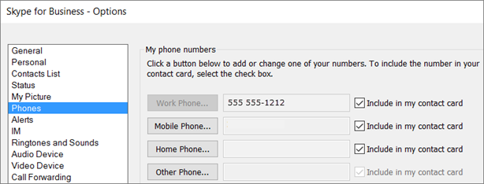

# 組織内の電話システムの設定

Office 365 の電話システムを設定するためのステップ バイ ステップ ガイドは以下のとおりです。 各手順の最後に、詳細な追加情報へのリンクを利用できます。

## ステップ 1: 電話システムは、国または地域で利用可能なことを確認します。

1.  最初に [オーディオ会議や通話プランのための国および地域の可用性](../country-and-region-availability-for-audio-conferencing-and-calling-plans/country-and-region-availability-for-audio-conferencing-and-calling-plans.md) へ進み、ページの上部にある一覧表から国または地域を選択します。
2.   **電話システム** での機能と詳細の一覧を確認します。
3.  電話システムが使用可能な場合は、手順 2 に進みます。

**電話システムおよびオーディオ会議の地域別利用可能時間に関する詳細については、 [オーディオ会議や通話プランのための国および地域の可用性](../country-and-region-availability-for-audio-conferencing-and-calling-plans/country-and-region-availability-for-audio-conferencing-and-calling-plans.md) を参照してください。**

## 手順 2: 電話システムおよび通話プランのライセンスを購入し、割り当てる

電話システムと通話プランのライセンスを 1 人のユーザーに割り当てるには、Office 365 のライセンスを割り当てるのと同じ手順をとります。  [Skype for Business と Microsoft Teams のライセンスを割り当てる](../skype-for-business-and-microsoft-teams-add-on-licensing/assign-skype-for-business-and-microsoft-teams-licenses.md) をご参照ください。 一括で複数のユーザーを割り当てる場合は、 [Skype for Business と Microsoft Teams のライセンスを割り当てる](../skype-for-business-and-microsoft-teams-add-on-licensing/assign-skype-for-business-and-microsoft-teams-licenses.md) を参照してください。

## 手順 3: ユーザーの電話番号を取得します。

組織内でユーザーが電話を発着信できるように設定するには、ユーザーが使う電話番号を取得する必要があります。

ユーザー用の番号を取得するには、次の３つの方法があります。
- Skype for Business 管理センターを使用して、新しい電話番号を取得する。
- Skype for Business管理センターでは使用できない、新しい番号を取得します。
- 現在のサービス プロバイダーまたは携帯電話会社から Office 365 に既存の番号を移行する。

 **新しいユーザー番号を追加** ページを使用して、電話番号の確認、検索、取得、予約を行う必要があります。 [ 国または地域]、[ 都道府県]、[ 市区町村] で検索してから、ユーザー用に必要となる電話番号の数を入力できます。

### 新しいユーザー電話番号を取得します。

 **Skype for Business の管理センターを使用する**

1. 職場または学校のアカウントを使用して、Office 365 にサインインします。

2.  **Office 365 管理センター** > **Skype for Business** に進みます。

3. 左側のナビゲーションで**音声** > **電話番号** に進み、**新しい番号を追加** をクリックし、**新しいユーザーの番号** をクリックします。

### Skype for Business管理センターでは使用できない、新しい番号を取得します。

 (国または地域によって) Skype for Business管理センターを使用して、新規の番号を取得することができない場合があります。 その場合は、フォームをダウンロードし、マイクロソフトに返送する必要があります。 新しいユーザーの番号を要求する方法については、 [組織の電話番号の管理](../what-are-calling-plans-in-office-365/manage-phone-numbers-for-your-organization/manage-phone-numbers-for-your-organization.md) を参照してください。

### 使用中のサービス プロバイダーまたは携帯電話会社から電話番号を移行する

- ユーザー用に必要な電話番号が 999 個以下であれば、Skype for Business 管理センターの **新しい電話番号のポート注文**ウィザードを使用できます。 電話番号を Skype for Business Online に移行するには [Office 365に電話番号を転送する](..//what-are-calling-plans-in-office-365/transfer-phone-numbers-to-office-365.md) の手順に従います。

- 999 を超える数の電話番号の移行が必要な場合は、 [組織の電話番号の管理](../what-are-calling-plans-in-office-365/manage-phone-numbers-for-your-organization/manage-phone-numbers-for-your-organization.md) を参照し、Office 365 に移行された全ての電話番号を取得できるよう、番号移行注文サービス要請を送信するか、その旨指示してください。

**新しい電話番号を取得するか、既存の番号を転送する方法の詳細については、 [組織の電話番号の管理](../what-are-calling-plans-in-office-365\manage-phone-numbers-for-your-organization\manage-phone-numbers-for-your-organization.md) を参照してください。**

## 手順 4: サービス用の電話番号 (電話会議、通話キュー、自動応答) を取得します。

Office 365 から、ユーザーの電話番号を取得するだけでなく、検索、電話会議 (会議ブリッジ用) 、自動応答、および通話キュー (サービス番号とも呼ばれます) などのサービスの無料または有料電話番号を取得できます。 サービス用電話番号の同時通話容量は、ユーザーまたは登録者の電話番号より大きくなります。 たとえば、サービス電話番号は同時に 100 の通話を処理できますが、ユーザーの電話番号は同時に数個の通話しか処理できません。

### 新しいサービス番号を取得する

 **Skype for Business の管理センターを使用する**

1. 職場または学校のアカウントを使用して、Office 365 にサインインします。

2.  **Office 365 管理センター** > **Skype for Business** に進みます。

3. 左側のナビゲーションで音声電話番号 に進み、新しい番号を追加ボタンを追加 をクリックし、新しいユーザーの番号 をクリックします。** **  >  ** **  >  ** ** ** **

    > [!IMPORTANT]
    > Skype for Business 管理センターの左のナビゲーションに  **音声** オプションが表示されるようにするには、最初に **Enterprise E5 ライセンス**、**電話システム** アドオン ライセンス、または **電話会議** アドオン ライセンスを少なくとも 1 件購入する必要があります。

### Skype for Business管理センターでは使用できない、新しい番号を取得します。

 (国または地域によって) Skype for Business管理センターを使用して、新規の番号を取得することができない場合があります。 その場合は、フォームをダウンロードし、マイクロソフトに返送する必要があります。 新しいユーザーの番号を要求する方法については、 [組織の電話番号の管理](../what-are-calling-plans-in-office-365/manage-phone-numbers-for-your-organization/manage-phone-numbers-for-your-organization.md) を参照してください。

### 既存のサービス番号を移行または転送する

現在のサービスプロバイダーまたは通信業者からサービスの番号を転送する場合は、マイクロソフトに番号移行注文を手動で提出する必要があります。 承認状（LOA)を使用して、移行したいサービス番号（有料・無料）の種類ごとに各々番号移行注文を提出する必要があります。 承認状（LOA)では、適切な種類のサービス番号を選択する必要があります。 マイクロソフト サポートに問い合わせる場合は、サービス番号 (*ユーザーまたはサブスクライバーの番号ではなく*) を転送すること、または通話量に対応するための同時通話許容量が十分ではないことを指定してください。 電話番号を転送したり、自分の電話番号で他の操作をする場合は、 [組織の電話番号の管理](../what-are-calling-plans-in-office-365/manage-phone-numbers-for-your-organization/manage-phone-numbers-for-your-organization.md) を参照してください。

## 手順 5: 通話プランを設定する場合

上記の手順に従っていれば、あなたはすでに電話システムとライセンス、通話プラン（手順２）を購入して割り当てられ、ユーザー用の電話番号を取得（手順３）したことになるので、あなたの通話プランは部分的に設定されています。
 通話プランのセットアップを完了するのには、次の 3 つの手順に従います。

### 組織用の緊急対応のアドレスと場所を追加します。

1.  **音声**ページで、 **緊急の場所**  > **新しいアドレスを追加** を選択します。

2.  **新しいアドレス** ウィンドウで、自分のアドレスに名前を入力し、残りのボックスの入力を完了します。

     

    > [!TIP]
    > 上の図のように、英語圏のお客様で街路名が数字の場合は、必ず末尾に「st」または「th」を付けます。

3. [ **検証**] を選択します。

    必要な場合は、住所の訂正を求められます。

    > [!CAUTION]
    > 住所または公的アドレスの検証では、アドレスが正規のもので、書式設定が正しいことが確認されます。 緊急対応のアドレスの一部が誤っていても (市区町村名の誤入力など)、検証をパスすることがあります。 誤記があっても検証をパスした場合、誤記がある市区町村名と住所の他の正しい部分の組み合わせによって、適切な緊急派遣センターに通話をルーティングするために十分な情報になります。

    > [!TIP]
    > 緊急応答用に住所に修正が必要な場合は、住所が更新されたことを通知する緑色のバナーが表示されます。

4. アドレスが検証されたら、 **保存** を選びます。

### ユーザーに電話番号と緊急対応のアドレスを割り当てる

> [!TIP]
> この手順を実行する直前にさらにユーザーを追加すると、[ **音声ユーザー**] ページにユーザーが表示されるまでに **数時間** かかることがあります。これには遅延時間があります。

1.  **音声ユーザー** ページで、電話番号と緊急対応のアドレスを割り当てるユーザーを選択します。

2. [操作] ウィンドウで、 **割り当てる番号** をクリックします。

3.  **番号を割り当てる** ページの  **割り当てる番号を選択** 一覧で、ユーザー用の電話番号を選びます。

4. 緊急対応のアドレスを選ぶには、ボックスに市区町村の名前を入力し、 **検索** を選びます。

    > [!IMPORTANT]
    > 米国外に居住している場合は、電話番号にすでに緊急対応の住所が指定されていますが、ここで変更できます。  [ユーザーの緊急対応の住所を割り当てるまたは変更する](../what-are-calling-plans-in-office-365/assign-or-change-an-emergency-address-for-a-user.md) を参照してください。

5. 電話番号と緊急対応のアドレスの両方を割り当てたら、 **保存** を選びます。

### 新しい電話番号をユーザーに通知する

新しい電話番号をユーザーに通知する場合は、メールを送信するか、または各組織が指定する方法で行うことをお勧めします。

次に、ユーザーの **Skype for Business**  アプリに電話番号がどのように表示されるかを示します。

1. デスクトップで Skype for Business にサインインします。

2.  **Settings** > **Tools** > **Options** を選択します。

     

3. 次に、[ **電話**] を選びます。

    

 **マイクロソフトのチーム**では、ユーザーは、左側のナビゲーションで **呼び出し** をクリックすると、その電話番号を表示できます。 電話番号は、ダイヤル パッドの上に表示されます。

**通話プランを設定する手順すべての詳細については、 [通話プランの設定](../what-are-calling-plans-in-office-365/set-up-calling-plans.md) を参照してください。**

## 手順 6: 電話会議を設定する場合

組織内のユーザーは、会議に出席するため時には電話を使用する必要があります。 Skype for Business と Microsoft Teams には、このような状況に最適な電話会議の機能があります。 ユーザーは、モバイル デバイスや PC 上の Skype for Business アプリや Microsoft Teams アプリを使用しなくても、電話機を使用して Skype for Business 会議や Microsoft Teams 会議を呼び出すことができます。

必要なのは、会議を計画したり主催しようとしているユーザー向けに電話会議をセットアップすることだけです。 ダイヤルインする会議参加者には、割り当てられたライセンスやその他のセットアップは必要ありません。

電話会議についてよく寄せられる質問については、 [電話会議についてよくある質問](../audio-conferencing-in-office-365/audio-conferencing-common-questions.md) を参照してください。

1.  **電話会議** アドオンライセンスとコミュニケーション クレジットライセンスを購入した場合は、それらも割り当てます。 手順については、 [Skype for Business と Microsoft Teams のライセンスを割り当てる](../skype-for-business-and-microsoft-teams-add-on-licensing/assign-skype-for-business-and-microsoft-teams-licenses.md) をご覧ください。

    電話会議のプロバイダーを決定します。 電話会議プロバイダーは、電話会議ブリッジを提供します。 会議用ブリッジは会議用に、ダイヤルインの電話番号、PIN、会議 ID を設定します。 Microsoft を使用するか、Microsoft以外の電話会議プロバイダーを使用するかを決定します。

    > [!NOTE]
    > Microsoft Teams のユーザーには、Microsoft 以外の電話会議プロバイダーを使うことはできません。

    - **電話会議プロバイダーとしての Microsoft**: 電話会議の最も簡単なソリューションをお求めなら、電話会議プロバイダーとして Microsoft を選択します。

    - **電話会議プロバイダーとしての非Microsoftプロバイダー**: Office 365 の電話会議を使用できない国にいる場合、品質の優れたサービスが受けられない場所にいる場合、もしくは既存の契約がある場合は、Microsoft以外の電話会議プロバイダーを選んで下さい。 プロバイダーを検索するには、 [Microsoft PinPoint](https://go.microsoft.com/fwlink/?LinkId=797530) に進みます。

2.  会議を主導したり、会議の日程を立てる人達に電話会議プロバイダーを割り当てます。  [Microsoft を電話会議プロバイダーとして割り当てる](../audio-conferencing-in-office-365/assign-microsoft-as-the-audio-conferencing-provider.md) を参照してください。

3. 会議出席依頼を設定します。 次の手順はオプションですが、管理者の多くは次の設定を行うのを好みます。

    1.  [会議出席依頼をカスタマイズする](../set-up-skype-for-business-online/customize-meeting-invitations.md)。 ユーザー向けに設定されているダイヤルイン番号は、会議の出席者に送信される会議出席依頼に自動的に追加されます。 ただし、独自のヘルプや法務関連リンク、テキスト メッセージ、会社の小さな画像を追加できます。

    2.  [出席依頼に含まれている会議の開催者用の電話会議の電話番号を設定する](../audio-conferencing-in-office-365/set-the-phone-numbers-included-on-invites.md)。 これは、ユーザーが開催を予定している会議で表示される電話番号です。

    3. 発信者が電話会議の電話番号にかけたときに、電話会議の自動応答が発信者に応答する際に使われる [電話会議の自動応答言語を設定します](../audio-conferencing-in-office-365/set-auto-attendant-languages-for-audio-conferencing.md)。 この手順は、Microsoft を電話会議プロバイダーとして使用している場合にのみ適用されます。

    4.  [電話会議の PIN の長さを設定します](../audio-conferencing-in-office-365/set-the-pin-length-for-audio-conferencing-meetings.md)。

    > [!NOTE]
    > 中国の 21Vianet で運用される Office 365 を使用している顧客は、まだこの機能を使用できません。 詳細については、 [21Vianet で運用される Office 365 について](https://support.office.com/article/A8AB5061-3346-4DA0-BB7C-5260822B53AE) を参照してください。

**電話会議の詳細については、 [電話会議の設定](../audio-conferencing-in-office-365/set-up-audio-conferencing.md) を参照してください。**

## 手順 7: 電話システムの通話キューを設定する場合

電話システムの通話キューには、誰かがあなたの組織の電話番号にかけてきた時に対応する挨拶、自動的に通話を保留する機能、および通話の発信者が保留メロディを聴いている間に通話を処理するために次に利用できるコール エージェントの検索が含まれます。 組織では単一または複数の通話キューを作成できます。

通話キューを作成し設定する前に、既存の有料または無料のサービス番号を取得もしくは転送する必要があります。 有料または無料のサービスの電話番号を取得した後、  **Skype for Business 管理センター** > **音声** > **電話番号** に番号が表示され、  **番号の種類** のリストには、 **サービスー無料** として一覧表示されます。 サービス番号を取得するには、  [Skype for Business と Microsoft Teams 用のサービス電話番号の取得](getting-service-phone-numbers.md) を参照するか、既存のサービス番号を転送する場合は、  [Office 365 に電話番号を転送する](../what-are-calling-plans-in-office-365/transfer-phone-numbers-to-office-365.md) を参照してください。

> [!NOTE]
> 米国以外の国では、Skype for Business 管理センターを使用してサービス番号を取得することはできません。 米国以外の国でのサービス番号を取得する方法については、 [組織の電話番号を管理する](../what-are-calling-plans-in-office-365/manage-phone-numbers-for-your-organization/manage-phone-numbers-for-your-organization.md) をご覧ください。

  **Skype for Business 管理センター** で、新しい通話キューを作成するには、 **通話ルーティング** > **通話キュー** をクリックし、  **新規追加** をクリックし、 [電話システム呼び出しキューを作成する]( create-a-phone-system-call-queue.md#step-3---create-a-new-call-queue) の  **手順 3** の指示に従います。

**通話キューの詳細については、 [電話システムの通話キューを作成する](create-a-phone-system-call-queue.md) を参照してください。**

## 手順 8: 自動応答電話システムを設定する場合

自動応答は、組織へ電話をかけてきた人にメニュー システムで自らを誘導し、希望の部署、通話キュー、目的の人、及びオペレーターに行きつけるようにします。 Skype for Business 管理センターを使用して、組織の自動応答を作成できます。

Skype for Business 管理センターで、新しい自動応答を作成するには、 **通話ルーティング** > **自動応答** をクリックし、 **新規追加**をクリックし、 [自動応答電話システム設定](set-up-a-phone-system-auto-attendant.md#step-2---create-a-new-auto-attendant) の **ステップ 2** の指示に従って下さい。

**電話システムの自動応答の詳細については、 [電話システムの自動応答の設定](set-up-a-phone-system-auto-attendant.md) を参照してください。**

## 手順 9: サービス用電話番号 (電話会議、通話キュー、自動応答) の割り当て

 **上記の手順 4** から、サービスの番号を作成したら、使用するサービスの種類ごとに番号を割り当てる必要があります。 専用のサービスの電話番号(有料またはフリー ダイヤル)を挿入する場合などは、会議用ブリッジに番号を割り当てる必要があります。

- 電話会議用に専用番号を会議用ブリッジに割り当てることができます。それには、 **Office 365 の管理センター** > **管理センター** > **Skype for Business** > **電話会議** に進み、会議ブリッジをクリックするか、 [電話会議ブリッジ上の有料・無料番号を変更する](../audio-conferencing-in-office-365/change-the-phone-numbers-on-your-audio-conferencing-bridge.md) を参照してください。

- 自動応答では、自動アテンダントに専用番号を割り当てることができます。それには、  **Office 365 の管理センター** > **管理センター** > **Skype for Business** > **通話ルーティング** > **自動応答** に進み、自動応答 をクリックします。 既存のサービス番号は、 **全般** ページの **電話番号** ドロップダウンのリストに表示されます。 詳細については、  [電話システムの自動応答の設定](set-up-a-phone-system-auto-attendant.md) を参照してください。

- 通話キューでは、通話キューに専用番号を割り当てることができます。それには、  **Office 365 の管理センター** > **管理センター** > **Skype for Business** > **通話ルーティング** > **通話キュー** と進み、「通話キュー」をクリックします。 既存のサービス番号は、 **全般** ページの **電話番号** ドロップダウンのリストに表示されます。 詳細については、 [電話システムの通話キューを作成する](create-a-phone-system-call-queue.md) を参照してください。

**新しいサービス番号を取得し、既存のサービス番号を転送する方法の詳細については、 [サービスの電話番号の取得](getting-service-phone-numbers.md)  を参照してください。**

## 手順 10: 組織用コミュニケーション クレジットの設定

Skype for Business および Microsoft Teams で無料電話番号を使用する場合は、コミュニケーション クレジットを設定する必要があります。 また、 **任意の発信先** にダイヤルアウトする機能が必要な、通話プラン (国内および国際通話) ユーザーと電話会議ユーザー向けにコミュニケーション クレジットを設定することをお勧めします。 ご利用の通話プランまたは電話会議のサブスクリプションでは、多くの国や地域が含まれていますが、一部の発信先が含まれていない可能性があります。 コミュニケーション クレジットの請求を設定しない場合や、ユーザーに **コミュニケーション クレジット**のライセンスを割り当てない場合に (国/地域の通話プランまたは電話会議プランに基づき) 組織の通話分数が不足すると、これらのユーザーは通話を発信することや、電話会議からダイヤルアウトすることができなくなります。 推奨される利用可能残高などの詳細については、[コミュニケーション クレジットについて](../skype-for-business-and-microsoft-teams-add-on-licensing/what-are-communications-credits.md) をご覧ください。

> [!NOTE]
> 費用を確認するには、 [こちらで料金をご覧ください](https://go.microsoft.com/fwlink/p/?LinkId=799523 ) 。

### コミュニケーションクレジットの設定方法

1. 職場または学校のアカウントを使用して、Office 365 にサインインします。

2. Office 365 管理ページ左側のナビゲーションで  **請求** > **サブスクリプション** > **アドオン** > **アドオンの購入** に進み、 **コミュニケーションクレジット** > **今すぐ購入** を選択してください。

3.  **コミュニケーションクレジット** 申し込みのページで、自分の情報を入力し、 **次へ** をクリックします。

4. 支払い情報を入力して、 **注文** をクリックします。
    >[!IMPORTANT]
    >一括ライセンス契約の場合は、支払いにエンタープライズ契約番号を選択できます。 エンタープライズ契約番号が複数ある場合は、どのエンタープライズ アグリーメントを支払いに使用するかを選択することができます。 エンタープライズ 契約番号 (存在する場合) に関連付けるよう、特定の発注書番号を指定することもできます。

**コミュニケーションクレジットの設定に関する詳細については、 [組織のコミュニケーションクレジットを設定](../skype-for-business-and-microsoft-teams-add-on-licensing/set-up-communications-credits-for-your-organization.md) を参照してください。**

### コミュニケーションクレジットのライセンスをユーザーに割り当てる

1. 職場または学校のアカウントを使用して、Office 365 にサインインします。

2. Office 365 管理ページの左側のナビゲーションで、 **ユーザー** > **アクティブなユーザー** に進み、そのリストから一人、または複数のユーザーを選択します。

3.  **製品ライセンス** の下の操作ウィンドウで、  **編集** をクリックします。

4.  **製品ライセンス** ページで、  **コミュニケーションクレジット** を **オン** に切り替えて当ライセンスを割り当て、 **保存** をクリックします。

    > [!NOTE]
    >  **Enterprise E5** ライセンスが割り当てられているユーザーがいる場合でも、この手順を行うことをお勧めします。

**コミュニケーションクレジットのライセンスの割り当ての詳細については、 [組織用コミュニケーションクレジットの設定](../skype-for-business-and-microsoft-teams-add-on-licensing/set-up-communications-credits-for-your-organization.md) を参照してください。**

## 関連トピック
[Office 365 での電話システムで利用できる機能](here-s-what-you-get-with-phone-system.md)

[Skype for Business および Microsoft Teams のサービス電話番号の取得](getting-service-phone-numbers.md)

[国および地域ごとの電話会議および通話プランの利用可能性](../country-and-region-availability-for-audio-conferencing-and-calling-plans/country-and-region-availability-for-audio-conferencing-and-calling-plans.md)

