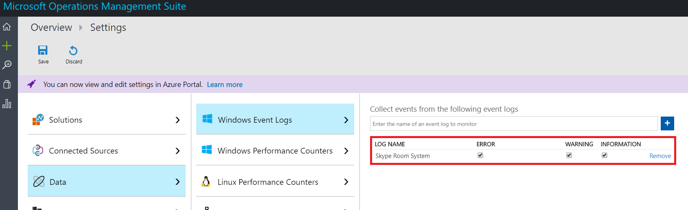

# <a name="deploy-skype-room-systems-v2-management-with-oms"></a>OMS を使用した Skype Room Systems バージョン 2 の管理を展開する
 
この資料では、設定およびマイクロソフトの運用管理スイートを使用して、Skype ルーム システム v2 のデバイスの統合された、エンド ・ ツー ・ エンドの管理を展開する方法について説明します。
  
基本的な遠隔測定を提供するマイクロソフトの運用管理スイートを構成することができ、警告するためは、Skype の会議室のデバイスを管理します。 管理ソリューションが完成に近づくにつれて、追加のデータとデバイスの可用性とパフォーマンスの詳細なビューを作成する管理機能を導入することができます。

によって、このガイドに従うと、デバイスの可用性、アプリケーションおよびハードウェアの健康状態、および Skype ルーム システム v2 のアプリケーションのバージョンの配布のレポート、詳細なステータスを取得するのに例を次のようなダッシュ ボードを使用できます。


  
高いレベルでは、次のタスクを実行する必要があります。


1.  [操作の管理スイートの構成を検証します。](with-oms.md#validate_OMS)
2.  [管理セットアップの操作の管理スイートのテスト デバイスを構成します。](with-oms.md#configure_test_devices)
3.  [カスタム フィールドをマップする](with-oms.md#Custom_fields)
4.  [運用管理スイートで Skype ルーム システム v2 ビューを定義します。](with-oms.md#Define_Views)
5.  [警告を定義します。](with-oms.md#Alerts)
6.  [操作の管理スイートのすべてのデバイスを構成します。](with-oms.md#configure_all_devices)
7.  [追加の運用管理ソフトウェア ・ パッケージ ・ ソリューションを構成します。](with-oms.md#Solutions)

> [!IMPORTANT]
> Skype ルームのすべてのシステムにエージェントの展開を開始する前に実行する必要があるいくつかの Skype ルーム システム固有の手順はまだありますが、最小限の構成では、操作の管理スイートは、Windows オペレーティング システムを実行するコンピューターを監視できます、デバイスです。
> したがって、コントロールのセットアップと構成の正しい順序ですべての構成手順を実行するを強くお勧めします。 最終結果の品質は、初期構成の品質に非常に依存します。

## <a name="validate-operations-management-suite-configuration"></a>操作の管理スイートの構成を検証します。
<a name="validate_OMS"> </a>

Skype ルーム ・ システム ・ デバイスからのログの収集を開始するのには、操作管理スイートのワークスペースが必要です。 ワークスペースは、独自のデータ リポジトリ、データ ソース、およびソリューションの一意なログ分析環境です。 既に既存のログ分析機能のワークスペースがある場合、Skype ルーム システム配置を監視するために使用可能性がありますまたは作成することができる場合は、専用のログ分析ワークスペースを Skype の部屋のシステムを監視するのには特定が必要です。

[Azure ポータルでのログの分析機能のワークスペースを作成する](https://docs.microsoft.com/azure/log-analytics/log-analytics-quick-create-workspace)この資料の指示に従って、新しいログの分析機能のワークスペースを作成する場合は、

> [!NOTE]
> ログ分析機能を使用して、オペレーションの管理スイートで、Azure サブスクリプションはアクティブにする必要があります。 Azure サブスクリプションをお持ちでない場合は、開始点として[無料の試用版サブスクリプション](https://azure.microsoft.com/free)を作成できます。


### <a name="configure-operations-management-suite-to-collect-skype-room-systems-event-logs"></a>Skype ルームのシステム イベント ログを収集するための運用管理スイートを構成します。

のみ、ログ分析機能は、設定で指定されている Windows のイベント ログからイベントを収集します。 各ログには、選択した重大度のレベルのイベントのみが収集されます。

Skype ルーム システムのデバイスとアプリケーションの状態を監視するために必要なログを収集するための運用管理スイートを構成する必要があります。 Skype ルーム システム v2 のデバイスでは、Skype の部屋のシステム イベント ログを使用します。

Skype ルームのシステム イベントを収集する運用管理ソフトウェア ・ パッケージを構成するには、[ログの分析では、Windows イベント ログ データ ソース](https://docs.microsoft.com/azure/log-analytics/log-analytics-data-sources-windows-events)を参照してください。




> [!IMPORTANT]
> Skype ルームのシステム イベント ログを選択し、**エラー**、**警告**、および**情報**のチェック ボックスをオンします。

## <a name="configure-test-devices-for-operations-management-suite-setup"></a>操作の管理スイートのセットアップのテスト デバイスを構成します。
<a name="configure_test_devices"> </a>

Skype ルームのシステムに関連するイベントを監視することができる運用管理ソフトウェア ・ パッケージを準備する必要があります。 1 つか 2 つの Skype ルーム システム デバイスに物理的にアクセスしているものがある操作の管理スイートのエージェントを展開する必要がありますから開始して、テスト デバイスは、いくつかのデータを生成し、ログ分析機能のワークスペースに押し込みます。

### <a name="install-operations-management-suite-agents-to-test-devices"></a>デバイスをテストするのには操作の管理スイートのエージェントをインストールします。

テスト デバイスに[接続の Windows コンピューター](https://docs.microsoft.com/azure/log-analytics/log-analytics-agent-windows)で提供されている手順を使用して操作管理スイート エージェントを展開します。 この資料で Windows を展開する Microsoft の監視エージェントの運用管理スイートのワークスペース ID を取得する方法についての手順に関する詳細情報は、Skype ルーム システムのデバイスを取得するのにはプライマリ ・ キーに接続され、運用管理ソフトウェア ・ パッケージの展開、およびログ分析へのエージェント接続を確認する手順。

### <a name="generate-sample-skype-room-systems-events"></a>サンプル Skype ルームのシステム イベントを生成します。

操作の管理スイートのエージェントがテストのデバイス上に配置されると、ログ分析機能が必要なイベント ログ データを収集することを確認します。

1.  [マイクロソフトの運用管理スイートのポータル](http://aka.ms/omsportal)にサインインします。

2.  Skype ルーム システム デバイスによって生成されたイベントの一覧を表示します。
    1.  **ログの検索**に移動し、ユーザー設定フィールドを持つレコードを取得するクエリを使用します。
    2.  サンプル クエリ。`Event | where Source == "SRS-App"`

3.  クエリが正常なハートビート イベントを含むログ レコードを返すことを確認します。

4.  ハードウェアの問題を生成し、運用管理ソフトウェア ・ パッケージに必要なイベントを記録することを検証します。
    1.  Skype ルーム システムのシステムのテストで周辺機器の 1 つを外します。 カメラ、スピーカー フォン、マイク、または部屋の前面表示可能性があります。
    2.  運用管理スイートで事前に設定するイベント ログの 10 分間待ちます。
    3.  ハードウェア エラー イベントのリストにクエリを使用します。`Event | where EventID == 3001`

5.  、アプリケーションの問題を生成し、必要なイベントを記録することを検証します。
    1.  Skype ルーム システム アプリケーションの構成を変更して、不正なセッション開始プロトコル (SIP) アドレスとパスワードのペアを入力します。
    2.  運用管理スイートで事前に設定するイベント ログの 10 分間待ちます。
    3.  アプリケーション エラー イベントのリストにクエリを使用します。`Event | where EventID == 2001`

> [!IMPORTANT]
> ユーザー設定フィールドを構成する前に、これらのサンプルのイベント ログが必要です。 必要なイベント ログを収集し終えるまで、次の手順を続行しません。

## <a name="map-custom-fields"></a>カスタム フィールドをマップする
<a name="Custom_fields"> </a>

イベント ログから特定のデータを抽出するのにには、カスタム フィールドを使用します。 タイル、ダッシュ ボードの表示、および警告の後で使用するカスタム フィールドを定義する必要があります。 [ログ分析でユーザー設定フィールド](https://docs.microsoft.com/azure/log-analytics/log-analytics-custom-fields)を参照してくださいし、カスタム フィールドの作成を開始する前に概念を理解します。

キャプチャしたイベント ログから、ユーザー設定のフィールドを抽出するには、以下の手順を実行します。

1.  [マイクロソフトの運用管理スイートのポータル](http://aka.ms/omsportal)にサインインします。

2.  Skype ルーム システム デバイスによって生成されたイベントの一覧を表示します。
    1.  **ログの検索**に移動し、ユーザー設定フィールドを持つレコードを取得するクエリを使用します。
    2.  サンプル クエリ。`Event | where Source == "SRS-App"`

3.  レコードのいずれかを選択、左側にあるボタンを選択し、フィールドの展開ウィザードを起動します。


4.  RenderedDescription から抽出し、フィールドのタイトルを提供したいデータを強調表示します。 表 1 には、使用するフィールド名が用意されています。


5.  表 1 に示すようにマッピングを使用します。 運用管理スイートが自動的に追加、 ** \_CF**文字列の新しいフィールドを定義するとき。

> [!IMPORTANT]
> JSON との操作の管理スイートのすべてのフィールドは大文字小文字を区別することを忘れないでください。

> 次の表に、[イベント Id] チェック ボックスをオンの状態に注意してください。 カスタム フィールドの値を正常に抽出する操作の管理スイートの場合は、このチェック ボックスの状態を確認することを確認します。
>  

**表 1**

| **JSON フィールド**               | **OMS ユーザー設定フィールド**       | **イベント ID** |
|------------------------------|----------------------------|-----------------|
| 説明                  | SRSEventDescription_CF     | 選択されていません。    |
| ResourceState                | SRSResourceState_CF        | 選択されていません。    |
| OperationName                | SRSOperationName_CF        | 選択されていません。    |
| OperationResult              | SRSOperationResult_CF      | 選択されていません。    |
| OS                           | SRSOSVersion_CF            | 選択されていません。    |
| OSVersion                    | SRSOSLongVersion_CF        | 選択されていません。    |
| Alias                        | SRSAlias_CF                | 選択されていません。    |
| 表示名                  | SRSDisplayName_CF          | 選択されていません。    |
| AppVersion                   | SRSAppVersion_CF           | 選択されていません。    |
| IPv4Address                  | SRSIPv4Address_CF          | 選択されていません。    |
| IPv6Address                  | SRSIPv6Address_CF          | 選択されていません。    |
| ルームの表示状態の前面 | SRSFORDStatus_CF           | 3001            |
| カメラの状態                | SRSCameraStatus_CF         | 3001            |
| 会議マイクの状態 | SRSConfMicrophoneStatus_CF | 3001            |
| 会議の発表者のステータス    | SRSConfSpeakerStatus_CF    | 3001            |
| スピーカーの既定の状態       | SRSDefaultSpeakerStatus_CF | 3001            |
| モーション センサーのステータス         | SRSMotionSensorStatus_CF   | 3001            |
| HDMI 取り込みの状態           | SRSHDMIIngestStatus_CF     | 3001            |


## <a name="define-the-skype-room-systems-v2-views-in-operations-management-suite"></a>運用管理スイートで Skype ルーム システム v2 ビューを定義します。
<a name="Define_Views"> </a>

データが収集され、ユーザー設定フィールドがマップされている後、は、Skype ルーム システム v2 のイベントを監視するためのさまざまなタイルを含むダッシュ ボードを開発するのに管理スイート ビュー デザイナーの操作を使用できます。 ビュー デザイナーを使用して、次のファイルを作成します。 詳細については、[ログ分析機能でカスタム ビューを作成するビュー デザイナーの使用](https://docs.microsoft.com/azure/log-analytics/log-analytics-view-designer)を参照してください。

> [!NOTE]
> 正常に動作するダッシュ ボードのタイルのこのガイドで前述の手順への接続が完了する必要があります。


### <a name="create-a-skype-room-systems-v2-dashboard-by-using-the-import-method"></a>インポート メソッドを使用して、Skype ルーム システム v2 のダッシュ ボードを作成します。

操作の管理スイートのダッシュ ボードにインポートし、デバイスをすぐに監視を開始できます。 ダッシュ ボードにインポートするのには以下の手順を実行するには。

1.  [ダッシュ ボード](http://download.microsoft.com/download/9/0/D/90D4826A-9FD2-47D2-B911-97BF1737F4F7/SkypeRoomSystems_v2.omsview)をダウンロードしてください。
2.  [マイクロソフトの運用管理スイートのポータル](http://aka.ms/omsportal)にサインインします。
3.  **ビュー デザイナー**を開きます。
4.  **インポート**] を選択し、 **SkypeRoomSystems_v2.omsview**ファイルを選択します。
5.  **保存**を選択します。

### <a name="create-a-skype-room-systems-v2-dashboard-manually"></a>Skype ルーム システム v2 のダッシュ ボードを手動で作成します。

または、独自のダッシュ ボードを作成し、監視対象のタイルのみを追加できます。

#### <a name="configure-the-overview-tile"></a>概要タイルを構成します。
1.  **ビュー デザイナー**を開きます。
2.  **概要タイル**を選択し、ギャラリーから**2 つの数値**を選択します。
3.  タイル**Skype ルーム システム**の名前を指定します。
4.  **最初のタイル**を定義します。<br>
    **凡例:** 最後の月以内にハートビートを送信するデバイス<br>
    **クエリ:**```Event | where EventLog == "Skype Room System" and TimeGenerated > ago(30d) | summarize TotalSRSDevices = dcount(Computer)```
5.  **2 つ目のタイル**を定義します。<br>
    **凡例:** 最後の時間内にハートビートを送信するアクティブなデバイス<br>
    **クエリ:**```Event | where EventLog == "Skype Room System" and SRSOperationName_CF == "Heartbeat" and TimeGenerated > ago(1h) | summarize TotalSRSDevices = dcount(Computer)```
6.  **適用**を選択します。

### <a name="create-a-tile-that-displays-active-devices"></a>アクティブなデバイスを表示するタイルを作成します。
1.  タイルを追加する**ダッシュ ボードのビュー**を選択します。
2.  ギャラリーから**リストと番号**を選択します。
3.  **全般**プロパティを定義します。<br>
    **グループ タイトル:** ハートビートの状態<br>
    **新しいグループ:** 選択
4.  **タイル**のプロパティを定義します。<br>
    **凡例:** アクティブなデバイス (ハートビートの最後の 20 分間で送信されます)<br>
    **クエリを並べて表示:**```Event | where EventLog == "Skype Room System" and SRSOperationName_CF == "Heartbeat" and TimeGenerated > ago(20m) | summarize AggregatedValue = count() by Computer | count```
5.  **リスト**のプロパティを定義します。<br>
    **クエリの一覧を表示:**```Event | where EventLog == "Skype Room System" and SRSOperationName_CF == "Heartbeat" and TimeGenerated > ago(20m) | summarize TimeGenerated = max(TimeGenerated) by Computer | order by TimeGenerated```
6.  **列のタイトル**を定義します。<br>
    **名:** 表示名<br>
    **値:** 最後のハートビート
7.  **ナビゲーション クエリ**を定義します。<br>
    ```search {selected item} | where EventLog == "Skype Room System" and SRSOperationName_CF == "Heartbeat" | summarize arg_max(TimeGenerated, *) by Computer | project TimeGenerated, Computer, SRSAlias_CF, SRSAppVersion_CF, SRSOSVersion_CF, SRSOSLongVersion_CF, SRSIPv4Address_CF, SRSIPv6Address_CF, SRSOperationName_CF, SRSOperationResult_CF, SRSResourceState_CF, SRSEventDescription_CF```
8.  **適用**され、し、**閉じる**を選択します。

### <a name="create-a-tile-that-displays-devices-that-have-connectivity-issues"></a>接続の問題のあるデバイスを表示するタイルを作成します。
1.  ギャラリーから**リストの数と**を選択し、新たにコピーします。
2.  **全般**プロパティを定義します。<br>
    **グループ タイトル:** 空のままに<br>
    **新しいグループ:** 選択されていません。
3.  **タイル**のプロパティを定義します。<br>
    **凡例:** 非アクティブなデバイス (ハートビート メッセージは最後の 20 分間で送信されます)<br>
    **クエリを並べて表示:**```Event | where EventLog == "Skype Room System" and SRSOperationName_CF == "Heartbeat" | summarize LastHB = max(TimeGenerated) by Computer | where LastHB < ago(20m) | count```
4.  **リスト**のプロパティを定義します。<br>
    **クエリの一覧を表示:**```Event | where EventLog == "Skype Room System" and SRSOperationName_CF == "Heartbeat" | summarize TimeGenerated = max(TimeGenerated) by Computer | where TimeGenerated < ago(20m) | order by TimeGenerated```
5.  **列のタイトル**を定義します。<br>
    **名:** 表示名<br>
    **値:** 最後のハートビート
6.  **ナビゲーション クエリ**を定義します。<br>
    ```search {selected item} | where EventLog == "Skype Room System" and SRSOperationName_CF == "Heartbeat" | summarize arg_max(TimeGenerated, *) by Computer | project TimeGenerated, Computer, SRSAlias_CF, SRSAppVersion_CF, SRSOSVersion_CF, SRSOSLongVersion_CF, SRSIPv4Address_CF, SRSIPv6Address_CF, SRSOperationName_CF, SRSOperationResult_CF, SRSResourceState_CF, SRSEventDescription_CF```
7.  **適用**され、し、**閉じる**を選択します。

### <a name="create-a-tile-that-displays-devices-that-have-a-hardware-error"></a>ハードウェア エラーのあるデバイスを表示するタイルを作成します。

1.  ギャラリーから**リストの数と**を選択し、新たにコピーします。
2.  **全般**プロパティを定義します。<br>
    **グループ タイトル:** ハードウェア<br>
    **新しいグループ:** 選択
3.  **タイル**のプロパティを定義します。<br>
    **凡例:** 最後の 1 時間以内にハードウェア エラーが発生したデバイス <br>
    **クエリを並べて表示:**```Event | where EventLog == "Skype Room System" and EventLevelName == "Error" and EventID == "3001" and TimeGenerated > ago(1h) | summarize AggregatedValue = count() by Computer | count```
4.  **リスト**のプロパティを定義します。<br>
    **クエリの一覧を表示:**```Event | where EventLog == "Skype Room System" and EventLevelName == "Error" and EventID == "3001" and TimeGenerated > ago(1h) | summarize TimeGenerated = max(TimeGenerated) by Computer```
5.  **列のタイトル**を定義します。<br>
    **名:** 表示名<br>
    **値:** 最後のエラー
6.  **ナビゲーション クエリ**を定義します。<br>
    ```search {selected item} | where EventLog == "Skype Room System" and EventID == 3001 and EventLevelName == "Error" | summarize arg_max(TimeGenerated, *) by Computer | project TimeGenerated, Computer, SRSAlias_CF, SRSAppVersion_CF, SRSOSVersion_CF, SRSOSLongVersion_CF, SRSIPv4Address_CF, SRSIPv6Address_CF, SRSOperationName_CF, SRSOperationResult_CF, SRSResourceState_CF, SRSConfMicrophoneStatus_CF, SRSConfSpeakerStatus_CF, SRSDefaultSpeakerStatus_CF, SRSCameraStatus_CF, SRSFORDStatus_CF, SRSMotionSensorStatus_CF, SRSHDMIIngestStatus_CF, SRSEventDescription_CF | sort by TimeGenerated desc```
7.  **適用**され、し、**閉じる**を選択します。

### <a name="create-a-tile-that-displays-skype-room-systems-application-versions"></a>Skype ルーム システムのアプリケーションのバージョンを表示するタイルを作成します。

1.  ギャラリーから、**ドーナツとリスト**を選択し、新しいタイルです。
2.  **全般**プロパティを定義します。<br>
    **グループ タイトル:** Skype ルーム システム v2 のアプリケーションの詳細 <br>
    **新しいグループ:** 選択
3.  **ヘッダー**のプロパティを定義します。<br>
    **タイトル:** アプリケーションのバージョン<br>
    **サブタイトル:** 特定のアプリケーションのバージョンを実行しているデバイス
4.  **ドーナツ**のプロパティを定義します。<br>
    **クエリ:**```Event | where EventLog == "Skype Room System" and SRSOperationName_CF == "Heartbeat" | summarize App_Version = max(SRSAppVersion_CF) by Computer | summarize AggregatedValue = count() by App_Version | sort by App_Version asc```<br>
    **テキストを中央揃え:** デバイス<br>
    **操作:** 合計
5.  **リスト**のプロパティを定義します。<br>
    **クエリの一覧を表示:**```Event | where EventLog == "Skype Room System" and SRSOperationName_CF == "Heartbeat" | summarize SRSAppVersion_CF = max(SRSAppVersion_CF) by Computer | sort by Computer asc```<br>
    **グラフを非表示にする:** 選択<br>
    **スパーク ラインを有効にする:** 選択されていません。
6.  **列のタイトル**を定義します。<br>
    **名:** 表示名<br>
    **値:** 空のままに
7.  **ナビゲーション クエリ**を定義します。<br>
    ```search {selected item} | where EventLog == "Skype Room System" and SRSOperationName_CF == "Heartbeat" | summarize arg_max(TimeGenerated, *) by Computer | project TimeGenerated, Computer, SRSAlias_CF, SRSAppVersion_CF, SRSOSVersion_CF, SRSOSLongVersion_CF, SRSIPv4Address_CF, SRSIPv6Address_CF, SRSOperationName_CF, SRSOperationResult_CF, SRSResourceState_CF, SRSEventDescription_CF```
8.  **適用**し、[**閉じる**を選択します。

### <a name="create-a-tile-that-displays-devices-that-have-an-application-error"></a>アプリケーション エラーのあるデバイスを表示するタイルを作成します。

1.  ギャラリーから**リストの数と**を選択し、新たにコピーします。
2.  **全般**プロパティを定義します。<br>
    **グループ タイトル:** 空のままに<br>
    **新しいグループ:** 選択されていません。
3.  **タイル**のプロパティを定義します。<br>
    **凡例:** 最後の時間でアプリケーション エラーが発生したデバイス<br>
    **クエリを並べて表示:**```Event | where EventLog == "Skype Room System" and EventLevelName == "Error" and EventID == "2001" and TimeGenerated > ago(1h) | summarize AggregatedValue = count() by Computer | count```
4.  **リスト**のプロパティを定義します。<br>
    **クエリの一覧を表示:**```Event | where EventLog == "Skype Room System" and EventLevelName == "Error" and EventID == "2001" and TimeGenerated > ago(1h) | summarize TimeGenerated = max(TimeGenerated) by Computer | order by TimeGenerated```
5.  **列のタイトル**を定義します。<br>
    **名:** 表示名<br>
    **値:** 最後のエラー
6.  **ナビゲーション クエリ**を定義します。<br>
    ```search {selected item} | where EventLog == "Skype Room System" and EventID == 2001 and EventLevelName == "Error" | summarize arg_max(TimeGenerated, *) by Computer | project TimeGenerated, Computer, SRSAlias_CF, SRSAppVersion_CF, SRSOSVersion_CF, SRSOSLongVersion_CF, SRSIPv4Address_CF, SRSIPv6Address_CF, SRSOperationName_CF, SRSOperationResult_CF, SRSResourceState_CF, SRSEventDescription_CF | sort by TimeGenerated desc```
7.  **適用**し、[**閉じる**を選択します。

### <a name="create-a-tile-that-displays-devices-that-have-been-restarted"></a>再起動されているデバイスを表示するタイルを作成します。

1.  ギャラリーから**リストの数と**を選択し、新たにコピーします。
2.  **全般**プロパティを定義します。<br>
    **グループ タイトル:** 空のままに<br>
    **新しいグループ:** 選択されていません。
3.  **タイル**のプロパティを定義します。<br>
    **凡例:** デバイスのアプリケーションの再起動では、最後の 24 時間、および再起動の回数<br>
    **クエリを並べて表示:**```Event | where EventLog == "Skype Room System" and EventID == "4000" and TimeGenerated > ago(24h) | summarize AggregatedValue = count() by Computer | count```
4.  **リスト**のプロパティを定義します。<br>
    **クエリの一覧を表示:**```Event | where EventLog == "Skype Room System" and EventID == "4000" and TimeGenerated > ago(24h) | order by TimeGenerated | summarize AggregatedValue = count(EventID) by Computer```
5.  **列のタイトル**を定義します。<br>
    **名:** 表示名<br>
    **値:** 再起動の回数
6.  **ナビゲーション クエリ**を定義します。<br>
    ```search {selected item} | where EventLog == "Skype Room System" and EventID == "4000" and TimeGenerated > ago(24h) | project TimeGenerated, Computer, SRSAlias_CF, SRSAppVersion_CF, SRSOSVersion_CF, SRSOSLongVersion_CF, SRSIPv4Address_CF, SRSIPv6Address_CF, SRSOperationName_CF, SRSOperationResult_CF, SRSResourceState_CF, SRSEventDescription_CF```
7.  **適用**し、[**閉じる**を選択します。
8.  ダッシュ ボードを保存する**保存**を選択します。

ここで、ビューの作成が完了しました。

マイクロソフトの運用管理スイートのポータルまたは操作の管理スイートのモバイル クライアントの[Windows Phone を](https://www.microsoft.com/en-us/store/p/microsoft-operations-management-suite/9wzdncrfjz2r)、 [iOS](https://itunes.apple.com/us/app/microsoft-operations-management-suite/id1042424859)、 [Android](https://play.google.com/store/apps/details?id=com.microsoft.operations.AndroidPhone)を使用するには、ビューにアクセスします。

## <a name="configure-alerts-in-operations-management-suite"></a>運用管理スイートで警告を構成します。
<a name="Alerts"></a> 、Skype ルーム システムとデバイスが問題を検出すると、マイクロソフトの運用管理スイートは、問題の詳細を管理者に通知するアラートを発生させることもできます。

運用管理スイートには、定期的にスケジュールされたログの検索を実行する組み込みの警告メカニズムが含まれています。 ログの検索の結果には、いくつか特定の条件が一致する場合は、アラートのレコードが作成されます。


自動的に、ルールでは、事前に警告を通知または別のプロセスを起動する 1 つまたは複数のアクションを実行できるし。 操作の管理スイートのアラートを使用可能なオプションは次のとおりです。
-   電子メールを送信します。
-   HTTP POST 要求を外部プロセスを起動します。
-   Runbook を Azure のオートメーション サービスの開始

運用管理スイートでのアラートの詳細については、[ログ分析機能で通知を理解する](https://docs.microsoft.com/azure/log-analytics/log-analytics-alerts)を参照してください。

> [!NOTE]
> 次の例は、Skype ルーム システム デバイス、ハードウェアやアプリケーション エラーが生成されると電子メール警告を送信します。 


### <a name="configure-an-email-alert-for-skype-room-systems-hardware-issues"></a>Skype ルーム システムのハードウェアの問題の電子メール通知を構成します。

最後の時間内でハードウェアの問題があった Skype ・ ルーム ・ システム ・ デバイスを確認する警告ルールを構成します。
1.  [マイクロソフトの運用管理スイートのポータル](http://aka.ms/omsportal)にサインインします。

2.  **ログの検索対象**を選択します。

3.  次のクエリを入力し、し、[**実行**] を選択します。<br>
    ```
    Event
    | where EventLog == "Skype Room System" and EventLevelName == "Error" and EventID == "3001" and TimeGenerated > ago(1h)
    | summarize arg_max(TimeGenerated, *) by Computer
    | project TimeGenerated, Computer, SRSAlias_CF, SRSAppVersion_CF, SRSOSVersion_CF, SRSOSLongVersion_CF, SRSIPv4Address_CF, SRSIPv6Address_CF, SRSOperationName_CF, SRSOperationResult_CF, SRSResourceState_CF, SRSConfMicrophoneStatus_CF, SRSConfSpeakerStatus_CF, SRSDefaultSpeakerStatus_CF, SRSCameraStatus_CF, SRSFORDStatus_CF, SRSMotionSensorStatus_CF, SRSHDMIIngestStatus_CF, SRSEventDescription_CF 
    |sort by TimeGenerated desc
    ```

4.  クエリを実行すると、**アラート**を選択します。 **警告ルールの追加**] ページが表示されます。

5.  以下の情報を使用して通知設定を構成します。<br>
    **ルールの名前:** Skype ルーム システムのハードウェア障害の警告<br>
    **説明:** 最後の時間内でハードウェアの問題が発生したデバイスの一覧<br>
    **重要度:** 重要です<br>
    **クエリ:** 事前設定の検索クエリを使用します。<br>
    **時間:** 1 時間<br>
    **通知の頻度:** 1 時間<br>
    **結果の数:** 0 より大きい<br>
    **電子メールの件名:** Skype ルーム システムのハードウェア障害の警告<br>
    **受信者:** 区切り記号としてセミコロンを使用して、電子メール アドレスが含まれます<br>

6.  **保存**を選択します。

### <a name="configure-an-email-alert-for-skype-room-systems-application-issues"></a>Skype ルーム システムのアプリケーションの問題の電子メール通知を構成します。

最後の時間内でアプリケーションの問題を抱えている Skype ・ ルーム ・ システム ・ デバイスを確認する警告のルールを構成します。
1.  **ログの検索対象**を選択します。

2.  次のクエリを入力し、し、[**実行**] を選択します。<br>
    ```
    Event
    | where EventLog == "Skype Room System" and EventLevelName == "Error" and EventID == "2001" and TimeGenerated > ago(10h)
    | summarize arg_max(TimeGenerated, *) by Computer
    | project TimeGenerated, Computer, SRSAlias_CF, SRSAppVersion_CF, SRSOSVersion_CF, SRSOSLongVersion_CF, SRSIPv4Address_CF, SRSIPv6Address_CF, SRSOperationName_CF, SRSOperationResult_CF, SRSResourceState_CF, SRSEventDescription_CF
    | sort by TimeGenerated desc
    ```

3.  クエリを実行すると、**アラート**を選択します。 **警告ルールの追加**] ページが表示されます。

4.  以下の情報を使用して通知設定を構成します。<br>
    **ルールの名前:** Skype ルーム システムのアプリケーション エラーのアラート<br>
    **説明:** 最後の時間内でアプリケーションの問題が発生したデバイスの一覧<br>
    **重要度:** 重要です<br>
    **クエリ:** 事前設定の検索クエリを使用します。<br>
    **時間:** 1 時間<br>
    **通知の頻度:** 1 時間<br>
    **結果の数:** 0 より大きい<br>
    **電子メールの件名:** Skype ルーム システムのアプリケーション エラーのアラート<br>
    **受信者:** 区切り記号としてセミコロンを使用して、電子メール アドレスが含まれます

5.  **保存**を選択します。

警告の定義を完了しました。 上記の例を使用して、別のアラートを定義できます。

アラートが生成されると、最後の時間内で問題が発生しているデバイスを一覧表示する電子メールが表示されます。


ページを使用して、警告の設定、既存の警告の構成を変更するのにはまたはを無効にするか、警告を削除します。


> [!NOTE]
> Azure ポータルを使用して追加または、Azure に操作の管理スイートの警告を拡張するため、操作の管理スイートのワークスペースが設定されている場合、操作の管理スイートのアラートを変更する必要があります。 詳細については、 [Azure に OMS のポータルから移動できるようにする通知](https://docs.microsoft.com/azure/monitoring-and-diagnostics/monitoring-alerts-extend)を参照してください。

## <a name="configure-all-devices-for-operations-management-suite"></a>操作の管理スイートのすべてのデバイスを構成します。
<a name="configure_all_devices"></a>ダッシュ ボード、アラートを構成した後は、設定および監視、展開を完了するすべての Skype ルーム システム デバイスでの操作の管理スイートのエージェントを構成します。

インストールし、各デバイス上の操作の管理スイートのエージェントを手動で構成できますが、既存のソフトウェア展開ツールおよび方法を活用するを強くお勧めします。

最初に、Skype の部屋のシステム デバイスを作成する場合は、ビルド処理の一部として操作の管理スイートのエージェントのセットアップと構成手順が含まれます。 詳細については、[コマンド ・ ラインを使用してエージェントのインストール](https://docs.microsoft.com/azure/log-analytics/log-analytics-agent-windows#install-the-agent-using-the-command-line)を参照してください。

### <a name="deploying-operations-management-suite-agents-by-using-a-group-policy-object"></a>グループ ポリシー オブジェクトを使用して、オペレーションの管理スイートのエージェントを展開します。

管理スイートの操作を実装する前に Skype ルーム システム デバイスは、既に展開されている場合を設定し、Active Directory グループ ポリシーを使用してエージェントを構成する提供されたスクリプトを使用することができます。

1.  共有のネットワーク パスを作成し、**ドメイン コンピューター**グループに読み取りアクセスを許可します。

2.  運用管理スイート エージェントの Windows からの 64 ビット バージョンをダウンロードします。<http://go.microsoft.com/fwlink/?LinkID=517476>

3.  ネットワーク共有には、セットアップ パッケージの内容を抽出します。
    1.  コマンド プロンプト ウィンドウを開き、 **MMASetup AMD64.exe/c**を実行し、
    2.  作成した共有を指定し、コンテンツを抽出します。

4.  新しいグループ ポリシー オブジェクトを作成し、Skype ルーム システムのコンピューター アカウントが格納されている組織単位に割り当てます。

5.  PowerShell 実行ポリシーを構成します。
    1.  新しく作成したグループ ポリシー オブジェクトを編集し、コンピューターの構成に移動\\ポリシー\\管理用テンプレート\\Windows コンポーネントの\\Windows PowerShell
    2.  **スクリプトの実行を有効に**するを有効にして、**実行ポリシー**を**ローカルのスクリプトを許可する**に設定します。

6.  スタートアップ ・ スクリプトを構成します。
    1.  次のスクリプトをコピーし、インストールを OMSAgent.ps1 として保存します。
    2.  構成に合わせて、WorkspaceId、WorkspaceKey、および SetupPath のパラメーターを変更します。
    3.  同じグループ ポリシー オブジェクトを編集し、コンピューターの構成に移動\\ポリシー \\ Windows の設定\\スクリプト (スタートアップ/シャット ダウン)
    4.  ダブルクリックして**起動**を選択し、 **PowerShell スクリプト**します。
    5.  **ファイルを表示**] を選択し、そのフォルダーに**インストールを OMSAgent.ps1**ファイルをコピーします。
    6.  **追加**して、**参照**を選択します。
    7.  コピーした ps1 スクリプトを選択します。

7.  Skype ルーム ・ システム ・ デバイスがインストールされ、2 つ目の再起動で、Microsoft の監視エージェントを構成します。


    ```
    # Install-OMSAgent.ps1
    <# 
    Date:        04/20/2018 
    Script:      Install-OMSAgent.ps1 
    Version:     1.0
    #> 
    
    # Set the parameters
    $WorkspaceId = "<your workspace id>"
    $WorkspaceKey = "<your workspace key>"
    $SetupPath = "\\Server\Share"
    
    $SetupParameters = "/qn NOAPM=1 ADD_OPINSIGHTS_WORKSPACE=1 OPINSIGHTS_WORKSPACE_AZURE_CLOUD_TYPE=0 OPINSIGHTS_WORKSPACE_ID=$WorkspaceId OPINSIGHTS_WORKSPACE_KEY=$WorkspaceKey AcceptEndUserLicenseAgreement=1"
    
    # $SetupParameters = $SetupParameters + " OPINSIGHTS_PROXY_URL=<Proxy server URL> OPINSIGHTS_PROXY_USERNAME=<Proxy server username> OPINSIGHTS_PROXY_PASSWORD=<Proxy server password>"
    
    # Start PowerShell logging
    Start-Transcript -Path C:\OMSAgentInstall.Log  
    
    # Check if the Microsoft Monitoring Agent is installed
    $mma = New-Object -ComObject 'AgentConfigManager.MgmtSvcCfg'
    
    # Check if the Microsoft Monitoring agent is installed 
    if (!$mma)
    {
        #Install agent
        Start-Process -FilePath "$SetupPath\Setup.exe" -ArgumentList $SetupParameters -ErrorAction Stop -Wait
    }
    
    # Check if the agent has a valid configuration
    $CheckOMS = $mma.GetCloudWorkspace($WorkspaceId).AgentId
    if (!$CheckOMS)
    {
        # Apply new configuration
        $mma.AddCloudWorkspace($WorkspaceId, $WorkspaceKey)
        $mma.ReloadConfiguration()
    } 
    
    Stop-Transcript 
    
    ```
    
> [!NOTE]
> エージェントを再構成して、別のワークスペースに移動する、または最初のインストール後にプロキシの設定を変更する必要がある場合は、[エージェント ログの分析機能を維持して管理](https://docs.microsoft.com/azure/log-analytics/log-analytics-agent-manage)の資料を参照できます。

## <a name="additional-solutions"></a>他のソリューション
<a name="Solutions"> </a>

操作の管理スイートは、お客様の環境を監視するため、[ソリューション ギャラリー](https://docs.microsoft.com/azure/log-analytics/log-analytics-add-solutions)でソリューションを組み込みを提供します。 操作の管理スイートのワークスペースを同様に、[警告の管理](https://docs.microsoft.com/azure/log-analytics/log-analytics-solution-alert-management)と[エージェントの稼働状態](https://docs.microsoft.com/azure/operations-management-suite/oms-solution-agenthealth)のソリューションを追加することを強くお勧めします。


> [!NOTE]
> エージェントの正常性のソリューションを使用して、お使いの環境では、古いか破損している操作の管理スイートのエージェントを特定でき、アラート管理ソリューションには、一定期間内に発生して、アラートに関する詳細情報が用意されています。

## <a name="see-also"></a>関連項目

#### 
[OMS を使用して Skype ルーム システム v2 の管理を計画します。](../../plan-your-deployment/clients-and-devices/oms-management.md)
  
[OMS を使用して Skype ルーム システム v2 のデバイスを管理します。](../../manage/skype-room-systems-v2/oms.md)