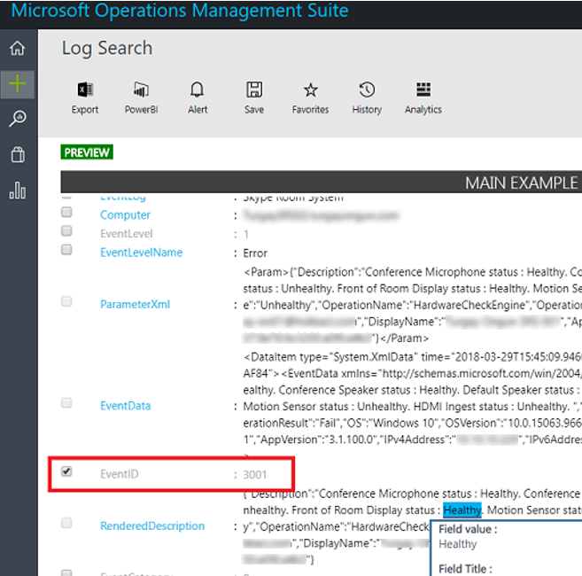
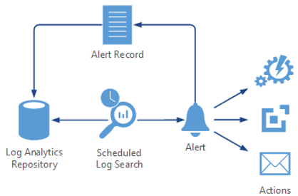

# <a name="deploy-skype-room-systems-v2-management-with-oms"></a><span data-ttu-id="72609-103">OMS を使用した Skype Room Systems バージョン 2 の管理を展開する</span><span class="sxs-lookup"><span data-stu-id="72609-103">Deploy Skype Room Systems v2 management with OMS</span></span>
 
<span data-ttu-id="72609-104">この資料では、設定およびマイクロソフトの運用管理スイートを使用して、Skype ルーム システム v2 のデバイスの統合された、エンド ・ ツー ・ エンドの管理を展開する方法について説明します。</span><span class="sxs-lookup"><span data-stu-id="72609-104">This article discusses how to set up and deploy integrated, end-to-end management of Skype Room Systems v2 devices by using Microsoft Operations Management Suite.</span></span>
  
<span data-ttu-id="72609-105">基本的な遠隔測定を提供するマイクロソフトの運用管理スイートを構成することができ、警告するためは、Skype の会議室のデバイスを管理します。</span><span class="sxs-lookup"><span data-stu-id="72609-105">You can configure Microsoft Operations Management Suite to provide basic telemetry and alerts that will help you manage Skype meeting room devices.</span></span> <span data-ttu-id="72609-106">管理ソリューションが完成に近づくにつれて、追加のデータとデバイスの可用性とパフォーマンスの詳細なビューを作成する管理機能を導入することができます。</span><span class="sxs-lookup"><span data-stu-id="72609-106">As your management solution matures, you might decide to deploy additional data and management capabilities to create a more detailed view of device availability and performance.</span></span>

<span data-ttu-id="72609-107">によって、このガイドに従うと、デバイスの可用性、アプリケーションおよびハードウェアの健康状態、および Skype ルーム システム v2 のアプリケーションのバージョンの配布のレポート、詳細なステータスを取得するのに例を次のようなダッシュ ボードを使用できます。</span><span class="sxs-lookup"><span data-stu-id="72609-107">By following this guide, you can use a dashboard like the following example to get detailed status reporting for device availability, application and hardware health, and Skype Room Systems v2 application version distribution.</span></span>

<span data-ttu-id="72609-108"></span><span class="sxs-lookup"><span data-stu-id="72609-108"></span></span>
  
<span data-ttu-id="72609-109">高いレベルでは、次のタスクを実行する必要があります。</span><span class="sxs-lookup"><span data-stu-id="72609-109">At a high level, you need to perform the following tasks:</span></span>


1.  [<span data-ttu-id="72609-110">操作の管理スイートの構成を検証します。</span><span class="sxs-lookup"><span data-stu-id="72609-110">Validate Operations Management Suite configuration</span></span>](with-oms.md#validate_OMS)
2.  [<span data-ttu-id="72609-111">管理セットアップの操作の管理スイートのテスト デバイスを構成します。</span><span class="sxs-lookup"><span data-stu-id="72609-111">Configure test devices for Operations Management Suite management setup</span></span>](with-oms.md#configure_test_devices)
3.  [<span data-ttu-id="72609-112">カスタム フィールドをマップする</span><span class="sxs-lookup"><span data-stu-id="72609-112">Map custom fields</span></span>](with-oms.md#Custom_fields)
4.  [<span data-ttu-id="72609-113">運用管理スイートで Skype ルーム システム v2 ビューを定義します。</span><span class="sxs-lookup"><span data-stu-id="72609-113">Define the Skype Room Systems v2 views in Operations Management Suite</span></span>](with-oms.md#Define_Views)
5.  [<span data-ttu-id="72609-114">警告を定義します。</span><span class="sxs-lookup"><span data-stu-id="72609-114">Define alerts</span></span>](with-oms.md#Alerts)
6.  [<span data-ttu-id="72609-115">操作の管理スイートのすべてのデバイスを構成します。</span><span class="sxs-lookup"><span data-stu-id="72609-115">Configure all devices for Operations Management Suite</span></span>](with-oms.md#configure_all_devices)
7.  [<span data-ttu-id="72609-116">追加の運用管理ソフトウェア ・ パッケージ ・ ソリューションを構成します。</span><span class="sxs-lookup"><span data-stu-id="72609-116">Configure additional Operations Management Suite solutions</span></span>](with-oms.md#Solutions)

> [!IMPORTANT]
> <span data-ttu-id="72609-117">Skype ルームのすべてのシステムにエージェントの展開を開始する前に実行する必要があるいくつかの Skype ルーム システム固有の手順はまだありますが、最小限の構成では、操作の管理スイートは、Windows オペレーティング システムを実行するコンピューターを監視できます、デバイスです。</span><span class="sxs-lookup"><span data-stu-id="72609-117">Although with minimal configuration, the Operations Management Suite can monitor a computer running a Windows operating system, there are still some Skype Room Systems–specific steps that you need to take before you start deploying agents to all Skype Room Systems devices.</span></span>
> <span data-ttu-id="72609-118">したがって、コントロールのセットアップと構成の正しい順序ですべての構成手順を実行するを強くお勧めします。</span><span class="sxs-lookup"><span data-stu-id="72609-118">Therefore, we highly recommend you perform all configuration steps in the right order for a controlled setup and configuration.</span></span> <span data-ttu-id="72609-119">最終結果の品質は、初期構成の品質に非常に依存します。</span><span class="sxs-lookup"><span data-stu-id="72609-119">The quality of the end result very much depends on the quality of the initial configuration.</span></span>

## <a name="validate-operations-management-suite-configuration"></a><span data-ttu-id="72609-120">操作の管理スイートの構成を検証します。</span><span class="sxs-lookup"><span data-stu-id="72609-120">Validate Operations Management Suite configuration</span></span>
<span data-ttu-id="72609-121"><a name="validate_OMS"> </a></span><span class="sxs-lookup"><span data-stu-id="72609-121"></span></span>

<span data-ttu-id="72609-122">Skype ルーム ・ システム ・ デバイスからのログの収集を開始するのには、操作管理スイートのワークスペースが必要です。</span><span class="sxs-lookup"><span data-stu-id="72609-122">You need to have an Operations Management Suite workspace to start collecting logs from Skype Room Systems devices.</span></span> <span data-ttu-id="72609-123">ワークスペースは、独自のデータ リポジトリ、データ ソース、およびソリューションの一意なログ分析環境です。</span><span class="sxs-lookup"><span data-stu-id="72609-123">A workspace is a unique Log Analytics environment with its own data repository, data sources, and solutions.</span></span> <span data-ttu-id="72609-124">既に既存のログ分析機能のワークスペースがある場合、Skype ルーム システム配置を監視するために使用可能性がありますまたは作成することができる場合は、専用のログ分析ワークスペースを Skype の部屋のシステムを監視するのには特定が必要です。</span><span class="sxs-lookup"><span data-stu-id="72609-124">If you already have an existing Log Analytics workspace, you might use it to monitor your Skype Room Systems deployment or you can create a dedicated Log Analytics workspace specific to your Skype Room Systems monitoring needs.</span></span>

<span data-ttu-id="72609-125">[Azure ポータルでのログの分析機能のワークスペースを作成する](https://docs.microsoft.com/azure/log-analytics/log-analytics-quick-create-workspace)この資料の指示に従って、新しいログの分析機能のワークスペースを作成する場合は、</span><span class="sxs-lookup"><span data-stu-id="72609-125">If you need to create a new Log Analytics workspace, follow the instructions in the article [Create a Log Analytics workspace in the Azure portal](https://docs.microsoft.com/azure/log-analytics/log-analytics-quick-create-workspace)</span></span>

> [!NOTE]
> <span data-ttu-id="72609-126">ログ分析機能を使用して、オペレーションの管理スイートで、Azure サブスクリプションはアクティブにする必要があります。</span><span class="sxs-lookup"><span data-stu-id="72609-126">To use Log Analytics with Operations Management Suite, you need to have an active Azure subscription.</span></span> <span data-ttu-id="72609-127">Azure サブスクリプションをお持ちでない場合は、開始点として[無料の試用版サブスクリプション](https://azure.microsoft.com/free)を作成できます。</span><span class="sxs-lookup"><span data-stu-id="72609-127">If you don’t have an Azure subscription, you can create [a free trial subscription](https://azure.microsoft.com/free) as a starting point.</span></span>


### <a name="configure-operations-management-suite-to-collect-skype-room-systems-event-logs"></a><span data-ttu-id="72609-128">Skype ルームのシステム イベント ログを収集するための運用管理スイートを構成します。</span><span class="sxs-lookup"><span data-stu-id="72609-128">Configure Operations Management Suite to collect Skype Room Systems event logs</span></span>

<span data-ttu-id="72609-129">のみ、ログ分析機能は、設定で指定されている Windows のイベント ログからイベントを収集します。</span><span class="sxs-lookup"><span data-stu-id="72609-129">Log Analytics only collects events from the Windows event logs that are specified in the settings.</span></span> <span data-ttu-id="72609-130">各ログには、選択した重大度のレベルのイベントのみが収集されます。</span><span class="sxs-lookup"><span data-stu-id="72609-130">For each log, only the events with the selected severities are collected.</span></span>

<span data-ttu-id="72609-131">Skype ルーム システムのデバイスとアプリケーションの状態を監視するために必要なログを収集するための運用管理スイートを構成する必要があります。</span><span class="sxs-lookup"><span data-stu-id="72609-131">You need to configure Operations Management Suite to collect the logs required to monitor Skype Room Systems device and application status.</span></span> <span data-ttu-id="72609-132">Skype ルーム システム v2 のデバイスでは、Skype の部屋のシステム イベント ログを使用します。</span><span class="sxs-lookup"><span data-stu-id="72609-132">Skype Room Systems v2 devices use the Skype Room Systems event log.</span></span>

<span data-ttu-id="72609-133">Skype ルームのシステム イベントを収集する運用管理ソフトウェア ・ パッケージを構成するには、[ログの分析では、Windows イベント ログ データ ソース](https://docs.microsoft.com/azure/log-analytics/log-analytics-data-sources-windows-events)を参照してください。</span><span class="sxs-lookup"><span data-stu-id="72609-133">To configure Operations Management Suite to collect the Skype Room Systems events, see [Windows event log data sources in Log Analytics](https://docs.microsoft.com/azure/log-analytics/log-analytics-data-sources-windows-events)</span></span>

<span data-ttu-id="72609-134"></span><span class="sxs-lookup"><span data-stu-id="72609-134"></span></span>


> [!IMPORTANT]
> <span data-ttu-id="72609-135">Skype ルームのシステム イベント ログを選択し、**エラー**、**警告**、および**情報**のチェック ボックスをオンします。</span><span class="sxs-lookup"><span data-stu-id="72609-135">Select the Skype Room System event log, and then select the **Error**, **Warning**, and **Information** check boxes.</span></span>

## <a name="configure-test-devices-for-operations-management-suite-setup"></a><span data-ttu-id="72609-136">操作の管理スイートのセットアップのテスト デバイスを構成します。</span><span class="sxs-lookup"><span data-stu-id="72609-136">Configure test devices for Operations Management Suite setup</span></span>
<span data-ttu-id="72609-137"><a name="configure_test_devices"> </a></span><span class="sxs-lookup"><span data-stu-id="72609-137"></span></span>

<span data-ttu-id="72609-138">Skype ルームのシステムに関連するイベントを監視することができる運用管理ソフトウェア ・ パッケージを準備する必要があります。</span><span class="sxs-lookup"><span data-stu-id="72609-138">You need to prepare Operations Management Suite to be able to monitor Skype Room Systems–related events.</span></span> <span data-ttu-id="72609-139">1 つか 2 つの Skype ルーム システム デバイスに物理的にアクセスしているものがある操作の管理スイートのエージェントを展開する必要がありますから開始して、テスト デバイスは、いくつかのデータを生成し、ログ分析機能のワークスペースに押し込みます。</span><span class="sxs-lookup"><span data-stu-id="72609-139">To start with, you need to deploy Operations Management Suite agents to just one or two Skype Room Systems devices that you have physical access to and have those test devices generate some data and push it to the Log Analytics workspace.</span></span>

### <a name="install-operations-management-suite-agents-to-test-devices"></a><span data-ttu-id="72609-140">デバイスをテストするのには操作の管理スイートのエージェントをインストールします。</span><span class="sxs-lookup"><span data-stu-id="72609-140">Install Operations Management Suite agents to test devices</span></span>

<span data-ttu-id="72609-141">テスト デバイスに[接続の Windows コンピューター](https://docs.microsoft.com/azure/log-analytics/log-analytics-agent-windows)で提供されている手順を使用して操作管理スイート エージェントを展開します。</span><span class="sxs-lookup"><span data-stu-id="72609-141">Deploy the Operations Management Suite agent to the test devices by using the instructions provided in [Connect Windows computers to the Log Analytics service in Azure](https://docs.microsoft.com/azure/log-analytics/log-analytics-agent-windows).</span></span> <span data-ttu-id="72609-142">この資料で Windows を展開する Microsoft の監視エージェントの運用管理スイートのワークスペース ID を取得する方法についての手順に関する詳細情報は、Skype ルーム システムのデバイスを取得するのにはプライマリ ・ キーに接続され、運用管理ソフトウェア ・ パッケージの展開、およびログ分析へのエージェント接続を確認する手順。</span><span class="sxs-lookup"><span data-stu-id="72609-142">This article gives detailed information about the steps for deploying Microsoft Monitoring Agent for Windows, instructions for obtaining the Operations Management Suite Workspace ID and the primary key to get Skype Room Systems devices connected to your Operations Management Suite deployment, and steps to verify agent connectivity to Log Analytics.</span></span>

### <a name="generate-sample-skype-room-systems-events"></a><span data-ttu-id="72609-143">サンプル Skype ルームのシステム イベントを生成します。</span><span class="sxs-lookup"><span data-stu-id="72609-143">Generate sample Skype Room Systems events</span></span>

<span data-ttu-id="72609-144">操作の管理スイートのエージェントがテストのデバイス上に配置されると、ログ分析機能が必要なイベント ログ データを収集することを確認します。</span><span class="sxs-lookup"><span data-stu-id="72609-144">After the Operations Management Suite agent is deployed onto the test devices, verify that the required event log data is collected by Log Analytics.</span></span>

1.  <span data-ttu-id="72609-145">[マイクロソフトの運用管理スイートのポータル](http://aka.ms/omsportal)にサインインします。</span><span class="sxs-lookup"><span data-stu-id="72609-145">Sign in to the [Microsoft Operations Management Suite portal](http://aka.ms/omsportal).</span></span>

2.  <span data-ttu-id="72609-146">Skype ルーム システム デバイスによって生成されたイベントの一覧を表示します。</span><span class="sxs-lookup"><span data-stu-id="72609-146">List the events generated by a Skype Room Systems device:</span></span>
    1.  <span data-ttu-id="72609-147">**ログの検索**に移動し、ユーザー設定フィールドを持つレコードを取得するクエリを使用します。</span><span class="sxs-lookup"><span data-stu-id="72609-147">Go to **Log Search** and use a query to retrieve the records that will have the custom field.</span></span>
    2.  <span data-ttu-id="72609-148">サンプル クエリ。`Event | where Source == "SRS-App"`</span><span class="sxs-lookup"><span data-stu-id="72609-148">Sample query: `Event | where Source == "SRS-App"`</span></span>

3.  <span data-ttu-id="72609-149">クエリが正常なハートビート イベントを含むログ レコードを返すことを確認します。</span><span class="sxs-lookup"><span data-stu-id="72609-149">Make sure that the query returns log records that include successful heartbeat events.</span></span>

4.  <span data-ttu-id="72609-150">ハードウェアの問題を生成し、運用管理ソフトウェア ・ パッケージに必要なイベントを記録することを検証します。</span><span class="sxs-lookup"><span data-stu-id="72609-150">Generate a hardware issue, and validate that the required events are logged in Operations Management Suite.</span></span>
    1.  <span data-ttu-id="72609-151">Skype ルーム システムのシステムのテストで周辺機器の 1 つを外します。</span><span class="sxs-lookup"><span data-stu-id="72609-151">Unplug one of the peripheral devices on the test Skype Room Systems system.</span></span> <span data-ttu-id="72609-152">カメラ、スピーカー フォン、マイク、または部屋の前面表示可能性があります。</span><span class="sxs-lookup"><span data-stu-id="72609-152">This could be the camera, speakerphone, microphone, or Front Room Display</span></span>
    2.  <span data-ttu-id="72609-153">運用管理スイートで事前に設定するイベント ログの 10 分間待ちます。</span><span class="sxs-lookup"><span data-stu-id="72609-153">Wait 10 minutes for the event log to be populated in Operations Management Suite.</span></span>
    3.  <span data-ttu-id="72609-154">ハードウェア エラー イベントのリストにクエリを使用します。`Event | where EventID == 3001`</span><span class="sxs-lookup"><span data-stu-id="72609-154">Use a query to list hardware error events: `Event | where EventID == 3001`</span></span>

5.  <span data-ttu-id="72609-155">、アプリケーションの問題を生成し、必要なイベントを記録することを検証します。</span><span class="sxs-lookup"><span data-stu-id="72609-155">Generate an application issue, and validate that the required events are logged.</span></span>
    1.  <span data-ttu-id="72609-156">Skype ルーム システム アプリケーションの構成を変更して、不正なセッション開始プロトコル (SIP) アドレスとパスワードのペアを入力します。</span><span class="sxs-lookup"><span data-stu-id="72609-156">Modify Skype Room Systems application configuration, and type an incorrect Session Initiation Protocol (SIP) address/password pair.</span></span>
    2.  <span data-ttu-id="72609-157">運用管理スイートで事前に設定するイベント ログの 10 分間待ちます。</span><span class="sxs-lookup"><span data-stu-id="72609-157">Wait 10 minutes for the event log to be populated in Operations Management Suite.</span></span>
    3.  <span data-ttu-id="72609-158">アプリケーション エラー イベントのリストにクエリを使用します。`Event | where EventID == 2001`</span><span class="sxs-lookup"><span data-stu-id="72609-158">Use a query to list application error events: `Event | where EventID == 2001`</span></span>

> [!IMPORTANT]
> <span data-ttu-id="72609-159">ユーザー設定フィールドを構成する前に、これらのサンプルのイベント ログが必要です。</span><span class="sxs-lookup"><span data-stu-id="72609-159">These sample event logs are required before custom fields can be configured.</span></span> <span data-ttu-id="72609-160">必要なイベント ログを収集し終えるまで、次の手順を続行しません。</span><span class="sxs-lookup"><span data-stu-id="72609-160">Don’t proceed to the next step until you have collected the required event logs.</span></span>

## <a name="map-custom-fields"></a><span data-ttu-id="72609-161">カスタム フィールドをマップする</span><span class="sxs-lookup"><span data-stu-id="72609-161">Map custom fields</span></span>
<span data-ttu-id="72609-162"><a name="Custom_fields"> </a></span><span class="sxs-lookup"><span data-stu-id="72609-162"></span></span>

<span data-ttu-id="72609-163">イベント ログから特定のデータを抽出するのにには、カスタム フィールドを使用します。</span><span class="sxs-lookup"><span data-stu-id="72609-163">You use custom fields to extract specific data from the event logs.</span></span> <span data-ttu-id="72609-164">タイル、ダッシュ ボードの表示、および警告の後で使用するカスタム フィールドを定義する必要があります。</span><span class="sxs-lookup"><span data-stu-id="72609-164">You need to define custom fields that will be used later with your tiles, dashboard views, and alerts.</span></span> <span data-ttu-id="72609-165">[ログ分析でユーザー設定フィールド](https://docs.microsoft.com/azure/log-analytics/log-analytics-custom-fields)を参照してくださいし、カスタム フィールドの作成を開始する前に概念を理解します。</span><span class="sxs-lookup"><span data-stu-id="72609-165">See [Custom fields in Log Analytics](https://docs.microsoft.com/azure/log-analytics/log-analytics-custom-fields) and become familiar with the concepts before you start creating your custom fields.</span></span>

<span data-ttu-id="72609-166">キャプチャしたイベント ログから、ユーザー設定のフィールドを抽出するには、以下の手順を実行します。</span><span class="sxs-lookup"><span data-stu-id="72609-166">To extract your custom fields out of the captured event logs, follow these steps:</span></span>

1.  <span data-ttu-id="72609-167">[マイクロソフトの運用管理スイートのポータル](http://aka.ms/omsportal)にサインインします。</span><span class="sxs-lookup"><span data-stu-id="72609-167">Sign in to the [Microsoft Operations Management Suite portal](http://aka.ms/omsportal).</span></span>

2.  <span data-ttu-id="72609-168">Skype ルーム システム デバイスによって生成されたイベントの一覧を表示します。</span><span class="sxs-lookup"><span data-stu-id="72609-168">List the events generated by a Skype Room Systems device:</span></span>
    1.  <span data-ttu-id="72609-169">**ログの検索**に移動し、ユーザー設定フィールドを持つレコードを取得するクエリを使用します。</span><span class="sxs-lookup"><span data-stu-id="72609-169">Go to **Log Search** and use a query to retrieve the records that will have the custom field.</span></span>
    2.  <span data-ttu-id="72609-170">サンプル クエリ。`Event | where Source == "SRS-App"`</span><span class="sxs-lookup"><span data-stu-id="72609-170">Sample query: `Event | where Source == "SRS-App"`</span></span>

3.  <span data-ttu-id="72609-171">レコードのいずれかを選択、左側にあるボタンを選択し、フィールドの展開ウィザードを起動します。</span><span class="sxs-lookup"><span data-stu-id="72609-171">Select one of the records, select the button to the left, and start the field extraction wizard.</span></span>

<span data-ttu-id="72609-172"></span><span class="sxs-lookup"><span data-stu-id="72609-172"></span></span>

4.  <span data-ttu-id="72609-173">RenderedDescription から抽出し、フィールドのタイトルを提供したいデータを強調表示します。</span><span class="sxs-lookup"><span data-stu-id="72609-173">Highlight the data you’d like to extract from the RenderedDescription and provide a Field Title.</span></span> <span data-ttu-id="72609-174">表 1 には、使用するフィールド名が用意されています。</span><span class="sxs-lookup"><span data-stu-id="72609-174">The field names that you should use are provided in Table 1.</span></span>

<span data-ttu-id="72609-175"></span><span class="sxs-lookup"><span data-stu-id="72609-175"></span></span>

5.  <span data-ttu-id="72609-176">表 1 に示すようにマッピングを使用します。</span><span class="sxs-lookup"><span data-stu-id="72609-176">Use the mappings shown in Table 1.</span></span> <span data-ttu-id="72609-177">運用管理スイートが自動的に追加、 ** \_CF**文字列の新しいフィールドを定義するとき。</span><span class="sxs-lookup"><span data-stu-id="72609-177">Operations Management Suite will automatically add the **\_CF** string when you define the new field.</span></span>

> [!IMPORTANT]
> <span data-ttu-id="72609-178">JSON との操作の管理スイートのすべてのフィールドは大文字小文字を区別することを忘れないでください。</span><span class="sxs-lookup"><span data-stu-id="72609-178">Remember that all JSON and Operations Management Suite fields are case-sensitive.</span></span>

> <span data-ttu-id="72609-179">次の表に、[イベント Id] チェック ボックスをオンの状態に注意してください。</span><span class="sxs-lookup"><span data-stu-id="72609-179">Pay attention to the state of the EventID check box in the table below.</span></span> <span data-ttu-id="72609-180">カスタム フィールドの値を正常に抽出する操作の管理スイートの場合は、このチェック ボックスの状態を確認することを確認します。</span><span class="sxs-lookup"><span data-stu-id="72609-180">Be sure you confirm the state of this check box for Operations Management Suite to successfully extract custom field values.</span></span>
> <span data-ttu-id="72609-181"></span><span class="sxs-lookup"><span data-stu-id="72609-181"></span></span> 

<span data-ttu-id="72609-182">**表 1**</span><span class="sxs-lookup"><span data-stu-id="72609-182">**Table 1**</span></span>

| <span data-ttu-id="72609-183">**JSON フィールド**</span><span class="sxs-lookup"><span data-stu-id="72609-183">**JSON field**</span></span>               | <span data-ttu-id="72609-184">**OMS ユーザー設定フィールド**</span><span class="sxs-lookup"><span data-stu-id="72609-184">**OMS custom field**</span></span>       | <span data-ttu-id="72609-185">**イベント ID**</span><span class="sxs-lookup"><span data-stu-id="72609-185">**Event ID**</span></span> |
|------------------------------|----------------------------|-----------------|
| <span data-ttu-id="72609-186">説明</span><span class="sxs-lookup"><span data-stu-id="72609-186">Description</span></span>                  | <span data-ttu-id="72609-187">SRSEventDescription_CF</span><span class="sxs-lookup"><span data-stu-id="72609-187">SRSEventDescription_CF</span></span>     | <span data-ttu-id="72609-188">選択されていません。</span><span class="sxs-lookup"><span data-stu-id="72609-188">Not selected</span></span>    |
| <span data-ttu-id="72609-189">ResourceState</span><span class="sxs-lookup"><span data-stu-id="72609-189">ResourceState</span></span>                | <span data-ttu-id="72609-190">SRSResourceState_CF</span><span class="sxs-lookup"><span data-stu-id="72609-190">SRSResourceState_CF</span></span>        | <span data-ttu-id="72609-191">選択されていません。</span><span class="sxs-lookup"><span data-stu-id="72609-191">Not selected</span></span>    |
| <span data-ttu-id="72609-192">OperationName</span><span class="sxs-lookup"><span data-stu-id="72609-192">OperationName</span></span>                | <span data-ttu-id="72609-193">SRSOperationName_CF</span><span class="sxs-lookup"><span data-stu-id="72609-193">SRSOperationName_CF</span></span>        | <span data-ttu-id="72609-194">選択されていません。</span><span class="sxs-lookup"><span data-stu-id="72609-194">Not selected</span></span>    |
| <span data-ttu-id="72609-195">OperationResult</span><span class="sxs-lookup"><span data-stu-id="72609-195">OperationResult</span></span>              | <span data-ttu-id="72609-196">SRSOperationResult_CF</span><span class="sxs-lookup"><span data-stu-id="72609-196">SRSOperationResult_CF</span></span>      | <span data-ttu-id="72609-197">選択されていません。</span><span class="sxs-lookup"><span data-stu-id="72609-197">Not selected</span></span>    |
| <span data-ttu-id="72609-198">OS</span><span class="sxs-lookup"><span data-stu-id="72609-198">OS</span></span>                           | <span data-ttu-id="72609-199">SRSOSVersion_CF</span><span class="sxs-lookup"><span data-stu-id="72609-199">SRSOSVersion_CF</span></span>            | <span data-ttu-id="72609-200">選択されていません。</span><span class="sxs-lookup"><span data-stu-id="72609-200">Not selected</span></span>    |
| <span data-ttu-id="72609-201">OSVersion</span><span class="sxs-lookup"><span data-stu-id="72609-201">OSVersion</span></span>                    | <span data-ttu-id="72609-202">SRSOSLongVersion_CF</span><span class="sxs-lookup"><span data-stu-id="72609-202">SRSOSLongVersion_CF</span></span>        | <span data-ttu-id="72609-203">選択されていません。</span><span class="sxs-lookup"><span data-stu-id="72609-203">Not selected</span></span>    |
| <span data-ttu-id="72609-204">Alias</span><span class="sxs-lookup"><span data-stu-id="72609-204">Alias</span></span>                        | <span data-ttu-id="72609-205">SRSAlias_CF</span><span class="sxs-lookup"><span data-stu-id="72609-205">SRSAlias_CF</span></span>                | <span data-ttu-id="72609-206">選択されていません。</span><span class="sxs-lookup"><span data-stu-id="72609-206">Not selected</span></span>    |
| <span data-ttu-id="72609-207">表示名</span><span class="sxs-lookup"><span data-stu-id="72609-207">DisplayName</span></span>                  | <span data-ttu-id="72609-208">SRSDisplayName_CF</span><span class="sxs-lookup"><span data-stu-id="72609-208">SRSDisplayName_CF</span></span>          | <span data-ttu-id="72609-209">選択されていません。</span><span class="sxs-lookup"><span data-stu-id="72609-209">Not selected</span></span>    |
| <span data-ttu-id="72609-210">AppVersion</span><span class="sxs-lookup"><span data-stu-id="72609-210">AppVersion</span></span>                   | <span data-ttu-id="72609-211">SRSAppVersion_CF</span><span class="sxs-lookup"><span data-stu-id="72609-211">SRSAppVersion_CF</span></span>           | <span data-ttu-id="72609-212">選択されていません。</span><span class="sxs-lookup"><span data-stu-id="72609-212">Not selected</span></span>    |
| <span data-ttu-id="72609-213">IPv4Address</span><span class="sxs-lookup"><span data-stu-id="72609-213">IPv4Address</span></span>                  | <span data-ttu-id="72609-214">SRSIPv4Address_CF</span><span class="sxs-lookup"><span data-stu-id="72609-214">SRSIPv4Address_CF</span></span>          | <span data-ttu-id="72609-215">選択されていません。</span><span class="sxs-lookup"><span data-stu-id="72609-215">Not selected</span></span>    |
| <span data-ttu-id="72609-216">IPv6Address</span><span class="sxs-lookup"><span data-stu-id="72609-216">IPv6Address</span></span>                  | <span data-ttu-id="72609-217">SRSIPv6Address_CF</span><span class="sxs-lookup"><span data-stu-id="72609-217">SRSIPv6Address_CF</span></span>          | <span data-ttu-id="72609-218">選択されていません。</span><span class="sxs-lookup"><span data-stu-id="72609-218">Not selected</span></span>    |
| <span data-ttu-id="72609-219">ルームの表示状態の前面</span><span class="sxs-lookup"><span data-stu-id="72609-219">Front of Room Display status</span></span> | <span data-ttu-id="72609-220">SRSFORDStatus_CF</span><span class="sxs-lookup"><span data-stu-id="72609-220">SRSFORDStatus_CF</span></span>           | <span data-ttu-id="72609-221">3001</span><span class="sxs-lookup"><span data-stu-id="72609-221">3001</span></span>            |
| <span data-ttu-id="72609-222">カメラの状態</span><span class="sxs-lookup"><span data-stu-id="72609-222">Camera status</span></span>                | <span data-ttu-id="72609-223">SRSCameraStatus_CF</span><span class="sxs-lookup"><span data-stu-id="72609-223">SRSCameraStatus_CF</span></span>         | <span data-ttu-id="72609-224">3001</span><span class="sxs-lookup"><span data-stu-id="72609-224">3001</span></span>            |
| <span data-ttu-id="72609-225">会議マイクの状態</span><span class="sxs-lookup"><span data-stu-id="72609-225">Conference Microphone status</span></span> | <span data-ttu-id="72609-226">SRSConfMicrophoneStatus_CF</span><span class="sxs-lookup"><span data-stu-id="72609-226">SRSConfMicrophoneStatus_CF</span></span> | <span data-ttu-id="72609-227">3001</span><span class="sxs-lookup"><span data-stu-id="72609-227">3001</span></span>            |
| <span data-ttu-id="72609-228">会議の発表者のステータス</span><span class="sxs-lookup"><span data-stu-id="72609-228">Conference Speaker status</span></span>    | <span data-ttu-id="72609-229">SRSConfSpeakerStatus_CF</span><span class="sxs-lookup"><span data-stu-id="72609-229">SRSConfSpeakerStatus_CF</span></span>    | <span data-ttu-id="72609-230">3001</span><span class="sxs-lookup"><span data-stu-id="72609-230">3001</span></span>            |
| <span data-ttu-id="72609-231">スピーカーの既定の状態</span><span class="sxs-lookup"><span data-stu-id="72609-231">Default Speaker status</span></span>       | <span data-ttu-id="72609-232">SRSDefaultSpeakerStatus_CF</span><span class="sxs-lookup"><span data-stu-id="72609-232">SRSDefaultSpeakerStatus_CF</span></span> | <span data-ttu-id="72609-233">3001</span><span class="sxs-lookup"><span data-stu-id="72609-233">3001</span></span>            |
| <span data-ttu-id="72609-234">モーション センサーのステータス</span><span class="sxs-lookup"><span data-stu-id="72609-234">Motion Sensor status</span></span>         | <span data-ttu-id="72609-235">SRSMotionSensorStatus_CF</span><span class="sxs-lookup"><span data-stu-id="72609-235">SRSMotionSensorStatus_CF</span></span>   | <span data-ttu-id="72609-236">3001</span><span class="sxs-lookup"><span data-stu-id="72609-236">3001</span></span>            |
| <span data-ttu-id="72609-237">HDMI 取り込みの状態</span><span class="sxs-lookup"><span data-stu-id="72609-237">HDMI Ingest status</span></span>           | <span data-ttu-id="72609-238">SRSHDMIIngestStatus_CF</span><span class="sxs-lookup"><span data-stu-id="72609-238">SRSHDMIIngestStatus_CF</span></span>     | <span data-ttu-id="72609-239">3001</span><span class="sxs-lookup"><span data-stu-id="72609-239">3001</span></span>            |


## <a name="define-the-skype-room-systems-v2-views-in-operations-management-suite"></a><span data-ttu-id="72609-240">運用管理スイートで Skype ルーム システム v2 ビューを定義します。</span><span class="sxs-lookup"><span data-stu-id="72609-240">Define the Skype Room Systems v2 views in Operations Management Suite</span></span>
<span data-ttu-id="72609-241"><a name="Define_Views"> </a></span><span class="sxs-lookup"><span data-stu-id="72609-241"></span></span>

<span data-ttu-id="72609-242">データが収集され、ユーザー設定フィールドがマップされている後、は、Skype ルーム システム v2 のイベントを監視するためのさまざまなタイルを含むダッシュ ボードを開発するのに管理スイート ビュー デザイナーの操作を使用できます。</span><span class="sxs-lookup"><span data-stu-id="72609-242">After data is collected and custom fields are mapped, you can use Operations Management Suite View Designer to develop a dashboard containing various tiles to monitor Skype Room Systems v2 events.</span></span> <span data-ttu-id="72609-243">ビュー デザイナーを使用して、次のファイルを作成します。</span><span class="sxs-lookup"><span data-stu-id="72609-243">Use View Designer to create the following tiles.</span></span> <span data-ttu-id="72609-244">詳細については、[ログ分析機能でカスタム ビューを作成するビュー デザイナーの使用](https://docs.microsoft.com/azure/log-analytics/log-analytics-view-designer)を参照してください。</span><span class="sxs-lookup"><span data-stu-id="72609-244">For more information, see [Use View Designer to create custom views in Log Analytics](https://docs.microsoft.com/azure/log-analytics/log-analytics-view-designer)</span></span>

> [!NOTE]
> <span data-ttu-id="72609-245">正常に動作するダッシュ ボードのタイルのこのガイドで前述の手順への接続が完了する必要があります。</span><span class="sxs-lookup"><span data-stu-id="72609-245">Earlier steps in this guide should have been completed for the dashboard tiles to work properly.</span></span>


### <a name="create-a-skype-room-systems-v2-dashboard-by-using-the-import-method"></a><span data-ttu-id="72609-246">インポート メソッドを使用して、Skype ルーム システム v2 のダッシュ ボードを作成します。</span><span class="sxs-lookup"><span data-stu-id="72609-246">Create a Skype Room Systems v2 dashboard by using the import method</span></span>

<span data-ttu-id="72609-247">操作の管理スイートのダッシュ ボードにインポートし、デバイスをすぐに監視を開始できます。</span><span class="sxs-lookup"><span data-stu-id="72609-247">You can import an Operations Management Suite dashboard and start monitoring your devices immediately.</span></span> <span data-ttu-id="72609-248">ダッシュ ボードにインポートするのには以下の手順を実行するには。</span><span class="sxs-lookup"><span data-stu-id="72609-248">Take the following steps to import the dashboard:</span></span>

1.  <span data-ttu-id="72609-249">[ダッシュ ボード](http://download.microsoft.com/download/9/0/D/90D4826A-9FD2-47D2-B911-97BF1737F4F7/SkypeRoomSystems_v2.omsview)をダウンロードしてください。</span><span class="sxs-lookup"><span data-stu-id="72609-249">Download the [dashboard](http://download.microsoft.com/download/9/0/D/90D4826A-9FD2-47D2-B911-97BF1737F4F7/SkypeRoomSystems_v2.omsview).</span></span>
2.  <span data-ttu-id="72609-250">[マイクロソフトの運用管理スイートのポータル](http://aka.ms/omsportal)にサインインします。</span><span class="sxs-lookup"><span data-stu-id="72609-250">Sign in to the [Microsoft Operations Management Suite portal](http://aka.ms/omsportal).</span></span>
3.  <span data-ttu-id="72609-251">**ビュー デザイナー**を開きます。</span><span class="sxs-lookup"><span data-stu-id="72609-251">Open **View Designer**.</span></span>
4.  <span data-ttu-id="72609-252">**インポート**] を選択し、 **SkypeRoomSystems_v2.omsview**ファイルを選択します。</span><span class="sxs-lookup"><span data-stu-id="72609-252">Select **Import**, and then select the **SkypeRoomSystems_v2.omsview** file.</span></span>
5.  <span data-ttu-id="72609-253">**保存**を選択します。</span><span class="sxs-lookup"><span data-stu-id="72609-253">Select **Save**.</span></span>

### <a name="create-a-skype-room-systems-v2-dashboard-manually"></a><span data-ttu-id="72609-254">Skype ルーム システム v2 のダッシュ ボードを手動で作成します。</span><span class="sxs-lookup"><span data-stu-id="72609-254">Create a Skype Room Systems v2 dashboard manually</span></span>

<span data-ttu-id="72609-255">または、独自のダッシュ ボードを作成し、監視対象のタイルのみを追加できます。</span><span class="sxs-lookup"><span data-stu-id="72609-255">Alternatively, you can create your own dashboard and add only the tiles that you wish to monitor.</span></span>

#### <a name="configure-the-overview-tile"></a><span data-ttu-id="72609-256">概要タイルを構成します。</span><span class="sxs-lookup"><span data-stu-id="72609-256">Configure the Overview Tile</span></span>
1.  <span data-ttu-id="72609-257">**ビュー デザイナー**を開きます。</span><span class="sxs-lookup"><span data-stu-id="72609-257">Open **View Designer**.</span></span>
2.  <span data-ttu-id="72609-258">**概要タイル**を選択し、ギャラリーから**2 つの数値**を選択します。</span><span class="sxs-lookup"><span data-stu-id="72609-258">Select **Overview Tile**, and then select **Two numbers** from the gallery.</span></span>
3.  <span data-ttu-id="72609-259">タイル**Skype ルーム システム**の名前を指定します。</span><span class="sxs-lookup"><span data-stu-id="72609-259">Name the tile **Skype Room Systems**.</span></span>
4.  <span data-ttu-id="72609-260">**最初のタイル**を定義します。</span><span class="sxs-lookup"><span data-stu-id="72609-260">Define the **First Tile**:</span></span><br>
    <span data-ttu-id="72609-261">**凡例:** 最後の月以内にハートビートを送信するデバイス</span><span class="sxs-lookup"><span data-stu-id="72609-261">**Legend:** Devices that sent a heartbeat at least once within the last month</span></span><br>
    <span data-ttu-id="72609-262">**クエリ:**```Event | where EventLog == "Skype Room System" and TimeGenerated > ago(30d) | summarize TotalSRSDevices = dcount(Computer)```</span><span class="sxs-lookup"><span data-stu-id="72609-262">**Query:** ```Event | where EventLog == "Skype Room System" and TimeGenerated > ago(30d) | summarize TotalSRSDevices = dcount(Computer)```</span></span>
5.  <span data-ttu-id="72609-263">**2 つ目のタイル**を定義します。</span><span class="sxs-lookup"><span data-stu-id="72609-263">Define the **Second Tile**:</span></span><br>
    <span data-ttu-id="72609-264">**凡例:** 最後の時間内にハートビートを送信するアクティブなデバイス</span><span class="sxs-lookup"><span data-stu-id="72609-264">**Legend:** Active devices that sent a heartbeat within the last hour</span></span><br>
    <span data-ttu-id="72609-265">**クエリ:**```Event | where EventLog == "Skype Room System" and SRSOperationName_CF == "Heartbeat" and TimeGenerated > ago(1h) | summarize TotalSRSDevices = dcount(Computer)```</span><span class="sxs-lookup"><span data-stu-id="72609-265">**Query:** ```Event | where EventLog == "Skype Room System" and SRSOperationName_CF == "Heartbeat" and TimeGenerated > ago(1h) | summarize TotalSRSDevices = dcount(Computer)```</span></span>
6.  <span data-ttu-id="72609-266">**適用**を選択します。</span><span class="sxs-lookup"><span data-stu-id="72609-266">Select **Apply**.</span></span>

### <a name="create-a-tile-that-displays-active-devices"></a><span data-ttu-id="72609-267">アクティブなデバイスを表示するタイルを作成します。</span><span class="sxs-lookup"><span data-stu-id="72609-267">Create a tile that displays active devices</span></span>
1.  <span data-ttu-id="72609-268">タイルを追加する**ダッシュ ボードのビュー**を選択します。</span><span class="sxs-lookup"><span data-stu-id="72609-268">Select **View Dashboard** to start adding your tiles.</span></span>
2.  <span data-ttu-id="72609-269">ギャラリーから**リストと番号**を選択します。</span><span class="sxs-lookup"><span data-stu-id="72609-269">Select **Number & list** from the gallery</span></span>
3.  <span data-ttu-id="72609-270">**全般**プロパティを定義します。</span><span class="sxs-lookup"><span data-stu-id="72609-270">Define the **General** properties:</span></span><br>
    <span data-ttu-id="72609-271">**グループ タイトル:** ハートビートの状態</span><span class="sxs-lookup"><span data-stu-id="72609-271">**Group Title:** Heartbeat Status</span></span><br>
    <span data-ttu-id="72609-272">**新しいグループ:** 選択</span><span class="sxs-lookup"><span data-stu-id="72609-272">**New Group:** Selected</span></span>
4.  <span data-ttu-id="72609-273">**タイル**のプロパティを定義します。</span><span class="sxs-lookup"><span data-stu-id="72609-273">Define the **Tile** properties:</span></span><br>
    <span data-ttu-id="72609-274">**凡例:** アクティブなデバイス (ハートビートの最後の 20 分間で送信されます)</span><span class="sxs-lookup"><span data-stu-id="72609-274">**Legend:** Active devices (heartbeat sent in the last 20 minutes)</span></span><br>
    <span data-ttu-id="72609-275">**クエリを並べて表示:**```Event | where EventLog == "Skype Room System" and SRSOperationName_CF == "Heartbeat" and TimeGenerated > ago(20m) | summarize AggregatedValue = count() by Computer | count```</span><span class="sxs-lookup"><span data-stu-id="72609-275">**Tile Query:** ```Event | where EventLog == "Skype Room System" and SRSOperationName_CF == "Heartbeat" and TimeGenerated > ago(20m) | summarize AggregatedValue = count() by Computer | count```</span></span>
5.  <span data-ttu-id="72609-276">**リスト**のプロパティを定義します。</span><span class="sxs-lookup"><span data-stu-id="72609-276">Define the **List** properties:</span></span><br>
    <span data-ttu-id="72609-277">**クエリの一覧を表示:**```Event | where EventLog == "Skype Room System" and SRSOperationName_CF == "Heartbeat" and TimeGenerated > ago(20m) | summarize TimeGenerated = max(TimeGenerated) by Computer | order by TimeGenerated```</span><span class="sxs-lookup"><span data-stu-id="72609-277">**List Query:** ```Event | where EventLog == "Skype Room System" and SRSOperationName_CF == "Heartbeat" and TimeGenerated > ago(20m) | summarize TimeGenerated = max(TimeGenerated) by Computer | order by TimeGenerated```</span></span>
6.  <span data-ttu-id="72609-278">**列のタイトル**を定義します。</span><span class="sxs-lookup"><span data-stu-id="72609-278">Define **Column Titles**:</span></span><br>
    <span data-ttu-id="72609-279">**名:** 表示名</span><span class="sxs-lookup"><span data-stu-id="72609-279">**Name:** Display Name</span></span><br>
    <span data-ttu-id="72609-280">**値:** 最後のハートビート</span><span class="sxs-lookup"><span data-stu-id="72609-280">**Value:** Last Heartbeat</span></span>
7.  <span data-ttu-id="72609-281">**ナビゲーション クエリ**を定義します。</span><span class="sxs-lookup"><span data-stu-id="72609-281">Define **Navigation Query**.</span></span><br>
    ```search {selected item} | where EventLog == "Skype Room System" and SRSOperationName_CF == "Heartbeat" | summarize arg_max(TimeGenerated, *) by Computer | project TimeGenerated, Computer, SRSAlias_CF, SRSAppVersion_CF, SRSOSVersion_CF, SRSOSLongVersion_CF, SRSIPv4Address_CF, SRSIPv6Address_CF, SRSOperationName_CF, SRSOperationResult_CF, SRSResourceState_CF, SRSEventDescription_CF```
8.  <span data-ttu-id="72609-282">**適用**され、し、**閉じる**を選択します。</span><span class="sxs-lookup"><span data-stu-id="72609-282">Select **Apply**, and then **Close**.</span></span>

### <a name="create-a-tile-that-displays-devices-that-have-connectivity-issues"></a><span data-ttu-id="72609-283">接続の問題のあるデバイスを表示するタイルを作成します。</span><span class="sxs-lookup"><span data-stu-id="72609-283">Create a tile that displays devices that have connectivity issues</span></span>
1.  <span data-ttu-id="72609-284">ギャラリーから**リストの数と**を選択し、新たにコピーします。</span><span class="sxs-lookup"><span data-stu-id="72609-284">Select **Number & list** from the gallery, and then add a new tile.</span></span>
2.  <span data-ttu-id="72609-285">**全般**プロパティを定義します。</span><span class="sxs-lookup"><span data-stu-id="72609-285">Define the **General** properties:</span></span><br>
    <span data-ttu-id="72609-286">**グループ タイトル:** 空のままに</span><span class="sxs-lookup"><span data-stu-id="72609-286">**Group Title:** Leave empty</span></span><br>
    <span data-ttu-id="72609-287">**新しいグループ:** 選択されていません。</span><span class="sxs-lookup"><span data-stu-id="72609-287">**New Group:** Not Selected</span></span>
3.  <span data-ttu-id="72609-288">**タイル**のプロパティを定義します。</span><span class="sxs-lookup"><span data-stu-id="72609-288">Define the **Tile** properties:</span></span><br>
    <span data-ttu-id="72609-289">**凡例:** 非アクティブなデバイス (ハートビート メッセージは最後の 20 分間で送信されます)</span><span class="sxs-lookup"><span data-stu-id="72609-289">**Legend:** Inactive Devices (no heartbeat message sent in the last 20 minutes)</span></span><br>
    <span data-ttu-id="72609-290">**クエリを並べて表示:**```Event | where EventLog == "Skype Room System" and SRSOperationName_CF == "Heartbeat" | summarize LastHB = max(TimeGenerated) by Computer | where LastHB < ago(20m) | count```</span><span class="sxs-lookup"><span data-stu-id="72609-290">**Tile Query:** ```Event | where EventLog == "Skype Room System" and SRSOperationName_CF == "Heartbeat" | summarize LastHB = max(TimeGenerated) by Computer | where LastHB < ago(20m) | count```</span></span>
4.  <span data-ttu-id="72609-291">**リスト**のプロパティを定義します。</span><span class="sxs-lookup"><span data-stu-id="72609-291">Define the **List** properties:</span></span><br>
    <span data-ttu-id="72609-292">**クエリの一覧を表示:**```Event | where EventLog == "Skype Room System" and SRSOperationName_CF == "Heartbeat" | summarize TimeGenerated = max(TimeGenerated) by Computer | where TimeGenerated < ago(20m) | order by TimeGenerated```</span><span class="sxs-lookup"><span data-stu-id="72609-292">**List Query:** ```Event | where EventLog == "Skype Room System" and SRSOperationName_CF == "Heartbeat" | summarize TimeGenerated = max(TimeGenerated) by Computer | where TimeGenerated < ago(20m) | order by TimeGenerated```</span></span>
5.  <span data-ttu-id="72609-293">**列のタイトル**を定義します。</span><span class="sxs-lookup"><span data-stu-id="72609-293">Define **Column Titles**:</span></span><br>
    <span data-ttu-id="72609-294">**名:** 表示名</span><span class="sxs-lookup"><span data-stu-id="72609-294">**Name:** Display Name</span></span><br>
    <span data-ttu-id="72609-295">**値:** 最後のハートビート</span><span class="sxs-lookup"><span data-stu-id="72609-295">**Value:** Last Heartbeat</span></span>
6.  <span data-ttu-id="72609-296">**ナビゲーション クエリ**を定義します。</span><span class="sxs-lookup"><span data-stu-id="72609-296">Define **Navigation Query**:</span></span><br>
    ```search {selected item} | where EventLog == "Skype Room System" and SRSOperationName_CF == "Heartbeat" | summarize arg_max(TimeGenerated, *) by Computer | project TimeGenerated, Computer, SRSAlias_CF, SRSAppVersion_CF, SRSOSVersion_CF, SRSOSLongVersion_CF, SRSIPv4Address_CF, SRSIPv6Address_CF, SRSOperationName_CF, SRSOperationResult_CF, SRSResourceState_CF, SRSEventDescription_CF```
7.  <span data-ttu-id="72609-297">**適用**され、し、**閉じる**を選択します。</span><span class="sxs-lookup"><span data-stu-id="72609-297">Select **Apply**, and then **Close**.</span></span>

### <a name="create-a-tile-that-displays-devices-that-have-a-hardware-error"></a><span data-ttu-id="72609-298">ハードウェア エラーのあるデバイスを表示するタイルを作成します。</span><span class="sxs-lookup"><span data-stu-id="72609-298">Create a tile that displays devices that have a hardware error</span></span>

1.  <span data-ttu-id="72609-299">ギャラリーから**リストの数と**を選択し、新たにコピーします。</span><span class="sxs-lookup"><span data-stu-id="72609-299">Select **Number & list** from the gallery, and then add a new tile.</span></span>
2.  <span data-ttu-id="72609-300">**全般**プロパティを定義します。</span><span class="sxs-lookup"><span data-stu-id="72609-300">Define the **General** properties:</span></span><br>
    <span data-ttu-id="72609-301">**グループ タイトル:** ハードウェア</span><span class="sxs-lookup"><span data-stu-id="72609-301">**Group Title:** Hardware</span></span><br>
    <span data-ttu-id="72609-302">**新しいグループ:** 選択</span><span class="sxs-lookup"><span data-stu-id="72609-302">**New Group:** Selected</span></span>
3.  <span data-ttu-id="72609-303">**タイル**のプロパティを定義します。</span><span class="sxs-lookup"><span data-stu-id="72609-303">Define the **Tile** properties:</span></span><br>
    <span data-ttu-id="72609-304">**凡例:** 最後の 1 時間以内にハードウェア エラーが発生したデバイス</span><span class="sxs-lookup"><span data-stu-id="72609-304">**Legend:** Devices that experienced a hardware error in the last hour</span></span> <br>
    <span data-ttu-id="72609-305">**クエリを並べて表示:**```Event | where EventLog == "Skype Room System" and EventLevelName == "Error" and EventID == "3001" and TimeGenerated > ago(1h) | summarize AggregatedValue = count() by Computer | count```</span><span class="sxs-lookup"><span data-stu-id="72609-305">**Tile Query:** ```Event | where EventLog == "Skype Room System" and EventLevelName == "Error" and EventID == "3001" and TimeGenerated > ago(1h) | summarize AggregatedValue = count() by Computer | count```</span></span>
4.  <span data-ttu-id="72609-306">**リスト**のプロパティを定義します。</span><span class="sxs-lookup"><span data-stu-id="72609-306">Define the **List** properties:</span></span><br>
    <span data-ttu-id="72609-307">**クエリの一覧を表示:**```Event | where EventLog == "Skype Room System" and EventLevelName == "Error" and EventID == "3001" and TimeGenerated > ago(1h) | summarize TimeGenerated = max(TimeGenerated) by Computer```</span><span class="sxs-lookup"><span data-stu-id="72609-307">**List Query:** ```Event | where EventLog == "Skype Room System" and EventLevelName == "Error" and EventID == "3001" and TimeGenerated > ago(1h) | summarize TimeGenerated = max(TimeGenerated) by Computer```</span></span>
5.  <span data-ttu-id="72609-308">**列のタイトル**を定義します。</span><span class="sxs-lookup"><span data-stu-id="72609-308">Define **Column Titles**:</span></span><br>
    <span data-ttu-id="72609-309">**名:** 表示名</span><span class="sxs-lookup"><span data-stu-id="72609-309">**Name:** Display Name</span></span><br>
    <span data-ttu-id="72609-310">**値:** 最後のエラー</span><span class="sxs-lookup"><span data-stu-id="72609-310">**Value:** Last Error</span></span>
6.  <span data-ttu-id="72609-311">**ナビゲーション クエリ**を定義します。</span><span class="sxs-lookup"><span data-stu-id="72609-311">Define **Navigation Query**:</span></span><br>
    ```search {selected item} | where EventLog == "Skype Room System" and EventID == 3001 and EventLevelName == "Error" | summarize arg_max(TimeGenerated, *) by Computer | project TimeGenerated, Computer, SRSAlias_CF, SRSAppVersion_CF, SRSOSVersion_CF, SRSOSLongVersion_CF, SRSIPv4Address_CF, SRSIPv6Address_CF, SRSOperationName_CF, SRSOperationResult_CF, SRSResourceState_CF, SRSConfMicrophoneStatus_CF, SRSConfSpeakerStatus_CF, SRSDefaultSpeakerStatus_CF, SRSCameraStatus_CF, SRSFORDStatus_CF, SRSMotionSensorStatus_CF, SRSHDMIIngestStatus_CF, SRSEventDescription_CF | sort by TimeGenerated desc```
7.  <span data-ttu-id="72609-312">**適用**され、し、**閉じる**を選択します。</span><span class="sxs-lookup"><span data-stu-id="72609-312">Select **Apply**, and then **Close**.</span></span>

### <a name="create-a-tile-that-displays-skype-room-systems-application-versions"></a><span data-ttu-id="72609-313">Skype ルーム システムのアプリケーションのバージョンを表示するタイルを作成します。</span><span class="sxs-lookup"><span data-stu-id="72609-313">Create a tile that displays Skype Room Systems application versions</span></span>

1.  <span data-ttu-id="72609-314">ギャラリーから、**ドーナツとリスト**を選択し、新しいタイルです。</span><span class="sxs-lookup"><span data-stu-id="72609-314">Select **Donut & list** from the gallery, and then add a new tile.</span></span>
2.  <span data-ttu-id="72609-315">**全般**プロパティを定義します。</span><span class="sxs-lookup"><span data-stu-id="72609-315">Define the **General** properties:</span></span><br>
    <span data-ttu-id="72609-316">**グループ タイトル:** Skype ルーム システム v2 のアプリケーションの詳細</span><span class="sxs-lookup"><span data-stu-id="72609-316">**Group Title:** Skype Room Systems v2 application details</span></span> <br>
    <span data-ttu-id="72609-317">**新しいグループ:** 選択</span><span class="sxs-lookup"><span data-stu-id="72609-317">**New Group:** Selected</span></span>
3.  <span data-ttu-id="72609-318">**ヘッダー**のプロパティを定義します。</span><span class="sxs-lookup"><span data-stu-id="72609-318">Define the **Header** properties:</span></span><br>
    <span data-ttu-id="72609-319">**タイトル:** アプリケーションのバージョン</span><span class="sxs-lookup"><span data-stu-id="72609-319">**Title:** Application versions</span></span><br>
    <span data-ttu-id="72609-320">**サブタイトル:** 特定のアプリケーションのバージョンを実行しているデバイス</span><span class="sxs-lookup"><span data-stu-id="72609-320">**Subtitle:** Devices running specific application versions</span></span>
4.  <span data-ttu-id="72609-321">**ドーナツ**のプロパティを定義します。</span><span class="sxs-lookup"><span data-stu-id="72609-321">Define the **Donut** properties:</span></span><br>
    <span data-ttu-id="72609-322">**クエリ:**```Event | where EventLog == "Skype Room System" and SRSOperationName_CF == "Heartbeat" | summarize App_Version = max(SRSAppVersion_CF) by Computer | summarize AggregatedValue = count() by App_Version | sort by App_Version asc```</span><span class="sxs-lookup"><span data-stu-id="72609-322">**Query:** ```Event | where EventLog == "Skype Room System" and SRSOperationName_CF == "Heartbeat" | summarize App_Version = max(SRSAppVersion_CF) by Computer | summarize AggregatedValue = count() by App_Version | sort by App_Version asc```</span></span><br>
    <span data-ttu-id="72609-323">**テキストを中央揃え:** デバイス</span><span class="sxs-lookup"><span data-stu-id="72609-323">**Center Text:** Devices</span></span><br>
    <span data-ttu-id="72609-324">**操作:** 合計</span><span class="sxs-lookup"><span data-stu-id="72609-324">**Operation:** Sum</span></span>
5.  <span data-ttu-id="72609-325">**リスト**のプロパティを定義します。</span><span class="sxs-lookup"><span data-stu-id="72609-325">Define the **List** properties.</span></span><br>
    <span data-ttu-id="72609-326">**クエリの一覧を表示:**```Event | where EventLog == "Skype Room System" and SRSOperationName_CF == "Heartbeat" | summarize SRSAppVersion_CF = max(SRSAppVersion_CF) by Computer | sort by Computer asc```</span><span class="sxs-lookup"><span data-stu-id="72609-326">**List Query:** ```Event | where EventLog == "Skype Room System" and SRSOperationName_CF == "Heartbeat" | summarize SRSAppVersion_CF = max(SRSAppVersion_CF) by Computer | sort by Computer asc```</span></span><br>
    <span data-ttu-id="72609-327">**グラフを非表示にする:** 選択</span><span class="sxs-lookup"><span data-stu-id="72609-327">**Hide Graph:** Selected</span></span><br>
    <span data-ttu-id="72609-328">**スパーク ラインを有効にする:** 選択されていません。</span><span class="sxs-lookup"><span data-stu-id="72609-328">**Enable Sparklines:** Not selected</span></span>
6.  <span data-ttu-id="72609-329">**列のタイトル**を定義します。</span><span class="sxs-lookup"><span data-stu-id="72609-329">Define **Column Titles**.</span></span><br>
    <span data-ttu-id="72609-330">**名:** 表示名</span><span class="sxs-lookup"><span data-stu-id="72609-330">**Name:** Display Name</span></span><br>
    <span data-ttu-id="72609-331">**値:** 空のままに</span><span class="sxs-lookup"><span data-stu-id="72609-331">**Value:** Leave Empty</span></span>
7.  <span data-ttu-id="72609-332">**ナビゲーション クエリ**を定義します。</span><span class="sxs-lookup"><span data-stu-id="72609-332">Define **Navigation Query**.</span></span><br>
    ```search {selected item} | where EventLog == "Skype Room System" and SRSOperationName_CF == "Heartbeat" | summarize arg_max(TimeGenerated, *) by Computer | project TimeGenerated, Computer, SRSAlias_CF, SRSAppVersion_CF, SRSOSVersion_CF, SRSOSLongVersion_CF, SRSIPv4Address_CF, SRSIPv6Address_CF, SRSOperationName_CF, SRSOperationResult_CF, SRSResourceState_CF, SRSEventDescription_CF```
8.  <span data-ttu-id="72609-333">**適用**し、[**閉じる**を選択します。</span><span class="sxs-lookup"><span data-stu-id="72609-333">Select **Apply** and then **Close**.</span></span>

### <a name="create-a-tile-that-displays-devices-that-have-an-application-error"></a><span data-ttu-id="72609-334">アプリケーション エラーのあるデバイスを表示するタイルを作成します。</span><span class="sxs-lookup"><span data-stu-id="72609-334">Create a tile that displays devices that have an application error</span></span>

1.  <span data-ttu-id="72609-335">ギャラリーから**リストの数と**を選択し、新たにコピーします。</span><span class="sxs-lookup"><span data-stu-id="72609-335">Select **Number & list** from the gallery, and then add a new tile.</span></span>
2.  <span data-ttu-id="72609-336">**全般**プロパティを定義します。</span><span class="sxs-lookup"><span data-stu-id="72609-336">Define the **General** properties.</span></span><br>
    <span data-ttu-id="72609-337">**グループ タイトル:** 空のままに</span><span class="sxs-lookup"><span data-stu-id="72609-337">**Group Title:** Leave empty</span></span><br>
    <span data-ttu-id="72609-338">**新しいグループ:** 選択されていません。</span><span class="sxs-lookup"><span data-stu-id="72609-338">**New Group:** Not Selected</span></span>
3.  <span data-ttu-id="72609-339">**タイル**のプロパティを定義します。</span><span class="sxs-lookup"><span data-stu-id="72609-339">Define the **Tile** properties.</span></span><br>
    <span data-ttu-id="72609-340">**凡例:** 最後の時間でアプリケーション エラーが発生したデバイス</span><span class="sxs-lookup"><span data-stu-id="72609-340">**Legend:** Devices that experienced an application error in the last hour</span></span><br>
    <span data-ttu-id="72609-341">**クエリを並べて表示:**```Event | where EventLog == "Skype Room System" and EventLevelName == "Error" and EventID == "2001" and TimeGenerated > ago(1h) | summarize AggregatedValue = count() by Computer | count```</span><span class="sxs-lookup"><span data-stu-id="72609-341">**Tile Query:** ```Event | where EventLog == "Skype Room System" and EventLevelName == "Error" and EventID == "2001" and TimeGenerated > ago(1h) | summarize AggregatedValue = count() by Computer | count```</span></span>
4.  <span data-ttu-id="72609-342">**リスト**のプロパティを定義します。</span><span class="sxs-lookup"><span data-stu-id="72609-342">Define the **List** properties.</span></span><br>
    <span data-ttu-id="72609-343">**クエリの一覧を表示:**```Event | where EventLog == "Skype Room System" and EventLevelName == "Error" and EventID == "2001" and TimeGenerated > ago(1h) | summarize TimeGenerated = max(TimeGenerated) by Computer | order by TimeGenerated```</span><span class="sxs-lookup"><span data-stu-id="72609-343">**List Query:** ```Event | where EventLog == "Skype Room System" and EventLevelName == "Error" and EventID == "2001" and TimeGenerated > ago(1h) | summarize TimeGenerated = max(TimeGenerated) by Computer | order by TimeGenerated```</span></span>
5.  <span data-ttu-id="72609-344">**列のタイトル**を定義します。</span><span class="sxs-lookup"><span data-stu-id="72609-344">Define **Column Titles**.</span></span><br>
    <span data-ttu-id="72609-345">**名:** 表示名</span><span class="sxs-lookup"><span data-stu-id="72609-345">**Name:** Display Name</span></span><br>
    <span data-ttu-id="72609-346">**値:** 最後のエラー</span><span class="sxs-lookup"><span data-stu-id="72609-346">**Value:** Last Error</span></span>
6.  <span data-ttu-id="72609-347">**ナビゲーション クエリ**を定義します。</span><span class="sxs-lookup"><span data-stu-id="72609-347">Define **Navigation Query**.</span></span><br>
    ```search {selected item} | where EventLog == "Skype Room System" and EventID == 2001 and EventLevelName == "Error" | summarize arg_max(TimeGenerated, *) by Computer | project TimeGenerated, Computer, SRSAlias_CF, SRSAppVersion_CF, SRSOSVersion_CF, SRSOSLongVersion_CF, SRSIPv4Address_CF, SRSIPv6Address_CF, SRSOperationName_CF, SRSOperationResult_CF, SRSResourceState_CF, SRSEventDescription_CF | sort by TimeGenerated desc```
7.  <span data-ttu-id="72609-348">**適用**し、[**閉じる**を選択します。</span><span class="sxs-lookup"><span data-stu-id="72609-348">Select **Apply** and then **Close**.</span></span>

### <a name="create-a-tile-that-displays-devices-that-have-been-restarted"></a><span data-ttu-id="72609-349">再起動されているデバイスを表示するタイルを作成します。</span><span class="sxs-lookup"><span data-stu-id="72609-349">Create a tile that displays devices that have been restarted</span></span>

1.  <span data-ttu-id="72609-350">ギャラリーから**リストの数と**を選択し、新たにコピーします。</span><span class="sxs-lookup"><span data-stu-id="72609-350">Select **Number & list** from the gallery, and then add a new tile.</span></span>
2.  <span data-ttu-id="72609-351">**全般**プロパティを定義します。</span><span class="sxs-lookup"><span data-stu-id="72609-351">Define the **General** properties.</span></span><br>
    <span data-ttu-id="72609-352">**グループ タイトル:** 空のままに</span><span class="sxs-lookup"><span data-stu-id="72609-352">**Group Title:** Leave empty</span></span><br>
    <span data-ttu-id="72609-353">**新しいグループ:** 選択されていません。</span><span class="sxs-lookup"><span data-stu-id="72609-353">**New Group:** Not Selected</span></span>
3.  <span data-ttu-id="72609-354">**タイル**のプロパティを定義します。</span><span class="sxs-lookup"><span data-stu-id="72609-354">Define the **Tile** properties.</span></span><br>
    <span data-ttu-id="72609-355">**凡例:** デバイスのアプリケーションの再起動では、最後の 24 時間、および再起動の回数</span><span class="sxs-lookup"><span data-stu-id="72609-355">**Legend:** Devices where the application was restarted in the last 24 hours, and number of restarts</span></span><br>
    <span data-ttu-id="72609-356">**クエリを並べて表示:**```Event | where EventLog == "Skype Room System" and EventID == "4000" and TimeGenerated > ago(24h) | summarize AggregatedValue = count() by Computer | count```</span><span class="sxs-lookup"><span data-stu-id="72609-356">**Tile Query:** ```Event | where EventLog == "Skype Room System" and EventID == "4000" and TimeGenerated > ago(24h) | summarize AggregatedValue = count() by Computer | count```</span></span>
4.  <span data-ttu-id="72609-357">**リスト**のプロパティを定義します。</span><span class="sxs-lookup"><span data-stu-id="72609-357">Define the **List** properties.</span></span><br>
    <span data-ttu-id="72609-358">**クエリの一覧を表示:**```Event | where EventLog == "Skype Room System" and EventID == "4000" and TimeGenerated > ago(24h) | order by TimeGenerated | summarize AggregatedValue = count(EventID) by Computer```</span><span class="sxs-lookup"><span data-stu-id="72609-358">**List Query:** ```Event | where EventLog == "Skype Room System" and EventID == "4000" and TimeGenerated > ago(24h) | order by TimeGenerated | summarize AggregatedValue = count(EventID) by Computer```</span></span>
5.  <span data-ttu-id="72609-359">**列のタイトル**を定義します。</span><span class="sxs-lookup"><span data-stu-id="72609-359">Define **Column Titles**.</span></span><br>
    <span data-ttu-id="72609-360">**名:** 表示名</span><span class="sxs-lookup"><span data-stu-id="72609-360">**Name:** Display Name</span></span><br>
    <span data-ttu-id="72609-361">**値:** 再起動の回数</span><span class="sxs-lookup"><span data-stu-id="72609-361">**Value:** Number of Restarts</span></span>
6.  <span data-ttu-id="72609-362">**ナビゲーション クエリ**を定義します。</span><span class="sxs-lookup"><span data-stu-id="72609-362">Define **Navigation Query**.</span></span><br>
    ```search {selected item} | where EventLog == "Skype Room System" and EventID == "4000" and TimeGenerated > ago(24h) | project TimeGenerated, Computer, SRSAlias_CF, SRSAppVersion_CF, SRSOSVersion_CF, SRSOSLongVersion_CF, SRSIPv4Address_CF, SRSIPv6Address_CF, SRSOperationName_CF, SRSOperationResult_CF, SRSResourceState_CF, SRSEventDescription_CF```
7.  <span data-ttu-id="72609-363">**適用**し、[**閉じる**を選択します。</span><span class="sxs-lookup"><span data-stu-id="72609-363">Select **Apply** and then **Close**.</span></span>
8.  <span data-ttu-id="72609-364">ダッシュ ボードを保存する**保存**を選択します。</span><span class="sxs-lookup"><span data-stu-id="72609-364">Select **Save** to save your dashboard.</span></span>

<span data-ttu-id="72609-365">ここで、ビューの作成が完了しました。</span><span class="sxs-lookup"><span data-stu-id="72609-365">Now you’ve completed creating your views.</span></span>

<span data-ttu-id="72609-366">マイクロソフトの運用管理スイートのポータルまたは操作の管理スイートのモバイル クライアントの[Windows Phone を](https://www.microsoft.com/en-us/store/p/microsoft-operations-management-suite/9wzdncrfjz2r)、 [iOS](https://itunes.apple.com/us/app/microsoft-operations-management-suite/id1042424859)、 [Android](https://play.google.com/store/apps/details?id=com.microsoft.operations.AndroidPhone)を使用するには、ビューにアクセスします。</span><span class="sxs-lookup"><span data-stu-id="72609-366">You can use the Microsoft Operations Management Suite portal or Operations Management Suite mobile clients for [Windows Phone](https://www.microsoft.com/en-us/store/p/microsoft-operations-management-suite/9wzdncrfjz2r), [iOS](https://itunes.apple.com/us/app/microsoft-operations-management-suite/id1042424859), or [Android](https://play.google.com/store/apps/details?id=com.microsoft.operations.AndroidPhone) to access your views.</span></span>

## <a name="configure-alerts-in-operations-management-suite"></a><span data-ttu-id="72609-367">運用管理スイートで警告を構成します。</span><span class="sxs-lookup"><span data-stu-id="72609-367">Configure Alerts in Operations Management Suite</span></span>
<span data-ttu-id="72609-368"><a name="Alerts"></a> 、Skype ルーム システムとデバイスが問題を検出すると、マイクロソフトの運用管理スイートは、問題の詳細を管理者に通知するアラートを発生させることもできます。</span><span class="sxs-lookup"><span data-stu-id="72609-368"><a name="Alerts"> </a> When a Skype Room Systems device encounters an issue, Microsoft Operations Management Suite can raise alerts to notify the administrators with the details of the issue.</span></span>

<span data-ttu-id="72609-369">運用管理スイートには、定期的にスケジュールされたログの検索を実行する組み込みの警告メカニズムが含まれています。</span><span class="sxs-lookup"><span data-stu-id="72609-369">Operations Management Suite includes a built-in alerting mechanism that runs through scheduled log searches at regular intervals.</span></span> <span data-ttu-id="72609-370">ログの検索の結果には、いくつか特定の条件が一致する場合は、アラートのレコードが作成されます。</span><span class="sxs-lookup"><span data-stu-id="72609-370">If the results of the log search match some particular criteria, an alert record is created.</span></span>

<span data-ttu-id="72609-371"></span><span class="sxs-lookup"><span data-stu-id="72609-371"></span></span>

<span data-ttu-id="72609-372">自動的に、ルールでは、事前に警告を通知または別のプロセスを起動する 1 つまたは複数のアクションを実行できるし。</span><span class="sxs-lookup"><span data-stu-id="72609-372">The rule can then automatically run one or more actions to proactively notify you of the alert or invoke another process.</span></span> <span data-ttu-id="72609-373">操作の管理スイートのアラートを使用可能なオプションは次のとおりです。</span><span class="sxs-lookup"><span data-stu-id="72609-373">The possible options with Operations Management Suite alerts are:</span></span>
-   <span data-ttu-id="72609-374">電子メールを送信します。</span><span class="sxs-lookup"><span data-stu-id="72609-374">Sending an email</span></span>
-   <span data-ttu-id="72609-375">HTTP POST 要求を外部プロセスを起動します。</span><span class="sxs-lookup"><span data-stu-id="72609-375">Invoking an external process through an HTTP POST request</span></span>
-   <span data-ttu-id="72609-376">Runbook を Azure のオートメーション サービスの開始</span><span class="sxs-lookup"><span data-stu-id="72609-376">Starting a runbook in Azure Automation service</span></span>

<span data-ttu-id="72609-377">運用管理スイートでのアラートの詳細については、[ログ分析機能で通知を理解する](https://docs.microsoft.com/azure/log-analytics/log-analytics-alerts)を参照してください。</span><span class="sxs-lookup"><span data-stu-id="72609-377">See [Understanding alerts in Log Analytics](https://docs.microsoft.com/azure/log-analytics/log-analytics-alerts) to learn more about the alerts in Operations Management Suite.</span></span>

> [!NOTE]
> <span data-ttu-id="72609-378">次の例は、Skype ルーム システム デバイス、ハードウェアやアプリケーション エラーが生成されると電子メール警告を送信します。</span><span class="sxs-lookup"><span data-stu-id="72609-378">The following examples send email alerts when a Skype Room Systems device generates a hardware or an application error.</span></span> 


### <a name="configure-an-email-alert-for-skype-room-systems-hardware-issues"></a><span data-ttu-id="72609-379">Skype ルーム システムのハードウェアの問題の電子メール通知を構成します。</span><span class="sxs-lookup"><span data-stu-id="72609-379">Configure an email alert for Skype Room Systems hardware issues</span></span>

<span data-ttu-id="72609-380">最後の時間内でハードウェアの問題があった Skype ・ ルーム ・ システム ・ デバイスを確認する警告ルールを構成します。</span><span class="sxs-lookup"><span data-stu-id="72609-380">Configure an alert rule that checks for Skype Room Systems devices that have had hardware issues within the last hour.</span></span>
1.  <span data-ttu-id="72609-381">[マイクロソフトの運用管理スイートのポータル](http://aka.ms/omsportal)にサインインします。</span><span class="sxs-lookup"><span data-stu-id="72609-381">Sign in to the [Microsoft Operations Management Suite portal](http://aka.ms/omsportal).</span></span>

2.  <span data-ttu-id="72609-382">**ログの検索対象**を選択します。</span><span class="sxs-lookup"><span data-stu-id="72609-382">Select **Log Search**.</span></span>

3.  <span data-ttu-id="72609-383">次のクエリを入力し、し、[**実行**] を選択します。</span><span class="sxs-lookup"><span data-stu-id="72609-383">Enter the following query, and then select **Run**.</span></span><br>
    ```
    Event
    | where EventLog == "Skype Room System" and EventLevelName == "Error" and EventID == "3001" and TimeGenerated > ago(1h)
    | summarize arg_max(TimeGenerated, *) by Computer
    | project TimeGenerated, Computer, SRSAlias_CF, SRSAppVersion_CF, SRSOSVersion_CF, SRSOSLongVersion_CF, SRSIPv4Address_CF, SRSIPv6Address_CF, SRSOperationName_CF, SRSOperationResult_CF, SRSResourceState_CF, SRSConfMicrophoneStatus_CF, SRSConfSpeakerStatus_CF, SRSDefaultSpeakerStatus_CF, SRSCameraStatus_CF, SRSFORDStatus_CF, SRSMotionSensorStatus_CF, SRSHDMIIngestStatus_CF, SRSEventDescription_CF 
    |sort by TimeGenerated desc
    ```

4.  <span data-ttu-id="72609-384">クエリを実行すると、**アラート**を選択します。</span><span class="sxs-lookup"><span data-stu-id="72609-384">After the query is executed, select **Alert**.</span></span> <span data-ttu-id="72609-385">**警告ルールの追加**] ページが表示されます。</span><span class="sxs-lookup"><span data-stu-id="72609-385">This will open the **Add Alert Rule** page.</span></span>

5.  <span data-ttu-id="72609-386">以下の情報を使用して通知設定を構成します。</span><span class="sxs-lookup"><span data-stu-id="72609-386">Configure alert settings by using the information below:</span></span><br>
    <span data-ttu-id="72609-387">**ルールの名前:** Skype ルーム システムのハードウェア障害の警告</span><span class="sxs-lookup"><span data-stu-id="72609-387">**Rule Name:** Skype Room Systems Hardware Failure Alert</span></span><br>
    <span data-ttu-id="72609-388">**説明:** 最後の時間内でハードウェアの問題が発生したデバイスの一覧</span><span class="sxs-lookup"><span data-stu-id="72609-388">**Description:** List of devices that encountered a hardware issue within the last hour</span></span><br>
    <span data-ttu-id="72609-389">**重要度:** 重要です</span><span class="sxs-lookup"><span data-stu-id="72609-389">**Severity:** Critical</span></span><br>
    <span data-ttu-id="72609-390">**クエリ:** 事前設定の検索クエリを使用します。</span><span class="sxs-lookup"><span data-stu-id="72609-390">**Query:** Use the prepopulated search query</span></span><br>
    <span data-ttu-id="72609-391">**時間:** 1 時間</span><span class="sxs-lookup"><span data-stu-id="72609-391">**Time Window:** 1 hour</span></span><br>
    <span data-ttu-id="72609-392">**通知の頻度:** 1 時間</span><span class="sxs-lookup"><span data-stu-id="72609-392">**Alert Frequency:** 1 hour</span></span><br>
    <span data-ttu-id="72609-393">**結果の数:** 0 より大きい</span><span class="sxs-lookup"><span data-stu-id="72609-393">**Number of results:** Greater than 0</span></span><br>
    <span data-ttu-id="72609-394">**電子メールの件名:** Skype ルーム システムのハードウェア障害の警告</span><span class="sxs-lookup"><span data-stu-id="72609-394">**Email Subject:** Skype Room Systems Hardware Failure Alert</span></span><br>
    <span data-ttu-id="72609-395">**受信者:** 区切り記号としてセミコロンを使用して、電子メール アドレスが含まれます</span><span class="sxs-lookup"><span data-stu-id="72609-395">**Recipients:** Include the email addresses, using semicolons as separators</span></span><br>

6.  <span data-ttu-id="72609-396">**保存**を選択します。</span><span class="sxs-lookup"><span data-stu-id="72609-396">Select **Save**.</span></span>

### <a name="configure-an-email-alert-for-skype-room-systems-application-issues"></a><span data-ttu-id="72609-397">Skype ルーム システムのアプリケーションの問題の電子メール通知を構成します。</span><span class="sxs-lookup"><span data-stu-id="72609-397">Configure an email alert for Skype Room Systems application issues</span></span>

<span data-ttu-id="72609-398">最後の時間内でアプリケーションの問題を抱えている Skype ・ ルーム ・ システム ・ デバイスを確認する警告のルールを構成します。</span><span class="sxs-lookup"><span data-stu-id="72609-398">Configure an alert rule, that checks for Skype Room Systems devices that have had application issues within the last hour.</span></span>
1.  <span data-ttu-id="72609-399">**ログの検索対象**を選択します。</span><span class="sxs-lookup"><span data-stu-id="72609-399">Select **Log Search**.</span></span>

2.  <span data-ttu-id="72609-400">次のクエリを入力し、し、[**実行**] を選択します。</span><span class="sxs-lookup"><span data-stu-id="72609-400">Enter the following query, and then select **Run**.</span></span><br>
    ```
    Event
    | where EventLog == "Skype Room System" and EventLevelName == "Error" and EventID == "2001" and TimeGenerated > ago(10h)
    | summarize arg_max(TimeGenerated, *) by Computer
    | project TimeGenerated, Computer, SRSAlias_CF, SRSAppVersion_CF, SRSOSVersion_CF, SRSOSLongVersion_CF, SRSIPv4Address_CF, SRSIPv6Address_CF, SRSOperationName_CF, SRSOperationResult_CF, SRSResourceState_CF, SRSEventDescription_CF
    | sort by TimeGenerated desc
    ```

3.  <span data-ttu-id="72609-401">クエリを実行すると、**アラート**を選択します。</span><span class="sxs-lookup"><span data-stu-id="72609-401">After the query is executed, select **Alert**.</span></span> <span data-ttu-id="72609-402">**警告ルールの追加**] ページが表示されます。</span><span class="sxs-lookup"><span data-stu-id="72609-402">This will open the **Add Alert Rule** page.</span></span>

4.  <span data-ttu-id="72609-403">以下の情報を使用して通知設定を構成します。</span><span class="sxs-lookup"><span data-stu-id="72609-403">Configure alert settings by using the information below:</span></span><br>
    <span data-ttu-id="72609-404">**ルールの名前:** Skype ルーム システムのアプリケーション エラーのアラート</span><span class="sxs-lookup"><span data-stu-id="72609-404">**Rule Name:** Skype Room Systems Application Failure Alert</span></span><br>
    <span data-ttu-id="72609-405">**説明:** 最後の時間内でアプリケーションの問題が発生したデバイスの一覧</span><span class="sxs-lookup"><span data-stu-id="72609-405">**Description:** List of devices that encountered an application issue within the last hour</span></span><br>
    <span data-ttu-id="72609-406">**重要度:** 重要です</span><span class="sxs-lookup"><span data-stu-id="72609-406">**Severity:** Critical</span></span><br>
    <span data-ttu-id="72609-407">**クエリ:** 事前設定の検索クエリを使用します。</span><span class="sxs-lookup"><span data-stu-id="72609-407">**Query:** Use the prepopulated search query</span></span><br>
    <span data-ttu-id="72609-408">**時間:** 1 時間</span><span class="sxs-lookup"><span data-stu-id="72609-408">**Time Window:** 1 hour</span></span><br>
    <span data-ttu-id="72609-409">**通知の頻度:** 1 時間</span><span class="sxs-lookup"><span data-stu-id="72609-409">**Alert Frequency:** 1 hour</span></span><br>
    <span data-ttu-id="72609-410">**結果の数:** 0 より大きい</span><span class="sxs-lookup"><span data-stu-id="72609-410">**Number of results:** Greater than 0</span></span><br>
    <span data-ttu-id="72609-411">**電子メールの件名:** Skype ルーム システムのアプリケーション エラーのアラート</span><span class="sxs-lookup"><span data-stu-id="72609-411">**Email Subject:** Skype Room Systems Application Failure Alert</span></span><br>
    <span data-ttu-id="72609-412">**受信者:** 区切り記号としてセミコロンを使用して、電子メール アドレスが含まれます</span><span class="sxs-lookup"><span data-stu-id="72609-412">**Recipients:** Include the email addresses, using semicolons as separators</span></span>

5.  <span data-ttu-id="72609-413">**保存**を選択します。</span><span class="sxs-lookup"><span data-stu-id="72609-413">Select **Save**.</span></span>

<span data-ttu-id="72609-414">警告の定義を完了しました。</span><span class="sxs-lookup"><span data-stu-id="72609-414">Now you’ve completed defining alerts.</span></span> <span data-ttu-id="72609-415">上記の例を使用して、別のアラートを定義できます。</span><span class="sxs-lookup"><span data-stu-id="72609-415">You can define additional alerts by using the examples above.</span></span>

<span data-ttu-id="72609-416">アラートが生成されると、最後の時間内で問題が発生しているデバイスを一覧表示する電子メールが表示されます。</span><span class="sxs-lookup"><span data-stu-id="72609-416">When an alert is generated, you’ll get an email that lists the devices that encountered an issue within the last hour.</span></span>

<span data-ttu-id="72609-417"></span><span class="sxs-lookup"><span data-stu-id="72609-417"></span></span>

<span data-ttu-id="72609-418">ページを使用して、警告の設定、既存の警告の構成を変更するのにはまたはを無効にするか、警告を削除します。</span><span class="sxs-lookup"><span data-stu-id="72609-418">You use an alert settings page to modify an existing alert configuration, or to disable or remove an alert.</span></span>

<span data-ttu-id="72609-419"></span><span class="sxs-lookup"><span data-stu-id="72609-419"></span></span>

> [!NOTE]
> <span data-ttu-id="72609-420">Azure ポータルを使用して追加または、Azure に操作の管理スイートの警告を拡張するため、操作の管理スイートのワークスペースが設定されている場合、操作の管理スイートのアラートを変更する必要があります。</span><span class="sxs-lookup"><span data-stu-id="72609-420">You might need to use the Azure portal to add or modify Operations Management Suite alerts if your Operations Management Suite workspace is configured to extend the Operations Management Suite alerts into Azure.</span></span> <span data-ttu-id="72609-421">詳細については、 [Azure に OMS のポータルから移動できるようにする通知](https://docs.microsoft.com/azure/monitoring-and-diagnostics/monitoring-alerts-extend)を参照してください。</span><span class="sxs-lookup"><span data-stu-id="72609-421">For more details, see [Extend alerts from OMS portal into Azure](https://docs.microsoft.com/azure/monitoring-and-diagnostics/monitoring-alerts-extend).</span></span>

## <a name="configure-all-devices-for-operations-management-suite"></a><span data-ttu-id="72609-422">操作の管理スイートのすべてのデバイスを構成します。</span><span class="sxs-lookup"><span data-stu-id="72609-422">Configure all devices for Operations Management Suite</span></span>
<span data-ttu-id="72609-423"><a name="configure_all_devices"></a>ダッシュ ボード、アラートを構成した後は、設定および監視、展開を完了するすべての Skype ルーム システム デバイスでの操作の管理スイートのエージェントを構成します。</span><span class="sxs-lookup"><span data-stu-id="72609-423"><a name="configure_all_devices"> </a> After the dashboards and alerts are configured, you can set up and configure Operations Management Suite agents on all Skype Room Systems devices to complete your monitoring deployment.</span></span>

<span data-ttu-id="72609-424">インストールし、各デバイス上の操作の管理スイートのエージェントを手動で構成できますが、既存のソフトウェア展開ツールおよび方法を活用するを強くお勧めします。</span><span class="sxs-lookup"><span data-stu-id="72609-424">Although you can install and configure the Operations Management Suite agents manually on each device, we highly recommend you leverage existing software deployment tools and methods.</span></span>

<span data-ttu-id="72609-425">最初に、Skype の部屋のシステム デバイスを作成する場合は、ビルド処理の一部として操作の管理スイートのエージェントのセットアップと構成手順が含まれます。</span><span class="sxs-lookup"><span data-stu-id="72609-425">If you’re building your Skype Room Systems devices for the first time, you might want to include the Operations Management Suite agent setup and configuration steps as part of your build process.</span></span> <span data-ttu-id="72609-426">詳細については、[コマンド ・ ラインを使用してエージェントのインストール](https://docs.microsoft.com/azure/log-analytics/log-analytics-agent-windows#install-the-agent-using-the-command-line)を参照してください。</span><span class="sxs-lookup"><span data-stu-id="72609-426">For more information, see [Install the agent using the command line](https://docs.microsoft.com/azure/log-analytics/log-analytics-agent-windows#install-the-agent-using-the-command-line).</span></span>

### <a name="deploying-operations-management-suite-agents-by-using-a-group-policy-object"></a><span data-ttu-id="72609-427">グループ ポリシー オブジェクトを使用して、オペレーションの管理スイートのエージェントを展開します。</span><span class="sxs-lookup"><span data-stu-id="72609-427">Deploying Operations Management Suite agents by using a Group Policy Object</span></span>

<span data-ttu-id="72609-428">管理スイートの操作を実装する前に Skype ルーム システム デバイスは、既に展開されている場合を設定し、Active Directory グループ ポリシーを使用してエージェントを構成する提供されたスクリプトを使用することができます。</span><span class="sxs-lookup"><span data-stu-id="72609-428">If you already deployed your Skype Room Systems devices before you implement Operations Management Suite, you can use the provided script to set up and configure the agents by using Active Directory group policies.</span></span>

1.  <span data-ttu-id="72609-429">共有のネットワーク パスを作成し、**ドメイン コンピューター**グループに読み取りアクセスを許可します。</span><span class="sxs-lookup"><span data-stu-id="72609-429">Create a shared network path and grant read access to **Domain Computers** group.</span></span>

2.  <span data-ttu-id="72609-430">運用管理スイート エージェントの Windows からの 64 ビット バージョンをダウンロードします。<http://go.microsoft.com/fwlink/?LinkID=517476></span><span class="sxs-lookup"><span data-stu-id="72609-430">Download the 64-bit version of the Operations Management Suite Agent for Windows from <http://go.microsoft.com/fwlink/?LinkID=517476></span></span>

3.  <span data-ttu-id="72609-431">ネットワーク共有には、セットアップ パッケージの内容を抽出します。</span><span class="sxs-lookup"><span data-stu-id="72609-431">Extract the contents of the setup package into the network share.</span></span>
    1.  <span data-ttu-id="72609-432">コマンド プロンプト ウィンドウを開き、 **MMASetup AMD64.exe/c**を実行し、</span><span class="sxs-lookup"><span data-stu-id="72609-432">Open a Command Prompt window, and then execute **MMASetup-AMD64.exe /c**</span></span>
    2.  <span data-ttu-id="72609-433">作成した共有を指定し、コンテンツを抽出します。</span><span class="sxs-lookup"><span data-stu-id="72609-433">Specify the share you just created, and extract the content.</span></span>

4.  <span data-ttu-id="72609-434">新しいグループ ポリシー オブジェクトを作成し、Skype ルーム システムのコンピューター アカウントが格納されている組織単位に割り当てます。</span><span class="sxs-lookup"><span data-stu-id="72609-434">Create a new Group Policy Object and assign it to the organizational unit where Skype Room Systems machine accounts are located.</span></span>

5.  <span data-ttu-id="72609-435">PowerShell 実行ポリシーを構成します。</span><span class="sxs-lookup"><span data-stu-id="72609-435">Configure PowerShell execution policy:</span></span>
    1.  <span data-ttu-id="72609-436">新しく作成したグループ ポリシー オブジェクトを編集し、コンピューターの構成に移動\\ポリシー\\管理用テンプレート\\Windows コンポーネントの\\Windows PowerShell</span><span class="sxs-lookup"><span data-stu-id="72609-436">Edit the newly created Group Policy Object and navigate to Computer Configuration \\ Policies \\ Administrative Templates \\ Windows Components \\ Windows PowerShell</span></span>
    2.  <span data-ttu-id="72609-437">**スクリプトの実行を有効に**するを有効にして、**実行ポリシー**を**ローカルのスクリプトを許可する**に設定します。</span><span class="sxs-lookup"><span data-stu-id="72609-437">Enable the **Turn on Script Execution** and set **Execution Policy** to **Allow Local Scripts**.</span></span>

6.  <span data-ttu-id="72609-438">スタートアップ ・ スクリプトを構成します。</span><span class="sxs-lookup"><span data-stu-id="72609-438">Configure the startup script:</span></span>
    1.  <span data-ttu-id="72609-439">次のスクリプトをコピーし、インストールを OMSAgent.ps1 として保存します。</span><span class="sxs-lookup"><span data-stu-id="72609-439">Copy the following script and save it as Install-OMSAgent.ps1.</span></span>
    2.  <span data-ttu-id="72609-440">構成に合わせて、WorkspaceId、WorkspaceKey、および SetupPath のパラメーターを変更します。</span><span class="sxs-lookup"><span data-stu-id="72609-440">Modify WorkspaceId, WorkspaceKey, and SetupPath parameters to match your configuration.</span></span>
    3.  <span data-ttu-id="72609-441">同じグループ ポリシー オブジェクトを編集し、コンピューターの構成に移動\\ポリシー \\ Windows の設定\\スクリプト (スタートアップ/シャット ダウン)</span><span class="sxs-lookup"><span data-stu-id="72609-441">Edit the same Group Policy Object and navigate to Computer Configuration \\ Policies \\ Windows Settings \\ Scripts (Startup/Shutdown)</span></span>
    4.  <span data-ttu-id="72609-442">ダブルクリックして**起動**を選択し、 **PowerShell スクリプト**します。</span><span class="sxs-lookup"><span data-stu-id="72609-442">Double-click to select **Startup**, and then select **PowerShell Scripts**.</span></span>
    5.  <span data-ttu-id="72609-443">**ファイルを表示**] を選択し、そのフォルダーに**インストールを OMSAgent.ps1**ファイルをコピーします。</span><span class="sxs-lookup"><span data-stu-id="72609-443">Select **Show Files**, and then copy the **Install-OMSAgent.ps1** file to that folder.</span></span>
    6.  <span data-ttu-id="72609-444">**追加**して、**参照**を選択します。</span><span class="sxs-lookup"><span data-stu-id="72609-444">Select **Add**, and then **Browse**.</span></span>
    7.  <span data-ttu-id="72609-445">コピーした ps1 スクリプトを選択します。</span><span class="sxs-lookup"><span data-stu-id="72609-445">Select the ps1 script you just copied.</span></span>

7.  <span data-ttu-id="72609-446">Skype ルーム ・ システム ・ デバイスがインストールされ、2 つ目の再起動で、Microsoft の監視エージェントを構成します。</span><span class="sxs-lookup"><span data-stu-id="72609-446">Skype Room Systems devices should install and configure the Microsoft Monitoring agent with the second reboot.</span></span>


    ```
    # Install-OMSAgent.ps1
    <# 
    Date:        04/20/2018 
    Script:      Install-OMSAgent.ps1 
    Version:     1.0
    #> 
    
    # Set the parameters
    $WorkspaceId = "<your workspace id>"
    $WorkspaceKey = "<your workspace key>"
    $SetupPath = "\\Server\Share"
    
    $SetupParameters = "/qn NOAPM=1 ADD_OPINSIGHTS_WORKSPACE=1 OPINSIGHTS_WORKSPACE_AZURE_CLOUD_TYPE=0 OPINSIGHTS_WORKSPACE_ID=$WorkspaceId OPINSIGHTS_WORKSPACE_KEY=$WorkspaceKey AcceptEndUserLicenseAgreement=1"
    
    # $SetupParameters = $SetupParameters + " OPINSIGHTS_PROXY_URL=<Proxy server URL> OPINSIGHTS_PROXY_USERNAME=<Proxy server username> OPINSIGHTS_PROXY_PASSWORD=<Proxy server password>"
    
    # Start PowerShell logging
    Start-Transcript -Path C:\OMSAgentInstall.Log  
    
    # Check if the Microsoft Monitoring Agent is installed
    $mma = New-Object -ComObject 'AgentConfigManager.MgmtSvcCfg'
    
    # Check if the Microsoft Monitoring agent is installed 
    if (!$mma)
    {
        #Install agent
        Start-Process -FilePath "$SetupPath\Setup.exe" -ArgumentList $SetupParameters -ErrorAction Stop -Wait
    }
    
    # Check if the agent has a valid configuration
    $CheckOMS = $mma.GetCloudWorkspace($WorkspaceId).AgentId
    if (!$CheckOMS)
    {
        # Apply new configuration
        $mma.AddCloudWorkspace($WorkspaceId, $WorkspaceKey)
        $mma.ReloadConfiguration()
    } 
    
    Stop-Transcript 
    
    ```
    
> [!NOTE]
> <span data-ttu-id="72609-447">エージェントを再構成して、別のワークスペースに移動する、または最初のインストール後にプロキシの設定を変更する必要がある場合は、[エージェント ログの分析機能を維持して管理](https://docs.microsoft.com/azure/log-analytics/log-analytics-agent-manage)の資料を参照できます。</span><span class="sxs-lookup"><span data-stu-id="72609-447">You can refer to the article [Managing and maintaining the Log Analytics agent](https://docs.microsoft.com/azure/log-analytics/log-analytics-agent-manage) when you need to reconfigure an agent, move it to a different workspace, or modify proxy settings after the initial installation.</span></span>

## <a name="additional-solutions"></a><span data-ttu-id="72609-448">他のソリューション</span><span class="sxs-lookup"><span data-stu-id="72609-448">Additional Solutions</span></span>
<span data-ttu-id="72609-449"><a name="Solutions"> </a></span><span class="sxs-lookup"><span data-stu-id="72609-449"></span></span>

<span data-ttu-id="72609-450">操作の管理スイートは、お客様の環境を監視するため、[ソリューション ギャラリー](https://docs.microsoft.com/azure/log-analytics/log-analytics-add-solutions)でソリューションを組み込みを提供します。</span><span class="sxs-lookup"><span data-stu-id="72609-450">Operations Management Suite provides built-in solutions through its [solution gallery](https://docs.microsoft.com/azure/log-analytics/log-analytics-add-solutions) to further help you monitor your environment.</span></span> <span data-ttu-id="72609-451">操作の管理スイートのワークスペースを同様に、[警告の管理](https://docs.microsoft.com/azure/log-analytics/log-analytics-solution-alert-management)と[エージェントの稼働状態](https://docs.microsoft.com/azure/operations-management-suite/oms-solution-agenthealth)のソリューションを追加することを強くお勧めします。</span><span class="sxs-lookup"><span data-stu-id="72609-451">We highly recommend that you add [Alert Management](https://docs.microsoft.com/azure/log-analytics/log-analytics-solution-alert-management) and [Agent Health](https://docs.microsoft.com/azure/operations-management-suite/oms-solution-agenthealth) solutions to your Operations Management Suite workspace as well.</span></span>

<span data-ttu-id="72609-452"></span><span class="sxs-lookup"><span data-stu-id="72609-452"></span></span>

> [!NOTE]
> <span data-ttu-id="72609-453">エージェントの正常性のソリューションを使用して、お使いの環境では、古いか破損している操作の管理スイートのエージェントを特定でき、アラート管理ソリューションには、一定期間内に発生して、アラートに関する詳細情報が用意されています。</span><span class="sxs-lookup"><span data-stu-id="72609-453">The Agent Health solution can help you identify outdated or broken Operations Management Suite agents within your environment, and the Alert Management solution provides details about the alerts that have been raised within a given period.</span></span>

## <a name="see-also"></a><span data-ttu-id="72609-454">関連項目</span><span class="sxs-lookup"><span data-stu-id="72609-454">See also</span></span>

#### 
[<span data-ttu-id="72609-455">OMS を使用して Skype ルーム システム v2 の管理を計画します。</span><span class="sxs-lookup"><span data-stu-id="72609-455">Plan Skype Room Systems v2 management with OMS</span></span>](../../plan-your-deployment/clients-and-devices/oms-management.md)
  
[<span data-ttu-id="72609-456">OMS を使用して Skype ルーム システム v2 のデバイスを管理します。</span><span class="sxs-lookup"><span data-stu-id="72609-456">Manage Skype Room Systems v2 devices with OMS</span></span>](../../manage/skype-room-systems-v2/oms.md)