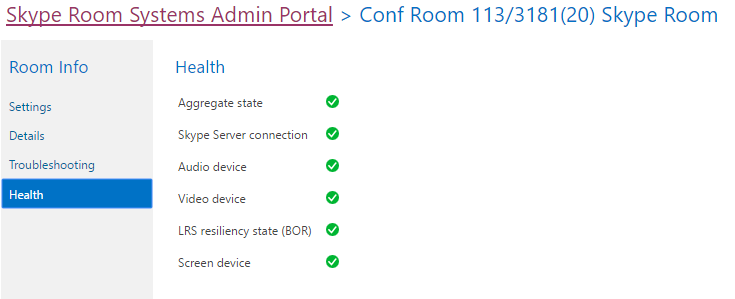

# <a name="deploy-srs-v1-administrative-web-portal-in-skype-for-business-server"></a>ビジネス サーバーの Skype で SRS v1 の管理用の Web ポータルを展開します。

ビジネス サーバー Skype ルーム システム v1 の Skype (SRS v1、Lync ルームのシステムと呼ばれていました) 管理用の Web ポータルは、組織が、Skype ルーム システムの会議室を維持するために使用できる web ポータルです。 管理者は、オーディオ/ビデオ デバイスを監視することによってなど、デバイスの稼働状態を監視するのに SRS v1 を管理する Web ポータルを使用できます。 このポータルでは、管理者はリモートで会議室の稼働状態を監視するための診断情報を収集できます。

この機能を使用するのには SRS v1 を管理する Web ポータルをすべての Skype のビジネス サーバーのフロント エンド サーバーに展開する必要があります。 このガイドでは、管理者向けに SRS 管理 Web ポータルのインストールおよび設定方法について説明します。 Skype のビジネス サーバーの管理のための知識があるユーザーおよびビジネスのサーバー トポロジの Skype を変更するのには管理者権限があるユーザーに管理者のものです。

SRS v1 は、管理用の Web ポータルは、サーバー上に配置は後、管理者は、自分のコンピューターまたはラップトップ コンピューターからサイトにログオンし、ステータス SRS v1 デバイスをチェックすることができます。

> [!IMPORTANT]
> の[Microsoft Skype ルームのビジネス サーバー 2015 の Skype のシステム v1 の管理用の Web ポータル](https://www.microsoft.com/en-us/download/details.aspx?id=46906)をダウンロードします。

このトピックでは、以下について説明します。

- [SRS v1 管理 Web ポータルの環境の構成](room-system-v1-administrative-web-portal.md#Config_Env)

- [SRS v1 管理 Web ポータルのインストール](room-system-v1-administrative-web-portal.md#Install_SRS)

- [SRS 管理 Web ポータルの使用](room-system-v1-administrative-web-portal.md#Use_Portal)

## <a name="configure-your-environment-for-the-srs-v1-administrative-web-portal"></a>SRS v1 管理 Web ポータルの環境の構成
<a name="Config_Env"> </a>

SRS v1 管理 Web ポータルを使用するには、次の前提条件をインストールまたは構成する必要があります。

> [!IMPORTANT]
> サーバーが Kerberos 認証と NTLM 認証の両方で構成されており、SRS がドメインに参加していないコンピューターで実行されている場合、Kerberos 認証は失敗し、管理ポータルで SRS のステータスを見ることはできません。この問題を解決するには、NTLM 認証、または NTLM 認証と TLS-DSK 認証の両方で (Kerberos を使って) サーバーを構成するか、SRS コンピューターをドメインに追加します。

1. ビジネス サーバーの累積的な更新はビジネスのサーバー トポロジの Skype では、Skype をインストールします。

    更新プログラムを取得またはそれに含まれる機能を参照してください、 [Skype ビジネス サーバー 2015 用の更新プログラム](https://support.microsoft.com/en-us/help/3061064/updates-for-skype-for-business-server-2015)を参照してください。

2. SIP 対応の Active Directory ユーザーを作成します。

    SRS v1 の管理用の Web ポータルは、ビジネスのサーバーの Skype から情報を照会するこれらの資格情報を使用します。 ここでの例のユーザー名は LRSApp です。

3. LRSSupportAdminGroup という名前の Active Directory セキュリティ グループを作成します。

    [グループのスコープ] が [グローバル]、[グループの種類] が [セキュリティ] のグループを作成します。このグループに追加される SIP 対応ユーザーは、部屋の一覧を参照したり、ログの収集などの特定のコマンドを実行したりすることができます。

4. LRSFullAccessAdminGroup という名前の Active Directory セキュリティ グループを作成します。

    [グループのスコープ] が [グローバル]、[グループの種類] が [セキュリティ] のグループを作成します。このグループに追加される SIP 対応ユーザーは、単一の Skype ルームで管理ポータルのすべての機能を使用できます。Skype ルームの一括管理のサポートを含める場合は、手順 5 を参照してください。

     

5. LRSPowerUserAdminsGroup という名前の Active Directory セキュリティ グループを作成します。

    [グループのスコープ] が [グローバル]、[グループの種類] が [セキュリティ] のグループを作成します。 このグループに追加されている SIP が有効になっているユーザーが承認すると、Skype ビジネス室の一括管理を含むすべての管理ポータルの機能を使用します。

6. LRSFullAccessAdminGroup は、LRSSupportAdminGroup のメンバーとして追加します。

     

7. LRSSupport という名前の SIP 対応の Active Directory ユーザーを作成します。 このユーザーを LRSSupportAdminGroup に追加します。

     

8. [ASP.NET MVC 4 の Visual Studio 2010 SP1 および Visual Web の開発者 2010 SP1](https://go.microsoft.com/fwlink/p/?LinkId=323967)をインストールします。

## <a name="install-the-srs-v1-administrative-web-portal"></a>SRS v1 管理 Web ポータルのインストール
<a name="Install_SRS"> </a>

の[Microsoft Skype ルームのビジネス サーバー 2015 の Skype のシステム v1 の管理用の Web ポータル](https://www.microsoft.com/en-us/download/details.aspx?id=46906)をダウンロードします。

SRS v1 管理 Web ポータルをインストールするには、次の手順を実行します。

1. ビジネス サーバー管理シェルの Skype で次のコマンドレットを実行することによって、信頼されたアプリケーションのポートを構成します。

   ```
   Set-CsWebServer -Identity POOLFQDN -MeetingRoomAdminPortalInternalListeningPort 4456 -MeetingRoomAdminPortalExternalListeningPort 4457
   ```

2. 会議室ポータルをインストールするには、**MeetingRoomPortalInstaller.msi** をダウンロードして管理者として実行します。

3. Web.config ファイルを次の場所から開きます。

    %Program Files%\Skype for Business Server 2015\Web Components\Meeting Room Portal\Int\Handler\

4. Web.Config ファイルで、PortalUserName を「[SRS v1 を管理する Web ポータル用に環境を構成する](room-system-v1-administrative-web-portal.md#Config_Env)」は (推奨される名前のステップでは、LRSApp)」下にある手順 2 で作成したユーザー名に変更します。

    ```
    <add key="PortalUserName" value="sip:LRSApp@domain.com" />
    ```

5. SRS v1 管理ポータルは信頼済みアプリケーションであるため、ポータルの構成でパスワードを提示する必要はありません。このユーザーがローカル レジストラーとは別のレジストラーを使用している場合、Web.Config ファイルで次の行を追加してレジストラを指定する必要があります。

   ```
   <add key="PortalUserRegistrarFQDN" value="pool-xxxx.domain.com" />
   ```

6. 5061 以外のポートが使用されている場合は、Web.Config ファイルに次の行を追加します。

   ```
   <add key="PortalUserRegistrarPort" value="5061" />
   ```

### <a name="verify-installation-of-the-srs-administrative-web-portal"></a>SRS 管理 Web ポータルのインストールの検証

SRS v1 管理 Web ポータルのインストールを検証するには、次を行います。

1. フロントエンド サーバーで、次の URL を参照します。

    https://\<fe サーバー\>/lrs

    下記の画像のように、エラーが表示されないようにします。

     

2. エラーが表示されない場合は、トポロジ内の他のいずれかのコンピューターから次の URL へのアクセスを試行します。

    https://\<fe サーバー\>/lrs

    ページにアクセスするには、「の[自動クライアント サインインの DNS レコードが必要](https://go.microsoft.com/fwlink/p/?LinkId=318056)です」で説明するように DNS レコードを追加する必要

## <a name="use-the-srs-administrative-web-portal"></a>SRS 管理 Web ポータルの使用
<a name="Use_Portal"> </a>

サーバーで SRS を展開した後、ブラウザーから SRS v1 管理 Web ポータルにサインインして、すべての SRS ルームの状態を確認できます。

### <a name="sign-in"></a>サインイン

1. 次の URL を参照します。

    https://\<fe サーバー\>/lrs

2. LRSSupport アカウントの資格情報、または LRSSupportAdminGroup セキュリティ グループに追加されたアカウントを入力します。


### <a name="srs-administrative-web-portal-summary-page"></a>SRS 管理 Web ポータルの概要ページ

この概要ページには、サーバーで展開されたすべての SRS ルームに関する次の情報が表示されます。

- **タグ**ルームに、管理者が提供するカスタムの名前です。 ルームの名前をクリックすると、ポータルでタグを設定できます。

- **稼働状態**[スペース設定] ページの [チェック] セクションの下に表示されていると、部屋の状態を集計から派生すると、部屋の状態です。

- **次の会議**日付と時刻、次の会議をスケジュールするとします。

- **SRS のバージョン、製造元、モデル**SRS では、これらの値が事前設定されます。 製造元によって、これらのフィールドは空白のままである場合があります。

- **最終更新**Web ページが更新された最終時刻を表示します。


> [!NOTE]
> 一括管理」メニューは、LRSPowerUserAdminsGroup のセキュリティ グループに属している場合のみ表示されます。

### <a name="srs-room-information"></a>SRS ルーム情報

ポータルの [ルーム情報] セクションでは、個々の SRS ルームを表示および構成することができます。これには、[設定]、[詳細]、[ログ記録]、[動作状態] の 4 つのセクションがあります。

#### <a name="settings"></a>設定

[設定] セクションでは、パスワード、ルーム タグ、ルームの既定のボリューム レベルを設定できます。これらの設定を構成すると、SRS コンソールを再起動した後に、変更がレプリケートされます。SRS デバイスのシステム更新設定は、リリース 15.12 以降を使用してのみ表示されます。


#### <a name="details"></a>詳細

[詳細] セクションには、SRS ルームの設定などの読み取り専用で概要が用意されています: 時間の最後の更新です。次の会議です。最後の更新、保守、および調整します。デフォルトのスピーカー、マイク、および呼び出しの設定。バージョンです。SIP URI です。画面および各画面の詳細の数ステータス、および活動。


#### <a name="troubleshooting"></a>トラブルシューティング

[トラブルシューティング] セクションを使用して、ログをリモートで収集し、指定した場所に保存できます。また、SRS コンソール (SRS ユーザー インターフェイス) を再起動したり、システム全体を再起動したりすることもできます。ログを収集するには、フォルダー パスを指定された形式で入力して、そのフォルダーに対して SRS コンピューターのアカウントに与えられた書き込みアクセス許可が設定されていることを確認します。ログ サイズが大きすぎる場合は、ログの収集を完了するのに最大約 5 分かかる可能性があります。ページを更新すると、最新の状態が表示されます。

#### <a name="health"></a>動作状態

チェック] セクションでは、ビジネス サーバー接続、オーディオ デバイス、ビデオ デバイス、弾力性の状態、およびデバイスの画面の Skype の状態をビジュアルに示しますを説明します。



### <a name="additional-notes-about-the-administrative-web-portal"></a>管理 Web ポータルに関する追加の注意事項

> [!NOTE]
>  LRSApp アカウントのパスワードの有効期限が切れた場合、SRS システムは .> を再起動した後にのみ、設定の変更が適用される、2 つの部屋の状態を確認することはできません。 LRSAppuser アカウントのパスワードを構成しないに有効期限が切れた、または web ポータルが設置型展開でのみサポートされている expiration.> 管理は、SRS の近くにあるが、パスワードを更新してください。

### <a name="bulk-management"></a>一括管理 

SRS ルームの一括管理は、高度な IT 管理者向けに設計された機能で、ワークフローを簡素化し、管理者が時間を節約できる便利なツールを利用してリモートで複数のルームを一括方式で管理できるようにします。

この機能を確認するには、ユーザーは特別なセキュリティ グループ **LRSPowerUserAdminsGroup** のメンバーとして配備されている必要があります。

一括管理のために選択できる SRS ルームの数に制限はありません。ただし、同時に実行できる一括管理の操作は 1 つのみです。

一括管理の操作を実行するには、監視するルームを選択してから一括管理メニュー上でクリックします。

### <a name="frequently-asked-questions"></a>よく寄せられる質問

#### <a name="why-cant-i-sign-in-to-the-administrative-web-portal"></a>なぜサインインできない管理用の web ポータルにしますか。

開くとhttps://localhost/lrs、ページで、記号を表示することができますが、ユーザーの資格情報を入力するとサインインできない場合。 この場合、開く必要がありますhttps://FQDNofFEserver/SRS管理用の web ポータルにサインインします。

#### <a name="why-cant-i-see-srs-v1-in-the-administrative-web-portal"></a>管理用の web ポータルでの SRS の v1 が見えないのはなぜですか。

- 展開で SRS アカウントを取得していること、それらのアカウントが 	SRS 管理 Web ポータルの展開の推奨事項に従って作成されていることを確認してください。 ビジネス サーバーの Skype を有効にする CsMeetingRoom を有効にする-csuser からしないを使用して、SRS のアカウントを準備することを確認します。

- SRS のアカウントを作成して管理用の web ポータルでアカウントが表示されない場合ビジネス サーバーのログ収集ツールの選択すると、 **MeetingPortal**コンポーネントを使用して、Skype を使用してサーバーのログを収集し、SRS サポート担当者に送信します。

- SRS アカウントを作成しても、管理 Web ポータルでそのアカウントを確認できない場合は、Fiddler を使用してクライアント ログを収集し、ブラウザー開発ツールからコンソール ログもコピーして、それらのログを SRS サポートの連絡先に送信してください。より詳細なログを取得するために Web.config でトレース レベルの値を変更することもできます。

  ```
  <system.diagnostics>
    <switches>
      <!--
      This switch controls logging message levels. 0 implies
      logging is turned off. 1 implies only errors are logged,
      2 implies errors &amp; warnings. 4 is the most detailed.
      -->
      <add name="TraceLevelSwitch" value="3" />
    </switches>
  </system.diagnostics>
  ```

#### <a name="why-cant-i-see-the-status-of-srs-in-the-administrative-web-portal"></a>管理用の web ポータルでの SRS の状態が見えないのはなぜですか。

- LRSApp ユーザー アカウントが SIP 対応であることを確認してください。

- 場合は問題が発生しても、**そう**ファイルで SRS システムから収集 D:\Tracing\LRSAdminLogs\,し、SRS サポート担当者に送信します。

#### <a name="why-cant-i-see-the-bulk-management-menus-for-srs-in-the-administrative-web-portal"></a>表示されない理由、一括管理メニュー SRS の管理用の web ポータルのでしょうか。

LRSApp ユーザー アカウントは、SIP が有効になってし、LRSPowerUserAdminsGroup のセキュリティ グループの一部である確認します。

#### <a name="does-the-srs-v1-administrative-web-portal-work-with-microsoft-teams-rooms"></a>SRS v1 の管理用の web ポータルは、マイクロソフト チームの会議室で作業しますか。

いいえ。


