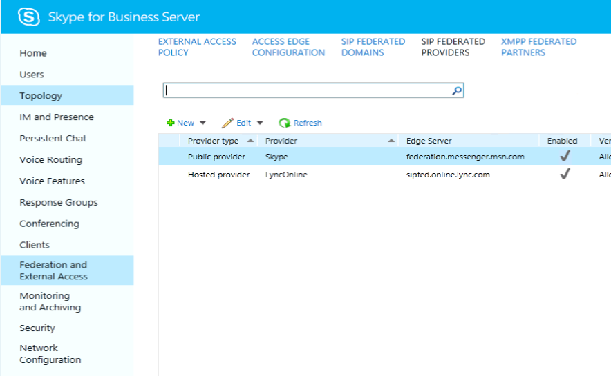

# <a name="deploy-skype-connectivity-in-skype-for-business-server"></a>ネットワークSkype接続を展開Skype for Business Server

**概要:** ユーザーとユーザーを接続Skype for Business ServerするSkypeします。 また、接続のSkype呼び出されます。
  
この記事では、ネットワーク接続の展開Skype説明します。
  
## <a name="skype-connectivity-overview-for-it-professionals"></a>Skypeの接続の概要

Skype接続は、Skype for Businessユーザーを検索して追加する機能をユーザー Skypeします。 Skype接続は、Skype for Businessユーザーとのフェデレーションとディレクトリ検索を有効にできるSkype機能です。 [接続] Skypeを有効Skype for Businessユーザーはユーザーを検索して追加Skypeできます。
  
## <a name="skype-directory-search"></a>Skypeディレクトリ検索

Skype検索機能は、Skype for Businessの連絡先を検索する機能をSkypeします。 検索機能を使用すると、ユーザーは次の情報を使用して検索できます。
  
- **表示名で検索します。例: "John Doe"** - これは多くの結果を返す可能性があります。そのため、探している情報が見当たらされない可能性があります。
    
- **表示名と場所で検索します。たとえば"John Doe in バルセロナ"** - これにより、検索の結果が大幅に絞り込まれる可能性があります。
    
- **電子メールで検索する、"johndoe@outlook.com"** の例 - ほとんどの場合、結果は 1 つ返されます。指定した電子メールと完全に一致するメール。 ただし、同じメールが複数のアカウントに関連付けられている場合は、複数の結果が返される可能性があります。
    
- **電話番号で検索します。たとえば"123-123-1234"** - ほとんどの場合、結果は 1 つ返されます。指定した電話と完全に一致する電話機を指定します。 電話には、国コード (1-xxx-yyy-zzzz) を含める必要があります。 同じ電話番号が複数のアカウントに関連付けられている場合は、複数の結果が返される場合があります。
    
- **[名前Skype検索] の例 "JohnDoe1456"** - 完全一致が見つかった場合は、最初の結果として返されます。 その他の可能性がある "名前" の一致が返される場合があります。
    
    > [!NOTE]
    > Skype ディレクトリ検索は、ポート 443: 104.40.75.246、23.101.135.34、および 40.113.86.19 の IP アドレスと通信できる必要があります。 
  
## <a name="supported-deployment-matrix-for-skype-directory-search"></a>ディレクトリ検索でサポートされる展開Skypeマトリックス

次の表では、ディレクトリ検索のSkype説明します。
  

|&nbsp;|Skype for Business Serverフロントエンド|Lync Server 2013 (または古い) フロントエンド|コメント|
|:-----|:-----|:-----|:-----|
|Skype for Business Server エッジ   |サポート   |サポート対象外   |Skype for Business Serverおよびエッジは、ディレクトリ検索Skype前提条件です   |
|Skype for Business Server + Lync Server 2013 Edge が並べて展開されている   |サポートされている   |サポート対象外   |Skype検索トラフィックは、エッジ サーバー Skype for Business Server流れます。 フェデレーション トラフィックは、管理者が構成したエッジを通過します。 たとえば、管理者は、ディレクトリ検索をサポートしない Lync Server 2013 エッジ サーバーを通じてフェデレーション トラフィックの送信Skype選択できます。   |
|Lync Server 2013 (または古い) Edge   |サポート対象外   |サポート対象外   ||
   
> [!NOTE]
> フロントエンドで実行Skype for Business Serverアドレス帳サービスは、エッジ サーバーに Skype Search ポート 4443 が存在することでエッジを検索します。 
  
> [!NOTE]
> 顧客がオンプレミス展開に複数のサイトを持ち、Skype for Business Server エッジ サーバー/プールを 1 つだけ展開している場合は、すべてのサイトからの検索トラフィックが 1 つの使用可能なエッジ サーバーを通過します。 管理者は、すべてのサイトのプールが展開されたエッジ サーバー/プールにアクセスSkype for Business Serverする必要があります。 
  
> [!NOTE]
> Skypeグラフ サービスは、要求レートが 15 要求/秒を超えた場合、任意のオンプレミスまたは Microsoft 365 または Office 365 顧客からの検索要求を調整します。 
  
> [!NOTE]
> 大規模なエンタープライズオンプレミスのお客様の場合、要求率を高くするには、ドメインを Skype 検索サービスを使用して allowlist に追加する必要があります。
  
> [!NOTE]
> Skype for Business Server保留中の要求が多すぎる場合は、受信要求を調整します。 
  
## <a name="deploying-skype-connectivity-for-skype-for-business-online"></a>オンラインSkype接続の展開Skype for Businessする

Skype Connectivity は、Skype for Businessオンラインの機能で、Microsoft 365とOffice 365。 接続機能は、Skype内の Skype for Business管理センターから有効Microsoft 365 管理センター。
  
Midsize Business Microsoft 365、Office 365 Enterprise、Microsoft 365 Education、Office 365 の場合: Microsoft 365 管理センター にサインインし、Skype for Business管理センター。 [外部通信] に移動します。 [パブリック IM サービス プロバイダー] で、[有効] をクリックします。 接続に対する個々のユーザー アクセスをSkypeする場合は、個々のユーザーの外部通信設定を編集します。
  
[Office 365 Small Business Premium: Office 365 にサインインし、[管理者\>\>サービス] 設定、会議、会議に移動します。 [外部通信] をオンにする。 外部通信スイッチは、接続と通信Skypeを使用する他の組織との通信の両方をオンSkype for Business。
  
オンライン管理の詳細についてはSkype for Businessを参照してください。
  
- [ユーザーが外部の Skype for Business ユーザーに連絡できるようにする](../../SfbOnline/set-up-skype-for-business-online/allow-users-to-contact-external-skype-for-business-users.md)

- [IM を使用して外部連絡先を開く、または外部Skype for BusinessできないSkype試す方法](https://support.office.com/article/What-to-try-if-you-cant-IM-Skype-for-Business-Lync-or-Skype-external-contacts-87f6d5d7-3b8c-4196-9c8c-1dabb75f54b8?ui=en-US&amp;rs=en-US&amp;ad=US)
    
- [連絡先を連絡先に追加Skype for Business](https://support.office.com/article/Add-a-contact-in-Skype-for-Business-89338023-2adf-4f5c-90b6-f8b6f72fadd1)
  
- [管理者: 個々のユーザー Skype for Business設定を構成する](../../SfbOnline/set-up-skype-for-business-online/configure-skype-for-business-settings-for-individual-users.md)
    
## <a name="deploying-skype-connectivity-for-skype-for-business-server"></a>サーバーのSkype接続の展開Skype for Business Server

Skype for Business Serverフェデレーション アクセス アーキテクチャを使用して、フェデレーション アクセス アーキテクチャとの接続Skype。 この接続により、ユーザーはSkype for Business Serverを追加Skype。 Skypeクライアントは、連絡先リストSkype for Businessユーザーを追加できます。 Skype for Business Serverで管理的に設定されたポリシーに基づいて、ユーザーはインスタント メッセージングを使用して通信し、互いにプレゼンスを確認し、音声通話とビデオ通話を開始できます。 Skype接続は Skype for Business Online の機能で、Skype for Business Online のお客様が Skype for Business 管理センターの Microsoft 365 管理センター 内で有効にできます。
  
> [!NOTE]
> パブリック Skype for Business Server メッセージング接続 (PIC) を使用して Windows Messenger に接続するように既に構成されている場合、展開は既にネットワーク接続用Skype構成されています。 考慮する必要がある唯一の変更は、既存の Messenger PIC エントリの名前をユーザー名として変更Skype。 
  
### <a name="the-skype-for-business-server-public-im-connectivity-provisioning-site-is-no-longer-available"></a>パブリック IM Skype for Business Serverプロビジョニング サイトが使用できなくなった場合

Skype for Business オンプレミス展開と Skype 間のフェデレーションを手動でプロビジョニングするために以前使用されたサイトは不要で、2019 年 8 月 15 日にシャットダウンされます。 フェデレーション と Skypeフェデレーション パートナーの検出が利用されます。これは、オンラインとのフェデレーションに必要なのと同Skype for Businessです。

既存のパブリック IM インフラストラクチャを介したオンプレミス Skype for Business 展開と Skype ユーザー間の通信では、オンプレミスのエッジ サーバー構成が Skype for Business Online と互換性を持つ必要があります。

> [!NOTE]
> ほとんどのお客様は、オンラインとフェデレーションするすべての展開を含め、Skype for Businessはありません。
  
ホストするドメインごとにフェデレーション DNS SRV レコードを発行するには、オンプレミス展開が必要です。 ガイダンスは DNS 計画 [で利用できます](../plan-your-deployment/edge-server-deployments/edge-environmental-requirements.md#dns-planning)。 各ドメインは、DNS SRV クエリによって、ドメインの上位レベルの接尾辞の一致を満たすエッジ サーバー FQDN に解決する必要があります。 たとえば、ドメイン "contoso.com" を考え出します。

|**有効な FQDN**|**コメント**|
|:-----|:-----|
|sip.contoso.com   ||
|sipfed.contoso.com   |いずれの場合も、エッジ サーバーにインストールされている外部証明書の SN または SAN に正確な FQDN が存在する必要があります。   |
|access.contoso.com   ||
|**無効な FQDN**|**理由**|
|sip.contoso-edge.com   |接尾辞の一致ではありません。  |
|sip.it.contoso.com   |トップ レベルの接尾辞の一致ではありません。   |

外部証明書に関する詳細なガイダンスについては、「証明書の計画」 [を参照してください](../plan-your-deployment/edge-server-deployments/edge-environmental-requirements.md#certificate-planning)。

#### <a name="faqs"></a>FAQ

**プロビジョニング Web サイトがシャットダウンされる理由**
2006 年に展開されたパブリック IM (PIC) プロビジョニング メカニズム (pic.lync.com) はサービスを提供できなくなったので、2019 年 8 月 15 日にシャットダウンされます。 代わりに、パブリック IM フェデレーションは、Skype for Business Online で使用されるのと同じフェデレーション モデル ("パートナー検出" と呼ばれる) を前提とします。この場合、オンプレミス展開はフェデレーション DNS SRV レコードによって一般に検出できます。

**この変更は、パブリック IM フェデレーションが廃止されるという意味ですか?**
いいえ。 パブリック IM フェデレーションは、おそらくオンプレミス製品がSkype for Businessまで、何年もサポートされ続けます。

**弊社は、オンラインとハイブリッド関係 (共有アドレス空間) をSkype for Business影響を受けるか?**
いいえ、オンラインで既にフェデレーションを行Skype for Business、この変更は影響を受け取らなくなっています。
 
**この変更は、会社がオンラインとフェデレーションを有効にする必要Skype for Businessですか?**
いいえ。 エッジ サーバープロキシ設定で Skype for Business Online ホスティング プロバイダー (sipfed.online.lync.com) とのフェデレーションを有効にしない場合、この変更は影響しません。 ただし、Skype for Business Online とのフェデレーションに適用されるのと同じ DNS 要件と証明書要件は、Skype ユーザーとのフェデレーションにも適用されます。
 
**当社は大規模で、規制/コンプライアンス/その他の理由によりエッジ構成を変更できません。.何ができますか?**
指定したエッジ サーバー構成を変更できないオンプレミス組織は、できるだけ早く製品サポートに連絡する必要があります。

### <a name="enabling-federation-and-public-im-connectivity-pic"></a>フェデレーションとパブリック IM 接続の有効化 (PIC)

次に、接続Skype for Business Server構成に必要な環境と管理タスクSkypeします。 このセクションでは、管理者がエッジ サーバーとも呼ばれるSkype for Business Server、構成された外部アクセスを展開したと仮定します。 
  
フェデレーションと PIC を有効にするには、3 つの主要な手順が必要です。 それらを次に示します。
  
1. フェデレーションと PIC の構成
    
2. フェデレーション ユーザー アクセスをサポートするポリシーを少なくとも 1 つ構成する
    
3. PIC プロバイダー Skype構成する
    
#### <a name="1-configure-federation-and-pic"></a>1. フェデレーションと PIC の構成

フェデレーションは、ユーザーが組織内Skypeユーザーと通信Skype for Business必要です。 パブリック インスタント メッセージング接続 (PIC) はフェデレーションのクラスであり、Skype for Business ユーザーがユーザーと通信Skype必要があります。 フェデレーションと PIC は、次のコントロール パネルを使用Skype for Business Server構成されます。
  
> [!NOTE]
> PIC フェデレーションは、Lync Server 2010 より前の製品リリース (Live Communication Server、Office通信サーバー) でサポートされなくなりました。 PIC フェデレーションでサポートされているプラットフォームには、Skype for Business Server Lync Server 2013、Lync Server 2010 が含まれます。 
  
フェデレーションは、ユーザーが組織内Skypeユーザーと通信Skype for Business必要です。 パブリック インスタント メッセージング接続 (PIC) はフェデレーションのクラスであり、Skype for Business Server ユーザーがユーザーと通信Skype必要があります。 フェデレーションと PIC は、図に示すように、Skype for Business Serverコントロール パネルの [エッジ構成] ダイアログを使用して構成されます。
  

  
> [!NOTE]
> 検索が機能するには、EnableSkypeIdRouting 属性と EnableSkypeDirectorySearch 属性をパブリック プロバイダー設定 (後の手順を参照) で true に設定する必要があります。 
  
これにより、サーバーで実行する必要がある管理タスクが完了します。 これで、接続用にSkypeされます。
  
#### <a name="2-configure-at-least-one-policy-to-support-federated-user-access"></a>2. フェデレーション ユーザー アクセスをサポートするポリシーを少なくとも 1 つ構成する

管理者は Skype for Business Server コントロール パネルを使用して、1 つ以上の外部ユーザー アクセス ポリシーを構成して、Skype ユーザーが内部ユーザーと共同作業できるかどうかをSkype for Business Serverがあります。
  
#### <a name="3-configure-the-skype-pic-provider-setting"></a>3. PIC プロバイダー Skype構成する

管理者は、Skype for Business Server管理シェルを使用して、追加の PIC プロバイダーとしてSkype for Businessクライアント ポリシー Skype構成する必要があります。 
  
> [!NOTE]
> パブリック インスタント メッセージング接続 (PIC) サービス プロバイダーのユーザーは、パブリック IM 接続をサポートするために少なくとも 1 つのポリシー (この手順の前の手順 2) も構成するまで、組織内の IM または会議に参加できません。 
  
新しいインストールでは、図に示Skype Skype コントロール パネルを使用して Skype パブリック プロバイダーを有効にすることで、Skype for Business Server Connectivity を構成できます。
  

  
> [!NOTE]
> サーバーにアップグレードSkype接続を構成するにはSkype for Business Server既存のパブリック プロバイダーを削除してSkypeする必要があります。 
  
接続Skype構成するには、PowerShell のみを使用します。 PowerShell をSkype接続を構成するには、次の手順を実行します。
  
1. フロントエンド サーバー Skype for Business Server、管理シェルSkype for Business Server開きます。
    
2. 次の 2 つのコマンドを実行します。
    
   ```powershell
    Remove-CsPublicProvider -Identity <identity-name>
   ```

    > [!NOTE]
    > 環境に PIC プロバイダーが既に存在しない場合、新しい PIC プロバイダーを作成している場合は、このコマンドレットを実行Remove-CsPublicProvider必要があります。 
  
   ```powershell
   New-CsPublicProvider -Identity Skype -ProxyFqdn federation.messenger.msn.com -IconUrl https://images.edge.messenger.live.com/Messenger_16x16.png -NameDecorationRoutingDomain msn.com -NameDecorationExcludedDomainList "msn.com,outlook.com,live.com,hotmail.com" -Enabled $true -EnableSkypeIdRouting $true -EnableSkypeDirectorySearch $true
   ```

    あまり明白ではないパラメーターは何をしますか?
    
   - ProxyFqdn: フェデレーション Skypeの場所 (Microsoft が所有/管理)
    
   - IconURL: Lync &amp; Skype for Businessが連絡先を視覚的に識別Skypeアイコン
    
   - NameDecorationRoutingDomain と NameDecorationExcludedDomainList: これらを設定すると、ユーザーは "msn.com" で Microsoft 以外のドメインを "装飾" する必要なく、Skype ユーザーの MSA を入力できます。 これにより、ExcludedDomainList に含 user(contoso.com)@msn.com ドメインの "user(contoso.com)@msn.com" と入力する必要が無くなっています。 ドメインが除外リストに含めされていない場合、SfB クライアントは自動的に MSA の書式を設定します。 除外リストに最も一般的な Microsoft アカウント ドメインが追加されました。
    
     > [!NOTE]
     > 変更が行われた場合は、パブリック プロバイダーを削除して新しく追加する必要があります。 インプレイス変更は許可されません。 
  
     > [!NOTE]
     > Office 2013 SP1 の Lync Server 2013 CU5 &amp; Lync デスクトップ クライアントに追加された NameDecorationRoutingDomain と NameDecorationExcludedDomainList は、Lync ユーザーが microsoft 以外のドメインを識別して Skype にルーティングするために必要な Skype 連絡先を追加する状況を改善します (user(contoso.com)@msn.com の形式)。 NameDecorationExcludedDomainList (現在、msn.com、live.com、Hotmail.com、outlook.com) のドメインが含まれている場合、これらの新しい設定では、NameDecorationRoutingDomain (msn.com に設定する必要があります) を含む [Skype 連絡先の追加] ダイアログ ボックスで、アドレス ユーザーの入力を自動的に書式設定できます。 
  
3. クライアント ユーザー Skype for Businessユーザーは、ユーザーを検索して追加Skypeできます。
    
## <a name="clients-and-interoperability-matrix"></a>クライアントと相互運用性マトリックス

次の表に、最新バージョンのコンシューマーと最新バージョンのSkype間の相互運用Skype for Business。
  

|Skype クライアント|連絡先、IM、プレゼンス、オーディオ、ビデオ通話を追加する|Comment|
|:-----|:-----|:-----|
|Skype Windows デスクトップ   |7.6 以上、WINDOWS以上   |**NEW**: Windows XP および Windows Vista で実行されている Windows Skype クライアントのサポートが追加されました (最新のクライアント バージョン **7.26 以降が必要)**  |
|Skypeモバイル - Android 電話タブレット   |6.19 以上、Android OS バージョン 4.0.3 以上を実行している   |低スペックデバイスがビデオ通話をサポートしていない可能性があります   |
|Skype モバイル - iOS   |IOS 7 以上で 6.11 以上   |サポートされていないのは、iPhone 4 以前の iPod 第 4 世代以前の第 1 世代iPadバージョンです。   |
|Skype Mac   |Mac OS X 10.9 (Mavericks) 以上の 7.19 以上   |Mac OSX 10.9 以上が必要   |
|Skype ユニバーサル Windows アプリ (Windows 10) デスクトップとモバイル   |Windows 10 (Redstone 1 の更新以降)   |Windowsユニバーサル アプリは、相互運用機能のサポートを追加する 2016 年秋に更新プログラムを受け取る   |
   
次の表に、最新バージョンの Skype for Business コンシューマーと最新バージョンの相互運用Skype示します。 
  
|Client|Skype検索と連絡先の追加|Skype/V、IM 相互運用|
|:-----|:-----|:-----|
|Skype for Business   |はい   |はい   |
|Mac 版 Skype for Business   |追加可能 (検索なし)   |はい   |
|Lync Desktop 2013   |追加可能 (検索なし)   |はい   |
|Lync Web App - オンラインおよびオンプレミス   |該当なし   |該当なし   |
|Lync Mobile - Windows Phone   |近日公開   |はい   |
|Lync Mobile - Android   |近日公開   |はい   |
|Lync Mobile - iOS   |近日公開   |はい   |
|Lync Room System   |近日公開   |はい   |
|Lync モダン アプリ (Win 8.1)   |はい   |はい   |
|Lync Mac 2011   |追加可能 (検索なし)   |はい   |
|Lync Desktop 2010   |追加可能 (検索なし)   |はい   |
|Lync Phone Edition   |該当なし   |該当なし   |
|Lync Attendant   |該当なし   |N/A   |
   
