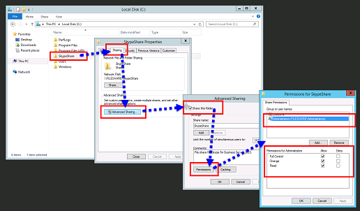

# ファイル共有を作成するSkype for Business Server
 
**概要:** サーバー のインストールの一Windowsサーバー ファイル共有を作成する方法についてSkype for Business Server。 以下の Microsoft 評価センター Skype for Business Server無料試用版をダウンロードします [https://www.microsoft.com/evalcenter/evaluate-skype-for-business-server](https://www.microsoft.com/evalcenter/evaluate-skype-for-business-server) 。
  
Skype for Business Serverトポロジ全体のコンピューターがファイルを交換できるよう、ファイル共有が必要になります。 ファイル共有の作成は、ファイル共有のインストール プロセスの手順 2 / 8 Skype for Business Server。 手順 1 ~ 5 は、任意の順序で実行できます。 ただし、手順 6、7、および 8 を順番に実行し、図に示す手順 1 ~ 5 の後に実行する必要があります。 ファイル共有の計画の詳細については、「環境要件 for [Skype for Business Server](../../plan-your-deployment/requirements-for-your-environment/environmental-requirements.md) [2019」](../../../SfBServer2019/plan/system-requirements.md)または「サーバー Skype for Business Server参照してください。
  

  
## 基本的なファイル共有を作成する

このセクションでは、サーバー ファイル共有の基本的なWindowsについて説明します。 サーバー ファイルWindows共有の基本機能は、サーバー ファイル共有Skype for Business Server。 ただし、高可用性を明示的に提供するわけではありません。 高可用性環境では、分散ファイル システム (DFS) ファイル共有をお勧めします。 高可用性ファイル共有と DFS の詳細については、「Plan [for high availability and disaster recovery in](../../plan-your-deployment/high-availability-and-disaster-recovery/high-availability-and-disaster-recovery.md)Skype for Business Server」 を参照してください。
  
> [!NOTE]
> Windows Server 2012R2 は、Storage サーバー プラットフォームを使用して、エリア ネットワーク (SAN) のようなファイル共有Windowsしました。 従来の SAN ベースのアプライアンスと比較すると、Windows Server 2012 R2 ストレージ ソリューションは、パフォーマンスへの影響を最小限に抑え、コストを半分に削減できます。 R2 のファイル共有オプションの詳細Windows Server 2012、ダウンロード可能なホワイト ペーパー [「R2 Windows Server 2012」をStorage。](https://download.microsoft.com/download/9/4/A/94A15682-02D6-47AD-B209-79D6E2758A24/Windows_Server_2012_R2_Storage_White_Paper.pdf) 
  
ファイル共有を作成するためのビデオ **の手順をご覧ください**。
  
> [!video https://www.microsoft.com/videoplayer/embed/dbef31be-e899-4a32-a1ca-370053284f56?autoplay=false]
  
### 基本的なファイル共有を作成する

1. ファイル共有をホストするコンピューターにログオンします。
    
2. 共有するフォルダーを右クリックし、[プロパティ] を **選択します**。
    
3. [共有] **タブを選択** し、[高度な共有 **] をクリックします**。
    
4. [この **フォルダーを共有する] をクリックします**。
    
5. **[アクセス許可]** をクリックします。
    
6. ファイル共有を **ホストするサーバー** のローカル Administrators グループを追加し、[許可 **:** フル コントロール]、[変更]、および [読み取り] 権限を付与し **、[OK] をクリックします**。
    
7. もう一 **度 [OK]** をクリックし、ネットワーク パスをメモします。
    
8. [完了 **] を** クリックしてウィザードを閉じます。
    
     
  
> [!NOTE]
>ファイル ストアが DFS 共有でホストされている場合、次の警告が表示されます。

警告: "" に対する共有アクセス許可にアクセス \\ <domain> \<share> できません。

>これは、ファイル サーバーの管理者ではない場合、またはこれが分散ファイル システム (DFS) 共有の場合に必要です。 共有アクセス許可が既に構成されている場合、この警告は無視できます。 新しい共有の場合は、手動で共有アクセス許可を構成する方法の詳細については、ドキュメントを参照してください。

>DFS 共有の共有アクセス許可にアクセスできないので、Skype for Business Serverファイル共有にグループを明示的に設定することはできません。 Skype for Business Server コンポーネントが適切なアクセス許可を持つファイル共有にアクセスするには、フル コントロール共有アクセス許可を持つローカル管理者に加えて、次の RTC グループに読み取りおよび変更レベルの共有アクセス許可が追加されます。
* RTCHSUniversalServices
* RTCComponentUniversalServices
* RTCUniversalServerAdmins
