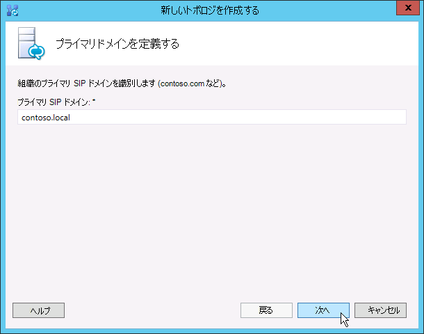
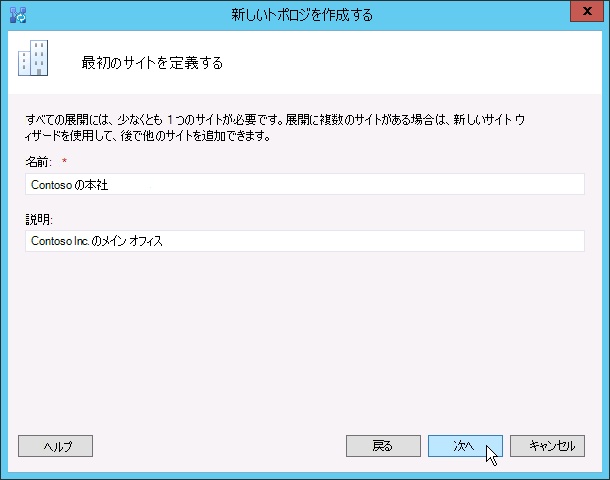
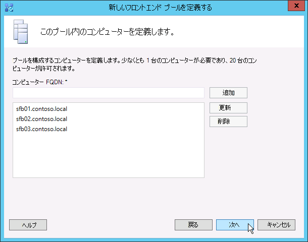

# 作成し、Skype のビジネス サーバーの新しいトポロジを公開Create and publish new topology in Skype for Business Server
 
**の概要:** 作成、発行、およびビジネスのサーバーの Skype をインストールする前に、新しいトポロジを確認する方法について説明します。**Summary:** Learn how to create, publish, and verify a new topology before you install Skype for Business Server. ビジネスのサーバーで Microsoft の評価の中心からの Skype の無料試用版をダウンロード: [https://www.microsoft.com/evalcenter/evaluate-skype-for-business-server](https://www.microsoft.com/evalcenter/evaluate-skype-for-business-server)。Download a free trial of Skype for Business Server from the Microsoft Evaluation center at: [https://www.microsoft.com/evalcenter/evaluate-skype-for-business-server](https://www.microsoft.com/evalcenter/evaluate-skype-for-business-server).
  
ビジネス サーバー システムに Skype をインストールするにはトポロジ内のサーバーごとに、前に、トポロジを作成し、発行する必要があります。Before you can install the Skype for Business Server system on each of the servers in the topology, you must create a topology and publish it. トポロジを公開するときは、トポロジの情報を中央管理ストア データベースに読み込みます。When you publish a topology, you are loading the topology information into the Central Management Store database. Enterprise Edition プールの場合は、新しいトポロジを初めて公開するときに中央管理ストア データベースを作成することになります。If this is an Enterprise Edition pool, you are creating the Central Management Store database the first time you publish a new topology. Standard Edition の場合は、トポロジを公開する前に、展開ウィザードの最初の Standard Edition Server の準備プロセスを実行する必要があります。If this is Standard Edition, you will need to run the Prepare First Standard Edition Server process from the Deployment Wizard before you publish a topology. この操作を行うと、SQL Server Express Edition インスタンスのインストールと中央管理ストアの作成が行われ、Standard Edition が準備されます。This prepares for Standard Edition by installing a SQL Server Express Edition instance and creating the Central Management Store. 手順 1 ～ 5 は任意の順序で実行できます。You can do steps 1 through 5 in any order. ただし、手順 6、7、8 は、図に説明されているように手順 1 ～ 5 の後で順番どおりに行う必要があります。However, you must do steps 6, 7, and 8 in order, and after steps 1 through 5, as outlined in the diagram. 8 の手順 6 で作成し、新しいトポロジを公開する方法を説明します。How to create and publish a new topology is described in step 6 of 8.
  

  
## 新しいトポロジの作成および公開Create and publish new topology

Skype ビジネス サーバー トポロジ ビルダーを使用して、デザイン、定義、構成、およびトポロジを公開できます。You can use Skype for Business Server Topology Builder to design, define, configure, and publish topologies. このツールは、この記事で既に説明した管理ツールのインストール時にインストールされています。This tool was installed when you installed Administrative Tools earlier in the article. トポロジの作成には、さまざまな選択肢があります。There are many different choices you can make when you create a topology. この手順では、会議機能を使用する基本的なトポロジを作成します。In this procedure, you will create a basic topology with conferencing.
  
> [!IMPORTANT]
> Skype ビジネス サーバーのでは、SQL Server が動作するために必要です。Skype for Business Server requires SQL Server in order to operate. プライマリ データベースは中央管理ストアと呼ばれます。The primary databases are known as the Central Management Store. 展開しているのが Enterprise Edition の場合、データベースは以下の手順でトポロジを公開するときに作成されます。If you are deploying Enterprise Edition, these databases are created when you publish the topology by using the steps below. その場合、トポロジ ビルダーから SQL Server インストールへの接続情報を求められます。In this case, Topology Builder will ask you for the connection information to a SQL Server installation. Standard Edition を展開する予定の場合は、新しいトポロジを定義して公開する前に SQL Server Express Edition をインストールする必要があります。If you are planning to deploy Standard Edition, you will need to install SQL Server Express Edition before you define and publish the new topology. SQL Server Express Edition をインストールするには、フロントエンドとして機能することになるサーバー上で展開ウィザードを開いてから、[最初の Standard Edition サーバーの準備] を実行する必要があります。To install SQL Server Express Edition, you should open the Deployment Wizard on the server that will act as the Front End, and then run Prepare First Standard Edition Server. [最初の Standard Edition サーバーの準備] をクリックすると、展開ウィザードによって自動的に SQL Server Express Edition がインストールされ、中央管理ストア データベースが作成されます。When you click Prepare First Standard Edition Server, the Deployment Wizard automatically installs SQL Server Express Edition and creates the Central Management Store databases. 
  
### 新しいトポロジを作成するCreate a new topology

1. トポロジ ビルダーにアクセスできる標準ユーザーとしてログインします。Log in as a standard user with access to Topology Builder.
    
2. Skype をビジネス サーバー トポロジ ビルダーを開きます。Open Skype for Business Server Topology Builder.
    
3. [**新しいトポロジ**] を選択し、[**OK**] をクリックします。Select **New Topology**, and click **OK**..
    
4. トポロジ構成ファイルの場所とファイル名を選択します。Select a location and file name for the topology configuration file.
    
    > [!NOTE]
    > トポロジ構成は、トポロジ ビルダー XML (.tbxml) ファイルとして保存されます。トポロジを公開するときは、構成情報をファイルから SQL Server データベースにプッシュします。次回以降トポロジ ビルダーを開くときは、既存の構成を SQL Server からトポロジ ビルダーに直接ダウンロードして、SQL Server に公開するか、トポロジ ビルダー構成ファイルとして保存できます。The topology configuration is saved as a Topology Builder XML (.tbxml) file. When you publish a topology, you are pushing the configuration information from the file to the SQL Server database. When you open Topology Builder in the future, you can download the existing configuration from SQL Server directly into Topology Builder and either publish it back to SQL Server or save it as a Topology Builder configuration file. 
  
5. [**プライマリ ドメインの定義**] 画面で、**プライマリ SIP ドメイン**を入力し、[**次へ**] をクリックします。この例では、図に示すように、**contoso.local** を使用しています。On the **Define the primary domain screen**, enter the **primary SIP domain**, and click **Next**. In this example, we are using **contoso.local**, as shown in the figure.
    
     
  
6. サポートされている SIP ドメインが他にもあれば追加し、[**次へ**] をクリックします。Add any additional supported SIP domains, and then click **Next**.
    
7. 図に示すように、最初のサイト (場所) の [**名前**] と [**説明**] を入力し、[**次へ**] をクリックします。Enter a **Name** and **Description** for the first site (location), and then click **Next**, as shown in the figure.
    
     
  
8. サイトの [**市区町村**]、[**都道府県**]、[**国/地域コード**] を入力し、[**次へ**] をクリックします。Enter the **City**, **State/Province**, and **Country/Region Code** for the site, and then click **Next**.
    
9. [**完了**] をクリックして、新しいトポロジの定義プロセスを完了します。新しいフロントエンド ウィザードが自動的に起動されます。Click **Finish** to complete the process of defining a new topology. The New Front End Wizard launches automatically.
    
### フロントエンド プールまたは Standard Edition サーバーを定義するDefine a Front End pool or Standard Edition server

1. ウィザードの前提条件を確認し、[**次へ**] をクリックします。Review the wizard prerequisites, and then click **Next**.
    
2. 図に示すように、プールの完全修飾ドメイン名 (FQDN) を入力し、[**Enterprise Edition フロントエンド プール**] または [**Standard Edition サーバー**] のいずれかを選択して、[**次へ**] をクリックします。Enter the fully qualified domain name (FQDN) of the pool, and select either **Enterprise Edition Front End Pool** or **Standard Edition Server**, and then click **Next**, as shown in the figure.
    
    > [!TIP]
    > ビジネス Server Enterprise Edition の Skype では、連携して、フロント エンドの役割を提供する複数のサーバーを含めることができます。Skype for Business Server Enterprise Edition can include multiple servers working together to provide the Front End role. この役割を果たすために複数のサーバーを使用することを、プールと呼びます。When multiple servers are used to fulfill the role, it is called a pool. そのため、フロントエンドの役割を提供するために連携する複数のサーバーも、フロントエンド プールと呼ばれます。Thus, multiple servers working together to provide the Front End role is also referred to as the Front End pool. ビジネス サーバーの標準エディションの Skype では、フロント エンドの役割を提供する 1 台のサーバーのみを含めることができます。Skype for Business Server Standard Edition can include only a single server to provide the Front End role. この役割を提供するサーバーが 1 台のみの場合でも、一般的にフロントエンド プールと呼ばれます。It is common to refer to the Front End pool even if only a single server is providing the role. 
  
     
  
3. 図に示すように、プール内のすべてのコンピューターの完全修飾ドメイン名 (FQDN) を入力し、[**次へ**] をクリックします。Enter the fully qualified domain names (FQDNs) of all computers in the pool, and then click **Next** as shown in the figure.
    
     
  
4. 図に示すように、このトポロジに含める機能を選択し、[**次へ**] をクリックします。Select the features that will be included in this topology, and then click **Next** as shown in the figure.
    
    > [!NOTE]
    > Skype ビジネス サーバー用には、多くの高度な機能が含まれています。Skype for Business Server includes many advanced features. 使用する特定の機能については、「計画」と「展開」のドキュメントを確認してください。Review planning and deployment documentation for each specific feature you want to use. 
  
     
  
5. **ロールの配置されているサーバーの選択]** ページで、フロント エンド サーバーでは、仲介サーバーに集約することができます。 またはスタンドアロン サーバーとして展開することもできます。On the **Select collocated server roles** page, you can choose to collocate the Mediation server on the Front End server, or you can choose to deploy it as a standalone server.
    
    仲介サーバーを Enterprise Edition フロントエンド プール上で併置する場合は、このチェック ボックスがオンになっていることを確認します。If you intend to collocate the Mediation server on the Enterprise Edition Front End pool, ensure the check box is selected. サーバーの役割はプール サーバーに展開されます。The server role will be deployed on the pool servers. 仲介サーバーをスタンドアロン サーバーとして展開する場合は、該当するチェック ボックスをオフにします。If you intend to deploy the Mediation server as a stand-alone server, clear the appropriate check box. フロント エンド サーバーを完全に展開した後、別の配置の手順で、仲介サーバーを配置します。You will deploy the Mediation server in a separate deployment step after you completely deploy the Front End server. コロケーションについての詳細を計画するため、 [Skype のビジネス サーバーのトポロジの基礎](../../plan-your-deployment/topology-basics/topology-basics.md)を参照してください。For planning details about a collocation, see [Topology Basics for Skype for Business Server](../../plan-your-deployment/topology-basics/topology-basics.md).
    
6. [**サーバーの役割とこのフロントエンド プールとの関連付け**] ページでは、サーバーの役割を定義し、フロントエンド プールと関連付けることができます。次の役割を使用できます。By using the **Associate server roles with this Front End pool** page, you can define and associate server roles with the Front End pool. The following role is available:
    
    **エッジ プールを有効にします。** 定義し、1 つのエッジ サーバーまたはエッジ サーバーのプールを関連付けます。**Enable an Edge pool** Defines and associates a single Edge Server or a pool of Edge Servers. エッジ サーバーを使用すると、組織内のユーザーと組織外のユーザー (フェデレーション ユーザーなど) との間の通信および共同作業が容易になります。An Edge Server facilitates communication and collaboration between users inside the organization and people outside the organization, including federated users.
    
    サーバーの役割の展開と関連付けについては、次の 2 つのシナリオが考えられます。There are two possible scenarios that you can use to deploy and associate the server roles.
    
    シナリオ 1 では、新しいインストールで新しいトポロジを定義します。次の 2 つのどちらかのアプローチでインストールできます。For scenario one, you are defining a new topology for a new installation. You can approach the installation in one of the two following ways:
    
   - チェック ボックスをオフのままにして、トポロジを定義します。フロントエンド サーバーとバックエンド サーバーの各役割の公開、構成、およびテストを行った後、もう一度トポロジ ビルダーを実行して、各役割のサーバーをトポロジに追加できます。この戦略を使用することにより、追加の役割による複雑化を招くことなく、フロントエンド プールと、SQL Server を実行しているサーバーをテストできます。最初のテストが完了したら、トポロジ ビルダーを再び実行して、展開が必要な役割を選択できます。Leave the check box clear, and define the topology. After you have published, configured, and tested the Front End and Back End Server roles, you can run Topology Builder again to add the role servers to the topology. By using this strategy, you can test the Front End pool and the server running SQL Server without additional complications from additional roles. After you have completed your initial testing, you can run Topology Builder again to select the roles you need to deploy.
    
   - インストールする必要がある役割を選択し、選択した役割に対応するハードウェアをセットアップします。Select roles that you need to install, and then set up the hardware to accommodate the selected roles.
    
    シナリオ 2 は既存の展開があり、インフラストラクチャが新しい役割に対応できる状態になっているか、既存の役割を新しいフロントエンド サーバーに関連付ける必要がある場合です。For scenario two, you have an existing deployment, and your infrastructure is ready for new roles, or you need to associate existing roles with a new Front End server.
    
   - この場合、展開する役割、または新しいフロントエンド サーバーに関連付ける役割を選択します。どちらの場合も、役割の定義を続行して必要なハードウェアを設定し、インストールを進めます。In this case, you will select the roles that you intend to deploy or associate with the new Front End server. In either case, you will proceed with the definition of the roles, set up any needed hardware, and proceed with the installation.
    
7. 次に、トポロジで使用する SQL Server ストアを定義します。Next, you will define the SQL Server store that will be used with the topology. この例では、[既定のインスタンス] を使用します。In this example, we use the Default instance. 高可用性は、SQL Server の機能の詳細については、「[高可用性とビジネスのサーバー用の Skype での災害復旧の計画](../../plan-your-deployment/high-availability-and-disaster-recovery/high-availability-and-disaster-recovery.md)」を参照してください。For more information about SQL Server features, such as High Availability, see [Plan for high availability and disaster recovery in Skype for Business Server](../../plan-your-deployment/high-availability-and-disaster-recovery/high-availability-and-disaster-recovery.md).
    
   - トポロジで既に定義されている既存の SQL Server ストアを使用するには、[**SQL ストア**] でインスタンスを選択します。To use an existing SQL Server store that has already been defined in your topology, select an instance from **SQL store**.
    
   - プールの情報を格納する新しい SQL Server のインスタンスを定義するに [**新規**作成] をクリックし、[**新しい SQL ストアの定義**] ダイアログ ボックスで**SQL Server の FQDN**を指定します。To define a new SQL Server instance to store pool information, click **New**, and then specify the **SQL Server FQDN** in the **Define New SQL Store** dialog box.
    
   - SQL Server インスタンスの名前を指定するには、[**名前付きインスタンス**] を選択し、インスタンスの名前を指定します。To specify the name of a SQL Server instance, select **Named Instance**, and then specify the name of the instance.
    
   - 既定のインスタンスを使用するには、[**既定のインスタンス**] をクリックします。To use the default instance, click **Default instance**.
    
   - SQL ミラーリングを使用するには、[**SQL ミラーリングを有効にする**] を選択し、既存のインスタンスを選択するか、新しいインスタンスを作成します。To use SQL Mirroring, select **Enable SQL mirroring**, and select an existing instance, or create a new instance.

    > [!NOTE]
    > SQL ミラーリング ビジネス サーバー 2015 の Skype で利用できるが、ビジネス サーバー 2019 の Skype でサポートされていません。SQL Mirroring is available in Skype for Business Server 2015 but is no longer supported in Skype for Business Server 2019. AlwaysOn 可用性グループ、AlwaysOn フェールオーバー クラスター インスタンス (FCI)、および SQL フェールオーバー クラスタ リング手法は、ビジネス サーバー 2019 の Skype で優先します。The  AlwaysOn Availability Groups, AlwaysOn Failover Cluster Instances (FCI), and SQL failover clustering methods are preferred with Skype for Business Server 2019.
    
    この例では、図に示すように、[**SQL Server FQDN**] に入力し、関連するすべての高可用性設定を構成して、[**OK**] をクリックします。For this example, we enter the **SQL Server FQDN**, and configure any relevant high availability settings, and then click **OK**, as shown in the figure.
    
     
  
8. SQL Server ストアのミラーリングや SQL Server ミラーリング監視を有効にするかどうかを指定し、[**次へ**] をクリックします。Decide if you want to enable SQL Server store mirroring or SQL Server mirroring witness, and then click **Next**.
    
9. 使用するファイル共有を定義します。Define the file share that you want to use.
    
   - トポロジで既に定義されているファイル共有を使用するには、[**以前に定義したファイル共有を使用する**] を選択します。To use a file share that has already been defined in your topology, select **Use a previously defined file share**.
    
   - 新しいファイル共有を定義するには、[**新しいファイル共有の定義**] を選択し、[**ファイル サーバー FQDN**] ボックスで、ファイル共有が存在する既存のファイル サーバーの FQDN を入力します。そして、[**ファイル共有**] ボックスでファイル共有の名前を入力します。To define a new file share, select **Define a new file share**, in the **File Server FQDN** box, enter the FQDN of the existing file server where the file share is to reside, and then enter a name for the file share in the **File Share** box.
    
    この例では、[**新しいファイル ストアを定義する**] をクリックし、**ファイル サーバー FQDN** と**ファイル共有**を入力して、[**次へ**] をクリックします。For this example, we will click **Define a new file store**, enter the **file server FQDN** and **file share**, and then click **Next**.
    
    > [!NOTE]
    > Skype ビジネス サーバー用のファイル共有を共存させることができますが、パフォーマンス上の理由からお勧めできません。The file share for Skype for Business Server can be collocated but it is not recommended for performance reasons. この例では、ファイル共有として機能する単一の専用サーバー上にファイル共有が配置されています。Note that in this example, the file share has been located on a single dedicated server that will act as the file share. ただし、Windows Server 2012 R2 を使用する DFS など、より堅牢な他のファイル共有システムの使用をお勧めします。However, other more robust file share systems, such as DFS using Windows Server 2012 R2, are recommended. 詳細については、サポートされているファイル共有システムは、[ビジネス環境に、Skype の要件](../../plan-your-deployment/requirements-for-your-environment/requirements-for-your-environment.md)を参照してください。For details about supported file share systems, see [Requirements for your Skype for Business environment](../../plan-your-deployment/requirements-for-your-environment/requirements-for-your-environment.md). ファイル共有を作成する方法の詳細については、 [Skype のビジネス サーバーでファイル共有を作成](create-a-file-share.md)を参照してください。For more information about creating the file share, see [Create a file share in Skype for Business Server](create-a-file-share.md). ファイル共有をまだ作成していなくても、ファイル共有を定義できます。You can define the file share without the file share having been created. その場合は、トポロジを公開する前に、定義した場所にファイル共有を作成する必要があります。You will need to create the file share in the location you define before you publish the topology. 
  
10. [Web サービス URL の指定] ページで、内部 Web サービス プール ベース URL の上書きが必要かどうかを指定する必要があります。On the Specify the Web Services URL page, you must decide if you need to override the internal Web Services pool base URL. この上書きの必要性は負荷分散と関係があります。The reason for this override has to do with load balancing. 基本 SIP トラフィックは、単純な DNS 負荷分散で負荷を調整できます。Basic SIP traffic can be load balanced through simple DNS load balancing. それに対し、HTTP/S Web サービス ネットワーク トラフィックでは、サポートされているハードウェアまたはソフトウェア負荷分散ソリューションを使う必要があります。However, the HTTP/S Web Services network traffic must use a supported Hardware or Software load balancing solution. サポートされているロード バランサーの場合は、 [Skype をビジネスのためのインフラストラクチャ](https://docs.microsoft.com/SkypeForBusiness/certification/infra-gateways)を参照してください。For supported load balancers, see [Infrastructure for Skype for Business](https://docs.microsoft.com/SkypeForBusiness/certification/infra-gateways). この例では、SIP トラフィック用の DNS 負荷分散とサポートされているソフトウェア負荷分散ソリューションが使用されています。In this example, we used DNS load balancing for SIP traffic and a supported software load balancing solution. トラフィックをこのようにして分割しているので、内部 Web サービス プール FQDN を上書きする必要があります。Because we are dividing the traffic this way, we need to override the internal Web Services pool FQDN. 一方、最も高い性能のロード バランサーを使用していて、すべてのトラフィックをそれ経由で送信しており、SIP 用の DNS 負荷分散を使用しない場合は、Web サービス URL の上書きは必要ありません。Alternatively, if we had a top line load balancer and sent all traffic through it instead of using DNS load balancing for SIP traffic, we would not need to override the Web Services URL. 
    
    このトピックの DNS セクションでは、webint.contoso.local の A レコードを作成しました。In the DNS section of this topic, we created an A record for webint.contoso.local. これは Web サービス HTTP/S トラフィックに使用している URL で、セットアップ済みのサポートされているソフトウェア ロード バランサーを通過する必要があります。This is the URL we are using for the web services HTTP/S traffic, and it must go through the supported software load balancer we set up. したがって、この例では、図に示すように、HTTP/秒のトラフィックをすべて pool.contoso.local ではなく webint.contoso.local に向けることを知っているビジネス サーバーの Skype を使用するための URL をオーバーライドします。Therefore, in this example, we override the URL to let Skype for Business Server know that all HTTP/S traffic should go to webint.contoso.local instead of pool.contoso.local, as shown in the figure. 詳細については、負荷分散、[負荷のビジネス用の Skype の分散の要件](../../plan-your-deployment/network-requirements/load-balancing.md)を参照してください。For more about load balancing, see [Load balancing requirements for Skype for Business](../../plan-your-deployment/network-requirements/load-balancing.md).
    
    > [!IMPORTANT]
    > ベース URL は、https:// の部分を除いた URL の Web サービス ID です。The base URL is the Web Services identity for the URL, minus the https://. たとえば、プールの Web サービスの完全な URL は、 https://webint.contoso.local、ベース URL は、webint.contoso.local です。For example, if the full URL for the Web Services of the pool is https://webint.contoso.local, the base URL is webint.contoso.local. 
  
    - この例のように、DNS 負荷分散を構成している場合、[**内部 Web サービス プール FQDN の優先**] チェック ボックスをオンにし、[**内部ベース URL**] に、内部ベース URL (この URL はプールの FQDN と異なっている必要があります) を入力します。If you are configuring DNS load balancing, as we are in this example, select the **Override internal Web Services pool FQDN** check box, and enter the internal base URL (which must be different from the pool FQDN) in **Internal Base URL**. 
    
    > [!CAUTION]
    > 内部 Web サービスを自己定義の FQDN で上書きする場合は、各 FQDN が他のすべてのフロントエンド プール、ディレクター、またはディレクター プールと異なっている必要があります。If you decide to override the Internal Web Services with a self-defined FQDN, each FQDN must be unique from any other Front End pool, Director, or Director pool. **唯一の標準文字を使用**(A-Z、a-z、0-9、およびハイフンを含む) の Url を定義する場合、または完全修飾ドメイン名です。**Use only standard characters** (including A-Z, a-z, 0-9, and hyphens) when you define URLs or fully qualified domain names. Unicode 文字およびアンダースコアは使用しないでください。Do not use Unicode characters or underscores. 一般に、外部 DNS および公的証明機関 (CA) では、URL または FQDN での非標準文字の使用はサポートされていません (証明書で URL または FQDN をサブジェクト名またはサブジェクトの別名に割り当てることが必要になります)。Nonstandard characters in a URL or FQDN are often not supported by external DNS and public certification authorities (CAs) (that is, when the URL or FQDN must be assigned to the subject name or subject alternative name in the certificate).
  
    - オプションで、[**外部ベース URL**] に外部ベース URL を入力します。内部ドメイン名と区別できるような外部ベース URL を入力します。たとえば、内部ドメインが contoso.local でも、外部ドメイン名が contoso.com になっている場合は、パブリック DNS から解決可能である必要があるため、contoso.com ドメイン名を使用して URL を定義します。これは、リバース プロキシの場合でも重要です。外部ベース URL のドメイン名は、リバース プロキシの FQDN のドメイン名と同じです。モバイル クライアント上でのインスタント メッセージングおよびプレゼンスでは、フロントエンド プールへの HTTP アクセスが必要です。Optionally, enter the external base URL in **External Base URL**. You would enter the external base URL to differentiate it from your internal domain name. For example, your internal domain is contoso.local, but your external domain name is contoso.com. You would define the URL using the contoso.com domain name since it must be resolvable from public DNS. This is also important in the case of a reverse proxy. The external base URL domain name would be the same as the domain name of the FQDN of the reverse proxy. HTTP access to the Front End pool is required for instant messaging and presence on mobile clients.
    
     
  
11. [**機能の選択**] ページで [**電話会議**] を選択した場合は、Office Web Apps サーバーを選択するように求められます。[**新規**] をクリックしてダイアログ ボックスを起動します。If you selected **Conferencing** on the **Select Features** page, you will be asked to select an Office Web Apps server. Click **New** to launch the dialog box.
    
12. [**新しい Office Web Apps サーバーの定義**] ダイアログ ボックスで、Office Web Apps サーバーの FQDN を [**Office Web Apps サーバーの FQDN**] ボックスに入力します。この操作を行うと、Office Web Apps サーバー検出の URL が [**Office Web Apps サーバー検出の URL**] ボックスに自動的に入力されます。In the **Define New Office Web Apps Server** dialog box, type the FQDN of your Office Web Apps server in the **Office Web Apps Server FQDN** box; when you do this, your Office Web Apps server discovery URL should automatically be entered into the **Office Web Apps Server discovery URL** box.
    
    Office Web Apps サーバーがインストールされている設置型の場合、Skype のビジネス サーバーと同じネットワーク ゾーンでは、 **Office Web アプリケーション サーバーが外部ネットワーク (つまり、境界領域またはインターネット) に配置**するオプションは選択しません。If the Office Web Apps server is installed on-premises and in the same network zone as Skype for Business Server, do not select the option **Office Web Apps Server is deployed in an external network (that is, perimeter/Internet)**.
    
    Office Web Apps サーバーを内部ファイアウォールの外側に展開する場合は、[**Office Web Apps サーバーは外部ネットワークで展開 (境界ネットワークまたはインターネット)**] オプションを選択します。If the Office Web Apps server is deployed outside your internal firewall, select the option **Office Web Apps Server is deployed in an external network (that is, perimeter/Internet)**.
    
13. [**完了**] をクリックして構成を完了します。[**サーバーの役割とこのフロントエンド プールとの関連付け**] ページで他の役割サーバーを定義した場合、個々の役割構成ウィザードのページが表示され、サーバーの役割を構成できます。この例では、電話会議のみを選択します。Click **Finish** to complete the configuration. If you defined other role servers on the **Associate server roles with this Front End pool** page, separate role configuration wizard pages will open where you can configure the server roles. In this example we only chose conferencing.
    
### 単純な Url を構成します。Configure simple URLs

1. トポロジ ビルダーでは、 **Skype**ビジネス サーバーの最上位ノードを右クリックし、図に示すように**プロパティの編集**] をクリックします。In Topology Builder, right-click the **Skype for Business Server** top node, and then click **Edit Properties**, as shown in the figure.
    
     ![Skype for Business Server を右クリックして、[プロパティの編集] を選択します。](../../media/692c18dd-8e99-4239-ae7b-5e855d866afa.png)
  
2. [**簡易 URL**] ウィンドウで、編集する [**電話アクセスの URL:**] (Dial-in) または [**会議の URL:**] (Meet) のいずれかを選択し、[**URL の編集**] をクリックします。In the **Simple URLs** pane, select either **Phone access URLs:** (Dial-in) or **Meeting URLs:** (Meet) to edit, and then click **Edit URL**.
    
3. URL を目的の値に更新し、[**OK**] をクリックして編集した URL を保存します。Update the URL to the value you want, and then click **OK** to save the edited URL. 外部ユーザーが会議に参加できるようにするため、外部 SIP ドメインを使用する簡易 URL を構成する必要があります (たとえば、内部ドメインの contoso.local ではなく、外部ドメインの contoso.com を使用します)。You should configure the simple URL using the external SIP domain so that external users can join meetings, for example, contoso.com, which is external, as opposed to contoso.local, which is an internal domain. そのため、SIP ドメインは、外部 DNS によって解決可能である必要があります。Thus, the SIP domain should be able to be resolved by external DNS.
    
4. 必要に応じて、同じ手順を使用して会議 URL を編集します。Edit the Meet URL by using the same steps, if necessary.
    
### オプションの管理用の簡易 URL を定義するTo define the optional Admin simple URL

1. トポロジ ビルダーでは、 **Skype**ビジネス サーバーのノードを右クリックし、**プロパティの編集**] をクリックします。In Topology Builder, right-click the **Skype for Business Server** node, and then click **Edit Properties**.
    
2. **管理アクセス URL** ] ボックスでビジネス サーバーのコントロール パネル、Skype への管理アクセスをする簡単な URL を入力し、し、[ **OK**] をクリックします。In the **Administrative access URL** box, enter the simple URL you want for administrative access to Skype for Business Server Control Panel, and then click **OK**.
    
    > [!TIP]
    > 管理 URL には、できる限りシンプルな URL を使用することをお勧めします。We recommend using the simplest possible URL for the Admin URL. 最も簡単なオプションは、 https://admin。_\<ドメイン\>_。The simplest option is https://admin. _\<domain\>_. 管理 URL は、レコードが内部 DNS で解決可能でさえあれば、内部ドメインまたは外部ドメイン (contoso.local または contoso.com など) にすることができます。The Admin URL can be either an internal or external domain, for example, contoso.local or contoso.com, as long as either record is resolvable in internal DNS. 
  
    > [!IMPORTANT]
    > 最初の展開後に簡易 URL を変更する場合、簡易 URL のドメイン ネーム システム (DNS) レコードと証明書に影響する変更について注意する必要があります。If you change a simple URL after initial deployment, you must be aware of what changes impact your Domain Name System (DNS) records and certificates for simple URLs. 簡単な URL の変更に影響を与える場合、必要がありますを変更する、DNS レコードと証明書、すぎます。If the change impacts the base of a simple URL, you must change the DNS records and certificates, too. 変更するたとえば、https://sfb.contoso.com/Meetをhttps://meet.contoso.comに変更を基本 URL sfb.contoso.com から meet.contoso.com、DNS レコードと meet.contoso.com を参照する証明書を変更する必要があります。For example, changing from https://sfb.contoso.com/Meet to https://meet.contoso.com changes the base URL from sfb.contoso.com to meet.contoso.com, so you would need to change the DNS records and certificates to refer to meet.contoso.com. 簡単な URL を変更した場合はhttps://sfb.contoso.com/Meetにhttps://sfb.contoso.com/Meetings、sfb.contoso.com のベース URL は同じですがないため DNS、または証明書の変更が必要です。If you changed the simple URL from https://sfb.contoso.com/Meet to https://sfb.contoso.com/Meetings, the base URL of sfb.contoso.com stays the same, so no DNS or certificate changes are needed. 簡単な URL 名を変更するたびに、必要がありますで実行する**を有効にする CsComputer**コマンドレット各ディレクターおよびフロント エンド サーバーが変更を登録します。Whenever you change a simple URL name, however, you must run the **Enable-CsComputer** cmdlet on each Director and Front End server to register the change.
  
### トポロジを公開して検証するPublish and verify the topology

1. すべての簡易 URL が正しく構成されていることを確認します。Check that all simple URLs are configured correctly.
    
2. SQL Server ベースのサーバーがオンラインになっていることを確認します。また、トポロジ ビルダーがインストールされているコンピューターでこのサーバーが使用できることを確認します。必要なファイアウォール規則などを確認してください。Confirm that the SQL Server-based server is online and available to the computer where Topology Builder is installed, including any necessary firewall rules.
    
3. ファイル共有が使用可能であり、適切なアクセス許可が定義されていることを確認します。Confirm that the file share is available and that the proper permissions are defined.
    
4. トポロジで、展開要件を満たす正しいサーバーの役割が定義されていることを確認します。Confirm that the correct server roles that meet the deployment requirements are defined in the topology.
    
5. サーバーが Active Directory ドメイン サービス (AD DS) 内に存在することを確認します。これは、サーバーをドメインに参加させると、自動的に確認されます。Verify that the servers exist in Active Directory Domain Services (AD DS). This happens automatically when you join the servers to the domain.
    
    トポロジの検証が完了して検証エラーがないことが確認できたら、トポロジの公開の準備に移ります。検証エラーがある場合は、エラーを修正してからでないとトポロジは公開できません。When you have verified the topology and there are no validation errors, you should be ready to publish the topology. If there are validation errors, you must correct them before you can publish the topology.
    
6. [**Skype for Business Server**] ノードを右クリックし、[**トポロジの公開**] をクリックします。Right-click the **Skype for Business Server** node, and then click **Publish Topology**.
    
7. [**トポロジの公開**] ページで、[**次へ**] をクリックします。On the **Publish the topology** page, click **Next**.
    
8. 図に示すように、[**中央管理サーバーの選択**] ページで、フロントエンド プールを選択します。On the **Select Central Management Server** page, select a Front End pool, as shown in the figure.
    
    > [!NOTE]
    > [**詳細設定**] をクリックすると、データベース ファイルの場所を構成できます。You can click **Advanced** to configure database file locations.
  
     
  
9. [**データベースの選択**] ページで、公開するデータベースを選択します。On the **Select databases** page, select the databases you want to publish.
    
    > [!NOTE]
    > データベースを作成する適切な権限をお持ちでない場合、これらのデータベースのチェック ボックスをオフにすることができ、データベースを作成することが後で適切な権限を持つユーザー。If you don't have the appropriate rights to create the databases, you can clear the check boxes next to those databases, and someone with appropriate rights can later create the databases. 詳細要件については、 [Skype ビジネス サーバー用のサーバーの要件](../../plan-your-deployment/requirements-for-your-environment/server-requirements.md)を参照してください。For details about requirements, see [Server requirements for Skype for Business Server](../../plan-your-deployment/requirements-for-your-environment/server-requirements.md). 
  
10. オプションで [**詳細設定**] をクリックします。SQL Server のデータ ファイル配置に関する [詳細] オプションを使用すると、次のオプションのどちらかを選択できます。Optionally click **Advanced**. By using Advanced SQL Server data file placement options, you can select between the following options: 
    
    - **自動的にデータベース ファイルの場所を確認**- このオプションは、最適な場所にログとデータ ファイルを配布することにより、SQL Server ベースのサーバー上のディスクの構成をに基づいて最適な運用パフォーマンスを決定します。**Automatically determine database file location** - This option determines the best operational performance based on the disk configuration on your SQL Server-based server by distributing the log and data files to the best location.
    
    - **使用して SQL Server のインスタンスの既定値**: このオプションでは、インスタンスの設定を使用して、SQL Server ベースのサーバーで、ログ ファイルとデータ ファイルを配置します。**Use SQL Server instance defaults** - This option puts log and data files onto the SQL Server-based server by using the instance settings. このオプションでは、ログとデータの最適な場所を決定するのに、SQL Server ベースのサーバーの操作上の機能は使用されません。This option does not use the operational functionality of the SQL Server-based server to determine optimal locations for logs and data. SQL Server の管理者が通常、SQL Server ベースのサーバーおよび組織の管理手順に適した場所にログ ファイルとデータ ファイルを移動します。The SQL Server administrator would typically move the log and data files to locations that are appropriate for the SQL Server-based server and organization management procedures.
    
    [**OK**] をクリックして、[**次へ**] をクリックします。Click **OK**, and then click **Next**. 
    
11. オプションで [**詳細設定**] をクリックします。SQL Server のデータ ファイル配置に関する [詳細] オプションを使用すると、次のオプションのどちらかを選択できます。Optionally, click **Advanced**. By using Advanced SQL Server data file placement options, you can select between the following options: 
    
    - **自動的にデータベース ファイルの場所を確認**- このオプションは、最適な場所にログとデータ ファイルを配布することにより、SQL Server ベースのサーバー上のディスクの構成をに基づいて最適な運用パフォーマンスを決定します。**Automatically determine database file location** - This option determines the best operational performance based on the disk configuration on your SQL Server-based server by distributing the log and data files to the best location.
    
    - **使用して SQL Server のインスタンスの既定値**: このオプションでは、インスタンスの設定を使用して、SQL Server ベースのサーバーで、ログ ファイルとデータ ファイルを配置します。**Use SQL Server instance defaults** - This option puts log and data files onto the SQL Server-based server by using the instance settings. このオプションでは、ログとデータの最適な場所を決定するのに、SQL Server ベースのサーバーの操作上の機能は使用されません。This option does not use the operational functionality of the SQL Server-based server to determine optimal locations for logs and data. SQL Server の管理者が通常、SQL Server ベースのサーバーおよび組織の管理手順に適した場所にログ ファイルとデータ ファイルを移動します。The SQL Server administrator would typically move the log and data files to locations that are appropriate for the SQL Server-based server and organization management procedures.
    
    [**OK**] をクリックします。Click **OK**.
    
12. [**次へ**] をクリックして公開プロセスを完了します。Click **Next** to complete the publishing process.
    
    > [!NOTE]
    > この手順でよくあるエラーは、SQL Server データベースを作成できないことです。このプロセスを完了できないと、図に示すように、エラーが表示されます。その原因として最も可能性が高いのは、データベースを作成しようとしたユーザーが適切な権限を持っていないこと、またはファイアウォールや他のネットワークの問題によって、SQL Server システムと通信できないことです。A common failure for this step is that the SQL Server databases cannot be created. When the process cannot complete, an error is provided, as shown in the figure. The most likely cause is that the user attempting to create the database does not have the appropriate permissions, or the SQL Server system cannot be contacted due to a firewall or other network issue. 
  
     
  
13. 公開プロセスが完了すると、その後の手順の一覧を開くリンクが表示されます。[**TO-DO リストを開くには、ここをクリックします**] をクリックしてその後の手順を確認し、[**完了**] をクリックします。When the publishing process completes, you are presented with a link to open a list of next steps. Click **Click here to open to-do list** to view the next steps, and then click **Finish**. 
    
    データベースの作成で "完了しましたが、警告があります" というメッセージが表示されても、エラーがあることを意味しているわけではありません。The "Completed with warnings" message for the database creation does not mean there was an error. インストール プロセスでは、Skype が正常に動作するサーバーをビジネスのための SQL Server で設定を変更します。The installation process has to change settings in SQL Server for Skype for Business Server to work correctly. SQL Server の設定が変更されると、警告としてログに記録され、インストール プロセスがどのような操作を完了したかを SQL Server 管理者が正確に理解できます。When a setting is changed in SQL Server, it is logged as a warning so that SQL Server administrators can understand exactly what the installation process completed. 警告が表示された場合、レコードを選択し、警告の詳細を表示する**ログの表示**] をクリックできます。If you receive a warning, you can select the record, and then click **View Logs** to view the details of the warning.
    
    トポロジが正常に発行されると、ビジネスのサーバー トポロジでは、Skype を実行する各サーバーに中央管理ストアのローカル レプリカのインストールを開始できます。When the topology has been successfully published, you can begin installing a local replica of the Central Management store on each server running Skype for Business Server in your topology. 最初のフロントエンド プールから開始することをお勧めします。We recommend that you begin with the first Front End pool. 
    

