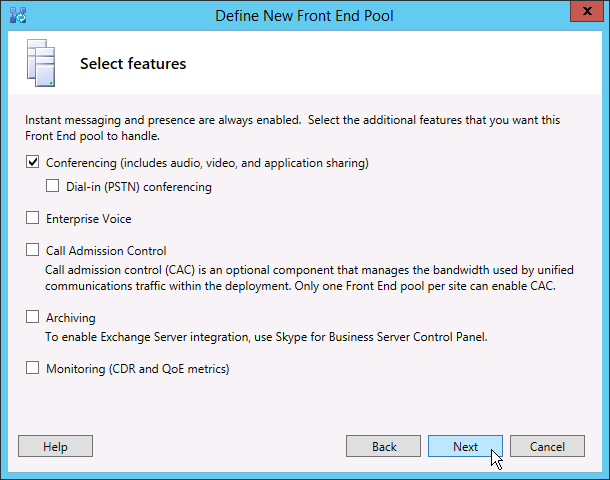

# Skype for Business Server で新しいトポロジを作成して公開する
 
**概要:** Skype for Business Server をインストールする前に、新しいトポロジを作成、公開、確認する方法について説明します。 Skype for Business Server の無料トライアルは、次[https://www.microsoft.com/evalcenter/evaluate-skype-for-business-server](https://www.microsoft.com/evalcenter/evaluate-skype-for-business-server)の Microsoft 評価センターからダウンロードしてください。
  
トポロジ内の各サーバーに Skype for Business サーバーシステムをインストールするには、まずトポロジを作成して公開する必要があります。 トポロジを公開するときは、トポロジの情報を中央管理ストア データベースに読み込みます。 Enterprise Edition プールの場合は、新しいトポロジを初めて公開するときに中央管理ストア データベースを作成することになります。 標準エディションの場合は、トポロジを公開する前に、展開ウィザードから Prepare First Standard Edition サーバープロセスを実行する必要があります。 この操作を行うと、SQL Server Express Edition インスタンスのインストールと中央管理ストアの作成が行われ、Standard Edition が準備されます。 手順 1 ～ 5 は任意の順序で実行できます。 ただし、手順 6、7、および 8 は、手順 1 ～ 5 の後に、図の順序で実行する必要があります。 新しいトポロジを作成して公開する方法については、手順 6/8 を参照してください。
  

  
## 新しいトポロジの作成および公開

Skype for Business Server Topology Builder を使用して、トポロジの設計、定義、構成、公開を行うことができます。 このツールは、この記事で既に説明した管理ツールのインストール時にインストールされています。 トポロジの作成には、さまざまな選択肢があります。 この手順では、会議機能を使用する基本的なトポロジを作成します。
  
> [!IMPORTANT]
> Skype for Business Server を使用するには、SQL Server を使用する必要があります。 プライマリ データベースは中央管理ストアと呼ばれます。 展開しているのが Enterprise Edition の場合、データベースは以下の手順でトポロジを公開するときに作成されます。 その場合、トポロジ ビルダーから SQL Server インストールへの接続情報を求められます。 Standard Edition を展開する予定の場合は、新しいトポロジを定義して公開する前に SQL Server Express Edition をインストールする必要があります。 SQL Server Express Edition をインストールするには、フロントエンドとして機能することになるサーバー上で展開ウィザードを開いてから、[最初の Standard Edition サーバーの準備] を実行する必要があります。 [最初の Standard Edition サーバーの準備] をクリックすると、展開ウィザードによって自動的に SQL Server Express Edition がインストールされ、中央管理ストア データベースが作成されます。 
  
### 新しいトポロジを作成する

1. トポロジ ビルダーにアクセスできる標準ユーザーとしてログインします。
    
2. Skype for Business Server トポロジビルダーを開きます。
    
3. [**新しいトポロジ**] を選択し、[**OK**] をクリックします。
    
4. トポロジ構成ファイルの場所とファイル名を選択します。
    
    > [!NOTE]
    > トポロジ構成は、トポロジ ビルダー XML (.tbxml) ファイルとして保存されます。トポロジを公開するときは、構成情報をファイルから SQL Server データベースにプッシュします。次回以降トポロジ ビルダーを開くときは、既存の構成を SQL Server からトポロジ ビルダーに直接ダウンロードして、SQL Server に公開するか、トポロジ ビルダー構成ファイルとして保存できます。 
  
5. [**プライマリ ドメインの定義**] 画面で、**プライマリ SIP ドメイン**を入力し、[**次へ**] をクリックします。この例では、図に示すように、**contoso.local** を使用しています。
    
     
  
6. サポートされている SIP ドメインが他にもあれば追加し、[**次へ**] をクリックします。
    
7. 図に示すように、最初のサイト (場所) の [**名前**] と [**説明**] を入力し、[**次へ**] をクリックします。
    
     
  
8. サイトの [**市区町村**]、[**都道府県**]、[**国/地域コード**] を入力し、[**次へ**] をクリックします。
    
9. [**完了**] をクリックして、新しいトポロジの定義プロセスを完了します。新しいフロントエンド ウィザードが自動的に起動されます。
    
### フロントエンド プールまたは Standard Edition サーバーを定義する

1. ウィザードの前提条件を確認し、[**次へ**] をクリックします。
    
2. 図に示すように、プールの完全修飾ドメイン名 (FQDN) を入力し、[**Enterprise Edition フロントエンド プール**] または [**Standard Edition サーバー**] のいずれかを選択して、[**次へ**] をクリックします。
    
    > [!TIP]
    > Skype for Business Server Enterprise Edition には、フロントエンドの役割を提供するために共同作業している複数のサーバーを含めることができます。 この役割を果たすために複数のサーバーを使用することを、プールと呼びます。 そのため、フロントエンドの役割を提供するために連携する複数のサーバーも、フロントエンド プールと呼ばれます。 Skype for Business Server Standard Edition には、フロントエンドの役割を提供するサーバーを1つだけ含めることができます。 この役割を提供するサーバーが 1 台のみの場合でも、一般的にフロントエンド プールと呼ばれます。 
  
     
  
3. 図に示すように、プール内のすべてのコンピューターの完全修飾ドメイン名 (FQDN) を入力し、[**次へ**] をクリックします。
    
     
  
4. 図に示すように、このトポロジに含める機能を選択し、[**次へ**] をクリックします。
    
    > [!NOTE]
    > Skype for Business Server には、多くの高度な機能が含まれています。 使用する特定の機能については、「計画」と「展開」のドキュメントを確認してください。 
  
     
  
5. **[併置**されたサーバーの役割の選択] ページでは、フロントエンドサーバー上で仲介サーバーを検索するか、スタンドアロンサーバーとして展開するかを選ぶことができます。
    
    仲介サーバーを Enterprise Edition フロントエンド プール上で併置する場合は、このチェック ボックスがオンになっていることを確認します。 サーバーの役割はプール サーバーに展開されます。 仲介サーバーをスタンドアロン サーバーとして展開する場合は、該当するチェック ボックスをオフにします。 フロントエンドサーバーを完全に展開した後、別の展開手順に仲介サーバーを展開します。 Collocation の計画の詳細については、「 [Skype For Business Server のトポロジの基礎](../../plan-your-deployment/topology-basics/topology-basics.md)」を参照してください。
    
6. [**サーバーの役割とこのフロントエンド プールとの関連付け**] ページでは、サーバーの役割を定義し、フロントエンド プールと関連付けることができます。次の役割を使用できます。
    
    **エッジプールを有効にする**1つのエッジサーバーまたはエッジサーバーのプールを定義して関連付けます。 エッジ サーバーを使用すると、組織内のユーザーと組織外のユーザー (フェデレーション ユーザーなど) との間の通信および共同作業が容易になります。
    
    サーバーの役割の展開と関連付けについては、次の 2 つのシナリオが考えられます。
    
    シナリオ 1 では、新しいインストールで新しいトポロジを定義します。次の 2 つのどちらかのアプローチでインストールできます。
    
   - チェック ボックスをオフのままにして、トポロジを定義します。フロントエンド サーバーとバックエンド サーバーの各役割の公開、構成、およびテストを行った後、もう一度トポロジ ビルダーを実行して、各役割のサーバーをトポロジに追加できます。この戦略を使用することにより、追加の役割による複雑化を招くことなく、フロントエンド プールと、SQL Server を実行しているサーバーをテストできます。最初のテストが完了したら、トポロジ ビルダーを再び実行して、展開が必要な役割を選択できます。
    
   - インストールする必要がある役割を選択し、選択した役割に対応するハードウェアをセットアップします。
    
     シナリオ 2 は既存の展開があり、インフラストラクチャが新しい役割に対応できる状態になっているか、既存の役割を新しいフロントエンド サーバーに関連付ける必要がある場合です。
    
   - この場合、展開する役割、または新しいフロントエンド サーバーに関連付ける役割を選択します。どちらの場合も、役割の定義を続行して必要なハードウェアを設定し、インストールを進めます。
    
7. 次に、トポロジで使用する SQL Server ストアを定義します。 この例では、[既定のインスタンス] を使用します。 高可用性などの SQL Server 機能の詳細については、「 [Skype For Business Server で高可用性と障害回復を計画する](../../plan-your-deployment/high-availability-and-disaster-recovery/high-availability-and-disaster-recovery.md)」を参照してください。
    
   - トポロジで既に定義されている既存の SQL Server ストアを使用するには、[**SQL ストア**] でインスタンスを選択します。
    
   - プール情報を格納するための新しい SQL Server インスタンスを定義するには、[**新規作成**] をクリックし、[**新しい Sql ストアの定義**] ダイアログボックスで**sql server の FQDN**を指定します。
    
   - SQL Server インスタンスの名前を指定するには、[**名前付きインスタンス**] を選択し、インスタンスの名前を指定します。
    
   - 既定のインスタンスを使用するには、[**既定のインスタンス**] をクリックします。
    
   - SQL ミラーリングを使用するには、[**SQL ミラーリングを有効にする**] を選択し、既存のインスタンスを選択するか、新しいインスタンスを作成します。

     > [!NOTE]
     > SQL ミラーリングは、Skype for Business Server 2015 では使用できますが、Skype for Business Server 2019 ではサポートされなくなりました。 AlwaysOn 可用性グループ、AlwaysOn フェールオーバークラスターインスタンス (FCI)、SQL フェールオーバークラスタリングの各方法は、Skype for Business Server 2019 で推奨されます。
    
     この例では、図に示すように、[**SQL Server FQDN**] に入力し、関連するすべての高可用性設定を構成して、[**OK**] をクリックします。
    
     
  
8. SQL Server ストアのミラーリングや SQL Server ミラーリング監視を有効にするかどうかを指定し、[**次へ**] をクリックします。
    
9. 使用するファイル共有を定義します。
    
   - トポロジで既に定義されているファイル共有を使用するには、[**以前に定義したファイル共有を使用する**] を選択します。
    
   - 新しいファイル共有を定義するには、[**新しいファイル共有の定義**] を選択し、[**ファイル サーバー FQDN**] ボックスで、ファイル共有が存在する既存のファイル サーバーの FQDN を入力します。そして、[**ファイル共有**] ボックスでファイル共有の名前を入力します。
    
     この例では、[**新しいファイル ストアを定義する**] をクリックし、**ファイル サーバー FQDN** と**ファイル共有**を入力して、[**次へ**] をクリックします。
    
     > [!NOTE]
     > Skype for Business Server のファイル共有を併置することはできますが、パフォーマンス上の理由からお勧めしません。 この例では、ファイル共有として機能する単一の専用サーバー上にファイル共有が配置されています。 ただし、Windows Server 2012 R2 を使用する DFS など、より堅牢な他のファイル共有システムの使用をお勧めします。 サポートされているファイル共有システムの詳細については、「 [Skype For business 環境の要件](../../plan-your-deployment/requirements-for-your-environment/requirements-for-your-environment.md)」を参照してください。 ファイル共有の作成について詳しくは、「 [Skype For Business Server でファイル共有を作成](create-a-file-share.md)する」をご覧ください。 ファイル共有をまだ作成していなくても、ファイル共有を定義できます。 その場合は、トポロジを公開する前に、定義した場所にファイル共有を作成する必要があります。 
  
10. [Web サービス URL の指定] ページで、内部 Web サービス プール ベース URL の上書きが必要かどうかを指定する必要があります。 この上書きの必要性は負荷分散と関係があります。 基本 SIP トラフィックは、単純な DNS 負荷分散で負荷を調整できます。 それに対し、HTTP/S Web サービス ネットワーク トラフィックでは、サポートされているハードウェアまたはソフトウェア負荷分散ソリューションを使う必要があります。 サポートされているロードバランサーの場合は、「 [Skype For business のインフラストラクチャ](https://docs.microsoft.com/SkypeForBusiness/certification/infra-gateways)」を参照してください。 この例では、SIP トラフィック用の DNS 負荷分散とサポートされているソフトウェア負荷分散ソリューションが使用されています。 トラフィックをこのようにして分割しているので、内部 Web サービス プール FQDN を上書きする必要があります。 一方、最も高い性能のロード バランサーを使用していて、すべてのトラフィックをそれ経由で送信しており、SIP 用の DNS 負荷分散を使用しない場合は、Web サービス URL の上書きは必要ありません。 
    
    このトピックの DNS セクションでは、webint.contoso.local の A レコードを作成しました。 これは Web サービス HTTP/S トラフィックに使用している URL で、セットアップ済みのサポートされているソフトウェア ロード バランサーを通過する必要があります。 このように、この例では、URL を上書きして、すべての HTTP/S トラフィックが webint の代わりに、ではなく、ローカルにあることを確認します。 負荷分散の詳細については、「 [Skype For business の負荷分散の要件](../../plan-your-deployment/network-requirements/load-balancing.md)」を参照してください。
    
    > [!IMPORTANT]
    > ベース URL は、https:// の部分を除いた URL の Web サービス ID です。 たとえば、プールの Web サービスの完全な URL がhttps://webint.contoso.localの場合、ベース url は webint になります。 
  
    - この例のように、DNS 負荷分散を構成している場合、[**内部 Web サービス プール FQDN の優先**] チェック ボックスをオンにし、[**内部ベース URL**] に、内部ベース URL (この URL はプールの FQDN と異なっている必要があります) を入力します。 
    
    > [!CAUTION]
    > 内部 Web サービスを自己定義の FQDN で上書きする場合は、各 FQDN が他のすべてのフロントエンド プール、ディレクター、またはディレクター プールと異なっている必要があります。 **標準文字のみを使用する**(A-z、a-z、0-9、ハイフンを含む)、Url または完全修飾ドメイン名を定義する場合。 Unicode 文字およびアンダースコアは使用しないでください。 一般に、外部 DNS および公的証明機関 (CA) では、URL または FQDN での非標準文字の使用はサポートされていません (証明書で URL または FQDN をサブジェクト名またはサブジェクトの別名に割り当てることが必要になります)。
  
    - オプションで、[**外部ベース URL**] に外部ベース URL を入力します。内部ドメイン名と区別できるような外部ベース URL を入力します。たとえば、内部ドメインが contoso.local でも、外部ドメイン名が contoso.com になっている場合は、パブリック DNS から解決可能である必要があるため、contoso.com ドメイン名を使用して URL を定義します。これは、リバース プロキシの場合でも重要です。外部ベース URL のドメイン名は、リバース プロキシの FQDN のドメイン名と同じです。モバイル クライアント上でのインスタント メッセージングおよびプレゼンスでは、フロントエンド プールへの HTTP アクセスが必要です。
    
      
  
11. [**機能の選択**] ページで [**電話会議**] を選択した場合は、Office Web Apps サーバーを選択するように求められます。[**新規**] をクリックしてダイアログ ボックスを起動します。
    
12. [**新しい Office Web Apps サーバーの定義**] ダイアログ ボックスで、Office Web Apps サーバーの FQDN を [**Office Web Apps サーバーの FQDN**] ボックスに入力します。この操作を行うと、Office Web Apps サーバー検出の URL が [**Office Web Apps サーバー検出の URL**] ボックスに自動的に入力されます。
    
    Office Web Apps サーバーがオンプレミスでインストールされていて、Skype for Business Server と同じネットワークゾーンにインストールされている場合は、[ **Office Web Apps サーバーが外部ネットワーク (境界/インターネット) に展開**されている] オプションを選択しないでください。
    
    Office Web Apps サーバーを内部ファイアウォールの外側に展開する場合は、[**Office Web Apps サーバーは外部ネットワークで展開 (境界ネットワークまたはインターネット)**] オプションを選択します。
    
13. [**完了**] をクリックして構成を完了します。[**サーバーの役割とこのフロントエンド プールとの関連付け**] ページで他の役割サーバーを定義した場合、個々の役割構成ウィザードのページが表示され、サーバーの役割を構成できます。この例では、電話会議のみを選択します。
    
### 単純な Url を構成する

1. [トポロジビルダー] で、[ **Skype For Business Server** top] ノードを右クリックし、図に示すように [**プロパティの編集**] をクリックします。
    
     ![Skype for Business Server を右クリックして、[プロパティの編集] を選択します。](../../media/692c18dd-8e99-4239-ae7b-5e855d866afa.png)
  
2. [**簡易 URL**] ウィンドウで、編集する [**電話アクセスの URL:**] (Dial-in) または [**会議の URL:**] (Meet) のいずれかを選択し、[**URL の編集**] をクリックします。
    
3. URL を目的の値に更新し、[**OK**] をクリックして編集した URL を保存します。 外部ユーザーが会議に参加できるようにするため、外部 SIP ドメインを使用する簡易 URL を構成する必要があります (たとえば、内部ドメインの contoso.local ではなく、外部ドメインの contoso.com を使用します)。 そのため、SIP ドメインは、外部 DNS によって解決可能である必要があります。
    
4. 必要に応じて、同じ手順を使用して会議 URL を編集します。
    
### オプションの管理用の簡易 URL を定義する

1. トポロジビルダーで、[ **Skype For Business Server** ] ノードを右クリックし、[**プロパティの編集**] をクリックします。
    
2. [**管理アクセスの url** ] ボックスに、Skype For Business Server コントロールパネルへの管理アクセスに使用する単純な url を入力し、[ **OK]** をクリックします。
    
    > [!TIP]
    > 管理 URL には、できる限りシンプルな URL を使用することをお勧めします。 最も簡単なオプションhttps://adminはです。_ \<ドメイン\>_。 管理 URL は、レコードが内部 DNS で解決可能でさえあれば、内部ドメインまたは外部ドメイン (contoso.local または contoso.com など) にすることができます。 
  
    > [!IMPORTANT]
    > 最初の展開後に簡易 URL を変更する場合、簡易 URL のドメイン ネーム システム (DNS) レコードと証明書に影響する変更について注意する必要があります。 変更が単純な URL のベースに影響する場合は、DNS レコードと証明書も変更する必要があります。 たとえば、to https://sfb.contoso.com/Meet https://meet.contoso.comから MEET.CONTOSO.COM へのベース URL の変更は、sfb.contoso.com を参照するように DNS レコードと証明書を変更する必要があるためです。 Simple URL をからhttps://sfb.contoso.com/Meetにhttps://sfb.contoso.com/Meetings変更した場合、sfb.contoso.com のベース url は変わりません。そのため、DNS や証明書の変更は必要ありません。 ただし、単純な URL 名を変更した場合は必ず、各ダイレクタとフロントエンドサーバーで、 **CsComputer**コマンドレットを実行して変更を登録する必要があります。
  
### トポロジを公開して検証する

1. すべての簡易 URL が正しく構成されていることを確認します。
    
2. SQL Server ベースのサーバーがオンラインになっていることを確認します。また、トポロジ ビルダーがインストールされているコンピューターでこのサーバーが使用できることを確認します。必要なファイアウォール規則などを確認してください。
    
3. ファイル共有が使用可能であり、適切なアクセス許可が定義されていることを確認します。
    
4. トポロジで、展開要件を満たす正しいサーバーの役割が定義されていることを確認します。
    
5. サーバーが Active Directory ドメイン サービス (AD DS) 内に存在することを確認します。これは、サーバーをドメインに参加させると、自動的に確認されます。
    
    トポロジの検証が完了して検証エラーがないことが確認できたら、トポロジの公開の準備に移ります。検証エラーがある場合は、エラーを修正してからでないとトポロジは公開できません。
    
6. [**Skype for Business Server**] ノードを右クリックし、[**トポロジの公開**] をクリックします。
    
7. [**トポロジの公開**] ページで、[**次へ**] をクリックします。
    
8. 図に示すように、[**中央管理サーバーの選択**] ページで、フロントエンド プールを選択します。
    
    > [!NOTE]
    > [**詳細設定**] をクリックすると、データベース ファイルの場所を構成できます。
  
     
  
9. [**データベースの選択**] ページで、公開するデータベースを選択します。
    
    > [!NOTE]
    > データベースを作成するための適切な権限を持っていない場合は、それらのデータベースの横にあるチェックボックスをオフにすることができます。また、適切な権限を持つユーザーが後でデータベースを作成することもできます。 要件の詳細については、「 [Skype For Business server のサーバー要件](../../plan-your-deployment/requirements-for-your-environment/server-requirements.md)」を参照してください。 
  
10. オプションで [**詳細設定**] をクリックします。 SQL Server のデータ ファイル配置に関する [詳細] オプションを使用すると、次のオプションのどちらかを選択できます。 
    
    - [**データベースファイルの場所を自動的に特定**する]-このオプションは、ログとデータファイルを最適な場所に配布することによって、SQL server ベースのサーバーのディスク構成に基づいて最適な運用パフォーマンスを決定します。
    
    - [ **Sql server インスタンスの既定値を使用する**]-このオプションでは、インスタンスの設定を使用して、ログファイルとデータファイルが SQL server ベースのサーバーに配置されます。 このオプションでは、ログとデータの最適な場所を決定するのに、SQL Server ベースのサーバーの操作上の機能は使用されません。 SQL Server の管理者が通常、SQL Server ベースのサーバーおよび組織の管理手順に適した場所にログ ファイルとデータ ファイルを移動します。
    
    [**OK**] をクリックして、[**次へ**] をクリックします。 
    
11. オプションで [**詳細設定**] をクリックします。SQL Server のデータ ファイル配置に関する [詳細] オプションを使用すると、次のオプションのどちらかを選択できます。 
    
    - [**データベースファイルの場所を自動的に特定**する]-このオプションは、ログとデータファイルを最適な場所に配布することによって、SQL server ベースのサーバーのディスク構成に基づいて最適な運用パフォーマンスを決定します。
    
    - [ **Sql server インスタンスの既定値を使用する**]-このオプションでは、インスタンスの設定を使用して、ログファイルとデータファイルが SQL server ベースのサーバーに配置されます。 このオプションでは、ログとデータの最適な場所を決定するのに、SQL Server ベースのサーバーの操作上の機能は使用されません。 SQL Server の管理者が通常、SQL Server ベースのサーバーおよび組織の管理手順に適した場所にログ ファイルとデータ ファイルを移動します。
    
    [**OK**] をクリックします。
    
12. [**次へ**] をクリックして公開プロセスを完了します。
    
    > [!NOTE]
    > この手順でよくあるエラーは、SQL Server データベースを作成できないことです。このプロセスを完了できないと、図に示すように、エラーが表示されます。その原因として最も可能性が高いのは、データベースを作成しようとしたユーザーが適切な権限を持っていないこと、またはファイアウォールや他のネットワークの問題によって、SQL Server システムと通信できないことです。 
  
     
  
13. 公開プロセスが完了すると、その後の手順の一覧を開くリンクが表示されます。[**TO-DO リストを開くには、ここをクリックします**] をクリックしてその後の手順を確認し、[**完了**] をクリックします。 
    
    データベースの作成で "完了しましたが、警告があります" というメッセージが表示されても、エラーがあることを意味しているわけではありません。 インストールプロセスでは、Skype for Business Server が正常に動作するために、SQL Server の設定を変更する必要があります。 SQL Server の設定が変更されると、警告としてログに記録され、インストール プロセスがどのような操作を完了したかを SQL Server 管理者が正確に理解できます。 警告が表示された場合は、レコードを選択し、[**ログの表示**] をクリックして警告の詳細を表示できます。
    
    トポロジが正常に公開されたら、トポロジでの Skype for Business Server を実行している各サーバーに、中央管理ストアのローカルレプリカをインストールし始めることができます。 最初のフロントエンド プールから開始することをお勧めします。 
    

