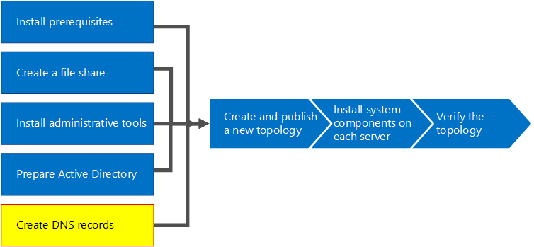

# Skype for Business Server 2015 での DNS レコードの作成
 
**の概要:**DNS を構成し、ビジネス サーバー 2015 の Skype のインストール用の DNS レコードを作成する方法について説明します。 マイクロソフト評価センターからのビジネス サーバー 2015 の Skype の無料試用版をダウンロード: [https://www.microsoft.com/evalcenter/evaluate-skype-for-business-server](https://www.microsoft.com/evalcenter/evaluate-skype-for-business-server)。
  
正常に動作するサーバーをビジネスの Skype は、いくつかのドメイン ネーム システム (DNS) 設定の必要があります。 これは、クライアントがサービスにアクセスする方法を認識し、サーバーが相互を認識するようにするためです。 ユーザーが DNS エントリを割り当てればドメイン全体で使用できるようになるため、これらの設定を完了する必要があるのは、展開ごとに 1 回だけです。 手順 1 ～ 5 は任意の順序で実行できます。 ただし、手順 6、7、および 8 は、手順 1 ～ 5 の後に、図の順序で実行する必要があります。 DNS レコードの作成は、8 つの手順のうちの 5 番目です。 DNS の計画についての詳細については、 [Skype のビジネス サーバー 2015 の環境の要件](../../plan-your-deployment/requirements-for-your-environment/environmental-requirements.md)を参照してください。
  
> [!IMPORTANT]
> これは、Windows サーバーの DNS 環境で DNS レコードを作成する方法の例では同様に重要です。 ビジネス サーバーでは、Skype に必要なその他の多くの DNS エントリがあるし、DNS レコードを作成する手順は、組織内の DNS を管理するために使用しているシステムによって異なります。 DNS の要件の一覧は、[ビジネス サーバー 2015 の Skype の DNS の要件](../../plan-your-deployment/network-requirements/dns.md)を参照してください。 
  

  
## DNS の構成

DNS レコードは、Skype ビジネス サーバーで正常に動作し、ユーザーがアクセスできる必要があります。
  
この例では、DNS 負荷分散される、pool.contoso.local という名前の FQDN を使用しています。 このプールは、Skype ビジネス サーバー 2015 の Enterprise Edition を実行している 3 つのサーバーで構成されています。 1 台の Standard Edition フロントエンド サーバーに搭載できるサーバーは 1 台のみです。 この例のように、DNS 負荷分散されるサーバー プールを作成するのではなくフロントエンドの役割を参照する場合、Standard Edition を使用することで、1 台の Standard Edition サーバーの完全修飾ドメイン名 (FQDN) のみを使用することになります。 フロントエンドの役割のみを使用するこのシンプルな例には、次の表の DNS エントリが含まれます。 特定の DNS の要件を計画するには、[ビジネス サーバー 2015 の Skype の DNS の要件](../../plan-your-deployment/network-requirements/dns.md)を参照してください。 
  
 
|**説明**|**レコードの種類**|**名**|**解決します。**|**負荷分散の種類**|
|:-----|:-----|:-----|:-----|:-----|
|内部 Web サービスの FQDN    |A    |webint.contoso.local    |内部 Web サービスの VIP    |サポートされるソフトウェアとハードウェア    |
|プールの FQDN    |A    |pool.contoso.local    |サーバー SFB01 の IP アドレス    |DNS    |
|SFB01 の FQDN    |A    |SFB01.contoso.local    |サーバー SFB01 の IP アドレス    |DNS    |
|プールの FQDN    |A    |pool.contoso.local    |サーバー SFB02 の IP アドレス    |DNS    |
|SFB02 の FQDN    |A    |SFB02.contoso.local    |サーバー SFB02 の IP アドレス    |DNS    |
|プールの FQDN    |A    |pool.contoso.local    |サーバー SFB03 の IP アドレス    |DNS    |
|SFB03 の FQDN    |A    |SFB03.contoso.local    |サーバー SFB03 の IP アドレス    |DNS    |
|Skype for Business の自動検出    |A    |lyncdiscoverinternal.contoso.local    |内部 Web サービスの VIP    |サポートされるソフトウェアとハードウェア    |
|会議の簡易 URL    |A    |meet.contoso.local    |内部 Web サービスの VIP    |サポートされるソフトウェアとハードウェア    |
|ダイヤルインの簡易 URL    |A    |dialin.contoso.local    |内部 Web サービスの VIP    |サポートされるソフトウェアとハードウェア    |
|Web Scheduler の簡易 URL    |A    |scheduler.contoso.local    |内部 Web サービスの VIP    |サポートされるソフトウェアとハードウェア    |
|管理の簡易 URL    |A    |admin.contoso.local    |内部 Web サービスの VIP    |サポートされるソフトウェアとハードウェア    |
|従来の検出    |SRV    |_sipinternaltls._tcp.contoso.local    |プールの FQDN (ポート 5061)    |該当なし    |
   
### DNS レコードの作成

1. DNS サーバーにログオンして、[**サーバー マネージャー**] を開きます。
    
2. [**ツール**] ドロップダウン メニューをクリックし、[**DNS**] をクリックします。
    
3. SIP ドメインのコンソール ツリーで**[前方参照ゾーン**] を展開し、ビジネス サーバー用の Skype をインストールする SIP ドメインを展開し、します。
    
4. 図のように、SIP ドメインを右クリックして、[**新しいホスト (A または AAAA)**] を選択します。
    
     
  
5. [**名前**] ボックスにホスト レコード名を入力します (ドメイン名は自動的に追加されます)。
    
6. [**IP アドレス**] ボックスで、個々のフロントエンド サーバーの IP アドレスを入力し、適用可能な場合は [**関連付けられたポインター (PTR) レコードを作成する**] または [**同じ所有者名の DNS レコードの更新を認証されたユーザーに許可する**] を選択します。ここでは、Web サービスを除き、すべてのトラフィックの負荷分散に DNS が使用されると想定されています。この例では、表に示すように、3 台のフロントエンド サーバーがあります。
    
   |**サーバー名**|**タイプ**|**データ**|
   |:-----|:-----|:-----|
   |SFB01    |ホスト (A)    |10.0.0.5 に対し    |
   |SFB02    |ホスト (A)    |10.0.0.6    |
   |SFB03    |ホスト (A)    |10.0.0.7    |
   
7. 次に、プールの DNS 負荷分散のエントリを作成します。 DNS 負荷分散により、同じ DNS プール名を使用しながら、DNS ではプールの個別のサーバーに要求を送信することができます。 DNS および負荷分散に関する詳細については、 [Skype のビジネス サーバー 2015 の DNS の要件](../../plan-your-deployment/network-requirements/dns.md)を参照してください。 
    
    > [!NOTE]
    > 複数のサーバーをまとめてプールにする操作は、Enterprise Edition 展開でのみ使用できます。Enterprise Server または Standard Edition サーバーを 1 台展開している場合は、その 1 台のサーバー用の A レコードのみを作成する必要があります。 
  
    たとえば、pool.contoso.local という名前のプールと 3 台のフロントエンド サーバーがある場合は、次の DNS エントリを作成します。
    
   |**FQDN**|**タイプ**|**データ**|
   |:-----|:-----|:-----|
   |pool.contoso.local    |ホスト (A)    |10.0.0.5 に対し    |
   |pool.contoso.local    |ホスト (A)    |10.0.0.6    |
   |pool.contoso.local    |ホスト (A)    |10.0.0.7    |
   
8. 計画済みの展開に含まれるすべてのサーバー用の A レコードの作成を続行します。 
    
9. 従来の検出用のサービス レコード (SRV) を作成するには、SIP ドメインを右クリックして、[**その他の新しいレコード**] を選択します。
    
10. [**リソース レコードの種類を選択**] の [**サービス ロケーション (SRV)**] をクリックし、[**レコードの作成**] をクリックします。
    
11. [**サービス**] をクリックし、「**_sipinternaltls**」と入力します。
    
12. [**プロトコル**] をクリックし、「**_tcp**」と入力します。
    
13. [**ポート番号**] をクリックし、「**5061**」と入力します。
    
14. [**このサービスを提供しているホスト**] をクリックして、プールまたは Standard Edition サーバーの FQDN を入力します。
    
     
  
15. [**OK**] をクリックしてから、[**完了**] をクリックします。
    
### DNS レコードの確認

1. Authenticated Users グループのメンバーであるアカウントまたは同等のアクセス許可を持つアカウントを使用して、ドメインのクライアント コンピューターにログオンします。
    
2. [**スタート**] ボタンをクリックし、「**cmd**」と入力して、Enter キーを押します。
    
3. 型**nslookup\<フロント エンド プールの FQDN\>**または**\<Standard Edition サーバーまたは Enterprise Edition の 1 つのサーバーの FQDN\>**、し、Enter キーを押します。
    
4. 引き続き、展開の残りの A レコードを確認します。
    
5. 従来のクライアントをサポートしていて、SRV レコードの作成が完了している場合は、**nslookup** プロンプトで「**set type=srv**」と入力して、Enter キーを押します。
    
6. タイプ * * _sipinternaltls._tcp。 *ドメイン** * (_sipinternaltls._tcp.contoso.local など)、し、Enter キーを押します。
    
7. 想定される出力は、図に示す出力のようになります。サンプル出力にはすべての DNS レコードが表示されているわけではありませんが、すべてのレコードを確認する必要があります。 
    
     
  

