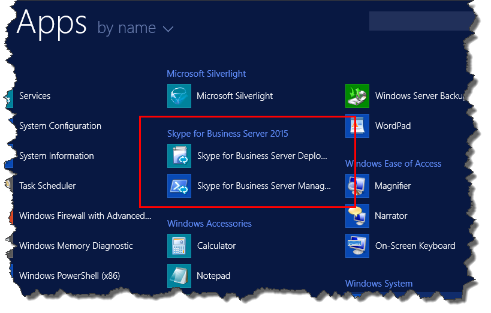

# Skype for Business Server に管理ツールをインストールする
 
**概要:** Skype for Business Server のインストールに必要な管理ツールのインストール方法について説明します。 次[https://www.microsoft.com/evalcenter/evaluate-skype-for-business-server](https://www.microsoft.com/evalcenter/evaluate-skype-for-business-server)の Microsoft 評価センターから、無料の Skype For business Server の試用版をダウンロードしてください。
  
管理ツールには、トポロジビルダーとコントロールパネルがあります。 管理ツールは、トポロジ内の少なくとも1つのサーバーにインストールするか、Skype for Business Server でサポートされている Windows OS バージョンを実行している64ビットの管理ワークステーションにインストールする必要があります。 手順1から5までを任意の順序で実行できます。 ただし、手順6、7、および8は、図に示されているように、手順 1 ~ 5 の後で実行する必要があります。 管理ツールのインストール手順は 3/8 です。
  

  
## Skype for Business Server 管理ツールのインストール

Skype for Business Server のインストールメディアには、柔軟な環境が用意されています。 Setup.exe を最初に実行したときにインストールされるツールは、Skype for Business Server 展開ウィザードと Skype for Business Server 管理シェルのみです。 コアコンポーネントと呼ばれるこれら2つのツールを使用することにより、インストールプロセスを続行できますが、全体的な Skype for Business Server 環境の主要な機能は提供されません。 展開ウィザードは、コアコンポーネントをインストールした後に自動的に起動します。 「 **Install 管理ツール**」というタイトルの展開ウィザードのセクションでは、Skype For Business Server トポロジビルダーと Skype For Business Server コントロールパネルがインストールされます。
  
> [!IMPORTANT]
> すべての Skype for Business Server 環境には、管理ツールがインストールされた少なくとも1つのサーバーが必要です。 
  
**管理ツールをインストール**するためのビデオの手順をご覧ください。
  
> [!video https://www.microsoft.com/videoplayer/embed/99a5c436-963b-4eed-b423-651568c87cb1?autoplay=false]
  
### 展開ウィザードから Skype for Business Server 管理ツールをインストールする

1. Skype for Business Server のインストールメディアを挿入します。 セットアップが自動的に開始しない場合は、[**セットアップ**] をダブルクリックします。
    
2. インストールメディアを実行するには、Microsoft Visual C++ が必要です。 インストールするかどうかを確認するダイアログボックスが表示されます。 [**はい**] をクリックします。
    
3. Skype for Business Server の新機能であるスマートセットアップを使用すると、インストールプロセス中にインターネットに接続して更新プログラムを確認できます。 これにより、インストール時に最新の更新プログラムがインストールされていることを確認することができるようになります。 **[インストール]** をクリックして、インストールを開始します。
    
4. 使用許諾契約書をよく読んで、同意する場合は [**使用許諾契約書に同意**します] を選択して、[ **OK**] をクリックします。
    
5. Skype for Business Server のコアコンポーネントがサーバーにインストールされます。 
    
    コアコンポーネントは、図に示すように、次の要素で構成されています。
    
    
  
   - **Skype For Business Server 展開ウィザード**Skype for Business Server のさまざまなコンポーネントをインストールするための起動パッドを提供する展開プログラム。
    
   - **Skype For Business Server 管理シェル**Skype for Business Server の管理を可能にする、あらかじめ構成された PowerShell プログラム。
    
     コアコンポーネントのインストールが完了すると、図に示すように、Skype for Business Server 展開ウィザードが自動的に起動します。 
    
     
  
6. コアコンポーネントに加えて、Skype for Business Server トポロジビルダーと Skype for Business Server コントロールパネルを環境内の少なくとも1つのサーバーにインストールする必要があります。 展開ウィザードで、[**管理ツールのインストール**] をクリックします。
    
7. [**次へ**] をクリックして、インストールを開始します。
    
8. インストールが完了したら、[**完了**] をクリックします。 図に示すように、管理ツールがサーバーに追加されました。
    
    
  
   - **Skype For Business Server トポロジビルダー**トポロジを構築、展開、および管理するために使用されるプログラム。
    
   - **Skype For Business Server コントロールパネル**インストールを管理するために使用されるプログラム。
    

