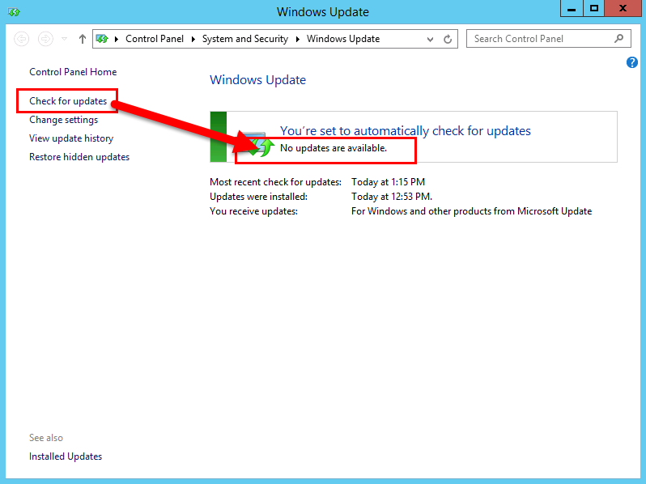

# ビジネス サーバーの Skype のための前提条件をインストールします。Install prerequisites for Skype for Business Server
 
**の概要:** サーバーとサーバーのビジネスの Skype をインストールする前に構成する必要がありますサーバーの役割について説明します。**Summary:** Learn about the servers and server roles you must configure before you install Skype for Business Server. [マイクロソフト評価センター](https://www.microsoft.com/evalcenter/evaluate-skype-for-business-server)からビジネス サーバー用には、Skype の無料試用版をダウンロードします。Download a free trial of Skype for Business Server from the [Microsoft Evaluation center](https://www.microsoft.com/evalcenter/evaluate-skype-for-business-server).
  
必須コンポーネントのインストールは、トポロジ内のサーバーごとに必要な役割と機能をインストールすることによって Windows のサーバーを設定するので構成されます。Installing prerequisites consists of setting up Windows Server by installing the required roles and features on each of the servers in the topology. 要件は、サーバーをトポロジに満たす役割に基づいています。The requirements are based on the role the server will fulfill in the topology. 手順 1 ～ 5 は任意の順序で実行できます。You can do steps 1 through 5 in any order. ただし、手順 6、7、および 8 は、手順 1 ～ 5 の後に、図の順序で実行する必要があります。However, you must do steps 6, 7, and 8 in order, and after steps 1 through 5, as outlined in the diagram. 8 のステップ 1 は、必須コンポーネントをインストールします。Installing prerequisites is step 1 of 8.
  

  
## Windows Server をセットアップするSetup Windows Server

Skype ビジネス サーバー用には、インストールする前に Windows サーバー オペレーティング システムおよび前提条件の数値が必要があります。Skype for Business Server requires the Windows Server operating system and a number of prerequisites before it can be installed. 前提条件の計画に関する詳細については、 [Skype ビジネス サーバー用のサーバーの要件](../../../SfBServer2019/plan/system-requirements.md)を参照してください。For details on planning for prerequisites, see [Server requirements for Skype for Business Server](../../../SfBServer2019/plan/system-requirements.md). 
  
> [!TIP]
> この手順では Windows Server 2012 R2 を使用します。This procedure uses Windows Server 2012 R2. 別のバージョンの Windows Server を使用する場合は、手順が若干異なることがあります。If you are using a different version of Windows Server, the procedure might be slightly different. 
  
> [!IMPORTANT]
> 作業を開始する前に、Windows Server は、Windows Update を使用して最新の状態を確認します。Before you begin, make sure that Windows Server is up-to-date by using Windows Update. 
  

  
**前提条件のインストール**手順に関するビデオを見てください。Watch the video steps for **install prerequisites**:
  
> [!video https://www.microsoft.com/en-us/videoplayer/embed/02447c2a-5b26-432f-aad6-b9b05cc93478?autoplay=false]
  
### フロントエンド サーバーに必要な役割と機能をインストールするInstall required roles and features for front-end servers

必要な役割と機能はサーバー マネージャーを使用してをインストールすることができます。You can install the required roles and features using Server Manager. 
    
1. [Skype ビジネス サーバー用のサーバーの要件](../../../SfBServer2019/plan/system-requirements.md)に記載されている前提条件のソフトウェア機能をインストールします。Install the prerequisite software features listed in [Server requirements for Skype for Business Server](../../../SfBServer2019/plan/system-requirements.md). Skype ビジネス サーバーを実行するサーバー上で必要なソフトウェアがある必要があります。The required software must be on the server that will run Skype for Business Server.
    
    > [!CAUTION]
    > 既定では、必要な機能のソース ファイルのすべてが Windows Server 2012 R2 でインストールされるわけではありません。Windows Server 2012 R2 does not install all of the source files for the required features by default. サーバーがインターネットに接続されていない場合は、必要な機能をインストールするために、Windows Server 2012 R2 メディアを挿入し、[**代替ソース パスの指定**] を選択する必要があります。If the server is not connected to the Internet, you will need to insert the Windows Server 2012 R2 media and select **Specify an alternate source path** in order to install the required features. ソース ファイルは sources\sxs ディレクトリにあります。The source files are located in the sources\sxs directory. たとえば、Windows Server 2012 R2 のメディアがドライブ D の場合は、設定のパス`d:\sources\sxs`。For example, if the Windows Server 2012 R2 media is in drive D, you would set the path to `d:\sources\sxs`. Windows Update で最新の更新プログラムを入手しておいてください。It is important that you have the latest updates from Windows Update. インターネットに接続していない場合は、関連するすべての更新プログラムと、必要な更新プログラムの前提条件を手動でインストールする必要があります。If you are not connected to the Internet, you will need to manually install all relevant updates as well as any prerequisites to the required updates. 
  
1. ダイアログ ボックスにインストールの完了が通知されたら、サーバーを再起動して処理を完了させる必要があります。When the dialog box indicates that the installation has completed, you will need to reboot the server to complete the process.
    
1. インストールした役割とサービスの更新プログラムがないかどうかを確認するために、**Windows Update** を再度実行します。Run **Windows Update** again to check if there are any updates to the roles and services that were installed.
    
1. 使用する Skype ビジネス サーバーのコントロール パネルのこのサーバーの場合、Silverlight もインストールする必要があります。If you will be using Skype for Business Server Control Panel on this server then you must also install Silverlight. Silverlight をインストールするには、 [Microsoft Silverlight](https://www.microsoft.com/silverlight/)を参照してください。To install Silverlight, see [Microsoft Silverlight](https://www.microsoft.com/silverlight/).

> [!IMPORTANT]
> ディレクター、常設チャット、エッジなど、フロントエンド サーバー以外の役割を実行するサーバーには、また別の前提条件があります。The prerequisites for servers performing roles other than front-end server, such as the role of Director, Persistent Chat, or Edge, have their own prerequisites. サーバーの種類ごとに必要な正確な前提条件の詳細については、 [Skype ビジネス サーバー用のサーバーの要件](../../../SfBServer2019/plan/system-requirements.md)を参照してください。For details on the exact prerequisites required by each server type, see [Server requirements for Skype for Business Server](../../../SfBServer2019/plan/system-requirements.md). 
  

