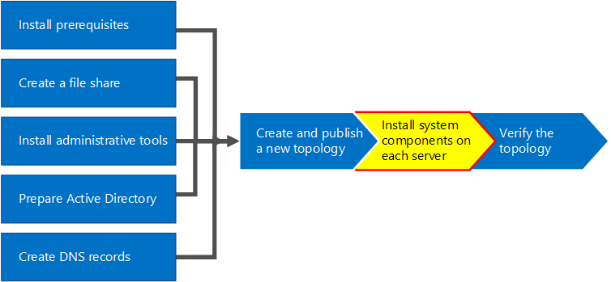
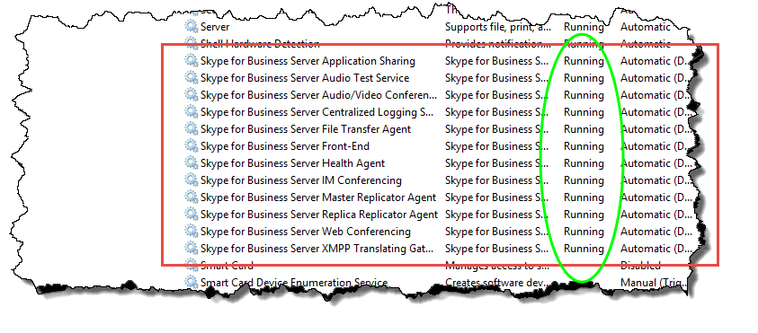

# トポロジ内のサーバーへの Skype for Business Server のインストール
 
**の概要:** トポロジ内の各サーバーでサーバーのビジネス システムのコンポーネントの Skype をインストールする方法について説明します。 [マイクロソフト評価センター](https://www.microsoft.com/evalcenter/evaluate-skype-for-business-server)からビジネス サーバー用には、Skype の無料試用版をダウンロードします。
  
トポロジが中央管理ストアにロードされ、Active Directory の役割を実行するサーバーが認識して、トポロジ内のサーバーごとにサーバーのビジネス システムの Skype をインストールする必要があります。 手順 1 ～ 5 は任意の順序で実行できます。 ただし、図に示すように手順 6、7、および 8 では、手順 1 5 からの後を行う必要があります。 8 手順 7 は、ビジネスのサーバー システムに Skype をインストールします。
  

  
## Skype をビジネスのサーバー システムをインストールします。

トポロジを公開すると、トポロジ内の各サーバーでビジネスのサーバー コンポーネントの Skype をインストールできます。 ここでは、Skype をビジネスのサーバーのインストールと設定、フロント エンド プールのサーバーの役割およびフロント エンド サーバーと同じ場所には、任意のサーバーの役割を説明します。 インストールして、サーバーのロールを設定して、ビジネス サーバーの展開ウィザードがサーバーの役割をインストールする各コンピューター上で、Skype を実行します。 ローカル構成ストアをインストールする、フロント エンド サーバーをインストールする、証明書を構成する、サービスの起動など、すべての 4 つの展開の手順を完了するのにには、展開ウィザードを使用します。
  
> [!IMPORTANT]
> 完了し、サーバー上のビジネス サーバーの Skype をインストールする前にトポロジを公開するのには、トポロジ ビルダーを使用する必要があります。 
  
> [!NOTE]
> この手順は、トポロジ内のすべてのサーバーについて実行する必要があります。 
  
> [!CAUTION]
> ビジネス サーバーをフロント エンド サーバー上の Skype をインストールした後サービスを開始する最初に行う必要がありますサーバー上で Windows ファイアウォール サービスが実行されていることを確認します。 
  
> [!CAUTION]
> これらの手順を実行する前に、ローカルの管理者と、RTCUniversalServerAdmins グループのメンバーであるドメイン ユーザー アカウントでサーバーにログオンしていることを確認します。 
  
> [!NOTE]
> ビジネス サーバーのセットアップの前にこのサーバー上で Skype を実行していない場合、は、ドライブとインストール パスを求めします。 この操作を行うと、システム ドライブ以外のドライブにインストールできます (組織で必要な場合や、容量の問題がある場合)。 ビジネス サーバー内のファイル**設定**] ダイアログ ボックスでは、Skype のインストール場所のパスを変更するには、利用可能な新しいドライブにします。 OCSCore.msi を含む、このパスにセットアップ ファイルをインストールする場合、Skype ビジネス サーバー ファイル用の残りの部分は展開がもします。
  
> [!IMPORTANT]
> インストールを開始する前に、Windows Server は、Windows Update を使用して最新の状態を確認します。 
  

  
### Skype をビジネスのサーバー システムをインストールします。

1. Skype ビジネス サーバーのインストール メディアを挿入します。 自動的にセットアップが開始されない場合は、[**セットアップ**] をダブルクリックします。
    
2. インストール メディアでは、Microsoft Visual C++ が実行されている必要があります。これをインストールするかどうかを確認するダイアログが表示されるので、[**はい**] をクリックします。
    
3. 使用許諾契約書の内容をよく読んでください。同意する場合は [**使用許諾契約書に同意します**] を選択し、[**OK**] をクリックします。 
    
4. スマート セットアップは、Skype のビジネス サーバーを接続するために Microsoft Update (MU) からの更新を確認して、インストール プロセス中に、インターネットに、図に示すように機能です。 これで製品に最新の更新プログラムがインストールされていることを確認できるため、作業がしやすくなります。 [**インストール**] をクリックしてインストールを開始します。
    
    > [!NOTE]
    > 多くの組織は社内環境に Windows Server Update Services (WSUS) を展開しています。 管理者は WSUS を使用すると、Microsoft Update からリリースされた更新プログラムを、社内ネットワークにあるコンピューターに配布するかどうかを完全に管理できます。 累積的な更新プログラム 1 のリリースの一部として Skype ビジネス サーバー用には、WSUS で使用するスマート セットアップのサポートが導入されています。 Wsus では最初にビジネス サーバー用の Skype を導入する、埋め込みのアップグレード機能を使用して Lync Server 2013 の環境からアップグレードするユーザーはスマート セットアップの Skype for Windows の更新プログラムを WSUS から更新プログラムを取得するのではなく取得することMU です。 スマート セットアップを使用することを希望する顧客は、Setup.exe を実行する前にすべてのコンピューターで SmartSetupWithWSUS.psq を実行する必要があります。 
  
     
  
5. [展開ウィザード] ページで、**サーバーのビジネス システムの更新プログラムの Skype をインストールまたは**をクリックします。
    
6. それらが終了したら、次の手順で手順を実行、展開ウィザードを終了する**終了**] をクリックします。 プール内のフロントエンド サーバーごとに、上記の手順を繰り返します。
    
### 手順 1: ローカル構成ストアのインストール

1. 前提条件を確認してから、[**手順 1: ローカル構成ストアのインストール**] の横にある [**実行**] をクリックします。
    
    > [!NOTE]
    > ローカル構成ストアは、中央管理ストアの読み取り専用コピーです。Standard Edition の展開では、中央管理ストアは、フロントエンド サーバーの SQL Server Express Edition のローカル コピーを使用して作成されます。これは、ユーザーが [最初の Standard Edition サーバーの準備] 手順を実行した時点に行われます。Enterprise Edition の展開では、中央管理ストアは、Enterprise Edition フロントエンド プールを含むトポロジを公開すると作成されます。 
  
2. [**ローカル構成ストアのインストール**] ページで、[**中央管理ストアから直接取得する**] オプションがオンになっていることを確認し、[**次へ**] をクリックします。
    
    SQL Server Express Edition はローカル サーバーにインストールされます。SQL Server Express Edition は、ローカル構成ストアに必要です。
    
3. ローカル サーバー構成のインストールが完了したら、[**完了**] をクリックします。
    
### 手順 2: セットアップまたは Skype をビジネスのサーバー コンポーネントの削除

1. 、前提条件を確認し、[**実行**] をクリックする**手順 2: セットアップまたは削除の Skype ビジネス サーバー コンポーネントの**です。
    
2. **ビジネス サーバー コンポーネントの Skype の設定**] ページで、**次**に公開されているトポロジで定義されているコンポーネントを設定するをクリックします。
    
3. セットアップが実行されると、[**コマンドの実行**] ページに、コマンドおよびインストール情報の概要が表示されます。 完了したら、リストを使用して表示するにはログを選択して、[**ログの表示**] をクリックします。
    
4. Skype ビジネス サーバー コンポーネントのセットアップを実行し、必要に応じて、ログを確認した、インストールでは、この手順を完了する**完了**をクリックします。
    
    > [!NOTE]
    > サーバーの再起動を求められたら実行します (Windows デスクトップ エクスペリエンスのインストールが必要であった場合など)。 コンピューターが稼働している戻るとき、これを実行する必要があります (手順 2: セットアップまたは削除の Skype ビジネス サーバー コンポーネントの) 手順をもう一度。 
  
    > [!NOTE]
    > 前提条件が満たされていないことがインストーラーで検出されると、図のように、前提条件が満たされていないというメッセージで通知されます。 必須の前提条件を満たすし、これを起動し、(手順 2: セットアップまたは削除の Skype ビジネス サーバー コンポーネントの) 手順をもう一度。 
  
     
  
5. 最初の 2 つの手順が正常に完了したことを確認します。図のように、[**完了**] という語句に緑色のチェックマークが付いていることを確認します。
    
     
  
6. ビジネス サーバー コンポーネントは、Skype をインストールした後、更新プログラムが認識かどうか確認するには、もう一度**Windows の更新プログラム**を実行します。
    
### 手順 3: 証明書の要求、インストール、または割り当て

1. 前提条件を確認してから、[**手順 3: 証明書の要求、インストール、または割り当て**] の横にある [**実行**] をクリックします。
    
    > [!NOTE]
    > ビジネス サーバーの Skype に sha-2 スイートのサポートが含まれています (sha-2 は 224、256、384 の長さのダイジェストまたは 512 ビット) のダイジェスト ハッシュおよび署名アルゴリズムを 10 の Windows、Windows 8 の Windows 7、Windows Server 2012 R2、Windows を実行しているクライアントからの接続2012 のサーバー、または Windows Server 2008 R2 オペレーティング システム。 SHA-2 スイートを使用する外部アクセスをサポートするには、同じビット長のダイジェストを使用する証明書も発行できるパブリック CA が外部証明書を発行する必要があります。 
  
    > [!IMPORTANT]
    > ハッシュ ダイジェストや署名アルゴリズムを選択するには、証明書を使用するクライアントやサーバー、そのクライアントやサーバーが通信するその他のコンピューターやデバイスに関する理解のほか、証明書で使用されるアルゴリズムの使用方法も把握する必要があります。 長さがオペレーティング ・ システムと一部のクライアント アプリケーションでサポートされているどのダイジェストについては、 [Windows PKI のブログ -](https://go.microsoft.com/fwlink/p/?LinkId=287002)を参照してください。 
  
    各 Standard Edition またはフロントエンド サーバーには最大 4 つの証明書 (oAuthTokenIssuer 証明書、既定の証明書、Web 内部証明書、Web 外部証明書) が必要です。 ただし、既定の証明書を要求して、適切なサブジェクトの別名エントリや oAuthTokenIssuer 証明書を割り当てることもできます。 詳細証明書の要件については、 [Skype のビジネス サーバーの環境要件](../../plan-your-deployment/requirements-for-your-environment/environmental-requirements.md)や[ビジネス サーバー 2019 の Skype のサーバーの要件](../../../SfBServer2019/plan/system-requirements.md)を参照してください。
    
    > [!IMPORTANT]
    > 次の手順では、内部 Active Directory 証明書サービス ベースの証明機関から取得した証明書を構成する方法を説明します。 
  
2. **証明書ウィザード**のページで [**要求**] をクリックします。
    
3. [**証明書要求**] ページで関連データを入力 (SIP ドメインの選択を含む) して、[**次へ**] をクリックします。
    
4. [**要求を後で送信または今すぐ送信**] ページで、[**次へ**] をクリックすることで、既定の [**要求をすぐにオンライン証明機関に送信する**] オプションを承諾できます。このオプションを選択した場合、自動オンライン登録による内部 CA を利用可能にする必要があります。要求延期オプションを選択すると、証明書の要求ファイルを保存するための名前と場所の入力を求められます。証明書の要求は、組織内の CA またはパブリック CA へ送信され、そこで処理される必要があります。要求者は証明書応答をインポートして、適切な証明書の役割に割り当てる必要があります。
    
5. [**証明機関 (CA) の選択**] ページで、**環境内で検出された一覧から CA を選択**」オプションを選択し、選択 (Active Directory ドメイン サービスで登録) で既知の一覧から CA です。 または [**別の証明機関を指定してください**] をクリックして、ボックスに別の CA の名前を入力してから、[**次へ**] をクリックします。
    
6. [**証明機関のアカウント**] ページで、CA に対する証明書要求の要求および処理のために、資格情報の入力を求められます。証明書を要求するためには、ユーザー名とパスワードが必要かどうかを、事前に判断する必要があります。必要な情報は CA 管理者が保有しているので、このステップでは CA 管理者のサポートが必要な場合もあります。別の資格情報の入力が必要な場合は、チェック ボックスをオンにして、テキスト ボックスにユーザー名とパスワードを入力してから、[**次へ**] をクリックします。
    
7. [**代替証明書テンプレートの指定**] ページで、既定の Web サーバー テンプレートを使用する場合は [**次へ**] をクリックします。
    
    > [!NOTE]
    > CA の既定の Web サーバー テンプレートの代わりに使用するテンプレートを組織が作成している場合は、チェック ボックスをオンにして、代替テンプレートの名前を入力します。CA 管理者が定義したテンプレートの名前を入力する必要があります。 
  
8. [**名前およびセキュリティの設定**] ページで、[**フレンドリ名**] を指定します。 フレンドリ名を使用すると、証明書と目的を迅速に特定できます。 空白のままにした場合、名前は自動的に生成されます。 キーの [**ビット長**] を設定するか、既定の 2048 ビットをそのまま使用します。 証明書と秘密キーが移動または他のシステムにコピーする必要があると判断した場合の**証明書の秘密キーにエクスポート可能のマーク**を選択し、[**次へ**] をクリックします。
    
    > [!NOTE]
    > Skype ビジネス サーバーは、エクスポート可能な秘密キーの最小要件を持っています。 その対象の 1 つがプール内のエッジ サーバーで、ここではメディア リレー認証サービスが、プール内の各インスタンスに対する個々の証明書ではなく、証明書のコピーを使用します。 
  
9. [**組織情報**] ページで、必要に応じて組織情報を入力してから、[**次へ**] をクリックします。
    
10. [**地理情報**] ページで、必要に応じて地理情報を入力してから、[**次へ**] をクリックします。
    
11. [**サブジェクト名/サブジェクト代替名**] ページで、追加するサブジェクトの別名を確認してから、[**次へ**] をクリックします。
    
12. [**SIP ドメインの設定**] ページで、[**SIP ドメイン**] をクリックしてから、[**次へ**] をクリックします。
    
13. [**追加のサブジェクト代替名の構成**] ページで、追加する必須サブジェクトの別名 (今後追加する SIP ドメインで必要になる可能性がある名前を含む) を入力して、[**次へ**] をクリックします。
    
14. [**証明書要求の概要**] ページで、概要情報を確認します。情報が正しい場合には、[**次へ**] をクリックします。設定を修正または変更する必要がある場合には、[**戻る**] をクリックして、該当するページで修正または変更します。
    
15. [**コマンドを実行しています**] ページで、[**次へ**] をクリックします。
    
16. [**オンライン証明書要求の状態**] ページで、戻された情報を確認します。 証明書が発行され、ローカル証明書ストアにインストールされたことを確認する必要があります。 発行されがインストールされていることと、レポートが正しくない場合は、CA のルート証明書がインストールされているように、サーバーの信頼されたルート CA ストアにします。 信頼されたルート CA 証明書の取得方法については、CA のドキュメントを参照してください。 取得した証明書を表示する必要がある場合には、[**証明書の詳細の表示**] をクリックします。 既定では、**ビジネスのサーバー証明書の使用法の Skype に証明書の割り当て**のチェック ボックスが選択されます。 証明書を手動で割り当てる場合には、チェック ボックスをオフにしてから、[**終了**] をクリックします。
    
17. **ビジネス サーバー証明書の使用法の Skype に証明書の割り当て**の前のページのチェック ボックスをオフする場合、**証明書の割り当て**] ページが表示されます。 [**次へ**] をクリックします。
    
18. [**証明書ストア**] ページで、要求した証明書を選択します。証明書を表示するには、[**証明書の詳細の表示**] をクリックし、[**次へ**] をクリックして続行します。
    
    > [!NOTE]
    > [**オンライン証明書要求の状態**] ページに、証明書が有効でないなど、証明書の問題が表示された場合には、実際の証明書を表示すると問題の解決に役立ちます。証明書が有効でない原因としては、2 つの具体的な問題が考えられます。前述の信頼されたルート CA 証明書がないという問題と、証明書に関連付けられている秘密キーがないという問題です。これらの 2 つの問題を解決するには、CA のドキュメントを参照してください。
  
19. [**証明書の割り当ての概要**] ページに表示された情報から、適切な証明書が割り当てられていることを確認して、[**次へ**] をクリックします。
    
20. [**コマンドの実行**] ページで、コマンドの出力を確認します。割り当てプロセスを確認する場合、またはエラーや警告が発行されたかどうかを確認する場合には、[**ログの表示**] をクリックします。確認を終了したら、[**終了**] をクリックします。
    
21. [**証明書ウィザード**] ページで、図のように、すべてのサービスに OAuthTokenIssuer などの証明書が割り当てられていることを示す緑のチェックがあることを確認してから、[**閉じる**] をクリックします。
    
     
  
    > [!TIP]
    > ラボ環境にインストールして、Active Directory 証明書サービスを使用して証明機関をセットアップした場合、証明書の割り当てを正常に有効にするには、証明書サービスを実行しているサーバーとともにフロントエンド サーバーも再起動する必要があります。 
  
    > [!TIP]
    >  Active Directory 証明書サービスの証明書の詳細については、 [Active Directory 証明書サービス](https://technet.microsoft.com/en-us/windowsserver/dd448615.aspx)を参照してください。 
  
### 手順 4: サービスの開始

1. [**手順 4: サービスの開始**] の前提条件を確認します。
    
2. 3 台以上のサーバーが含まれる Enterprise Edition フロントエンド プールの場合、Windows Fabric を使用して、**Start-CsPool** コマンドレットを使用する必要があります。 使用を何でも 1 つのサーバーを使用する場合は Standard Edition の場合では常に、**開始 CsWindowsService**コマンドレットです。 この例では、プール内の 3 つのフロント エンド サーバーとエンタープライズ エディションを使用していること、 **Skype ビジネス サーバー管理シェル**を開くし、図に示すように**開始 CsPool**コマンドレットを実行します。 Standard Edition サーバーを含むその他すべての役割の場合は、必ず **Start-CsWindowsService** を使用します。 フロントエンドの役割以外の役割を展開する場合については、それらの役割に関するドキュメントを参照してください。
    
     
  
3. すべてのサービスが正常に開始されたら、[**コマンドの実行**] ページで [**終了**] をクリックします。
    
    > [!IMPORTANT]
    > サーバーのサービスを開始するコマンドは、サービスが実際に開始されたことをレポートするベストエフォート型の方法です。 サービスの実際の状態を反映していない場合もあります。 [**サービスの状態 (オプション)**] で Microsoft 管理コンソール (MMC) を開き、図に示すようにサービスが正常に開始されたことを確認することをお勧めします。 ビジネス サーバー サービスのすべての Skype が起動していない場合、MMC でそのサービスを右クリックし、[**開始**] をクリックできます。 
  
     
  

