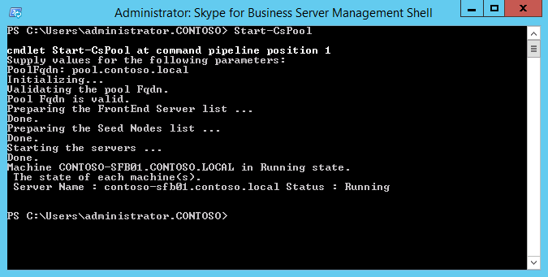

# トポロジ内のサーバーへの Skype for Business Server のインストール
 
**概要:** トポロジの各サーバーに Skype for Business Server システムコンポーネントをインストールする方法について説明します。 [Microsoft の評価センター](https://www.microsoft.com/evalcenter/evaluate-skype-for-business-server)から Skype For business Server の無料トライアルをダウンロードします。
  
トポロジが中央管理ストアに読み込まれ、Active Directory にどのような役割を果たすかがわかっている場合は、トポロジの各サーバーに Skype for Business Server システムをインストールする必要があります。 手順 1 ～ 5 は任意の順序で実行できます。 ただし、手順6、7、8を順番に実行する必要があります。また、図に示されている手順 1 ~ 5 の後に行う必要があります。 Skype for Business サーバーシステムのインストールは、手順 7/8 です。
  

  
## Skype for Business Server system をインストールする

トポロジを公開したら、トポロジの各サーバーに Skype for Business Server コンポーネントをインストールできます。 このセクションでは、Skype for Business Server のインストール方法と、フロントエンドプールのサーバーの役割と、フロントエンドサーバーと連携しているサーバーの役割を設定する手順について説明します。 サーバーの役割をインストールしてセットアップするには、サーバーの役割をインストールするコンピューターごとに、Skype for Business Server 展開ウィザードを実行します。 展開ウィザードを使って、ローカル構成ストアのインストール、フロントエンドサーバーのインストール、証明書の構成、サービスの開始などの4つの展開手順をすべて実行します。
  
> [!IMPORTANT]
> サーバーに Skype for Business Server をインストールするには、トポロジビルダーを使用してトポロジを完了して公開する必要があります。 
  
> [!NOTE]
> この手順は、トポロジ内のすべてのサーバーについて実行する必要があります。 
  
> [!CAUTION]
> フロントエンドサーバーに Skype for Business Server をインストールした後、サービスを初めて起動したときに、そのサーバー上で Windows ファイアウォールサービスが実行されていることを確認する必要があります。 
  
> [!CAUTION]
> この手順を実行する前に、ローカル管理者と RTCUniversalServerAdmins グループの両方のドメインユーザーアカウントでサーバーにログオンしていることを確認してください。 
  
> [!NOTE]
> このサーバーで Skype for Business Server のセットアップを実行していない場合は、インストールのためのドライブとパスを入力するように求められます。 この操作を行うと、システム ドライブ以外のドライブにインストールできます (組織で必要な場合や、容量の問題がある場合)。 [**セットアップ**] ダイアログボックスで、Skype For business Server ファイルのインストール場所のパスを新しい、使用可能なドライブに変更することができます。 このパス (OCSCore など) にセットアップファイルをインストールすると、Skype for Business Server ファイルの残りの部分も一緒に展開されます。
  
> [!IMPORTANT]
> インストールを開始する前に、windows Server が Windows Update を使用して最新の状態になっていることを確認します。 
  

  
### Skype for Business Server system をインストールする

1. Skype for Business Server インストールメディアを挿入します。 自動的にセットアップが開始されない場合は、[**セットアップ**] をダブルクリックします。
    
2. インストール メディアでは、Microsoft Visual C++ が実行されている必要があります。これをインストールするかどうかを確認するダイアログが表示されるので、[**はい**] をクリックします。
    
3. 使用許諾契約書の内容をよく読んでください。同意する場合は [**使用許諾契約書に同意します**] を選択し、[**OK**] をクリックします。 
    
4. スマートセットアップは、図に示すように、インストールプロセス中に Microsoft Update (MU) から更新プログラムを確認するために、インターネットに接続できる Skype for Business Server の機能です。 これで製品に最新の更新プログラムがインストールされていることを確認できるため、作業がしやすくなります。 [**インストール**] をクリックしてインストールを開始します。
    
    > [!NOTE]
    > 多くの組織は社内環境に Windows Server Update Services (WSUS) を展開しています。 管理者は WSUS を使用すると、Microsoft Update からリリースされた更新プログラムを、社内ネットワークにあるコンピューターに配布するかどうかを完全に管理できます。 累積的な更新プログラム1の一部として、Skype for Business Server のリリースでは、スマートセットアップが WSUS で動作するためのサポートが導入されました。 Skype for Business Server を初めて展開しているか、インプレースアップグレード機能を使用して Lync Server 2013 環境からアップグレードしているお客様は、更新プログラムの取得とは異なり、WSUS から Skype for Windows の更新プログラムを取得しています。MU から スマート セットアップを使用することを希望する顧客は、Setup.exe を実行する前にすべてのコンピューターで SmartSetupWithWSUS.psq を実行する必要があります。 
  
     
  
5. 展開ウィザードのページで、[ **Skype For Business Server システムのインストールまたは更新**] をクリックします。
    
6. 次の手順を実行します。完了したら、[**終了**] をクリックして展開ウィザードを閉じます。 プール内のフロントエンド サーバーごとに、上記の手順を繰り返します。
    
### 手順 1: ローカル構成ストアのインストール

1. 前提条件を確認してから、[**手順 1: ローカル構成ストアのインストール**] の横にある [**実行**] をクリックします。
    
    > [!NOTE]
    > ローカル構成ストアは、中央管理ストアの読み取り専用コピーです。Standard Edition の展開では、中央管理ストアは、フロントエンド サーバーの SQL Server Express Edition のローカル コピーを使用して作成されます。これは、ユーザーが [最初の Standard Edition サーバーの準備] 手順を実行した時点に行われます。Enterprise Edition の展開では、中央管理ストアは、Enterprise Edition フロントエンド プールを含むトポロジを公開すると作成されます。 
  
2. [**ローカル構成ストアのインストール**] ページで、[**中央管理ストアから直接取得する**] オプションがオンになっていることを確認し、[**次へ**] をクリックします。
    
    SQL Server Express Edition はローカル サーバーにインストールされます。SQL Server Express Edition は、ローカル構成ストアに必要です。
    
3. ローカル サーバー構成のインストールが完了したら、[**完了**] をクリックします。
    
### 手順 2: Skype for Business Server コンポーネントをセットアップまたは削除する

1. 前提条件を確認し、[**手順 2: Skype For Business Server コンポーネントのセットアップまたは削除**] の横にある [**実行**] をクリックします。
    
2. [ **Skype For Business Server コンポーネント**のセットアップ] ページで、[**次**へ] をクリックして、公開したトポロジで定義されたコンポーネントをセットアップします。
    
3. セットアップが実行されると、[**コマンドの実行**] ページに、コマンドおよびインストール情報の概要が表示されます。 完了したら、一覧を使用して表示するログを選択し、[**ログの表示**] をクリックします。
    
4. Skype for Business Server コンポーネントのセットアップが完了し、必要に応じてログを確認したら、[**完了**] をクリックして、インストールの手順を完了します。
    
    > [!NOTE]
    > サーバーの再起動を求められたら実行します (Windows デスクトップ エクスペリエンスのインストールが必要であった場合など)。 コンピューターを再起動して実行している場合は、この手順をもう一度実行する必要があります (手順 2: Skype for Business Server コンポーネントのセットアップまたは削除) 手順をもう一度実行する必要があります。 
  
    > [!NOTE]
    > 前提条件が満たされていないことがインストーラーで検出されると、図のように、前提条件が満たされていないというメッセージで通知されます。 必要な前提条件を満たし、この手順をもう一度実行してください (手順 2: Skype for Business Server コンポーネントのセットアップまたは削除) 
  
     
  
5. 最初の 2 つの手順が正常に完了したことを確認します。図のように、[**完了**] という語句に緑色のチェックマークが付いていることを確認します。
    
     
  
6. Skype for Business Server コンポーネントをインストールした後に更新プログラムがあるかどうかを確認するには、もう一度**Windows Update**を実行します。
    
### 手順 3: 証明書の要求、インストール、または割り当て

1. 前提条件を確認してから、[**手順 3: 証明書の要求、インストール、または割り当て**] の横にある [**実行**] をクリックします。
    
    > [!NOTE]
    > Skype for Business Server では、Windows 10、windows 8、Windows 7、windows Server 2012 R2、Windows を実行しているクライアントからの接続について、ダイジェストのハッシュと署名アルゴリズムのダイジェストの長さ (224、256、384、または512ビット) をサポートしています。サーバー2012、または Windows Server 2008 R2 オペレーティングシステム。 SHA-2 スイートを使用する外部アクセスをサポートするには、同じビット長のダイジェストを使用する証明書も発行できるパブリック CA が外部証明書を発行する必要があります。 
  
    > [!IMPORTANT]
    > ハッシュ ダイジェストや署名アルゴリズムを選択するには、証明書を使用するクライアントやサーバー、そのクライアントやサーバーが通信するその他のコンピューターやデバイスに関する理解のほか、証明書で使用されるアルゴリズムの使用方法も把握する必要があります。 オペレーティングシステムと一部のクライアントアプリケーションでサポートされているダイジェストの長さについては、「 [WINDOWS PKI ブログ-SHA2 と windows](https://go.microsoft.com/fwlink/p/?LinkId=287002)」を参照してください。 
  
    各 Standard Edition またはフロントエンド サーバーには最大 4 つの証明書 (oAuthTokenIssuer 証明書、既定の証明書、Web 内部証明書、Web 外部証明書) が必要です。 ただし、既定の証明書を要求して、適切なサブジェクトの別名エントリや oAuthTokenIssuer 証明書を割り当てることもできます。 証明書の要件の詳細については、「skype for business [server の環境要件](../../plan-your-deployment/requirements-for-your-environment/environmental-requirements.md)」または「 [Skype for business Server 2019 のサーバー要件](../../../SfBServer2019/plan/system-requirements.md)」を参照してください。
    
    > [!IMPORTANT]
    > 次の手順では、内部 Active Directory 証明書サービス ベースの証明機関から取得した証明書を構成する方法を説明します。 
  
2. **証明書ウィザード**のページで [**要求**] をクリックします。
    
3. [**証明書要求**] ページで関連データを入力 (SIP ドメインの選択を含む) して、[**次へ**] をクリックします。
    
4. [**要求を後で送信または今すぐ送信**] ページで、[**次へ**] をクリックすることで、既定の [**要求をすぐにオンライン証明機関に送信する**] オプションを承諾できます。このオプションを選択した場合、自動オンライン登録による内部 CA を利用可能にする必要があります。要求延期オプションを選択すると、証明書の要求ファイルを保存するための名前と場所の入力を求められます。証明書の要求は、組織内の CA またはパブリック CA へ送信され、そこで処理される必要があります。要求者は証明書応答をインポートして、適切な証明書の役割に割り当てる必要があります。
    
5. [**証明機関 (CA) の選択**] ページで、[**環境内で検出されたリストから ca を選択**する] オプションを選び、一覧から [Active Directory ドメインサービス (Active DIRECTORY Domain Services) ca への登録] を選びます。 または [**別の証明機関を指定してください**] をクリックして、ボックスに別の CA の名前を入力してから、[**次へ**] をクリックします。
    
6. [**証明機関のアカウント**] ページで、CA に対する証明書要求の要求および処理のために、資格情報の入力を求められます。証明書を要求するためには、ユーザー名とパスワードが必要かどうかを、事前に判断する必要があります。必要な情報は CA 管理者が保有しているので、このステップでは CA 管理者のサポートが必要な場合もあります。別の資格情報の入力が必要な場合は、チェック ボックスをオンにして、テキスト ボックスにユーザー名とパスワードを入力してから、[**次へ**] をクリックします。
    
7. [**代替証明書テンプレートの指定**] ページで、既定の Web サーバー テンプレートを使用する場合は [**次へ**] をクリックします。
    
    > [!NOTE]
    > CA の既定の Web サーバー テンプレートの代わりに使用するテンプレートを組織が作成している場合は、チェック ボックスをオンにして、代替テンプレートの名前を入力します。CA 管理者が定義したテンプレートの名前を入力する必要があります。 
  
8. [**名前およびセキュリティの設定**] ページで、[**フレンドリ名**] を指定します。 フレンドリ名を使用すると、証明書と目的を迅速に特定できます。 空白のままにした場合、名前は自動的に生成されます。 キーの [**ビット長**] を設定するか、既定の 2048 ビットをそのまま使用します。 証明書と秘密キーを他のシステムに移動またはコピーする必要があると判断した場合は、**証明書の秘密キーをエクスポート可能としてマーク**するを選び、[**次へ**] をクリックします。
    
    > [!NOTE]
    > Skype for Business Server は、エクスポート可能な秘密キーの要件を最小限に抑えています。 その対象の 1 つがプール内のエッジ サーバーで、ここではメディア リレー認証サービスが、プール内の各インスタンスに対する個々の証明書ではなく、証明書のコピーを使用します。 
  
9. [**組織情報**] ページで、必要に応じて組織情報を入力してから、[**次へ**] をクリックします。
    
10. [**地理情報**] ページで、必要に応じて地理情報を入力してから、[**次へ**] をクリックします。
    
11. [**サブジェクト名/サブジェクト代替名**] ページで、追加するサブジェクトの別名を確認してから、[**次へ**] をクリックします。
    
12. [**SIP ドメインの設定**] ページで、[**SIP ドメイン**] をクリックしてから、[**次へ**] をクリックします。
    
13. [**追加のサブジェクト代替名の構成**] ページで、追加する必須サブジェクトの別名 (今後追加する SIP ドメインで必要になる可能性がある名前を含む) を入力して、[**次へ**] をクリックします。
    
14. [**証明書要求の概要**] ページで、概要情報を確認します。情報が正しい場合には、[**次へ**] をクリックします。設定を修正または変更する必要がある場合には、[**戻る**] をクリックして、該当するページで修正または変更します。
    
15. [**コマンドを実行しています**] ページで、[**次へ**] をクリックします。
    
16. On the **Online Certificate Request Status** page, review the information returned. You should note that the certificate was issued and installed into the local certificate store. 発行とインストールが完了していても有効でないと報告された場合は、CA ルート証明書がサーバーの信頼済みルート CA ストアにインストールされていることを確認してください。 Refer to your CA documentation on how to retrieve a Trusted Root CA certificate. If you need to view the retrieved certificate, click **View Certificate Details**. 既定では、[**証明書を Skype For Business Server の証明書の使用に割り当てる**] のチェックボックスがオンになっています。 If you want to manually assign the certificate, clear the check box, and then click **Finish**.
    
17. 前のページで [**証明書を Skype For Business Server 証明書の使用状況] に割り当てる**ためのチェックボックスをオフにした場合は、[**証明書の割り当て**] ページが表示されます。 Click **Next**.
    
18. [**証明書ストア**] ページで、要求した証明書を選択します。証明書を表示するには、[**証明書の詳細の表示**] をクリックし、[**次へ**] をクリックして続行します。
    
    > [!NOTE]
    > [**オンライン証明書要求の状態**] ページに、証明書が有効でないなど、証明書の問題が表示された場合には、実際の証明書を表示すると問題の解決に役立ちます。証明書が有効でない原因としては、2 つの具体的な問題が考えられます。前述の信頼されたルート CA 証明書がないという問題と、証明書に関連付けられている秘密キーがないという問題です。これらの 2 つの問題を解決するには、CA のドキュメントを参照してください。
  
19. [**証明書の割り当ての概要**] ページに表示された情報から、適切な証明書が割り当てられていることを確認して、[**次へ**] をクリックします。
    
20. [**コマンドの実行**] ページで、コマンドの出力を確認します。割り当てプロセスを確認する場合、またはエラーや警告が発行されたかどうかを確認する場合には、[**ログの表示**] をクリックします。確認を終了したら、[**終了**] をクリックします。
    
21. [**証明書ウィザード**] ページで、図のように、すべてのサービスに OAuthTokenIssuer などの証明書が割り当てられていることを示す緑のチェックがあることを確認してから、[**閉じる**] をクリックします。
    
     
  
    > [!TIP]
    > ラボ環境にインストールして、Active Directory 証明書サービスを使用して証明機関をセットアップした場合、証明書の割り当てを正常に有効にするには、証明書サービスを実行しているサーバーとともにフロントエンド サーバーも再起動する必要があります。 
  
    > [!TIP]
    >  Active Directory 証明書サービスの証明書の詳細については、「 [Active Directory 証明書サービス](https://technet.microsoft.com/en-us/windowsserver/dd448615.aspx)」を参照してください。 
  
### 手順 4: サービスの開始

1. [**手順 4: サービスの開始**] の前提条件を確認します。
    
2. If this is an Enterprise Edition Front End pool with at least three servers, Windows Fabric is used, and you must use the **Start-CsPool** cmdlet. 1つのサーバーが使用されている場合 (常に標準エディションでの場合)、muse **Windowsservice**コマンドレットを使用します。 この例では、プール内の3台のフロントエンドサーバーで Enterprise Edition を使用しています。次の図に示すように、 **Skype For Business Server 管理シェル**を開き、 **Start-cspool**コマンドレットを実行します。 For all other roles, including Standard Edition server, you must use **Start-CsWindowsService**. To deploy roles other than the Front End role, see documentation for those particular roles.
    
     
  
3. すべてのサービスが正常に開始されたら、[**コマンドの実行**] ページで [**終了**] をクリックします。
    
    > [!IMPORTANT]
    > サーバーのサービスを開始するコマンドは、サービスが実際に開始されたことをレポートするベストエフォート型の方法です。 サービスの実際の状態を反映していない場合もあります。 [**サービスの状態 (オプション)**] で Microsoft 管理コンソール (MMC) を開き、図に示すようにサービスが正常に開始されたことを確認することをお勧めします。 Skype for Business Server サービスが開始されていない場合は、MMC でそのサービスを右クリックし、[**開始**] をクリックします。 
  
     
  

