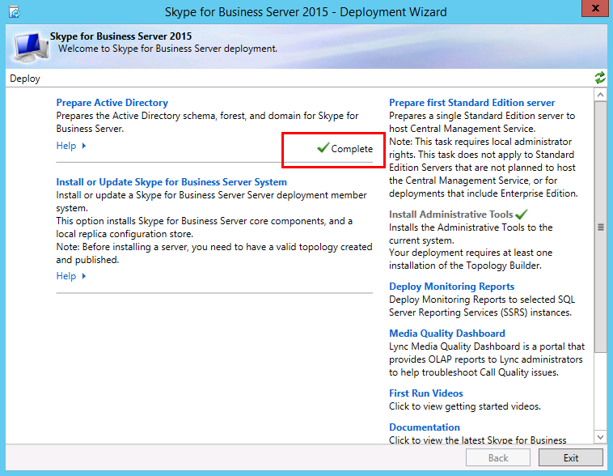

# <a name="skype-for-business-server-prepare-active-directory"></a>Skype for Business Server: Active Directory を準備する
 
**概要：** Skype for Business Serverのインストールのために Active Directory ドメインを準備する方法について説明します。
  
Skype for Business Serverは Active Directory と密接に連携します。 Skype for Business Serverを操作するには、Active Directory ドメインを準備する必要があります。 このプロセスは、展開ウィザードで実行され、ドメインに対して 1 回だけ実行されます。 これは、プロセスによってグループが作成され、ドメインが変更され、1 回だけ行う必要があるためです。 手順 1 ~ 5 は、任意の順序で実行できます。 ただし、図に示すように、手順 6、7、および 8 を順番に実行し、手順 1 ~ 5 の後に実行する必要があります。 Active Directory の準備は、手順 4/ 8 です。 Active Directory の計画の詳細については、[Skype for Business Server 2019 のSkype for Business Serverまたはサーバーの要件に関する](../../../SfBServer2019/plan/system-requirements.md)[環境](../../plan-your-deployment/requirements-for-your-environment/environmental-requirements.md)要件に関するページを参照してください。
  

  
## <a name="prepare-active-directory"></a>Active Directory の準備

Skype for Business Serverは、Active Directory Domain Services (AD DS) と緊密に統合されています。 Skype for Business Serverを初めてインストールする前に、Active Directory を準備する必要があります。 展開ウィザードの 「**Active Directory の準備**」セクションでは、Skype for Business Serverで使用する Active Directory 環境を準備します。
  
> [!NOTE]
> Skype for Business Server (AD DS) を使用して、トポロジ内のすべてのサーバーを追跡して通信します。 これらのサーバーの大部分は、Skype for Business Serverが正常に動作するようにドメインに参加している必要があります。 Edge やリバース プロキシなどのサーバーはドメインに参加しないように注意してください。
  
> [!IMPORTANT]
> Active Directory の準備手順は、展開内の各ドメインに対して 1 回だけ実行する必要があります。 
  
**Active Directory の準備** に関するビデオの手順をご覧ください。
  
> [!video https://www.microsoft.com/videoplayer/embed/RE1Ybuk]
  
### <a name="prepare-active-directory-from-the-deployment-wizard"></a>展開ウィザードから Active Directory を準備する

1. Active Directory ドメインのスキーマ管理者の資格情報を使用してユーザーとしてログオンします。
    
2. 展開ウィザードSkype for Business Server開きます。
    
    > [!TIP]
    > Skype for Business Server展開ウィザードによって作成されたログ ファイルを確認する場合は、展開ウィザードが実行されたコンピューターで、手順を実行した AD DS ユーザーの [ユーザー] ディレクトリにあります。 たとえば、ユーザーがドメインのドメイン管理者である contoso.local としてログオンした場合、ログ ファイルは C:\Users\Administrator.Contoso\AppData\Local\Temp にあります。 
  
3. [ **Active Directory の準備** ] リンクをクリックします。
    
4. **手順 1: スキーマを準備する**
    
    a.  手順 1 のタイトルの下にあるドロップダウンをクリックしてアクセスできる手順 1 の前提条件情報を確認します。
    
    b. 手順 1 で **[実行]** をクリックして、スキーマの準備ウィザードを起動します。
    
    c. 手順は、デプロイごとに 1 回だけ実行し、[ **次へ**] をクリックする必要があることに注意してください。
    
    d.  スキーマが準備されたら、[ログの表示] をクリックしてログを **表示** できます。 
    
    e. [ **完了] を** クリックして [スキーマの準備] ウィザードを閉じ、Active Directory の準備の手順に戻ります。
    
5. **手順 2: スキーマ パーティションのレプリケーションを確認する**
    
    a.  ドメインのドメイン コントローラーにログオンします。
    
    b. **サーバー マネージャー** の **[ツール**] ドロップダウン メニューから **ADSI Edit** を開きます。
    
    c. **[アクション]** メニューで、**[接続]** をクリックします。
    
    d.  **[接続の設定]** ダイアログ ボックスの **[既知の名前付けコンテキストを選択する]** で、**[スキーマ]** を選択して **[OK]** をクリックします。
    
    e. スキーマ コンテナーの下で、 **CN=ms-RTC-SIP-SchemaVersion を検索します**。 このオブジェクトが存在し、 **rangeUpper** 属性の値が 1150 で **rangeLower** 属性の値が 3 の場合、スキーマは正常に更新され、レプリケートされました。 このオブジェクトが存在しない場合、または **rangeUpper** 属性と **rangeLower** 属性の値が指定したとおりでない場合、スキーマは変更されていないか、レプリケートされていません。
    
6. **手順 3: 現在のフォレストを準備する**
    
    a.  手順 3 のタイトルの下にあるドロップダウンをクリックしてアクセスできる手順 3 の前提条件情報を確認します。
    
    b. 手順 3 で **[実行]** をクリックして、現在のフォレストの準備ウィザードを起動します。
    
    c. 手順は、デプロイごとに 1 回だけ実行し、[ **次へ**] をクリックする必要があることに注意してください。
    
    d.  ユニバーサル グループを作成するドメインを指定します。 サーバーがドメインの一部である場合は、[ **ローカル ドメイン**] を選択し、[ **次へ**] をクリックできます。
    
    e. フォレストの準備が完了したら、[ログの表示] をクリックして **ログを表示** できます。 
    
    f. **[完了] を** クリックして [現在のフォレストの準備] ウィザードを閉じ、Active Directory の準備の手順に戻ります。
    
    g. **[アプリ**] ページで **[Skype for Business Server管理シェル**] をクリックして PowerShell を起動します。
    
    h. Get-CsAdForest コマンドを入力し、Enter キーを押 **します**。
    
    i. 結果が **LC_FORESTSETTINGS_STATE_READY** の場合は、図に示すようにフォレストが正常に準備されました。
    
     
  
7. **手順 4: グローバル カタログのレプリケーションを確認する**
    
    a.  ドメイン コントローラー (できれば他のドメイン コントローラーのリモート サイト) で、フォレスト準備が実行されたフォレストで **、Active Directory ユーザーとコンピューター** 開きます。
    
    b. **[Active Directory ユーザーとコンピューター]** で、フォレストまたは子ドメインのドメイン名を展開します。
    
    c. 左側のウィンドウで **[ユーザー** ] コンテナーをクリックし、右側のウィンドウでユニバーサル グループ **CsAdministrator** を探します。 CsAdministrator (Cs で始まる他の新しいユニバーサル グループのうち) が存在する場合、Active Directory レプリケーションは成功しました。
    
    d.  グループがまだ存在しない場合は、レプリケーションを強制するか、15 分待って右側のウィンドウを更新します。 グループが表示されている場合、レプリケーションは完了しています。
    
8. **手順 5: 現在のドメインを準備する**
    
    a.  手順 5 の前提条件情報を確認します。
    
    b. 手順 5 で **[実行]** をクリックして、現在のドメインの準備ウィザードを起動します。
    
    c. この手順は、デプロイ内の各ドメインに対して 1 回だけ実行し、[ **次へ**] をクリックする必要があることに注意してください。
    
    d.  ドメインが準備されたら、[ログの表示] をクリックしてログを **表示** できます。 
    
    e. **[完了] を** クリックして [現在のドメインの準備] ウィザードを閉じ、Active Directory の準備の手順に戻ります。
    
    これらの手順は、Skype for Business Server オブジェクトが見つかったすべてのドメインで完了する必要があります。そうしないと、サービスが開始されない可能性があります。 これには、ユーザー、連絡先オブジェクト、管理グループ、その他の種類のオブジェクトなど、あらゆる種類の Active Directory オブジェクトが含まれます。 Set-CsUserReplicatorConfiguration -ADDomainNamingContextList を使用して、必要に応じて、Skype for Business Server オブジェクトを含むドメインのみを追加できます。
    
9. **手順 6: ドメイン内のレプリケーションを確認する**
    
    a.  **[アプリ**] ページから **[Skype for Business Server管理シェル**] をクリックして PowerShell を起動します。
    
    b. コマンド Get-CsAdDomainを使用して、ドメイン内のレプリケーションを確認します。
    
   ```powershell
   Get-CsAdDomain [-Domain <Fqdn>] [-DomainController <Fqdn>] [-GlobalCatalog <Fqdn>] [-GlobalSettingsDomainController <Fqdn>]
   ```

    > [!NOTE]
    > Domain パラメーターを指定しない場合、値はローカル ドメインに設定されます。 
  
    contoso.local ドメインのコマンドを実行する例:
    
   ```powershell
   Get-CsAdDomain -Domain contoso.local -GlobalSettingsDomainController dc.contoso.local
   ```

    > [!NOTE]
    > パラメーター GlobalSettingsDomainController を使用すると、グローバル設定が格納されている場所を指定できます。 設定がシステム コンテナーに格納されている場合 (一般的に、グローバル設定が構成コンテナーに移行されていないアップグレード展開で使用されます)、AD DS フォレストのルートにドメイン コントローラーを定義します。 グローバル設定を構成コンテナーに保存する (新しい展開または構成コンテナーに設定を移行しているアップグレードの展開で一般的) 場合、フォレストに任意のドメイン コントローラーを定義します。 このパラメーターを指定しない場合、コマンドレットは設定が構成コンテナーに格納され、Active Directory 内の任意のドメイン コントローラーを参照することを前提としています。 
  
    c. 結果が **LC_DOMAINSETTINGS_STATE_READY** の場合、ドメインは正常にレプリケートされました。
    
10. **手順 7: Skype for Business Server コントロール パネルへの管理アクセスを提供するユーザーを追加する**
    
    a.  Domain Admins グループまたは RTCUniversalServerAdmins グループのメンバーとしてログオンします。
    
    b. **Active Directory ユーザーとコンピューター開き**、ドメインを展開し、**ユーザー** コンテナーをクリックし、CSAdministrator を右クリックして、[**プロパティ**] を選択します。
    
    c. [**CSAdministrator のプロパティ**] で、[**メンバー**] タブをクリックします。
    
    d.  [ **メンバー**] タブで [ **追加**] をクリックします。 [**ユーザー、連絡先、コンピューター、サービス アカウント、またはグループの選択**] で、[**選択するオブジェクト名を入力してください**] を見つけます。 CSAdministrators グループに追加するユーザー名またはグループ名を入力します。 **[OK]** をクリックします。
    
    e. [ **メンバー]** タブで、選択したユーザーまたはグループが存在することを確認します。 **[OK]** をクリックします。
    
    > [!CAUTION]
    > Skype for Business Server コントロール パネルは、ロールベースのアクセス制御ツールです。 CsAdministrator グループのメンバーシップにより、使用可能なすべての構成関数に対してSkype for Business Server コントロール パネルフル コントロールを使用しているユーザーが提供されます。 特定の機能向けに設計されたその他の役割も使用できます。 使用可能なロールの詳細については、「[Skype for Business Serverの環境要件](../../plan-your-deployment/requirements-for-your-environment/environmental-requirements.md)」または[「Skype for Business Server 2019 のサーバー要件](../../../SfBServer2019/plan/system-requirements.md)」を参照してください。 管理グループのメンバーにするには、ユーザーがSkype for Business Serverを有効にする必要はありません。 
  
    > [!CAUTION]
    > セキュリティとロールベースのアクセス制御の整合性を維持するために、ユーザーがSkype for Business Server展開の管理で実行するロールを定義するグループにユーザーを追加します。 
  
11. ログオフし、新しいSkype for Business Server セキュリティ グループでセキュリティ トークンが更新されるようにWindowsに再度ログオンし、展開ウィザードを再度開きます。
    
12. 図に示すように、[ **Active Directory を準備** して成功を確認する] の横に緑色のチェックマークが表示されることを確認します。
    
     
  

## <a name="see-also"></a>関連項目
 
[Skype for Business Server 2015 のActive Directory Domain Services](../../plan-your-deployment/security/active-directory-domain-services.md)
