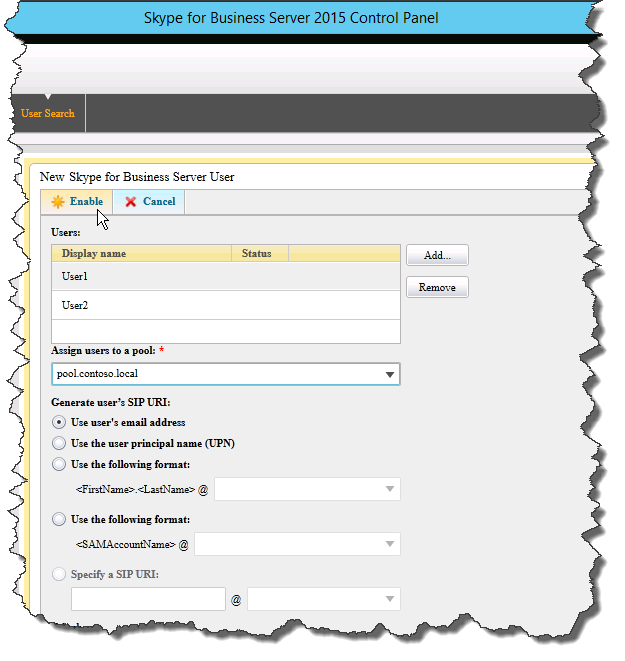

# Skype for Business Server でトポロジを確認する
 
**概要:** Skype for Business Server トポロジと Active Directory サーバーが予期したとおりに動作していることを確認する方法について説明します。 [Microsoft の評価センター](https://www.microsoft.com/evalcenter/evaluate-skype-for-business-server)から Skype For business Server の無料トライアルをダウンロードします。
  
トポロジを公開し、各サーバーに Skype for Business Server システムコンポーネントをインストールしたら、トポロジが予期したとおりに機能しているかどうかを確認できます。 これには、構成がすべての Active Directory サーバーに伝達されていることを確認することによって、ドメイン全体で Skype for Business がドメインで利用可能であることがわかっていることを確認します。 手順 1 ～ 5 は任意の順序で実行できます。 ただし、手順 6、7、および 8 は、手順 1 ～ 5 の後に、図の順序で実行する必要があります。 トポロジの確認は、手順 8/8 です。
  

  
## フロントエンドプールの展開をテストする

最後の手順では、フロントエンドプールをテストし、Skype for Business クライアントが相互に通信できることを確認します。 
  
### ユーザーを追加してクライアント接続を確認する

1. Active Directory コンピューターとユーザーを使って、Skype for Business Server の展開 (Skype for Business Server コントロールパネルがインストールされている) の管理者ロールの Active Directory ユーザーオブジェクトを**csadministrator**グループに追加します。
    
    > [!IMPORTANT]
    > 適切なユーザーとグループを CsAdministors グループに追加していない場合、Skype for Business Server コントロールパネルを開くとエラーが表示されます。 "権限がありません。役割ベースのアクセス制御 (RBAC) 認証エラーによりアクセスが拒否されました。"." 
  
2. ユーザーオブジェクトが現在ログオンしている場合は、ログオフしてから再びログオンして、新しいグループの割り当てを登録します。
    
    > [!NOTE]
    > ユーザーアカウントは、Skype for Business Server を実行しているサーバーのローカル管理者になることはできません。 
  
3. 管理者アカウントを使用して、Skype for Business Server コントロールパネルがインストールされているコンピューターにログオンします。
    
4. Skype for Business Server コントロールパネルを起動し、メッセージが表示されたら、資格情報を入力します。 Skype for Business Server コントロールパネルに展開情報が表示されます。
    
5. 左側のナビゲーションバーで、[**トポロジ**] をクリックし、[サービスの状態] に緑色の矢印が表示されていることを確認し、[レプリケーションの状態] に緑色のチェックマークが表示されることを確認します。これは、展開されてオンラインになっている各 Skype For business Server の役割の隣にあります。 
    
6. 左側のナビゲーションバーで [**ユーザー**] をクリックし、[**ユーザーの有効化**] をクリックします。 
    
7. [**新しい Skype For Business Server ユーザー** ] ページで、[**追加**] をクリックします。
    
8. 検索するオブジェクトの検索パラメーターを定義するには、[ **Active Directory から選択**] ページで [**検索**] を選択し、必要に応じて [**フィルターの追加**] をクリックします。 **Ldap 検索**を選択し、返されるオブジェクトをフィルター処理または制限するための ldap 式を入力することもできます。 検索オプションを決定したら、[**検索**] をクリックします。
    
9. [検索結果] ウィンドウで、追加するユーザーを選び、[ **OK]** をクリックします。
    
10. **新しい Skype For Business Server**の [ユーザー] ページで、選択したユーザーが [**ユーザー** ] 画面に表示されます。 [**プールへのユーザーの割り当て**] ボックスの一覧で、ユーザーが存在する必要があるサーバーを選びます。
    
    次に、オブジェクトを構成するために使用できるオプションの一覧を示します。
    
    - **ユーザーの SIP URI を生成する**
    
    - **テレフォニー**
    
    - **行の URI**
    
    - **会議ポリシー**
    
    - **クライアントのバージョンポリシー**
    
    - **PIN ポリシー**
    
    - **外部アクセスポリシー**
    
    - **アーカイブポリシー**
    
    - **場所のポリシー**
    
    - **クライアントポリシー**
    
    基本機能をテストするには、[**ユーザーの SIP URI の生成**] 設定で希望のオプションを選択し ([構成] のその他のオプションで既定の設定を使用します)、[**有効**にする] をクリックします (図を参照)。
    
     
  
11. 概要ページが表示され、[**有効**] 列にチェックマークが表示され、ユーザーが設定されたことを示します。 **SIP アドレス**列には、ユーザーのサインイン構成に必要なアドレスが表示されます。
    
     
  
12. 1人のユーザーを、ドメインに参加しているコンピューターまたは別のユーザーのドメイン内の別のコンピューターにログオンします。
    
13. 2台の各クライアントコンピューターに Skype for Business クライアントをインストールし、両方のユーザーが Skype for Business Server にサインインして、互いにインスタントメッセージを送信できることを確認します。
    

