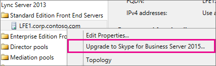

# <a name="upgrade-to-skype-for-business-server-2015"></a>Skype for Business Server 2015 へのアップグレード
 
**の概要:** ビジネス サーバー 2015 Skype まで Lync Server 2013 からアップグレードする方法について説明します。 [マイクロソフト評価センター](https://www.microsoft.com/evalcenter/evaluate-skype-for-business-server)からサーバー 2015 をビジネス用には、Skype の無料試用版をダウンロードします。
  
アップグレードする Lync Server 2013 Skype ビジネス サーバー 2015 のビジネス サーバー トポロジ ビルダーと、インプレース アップグレードの新機能は、Skype を使用して、このドキュメントの手順を使用します。 Lync Server 2010 または通信サーバー 2007 R2 の Office からアップグレードする場合は、[ビジネス サーバー 2015 の Skype へのアップグレード計画](../plan-your-deployment/upgrade.md)を参照してください。

> [!NOTE]
> インプレース アップグレードはビジネス サーバー 2015 の Skype で利用できるが、ビジネス サーバー 2019 の Skype でサポートされていません。 Coexistance のサポートに並べて、[ビジネス サーバー 2019 の Skype への移行](../../SfBServer2019/migration/migration-to-skype-for-business-server-2019.md)の詳細についてを参照してください。
  
## <a name="upgrade-from-lync-server-2013"></a>Lync Server 2013 からのアップグレード

前提条件のソフトウェアをインストールして、プール内のデータベースをアップグレードするのには、Skype のビジネス サーバー トポロジ ビルダーを使用して、それぞれのビジネス サーバーのインプレース アップグレードは、Skype を使用してビジネス サーバー 2015 が含まれる場合は、Skype に Lync Server 2013 をアップグレードする、サーバーがプールに関連付けられています。 アップグレードを完了するには、このトピックの 8 つの手順に従います。
  
### <a name="before-you-begin"></a>始める前に

- [ビジネス サーバー 2015 の Skype へのアップグレード計画](../plan-your-deployment/upgrade.md)を確認します。
    
- [ビジネス サーバー 2015 の Skype のサーバーの要件](../plan-your-deployment/requirements-for-your-environment/server-requirements.md)を確認します。
    
- [Skype サーバー 2015 のビジネスのための前提条件をインストール](install/install-prerequisites.md)します。
    
- [ビジネス サーバー 2015 の Skype をインストール](install/install.md)します。
    
### <a name="step-1-install-administrator-tools-and-download-topology"></a>手順 1: 管理ツールをインストールしてトポロジをダウンロードする

1. Lync OCSCore またはその他の Lync コンポーネントがインストールされていないトポロジ内のコンピューターに接続します。
    
2. ビジネス サーバー 2015 インストール メディアの Skype は、 **OCS_Volume\Setup\AMD64**から**Setup.exe**を実行します。 
    
3. [**インストール**] をクリックします。 
    
4. ライセンス契約に同意します。
    
5. 展開ウィザードで、[**管理ツールのインストール**] をクリックして、インストールの手順に従います。
    
     ![[管理ツールのインストール] へのリンクが強調された展開ウィザードのスクリーン ショット](../media/5bbac2d6-a5b3-42b4-a243-7bcf2b04477a.png)
  
6. Windows の [スタート] 画面で、Skype ビジネス サーバー トポロジ ビルダーを開きます。
    
7. [**既存の展開からトポロジをダウンロードする**] をクリックして、[**次へ**] をクリックします。
    
8. トポロジの名前を入力して、[**保存**] をクリックします。
    
9. トポロジを保存した場所に移動して、トポロジのコピーを作成します。
    
### <a name="step-2-upgrade-and-publish-topology-using-topology-builder"></a>手順 2: トポロジ ビルダーを使用して、トポロジをアップグレードして公開する

アップグレード プロセスを開始する前に、アップグレードを計画するプールのすべてのサービスを実行しなければなりません。 これは、トポロジの変更が、プール内のサーバーのローカル データベースにレプリケートされるようにするためです。
  
> [!IMPORTANT]
>  アップグレードの前に、トポロジ ファイルのコピーを保存します。 アップグレードした後、することはできませんへのダウン グレードのトポロジ。 > 場合、サービスはサービスは、永続的なチャット データベースと同じサーバーで永続的なチャットのように、データベースでは、この手順をスキップするよう同じサーバー上にあると、手順 4 に進みます。 サービスを停止した後、各サーバー上で一括アップグレードのセットアップを実行して、ローカル データベースをアップグレードします。
  
> [!NOTE]
> ミラー化されているバック エンド データベースがトポロジに含まれる場合、トポロジ ビルダーを使用して**トポロジを公開すると**、プリンシパル データベースとミラー化されたデータベースの両方が表示されます。トポロジを公開するときは、すべてのデータベースがプリンシパル上で実行されていて、ミラーではなくプリンシパルのみを選択していることを確認してください。条件が満たされていない場合、トポロジを公開した後に警告が表示されます。
  
アップグレードし、Skype ビジネス サーバー 2015 のトポロジ ビルダーを使用して新しいトポロジを公開するのには、次のオプションのいずれかを選択します。 手順を完了し、アップグレードしたトポロジを公開した後、このトピックの手順 3 に進みます。
  
#### <a name="option-1-upgrade-an-isolated-front-end-pool-and-associated-archiving-and-monitoring-stores"></a>オプション 1: 孤立したフロントエンド プールと、関連するアーカイブ ストアと監視ストアをアップグレードする

アップグレードするプールにアーカイブ ストアと監視ストアの依存関係が存在する場合、以下の手順に従って、アーカイブ ストアと監視ストアもアップグレードされます。
  
1. トポロジ ビルダーでは、Lync Server 2013 プールを右クリックし、**ビジネス サーバー 2015 の Skype へのアップグレード**をするには、選択し、手順に従います。 
    
     
  
2. トポロジ ビルダーで、[**操作**] をクリックします > **公開トポロジ**または**アクション** > **トポロジ** > **発行**します。 
    
     ![トポロジ ビルダーの [アクション] メニューの [トポロジの公開] オプションのスクリーン ショット](../media/d6712634-9205-401f-a0b0-3ea096ca51bf.png)
  
3. 公開時に、アーカイブ ストアと監視ストアへのデータベースのインストールを選択します。
    
#### <a name="option-2-upgrade-front-end-pool-without-upgrading-archiving-and-monitoring-stores"></a>アーカイブと監視ストアをアップグレードせず、オプション 2: アップグレードのフロント エンド プール

以下の手順に従うと、選択したプールのアーカイブと監視が無効になります。アップグレード後、プールにはアーカイブ ストアと監視ストアは存在しなくなります。
  
1. トポロジ ビルダーでは、Lync Server 2013 プールをアップグレードするを選択します。
    
2. Lync Server 2013 のアーカイブと監視ストアに依存関係を削除します。 
    
   - **アクション**に > **のプロパティを編集**します。
    
   - [**アーカイブ**] チェック ボックスをオフにします。
    
     ![[プロパティの編集] ダイアログの [アーカイブ] チェックボックスのスクリーン ショット](../media/9a88427e-80ee-49d0-a767-809fa9a5faf1.png)
  
   - [**監視**] チェック ボックスをオフにします。
    
     ![[監視] チェックボックスを示している、[プロパティの編集] ダイアログのスクリーン ショット](../media/880acf33-57bb-4521-8717-cf5b67261ed4.png)
  
3. Lync Server 2013 プールを右クリックし、**ビジネス サーバー 2015 の Skype へのアップグレード**をするを選択し、手順に従います。 
    
     
  
4. トポロジ ビルダーで、[**操作**] をクリックします > **公開トポロジ**または**アクション** > **トポロジ** > **発行**します。 
    
#### <a name="option-3-upgrade-front-end-pool-and-associated-it-to-new-skype-for-business-server-2015-archiving-and-monitoring-stores"></a>オプション 3: アップグレードのフロント エンド プールと、新規の Skype ビジネス サーバー 2015 のアーカイブおよび監視ストアに関連付けられます

以下の手順に従うと、アーカイブと監視が以前のストアで停止され、作成した新しいストアで開始されます。 
  
1. トポロジ ビルダーでは、Lync Server 2013 プールをアップグレードするを選択します。 
    
2. Lync Server 2013 のアーカイブと監視ストアに依存関係を削除します。 
    
   - **アクション**に > **のプロパティを編集**します。
    
   - [**アーカイブ**] チェック ボックスをオフにします。
    
     ![[プロパティの編集] ダイアログの [アーカイブ] チェックボックスのスクリーン ショット](../media/9a88427e-80ee-49d0-a767-809fa9a5faf1.png)
  
   - [**監視**] チェック ボックスをオフにします。
    
     ![[監視] チェックボックスを示している、[プロパティの編集] ダイアログのスクリーン ショット](../media/880acf33-57bb-4521-8717-cf5b67261ed4.png)
  
3. Lync Server 2013 プールを右クリックし、**ビジネス サーバー 2015 の Skype へのアップグレード**をするを選択し、手順に従います。 
    
     
  
4. アーカイブ用の新しい SQL ストアを作成します。 
    
   - プールと**アクション**を選択して > **のプロパティを編集**します。 
    
   -  [**アーカイブ**] チェック ボックスをオンにします。
    
   - [**新規**] をクリックします。
    
     ![[アーカイブ] セクションの [新規] ボタンを示している、[プロパティの編集] ダイアログのスクリーン ショット](../media/3a4a18e7-8251-4736-837c-2b486f64f896.png)
  
5. 監視用の新しい SQL ストアを作成します。 
    
   - プールと**アクション**を選択して > **のプロパティを編集**します。 
    
   -  [**監視**] チェック ボックスをオンにします。
    
   - [**新規**] をクリックします。
    
     ![[監視] セクションの [新規] ボタンを示している、[プロパティの編集] ダイアログのスクリーン ショット](../media/729c72a7-0068-4e0d-99dc-e480a6bfbf1d.png)
  
6. トポロジ ビルダーで、[**操作**] をクリックします > **公開トポロジ**または**アクション** > **トポロジ** > **発行**します。 
    
7. 公開時に、新しいアーカイブ ストアと監視ストアへのデータベースのインストールを選択します。
    
### <a name="step-3-wait-for-replication"></a>手順 3: レプリケーションを待機する

更新されたトポロジを、環境内のすべてのサーバーに公開するために、レプリケーションが完了するまで少し待ちます。
  
### <a name="step-4-stop-all-services-in-pool-to-be-upgraded"></a>手順 4: アップグレードするプールですべてのサービスを停止する

各サーバー上で処理しようとしているアップグレード、PowerShell で次のコマンドレットを実行するプール。
  
```
Disable-CsComputer -Scorch
```

埋め込みのアップグレード処理中にサーバーを再起動する必要がありますので、無効にする CsComputer を使用することをお勧めします。 Stop CsWindowsService を使用する場合を再起動した後、一部のサービスが自動的に再起動可能性があります。 埋め込みアップグレードの失敗があります。
  
### <a name="step-5-upgrade-front-end-pools-and-non-front-end-pool-servers"></a>手順 5: フロントエンド プールと非フロントエンド プール サーバーをアップグレードする

> [!NOTE]
>  すべて新しい必要条件が Skype のビジネス サーバー 2015 を含むをインストールしてくださいアップグレードする前に: > 32 GB 以上のアップグレードを実行する前に空き領域の。 さらに、確認するドライブは、ローカルの固定ドライブ、USB または Firewire で接続されていない、NTFS ファイル システムでフォーマットされたが圧縮されていない、および含まれていないページのファイル > PowerShell バージョン 6.2.9200.0 またはそれ以降です。 > 最新の Lync Server 2013。累積的な更新プログラムをインストールします > SQL Server 2012 SP1 がインストールされている。 > 次の KB (インストールされている自動的に Microsoft Update を使用する場合) にインストールされている: > Windows Server 2008 R2 の -[KB2533623](https://support.microsoft.com/kb/2533623)> Windows Server 2012 -[KB2858668](https://support.microsoft.com/kb/2858668)> Windows。Server 2012 R2 -[KB2982006](https://support.microsoft.com/kb/2982006)
  
使用して、埋め込みのアップグレード各サーバーのフロント エンド プール、エッジ プール、仲介サーバー、および永続的なチャット プールを更新します。
  
1. 各サーバー上には、ビジネス サーバー 2015 インストール メディアの Skype の**OCS_Volume\Setup\amd64**から**Setup.exe**を実行します。
    
2. ライセンス契約に同意し、埋め込みのアップグレードの指示に従います。
    
3. 以外のフロント エンド プールの各サーバーでフロント エンド プール内の各サーバーに対してこの手順を繰り返します。
    
> [!NOTE]
> インプレース アップグレード中にサーバーを再起動するように求められます可能性があります。 いいですよ。 再起動すると、埋め込みのアップグレードが引き続きところから。 
  
一括アップグレードが正常に完了すると、次のメッセージが表示されます。
  

  
### <a name="step-6-restart-services-on-all-upgraded-servers"></a>手順 6: アップグレードしたすべてのサーバーでサービスを再開する

> [!NOTE]
> サービスを再起動する前にすべてのフロント エンド サーバー上に %ProgramData%\WindowsFabric が存在しないことを確認してください。 存在する場合は、サービスを開始する前に削除します。 
  
- フロント エンド プール内のすべてのサーバーをアップグレードした後は、次の PowerShell コマンドを使用してサービスを再起動します。 
    
  ```
  Start-CsPool
  ```

    > [!NOTE]
    > 一括アップグレードの実行開始前に再起動が必要な保留中のシステムが既に存在する場合は、インストールの最後に一括アップグレードから再起動は求められません。これにより、Start-CSPool コマンドレットを使用してサービスを開始しようとすると、最初のフロントエンド サーバーに対してアセンブリ例外がスローされます。このようなエラーを解決するには、プール内の全サーバーを再起動し、このコマンドレットをもう一度実行してください。 
  
- 非フロントエンド プール サーバーでは、以下のコマンドを実行してサービスを再開します。
    
  ```
  Start-CsWindowsService
  ```

一括アップグレードのページで [**OK**] をクリックした後、この手順を完了するための以下の通知が表示されます。
  

  
### <a name="step-7-verify-skype-for-business-functionality-works"></a>手順 7: Skype ビジネス機能の動作のことを確認してください。

アップグレードが正常にアップグレードされたプールを確認するには、機能が期待どおりに動作しているかどうかを確認するのにはビジネス用の Skype をテストします。 
  
### <a name="step-8-upgrade-secondary-pools"></a>手順 8: 二次的なプールをアップグレードする

このトピックの手順を繰り返して、環境に存在する他のプールをすべてアップグレードします。
  
## <a name="troubleshoot-issues-with-the-in-place-upgrade"></a>一括アップグレードの問題をトラブルシューティングする

一括アップグレードが失敗すると、次の図のようなメッセージが表示される場合があります。 
  

  
ページの下部にあるすべてのメッセージを確認して、問題のトラブルシューティングに役立てます。詳細情報を表示するには、[**ログの表示**] をクリックします。
  
埋め込みのアップグレードは、**アップグレードの準備完了を確認**または**不足している必須コンポーネントのインストール**に失敗すると場合、すべて最新 Windows サーバー、Lync Server、および SQL Server の更新プログラムを適用し、必要なすべてのソフトウェアには、サーバーの役割は、ことを確認します。インストールされています。 必要な要素のリストは、[ビジネス サーバー 2015 の Skype のサーバー要件](../plan-your-deployment/requirements-for-your-environment/server-requirements.md)と[ビジネス サーバー 2015 の Skype のための前提条件のインストール](install/install-prerequisites.md)を参照してください。
  
## <a name="see-also"></a>関連項目

[Skype for Business Server 2015 へのアップグレードの計画](../plan-your-deployment/upgrade.md)
  
[Skype for Business Server 2015 のサーバー要件](../plan-your-deployment/requirements-for-your-environment/server-requirements.md)
  
[Skype for Business Server 2015 の前提条件のインストール](install/install-prerequisites.md)
  
[Skype for Business Server 2015 のインストール](install/install.md)