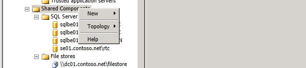

# 共有コンポーネント スコープ ノード
 
右クリックする**共有コンポーネント**に新規の共有コンポーネントを作成するか、トポロジ レベルのオプションにアクセスする、トポロジ ビルダーの階層ツリーです。
  

  
新しいファイルストア、新しい IP ネットワーク アドレス、新しいオフィスの Web アプリケーション サーバー、新しい SQL Server ストア、または新しい樹幹を作成する**新規**を選択します。
  
> [!NOTE]
> これらのオプションのヘルプ トピックを参照してください。 
  

  
新しいトポロジ ドキュメントを開くためのオプションをクリックする**トポロジ**を選択します。 文書を開く、既存のトポロジ、現在のトポロジを中央管理ストアからのダウンロード、現在構成されているデータベースの構成を作成するには、トポロジの現在のドキュメントを公開、データベースのインストールは現在のトポロジ ドキュメントのコピーの保存現在の展開または展開を削除するのには、Office 通信 Server 2007 の R2 をマージします。
  

  

