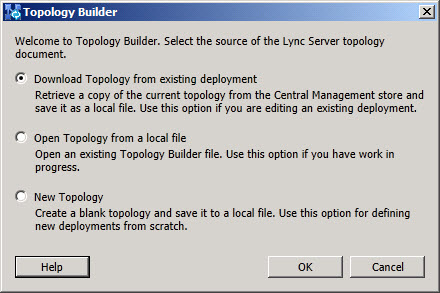

# トポロジ ビルダー起動ダイアログ
 
プロパティおよび配置の構成を構成するのにはトポロジ ビルダーを起動するとします。 、起動時には、トポロジ ビルダーは、トポロジ ドキュメントのソースで何ができるかを確認するダイアログを表示します。 3 つのオプションのいずれかを選択するとします。
  
- **既存の展開からトポロジをダウンロード**トポロジ ビルダーを実行し、サーバーの全体管理サーバーに、トポロジが正常に発行された場合は、このオプションを選択します。 このオプションは要求し、編集し、既存の配置を構成することを許可する、現在の構成のローカル コピーをダウンロードします。
    
- **ローカル ファイルからトポロジを開く**展開の構成は、構成にまだ発行していない場合は、このオプションを選択します。 このオプションを使用すると、トポロジ ビルダーの構成作業のローカル コピーを保存し、後でに戻ることができます。
    
- **新しいトポロジ**新しいトポロジ ドキュメントの構成を開始するには、このオプションを選択します。 このオプションは、構成する展開の要件を満たすために構成した新しいトポロジ ドキュメントを開きます。
    

  
