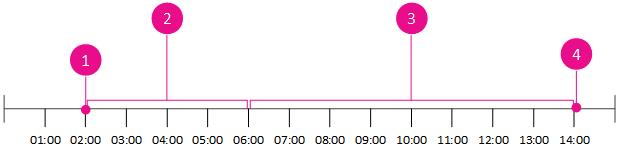

# <a name="stage-av-and-oauth-certificates-in-skype-for-business-server-2015-using--roll-in-set-cscertificate"></a>Skype for Business Server 2015 での Set-CsCertificate で -Roll を使用した音声ビデオおよび OAuth 証明書のステージング
 
**の概要:**ステージ AV と OAuth の証明書サーバー 2015 のビジネス用の Skype のです。
  
オーディオ/ビデオ (A/V) の通信は、ビジネス サーバー 2015 の Skype の重要なコンポーネントです。 A に割り当てられている証明書に基づいて、アプリケーションの共有、オーディオおよびビデオ会議などの機能と音声ビデオ エッジ サービス、具体的には、A/V 認証サービスです。
  
> [!IMPORTANT]
> この新しい機能が用意されています a/V エッジ サービスおよび OAuthTokenIssuer 証明書。 A とその他の種類の証明書を準備することができます証明書の種類ですが、共存の問題からもメリットはありません音声ビデオ エッジ サービスと OAuth とを A と、音声ビデオ エッジ サービスの証明書は。
  
Skype をビジネス サーバー 2015 の証明書を管理するために使用されるビジネス サーバー管理シェルの PowerShell コマンドレットの Skype は、A/V エッジ AudioVideoAuthentication 証明書の種類として証明書と、OAuthServer 証明書としてのサービスtypeOAuthTokenIssuer。 証明書を一意に識別するのには、このトピックの以降は、それらを参照、同じ識別子の種類、AudioVideoAuthentication andOAuthTokenIssuer で。
  
A/V 認証サービスは、クライアントおよびその他の A で使用されるトークンの発行を担当すると V の消費者です。 トークンが、証明書の属性から生成され、証明書が期限切れになったときの接続と新しい証明書によって生成された新しいトークンを使用して再度参加する必要性が失われます。 ビジネス サーバー 2015 の Skype の新機能では、この問題では、古いものを期限切れにし、引き続き一定期間の両方の証明書を許可する前に新しい証明書を段階的に機能を緩和します。 この機能は、ビジネスのサーバー管理シェル コマンドレットのセット CsCertificate Skype で更新された機能を使用します。 新しいパラメーターにロールバックするには、既存のパラメーターを使用して - EffectiveDate は、証明書ストアに新しい AudioVideoAuthentication 証明書が配置されます。 古い AudioVideoAuthentication 証明書に対して検証するのには発行されたトークンの残ります。 AudioVideoAuthentication 証明書の新規の場所に配置することから、次の一連のイベントが発生します。
  
> [!TIP]
> Skype を使用して、証明書を管理するためのビジネス サーバー管理シェル コマンドレットは、エッジ サーバー上でそれぞれの目的とは別の証明書を要求できます。 Skype のビジネス サーバーの展開ウィザードの証明書ウィザードを使用して、証明書の作成に役立つが、通常どのカップル単一の証明書をエッジ サーバーのすべての証明書を使用して、**既定**の種類の。 ローリング証明書機能を使用する場合は、AudioVideoAuthentication 証明書を他の証明書の用途から切り離すことをお勧めします。 既定の種類の証明書をプロビジョニングおよびステージングすることもできますが、結合された証明書の AudioVideoAuthentication 部分のみがステージングによる恩恵を受けます。 (たとえば) に関連するインスタント メッセージの会話、証明書の有効期限が切れたときにする必要があるして再度ログインするには、アクセス エッジ サービスに関連付けられている新しい証明書を使用します。 ユーザーが Web 会議エッジ サービスを使用して Web 会議に関連する同様の現象が発生します。 OAuthTokenIssuer 証明書は、すべてのサーバーの間で共有される特定の種類の証明書です。 証明書が格納されているとを作成し、1 つの場所に証明書を管理する中央管理ストア内の他のすべてのサーバーです。
  
Set-CsCertificate コマンドレットを使用するとき、および現在の証明書の有効期限が切れる前にこのコマンドレットを使用して証明書をステージングするときのオプションと要件を十分に理解するには、さらに詳しい説明が必要です。 -ロール パラメーターが重要ですが、基本的に 1 つの目的です。 セット CsCertificate、証明書の情報に影響を受けるので定義されているを提供することをパラメーターとして定義する場合 (たとえば AudioVideoAuthentication、OAuthTokenIssuer など) の種類の証明書がいつになります。-EffectiveDate で定義されている有効です。
  
 **・ ロール ・**: パラメーターは必須では、一緒に指定する必要がある依存関係は、ロール。 どの証明書が影響を受け、どのように適用されるかを完全に定義するための必須パラメーターです。
  
 **-EffectiveDate**: パラメーター EffectiveDate の定義、新しい証明書が現在の証明書を持つ co-active になります。 -EffectiveDate は、現在の証明書の有効期限の時刻の近くに、または時間の長い期間を指定できます。 推奨される最小の EffectiveDate AudioVideoAuthentication 証明書の AV エッジ サービスのトークンが AudioVideoAuthentication の証明書を使用して発行の既定値トークンの有効期間は 8 時間があります。
  
OAuthTokenIssuer 証明書をステージングするときは、証明書が有効になるまでのリード タイムの要件が異なります。OAuthTokenIssuer 証明書のリード タイムは、現在の証明書の有効期限が切れる 24 時間以上前に設定する必要があります。共存のリード タイムが長いのは、OAuthTokenIssuer 証明書に依存する他のサーバーの役割 (たとえば Exchange Server) で、証明書によって作成された認証と暗号化キー材料の保有期間が長いためです。
  
 **-Thumbprint**: 拇印は証明書の属性で、証明書ごとに一意となります。 拇印セット CsCertificate コマンドレットの操作が影響を受ける証明書を識別するパラメーターを使用します。
  
 **-タイプ**: の型パラメーターは、単一の証明書の使用法の種類や証明書の使用法の種類のコンマ区切りのリストを受け入れることができます。 証明書の種類は、証明書の目的は、どのようなコマンドレットと、サーバーを識別するものです。 AudioVideoAuthentication の種類は、A で使用すると音声ビデオ エッジ サービス、および AV の認証サービスです。 場合は別の種類のステージとプロビジョニングの証明書を同時は、証明書の最長必要最低限効果的なリード時間を考慮する必要があります。 たとえば、する必要がありますの種類の証明書をステージに AudioVideoAuthentication と OAuthTokenIssuer。 EffectiveDate 最小は、この場合は、OAuthTokenIssuer は、最小のリード タイムが 24 時間の内、2 つの証明書のうち、大きい方である必要があります。 AudioVideoAuthentication 証明書と 24 時間のリード タイムを段階的にしたくない場合にお客様の要件には、EffectiveDate とは別にステージです。
  
### <a name="to-update-or-renew-an-av-edge-service-certificate-with-a--roll-and--effectivedate-parameters"></a>更新または A を更新する-ロールと EffectiveDate ・ パラメーターを使用して音声ビデオ エッジ サービスが証明書と

1. Administrators グループのメンバーとして、ローカル コンピューターにログオンします。
    
2. A 上の既存の証明書のエクスポート可能な秘密キーの更新または新しい証明書の AudioVideoAuthentication を要求すると音声ビデオ エッジ サービスです。
    
3. 新しい AudioVideoAuthentication 証明書をエッジ サーバーと、プール内の他のすべてのエッジ サーバーにインポートし、(展開されたプールの場合)。
    
4. セット CsCertificate コマンドレットを使用してインポートする証明書を構成しを使用してロール パラメーターを指定する-EffectiveDate パラメーターを持つ。 有効日は、現在の証明書の有効期限 (14:00:00 または 2:00:00 PM) からトークン存続時間 (既定では 8 時間) を引いた値で定義します。 これにより、証明書をアクティブに設定する必要がある時は、- EffectiveDate\<文字列\>:「2015/7/22 午前 6:00:00"です。 
    
    > [!IMPORTANT]
    > エッジ プールに対して、すべての AudioVideoAuthentication 証明書を展開し、展開可能な A を避けるために証明書の最初の - EffectiveDate パラメーターで定義されたときの日時でを設定する必要があります/旧バージョンのための V の通信停止クライアントとコンシューマーのすべてのトークンは、新しい証明書を使用して書き換えられている場合がある前に有効期限が切れる証明書です。 
  
    セット-CsCertificate は - ロールと EffectiveTime のパラメーターを使用してコマンドします。
    
  ```
  Set-CsCertificate -Type AudioVideoAuthentication -Thumbprint
          <thumb print of new certificate> -Roll -EffectiveDate <date and time
          for certificate to become active>
  ```

    Set-CsCertificate コマンドの例を次に示します。
    
  ```
  Set-CsCertificate -Type AudioVideoAuthentication -Thumbprint
          "B142918E463981A76503828BB1278391B716280987B" -Roll -EffectiveDate "7/22/2015
          6:00:00 AM"
  ```

    > [!IMPORTANT]
    > EffectiveDate は、サーバーの地域と言語の設定に一致するようにフォーマットしなければなりません。 この例で使用している地域と言語の設定は英語 (米国) です。 
  
さらにそのセット CsCertificate のロール、および EffectiveDate - AudioVideoAuthentication を検証するために既存の証明書を使用中に使用されている新規の AudioVideoAuthentication トークンを発行するための新しい証明書を段階的にプロセスを理解するには消費者は、ビジュアルのタイムラインは、プロセスを理解するための効果的な手段です。 次の例では、管理者が決定する、A 音声ビデオ エッジ サービスの証明書は 2015/07/22 の 2時 00分: 00 PM に有効期限。 要求彼と新しい証明書を受信し、プール内の各エッジ サーバーにインポートします。 2015/07/22 の 2 AM、彼が開始の役割を持つ Get CsCertificate を実行して、拇印は、新しい証明書の拇印文字列に等しい] および [EffectiveTime-2015/07/22 に設定 6時 00分: 00 AM。 彼は、各エッジ サーバーでこのコマンドを実行します。
  

  
|**引き出し**|**ステージ**|
|:-----|:-----|
|1  <br/> |開始: 2015 年 7 月 22 日午前 12:00:00  <br/> 現在の AudioVideoAuthentication 証明書の有効期限が 2015 年 7 月 22 日の午後 2:00:00 に終了します。これは証明書の有効期限タイムスタンプにより決定されます。既存の証明書が有効期限に達する前の 8 時間のオーバーラップ (既定のトークン寿命) を考慮して、証明書の交換とロールオーバーを計画します。この例では、午前 2:00:00 のリード タイムを使用して、管理者が有効時刻の午前 6:00:00 の前に新しい証明書を配置およびプロビジョニングするための適切な時間を確保しています。  <br/> |
|2  <br/> |2015 年 7 月 22 日午前 2:00:00 ～ 2015 年 7 月 22 日午前 5:59:59  <br/> 6時 00分: 00 (4 時間以内リード タイムは、この例が、長くすることができます) の有効期間と、エッジ トランスポート サーバーの証明書を設定セット CsCertificate を使用する-タイプ\<証明書の使用法の種類\>・拇印\<新しい証明書の拇印\>-ロール ・ EffectiveDate\<新しい証明書の有効期間の日付時刻文字列\>  <br/> |
|3  <br/> |2015 年 7 月 22 日午前 6:00 ～ 2015 年 7 月 22 日午後 2:00  <br/> トークンを検証するためにまず新しい証明書が試されます。新しい証明書でトークンの検証に失敗した場合、古い証明書が試されます。8 時間 (既定のトークン寿命) のオーバーラップ期間中にすべてのトークンにこの処理が適用されます。  <br/> |
|4  <br/> |終了: 2015 年 7 月 22 日午後 2:00:01  <br/> 古い証明書の期限が切れ、新しい証明書に引き継がれます。 削除 CsCertificate で、古い証明書を安全に削除できます-タイプ\<証明書の使用法の種類\>-前  <br/> |
   
有効時刻 (2015 年 7 月 22 日午前 6:00:00) になると、新しいトークンはすべて新しい証明書によって発行されます。 トークンを検証する場合、トークンはまず新しい証明書に照らして検証されます。 検証が失敗した場合は、古い証明書が試されます。 新しい証明書を試してから古い証明書にフォールバックするこのプロセスは、古い証明書の有効期限まで続きます。 古い証明書の有効期限が切れた後は (2015 年 7 月 22 日午後 2:00)、トークンは新しい証明書のみを使用して検証されます。 古い証明書を削除 CsCertificate コマンドレットを使用して安全に削除する前のパラメーターを使用します。

```
Remove-CsCertificate -Type AudioVideoAuthentication -Previous
```

### <a name="to-update-or-renew-an-oauthtokenissuer-certificate-with-a--roll-and--effectivedate-parameters"></a>更新するか、OAuthTokenIssuer を更新する-ロールと EffectiveDate ・ パラメーターを使用して証明書の

1. Administrators グループのメンバーとして、ローカル コンピューターにログオンします。
    
2. フロント エンド サーバー上の既存の証明書のエクスポート可能な秘密キーを更新または新規の OAuthTokenIssuer 証明書を要求します。
    
3. (プール展開の場合) は、プール内のフロント エンド サーバーに新しい OAuthTokenIssuer 証明書をインポートします。 OAuthTokenIssuer 証明書はグローバルにレプリケートされるので、展開内の任意のサーバーで更新と書き換えを行うだけで十分です。 例としては、フロント エンド サーバーが使用されます。
    
4. セット CsCertificate コマンドレットを使用してインポートする証明書を構成しを使用してロール パラメーターを指定する-EffectiveDate パラメーターを持つ。 有効日は、現在の証明書の有効期限 (14:00:00 または 2:00:00 PM) から少なくとも 24 時間を引いた値で定義します。 
    
    セット-CsCertificate は - ロールと EffectiveTime のパラメーターを使用してコマンドします。
    
  ```
  Set-CsCertificate -Type OAuthTokenIssuer -Thumbprint <thumb
          print of new certificate> -Roll -EffectiveDate <date and time for
          certificate to become active> -identity Global 
  ```

Set-CsCertificate コマンドの例を次に示します。
    
  ```
  Set-CsCertificate -Type OAuthTokenIssuer -Thumbprint
          "B142918E463981A76503828BB1278391B716280987B" -Roll -EffectiveDate "7/21/2015
          1:00:00 PM" 
  ```

> [!IMPORTANT]
> EffectiveDate は、サーバーの地域と言語の設定に一致するようにフォーマットしなければなりません。 この例で使用している地域と言語の設定は英語 (米国) です。 
  
有効時刻 (2015 年 7 月 21 日午前 1:00) になると、新しいトークンはすべて新しい証明書によって発行されます。 トークンを検証する場合、トークンはまず新しい証明書に照らして検証されます。 検証が失敗した場合は、古い証明書が試されます。 新しい証明書を試してから古い証明書にフォールバックするこのプロセスは、古い証明書の有効期限まで続きます。 古い証明書の有効期限が切れた後は (2015 年 7 月 22 日午後 2:00)、トークンは新しい証明書のみを使用して検証されます。 古い証明書を削除 CsCertificate コマンドレットを使用して安全に削除する前のパラメーターを使用します。
```
Remove-CsCertificate -Type OAuthTokenIssuer -Previous 
```

## <a name="see-also"></a>関連項目

#### 

[サーバーからサーバーへの認証 (OAuth) とビジネス サーバー 2015 の Skype のパートナーのアプリケーションを管理します。](server-to-server-and-partner-applications.md)
#### 

[セット CsCertificate](https://docs.microsoft.com/powershell/module/skype/set-cscertificate?view=skype-ps)
  
[削除 CsCertificate](https://docs.microsoft.com/powershell/module/skype/remove-cscertificate?view=skype-ps)

