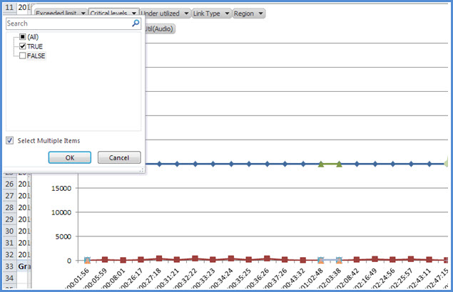
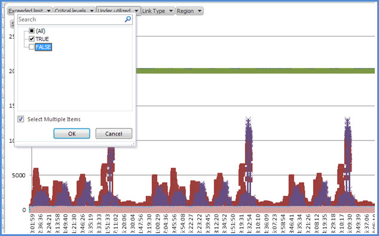
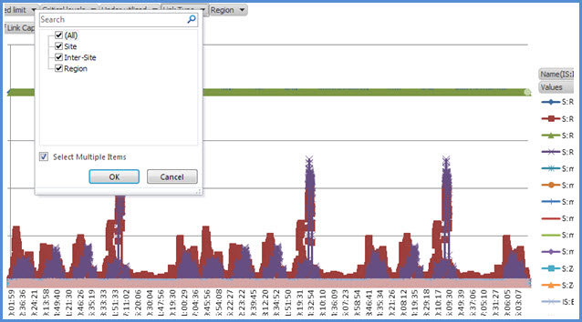

# <a name="skype-for-business-server-2015-resource-kit-tools-documentation"></a><span data-ttu-id="81a85-107">Skype for Business Server 2015 リソースキットツールのドキュメント</span><span class="sxs-lookup"><span data-stu-id="81a85-107">Skype for Business Server 2015 Resource Kit Tools Documentation</span></span>

<span data-ttu-id="81a85-108">このトピックでは、Skype for Business Server 2015 リソースキットのツールについて説明します。これらのツールは、各ツールの目的や使用例を含みます。</span><span class="sxs-lookup"><span data-stu-id="81a85-108">This topic describes the tools in the Skype for Business Server 2015 Resource Kit, including the purpose of each tool, and examples of its use.</span></span> <span data-ttu-id="81a85-109">Skype for Business Server 2015 リソースキットは、Skype for business Server 2015 を展開して管理する IT 管理者にとって、日常的な作業を容易にするのに役に立ちます。</span><span class="sxs-lookup"><span data-stu-id="81a85-109">The Skype for Business Server 2015 Resource Kit helps to make routine tasks easier for IT administrators who deploy and manage Skype for Business Server 2015.</span></span> <span data-ttu-id="81a85-110">たとえば、 **Web Conf data**ツールを使用すると、オンライン会議中にユーザーによってアップロードされるデータを簡単に制御できます。</span><span class="sxs-lookup"><span data-stu-id="81a85-110">For example, the **Web Conf Data** tool can be used to easily control data that is uploaded by users during an online meeting.</span></span> <span data-ttu-id="81a85-111">**SEFAUtil**ツールを使用して、代理人の着信の転送とユーザーへの応答を設定することができます。</span><span class="sxs-lookup"><span data-stu-id="81a85-111">The **SEFAUtil** tool can be used to set up delegate call forwarding and answering for users.</span></span> <span data-ttu-id="81a85-112">IT 管理者は、これらのツールを使用して、Skype for Business Server 2015 をさらに効果的に管理することをお勧めします。</span><span class="sxs-lookup"><span data-stu-id="81a85-112">We encourage IT administrators to use these tools to more effectively manage Skype for Business Server 2015.</span></span>

## <a name="installation-of-the-resource-kit-tools"></a><span data-ttu-id="81a85-113">リソースキットツールのインストール</span><span class="sxs-lookup"><span data-stu-id="81a85-113">Installation of the Resource Kit Tools</span></span>

<span data-ttu-id="81a85-114">Skype for Business Server 2015 リソースキットをインストールするには、ダウンロードセンターから[ocsreskit.msi](https://www.microsoft.com/download/details.aspx?id=52631)をダウンロードします。</span><span class="sxs-lookup"><span data-stu-id="81a85-114">To install the Skype for Business Server 2015 Resource Kit, download [OCSReskit.msi](https://www.microsoft.com/download/details.aspx?id=52631) from the Download Center.</span></span>

<span data-ttu-id="81a85-115">**Ocsreskit.msi**を実行して、単純なインストールを実行します。</span><span class="sxs-lookup"><span data-stu-id="81a85-115">Run **OCSResKit.msi** to do a simple installation.</span></span> <span data-ttu-id="81a85-116">.Msi は、次のパスにあるすべてのツールをインストールします。 **% Program Files%\Skype For Business Server 2015 \ うえ**。</span><span class="sxs-lookup"><span data-stu-id="81a85-116">The .msi installs all the tools in the following path: **%Program Files%\Skype for Business Server 2015\ResKit**.</span></span> <span data-ttu-id="81a85-117">このフォルダーには、自己完結型の実行可能ファイルであるツールがあります。</span><span class="sxs-lookup"><span data-stu-id="81a85-117">Tools that are self-contained executables are in this folder.</span></span> <span data-ttu-id="81a85-118">また、サポートファイルを含むツールは、独自のサブフォルダーに格納されます。</span><span class="sxs-lookup"><span data-stu-id="81a85-118">Tools that also have supporting files are in their own subfolders.</span></span>

## <a name="supported-environments"></a><span data-ttu-id="81a85-119">サポートされる環境</span><span class="sxs-lookup"><span data-stu-id="81a85-119">Supported Environments</span></span>

<span data-ttu-id="81a85-120">Skype for Business server 2015 リソースキットは、skype for business server 2015 の実行に使用されているように、通常、skype for business server 2015 に必要な仕様を満たしているサーバーにインストールする必要があります。</span><span class="sxs-lookup"><span data-stu-id="81a85-120">The Skype for Business Server 2015 Resource Kit should be installed on a server that meets the specifications required for Skype for Business Server 2015, usually one being used to run Skype for Business Server 2015.</span></span>

## <a name="resource-kit-tools-overview"></a><span data-ttu-id="81a85-121">リソースキットツールの概要</span><span class="sxs-lookup"><span data-stu-id="81a85-121">Resource Kit Tools Overview</span></span>

<span data-ttu-id="81a85-122">以下に、Skype for Business Server 2015 リソースキットで提供されるツールの一覧を示します。</span><span class="sxs-lookup"><span data-stu-id="81a85-122">The following is a list of the tools that are provided in the Skype for Business Server 2015 Resource Kit.</span></span> <span data-ttu-id="81a85-123">各ツールの説明 (要件および使用例を含む) については、以下のセクションで説明します。</span><span class="sxs-lookup"><span data-stu-id="81a85-123">A description of each tool, including the requirements and example usage is covered in the following sections.</span></span>

- [<span data-ttu-id="81a85-124">ABSConfig</span><span class="sxs-lookup"><span data-stu-id="81a85-124">ABSConfig</span></span>](resource-kit-tools.md#ABSConfig)

- [<span data-ttu-id="81a85-125">帯域幅ポリシーサービスモニター</span><span class="sxs-lookup"><span data-stu-id="81a85-125">Bandwidth Policy Service Monitor</span></span>](resource-kit-tools.md#bpsm)

- [<span data-ttu-id="81a85-126">帯域幅使用率アナライザー</span><span class="sxs-lookup"><span data-stu-id="81a85-126">Bandwidth Utilization Analyzer</span></span>](resource-kit-tools.md#bua)

- [<span data-ttu-id="81a85-127">コール Par・メータ計</span><span class="sxs-lookup"><span data-stu-id="81a85-127">Call Parkometer</span></span>](resource-kit-tools.md#callpark)

- [<span data-ttu-id="81a85-128">DBAnalyze</span><span class="sxs-lookup"><span data-stu-id="81a85-128">DBAnalyze</span></span>](resource-kit-tools.md#dba)

- [<span data-ttu-id="81a85-129">ストレージサービスデータのインポート</span><span class="sxs-lookup"><span data-stu-id="81a85-129">Import Storage Service Data</span></span>](resource-kit-tools.md#Issd)

- [<span data-ttu-id="81a85-130">LCSSync</span><span class="sxs-lookup"><span data-stu-id="81a85-130">LCSSync</span></span>](resource-kit-tools.md#LCSSync)

- [<span data-ttu-id="81a85-131">参照ユーザーコンソール</span><span class="sxs-lookup"><span data-stu-id="81a85-131">Lookup User Console</span></span>](resource-kit-tools.md#LUC)

- [<span data-ttu-id="81a85-132">MsTurnPing</span><span class="sxs-lookup"><span data-stu-id="81a85-132">MsTurnPing</span></span>](resource-kit-tools.md#MsTurnPing)

- [<span data-ttu-id="81a85-133">ネットワーク構成ビューアー</span><span class="sxs-lookup"><span data-stu-id="81a85-133">Network Configuration Viewer</span></span>](resource-kit-tools.md#NCV)

- [<span data-ttu-id="81a85-134">応答グループエージェント Live</span><span class="sxs-lookup"><span data-stu-id="81a85-134">Response Group Agent Live</span></span>](resource-kit-tools.md#RGAL)

- [<span data-ttu-id="81a85-135">SEFAUtil</span><span class="sxs-lookup"><span data-stu-id="81a85-135">SEFAUtil</span></span>](resource-kit-tools.md#SEFAUtil)

- [<span data-ttu-id="81a85-136">Sysprep.inf</span><span class="sxs-lookup"><span data-stu-id="81a85-136">SYSPrep.ps1</span></span>](resource-kit-tools.md#SYSPrep)

- [<span data-ttu-id="81a85-137">割り当てられていない番号のアナウンスの移行</span><span class="sxs-lookup"><span data-stu-id="81a85-137">Unassigned Number Announcements Migration</span></span>](resource-kit-tools.md#UNAM)

- [<span data-ttu-id="81a85-138">Web Conf データ</span><span class="sxs-lookup"><span data-stu-id="81a85-138">Web Conf Data</span></span>](resource-kit-tools.md#WebConfData)

## <a name="absconfig"></a><span data-ttu-id="81a85-139">ABSConfig</span><span class="sxs-lookup"><span data-stu-id="81a85-139">ABSConfig</span></span>
<span data-ttu-id="81a85-140"><a name="ABSConfig"> </a></span><span class="sxs-lookup"><span data-stu-id="81a85-140"><a name="ABSConfig"> </a></span></span>

<span data-ttu-id="81a85-141">アドレス帳サービス構成ツール (ABSConfig) は、管理者が Skype for Business Server 2015 でアドレス帳サービスの構成をカスタマイズするのに役立つ管理ツールです。</span><span class="sxs-lookup"><span data-stu-id="81a85-141">The Address Book Service Configuration tool (ABSConfig) is an administrative tool that helps administrators customize Address Book Service configuration in Skype for Business Server 2015.</span></span> <span data-ttu-id="81a85-142">このツールを使用すると、Skype for Business Server 2015 管理者は、既定のアドレス帳サービス設定を復元することもできます。</span><span class="sxs-lookup"><span data-stu-id="81a85-142">This tool also enables Skype for Business Server 2015 administrators to restore the default Address Book Service settings.</span></span>

### <a name="description"></a><span data-ttu-id="81a85-143">説明</span><span class="sxs-lookup"><span data-stu-id="81a85-143">Description</span></span>

<span data-ttu-id="81a85-144">ABSConfig は、管理者がアドレス帳サービスに関連する Active Directory ドメインサービスの属性を構成できるグラフィカルユーザーインターフェイスアプリケーションです。</span><span class="sxs-lookup"><span data-stu-id="81a85-144">ABSConfig is a graphical user interface application that enables administrators to configure Active Directory Domain Services attributes that are related to Address Book Service.</span></span>

<span data-ttu-id="81a85-145">このツールの主なシナリオは次のとおりです。</span><span class="sxs-lookup"><span data-stu-id="81a85-145">The primary scenarios for the tool are the following:</span></span>

- <span data-ttu-id="81a85-146">管理者が Active Directory ドメインサービスの属性を Skype for Business Server 2015 の属性にマップできるようにします。</span><span class="sxs-lookup"><span data-stu-id="81a85-146">To enable administrators to map attributes in Active Directory Domain Services to the attributes for Skype for Business Server 2015.</span></span>

- <span data-ttu-id="81a85-147">管理者が Active Directory ドメインサービスの属性を指定して、アドレス帳サービスファイルに含めたり除外したりできるようにします。</span><span class="sxs-lookup"><span data-stu-id="81a85-147">To enable administrators to specify the Active Directory Domain Services attribute to be included or excluded in the Address Book Service files.</span></span>

- <span data-ttu-id="81a85-148">管理者が既定のアドレス帳サービス設定を復元できるようにする。</span><span class="sxs-lookup"><span data-stu-id="81a85-148">To enable administrators to restore default Address Book Service settings.</span></span>

<span data-ttu-id="81a85-149">ABSConfig ツールは、ABSConfig ファイルを使用して開始できます。</span><span class="sxs-lookup"><span data-stu-id="81a85-149">The ABSConfig tool can be started by using the ABSConfig.exe file.</span></span> <span data-ttu-id="81a85-150">ツールが [ **Configure Attributes** ] タブに表示されます。この表には、Active Directory ドメインサービスの属性を Skype for Business Server 2015 の属性フィールドにマップし、特定の属性フィルターに基づいてアドレス帳サービスファイルに含めるまたは除外するユーザーを指定するオプションがあります。</span><span class="sxs-lookup"><span data-stu-id="81a85-150">The tool opens to the **Configure Attributes** tab. This table has options to map Active Directory Domain Services attributes to the attribute fields for Skype for Business Server 2015 and to specify which users to include or exclude in Address Book Service files based on specific attribute filters.</span></span> <span data-ttu-id="81a85-151">また、アドレス帳ファイルに含める電話番号の値をカスタマイズするためのオプションもあります。</span><span class="sxs-lookup"><span data-stu-id="81a85-151">It also has options to customize which value of the phone number to be included in the Address Book file.</span></span> <span data-ttu-id="81a85-152">[**既定**の設定に戻す] オプションを使用すると、管理者はアドレス帳サービスの設定を既定値に戻すことができます。</span><span class="sxs-lookup"><span data-stu-id="81a85-152">The **Restore Defaults** option enables administrators to restore Address Book Service settings to default values.</span></span>

> [!NOTE]
> <span data-ttu-id="81a85-153">AD 属性を異なる OC フィールド名に再マッピングすることは、アドレス帳のファイルダウンロードに対してのみ機能し、アドレス帳 Web クエリではサポートされていません。</span><span class="sxs-lookup"><span data-stu-id="81a85-153">Re-mapping of AD attributes to different OC Field Names will only work for Address Book File Download, and is not supported by Address Book Web Query.</span></span>

### <a name="output"></a><span data-ttu-id="81a85-154">出力</span><span class="sxs-lookup"><span data-stu-id="81a85-154">Output</span></span>

<span data-ttu-id="81a85-155">ABSConfig は、アドレス帳サービスの構成をデータベースに格納します。</span><span class="sxs-lookup"><span data-stu-id="81a85-155">ABSConfig stores the Address Book Service configuration in the database.</span></span>

```console
Path: %ProgramFiles%\Skype for Business Server 2015\Reskit
```

### <a name="purpose"></a><span data-ttu-id="81a85-156">用途</span><span class="sxs-lookup"><span data-stu-id="81a85-156">Purpose</span></span>

<span data-ttu-id="81a85-157">ABSConfig では、Skype for Business Server 2015 アドレス帳サービスをすばやく簡単にカスタマイズすることができます。</span><span class="sxs-lookup"><span data-stu-id="81a85-157">ABSConfig provides a quick and easy way to customize Skype for Business Server 2015 Address Book Service.</span></span>

### <a name="requirements"></a><span data-ttu-id="81a85-158">Requirements</span><span class="sxs-lookup"><span data-stu-id="81a85-158">Requirements</span></span>

#### <a name="computer"></a><span data-ttu-id="81a85-159">コンピューター</span><span class="sxs-lookup"><span data-stu-id="81a85-159">Computer</span></span>

<span data-ttu-id="81a85-160">ABSConfig は、Skype for Business Server 2015 がインストールされているドメインに参加しているコンピューターからのみ実行できます。</span><span class="sxs-lookup"><span data-stu-id="81a85-160">ABSConfig can be run only from a domain-joined computer that has Skype for Business Server 2015 installed.</span></span> <span data-ttu-id="81a85-161">Skype for Business Server 2015 Enterprise Edition の場合、このツールは、アドレス帳サービスがセットアップ中に有効になっているすべてのフロントエンドサーバー上で実行できます。</span><span class="sxs-lookup"><span data-stu-id="81a85-161">In the case of Skype for Business Server 2015, Enterprise Edition, this tool can be run on any Front End servers that have the Address Book Service enabled during setup.</span></span>

#### <a name="network"></a><span data-ttu-id="81a85-162">ネットワーク</span><span class="sxs-lookup"><span data-stu-id="81a85-162">Network</span></span>

<span data-ttu-id="81a85-163">コンピューターは、フロントエンドプールとバックエンドデータベースに接続できる必要があります。</span><span class="sxs-lookup"><span data-stu-id="81a85-163">The computer should be able to connect to the Front End pool and back-end database.</span></span>

#### <a name="software"></a><span data-ttu-id="81a85-164">ソフトウェア</span><span class="sxs-lookup"><span data-stu-id="81a85-164">Software</span></span>

<span data-ttu-id="81a85-165">ABSConfig ツールを実行する前に、次のソフトウェアコンポーネントをインストールする必要があります。</span><span class="sxs-lookup"><span data-stu-id="81a85-165">The following software components must be installed before running the ABSConfig tool:</span></span>

- <span data-ttu-id="81a85-166">Skype for Business Server 2015</span><span class="sxs-lookup"><span data-stu-id="81a85-166">Skype for Business Server 2015</span></span>

#### <a name="users"></a><span data-ttu-id="81a85-167">ユーザー</span><span class="sxs-lookup"><span data-stu-id="81a85-167">Users</span></span>

<span data-ttu-id="81a85-168">Skype for Business Server 2015 の展開を更新するのに必要なアクセス許可を持つ管理者。</span><span class="sxs-lookup"><span data-stu-id="81a85-168">Administrators who have the permissions required to update the Skype for Business Server 2015 deployment.</span></span>

### <a name="examples"></a><span data-ttu-id="81a85-169">例</span><span class="sxs-lookup"><span data-stu-id="81a85-169">Examples</span></span>

<span data-ttu-id="81a85-170">ABSConfig を開始するには、コマンドプロンプトで**ABSConfig**を入力します。</span><span class="sxs-lookup"><span data-stu-id="81a85-170">ABSConfig can be started by typing **ABSConfig.exe** at a command prompt.</span></span> <span data-ttu-id="81a85-171">次に示すのは、ABSConfig tool のユーザーインターフェイスです。</span><span class="sxs-lookup"><span data-stu-id="81a85-171">Shown below is the ABSConfig tool user interface.</span></span>


### <a name="summary"></a><span data-ttu-id="81a85-173">概要</span><span class="sxs-lookup"><span data-stu-id="81a85-173">Summary</span></span>

<span data-ttu-id="81a85-174">ABSConfig ツールを使用すると、管理者は、Skype for Business Server 2015 アドレス帳サービスをカスタマイズするための簡単なツールを使用することができます。</span><span class="sxs-lookup"><span data-stu-id="81a85-174">The ABSConfig tool provides administrators a quick and easy to use tool to customize Skype for Business Server 2015 Address Book Service.</span></span>

## <a name="bandwidth-policy-service-monitor"></a><span data-ttu-id="81a85-175">帯域幅ポリシーサービスモニター</span><span class="sxs-lookup"><span data-stu-id="81a85-175">Bandwidth Policy Service Monitor</span></span>
<span data-ttu-id="81a85-176"><a name="bpsm"> </a></span><span class="sxs-lookup"><span data-stu-id="81a85-176"><a name="bpsm"> </a></span></span>

<span data-ttu-id="81a85-177">帯域幅ポリシーサービスモニターツールを使用すると、管理者は以下の一覧を表示できます。</span><span class="sxs-lookup"><span data-stu-id="81a85-177">The Bandwidth Policy Service Monitor tool is intended to allow administrators to view a list of the following:</span></span>

1. <span data-ttu-id="81a85-178">トポロジで構成されているすべての Skype for Business Server 2015 帯域幅ポリシーサービス (認証とコア)</span><span class="sxs-lookup"><span data-stu-id="81a85-178">All the configured Skype for Business Server 2015 Bandwidth Policy services (Authentication and Core) in the topology</span></span>

2. <span data-ttu-id="81a85-179">各サービスが他の帯域幅ポリシーサービスとエッジサーバーに対して行う接続</span><span class="sxs-lookup"><span data-stu-id="81a85-179">The connections that each service makes to other Bandwidth Policy services and to the Edge servers</span></span>

3. <span data-ttu-id="81a85-180">ネットワーク構成ドキュメントに構成されているすべてのリンク、および各帯域幅ポリシーサービスによって報告されるリアルタイムの帯域幅の使用状況</span><span class="sxs-lookup"><span data-stu-id="81a85-180">All the links that are configured in the Network configuration document and real-time bandwidth usage as reported by each of the Bandwidth Policy services</span></span>

### <a name="description"></a><span data-ttu-id="81a85-181">説明</span><span class="sxs-lookup"><span data-stu-id="81a85-181">Description</span></span>

<span data-ttu-id="81a85-182">帯域幅ポリシーサービスモニターツールは、GUI ベースのアプリケーションとして実装されています。</span><span class="sxs-lookup"><span data-stu-id="81a85-182">The Bandwidth Policy Service Monitor tool is implemented as a GUI-based application.</span></span> <span data-ttu-id="81a85-183">管理者は、PDPMonUI を実行してツールを開始します。</span><span class="sxs-lookup"><span data-stu-id="81a85-183">Administrators start the tool by running PDPMonUI.exe.</span></span>

<span data-ttu-id="81a85-184">ツールが開始すると、トポロジ内の帯域幅ポリシーサービスの一覧の検出が試みられます。</span><span class="sxs-lookup"><span data-stu-id="81a85-184">When the tool starts, it attempts to discover the list of Bandwidth Policy services in the topology.</span></span> <span data-ttu-id="81a85-185">最初の更新が完了すると、ウィンドウの左側にあるウィンドウに、所属するクラスターによってグループ化されたサービスの一覧が表示されます。</span><span class="sxs-lookup"><span data-stu-id="81a85-185">After the initial update is done, the pane to the left of the window is populated with a list of services that are grouped by the clusters that they belong to.</span></span>

<span data-ttu-id="81a85-186">管理者が特定の帯域幅ポリシーサービスを選択すると、右側のウィンドウにその特定のサービスに関する情報が表示されます。</span><span class="sxs-lookup"><span data-stu-id="81a85-186">When administrators select a particular Bandwidth Policy Service, the pane on the right displays the information about that particular service.</span></span> <span data-ttu-id="81a85-187">このウィンドウには、情報を表示するための2つの主要なタブもあります。</span><span class="sxs-lookup"><span data-stu-id="81a85-187">That pane also has two main tabs that display information.</span></span>

#### <a name="machine-info-tab"></a><span data-ttu-id="81a85-188">[コンピューター情報] タブ</span><span class="sxs-lookup"><span data-stu-id="81a85-188">Machine Info Tab</span></span>

<span data-ttu-id="81a85-189">[**コンピューター情報**] タブには、選択されている帯域幅ポリシーサービスの詳細と、選択した帯域幅ポリシーサービスによって他のサービスに対して行われたすべての接続のリストと状態が表示されます。</span><span class="sxs-lookup"><span data-stu-id="81a85-189">The **Machine Info** tab shows the details of the Bandwidth Policy Service that is selected and the list and state of all the connections that are made by the selected Bandwidth Policy Service to other services.</span></span>

#### <a name="topology-info-tab"></a><span data-ttu-id="81a85-190">[トポロジ情報] タブ</span><span class="sxs-lookup"><span data-stu-id="81a85-190">Topology Info Tab</span></span>

<span data-ttu-id="81a85-191">[**トポロジ情報**] タブには、ネットワーク構成設定で構成されているすべてのリンクの一覧が表示されます。</span><span class="sxs-lookup"><span data-stu-id="81a85-191">The **Topology Info** tab shows a list of all the links that are configured in the Network configuration settings.</span></span> <span data-ttu-id="81a85-192">各リンクについて、音声およびビデオの帯域幅の容量が表示されます。</span><span class="sxs-lookup"><span data-stu-id="81a85-192">For each link, the audio and video bandwidth capacity is displayed.</span></span> <span data-ttu-id="81a85-193">さらに、現在使用されている帯域幅が、Kbps で、容量の割合として表示されます。</span><span class="sxs-lookup"><span data-stu-id="81a85-193">Additionally, the currently utilized bandwidth is displayed, both in Kbps and as a percentage of the capacity.</span></span> <span data-ttu-id="81a85-194">このツールは、色分けを使用して、使用率が近づいているリンクを強調表示します。これにより、管理者はそのようなリンクをすばやく分離することができます。</span><span class="sxs-lookup"><span data-stu-id="81a85-194">The tool uses color-coding to highlight links that have utilization that is close to the capacity—this allows administrators to quickly isolate such links.</span></span>

> [!NOTE]
>  <span data-ttu-id="81a85-195">構成された帯域幅ポリシーサービスに接続するときに、帯域幅ポリシーサービスモニターツールでエラーが発生した場合、[**コンピューター情報**] タブと [**トポロジ情報**] タブに情報は表示されません。</span><span class="sxs-lookup"><span data-stu-id="81a85-195">If the Bandwidth Policy Service Monitor tool experiences failure when it connects to any of the configured Bandwidth Policy services, the information in the **Machine Info** and the **Topology Info** tabs won't be populated.</span></span> <span data-ttu-id="81a85-196">ただし、最初に接続した後、サービスへの接続が失われる可能性があります。</span><span class="sxs-lookup"><span data-stu-id="81a85-196">However, it is possible that the tool might connect initially but subsequently lose its connection to the service.</span></span> <span data-ttu-id="81a85-197">このような場合、管理者が古い情報を表示することがあります。</span><span class="sxs-lookup"><span data-stu-id="81a85-197">In such cases, administrators might see outdated information.</span></span> <span data-ttu-id="81a85-198">各タブに**最後に更新**されたタイムスタンプがあり、管理者は特定の帯域幅ポリシーサービスのデータが最後に更新された日時を確認できます。</span><span class="sxs-lookup"><span data-stu-id="81a85-198">There is a **Last Updated** time stamp on each of the tabs that can allow administrators to see when the data was last updated for a particular Bandwidth Policy Service.</span></span>

### <a name="output"></a><span data-ttu-id="81a85-199">出力</span><span class="sxs-lookup"><span data-stu-id="81a85-199">Output</span></span>

<span data-ttu-id="81a85-200">コマンドライン出力はありません。プログラムの出力は、メインのグラフィカルユーザーインターフェイス (GUI) に含まれています。</span><span class="sxs-lookup"><span data-stu-id="81a85-200">There is no command-line output; the program output is contained within the main graphical user interface (GUI).</span></span>

### <a name="purpose"></a><span data-ttu-id="81a85-201">用途</span><span class="sxs-lookup"><span data-stu-id="81a85-201">Purpose</span></span>

<span data-ttu-id="81a85-202">帯域幅ポリシーサービス監視ツールの目的は、管理者がトポロジで定義されている各帯域幅ポリシーサービスの状態を表示できるようにすることです。</span><span class="sxs-lookup"><span data-stu-id="81a85-202">The purpose of the Bandwidth Policy Service Monitor tool is to allow administrators visibility into the state of each of the Bandwidth Policy services that are defined in the topology.</span></span> <span data-ttu-id="81a85-203">さらに、管理者は、ネットワーク構成ドキュメントで定義されているすべてのリンクについて、リアルタイムの帯域幅使用量を確認できます。</span><span class="sxs-lookup"><span data-stu-id="81a85-203">In addition, administrators can see real-time bandwidth usage for all the links that are defined in the Network configuration document.</span></span>

### <a name="requirements"></a><span data-ttu-id="81a85-204">Requirements</span><span class="sxs-lookup"><span data-stu-id="81a85-204">Requirements</span></span>

<span data-ttu-id="81a85-205">帯域幅ポリシーサービスモニターツールは、Skype for Business Server のトポロジの一部であるコンピューター上で実行する必要があります。</span><span class="sxs-lookup"><span data-stu-id="81a85-205">The Bandwidth Policy Service Monitor tool needs to be run on a computer that is part of the Skype for Business Server topology.</span></span>

### <a name="summary"></a><span data-ttu-id="81a85-206">概要</span><span class="sxs-lookup"><span data-stu-id="81a85-206">Summary</span></span>

<span data-ttu-id="81a85-207">帯域幅ポリシーサービスモニターツールは、管理者にとって価値のあるリソースとなり、トポロジ内のすべての帯域幅ポリシーサービスの状態を調査できること、さらに重要な点として、ネットワーク構成設定で定義されます。</span><span class="sxs-lookup"><span data-stu-id="81a85-207">The Bandwidth Policy Service Monitor tool can be a valuable resource to administrators so they can inspect the state of all the Bandwidth Policy services in the topology—and more importantly—they can obtain real-time bandwidth utilization for the links that are defined in the Network configuration settings.</span></span>

## <a name="bandwidth-utilization-analyzer"></a><span data-ttu-id="81a85-208">帯域幅使用率アナライザー</span><span class="sxs-lookup"><span data-stu-id="81a85-208">Bandwidth Utilization Analyzer</span></span>
<span data-ttu-id="81a85-209"><a name="bua"> </a></span><span class="sxs-lookup"><span data-stu-id="81a85-209"><a name="bua"> </a></span></span>

<span data-ttu-id="81a85-210">帯域幅使用率アナライザーは、エンタープライズネットワーク内の WAN リンク全体にわたる UC エンドポイントによる帯域幅消費量のさまざまな表示に関するレポートを作成するツールです。</span><span class="sxs-lookup"><span data-stu-id="81a85-210">Bandwidth Utilization Analyzer is a tool that creates reports about various views of bandwidth consumption by the UC endpoints across WAN links in the enterprise network.</span></span> <span data-ttu-id="81a85-211">これらのレポートを使用して、現在の帯域幅の使用パターンを理解し、帯域幅の容量計画に役立てることができます。</span><span class="sxs-lookup"><span data-stu-id="81a85-211">These reports can be used to understand the current bandwidth consumption pattern and to aid in bandwidth capacity planning.</span></span>

### <a name="description"></a><span data-ttu-id="81a85-212">説明</span><span class="sxs-lookup"><span data-stu-id="81a85-212">Description</span></span>

<span data-ttu-id="81a85-213">帯域幅使用率アナライザーは、GUI ベースのアプリケーションとして実装されています。</span><span class="sxs-lookup"><span data-stu-id="81a85-213">Bandwidth Utilization Analyzer is implemented as a GUI-based application.</span></span> <span data-ttu-id="81a85-214">このツールは、ネットワーク全体の音声使用に特化したレポートを生成し、容量計画に役立てることができます。</span><span class="sxs-lookup"><span data-stu-id="81a85-214">This tool generates reports specifically for audio utilization across the network and helps with capacity planning.</span></span> <span data-ttu-id="81a85-215">また、さまざまなリンクに割り当てられている帯域幅容量を反復処理します。</span><span class="sxs-lookup"><span data-stu-id="81a85-215">It also iterates on the bandwidth capacity that is assigned to various links.</span></span>

### <a name="output"></a><span data-ttu-id="81a85-216">出力</span><span class="sxs-lookup"><span data-stu-id="81a85-216">Output</span></span>

<span data-ttu-id="81a85-217">帯域幅使用率アナライザーは、システム内で構成されているすべての WAN リンクについて、帯域幅容量とオーディオの使用率を図で示しています。</span><span class="sxs-lookup"><span data-stu-id="81a85-217">Bandwidth Utilization Analyzer provides graphic al plots of bandwidth capacity and utilization for audio for all the WAN links that are configured in the system.</span></span>

### <a name="purpose"></a><span data-ttu-id="81a85-218">用途</span><span class="sxs-lookup"><span data-stu-id="81a85-218">Purpose</span></span>

<span data-ttu-id="81a85-219">音声およびビデオの展開では、企業ネットワーク全体のメディアトラフィックの帯域幅使用率の傾向を監視し、理解しておくことが重要です。</span><span class="sxs-lookup"><span data-stu-id="81a85-219">In any voice and video deployment, it's critical to monitor and understand the trend of bandwidth utilization of media traffic across the enterprise network.</span></span> <span data-ttu-id="81a85-220">帯域幅使用率アナライザーツールを使用すると、管理者はこれを実現することができます。</span><span class="sxs-lookup"><span data-stu-id="81a85-220">The Bandwidth Utilization Analyzer tool allows an administrator to achieve just that.</span></span> <span data-ttu-id="81a85-221">このツールは、次の処理を行います。</span><span class="sxs-lookup"><span data-stu-id="81a85-221">This tool does the following:</span></span>

- <span data-ttu-id="81a85-222">ネットワーク全体の音声使用状況に関する特定のレポートを生成します。</span><span class="sxs-lookup"><span data-stu-id="81a85-222">Generates specific reports for audio utilization across the network</span></span>

- <span data-ttu-id="81a85-223">さまざまなリンクに割り当てられている帯域幅容量に対して、さらに効果的な容量計画と反復処理を行うことができます。</span><span class="sxs-lookup"><span data-stu-id="81a85-223">Helps with more effective capacity planning and iteration on the bandwidth capacity that is assigned to various links</span></span>

<span data-ttu-id="81a85-224">帯域幅使用率アナライザーは、帯域幅容量と使用率レポートをグラフィカルにプロットすることができます。次のようになります。</span><span class="sxs-lookup"><span data-stu-id="81a85-224">Bandwidth Utilization Analyzer can generate graphical plots of bandwidth capacity and utilization reports; they are as follows:</span></span>

- <span data-ttu-id="81a85-225">エンタープライズネットワーク内のすべての WAN リンク</span><span class="sxs-lookup"><span data-stu-id="81a85-225">All the WAN links in the enterprise network</span></span>

- <span data-ttu-id="81a85-226">選択された WAN リンクでフィルター処理</span><span class="sxs-lookup"><span data-stu-id="81a85-226">Filtered by selected WAN links that have been chosen</span></span>

- <span data-ttu-id="81a85-227">リンク容量を超過した WAN リンクでフィルター処理</span><span class="sxs-lookup"><span data-stu-id="81a85-227">Filtered by WAN links that have exceeded link capacity</span></span>

- <span data-ttu-id="81a85-228">プロビジョニングされた帯域幅を利用している WAN リンクでフィルター処理</span><span class="sxs-lookup"><span data-stu-id="81a85-228">Filtered by WAN links that have been under-utilizing the provisioned bandwidth</span></span>

- <span data-ttu-id="81a85-229">重大レベルに達している WAN リンクでフィルター処理する (WAN リンクの帯域幅の容量の90% を超える帯域幅の使用率)</span><span class="sxs-lookup"><span data-stu-id="81a85-229">Filter by WAN links that have been reaching critical levels (a bandwidth utilization that is greater than 90% of bandwidth capacity of the WAN link)</span></span>

- <span data-ttu-id="81a85-230">WAN リンクの種類によるフィルター処理—ネットワークサイトリンク、地域間リンク、サイト内のリンク</span><span class="sxs-lookup"><span data-stu-id="81a85-230">Filtered by WAN link type—network-site links, interregional links, and links within a site</span></span>

- <span data-ttu-id="81a85-231">ネットワーク地域でフィルター処理</span><span class="sxs-lookup"><span data-stu-id="81a85-231">Filtered by network region</span></span>

#### <a name="applications"></a><span data-ttu-id="81a85-232">アプリケーション</span><span class="sxs-lookup"><span data-stu-id="81a85-232">Applications</span></span>

<span data-ttu-id="81a85-233">帯域幅使用率アナライザーには、次の2つのアプリケーション (ツール) があります。</span><span class="sxs-lookup"><span data-stu-id="81a85-233">Bandwidth Utilization Analyzer has the following two applications (tools):</span></span>

- <span data-ttu-id="81a85-234">**Wanlinklogcollector.exe**このツールを使用すると、ユーザーは必要な情報を入力できます。</span><span class="sxs-lookup"><span data-stu-id="81a85-234">**WanLinkLogCollector.exe** This tool enables its user to input the required information.</span></span>

- <span data-ttu-id="81a85-235">**Bandwidthutilizationanalyzer.xlsm** Wanlinklogcollector.exe は、Microsoft Excel スプレッドシートソフトウェアレポートを自動的に起動します。</span><span class="sxs-lookup"><span data-stu-id="81a85-235">**BandwidthUtilizationAnalyzer.xlsm** A Microsoft Excel spreadsheet software report is automatically launched by WanLinkLogCollector.exe.</span></span> <span data-ttu-id="81a85-236">このアプリケーションでは、この記事で後述するように、ユーザーがレポートにフィルターを適用することができます。</span><span class="sxs-lookup"><span data-stu-id="81a85-236">This application allows the user to apply filters to the report as shown later in this article.</span></span>

#### <a name="phases-of-using-bandwidth-utilization-analyzer"></a><span data-ttu-id="81a85-237">帯域幅使用率アナライザーを使用するフェーズ</span><span class="sxs-lookup"><span data-stu-id="81a85-237">Phases of Using Bandwidth Utilization Analyzer</span></span>

<span data-ttu-id="81a85-238">帯域幅使用アナライザーを使用する場合は、次の2つのフェーズがあります。</span><span class="sxs-lookup"><span data-stu-id="81a85-238">There are two phases when using Bandwidth Utilization Analyzer:</span></span>

- <span data-ttu-id="81a85-239">ログを収集する (Wanlinklogcollector.exe を使用して実行される)</span><span class="sxs-lookup"><span data-stu-id="81a85-239">Collect logs, which is performed by using WanLinkLogCollector.exe</span></span>

- <span data-ttu-id="81a85-240">Bandwidthutilizationanalyzer.xlsm を使用して実行されるレポートをカスタマイズする</span><span class="sxs-lookup"><span data-stu-id="81a85-240">Customize reports, which is performed by using BandwidthUtilizationAnalyzer.xlsm</span></span>

    > [!IMPORTANT]
    > <span data-ttu-id="81a85-241">Bandwidthutilizationanalyzer.xlsm をエンドユーザーが手動で起動しないようにすることを強くお勧めします。</span><span class="sxs-lookup"><span data-stu-id="81a85-241">We strongly recommend that BandwidthUtilizationAnalyzer.xlsm not be manually launched by end users.</span></span>

#### <a name="starting-bandwidth-utilization-analyzer"></a><span data-ttu-id="81a85-242">帯域幅使用率分析の開始</span><span class="sxs-lookup"><span data-stu-id="81a85-242">Starting Bandwidth Utilization Analyzer</span></span>

<span data-ttu-id="81a85-243">コマンドプロンプトまたはエクスプローラーを使用して、Wanlinklogcollector.exe を起動します。</span><span class="sxs-lookup"><span data-stu-id="81a85-243">Start WanLinkLogCollector.exe at the command prompt or by using Windows Explorer.</span></span>

 <span data-ttu-id="81a85-244">**Wanlinklogcollector.exe を使用する**</span><span class="sxs-lookup"><span data-stu-id="81a85-244">**Using WanLinkLogCollector.exe**</span></span>

<span data-ttu-id="81a85-245">Wanlinklogcollector.exe を使用するには、次の3つの手順を実行します。</span><span class="sxs-lookup"><span data-stu-id="81a85-245">There are three steps to using WanLinkLogCollector.exe:</span></span>

1. <span data-ttu-id="81a85-246">**タイムラインのログを記録する**レポートを生成するために必要なタイムラインを指定する</span><span class="sxs-lookup"><span data-stu-id="81a85-246">**Log the timeline** Provide the timeline that the report needs to be generated for</span></span>

2. <span data-ttu-id="81a85-247">**ファイルディレクトリを指定する**ファイルの場所情報を指定する</span><span class="sxs-lookup"><span data-stu-id="81a85-247">**Specify the file directories** Provide file location information</span></span>

3. <span data-ttu-id="81a85-248">**ログを収集してレポートビューアーを起動する**コマンドを実行してレポートを生成します。</span><span class="sxs-lookup"><span data-stu-id="81a85-248">**Collect the logs and launch the report viewer** Execute the command to generate the report</span></span>

#### <a name="step-1---log-the-timeline"></a><span data-ttu-id="81a85-249">手順 1-タイムラインのログを記録する</span><span class="sxs-lookup"><span data-stu-id="81a85-249">Step 1 - Log the timeline</span></span>

<span data-ttu-id="81a85-250">タイムラインのログを記録すると、次の図に示すように、ツールユーザーは次のものを指定できます。</span><span class="sxs-lookup"><span data-stu-id="81a85-250">Logging the timeline allows the tool user to specify the following as shown in the figure below.</span></span>

1. <span data-ttu-id="81a85-251">**開始日**これは、レポートが生成されるタイムラインの開始日です。たとえば、2010年8月1日。</span><span class="sxs-lookup"><span data-stu-id="81a85-251">**Start date** This is the start date of the timeline that the report is to be generated for; for example, August 1, 2010.</span></span>

2. <span data-ttu-id="81a85-252">**終了日**これは、レポートが生成されるタイムラインの終了日です。たとえば、2010年9月30日。</span><span class="sxs-lookup"><span data-stu-id="81a85-252">**End date** This is the end date of the timeline that the report is to be generated for; for example, September 30, 2010.</span></span>

     

#### <a name="step-2---specify-the-file-directories"></a><span data-ttu-id="81a85-254">手順 2-ファイルディレクトリを指定する</span><span class="sxs-lookup"><span data-stu-id="81a85-254">Step 2 - Specify the file directories</span></span>

<span data-ttu-id="81a85-255">表示されているように、次のファイルディレクトリをユーザーが指定できます。</span><span class="sxs-lookup"><span data-stu-id="81a85-255">The following file directories can be specified by the user as shown.</span></span>

- <span data-ttu-id="81a85-256">**サーバーログファイルの場所**帯域幅ポリシーサーバーのログが格納されるフォルダーの場所。</span><span class="sxs-lookup"><span data-stu-id="81a85-256">**Server log files location** The folder location where Bandwidth policy server logs are stored.</span></span> <span data-ttu-id="81a85-257">通常、これは\<、\> \\ \AppServerFiles\PDP. で選択さ\>れている [日本語の項目です<</span><span class="sxs-lookup"><span data-stu-id="81a85-257">This is typically in \<fileserver\>\\<choice of FE\>\AppServerFiles\PDP.</span></span>

- <span data-ttu-id="81a85-258">**一時ファイルの保存場所**レポートの生成中に中間ファイルが保存される一時ファイルの場所。</span><span class="sxs-lookup"><span data-stu-id="81a85-258">**Temporary file storage location** The temporary file location where intermediate files are stored while the report is being generated.</span></span>

    

    > [!NOTE]
    > <span data-ttu-id="81a85-260">サーバーログと一時ファイルストアフォルダーへの十分なファイルアクセスがツールユーザーに提供されていることを確認します。</span><span class="sxs-lookup"><span data-stu-id="81a85-260">Ensure that sufficient file access to the server logs and the temporary file store folder is provided to the tool user.</span></span>

#### <a name="step-3---collect-the-logs-and-start-the-report-viewer"></a><span data-ttu-id="81a85-261">手順 3-ログを収集してレポートビューアーを起動する</span><span class="sxs-lookup"><span data-stu-id="81a85-261">Step 3 - Collect the logs and start the report viewer</span></span>

<span data-ttu-id="81a85-262">ログを収集してレポートビューアーを起動するには、下の図のように [**実行**] をクリックします。</span><span class="sxs-lookup"><span data-stu-id="81a85-262">To collect the logs and start the report viewer, click **Execute** as shown below.</span></span> <span data-ttu-id="81a85-263">この手順では、必要なデータを収集します。</span><span class="sxs-lookup"><span data-stu-id="81a85-263">This step collects the required data.</span></span>


<span data-ttu-id="81a85-265">入力の検証に成功すると、次に示すメッセージが表示されます。</span><span class="sxs-lookup"><span data-stu-id="81a85-265">When the input validation is successful, the message shown below is displayed.</span></span>


<span data-ttu-id="81a85-267">**[OK]** をクリックします。</span><span class="sxs-lookup"><span data-stu-id="81a85-267">Click **OK**.</span></span> <span data-ttu-id="81a85-268">Bandwidthutilizationanalyzer.xlsm が自動的に開始されます。</span><span class="sxs-lookup"><span data-stu-id="81a85-268">BandwidthUtilizationAnalyzer.xlsm is automatically started.</span></span> <span data-ttu-id="81a85-269">メッセージボックスの指示に従います。</span><span class="sxs-lookup"><span data-stu-id="81a85-269">Follow the instructions in the message box.</span></span> <span data-ttu-id="81a85-270">詳細については、次のセクションの「 **Using bandwidthutilizationanalyzer.xlsm** 」を参照してください。</span><span class="sxs-lookup"><span data-stu-id="81a85-270">For details, see **Using BandwidthUtilizationAnalyzer.xlsm** in the next section.</span></span>


### <a name="using-bandwidthutilizationanalyzerxlsm"></a><span data-ttu-id="81a85-271">Bandwidthutilizationanalyzer.xlsm の使用</span><span class="sxs-lookup"><span data-stu-id="81a85-271">Using BandwidthUtilizationAnalyzer.xlsm</span></span>

1. <span data-ttu-id="81a85-272">Bandwidthutilizationanalyzer.xlsm が自動的に開始されたら、下の図のように [**更新**] をクリックします。</span><span class="sxs-lookup"><span data-stu-id="81a85-272">When BandwidthUtilizationAnalyzer.xlsm is automatically started, click **Refresh** as shown below.</span></span>

     

2. <span data-ttu-id="81a85-274">ファイルフォルダーが開いたら、次に示すように、メッセージボックスに指定されている場所から [統合] を選択します。</span><span class="sxs-lookup"><span data-stu-id="81a85-274">When a file folder is opened, select consolidated.csv from the location that is specified in the message box as shown below.</span></span> <span data-ttu-id="81a85-275">また、場所が**C:\Temp**であることも示しています。</span><span class="sxs-lookup"><span data-stu-id="81a85-275">It also shows the location as **C:\Temp**.</span></span>

     

3. <span data-ttu-id="81a85-277">[**インポート**] をクリックします。</span><span class="sxs-lookup"><span data-stu-id="81a85-277">Click **Import**.</span></span>

4. <span data-ttu-id="81a85-278">グラフィカルプロットが自動的に生成されます。</span><span class="sxs-lookup"><span data-stu-id="81a85-278">The graphical plot is automatically generated.</span></span> <span data-ttu-id="81a85-279">このツールは、バックグラウンドで動作しているポインターが表示されなくなったときに使用できます。</span><span class="sxs-lookup"><span data-stu-id="81a85-279">It is available when the working-in-the-background pointer disappears.</span></span>

     

#### <a name="applying-filters-to-the-report-view"></a><span data-ttu-id="81a85-281">レポートビューにフィルターを適用する</span><span class="sxs-lookup"><span data-stu-id="81a85-281">Applying Filters to the Report View</span></span>

<span data-ttu-id="81a85-282">以下に示すように、レポートビューに適用できるフィルターについては、次のように説明します。</span><span class="sxs-lookup"><span data-stu-id="81a85-282">The filters that can be applied to the report view as shown below are described as follows:</span></span>


1. <span data-ttu-id="81a85-284">**名前**WAN リンクでフィルター処理します (グラフの右側にフィルターがあります)。プレフィックスは次のリンクの種類を示します。垂直 (青) のボックスを表示します。</span><span class="sxs-lookup"><span data-stu-id="81a85-284">**Name** Filter by WAN links (the filter is on the right side of the graph).The prefix denotes the following link types; see the vertical (blue) box:</span></span>

   - <span data-ttu-id="81a85-285">**S サイト**ネットワークサイトからネットワーク地域への WAN リンク</span><span class="sxs-lookup"><span data-stu-id="81a85-285">**S Site** The WAN link from a network site to a network region</span></span>

   - <span data-ttu-id="81a85-286">**サイト間**2つのネットワークサイト間の WAN リンク</span><span class="sxs-lookup"><span data-stu-id="81a85-286">**IS Inter-Site** The WAN link between two network sites</span></span>

   - <span data-ttu-id="81a85-287">**R 地域間**2つのネットワーク地域間の WAN リンク</span><span class="sxs-lookup"><span data-stu-id="81a85-287">**R Inter-Region** The WAN link between two network region</span></span>

2. <span data-ttu-id="81a85-288">**制限を超え**た帯域幅の使用率が帯域幅の容量を超えている WAN リンクでフィルター処理する</span><span class="sxs-lookup"><span data-stu-id="81a85-288">**Exceeded limit** Filter by WAN links whose bandwidth utilization is more than the bandwidth capacity</span></span>

3. <span data-ttu-id="81a85-289">**重要なレベル**帯域幅の使用率が90% 以上に達したか、帯域幅の容量を超えている WAN リンクでフィルター処理する</span><span class="sxs-lookup"><span data-stu-id="81a85-289">**Critical levels** Filter by WAN links whose bandwidth utilization has reached 90% or more than the bandwidth capacity</span></span>

4. <span data-ttu-id="81a85-290">**低使用時**帯域幅の使用率が帯域幅の容量の25% 未満である WAN リンクでフィルター処理する</span><span class="sxs-lookup"><span data-stu-id="81a85-290">**Under-utilized** Filter by WAN links whose bandwidth utilization has been less than 25% of the bandwidth capacity</span></span>

5. <span data-ttu-id="81a85-291">**リンクの種類**次の WAN リンクの種類でフィルター処理します。</span><span class="sxs-lookup"><span data-stu-id="81a85-291">**Link type** Filter by the following WAN links types:</span></span>

   - <span data-ttu-id="81a85-292">**ネットワークサイト**の種類</span><span class="sxs-lookup"><span data-stu-id="81a85-292">**Network site** type</span></span>

   - <span data-ttu-id="81a85-293">**サイト間の**種類</span><span class="sxs-lookup"><span data-stu-id="81a85-293">**Inter-site** type</span></span>

   - <span data-ttu-id="81a85-294">**地域間リンクの**種類</span><span class="sxs-lookup"><span data-stu-id="81a85-294">**Inter-Region link** type</span></span>

6. <span data-ttu-id="81a85-295">**Region**ネットワーク地域によるフィルター</span><span class="sxs-lookup"><span data-stu-id="81a85-295">**Region** Filter by network region</span></span>

<span data-ttu-id="81a85-296">次の図は、以前に説明したフィルターを示しています。</span><span class="sxs-lookup"><span data-stu-id="81a85-296">The following figures show the previously described filters.</span></span>

<span data-ttu-id="81a85-297">**名前**でフィルター処理します。</span><span class="sxs-lookup"><span data-stu-id="81a85-297">Filter by **Name**.</span></span> <span data-ttu-id="81a85-298">グラフに表示する必要があるリンクの一覧を選択します。</span><span class="sxs-lookup"><span data-stu-id="81a85-298">Select the list of links that need to be displayed in the graph.</span></span>


<span data-ttu-id="81a85-300">制限を**超え**てフィルターを適用します。</span><span class="sxs-lookup"><span data-stu-id="81a85-300">Filter by **Exceeded limit**.</span></span> <span data-ttu-id="81a85-301">フィルターを適用するには、[ **True** ] を選択します。</span><span class="sxs-lookup"><span data-stu-id="81a85-301">Select **True** to enforce the filter.</span></span>


<span data-ttu-id="81a85-303">**重要レベル**でフィルター処理します。</span><span class="sxs-lookup"><span data-stu-id="81a85-303">Filter by **Critical levels**.</span></span> <span data-ttu-id="81a85-304">フィルターを適用するには、[ **True** ] を選択します。</span><span class="sxs-lookup"><span data-stu-id="81a85-304">Select **True** to enforce the filter.</span></span>



<span data-ttu-id="81a85-306">**使用率**の低いフィルターを適用します。</span><span class="sxs-lookup"><span data-stu-id="81a85-306">Filter by **Under utilized**.</span></span> <span data-ttu-id="81a85-307">フィルターを適用するには、[ **True** ] を選択します。</span><span class="sxs-lookup"><span data-stu-id="81a85-307">Select **True** to enforce the filter.</span></span>



<span data-ttu-id="81a85-309">リンクの**種類**でフィルター処理します。</span><span class="sxs-lookup"><span data-stu-id="81a85-309">Filter by **Link Type**.</span></span> <span data-ttu-id="81a85-310">表示する必要のある種類を選択します。</span><span class="sxs-lookup"><span data-stu-id="81a85-310">Select the type or types that need to be displayed.</span></span>



<span data-ttu-id="81a85-312">**地域**でフィルター処理します。</span><span class="sxs-lookup"><span data-stu-id="81a85-312">Filter by **Region**.</span></span> <span data-ttu-id="81a85-313">リンクを表示する必要がある地域の一覧を選択します。</span><span class="sxs-lookup"><span data-stu-id="81a85-313">Select a list of regions whose links need to be displayed.</span></span>


### <a name="requirements"></a><span data-ttu-id="81a85-315">Requirements</span><span class="sxs-lookup"><span data-stu-id="81a85-315">Requirements</span></span>

- <span data-ttu-id="81a85-316">.NET Framework 3.5</span><span class="sxs-lookup"><span data-stu-id="81a85-316">The .NET Framework 3.5</span></span>

- <span data-ttu-id="81a85-317">Microsoft Excel 2010 または Excel 2007</span><span class="sxs-lookup"><span data-stu-id="81a85-317">Microsoft Excel 2010 or Excel 2007</span></span>

### <a name="summary"></a><span data-ttu-id="81a85-318">概要</span><span class="sxs-lookup"><span data-stu-id="81a85-318">Summary</span></span>

<span data-ttu-id="81a85-319">帯域幅使用率アナライザーは、ネットワーク経由で UC トラフィックのオーディオ帯域幅の使用率をプロットするために使用されます。</span><span class="sxs-lookup"><span data-stu-id="81a85-319">Bandwidth Utilization Analyzer is used to plot the audio bandwidth utilization for UC traffic across the network.</span></span> <span data-ttu-id="81a85-320">このツールを使用して、ネットワーク上のビデオ帯域幅の使用状況を報告することもできます。</span><span class="sxs-lookup"><span data-stu-id="81a85-320">This tool can be used to report the utilization of video bandwidth on the network as well.</span></span>

## <a name="call-parkometer"></a><span data-ttu-id="81a85-321">コール Par・メータ計</span><span class="sxs-lookup"><span data-stu-id="81a85-321">Call Parkometer</span></span>
<span data-ttu-id="81a85-322"><a name="callpark"> </a></span><span class="sxs-lookup"><span data-stu-id="81a85-322"><a name="callpark"> </a></span></span>

<span data-ttu-id="81a85-323">Call Par・ m は、コールパークオービットデータベースへの簡単なアクセスを提供するコマンドラインアプリケーションです。</span><span class="sxs-lookup"><span data-stu-id="81a85-323">Call Parkometer is a command-line application that provides easy access to the Call Park orbit database.</span></span>

### <a name="description"></a><span data-ttu-id="81a85-324">説明</span><span class="sxs-lookup"><span data-stu-id="81a85-324">Description</span></span>

<span data-ttu-id="81a85-325">Call Par・メータは、現在パークされている通話を追跡するためのツールです。</span><span class="sxs-lookup"><span data-stu-id="81a85-325">Call Parkometer is a tool to track currently parked calls.</span></span> <span data-ttu-id="81a85-326">また、オービットおよびコールパークサーバー (CPS) の使用状況に関する統計を収集します。</span><span class="sxs-lookup"><span data-stu-id="81a85-326">It also collects statistics about orbits and Call Park Server (CPS) usage.</span></span> <span data-ttu-id="81a85-327">このコマンドラインツールを使用すると、ローカルまたはリモートで接続されているコンピューターから、CPS による SQL Server データベースの読み取りおよび書き込みアクセスの両方を行うことができます。</span><span class="sxs-lookup"><span data-stu-id="81a85-327">This command-line tool provides both read and write-access to the CPS orbit SQL Server database from a local or remotely connected computer.</span></span>

<span data-ttu-id="81a85-328">すべてのオプションは相互に排他的です。</span><span class="sxs-lookup"><span data-stu-id="81a85-328">All options are mutually exclusive.</span></span> <span data-ttu-id="81a85-329">コマンドラインの構文は次のとおりです。</span><span class="sxs-lookup"><span data-stu-id="81a85-329">Command-line syntax is as follows:</span></span>

- <span data-ttu-id="81a85-330">**-o**パラメーター-このプールに構成されているすべてのオービット範囲を一覧表示します。</span><span class="sxs-lookup"><span data-stu-id="81a85-330">**-o** parameter—lists all orbit ranges configured for this pool.</span></span>

- <span data-ttu-id="81a85-331">**-n**パラメーター-このプールで現在使用されているすべてのオービットを一覧表示します。</span><span class="sxs-lookup"><span data-stu-id="81a85-331">**-n** parameter—lists all currently used orbits in this pool.</span></span> <span data-ttu-id="81a85-332">表示される情報は次のとおりです。</span><span class="sxs-lookup"><span data-stu-id="81a85-332">The information displayed is as follows:</span></span>

  - <span data-ttu-id="81a85-333">Parkee および parker の SIP Uniform Resource Identifier (URI)。</span><span class="sxs-lookup"><span data-stu-id="81a85-333">SIP Uniform Resource Identifier (URI) of the parkee and parker.</span></span>

  - <span data-ttu-id="81a85-334">通話が保留されている CPS のホスト名。</span><span class="sxs-lookup"><span data-stu-id="81a85-334">Host name of the CPS where the call is parked.</span></span>

  - <span data-ttu-id="81a85-335">通話が保留された時点のタイムスタンプ。</span><span class="sxs-lookup"><span data-stu-id="81a85-335">Time stamp of when the call was parked.</span></span>

- <span data-ttu-id="81a85-336">**-f**パラメーター-プール内の現在の空きオービットの数を一覧表示します。</span><span class="sxs-lookup"><span data-stu-id="81a85-336">**-f** parameter—lists the number of currently free orbits in the pool.</span></span>

- <span data-ttu-id="81a85-337">\*\*-r \<n\> \*\*パラメーター— n 個\<\>の最後に保留された通話を一覧表示します。</span><span class="sxs-lookup"><span data-stu-id="81a85-337">**-r \<n\>** parameter—lists the \<n\> last parked calls.</span></span> <span data-ttu-id="81a85-338">表示される情報は次のとおりです。</span><span class="sxs-lookup"><span data-stu-id="81a85-338">The information displayed is as follows:</span></span>

  - <span data-ttu-id="81a85-339">Parkee SIP URI。</span><span class="sxs-lookup"><span data-stu-id="81a85-339">Parkee SIP URI.</span></span>

  - <span data-ttu-id="81a85-340">Parker SIP URI。</span><span class="sxs-lookup"><span data-stu-id="81a85-340">Parker SIP URI.</span></span>

  - <span data-ttu-id="81a85-341">呼び出しがパークされた CPS のホスト名。</span><span class="sxs-lookup"><span data-stu-id="81a85-341">Host name of the CPS where the call was parked.</span></span>

  - <span data-ttu-id="81a85-342">呼び出しが取得または削除された時点のタイムスタンプ。</span><span class="sxs-lookup"><span data-stu-id="81a85-342">Time stamp of when the call was retrieved or dropped.</span></span>

- <span data-ttu-id="81a85-343">\*\*-t\<n\> \*\*パラメーター-データベース内でオービットを予約して、割り当てられているオービット数のランダム性を示すテストを行います。</span><span class="sxs-lookup"><span data-stu-id="81a85-343">**-t\<n\>** parameter - tests reserving an orbit in the database to show the randomness of the assigned orbit numbers.</span></span>

### <a name="output"></a><span data-ttu-id="81a85-344">出力</span><span class="sxs-lookup"><span data-stu-id="81a85-344">Output</span></span>

<span data-ttu-id="81a85-345">コマンドプロンプトで指定された入力パラメーターに応じて、Call Par・メータは次の出力を表示します。</span><span class="sxs-lookup"><span data-stu-id="81a85-345">Depending on the input parameters that are specified at a command prompt, Call Parkometer displays the following output:</span></span>

- <span data-ttu-id="81a85-346">このプールに対して構成されているすべてのオービット範囲</span><span class="sxs-lookup"><span data-stu-id="81a85-346">All orbit ranges that are configured for this pool</span></span>

- <span data-ttu-id="81a85-347">現在パークされている通話</span><span class="sxs-lookup"><span data-stu-id="81a85-347">Currently parked calls</span></span>

- <span data-ttu-id="81a85-348">空き (利用可能な) オービットの数</span><span class="sxs-lookup"><span data-stu-id="81a85-348">Number of free (available) orbits</span></span>

- <span data-ttu-id="81a85-349">最近パークされた通話</span><span class="sxs-lookup"><span data-stu-id="81a85-349">Recently parked calls</span></span>

- <span data-ttu-id="81a85-350">オービットは、一様でランダムなオービットの値をテストするために予約されています</span><span class="sxs-lookup"><span data-stu-id="81a85-350">Reserved orbits for testing uniform and random orbit values</span></span>

### <a name="purpose"></a><span data-ttu-id="81a85-351">用途</span><span class="sxs-lookup"><span data-stu-id="81a85-351">Purpose</span></span>

<span data-ttu-id="81a85-352">CPS ツールの目的は、CPS データベースへのコマンドラインアクセスを提供することです。</span><span class="sxs-lookup"><span data-stu-id="81a85-352">The purpose of the CPS tool is to provide command-line access to the CPS database.</span></span> <span data-ttu-id="81a85-353">管理者は、CPS の使用状況を表示して、プールに割り当てられているオービットの数を確認できます。</span><span class="sxs-lookup"><span data-stu-id="81a85-353">The administrator can view the CPS usage and determine the number of orbits assigned to a pool.</span></span>

### <a name="requirements"></a><span data-ttu-id="81a85-354">Requirements</span><span class="sxs-lookup"><span data-stu-id="81a85-354">Requirements</span></span>

<span data-ttu-id="81a85-355">このツールを CPS を実行しているのと同じコンピューターで実行する場合、要件はありません。</span><span class="sxs-lookup"><span data-stu-id="81a85-355">There are no requirements if this tool is run on the same computer that is running CPS.</span></span> <span data-ttu-id="81a85-356">このツールをリモートコンピューターで実行する場合、Skype for Business Server 2015 で使用される SQL Server データベースを、リモートアクセスを許可するように構成する必要があります。</span><span class="sxs-lookup"><span data-stu-id="81a85-356">If this tool is run on a remote computer, the SQL Server database used by Skype for Business Server 2015 must be configured to allow remote access.</span></span> <span data-ttu-id="81a85-357">プールの SQL Server に接続するには、SQL Server データベース接続文字列を使用して、呼び出し Par・メータを構成する必要があります。</span><span class="sxs-lookup"><span data-stu-id="81a85-357">Call Parkometer must be configured with a SQL Server database connection string to connect to the pool's SQL Server.</span></span> <span data-ttu-id="81a85-358">この SQL Server データベースの接続文字列は、構成ファイルで定義されています。 **.config**を指定します。このディレクトリは、parている parm が配置されているのと同じディレクトリに配置する必要があります。</span><span class="sxs-lookup"><span data-stu-id="81a85-358">This SQL Server database connection string is defined in the configuration file, **parkometer.exe.config**. It must be placed in the same directory where parkometer.exe is located.</span></span> <span data-ttu-id="81a85-359">次の XML ファイルは、paragent.config の例です。構成する必要があるパラメーターは、ユーザー名 (例: myドメイン管理者)、パスワード (mypassword など)、ホスト名 (たとえば、myserver) です。</span><span class="sxs-lookup"><span data-stu-id="81a85-359">The following XML file is an example of a parkometer.exe.config. The parameters that must be configured are user name (for example, mydomain\Administrator), password (for example, mypassword), and host name (for example, myserver).</span></span>

```xml
<?xml version="1.0" encoding="utf-8" ?>
<configuration>
  <appSettings>
   <add key="SQL" value="server=myserver\RTC;
database=cpsdyn;
User Id=mydomain\Administrator;
Password=mypassword.;
Integrated Security=false;"/>
  </appSettings>
</configuration>
```

### <a name="examples"></a><span data-ttu-id="81a85-360">例</span><span class="sxs-lookup"><span data-stu-id="81a85-360">Examples</span></span>

<span data-ttu-id="81a85-361">展開されるオービット範囲:-o パラメーターは、次のように、このプールに構成されているすべてのオービット範囲を一覧表示します。</span><span class="sxs-lookup"><span data-stu-id="81a85-361">Deployed orbit ranges: the -o parameter lists all orbit ranges that are configured for this pool as shown</span></span>


<span data-ttu-id="81a85-363">現在パークされている通話: n パラメーターは、このプールで現在使用されているすべてのオービットを示しています。</span><span class="sxs-lookup"><span data-stu-id="81a85-363">Currently parked calls: the -n parameter lists all currently used orbits on this pool as shown</span></span>


<span data-ttu-id="81a85-365">空きオービットの数:-f パラメーターには、プール内の現在の空きオービットの数が表示されます。</span><span class="sxs-lookup"><span data-stu-id="81a85-365">Number of free orbits: the -f parameter lists the number of currently free orbits in the pool as shown</span></span>


<span data-ttu-id="81a85-367">最近パークされた通話: \<次\>に示すよう\<に\> 、最後に保留された通話を-r n パラメーターで一覧表示します。</span><span class="sxs-lookup"><span data-stu-id="81a85-367">Recently parked calls: the -r \<n\> parameter lists the \<n\> last parked calls as shown</span></span>


<span data-ttu-id="81a85-369">テストオービット予約:-t \<n\>パラメーターは、次のように、データベースでオービットを予約します。</span><span class="sxs-lookup"><span data-stu-id="81a85-369">Test orbit reservation: the -t \<n\> parameter tests reserving an orbit in the database as shown</span></span>


### <a name="summary"></a><span data-ttu-id="81a85-371">概要</span><span class="sxs-lookup"><span data-stu-id="81a85-371">Summary</span></span>

<span data-ttu-id="81a85-372">Call Par・ m は、コールパークサーバーに関する詳細情報を提供するコマンドラインツールです。</span><span class="sxs-lookup"><span data-stu-id="81a85-372">Call Parkometer is a command-line tool that provides detailed information about the Call Park Server.</span></span>

## <a name="dbanalyze"></a><span data-ttu-id="81a85-373">DBAnalyze</span><span class="sxs-lookup"><span data-stu-id="81a85-373">DBAnalyze</span></span>
<span data-ttu-id="81a85-374"><a name="dba"> </a></span><span class="sxs-lookup"><span data-stu-id="81a85-374"><a name="dba"> </a></span></span>

### <a name="description"></a><span data-ttu-id="81a85-375">説明</span><span class="sxs-lookup"><span data-stu-id="81a85-375">Description</span></span>

<span data-ttu-id="81a85-376">DBAnalyze は、管理者が Skype for Business Server 2015 データベースに関する分析レポートを収集するのに役立つコマンドラインツールです。</span><span class="sxs-lookup"><span data-stu-id="81a85-376">DBAnalyze is a command-line tool that helps administrators to gather analysis reports about the Skype for Business Server 2015 databases.</span></span> <span data-ttu-id="81a85-377">DBAnalyze には、診断、ユーザーデータ、会議、Mcu、ディスクの断片化という次のモードがあります。</span><span class="sxs-lookup"><span data-stu-id="81a85-377">DBAnalyze has the following modes: diagnostic, user data, conference, MCUs, and disk fragmentation:</span></span>

- <span data-ttu-id="81a85-378">**診断モード**テーブルに関する情報を含むレポートを作成します (レコード数、断片化、データサイズ、およびインデックスサイズ)、データファイルとログファイルのサイズ、最新のバックアップ時間、Microsoft Office Communications Server を実行しているサーバー間の連絡先の配分、ユーザーごとのアクセス許可の平均数、連絡先、コンテナー、サブスクリプション、公開、およびルーティングできないユーザー、ユーザーごとに開催された会議の平均数、会議の予定、アクティブな会議、データベースバージョンを示します。</span><span class="sxs-lookup"><span data-stu-id="81a85-378">**Diagnostic mode** Creates a report that includes information about tables (number of records, fragmentation, data size, and index size), data and log file sizes, the last back-up time, contact distribution among servers that are running Microsoft Office Communications Server, the average number of permissions, contacts, containers, subscriptions, publications, endpoints per user, any improperly homed users, users that can't be routed, the average number of conferences organized per user, scheduled conferences, active conferences, and the database version.</span></span>

    > [!NOTE]
    > <span data-ttu-id="81a85-379">診断モードを実行すると、サーバーのパフォーマンスに影響する可能性があります。</span><span class="sxs-lookup"><span data-stu-id="81a85-379">Running diagnostic mode can affect server performance.</span></span>

- <span data-ttu-id="81a85-380">**ユーザーデータモード**指定されたユーザーまたはそのユーザーの連絡先およびアクセス許可の一覧に、連絡先、コンテナー、サブスクリプション、パブリケーション、アクセス許可、および連絡先グループのデータを報告します。</span><span class="sxs-lookup"><span data-stu-id="81a85-380">**User data mode** Reports contact, container, subscription, publication, permission, and contact-group data for a specified user or for users who have that user in their contact and permission lists.</span></span> <span data-ttu-id="81a85-381">このモードでは、ユーザーが開催または招待されている会議の概要データも報告します。</span><span class="sxs-lookup"><span data-stu-id="81a85-381">This mode also reports summary data for conferences that a user organizes or is invited to.</span></span>

- <span data-ttu-id="81a85-382">**電話会議モード**会議のすべてのスケジュール時の詳細、招待者リスト、会議に使用できるメディアの種類の一覧、アクティブな Mcu (multipoint control unit)、アクティブな参加者の一覧、各参加者の信号状態など、特定の会議の詳細データを報告します。</span><span class="sxs-lookup"><span data-stu-id="81a85-382">**Conference mode** Reports detailed data for a specific conference, including all schedule-time details for the conference, the invitee list, the list of media types allowed for the conference, active MCUs (multipoint control units), the active participant list, and each participant's signaling state.</span></span>

- <span data-ttu-id="81a85-383">**会議 ID のデコード\*\*\*\*/Pstnid**スイッチで指定された公衆交換電話網 (PSTN) の会議 ID をデコードしますが、バックエンドには接続せずに詳細情報を返します。</span><span class="sxs-lookup"><span data-stu-id="81a85-383">**Decode Meeting ID** Decodes a public switched telephone network (PSTN) meeting ID that is specified by the **/pstnid** switch but does not connect to the back end for detailed information.</span></span>

- <span data-ttu-id="81a85-384">**電話会議を解決**する **/Pstnid**スイッチで指定されている PSTN 会議 ID をデコードし、id で示される電話会議に関する情報を表示します。</span><span class="sxs-lookup"><span data-stu-id="81a85-384">**Resolve conference** Decodes a PSTN meeting ID that is specified by the **/pstnid** switch and displays information about the conference indicated by the ID.</span></span>

- <span data-ttu-id="81a85-385">**Mcu モード**プール内の各 MCU の ID、メディアの種類、URL、ハートビートの状態、会議の負荷、参加者の負荷などのレポートを作成します。</span><span class="sxs-lookup"><span data-stu-id="81a85-385">**MCUs mode** Reports the ID, media type, URL, heartbeat status, conference load, and participant load for each MCU in the pool.</span></span>

- <span data-ttu-id="81a85-386">**ディスク断片化モード**すべてのディスクの断片化状態を表示します。</span><span class="sxs-lookup"><span data-stu-id="81a85-386">**Disk fragmentation mode** Displays the fragmentation status of all disks.</span></span>

<span data-ttu-id="81a85-387">このツールを使用すると、さまざまな問題を診断したり、管理者が容量計画を支援したりすることができます。</span><span class="sxs-lookup"><span data-stu-id="81a85-387">This tool can be used to diagnose various problems or to assist administrators with capacity planning.</span></span> <span data-ttu-id="81a85-388">たとえば、サーバー A に所属するほとんどのユーザーが、連絡先として server B に所属するユーザーを選択すると、管理者はサーバー A のユーザーをサーバー B に移動して、サーバー間のトラフィックを減らすことができます。</span><span class="sxs-lookup"><span data-stu-id="81a85-388">For example, if most of the users homed on server A choose users homed on server B as their contacts, the administrator can move the users on server A to server B to reduce cross-server traffic.</span></span>

### <a name="output"></a><span data-ttu-id="81a85-389">出力</span><span class="sxs-lookup"><span data-stu-id="81a85-389">Output</span></span>

<span data-ttu-id="81a85-390">このツールは、Skype for Business Server 2015 データベースに関する定義済みのレポートを出力します。</span><span class="sxs-lookup"><span data-stu-id="81a85-390">This tool outputs predefined reports about the Skype for Business Server 2015 database.</span></span> <span data-ttu-id="81a85-391">**パス**:%ProgramFiles%\Skype For Business Server 2015 \ うえ</span><span class="sxs-lookup"><span data-stu-id="81a85-391">**Path**: %ProgramFiles%\Skype for Business Server 2015\Reskit</span></span>

### <a name="purpose"></a><span data-ttu-id="81a85-392">用途</span><span class="sxs-lookup"><span data-stu-id="81a85-392">Purpose</span></span>

<span data-ttu-id="81a85-393">Dbanalyze .exe をインストールするには、それをローカルフォルダーにコピーしてからツールを実行します。</span><span class="sxs-lookup"><span data-stu-id="81a85-393">To install Dbanalyze.exe, copy it to a local folder and then run the tool.</span></span> <span data-ttu-id="81a85-394">このツールを使用するには、コマンドラインから次のコマンドを実行します。</span><span class="sxs-lookup"><span data-stu-id="81a85-394">To use the tool, run the following command from the command line.</span></span> <span data-ttu-id="81a85-395">`dbanalyze.exe [/v] [/report:value] [/sqlserver:value] [/user:user@domain.com] [/conf:value][/pstnid:Value] [/maxcontacts:value]`コマンドラインオプションの説明を以下に示します。</span><span class="sxs-lookup"><span data-stu-id="81a85-395">`dbanalyze.exe [/v] [/report:value] [/sqlserver:value] [/user:user@domain.com] [/conf:value][/pstnid:Value] [/maxcontacts:value]` The descriptions for the command-line options are shown below.</span></span>


### <a name="requirements"></a><span data-ttu-id="81a85-397">Requirements</span><span class="sxs-lookup"><span data-stu-id="81a85-397">Requirements</span></span>

 <span data-ttu-id="81a85-398">**コンピューター**DBAnalyze は、Skype for Business Server 2015 がインストールされているドメインに参加しているコンピューターからのみ実行できます。</span><span class="sxs-lookup"><span data-stu-id="81a85-398">**Computer** DBAnalyze can be run only from a domain-joined computer that has Skype for Business Server 2015 installed.</span></span>

 <span data-ttu-id="81a85-399">**ネットワーク**コンピューターは、バックエンドデータベースに接続できる必要があります。</span><span class="sxs-lookup"><span data-stu-id="81a85-399">**Network** The computer should be able to connect to the back-end database.</span></span>

 <span data-ttu-id="81a85-400">**ソフトウェア**DBAnalyze を実行する前に、Skype for Business Server 2015 ソフトウェアコンポーネントをインストールする必要があります。</span><span class="sxs-lookup"><span data-stu-id="81a85-400">**Software** Skype for Business Server 2015 software components must be installed before running DBAnalyze.</span></span>

 <span data-ttu-id="81a85-401">**ユーザー**次の表に、Skype for Business Server 2015 データベースへのアクセスに必要なアクセス許可を持つ管理者を示します。</span><span class="sxs-lookup"><span data-stu-id="81a85-401">**Users**The table below shows the administrators who have the necessary permissions to access Skype for Business Server 2015 databases.</span></span>


> [!NOTE]
> <span data-ttu-id="81a85-403">**/Report: disk** mode では、ローカル管理者アカウントが必要です。</span><span class="sxs-lookup"><span data-stu-id="81a85-403">A local administrator account is required for **/report:disk** mode.</span></span>

### <a name="examples"></a><span data-ttu-id="81a85-404">例</span><span class="sxs-lookup"><span data-stu-id="81a85-404">Examples</span></span>

<span data-ttu-id="81a85-405">次に、有効な Dbanalyze .exe コマンドの例を示します。</span><span class="sxs-lookup"><span data-stu-id="81a85-405">The following are examples of valid Dbanalyze.exe commands:</span></span>

```console
dbanalyze.exe /report:diag
dbanalyze.exe /report:user /user:usera@domainb.com
dbanalyze.exe /report:conf /user:bob@example.com /conf:1W9J71SKSX2X
dbanalyze.exe /report:resolve /pstnid:12345
dbanalyze.exe /report:mcus
dbanalyze.exe /report:disk
```

### <a name="summary"></a><span data-ttu-id="81a85-406">概要</span><span class="sxs-lookup"><span data-stu-id="81a85-406">Summary</span></span>

<span data-ttu-id="81a85-407">DBAnalyzer を使用すると、管理者は Skype for Business Server 2015 データベースの分析をすばやく簡単に行うことができます。</span><span class="sxs-lookup"><span data-stu-id="81a85-407">DBAnalyzer provides administrators a quick and easy to analyze Skype for Business Server 2015 databases.</span></span>

## <a name="import-storage-service-data"></a><span data-ttu-id="81a85-408">ストレージサービスデータのインポート</span><span class="sxs-lookup"><span data-stu-id="81a85-408">Import Storage Service Data</span></span>
<span data-ttu-id="81a85-409"><a name="Issd"> </a></span><span class="sxs-lookup"><span data-stu-id="81a85-409"><a name="Issd"> </a></span></span>

<span data-ttu-id="81a85-410">ImportStorageServiceData リソースキットツールを使用すると、ストレージサービス (一から) にフラッシュされたキューおよびエンドポイントデータをストレージサービスに再インポートできます。</span><span class="sxs-lookup"><span data-stu-id="81a85-410">The ImportStorageServiceData resource kit tool allows for re-importing Queue and Endpoint data that was flushed out of the Storage Service (LYSS) back into the Storage Service.</span></span>

### <a name="description"></a><span data-ttu-id="81a85-411">説明</span><span class="sxs-lookup"><span data-stu-id="81a85-411">Description</span></span>

<span data-ttu-id="81a85-412">ストレージサービスからフラッシュされたデータは、キューアイテムの状態またはデータベースサイズに基づいて、定期的に自動 (定期的) になっている場合があります。</span><span class="sxs-lookup"><span data-stu-id="81a85-412">The data flushed out of the Storage Service could have been automatic (periodic) based on Queue Item status or database size.</span></span> <span data-ttu-id="81a85-413">プールフェールオーバーコマンドレットを手動で起動したか、または StorageServiceFullFlush コマンドレット (プールフェールオーバーコマンドレットによって起動される) が発生したことが原因である可能性があります。</span><span class="sxs-lookup"><span data-stu-id="81a85-413">It could have happened due to the manual invocation of the pool failover cmdlet, or the StorageServiceFullFlush cmdlet (which the pool failover cmdlet invokes).</span></span> <span data-ttu-id="81a85-414">フロントエンドのデータベースサイズが通常のレベルより上にある場合は、データのエクスポートが多くなる可能性があるため、データを再インポートするのが理想的ではないことに注意してください。さらに、ストレージサービスキューを拡張する原因となったエラーに寄与する可能性がある問題は、最初に解決する必要があります (たとえば、Exchange エンドポイントのエラー、ネットワークの問題、またはその他の問題)。</span><span class="sxs-lookup"><span data-stu-id="81a85-414">Note that data should ideally not be re-imported if any of the Storage Service (LYSS ) database size on the front ends is above the normal level, because doing so will likely just cause more data to be exported back out. Furthermore, any problems which could have contributed to errors that caused the Storage Service Queue to grow should first be resolved (for example Exchange endpoint errors, network issues, or other problems).</span></span>

 <span data-ttu-id="81a85-415">**シナリオ 1:** プールのフェールオーバー中は、フロントエンドごとに記憶域サービスからファイルがフラッシュされることがあります。</span><span class="sxs-lookup"><span data-stu-id="81a85-415">**Scenario 1:** during pool failover, files may be flushed out from storage service for each front end.</span></span> <span data-ttu-id="81a85-416">フェールオーバーが完了したら、データを再インポートするためにツールを実行する必要があります。</span><span class="sxs-lookup"><span data-stu-id="81a85-416">After failover is completed, the tool should be run to re-import the data.</span></span>

 <span data-ttu-id="81a85-417">**シナリオ 2:** データが毎日自動的にフラッシュされるか、特定のサイズのしきい値を超える記憶域サービスデータベースに対する応答として (たとえば、60%、80%、90% がいっぱい)。</span><span class="sxs-lookup"><span data-stu-id="81a85-417">**Scenario 2:** data is being flushed automatically each day or in response to Storage Service database exceeding certain size thresholds ( for example 60%, 80%, 90% full ).</span></span> <span data-ttu-id="81a85-418">この自動フラッシュされたデータは、管理者が定期的に再インポートする必要があります。</span><span class="sxs-lookup"><span data-stu-id="81a85-418">This automatically flushed data should be re-imported routinely by the administrator.</span></span> <span data-ttu-id="81a85-419">上記の状況では、monitoring SCOM パックが展開されていない場合、ストレージサービスからフラッシュされるデータに関連する Skype for Business Server ストレージサービスのイベントがあります。</span><span class="sxs-lookup"><span data-stu-id="81a85-419">In the above situation, if the monitoring SCOM pack is not deployed, there are events for Skype for Business Server Storage Service relating to data being flushed from the Storage Service.</span></span> <span data-ttu-id="81a85-420">32075のイベント Id (完全なフラッシュ操作が開始)、32076 (完全フラッシュの完了)、32082 (メンテナンスレベルのフラッシュが開始されました)、32083 (メンテナンスレベルのフラッシュが完了)、32089 (データベースの容量がいっぱいになったため、フラッシュが発生しました)。</span><span class="sxs-lookup"><span data-stu-id="81a85-420">Event IDs of 32075 (full flush operation is started), 32076 (full flush has completed), 32082 (maintenance level flush started), 32083 (maintenance level flush complete), 32089 (flush occurred due to filling up of database).</span></span> <span data-ttu-id="81a85-421">メモこれらのイベント Id は RTM リリースに対応しています。</span><span class="sxs-lookup"><span data-stu-id="81a85-421">Note these event Ids correspond to the RTM release.</span></span> <span data-ttu-id="81a85-422">管理者にこれらのイベントが表示される場合は、フラッシュアウトされたファイルがあることを意味します。このデータは、たとえば1週間に1回、このツールを使用して定期的にインポートして戻します。</span><span class="sxs-lookup"><span data-stu-id="81a85-422">When an administrator sees these events, it means that there are files that have been flushed out. This data should routinely be imported back using this tool, for example once per week.</span></span>

<span data-ttu-id="81a85-423">オンラインサービスリリースの場合、Skype for business Server 用の health monitoring SCOM pack が展開されていると、新しい通知が発生する可能性があります。これにより、フラッシュされたデータをストレージサービスに再インポートするように管理者に要求することができます。</span><span class="sxs-lookup"><span data-stu-id="81a85-423">For the Online Service release, if health monitoring SCOM pack for Skype for Business Server is deployed, there are new alerts which may be raised which ask the administrator to re-import the flushed data back into Storage Service.</span></span> <span data-ttu-id="81a85-424">アラートをトリガーしたフロントエンドサーバーのイベントログに、対応するイベントが表示されます。</span><span class="sxs-lookup"><span data-stu-id="81a85-424">There will be a corresponding event in the event log on the Front End server which triggered the alert.</span></span> <span data-ttu-id="81a85-425">このイベントは、フラッシュされたデータファイルが配置されている親のパスの説明と、通知の条件に一致するファイルの数を指定します。</span><span class="sxs-lookup"><span data-stu-id="81a85-425">The event will give a description of the Parent path under which the flushed data files are located, as well as how many files there are which meet the alert criteria.</span></span> <span data-ttu-id="81a85-426">通知の条件は、特定の親パスの下に X 個以上のファイルが存在することを示しています (X と Y は、StorageService 内で事前設定されていますが、APPCONFIG ファイルを変更することで上書きできます)。状態アラートをトリガーできるイベントの2つの例を次に示します。その違いは親パスです。</span><span class="sxs-lookup"><span data-stu-id="81a85-426">The alert criteria is that there are X or more files under the particular parent path which are at least Y days old ( where X and Y are preset within the StorageService but can be overridden by changing the APPCONFIG file.)Two examples of events which can trigger the health alert are shown below, with the difference being their parent path.</span></span> <span data-ttu-id="81a85-427">Web サービスのファイル共有の下にある可能性がありますが、もう1つの可能性は各フロントエンドのローカルアプリケーションデータディレクトリです。</span><span class="sxs-lookup"><span data-stu-id="81a85-427">One possibility is under Web service file share, while the other possibility is the local Application Data directory of each front end.</span></span> <span data-ttu-id="81a85-428">(たとえば、c:\ProgramData\Microsoft\Skype for Business Server 2015/StorageService)。</span><span class="sxs-lookup"><span data-stu-id="81a85-428">( for example c:\ProgramData\Microsoft\Skype for Business Server 2015\StorageService ).</span></span> <span data-ttu-id="81a85-429">その後、管理者はこのうえツールを実行します。</span><span class="sxs-lookup"><span data-stu-id="81a85-429">The administrator will then run this reskit tool.</span></span>

<span data-ttu-id="81a85-430">このツールを実行すると、ツールが実行されたフロントエンドがデータを所有していない場合でも、このツールを実行しているフロントエンドの CPU および IO 負荷が増加します。</span><span class="sxs-lookup"><span data-stu-id="81a85-430">This tool will increase CPU and IO load on the front end it is running on, as well as other front ends, in the situation that the data is not owned by the front end that the tool is executed on.</span></span> <span data-ttu-id="81a85-431">このツールは、フロントエンドの CPU および IO 負荷が高い場合 (ピーク時間外など) に、このツールを使用することをお勧めします。</span><span class="sxs-lookup"><span data-stu-id="81a85-431">We recommend runng this tool when front ends are not under heavy CPU and IO load, for example outside of peak hours.</span></span> <span data-ttu-id="81a85-432">2番目に、このツールは、1つのデータファイルをインポートするのに 2 ~ 3 分間かかります。</span><span class="sxs-lookup"><span data-stu-id="81a85-432">Secondly, this tool can 2 to 3 minutes to import one data file.</span></span> <span data-ttu-id="81a85-433">ツールの実行時間を見積もる場合は、この点に留意してください。</span><span class="sxs-lookup"><span data-stu-id="81a85-433">Keep this in mind when estimating how long tool will be running.</span></span> <span data-ttu-id="81a85-434">ツールによって生成される詳細ログファイルは、既定でファイルストアに表示されます。</span><span class="sxs-lookup"><span data-stu-id="81a85-434">The verbose log file generated by the tool will by default appear on the File Store.</span></span> <span data-ttu-id="81a85-435">エラーが報告されなかった場合は、ログファイルの数が数 MB 以上になる可能性があるので、削除します。</span><span class="sxs-lookup"><span data-stu-id="81a85-435">Delete it if there are no errors reported, because the log file can be tens of MB or more.</span></span>


### <a name="requirements"></a><span data-ttu-id="81a85-437">Requirements</span><span class="sxs-lookup"><span data-stu-id="81a85-437">Requirements</span></span>

<span data-ttu-id="81a85-438">Skype for Business Server 2015 リソースキットツールをインストールします。</span><span class="sxs-lookup"><span data-stu-id="81a85-438">Install the Skype for Business Server 2015 Resource Kit tools.</span></span> <span data-ttu-id="81a85-439">このツールは、Skype for Business Server および Skype for business Server 管理シェルがインストールされているドメインに参加しているコンピューター上で実行されます。</span><span class="sxs-lookup"><span data-stu-id="81a85-439">The tool runs on domain-joined machines where Skype for Business Server and Skype for Business Server Management Shell are installed.</span></span> <span data-ttu-id="81a85-440">このツールは、管理シェルのコマンドレットを使用して、プール内のすべてのフロントエンドサーバーを識別します。</span><span class="sxs-lookup"><span data-stu-id="81a85-440">The tool uses a cmdlet from the management shell to identify all the Front End servers in the pool.</span></span> <span data-ttu-id="81a85-441">2番目に、このツールは、 **Rtclocal**データベースがインストールされているプール内のコンピューターから実行する必要があります。</span><span class="sxs-lookup"><span data-stu-id="81a85-441">Secondly, the tool must be executed from a machine in the pool which has the **RtcLocal** database installed.</span></span> <span data-ttu-id="81a85-442">このデータベースは、ツールによって、プールの WEBSERVICE ファイル共有の場所を取得するために使用されます。</span><span class="sxs-lookup"><span data-stu-id="81a85-442">This database is used by the tool to retrieve the location of the WEBSERVICE file share for the pool.</span></span> <span data-ttu-id="81a85-443">さらに、ツールを使用する前に、各フロントエンドサーバーで、 **enable-psremoting**を使用して Windows PowerShell リモート処理を有効にする必要があります。また、各フロントエンドサーバーでは、そのツールが実行されているコンピューターを使用します。</span><span class="sxs-lookup"><span data-stu-id="81a85-443">Additionally, before using the tool, each Front End server must first enable Windows PowerShell Remoting using **Enable-PSRemoting** on each Front End server, as well as the machine that the tool is executed from.</span></span> <span data-ttu-id="81a85-444">それ以外の場合、このツールのリモート Windows PowerShell コマンドは失敗します。</span><span class="sxs-lookup"><span data-stu-id="81a85-444">Otherwise, remote Windows PowerShell commands from this tool will fail.</span></span> <span data-ttu-id="81a85-445">Windows PowerShell リモート処理は、プール内のすべてのフロントエンドサーバーで、完了後にオフにすることができます。</span><span class="sxs-lookup"><span data-stu-id="81a85-445">Windows PowerShell Remoting can be turned off on all Front End servers in the pool after it is finished.</span></span> <span data-ttu-id="81a85-446">最後に、ツールを呼び出すアカウントまたは資格情報が、このツールを実行するプールの webservice ファイル共有に対する読み取り/書き込みアクセス許可を持っている必要があります。</span><span class="sxs-lookup"><span data-stu-id="81a85-446">Finally, the account or credential invoking the tool must have read/write permission to the webservice file share for the pool they are executing this tool on.</span></span> <span data-ttu-id="81a85-447">それ以外の場合、I/O アクセス許可エラーが発生してもツールは失敗します。</span><span class="sxs-lookup"><span data-stu-id="81a85-447">Otherwise the tool will fail with IO Permission errors.</span></span>

> [!NOTE]
> <span data-ttu-id="81a85-448">Windows Server 2012 では、windows PowerShell リモート処理は既定で有効になっていますが、Windows Server 2008 オペレーティングシステムでは有効になっていません。</span><span class="sxs-lookup"><span data-stu-id="81a85-448">On Windows Server 2012, Windows PowerShell Remoting is enabled by default, but not on the Windows Server 2008 operating system.</span></span>

### <a name="examples"></a><span data-ttu-id="81a85-449">例</span><span class="sxs-lookup"><span data-stu-id="81a85-449">Examples</span></span>

```console
>  C:\StorageService>ImportStorageServiceData.exe
Description:
This tool will re-import Storage Service (LYSS) flushed queue data back in.  For a pool: you are required to run this tool on a machine inside the pool which has the Lync Server Management Shell installed.  Additionally, all front end machines need to have Windows Powershell Remoting enabled before executing this tool by executing Enable-PSRemoting.  Also, please ensure that all Storage Service instance DB Size are at the 'Normal' level (verify this by viewing Eventlog events). Otherwise re-importing may cause data to be flushed out again if any Storage Service instance DB size level goes above 'Normal'.
Usage: Default behavior is to Import data from web service file share as well as any files on all Front End machines in pool.
Additional Options:
-Verbose                    : Turn verbose output on.

-StorageServiceHostName     : Host Name of Storage Service WCF endpoint.  ( Default=localhost netnamedpipe binding. )

-FileSharePath              : Import only all data from just under the UNC path specified.

ActivityID: cc3b62ff-bb66-4e61-a6e2-96cb3626315c. <-- Use this to correlate with StorageService trace logs if troubleshooting.
Type Server name (TCP binding) or press <enter> for localhost (NamePipe binding):
Using NetNamedPipeBinding...
OnTopologyChanged Event received
Web Service File Share: \\dc.vdomain.com\OcsFileStore\co1-WebServices-1\StorageService

Front Ends:
server.vdomain.com
server2.vdomain.com
server1.vdomain.com
server3.vdomain.com
Looking under directory: \\dc.vdomain.com\OcsFileStore\co1-WebServices-1\StorageService for exported data.
# Files found: 8
Starting Import for file:\\dc.vdomain.com\OcsFileStore\co1-WebServices-1\StorageService\DataExport\2
0120910\SERVER.vdomain.com\944f5724c65c5f93900dc1c8c898b102__0.xml
Items deserialized: 20

All items in file were enqueued successfully, will try to delete file: \\dc.vdomain.com\OcsFileStore\co1-WebServices-1\StorageService\DataExport\20120910\SERVER.vdomain.com\944f5724c65c5f93900dc1c8c898b102__0.xml

All items in file failed to enqueue so file will not be deleted.  File path: \\dc.vdomain.com\OcsFileStore\co1-WebServices-1\StorageService\DataExport\20120910\SERVER.vdomain.com\944f5724c65c5f93900dc1c8c898b102__0.xml

Summary for file \\dc.vdomain.com\OcsFileStore\co1-WebServices-1\StorageService\DataExport\20120910\SERVER.vdomain.com\944f5724c65c5f93900dc1c8c898b102__0.xml: succeeded: 20, failed: 0

Starting Import for file:\\dc.vdomain.com\OcsFileStore\co1-WebServices-1\StorageService\DataExport\20120910\SERVER1.vdomain.com\17d5435ae40259f7bbdf1866776386e4__0.xml
Items deserialized: 20

[cc3b62ff-bb66-4e61-a6e2-96cb3626315c] Send EnqueueMessages to redirected, targetServer=server1.vdomain.com, queueItems=20

All items in file were enqueued successfully, will try to delete file: \\dc.vdomain.com\OcsFileStore\co1-WebServices-1\StorageService\DataExport\20120910\SERVER1.vdomain.com\17d5435ae40259f7bbdf1866776386e4__0.xml

All items in file failed to enqueue so file will not be deleted.  File path: \\dc.vdomain.com\OcsFileStore\co1-WebServices-1\StorageService\DataExport\20120910\SERVER1.vdomain.com\17d5435ae40259f7bbdf1866776386e4__0.xml

Summary for file \\dc.vdomain.com\OcsFileStore\co1-WebServices-1\StorageService\DataExport\20120910\
SERVER1.vdomain.com\17d5435ae40259f7bbdf1866776386e4__0.xml: succeeded: 20, failed: 0

Starting Import for file:\\dc.vdomain.com\OcsFileStore\co1-WebServices-1\StorageService\DataExport\20120910\SERVER1.vdomain.com\904f6c9b8ac951ae8b3c86684d3832e4__0.xml

Items deserialized: 20
[cc3b62ff-bb66-4e61-a6e2-96cb3626315c] Send EnqueueMessages to redirected, targetServer=server1.vdomain.com, queueItems=20

All items in file were enqueued successfully, will try to delete file: \\dc.vdomain.com\OcsFileStore
\co1-WebServices-1\StorageService\DataExport\20120910\SERVER1.vdomain.com\904f6c9b8ac951ae8b3c86684d
3832e4__0.xml

All items in file failed to enqueue so file will not be deleted.  File path: \\dc.vdomain.com\OcsFil
eStore\co1-WebServices-1\StorageService\DataExport\20120910\SERVER1.vdomain.com\904f6c9b8ac951ae8b3c
86684d3832e4__0.xml

Summary for file \\dc.vdomain.com\OcsFileStore\co1-WebServices-1\StorageService\DataExport\20120910\
SERVER1.vdomain.com\904f6c9b8ac951ae8b3c86684d3832e4__0.xml: succeeded: 20, failed: 0

Starting Import for file:\\dc.vdomain.com\OcsFileStore\co1-WebServices-1\StorageService\DataExport\2
0120910\SERVER2.vdomain.com\69844a271e6c5633a1f2b46a42287dd6__0.xml

Items deserialized: 20

[cc3b62ff-bb66-4e61-a6e2-96cb3626315c] Send EnqueueMessages to redirected, targetServer=server2.vdom
ain.com, queueItems=20

All items in file were enqueued successfully, will try to delete file: \\dc.vdomain.com\OcsFileStore
\co1-WebServices-1\StorageService\DataExport\20120910\SERVER2.vdomain.com\69844a271e6c5633a1f2b46a42
287dd6__0.xml

All items in file failed to enqueue so file will not be deleted.  File path: \\dc.vdomain.com\OcsFil
eStore\co1-WebServices-1\StorageService\DataExport\20120910\SERVER2.vdomain.com\69844a271e6c5633a1f2
b46a42287dd6__0.xml

Summary for file \\dc.vdomain.com\OcsFileStore\co1-WebServices-1\StorageService\DataExport\20120910\
SERVER2.vdomain.com\69844a271e6c5633a1f2b46a42287dd6__0.xml: succeeded: 20, failed: 0

Starting Import for file:\\dc.vdomain.com\OcsFileStore\co1-WebServices-1\StorageService\DataExport\2
0120910\SERVER3.vdomain.com\3313935458e35b9b9759e08a15d251e6__0.xml

Items deserialized: 20

[cc3b62ff-bb66-4e61-a6e2-96cb3626315c] Send EnqueueMessages to redirected, targetServer=server3.vdom
ain.com, queueItems=1

All items in file were enqueued successfully, will try to delete file: \\dc.vdomain.com\OcsFileStore
\co1-WebServices-1\StorageService\DataExport\20120910\SERVER3.vdomain.com\3313935458e35b9b9759e08a15
d251e6__0.xml

All items in file failed to enqueue so file will not be deleted.  File path: \\dc.vdomain.com\OcsFil
eStore\co1-WebServices-1\StorageService\DataExport\20120910\SERVER3.vdomain.com\3313935458e35b9b9759
e08a15d251e6__0.xml

Summary for file \\dc.vdomain.com\OcsFileStore\co1-WebServices-1\StorageService\DataExport\20120910\
SERVER3.vdomain.com\3313935458e35b9b9759e08a15d251e6__0.xml: succeeded: 20, failed: 0

Starting Import for file:\\dc.vdomain.com\OcsFileStore\co1-WebServices-1\StorageService\DataExport\2
0120910\SERVER3.vdomain.com\4501e04eae4856059346949ff817c220__0.xml
Items deserialized: 20
[cc3b62ff-bb66-4e61-a6e2-96cb3626315c] Send EnqueueMessages to redirected, targetServer=server3.vdom
ain.com, queueItems=1
All items in file were enqueued successfully, will try to delete file: \\dc.vdomain.com\OcsFileStore
\co1-WebServices-1\StorageService\DataExport\20120910\SERVER3.vdomain.com\4501e04eae4856059346949ff8
17c220__0.xml
All items in file failed to enqueue so file will not be deleted.  File path: \\dc.vdomain.com\OcsFil
eStore\co1-WebServices-1\StorageService\DataExport\20120910\SERVER3.vdomain.com\4501e04eae4856059346
949ff817c220__0.xml

Summary for file \\dc.vdomain.com\OcsFileStore\co1-WebServices-1\StorageService\DataExport\20120910\
SERVER3.vdomain.com\4501e04eae4856059346949ff817c220__0.xml: succeeded: 20, failed: 0
Starting Import for file:\\dc.vdomain.com\OcsFileStore\co1-WebServices-1\StorageService\DataExport\2
0120910\SERVER3.vdomain.com\5ad77443ad955a22a876749be66d5317__0.xml

Items deserialized: 20
[cc3b62ff-bb66-4e61-a6e2-96cb3626315c] Send EnqueueMessages to redirected, targetServer=server3.vdom
ain.com, queueItems=20
All items in file were enqueued successfully, will try to delete file: \\dc.vdomain.com\OcsFileStore
\co1-WebServices-1\StorageService\DataExport\20120910\SERVER3.vdomain.com\5ad77443ad955a22a876749be6
6d5317__0.xml
All items in file failed to enqueue so file will not be deleted.  File path: \\dc.vdomain.com\OcsFil
eStore\co1-WebServices-1\StorageService\DataExport\20120910\SERVER3.vdomain.com\5ad77443ad955a22a876
749be66d5317__0.xml
Summary for file \\dc.vdomain.com\OcsFileStore\co1-WebServices-1\StorageService\DataExport\20120910\
SERVER3.vdomain.com\5ad77443ad955a22a876749be66d5317__0.xml: succeeded: 20, failed: 0
Starting Import for file:\\dc.vdomain.com\OcsFileStore\co1-WebServices-1\StorageService\DataExport\2
0120910\SERVER3.vdomain.com\a11e27ae439a582288d4657eda86b565__0.xml
Items deserialized: 20
[cc3b62ff-bb66-4e61-a6e2-96cb3626315c] Send EnqueueMessages to redirected, targetServer=server3.vdom
ain.com, queueItems=20
All items in file were enqueued successfully, will try to delete file: \\dc.vdomain.com\OcsFileStore
\co1-WebServices-1\StorageService\DataExport\20120910\SERVER3.vdomain.com\a11e27ae439a582288d4657eda
86b565__0.xml
All items in file failed to enqueue so file will not be deleted.  File path: \\dc.vdomain.com\OcsFil
eStore\co1-WebServices-1\StorageService\DataExport\20120910\SERVER3.vdomain.com\a11e27ae439a582288d4
657eda86b565__0.xml
Summary for file \\dc.vdomain.com\OcsFileStore\co1-WebServices-1\StorageService\DataExport\20120910\
SERVER3.vdomain.com\a11e27ae439a582288d4657eda86b565__0.xml: succeeded: 20, failed: 0
All files have been imported into Storage Service for path: \\dc.vdomain.com\OcsFileStore\co1-WebSer
vices-1\StorageService
Importing files for: server.vdomain.com
No files founds.
Importing files for: server2.vdomain.com
No files founds.
Importing files for: server1.vdomain.com
No files founds.
Importing files for: server3.vdomain.com
No files founds.
Writing log: \\dc.vdomain.com\OcsFileStore\co1-WebServices-1\StorageService\ImportStorageServiceData
Log20120910_1609SS
Tool has finished execution.
>  C:\StorageService>
```

## <a name="lcssync"></a><span data-ttu-id="81a85-450">LCSSync</span><span class="sxs-lookup"><span data-stu-id="81a85-450">LCSSync</span></span>
<span data-ttu-id="81a85-451"><a name="LCSSync"> </a></span><span class="sxs-lookup"><span data-stu-id="81a85-451"><a name="LCSSync"> </a></span></span>

<span data-ttu-id="81a85-452">LCSSync ツールは、マルチフォレスト環境で Skype for Business Server 2015 communications software を展開するのに役に立ちます。</span><span class="sxs-lookup"><span data-stu-id="81a85-452">The LCSSync tool helps to deploy Skype for Business Server 2015 communications software in a multi-forest environment.</span></span> <span data-ttu-id="81a85-453">このツールは、異なるユーザーフォレストのユーザーおよびグループを、Active Directory ドメインサービスの連絡先オブジェクトとして、Skype for Business Server 2015 がインストールされている中央フォレストに同期するために使用されます。</span><span class="sxs-lookup"><span data-stu-id="81a85-453">This tool is used to synchronize users and groups from different user forests as an Active Directory Domain Services contact object to a central forest where Skype for Business Server 2015 is installed.</span></span>

### <a name="description"></a><span data-ttu-id="81a85-454">説明</span><span class="sxs-lookup"><span data-stu-id="81a85-454">Description</span></span>

 <span data-ttu-id="81a85-455">LCSSync は、中央フォレストにある同期された Active Directory ドメインサービスの連絡先オブジェクトを使用して、Skype for Business Server のユーザーを有効にします。</span><span class="sxs-lookup"><span data-stu-id="81a85-455">LCSSync uses the synchronized Active Directory Domain Services contact objects in the central forest to enable users for Skype for Business Server.</span></span> <span data-ttu-id="81a85-456">シングルサインオンを提供するには、プライマリユーザーアカウントを、Skype for Business Server 2015 の中央フォレストにある Active Directory ドメインサービスの連絡先オブジェクトにマップする必要があります。</span><span class="sxs-lookup"><span data-stu-id="81a85-456">To provide single sign-in, the primary user account must be mapped to the Active Directory Domain Services contact object in the central forest for Skype for Business Server 2015.</span></span> <span data-ttu-id="81a85-457">このツールは、そのマッピングを実行するのに役に立ちます。</span><span class="sxs-lookup"><span data-stu-id="81a85-457">This tool helps perform that mapping.</span></span> <span data-ttu-id="81a85-458">このツールには、Microsoft Identity Integration Server で管理エージェントを作成するためのテンプレートが用意されています。</span><span class="sxs-lookup"><span data-stu-id="81a85-458">This tool provides templates for creating Management Agents in the Microsoft Identity Integration Server.</span></span>

### <a name="summary"></a><span data-ttu-id="81a85-459">概要</span><span class="sxs-lookup"><span data-stu-id="81a85-459">Summary</span></span>

<span data-ttu-id="81a85-460">LCSSync ツールは、マルチフォレスト環境に Skype for Business Server 2015 を展開するのに役に立ちます。</span><span class="sxs-lookup"><span data-stu-id="81a85-460">The LCSSync tool helps to deploy Skype for Business Server 2015 in a multi-forest environment.</span></span>

## <a name="lookup-user-console"></a><span data-ttu-id="81a85-461">参照ユーザーコンソール</span><span class="sxs-lookup"><span data-stu-id="81a85-461">Lookup User Console</span></span>
<span data-ttu-id="81a85-462"><a name="LUC"> </a></span><span class="sxs-lookup"><span data-stu-id="81a85-462"><a name="LUC"> </a></span></span>

<span data-ttu-id="81a85-463">LookupUserConsole ツールは、特定のユーザーに関する Skype for Business Server の内部ルーティング情報を表示します。</span><span class="sxs-lookup"><span data-stu-id="81a85-463">The LookupUserConsole tool displays internal Skype for Business Server routing information about specific users.</span></span> <span data-ttu-id="81a85-464">この情報は、Microsoft サポートの個人が展開とルーティングの問題を診断するのに役立つ場合があります。</span><span class="sxs-lookup"><span data-stu-id="81a85-464">This information may be useful to Microsoft support personal in diagnosing deployment and routing problems.</span></span>

### <a name="description"></a><span data-ttu-id="81a85-465">説明</span><span class="sxs-lookup"><span data-stu-id="81a85-465">Description</span></span>

 <span data-ttu-id="81a85-466">LookupUserConsole を実行すると、SIP アドレスを受け付け、それに関連する内部 Skype for Business Server のルーティング情報を表示しようとするコマンドプロンプトが開きます。</span><span class="sxs-lookup"><span data-stu-id="81a85-466">Executing LookupUserConsole.exe will open a command prompt that accepts SIP addresses and attempts to display internal Skype for Business Server routing information relating them.</span></span> <span data-ttu-id="81a85-467">「 **Exit** 」と入力して、LookupUserConsole ツールを終了します。</span><span class="sxs-lookup"><span data-stu-id="81a85-467">Type **exit** to quit the LookupUserConsole tool.</span></span>

### <a name="requirements"></a><span data-ttu-id="81a85-468">Requirements</span><span class="sxs-lookup"><span data-stu-id="81a85-468">Requirements</span></span>

<span data-ttu-id="81a85-469">Skype for Business Server 2015 リソースキットをインストールします。</span><span class="sxs-lookup"><span data-stu-id="81a85-469">Install the Skype for Business Server 2015 Resource Kit.</span></span> <span data-ttu-id="81a85-470">このツールは、Skype for Business Server がインストールされているドメインに参加しているコンピューター上で実行されます。</span><span class="sxs-lookup"><span data-stu-id="81a85-470">The tool runs on domain-joined machines where Skype for Business Server is installed.</span></span>

### <a name="examples"></a><span data-ttu-id="81a85-471">例</span><span class="sxs-lookup"><span data-stu-id="81a85-471">Examples</span></span>

<span data-ttu-id="81a85-472">C:\Program Files\Skype for Business Server 2015 \ うえ\>lookupuserconsole. .exe</span><span class="sxs-lookup"><span data-stu-id="81a85-472">C:\Program Files\Skype for Business Server 2015\ResKit\>LookupUserConsole.exe</span></span>

```console
> sip:john.doe@vdomain.com

  Execution time (ms):                            171.094
  Exeuction result:                               Success
  SIP URI:                                        sip:john.doe@vdomain.com
  User info:
    SID:                                          S-1-5-21-2831376166-29632525...    Display name:                                     John Doe
    Grouping ID:                                  00000000-0000-0000-0000-...
    Line URI:                                     <null>
    Policy assignment:                            TenantId={00000000--0000-000....
    SIP enabled:                                  True
    UC enabled:                                   False
    Tenant ID:                                    00000000-0000-0000-0000-...  Cluster info:
    Active cluster:                               pool0.vdomain.com
    Backup registrar cluster:                     <null>
    Deployment location:                          <null>
    Home Front-End FQDN:                          SERVER.vdomain.com
    Primary Registrar cluster:                    pool0.vdomain.com
    Remote Director external SIP FQDN:            <null>
    Remote Director internal SIP FQDN:            <null>
    Remote Director Web FQDN:                     <null>
    Routing group ID:                             4501e04e-ae48-5605-9346...
    Service tag ID:                               1266953005
    User Front-End resolved:                      True
    User in local forest:                         True
    User in remote forest:                        False
    User in split domain:                         False
    User-Services cluster:                        pool0.vdomain.com

> sip:nouser@vdomain.com

  Execution time (ms):                            948.7574
  Exeuction result:                               UserDoesNotExist

> exit
```

## <a name="msturnping"></a><span data-ttu-id="81a85-473">MsTurnPing</span><span class="sxs-lookup"><span data-stu-id="81a85-473">MsTurnPing</span></span>
<span data-ttu-id="81a85-474"><a name="MsTurnPing"> </a></span><span class="sxs-lookup"><span data-stu-id="81a85-474"><a name="MsTurnPing"> </a></span></span>

<span data-ttu-id="81a85-475">MSTurnPing ツールを使用すると、Skype for Business Server 2015 communications software の管理者は、音声ビデオエッジと音声ビデオ認証サービスを実行しているサーバーと、トポロジ内で帯域幅ポリシーサービスを実行しているサーバーの状態を確認できます。</span><span class="sxs-lookup"><span data-stu-id="81a85-475">The MSTurnPing tool allows an administrator of Skype for Business Server 2015 communications software to check the status of the servers running the Audio/Video Edge and Audio/Video Authentication services as well as the servers that are running Bandwidth Policy Services in the topology.</span></span>

### <a name="description"></a><span data-ttu-id="81a85-476">説明</span><span class="sxs-lookup"><span data-stu-id="81a85-476">Description</span></span>

<span data-ttu-id="81a85-477">MSTurnPing ツールを使用すると、Skype for Business Server 2015 communications software の管理者は、音声ビデオエッジと音声ビデオ認証サービスを実行しているサーバーと、トポロジ内で帯域幅ポリシーサービスを実行しているサーバーの状態を確認できます。</span><span class="sxs-lookup"><span data-stu-id="81a85-477">The MSTurnPing tool allows an administrator of Skype for Business Server 2015 communications software to check the status of the servers running the Audio/Video Edge and Audio/Video Authentication services as well as the servers that are running Bandwidth Policy Services in the topology.</span></span>

<span data-ttu-id="81a85-478">このツールを使用すると、管理者は次のテストを実行できます。</span><span class="sxs-lookup"><span data-stu-id="81a85-478">The tool allows the administrator to perform the following tests:</span></span>

1. <span data-ttu-id="81a85-479">音声ビデオエッジサーバーテスト: このツールは、次の手順を実行して、トポロジ内のすべての音声ビデオエッジサーバーに対してテストを実行します。</span><span class="sxs-lookup"><span data-stu-id="81a85-479">A/V Edge Server test: The tool performs tests against all A/V Edge Servers in the topology by doing the following:</span></span>

   - <span data-ttu-id="81a85-480">Skype for Business Server の音声/ビデオ認証サービスが開始されており、適切な資格情報を発行できることを確認します。</span><span class="sxs-lookup"><span data-stu-id="81a85-480">Verifying that the Skype for Business Server Audio/Video Authentication service is started and can issue proper credentials.</span></span>

   - <span data-ttu-id="81a85-481">Skype for Business Server Audio/Video エッジサービスが開始されていることを確認し、外部エッジにリソースを正常に割り当てることができます。</span><span class="sxs-lookup"><span data-stu-id="81a85-481">Verifying that the Skype for Business Server Audio/Video Edge service is started and can allocate the resources on the external edge successfully.</span></span>

2. <span data-ttu-id="81a85-482">帯域幅ポリシーサービステスト: このツールは、次の手順を実行して、トポロジ内の帯域幅ポリシーサービスを実行しているすべてのサーバーに対してテストを実行します。</span><span class="sxs-lookup"><span data-stu-id="81a85-482">Bandwidth Policy Service test: The tool performs tests against all the servers that are running the Bandwidth Policy Services in the topology by doing the following:</span></span>

   - <span data-ttu-id="81a85-483">Skype for Business Server 帯域幅ポリシーサービス (認証) が開始されており、適切な資格情報を発行できることを確認します。</span><span class="sxs-lookup"><span data-stu-id="81a85-483">Verifying that the Skype for Business Server Bandwidth Policy Service (Authentication) is started and can issue proper credentials.</span></span>

   - <span data-ttu-id="81a85-484">Skype for Business Server 帯域幅ポリシーサービス (コア) が開始されており、帯域幅の確認を正常に実行できることを確認します。</span><span class="sxs-lookup"><span data-stu-id="81a85-484">Verifying that the Skype for Business Server Bandwidth Policy Service (Core) is started and can perform the bandwidth check successfully.</span></span>

<span data-ttu-id="81a85-485">このツールは、トポロジの一部であり、ローカルストアがインストールされているコンピューターから実行する必要があります。</span><span class="sxs-lookup"><span data-stu-id="81a85-485">This tool must be run from a computer that is part of the topology and has the local store installed.</span></span>

### <a name="output"></a><span data-ttu-id="81a85-486">出力</span><span class="sxs-lookup"><span data-stu-id="81a85-486">Output</span></span>

<span data-ttu-id="81a85-487">ツールによって各操作の結果が出力されます。</span><span class="sxs-lookup"><span data-stu-id="81a85-487">The tool outputs the results of each of the operations.</span></span>

- <span data-ttu-id="81a85-488">**AudioVideoEdgeServer**テストが実行された場合、ツールの出力は次のようになります。</span><span class="sxs-lookup"><span data-stu-id="81a85-488">If the **AudioVideoEdgeServer** test is performed, the tool outputs are the following:</span></span>

  - <span data-ttu-id="81a85-489">トポロジで Skype for Business Server 2015 音声ビデオ認証サービスを提供するコンピューターのテスト結果</span><span class="sxs-lookup"><span data-stu-id="81a85-489">The test results of the computers that provide the Skype for Business Server 2015 Audio/Video Authentication service in the topology</span></span>

  - <span data-ttu-id="81a85-490">トポロジで Skype for Business Server 2015 音声ビデオエッジサービスを提供するコンピューターのテスト結果</span><span class="sxs-lookup"><span data-stu-id="81a85-490">The test results of the computers that provide the Skype for Business Server 2015 Audio/Video Edge service in the topology</span></span>

- <span data-ttu-id="81a85-491">**BandwidthPolicyServer**テストが実行された場合、ツールの出力は次のようになります。</span><span class="sxs-lookup"><span data-stu-id="81a85-491">If the **BandwidthPolicyServer** test is performed, the tool outputs are the following:</span></span>

  - <span data-ttu-id="81a85-492">トポロジで Skype for Business Server 2015 帯域幅ポリシーサービス (認証) を提供するコンピューターのテスト結果</span><span class="sxs-lookup"><span data-stu-id="81a85-492">The test results of the computers that provide the Skype for Business Server 2015 Bandwidth Policy Service (Authentication) in the topology</span></span>

  - <span data-ttu-id="81a85-493">トポロジで Skype for Business Server 2015 帯域幅ポリシーサービス (コア) を提供するコンピューターのテスト結果</span><span class="sxs-lookup"><span data-stu-id="81a85-493">The test results of the computers that provide the Skype for Business Server 2015 Bandwidth Policy Service (Core) in the topology</span></span>

### <a name="requirements"></a><span data-ttu-id="81a85-494">Requirements</span><span class="sxs-lookup"><span data-stu-id="81a85-494">Requirements</span></span>

- <span data-ttu-id="81a85-495">このツールは、トポロジ内にあり、ローカルストアを持つコンピューターから実行する必要があります。</span><span class="sxs-lookup"><span data-stu-id="81a85-495">This tool must be run from a computer that is in the topology and that has the local store.</span></span>

- <span data-ttu-id="81a85-496">このツールは、ローカルストアへのアクセス権を持つ管理者として実行する必要があります。</span><span class="sxs-lookup"><span data-stu-id="81a85-496">The tool must be run as an administrator who has access to the local store.</span></span>

### <a name="examples"></a><span data-ttu-id="81a85-497">例</span><span class="sxs-lookup"><span data-stu-id="81a85-497">Examples</span></span>

<span data-ttu-id="81a85-498">ツール入力の例を次に示します。</span><span class="sxs-lookup"><span data-stu-id="81a85-498">The following is an example of the tool input.</span></span>

```console
MsTurnPing -ServerRole AudioVideoEdgeServer

MsTurnPing -ServerRole BandwidthPolicyServer
```

### <a name="summary"></a><span data-ttu-id="81a85-499">概要</span><span class="sxs-lookup"><span data-stu-id="81a85-499">Summary</span></span>

<span data-ttu-id="81a85-500">このツールは、Skype for Business Server 2015 管理者が、音声ビデオおよび帯域幅ポリシーサービスを実行しているサーバーの状態を確認するための貴重なリソースになることがあります。</span><span class="sxs-lookup"><span data-stu-id="81a85-500">This tool can be a valuable resource to Skype for Business Server 2015 administrators who want to check the status of the servers that are running audio/video and bandwidth policy services.</span></span>

## <a name="network-configuration-viewer"></a><span data-ttu-id="81a85-501">ネットワーク構成ビューアー</span><span class="sxs-lookup"><span data-stu-id="81a85-501">Network Configuration Viewer</span></span>
<span data-ttu-id="81a85-502"><a name="NCV"> </a></span><span class="sxs-lookup"><span data-stu-id="81a85-502"><a name="NCV"> </a></span></span>

<span data-ttu-id="81a85-503">ネットワーク構成ビューアーは、Skype for Business Server 2015 communications software 管理者が使用して、リアルタイム通信セッションを許可するようにプロビジョニングされた企業の通話受付管理 (CAC) ネットワークトポロジを表示することができます。指定した帯域幅容量に基づく音声またはビデオ通話。</span><span class="sxs-lookup"><span data-stu-id="81a85-503">Network Configuration Viewer can be used by Skype for Business Server 2015 communications software administrators to view call admission control (CAC) network topology for an enterprise that is provisioned to allow real-time communication sessions, such as voice or video calls based on specified bandwidth capacity.</span></span> <span data-ttu-id="81a85-504">Skype for Business Server 2015 管理者は、Skype for business Server 2015 と共にインストールされる帯域幅ポリシーサービスによって適用される CAC ポリシーを定義します。</span><span class="sxs-lookup"><span data-stu-id="81a85-504">Skype for Business Server 2015 administrators define CAC policies, which are enforced by the Bandwidth Policy services that are installed with Skype for Business Server 2015.</span></span>

### <a name="description"></a><span data-ttu-id="81a85-505">説明</span><span class="sxs-lookup"><span data-stu-id="81a85-505">Description</span></span>

<span data-ttu-id="81a85-506">ネットワーク構成ビューアー (NetworkConfigurationViewer) を使用すると、管理者は次のタスクを実行できます。</span><span class="sxs-lookup"><span data-stu-id="81a85-506">Network Configuration Viewer (NetworkConfigurationViewer.exe) allows administrators to perform the following tasks:</span></span>

- <span data-ttu-id="81a85-507">Skype for Business Server 2015 展開からの CAC ネットワークトポロジを、グラフィカルな形式で読み込んで表示します。</span><span class="sxs-lookup"><span data-stu-id="81a85-507">Load and view CAC network topology from a Skype for Business Server 2015 deployment in a graphical format.</span></span>

- <span data-ttu-id="81a85-508">帯域幅ポリシーサーバーのログファイルから、画像形式で CAC ネットワークトポロジを読み込んで表示します。</span><span class="sxs-lookup"><span data-stu-id="81a85-508">Load and view CAC network topology from a Bandwidth Policy Server log file in a graphical format.</span></span>

- <span data-ttu-id="81a85-509">CAC ネットワークトポロジをディスク上の XML 形式で保存して保存します。</span><span class="sxs-lookup"><span data-stu-id="81a85-509">Save and store CAC network topology in an XML format on the disk.</span></span>

- <span data-ttu-id="81a85-510">CAC ネットワークトポロジダイアグラムを JPG または BMP 形式で保存して保存します。</span><span class="sxs-lookup"><span data-stu-id="81a85-510">Save and store CAC network topology diagram in JPG or BMP format.</span></span>

- <span data-ttu-id="81a85-511">CAC ネットワークトポロジ構成データを表示します。</span><span class="sxs-lookup"><span data-stu-id="81a85-511">View CAC network topology configuration data.</span></span>

- <span data-ttu-id="81a85-512">ツリービュースタイルで CAC ネットワークトポロジを表示します。</span><span class="sxs-lookup"><span data-stu-id="81a85-512">View CAC network topology in a tree-view style.</span></span>

- <span data-ttu-id="81a85-513">CAC ネットワークトポロジリンク (たとえば、サイト間、地域間、サイト間リンクなど) 用のカスタムコネクタを定義してください。</span><span class="sxs-lookup"><span data-stu-id="81a85-513">Define custom connectors for CAC network topology links (for example, site-to-region, region-to-region, and site-to-site links).</span></span>

- <span data-ttu-id="81a85-514">CAC ネットワークトポロジサイト情報、地域情報、およびプロビジョニングされた帯域幅ポリシーとネットワークリンクを表示します。</span><span class="sxs-lookup"><span data-stu-id="81a85-514">View CAC network topology site information, region Information, and provisioned bandwidth policies and network links.</span></span>

### <a name="purpose"></a><span data-ttu-id="81a85-515">用途</span><span class="sxs-lookup"><span data-stu-id="81a85-515">Purpose</span></span>

<span data-ttu-id="81a85-516">グラフィカルインターフェイスでエンタープライズ CAC ネットワークトポロジリンクを表示します。</span><span class="sxs-lookup"><span data-stu-id="81a85-516">View enterprise CAC network topology links in a graphical interface.</span></span>

### <a name="examples"></a><span data-ttu-id="81a85-517">例</span><span class="sxs-lookup"><span data-stu-id="81a85-517">Examples</span></span>

 <span data-ttu-id="81a85-518">次の図に示すように、skype for business **server 2015 展開からの cac ネットワークトポロジを読み込み、表示**します。 Skype for business server 2015 管理者は、次の図に示すように、[**ネットワーク構成のダウンロード**] オプションを使用して、すべての skype for business SERVER 2015 コンピューターで cac ネットワークトポロジ構成を読み込んで表示できます。</span><span class="sxs-lookup"><span data-stu-id="81a85-518">**Load and view CAC network topology from a Skype for Business Server 2015 deployment in a graphical format**: Skype for Business Server 2015 administrators can load and view CAC network topology configuration on any Skype for Business Server 2015 computer by using the **Download Network Configuration** option as shown in the figure below.</span></span> <span data-ttu-id="81a85-519">このツールは、Skype for Business Server 2015 構成ストアに接続されていないコンピューターに展開された場合に、このような構成のダウンロードや表示に失敗します。</span><span class="sxs-lookup"><span data-stu-id="81a85-519">The tool will fail to download or view such a configuration when deployed on a computer that does not have connectivity to the Skype for Business Server 2015 configuration store.</span></span>


 <span data-ttu-id="81a85-521">**帯域幅ポリシーサーバーのログファイルから、画像形式で CAC ネットワークトポロジを読み込み、表示します。** Skype for Business Server 2015 帯域幅ポリシーサーバー Skype for Business Server 2015 ファイル共有の場所のログ機構の一部として CAC ネットワークトポロジを保存します。</span><span class="sxs-lookup"><span data-stu-id="81a85-521">**Load and View CAC network topology from a Bandwidth Policy server log file in a graphical format:** Skype for Business Server 2015 Bandwidth Policy servers save the CAC network topology as a part of the logging mechanism under the Skype for Business Server 2015 file share location.</span></span> <span data-ttu-id="81a85-522">Skype for Business Server 2015 管理者は、次に示すように、 **[Open Network Configuration** ] オプションを使用して、このようなファイルをグラフィカルな形式で表示できます。</span><span class="sxs-lookup"><span data-stu-id="81a85-522">Skype for Business Server 2015 administrators can view such a file in a graphical format by using the **Open Network Configuration** option as shown below.</span></span>


<span data-ttu-id="81a85-524">CAC ネットワークトポロジをディスク上の XML 形式で保存および格納する: Skype for Business Server 2015 管理者は、以下に示すように、[**ネットワーク構成のコピーを保存**する] オプションを使用して cac ネットワークトポロジ構成ファイルを xml 形式で保存できます。</span><span class="sxs-lookup"><span data-stu-id="81a85-524">Save and store CAC network topology in an XML format on the disk: Skype for Business Server 2015 administrators can save the CAC network topology configuration file in an XML format by using the **Save a copy of Network Configuration** option as shown below.</span></span> <span data-ttu-id="81a85-525">保存した構成ファイルは、グラフィック表示のためにオフラインで使用できます。</span><span class="sxs-lookup"><span data-stu-id="81a85-525">The saved configuration file can then be used offline for graphical viewing purposes.</span></span>


<span data-ttu-id="81a85-527">CAC ネットワークトポロジダイアグラムを JPG または BMP 形式で保存して保存します。 Skype for Business Server 2015 管理者は、以下に示すように、[**ネットワーク構成ダイアグラムを画像として保存**] オプションを使用して、cac ネットワークトポロジ構成をグラフィカルな形式 (JPG および BMP ファイル形式) で保存できます。</span><span class="sxs-lookup"><span data-stu-id="81a85-527">Save and Store CAC network topology diagram in JPG or BMP format: Skype for Business Server 2015 administrators can save the CAC network topology configuration in a graphical format (JPG and BMP file formats) by using the **Save Network Configuration diagram as picture** option as shown below.</span></span>


 <span data-ttu-id="81a85-529"><strong>CAC ネットワークトポロジ構成データを表示します。</strong>Skype for Business Server 2015 管理者は、次のように [ネットワーク構成データの表示] オプションを使用して、ネットワーク地域、ネットワークサイト、帯域幅プロファイル、およびサイトサブネットの IP アドレスなど、関連するネットワーク構成データをテキスト形式で表示できます。</span><span class="sxs-lookup"><span data-stu-id="81a85-529"><strong>View CAC network topology configuration data:</strong>Skype for Business Server 2015 administrators can view related network configuration data such as network regions, network sites, bandwidth profiles, and site subnet IP addresses in a textual format by using the View Network Configuration data option as shown below.</span></span>


 <span data-ttu-id="81a85-531">**ツリービュー形式の CAC ネットワークトポロジを表示します。** Skype for Business Server 2015 管理者は、次に示すように、ツールウィンドウの左側にあるコントロールパネルを使用して、関連するネットワーク構成データをグラフィカルなツリービュースタイルで表示できます。</span><span class="sxs-lookup"><span data-stu-id="81a85-531">**View CAC network topology in a tree-view style:** Skype for Business Server 2015 administrators can view related network configuration data in a graphical tree view style by using the control panel on the left side of the tool window as shown below.</span></span>


 <span data-ttu-id="81a85-533">**CAC ネットワークトポロジリンクのカスタムコネクタ (サイト間、地域間、サイト間のリンクなど) を定義します。-:** Skype for Business Server 2015 管理者は、次に示すように設定オプションを使用して、CAC ネットワーク構成の WAN リンク用のカスタムグラフィカルコネクタを定義できます。</span><span class="sxs-lookup"><span data-stu-id="81a85-533">**Define custom connectors for CAC network topology links (such as site-to-region, region-to-region, and site-to-site links):** Skype for Business Server 2015 administrators can define custom graphical connectors for CAC network configuration WAN links by using the Settings option as shown below.</span></span> <span data-ttu-id="81a85-534">これにより、ネットワーク構成でプロビジョニングされたさまざまな種類のネットワークリンクを区別することができます。</span><span class="sxs-lookup"><span data-stu-id="81a85-534">This helps differentiate between various types of network links that are provisioned in the network configuration.</span></span>


 <span data-ttu-id="81a85-536">**CAC ネットワークトポロジのサイト情報、地域情報、およびプロビジョニングされた帯域幅ポリシーを表示します。** Skype for Business Server 2015 管理者は、以下に示すオプションを使用して、関連する CAC ネットワーク地域情報、サイト情報、および CAC 帯域幅プロビジョニング情報を表示できます。</span><span class="sxs-lookup"><span data-stu-id="81a85-536">**View CAC network topology site information, region information, and provisioned bandwidth policies:** Skype for Business Server 2015 administrators can view related CAC network region information, site information, and CAC bandwidth provisioning information by using options shown below.</span></span> <span data-ttu-id="81a85-537">(たとえば、[ネットワーク地域またはネットワークサイトオブジェクトの**情報**] をクリックします)。</span><span class="sxs-lookup"><span data-stu-id="81a85-537">(For example, click **Info** in a network region or network site object.)</span></span>


### <a name="summary"></a><span data-ttu-id="81a85-539">概要</span><span class="sxs-lookup"><span data-stu-id="81a85-539">Summary</span></span>

<span data-ttu-id="81a85-540">このツールは、画像形式で展開するために CAC ネットワークトポロジを表示する、Skype for business Server 2015 管理者にとって有益なリソースになる可能性があります。</span><span class="sxs-lookup"><span data-stu-id="81a85-540">This tool can be a valuable resource to Skype for Business Server 2015 administrators who would like to view CAC network topology for their deployment in a graphical format.</span></span>

## <a name="response-group-agent-live"></a><span data-ttu-id="81a85-541">応答グループエージェント Live</span><span class="sxs-lookup"><span data-stu-id="81a85-541">Response Group Agent Live</span></span>
<span data-ttu-id="81a85-542"><a name="RGAL"> </a></span><span class="sxs-lookup"><span data-stu-id="81a85-542"><a name="RGAL"> </a></span></span>

<span data-ttu-id="81a85-543">応答グループアプリケーションによって、エージェントは組み込みの Web サービスを使用して、便利なリアルタイム情報にアクセスできます。</span><span class="sxs-lookup"><span data-stu-id="81a85-543">The Response Group application gives agents the ability to access useful real-time information using its built-in Web service.</span></span> <span data-ttu-id="81a85-544">残念ながら、このデータのグラフィック表示はアプリケーションの外部では使用できません。</span><span class="sxs-lookup"><span data-stu-id="81a85-544">Unfortunately, no graphical view of this data is available outside the application.</span></span> <span data-ttu-id="81a85-545">Response Group Agent Live Resource Kit tool では、このような情報にアクセスするためのシンプルでグラフィカルな方法を提供することにより、この問題を解決します。これは、他のエージェントの存在などのリアルタイムの Skype for Business 通信ソフトウェア情報を使用して拡張されています。</span><span class="sxs-lookup"><span data-stu-id="81a85-545">The Response Group Agent Live Resource Kit tool solves this issue by providing a simple and graphical way to access this information, enhanced with real-time Skype for Business communications software information such as the presence of other agents.</span></span>

### <a name="description"></a><span data-ttu-id="81a85-546">説明</span><span class="sxs-lookup"><span data-stu-id="81a85-546">Description</span></span>

<span data-ttu-id="81a85-547">応答グループエージェント Live は、サインインとサインアウトの機能、およびいくつかのリアルタイム情報 (グループメンバーシップ、現在の通話数など) を応答グループエージェントに提供する Windows アプリケーションです。</span><span class="sxs-lookup"><span data-stu-id="81a85-547">Response Group Agent Live is a Windows application that provides sign-in and sign-out functionality and some real-time information (such as group membership and current number of calls) to Response Group agents.</span></span> <span data-ttu-id="81a85-548">エージェントグループページの拡張バージョンとして使用される (Skype for Business からアクセス可能) ことを目的としています。</span><span class="sxs-lookup"><span data-stu-id="81a85-548">It is meant to be an enhanced version of the Agent Groups page (accessible from Skype for Business.</span></span>

### <a name="purpose"></a><span data-ttu-id="81a85-549">用途</span><span class="sxs-lookup"><span data-stu-id="81a85-549">Purpose</span></span>

<span data-ttu-id="81a85-550">応答グループアプリケーションは、着信呼び出しをキューに入れ、それらをエージェントグループにルーティングします。</span><span class="sxs-lookup"><span data-stu-id="81a85-550">The Response Group application queues incoming calls, and then routes them to agent groups.</span></span> <span data-ttu-id="81a85-551">サービスに対する呼び出しを決定するために、エージェントはエージェントグループに関するリアルタイムの情報にアクセスできます。これには、他にどのエージェントを使用できるかや、各キューで待機している呼び出しの数などがあります。</span><span class="sxs-lookup"><span data-stu-id="81a85-551">To make informed decisions about which calls to service, agents can access real-time information about their agent groups, such as what other agents are available and how many calls are waiting in each queue.</span></span> <span data-ttu-id="81a85-552">この情報は、最初は応答グループサービスを介してのみアクセス可能です。これは、応答グループエージェント Live により直観的な方法で利用可能になります。</span><span class="sxs-lookup"><span data-stu-id="81a85-552">This information, initially accessible only through the Response Group service, is made available in an intuitive way by Response Group Agent Live.</span></span>

#### <a name="features"></a><span data-ttu-id="81a85-553">機能</span><span class="sxs-lookup"><span data-stu-id="81a85-553">Features</span></span>

<span data-ttu-id="81a85-554">応答グループエージェント Live ツールは、応答グループサービスと Skype for Business Server 2015 SDK 上に構築されています。</span><span class="sxs-lookup"><span data-stu-id="81a85-554">The Response Group Agent Live tool is built on the Response Group service and the Skype for Business Server 2015 SDK.</span></span> <span data-ttu-id="81a85-555">応答グループのエージェントは、応答グループサービス (グループメンバーシップ、他のエージェントのプレゼンス、待機中の通話数など) から利用できる情報と機能を提供します。</span><span class="sxs-lookup"><span data-stu-id="81a85-555">It provides Response Group agents the information and capabilities that are available from the Response Group service (such as group membership, presence of other agents, and number of waiting calls).</span></span>

<span data-ttu-id="81a85-556">下の図は、応答グループエージェント Live の主要なインターフェイスを示しています。</span><span class="sxs-lookup"><span data-stu-id="81a85-556">The figure below illustrates the main interface of Response Group Agent Live.</span></span>


<span data-ttu-id="81a85-558">応答グループエージェント Live のエージェントでは、次の3つの主要な機能を使用できます。</span><span class="sxs-lookup"><span data-stu-id="81a85-558">The following three main features are available for agents in Response Group Agent Live:</span></span>

- <span data-ttu-id="81a85-559">**サインイン/サインアウト:**[エージェントグループ] ページ (Skype for Business Server 2015 からアクセス可能) に反して、Response Group Agent Live では、エージェントのみが一度にサインインすることも、すべてのエージェントグループから除外することもできます。</span><span class="sxs-lookup"><span data-stu-id="81a85-559">**Sign-in/out:** Contrary to the Agent Groups page (accessible from Skype for Business Server 2015), Response Group Agent Live allows only agents to sign-in or out of all agent groups at once.</span></span> <span data-ttu-id="81a85-560">このアプリケーションでは、エージェントがサインインまたはサインアウトするための3つの簡単な方法が提供されます。</span><span class="sxs-lookup"><span data-stu-id="81a85-560">This application provides three quick ways for agents to sign in or out:</span></span>

  - <span data-ttu-id="81a85-561">アプリケーション内の [サインイン/出力 (緑と赤)] ボタンをクリックします。</span><span class="sxs-lookup"><span data-stu-id="81a85-561">Click the Sign-in/out (green and red) buttons within the application.</span></span>

  - <span data-ttu-id="81a85-562">システムトレイアイコンを右クリックし、[サインイン] または [サインアウト] を選択します。</span><span class="sxs-lookup"><span data-stu-id="81a85-562">Right-click the system tray icon, and select sign in or sign out.</span></span>

  - <span data-ttu-id="81a85-563">構成可能なキーボードショートカットを使用する。</span><span class="sxs-lookup"><span data-stu-id="81a85-563">Using configurable keyboard shortcuts.</span></span>

- <span data-ttu-id="81a85-564">**グループメンバーシップ:** エージェントグループが選択されている場合、応答グループエージェントのライブには、このグループのエージェントの一覧が右側のウィンドウに表示されます。</span><span class="sxs-lookup"><span data-stu-id="81a85-564">**Group membership:** When an agent group is selected, Response Group Agent Live displays the list of agents in this group in the right pane.</span></span> <span data-ttu-id="81a85-565">Skype for Business Server 2015 がこのアプリケーションと同じコンピューター上で実行されている場合、プレゼンス情報と連絡先カードが応答グループエージェント Live に表示されます。</span><span class="sxs-lookup"><span data-stu-id="81a85-565">If Skype for Business Server 2015 is running on the same computer as this application, presence information and the contact card are displayed in the Response Group Agent Live.</span></span> <span data-ttu-id="81a85-566">エージェントは、そこから直接 IM を送信したり、他のエージェントを呼び出したりすることができます。</span><span class="sxs-lookup"><span data-stu-id="81a85-566">Agents can send an IM or call other agents directly from there.</span></span>

- <span data-ttu-id="81a85-567">**リアルタイムの統計情報:** 応答グループエージェント Live は、すべてのエージェントグループのリアルタイム統計情報を提供します。</span><span class="sxs-lookup"><span data-stu-id="81a85-567">**Real-time statistics:** Response Group Agent Live provides real-time statistics for all agent groups.</span></span> <span data-ttu-id="81a85-568">更新間隔は1分です。</span><span class="sxs-lookup"><span data-stu-id="81a85-568">The update frequency is one minute.</span></span> <span data-ttu-id="81a85-569">呼び出しが応答グループによって応答されると、そのグループ名の横に、キューに入れられている現在の呼び出しの数で視覚的なインジケーターが追加されます。</span><span class="sxs-lookup"><span data-stu-id="81a85-569">When a call is answered by a Response Group, a visual indicator is added next to the group name with the current number of queued calls.</span></span> <span data-ttu-id="81a85-570">また、グループの上にポインターを置くと、待機時間が長くなります。</span><span class="sxs-lookup"><span data-stu-id="81a85-570">Pausing the pointer over a group also displays the longest waiting time.</span></span>

### <a name="requirements"></a><span data-ttu-id="81a85-571">Requirements</span><span class="sxs-lookup"><span data-stu-id="81a85-571">Requirements</span></span>

<span data-ttu-id="81a85-572">応答グループエージェント Live には、.NET Framework 4.0 が必要です。</span><span class="sxs-lookup"><span data-stu-id="81a85-572">Response Group Agent Live requires the .NET Framework 4.0.</span></span> <span data-ttu-id="81a85-573">また、プレゼンスと連絡先カードの機能を利用するには、Skype for Business がローカルにインストールされていて、実行中である必要があります。</span><span class="sxs-lookup"><span data-stu-id="81a85-573">In addition, to take advantage of the presence and contact card features, Skype for Business must be installed locally (and be running).</span></span>

#### <a name="configuration"></a><span data-ttu-id="81a85-574">構成</span><span class="sxs-lookup"><span data-stu-id="81a85-574">Configuration</span></span>

<span data-ttu-id="81a85-575">応答グループエージェント Live は、アプリケーションの [オプション] ダイアログボックスを使用して、個々の設定に合わせてカスタマイズできます。</span><span class="sxs-lookup"><span data-stu-id="81a85-575">Response Group Agent Live can be customized to individual preferences by using the Options dialog box in the application.</span></span> <span data-ttu-id="81a85-576">さらに、管理者は、RGAgentLive ファイルの defaultHostAddress プロパティを直接編集することによって、既定のホストアドレスを定義できます。</span><span class="sxs-lookup"><span data-stu-id="81a85-576">In addition, the administrator can define the default host address by editing directly the defaultHostAddress property of the RGAgentLive.exe.config file.</span></span>

<span data-ttu-id="81a85-577">次の図は、エージェントがホストアドレスとショートカットキーを構成する際に使用できる [オプション] ダイアログボックスを示しています。</span><span class="sxs-lookup"><span data-stu-id="81a85-577">The figure below illustrates the Options dialog box that agents can use to configure the host address and shortcut keys.</span></span> <span data-ttu-id="81a85-578">このダイアログには、メインインターフェイスの右上にある [オプション] ボタンをクリックするとアクセスできます。</span><span class="sxs-lookup"><span data-stu-id="81a85-578">This dialog is accessed by clicking the Options button on the top right of the main interface.</span></span>

![応答グループエージェントの [Live オプション] ダイアログボックス](../media/Reskit_2012_Tools_Documentation_Image38.JPG)

<span data-ttu-id="81a85-580">Response Group Agent Live 構成では、次の3種類の設定をカスタマイズできます。</span><span class="sxs-lookup"><span data-stu-id="81a85-580">The following three different settings can be customized in the Response Group Agent Live configuration:</span></span>

- <span data-ttu-id="81a85-581">[ホストアドレス: これは通常、エージェントのホームプールに属する web プールの FQDN です。</span><span class="sxs-lookup"><span data-stu-id="81a85-581">Host address: This is typically the web pool FQDN belonging to the agent's home pool.</span></span> <span data-ttu-id="81a85-582">正確な応答グループサービスのアドレスは、この情報から (ホストの後に適切なパスを追加することによって) バックグラウンドで自動的に生成されます。</span><span class="sxs-lookup"><span data-stu-id="81a85-582">The exact Response Group service address is automatically derived in the background from this information (by appending the right path after the host).</span></span>

- <span data-ttu-id="81a85-583">ショートカット: サインイン/アウトの正確なショートカットをカスタマイズできます。</span><span class="sxs-lookup"><span data-stu-id="81a85-583">Shortcuts: The exact shortcuts to sign-in/out can be customized.</span></span> <span data-ttu-id="81a85-584">唯一の制限は、両方のショートカットに "Windows ロゴ" キーが含まれている必要があることです (少なくとも他のキーに加えて)。</span><span class="sxs-lookup"><span data-stu-id="81a85-584">The only limitation is that both shortcuts must contain the "Windows Logo" key (in addition to at least another key).</span></span>

- <span data-ttu-id="81a85-585">Windows で起動する: アプリケーションは、Windows で自動的に起動するように構成できます。</span><span class="sxs-lookup"><span data-stu-id="81a85-585">Start with Windows: The application can be configured to start automatically with Windows.</span></span>

### <a name="examples"></a><span data-ttu-id="81a85-586">例</span><span class="sxs-lookup"><span data-stu-id="81a85-586">Examples</span></span>

<span data-ttu-id="81a85-587">次の図は、右側のウィンドウで連絡先を右クリックして、他のエージェントに電話をかけたり、IM を送信したりする方法を示しています。</span><span class="sxs-lookup"><span data-stu-id="81a85-587">The figure below illustrates how to call or send an IM to another agent by right-clicking the contact in the right pane.</span></span>


<span data-ttu-id="81a85-589">次の図は、応答グループエージェント Live が、キュー内の現在の呼び出し数と、これらのすべての着信呼び出しのうちで最長の待機時間を表示する方法を示しています。</span><span class="sxs-lookup"><span data-stu-id="81a85-589">The figure below illustrates how Response Group Agent Live displays the current number of calls in the queue and the longest waiting time among all these incoming calls.</span></span>


### <a name="summary"></a><span data-ttu-id="81a85-591">概要</span><span class="sxs-lookup"><span data-stu-id="81a85-591">Summary</span></span>

<span data-ttu-id="81a85-592">Fast サインインとサインアウト、グループメンバーシップ、および基本的なリアルタイム統計情報は、応答グループサービスからアプリケーションの外部でのみ使用可能な、興味深い応答グループエージェントの機能です。</span><span class="sxs-lookup"><span data-stu-id="81a85-592">Fast sign-in and sign-out, group membership, and basic real-time statistics are interesting Response Group agent features that are only available outside the application from the Response Group service.</span></span> <span data-ttu-id="81a85-593">Response Group Agent Live Resource Kit tool を使用すると、Skype for Business Server 2015 の管理者は、迅速かつグラフィカルな方法でタスクを実行できるようにするための Windows アプリケーションでエージェントを提供できます。</span><span class="sxs-lookup"><span data-stu-id="81a85-593">With the Response Group Agent Live Resource Kit tool, Skype for Business Server 2015 administrators can provide their agents with a Windows application that allows them to perform tasks in a faster and graphical way.</span></span>

## <a name="sefautil"></a><span data-ttu-id="81a85-594">SEFAUtil</span><span class="sxs-lookup"><span data-stu-id="81a85-594">SEFAUtil</span></span>
<span data-ttu-id="81a85-595"><a name="SEFAUtil"> </a></span><span class="sxs-lookup"><span data-stu-id="81a85-595"><a name="SEFAUtil"> </a></span></span>

<span data-ttu-id="81a85-596">SEFAUtil (第2拡張機能のアクティブ化) は、Skype for Business Server 2015 communications software 管理者およびヘルプデスク担当者が、代理人の呼び出し、着信の転送、同時呼び出しを構成できるようにするコマンドラインツールです。Skype for Business Server 2015 ユーザーの代理としてのチーム呼び出しの設定とグループ通話のピックアップ。</span><span class="sxs-lookup"><span data-stu-id="81a85-596">SEFAUtil (secondary extension feature activation) is a command-line tool that enables Skype for Business Server 2015 communications software administrators and helpdesk agents to configure delegate-ringing, call-forwarding, simultaneous ringing, team-call settings and group call pickup on behalf of a Skype for Business Server 2015 user.</span></span> <span data-ttu-id="81a85-597">また、このツールを使用すると、管理者は特定のユーザーに対して公開されている呼び出しルーティング設定を照会することができます。SEFAUtil ツールを使用すると、管理者は着信の転送を有効/無効にしたり、ユーザーの代わりに同時に呼び出したりすることができます。</span><span class="sxs-lookup"><span data-stu-id="81a85-597">The tool also allows administrators to query the call-routing settings that are published for a particular user.The SEFAUtil tool allows the administrator to enable/disable/modify call forwarding or simultaneously ringing on behalf of the user.</span></span> <span data-ttu-id="81a85-598">管理者は、ターゲット (SIP URI の形式) を指定するか、ユーザーによって既に公開されているターゲットを使用できます。</span><span class="sxs-lookup"><span data-stu-id="81a85-598">The administrator can specify the target (in the form of a SIP URI) or use a target that has already been published by the user.</span></span> <span data-ttu-id="81a85-599">このツールを使用すると、管理者は、ユーザーの代わりに代理人またはチーム呼び出しグループのメンバーを追加または削除することもできます。このツールは、Microsoft 統合コミュニケーション Managed API (UCMA) 3.0 上に構築されており、管理者は SEFAUtil の中央管理ストアで信頼済みアプリケーションを作成する必要があります。</span><span class="sxs-lookup"><span data-stu-id="81a85-599">This tool also allows administrators to add or remove delegates or team-call group members on behalf of the user.This tool is built on Microsoft Unified Communications Managed API (UCMA) 3.0 and requires that administrators create a trusted application in the Central Management store for SEFAUtil.</span></span>

<span data-ttu-id="81a85-600">SEFAUtil (セカンダリ拡張機能のアクティブ化) skype for Business Server 2015 管理者およびヘルプデスク担当者が、Skype の代わりに委任、着信の転送、同時呼び出し、チーム呼び出しの設定、グループ通話ピックアップを構成できるようにします。Business Server 2015 ユーザーの場合。</span><span class="sxs-lookup"><span data-stu-id="81a85-600">SEFAUtil (secondary extension feature activation) enables Skype for Business Server 2015 administrators and helpdesk agents to configure delegate-ringing, call-forwarding, simultaneous ringing, team-call settings and group call pickup on behalf of a Skype for Business Server 2015 user.</span></span> <span data-ttu-id="81a85-601">また、このツールを使用すると、管理者は特定のユーザーに対して公開されている呼び出しルーティング設定を照会することができます。</span><span class="sxs-lookup"><span data-stu-id="81a85-601">This tool also allows administrators to query the call-routing settings that are published for a particular user.</span></span>

### <a name="description"></a><span data-ttu-id="81a85-602">説明</span><span class="sxs-lookup"><span data-stu-id="81a85-602">Description</span></span>

<span data-ttu-id="81a85-603">SEFAUtil の現在のバージョンはコマンドラインツールにすぎません。グラフィカルユーザーインターフェイスはサポートされていません。</span><span class="sxs-lookup"><span data-stu-id="81a85-603">The current version of SEFAUtil is only a command-line tool; there is no supporting graphical user interface.</span></span> <span data-ttu-id="81a85-604">このツールは、Microsoft 統合コミュニケーション Managed API (UCMA) 3.0 に基づいています。</span><span class="sxs-lookup"><span data-stu-id="81a85-604">This tool is based on Microsoft Unified Communications Managed API (UCMA) 3.0.</span></span> <span data-ttu-id="81a85-605">このツールの機能により、管理者とヘルプデスク担当者は次のことを行うことができます。</span><span class="sxs-lookup"><span data-stu-id="81a85-605">The features in this tool allow administrators and helpdesk agents to do the following:</span></span>

- <span data-ttu-id="81a85-606">ユーザーのすべての通話ルーティング設定を表示する (着信転送、委任、同時呼び出し、チーム呼び出し、グループ通話ピックアップを含む)</span><span class="sxs-lookup"><span data-stu-id="81a85-606">View all call routing settings for a user (includes call-forwarding, delegation, simultaneous ringing, team-call and group call pickup)</span></span>

- <span data-ttu-id="81a85-607">通話転送設定の有効化/無効化/変更 (送信先と応答なしのタイマーを含む)</span><span class="sxs-lookup"><span data-stu-id="81a85-607">Enable/disable/modify call-forwarding setting (includes destination and no-answer timer)</span></span>

- <span data-ttu-id="81a85-608">着信転送の即時構成の有効化/無効化/変更</span><span class="sxs-lookup"><span data-stu-id="81a85-608">Enable/disable/modify call-forwarding immediate configurations</span></span>

- <span data-ttu-id="81a85-609">委任設定の有効化/無効化/変更</span><span class="sxs-lookup"><span data-stu-id="81a85-609">Enable/disable/modify delegation settings</span></span>

- <span data-ttu-id="81a85-610">チーム呼び出しグループの設定の有効化/無効化/変更</span><span class="sxs-lookup"><span data-stu-id="81a85-610">Enable/disable/modify team-call group settings</span></span>

    > [!NOTE]
    > <span data-ttu-id="81a85-611">Skype for Business Server 2015 SEFAUtil ツールの新サービス</span><span class="sxs-lookup"><span data-stu-id="81a85-611">New in Skype for Business Server 2015 SEFAUtil tool</span></span>

- <span data-ttu-id="81a85-612">同時呼び出しの設定の有効化/無効化/変更 (destination を含む)</span><span class="sxs-lookup"><span data-stu-id="81a85-612">Enable/disable/modify simultaneous ringing settings (includes destination)</span></span>

    > [!NOTE]
    > <span data-ttu-id="81a85-613">Skype for Business Server 2015 SEFAUtil ツールの新サービス</span><span class="sxs-lookup"><span data-stu-id="81a85-613">New in Skype for Business Server 2015 SEFAUtil tool</span></span>

- <span data-ttu-id="81a85-614">グループ通話ピックアップ設定の有効化/無効化/変更</span><span class="sxs-lookup"><span data-stu-id="81a85-614">Enable/disable/modify group call pickup settings</span></span>

    > [!CAUTION]
    > <span data-ttu-id="81a85-615">Skype for Business Server 2015 SEFAUtil ツールの新サービス</span><span class="sxs-lookup"><span data-stu-id="81a85-615">New in Skype for Business Server 2015 SEFAUtil tool</span></span>

<span data-ttu-id="81a85-616">このツールには次の制限があります。</span><span class="sxs-lookup"><span data-stu-id="81a85-616">This tool has the following limitations:</span></span>

- <span data-ttu-id="81a85-617">Skype for Business Server プールに所属するユーザーのみがサポートされています。</span><span class="sxs-lookup"><span data-stu-id="81a85-617">Supported only for users homed in a Skype for Business Server pool</span></span>

- <span data-ttu-id="81a85-618">複数のユーザーの通話ルーティング設定の一括編集はサポートされていません</span><span class="sxs-lookup"><span data-stu-id="81a85-618">Bulk-edit of call routing settings for several users is not supported</span></span>

### <a name="output"></a><span data-ttu-id="81a85-619">出力</span><span class="sxs-lookup"><span data-stu-id="81a85-619">Output</span></span>

<span data-ttu-id="81a85-620">このツールの現在のバージョンでは、コマンドプロンプトウィンドウにのみ出力が提供されます。</span><span class="sxs-lookup"><span data-stu-id="81a85-620">The current version of this tool provides output only in the Command Prompt window.</span></span> <span data-ttu-id="81a85-621">詳細については、このドキュメントで後述する「例」セクションを参照してください。</span><span class="sxs-lookup"><span data-stu-id="81a85-621">For details, see the Examples section later in this document.</span></span>

### <a name="purpose"></a><span data-ttu-id="81a85-622">用途</span><span class="sxs-lookup"><span data-stu-id="81a85-622">Purpose</span></span>

<span data-ttu-id="81a85-623">このツールが使用される主なシナリオのいくつかを次に示します。</span><span class="sxs-lookup"><span data-stu-id="81a85-623">Following are some of the key scenarios where this tool may be used:</span></span>

- <span data-ttu-id="81a85-624">Bob はエグゼクティブで、Skype for Business Server テレフォニーに移行されました。</span><span class="sxs-lookup"><span data-stu-id="81a85-624">Bob is an executive and has been moved to Skype for Business Server telephony.</span></span> <span data-ttu-id="81a85-625">既存の PBX システム上で委任を行います。</span><span class="sxs-lookup"><span data-stu-id="81a85-625">He has delegation on his existing PBX system.</span></span> <span data-ttu-id="81a85-626">Skype for Business Server 2015 への移行の一環として、管理者は、既存の委任構成を反映するように Bob のルーティングを構成できます。</span><span class="sxs-lookup"><span data-stu-id="81a85-626">As part of the move to Skype for Business Server 2015, the administrator is able to configure Bob's routing to reflect his pre-existing delegation configuration.</span></span>

- <span data-ttu-id="81a85-627">Alice は出張中で、お客様の1人からの重要な連絡を期待していることを認識しています。</span><span class="sxs-lookup"><span data-stu-id="81a85-627">Alice is travelling and realizes that she is expecting an important call from one of her customers.</span></span> <span data-ttu-id="81a85-628">しかし、彼女はホテルにいて、コンピューターにアクセスできません。</span><span class="sxs-lookup"><span data-stu-id="81a85-628">However, she is in a hotel and has no access to a computer.</span></span> <span data-ttu-id="81a85-629">ヘルプデスクに電話をかけて、自分の勤務先番号へのすべての通話に対して、自分の携帯電話番号への転送を要求します。</span><span class="sxs-lookup"><span data-stu-id="81a85-629">She calls the helpdesk and requests that they forward to her mobile number all the calls made to her work number.</span></span> <span data-ttu-id="81a85-630">ヘルプデスク担当者は、自分の代わりに構成を行うことができます。</span><span class="sxs-lookup"><span data-stu-id="81a85-630">The helpdesk personnel are able to do the configuration on her behalf.</span></span>

- <span data-ttu-id="81a85-631">仕事の電話番号に対する Joe の呼び出しは、自分が勤務しているときに、携帯電話のボイスメールに送られます。ただし、その他の多くの場所では正常に動作しているように見えます。</span><span class="sxs-lookup"><span data-stu-id="81a85-631">Joe's calls to his work number are going to his mobile voicemail whenever he is at work; however, things appear to be working correctly in most other locations.</span></span> <span data-ttu-id="81a85-632">ヘルプデスク技術者は、Joe のルーティング構成を表示して、Joe が自分の携帯電話に対して同時呼び出しを構成していることを検出できます。</span><span class="sxs-lookup"><span data-stu-id="81a85-632">The helpdesk technician is able to view Joe's routing configuration and discovers that Joe has simultaneous ringing configured to his mobile phone.</span></span> <span data-ttu-id="81a85-633">この技術者は、自分のオフィスのモバイルの範囲について Joe に質問をし、同時呼び出しが、ネットワークのカバレージが悪い場合に、その通話が Joe のモバイルボイスメールに送られる原因となっていることを確認することができます。</span><span class="sxs-lookup"><span data-stu-id="81a85-633">The technician asks Joe about the mobile coverage at his office and is able to determine that the simultaneous ringing rule is what is causing the calls to go to Joe's mobile voicemail when his network coverage is poor.</span></span>

- <span data-ttu-id="81a85-634">Mike は Contoso 社の新入社員で、チーム呼び出し用にすべてのメンバーが構成されている新しいチームに参加しています。 Skype for Business Server 2015 を有効にしている場合、管理者はチーム呼び出しグループの設定を設定して、すべての新しいチームメンバーを含めることができます。また、管理者はチーム内の各メンバーのチーム呼び出しグループメンバーとして Mike を追加します。</span><span class="sxs-lookup"><span data-stu-id="81a85-634">Mike is a new employee at Contoso and he's joining a new team on which all members are configured for team-call, when being enabled for Skype for Business Server 2015, the administrator is able to set his team-call group settings to include all his new team members, additionally, the administrator adds Mike as a team-call group member for each of the members in his team.</span></span>

- <span data-ttu-id="81a85-635">Contoso 社の人事部のカスタマーサービスプラクティスでは、最初の呼び出し以降のすべての発信者に対して個人サービスを提供します。</span><span class="sxs-lookup"><span data-stu-id="81a85-635">A customer service practice in the human resources department at Contoso is to provide personal service for all callers since the first call.</span></span> <span data-ttu-id="81a85-636">部署のすべてのメンバーが互いに近い場所に配置されているため、すべての電話がチーム呼び出しで同時に着信すると、チームの業務が非常に中断されます。</span><span class="sxs-lookup"><span data-stu-id="81a85-636">Given that all members of the department sit very close to each other, having all phones ringing at the same time with team-call is very disruptive for the team.</span></span> <span data-ttu-id="81a85-637">チームメンバーを中断せずに最高のサービスを提供するため、Skype for Business Server 2015 管理者はグループ通話ピックアップ機能を利用します。</span><span class="sxs-lookup"><span data-stu-id="81a85-637">To provide the best service without disrupting the team members, the Skype for Business Server 2015 administrator takes advantage of the Group Call Pickup capability.</span></span> <span data-ttu-id="81a85-638">管理者は、すべての部門メンバーをピックアップグループに追加し、その部署に pickup グループ番号を伝えます。</span><span class="sxs-lookup"><span data-stu-id="81a85-638">The administrator adds all department members to a pickup group and communicates to the department the pickup group number.</span></span> <span data-ttu-id="81a85-639">Samantha がデスクから不在になっている場合、Joe は自分の電話が鳴ったことを通知し、彼は自分の席から呼び出しに応答することになります。</span><span class="sxs-lookup"><span data-stu-id="81a85-639">When Samantha is absent from her desk, Joe notices her phone ringing and he proceeds to answer the call from his desk.</span></span>

### <a name="requirements"></a><span data-ttu-id="81a85-640">Requirements</span><span class="sxs-lookup"><span data-stu-id="81a85-640">Requirements</span></span>

<span data-ttu-id="81a85-641">SEFAUtil ツールは、信頼されたアプリケーションプールの一部であるコンピューターでのみ実行できます。</span><span class="sxs-lookup"><span data-stu-id="81a85-641">The SEFAUtil tool can be run only on a computer that is a part of a Trusted Application Pool.</span></span> <span data-ttu-id="81a85-642">UCMA 3.0 をそのコンピューターにインストールする必要があります。</span><span class="sxs-lookup"><span data-stu-id="81a85-642">UCMA 3.0 must be installed on that computer.</span></span> <span data-ttu-id="81a85-643">ツールを実行するには、SEFAUtil アプリケーション ID を持つ新しい信頼されたアプリケーションをそのプールに作成する必要があります。</span><span class="sxs-lookup"><span data-stu-id="81a85-643">To run the tool, a new Trusted Application with the SEFAUtil application ID must be created on that pool.</span></span>

### <a name="creating-a-new-trusted-application-for-the-sefautil-tool"></a><span data-ttu-id="81a85-644">SEFAUtil ツール用の新しい信頼されたアプリケーションを作成する</span><span class="sxs-lookup"><span data-stu-id="81a85-644">Creating a new Trusted Application for the SEFAUtil tool</span></span>

1. <span data-ttu-id="81a85-645">SEFAUTil ツールは、信頼されたアプリケーションプールの一部であるコンピューターでのみ実行できます。</span><span class="sxs-lookup"><span data-stu-id="81a85-645">The SEFAUTil tool can be run only on a computer that is part of a trusted application pool.</span></span> <span data-ttu-id="81a85-646">必要に応じて、新しい信頼されたアプリケーションプールとしてプールを追加するには、次のコマンドレットを使用して、Skype for Business Server 管理シェルを使用します。</span><span class="sxs-lookup"><span data-stu-id="81a85-646">If needed, adding a pool as a new trusted application pool can be done via the Skype for Business Server Management Shell with the following cmdlet:</span></span>

   ```powershell
   New-CsTrustedApplicationPool -id <Pool FQDN> -Registrar <Pool Registrar FQDN> -site Site:<Pool Site>
   ```

    > [!NOTE]
    > <span data-ttu-id="81a85-647">SEFAUtil ツールの実行に使用するすべてのコンピューターに UCMA 3.0 がインストールされている必要があります。</span><span class="sxs-lookup"><span data-stu-id="81a85-647">UCMA 3.0 must be installed on any computer that will be used to run the SEFAUtil tool.</span></span>

2. <span data-ttu-id="81a85-648">信頼されたアプリケーションは、SEFAUtil ツールのトポロジで定義されている必要があります。</span><span class="sxs-lookup"><span data-stu-id="81a85-648">A trusted application needs to be defined in the topology for the SEFAUtil tool.</span></span> <span data-ttu-id="81a85-649">SEFAUtil を新しい信頼されたアプリケーションとして定義するには、Skype for Business Server 管理シェルを使用して、次のコマンドレットを実行します。</span><span class="sxs-lookup"><span data-stu-id="81a85-649">To define SEFAUtil as a new trusted application, use the Skype for Business Server Management Shell and execute the following cmdlet:</span></span>

   ```powershell
   New-CsTrustedApplication -ApplicationId sefautil -TrustedApplicationPoolFqdn <Pool FQDN> -Port 7489
   ```

    > [!NOTE]
    > <span data-ttu-id="81a85-650">必要に応じて、別のポートを使用できます。</span><span class="sxs-lookup"><span data-stu-id="81a85-650">A different port can be used if needed.</span></span>
    
    > [!NOTE]
    > <span data-ttu-id="81a85-651">[プールの FQDN]: SEFAUtil アプリケーションをホストするサーバーまたはプールの FQDN (通常は Skype for Business フロントエンドサーバーの > またはプール)。</span><span class="sxs-lookup"><span data-stu-id="81a85-651">Pool FQDN: The FQDN of the server or pool that will host the SEFAUtil application (usually a Skype for Business Front End server     > or pool).</span></span>
    > <span data-ttu-id="81a85-652">プールレジストラー FQDN: このアプリケーションプールに関連付けられている Skype for Business フロントエンドサーバーまたはプールの FQDN。</span><span class="sxs-lookup"><span data-stu-id="81a85-652">Pool Registrar FQDN: The FQDN of the Skype for Business Front End server or pool associated with this application pool.</span></span>
    > <span data-ttu-id="81a85-653">プールサイト: このプールが所属しているサイトのサイト ID。</span><span class="sxs-lookup"><span data-stu-id="81a85-653">Pool Site: The Site ID of the site on which this pool is homed.</span></span>

3. <span data-ttu-id="81a85-654">トポロジの変更を有効にする必要があります。</span><span class="sxs-lookup"><span data-stu-id="81a85-654">The topology changes need to be enabled.</span></span> <span data-ttu-id="81a85-655">トポロジの変更を有効にするには、次のコマンドレットを実行して、Skype for Business Server 管理シェルを使用します。</span><span class="sxs-lookup"><span data-stu-id="81a85-655">Enabling the topology changes can be done via the Skype for Business Server Management Shell by executing the following cmdlet:</span></span>

   ```powershell
   Enable-CsToplogy
   ```

4. <span data-ttu-id="81a85-656">必要に応じて、SEFAUtil ツールの実行に使用するサーバーに、Skype for Business Server 2015 のリソースキットツールをインストールします (サーバーは、信頼されたアプリケーションプールの一部である必要があります)。</span><span class="sxs-lookup"><span data-stu-id="81a85-656">If needed, install the Skype for Business Server 2015 Resource Kit Tools in the server that will be used to run the SEFAUtil tool (the server must be part of a trusted application pool).</span></span>

5. <span data-ttu-id="81a85-657">SEFAUtil が正しく動作していることを確認します。</span><span class="sxs-lookup"><span data-stu-id="81a85-657">Verify the SEFAUtil is running correctly.</span></span> <span data-ttu-id="81a85-658">これを行うには、管理者特権を使用して windows コマンドプロンプトからツールを実行し、展開内のユーザーの着信転送設定を表示します。</span><span class="sxs-lookup"><span data-stu-id="81a85-658">To do this, run the tool from a windows command prompt with administrator privileges to display the call forwarding settings of a user in the deployment.</span></span> <span data-ttu-id="81a85-659">既定では、このツールは「..\Program Files\Skype for Business Server 2015 \ うえ」にあります。</span><span class="sxs-lookup"><span data-stu-id="81a85-659">By default the tool will be located in: "…\Program Files\Skype for Business Server 2015\Reskit".</span></span> <span data-ttu-id="81a85-660">ユーザーの着信転送設定を表示するには、次のコマンドを使用します。</span><span class="sxs-lookup"><span data-stu-id="81a85-660">To display the call forwarding settings of a user, use the following command:</span></span>

   ```console
   SEFAUtil.exe <user SIP address> /server:<Skype for Business Server/Pool FQDN>
   ```

    <span data-ttu-id="81a85-661">ユーザーの着信転送設定が表示されます。</span><span class="sxs-lookup"><span data-stu-id="81a85-661">The call forwarding settings of the user should be displayed.</span></span>

#### <a name="group-call-pickup"></a><span data-ttu-id="81a85-662">グループ通話ピックアップ</span><span class="sxs-lookup"><span data-stu-id="81a85-662">Group Call Pickup</span></span>

<span data-ttu-id="81a85-663">グループ通話ピックアップでは、機能を完全に有効にするために、Skype for Business Server 2015 で追加の構成が必要になります。</span><span class="sxs-lookup"><span data-stu-id="81a85-663">Group Call Pickup requires additional configuration in Skype for Business Server 2015 for the capability to be fully enabled.</span></span> <span data-ttu-id="81a85-664">ピックアップグループをユーザーに割り当てる前に、この機能の計画と展開の手順については、「Group Call Pickup product documentation」を参照してください。</span><span class="sxs-lookup"><span data-stu-id="81a85-664">Before assigning pickup groups to users, refer to the Group Call Pickup product documentation for the planning and deployment steps of this capability.</span></span>

### <a name="examples"></a><span data-ttu-id="81a85-665">例</span><span class="sxs-lookup"><span data-stu-id="81a85-665">Examples</span></span>

#### <a name="display-current-call-handling-settings"></a><span data-ttu-id="81a85-666">現在の通話処理の設定を表示する</span><span class="sxs-lookup"><span data-stu-id="81a85-666">Display Current Call Handling Settings</span></span>

<span data-ttu-id="81a85-667">次のコマンドを実行すると、ユーザーの通話処理が表示されます。</span><span class="sxs-lookup"><span data-stu-id="81a85-667">The following command displays the call handling for the user.</span></span>  `SEFAUtil.exe /server:SfBS2015server.contoso.com katarina@contoso.com`

> [!NOTE]
> <span data-ttu-id="81a85-668">この例では、 **/server**スイッチを使用して、接続先の Skype For business サーバーを指定します。</span><span class="sxs-lookup"><span data-stu-id="81a85-668">This example uses the **/server** switch to specify the Skype for Business Server to connect to.</span></span>

 <span data-ttu-id="81a85-669">**出力**</span><span class="sxs-lookup"><span data-stu-id="81a85-669">**Output**</span></span>

```console
User Aor: sip:katarina@contoso.com
Display Name: Katarina Larsson
UM Enabled: True
Simulring enabled: False
User Ring time: 00:00:20
Call Forward No Answer to: voicemail
```

#### <a name="set-the-call-forwardno-answer-destination"></a><span data-ttu-id="81a85-670">着信転送/応答のない宛先を設定する</span><span class="sxs-lookup"><span data-stu-id="81a85-670">Set the Call Forward/No Answer Destination</span></span>

<span data-ttu-id="81a85-671">次の使用例は、着信転送/着信応答の宛先を指定せず、リングの遅延を設定します。</span><span class="sxs-lookup"><span data-stu-id="81a85-671">This example sets the call forward/no answer destination and the ring delay.</span></span> <span data-ttu-id="81a85-672">ここでは、/server スイッチは提供されていません。SEFAUtil は、Skype for Business Server 2015 の自動検出を試行します。</span><span class="sxs-lookup"><span data-stu-id="81a85-672">Here, the /server switch is not provided; SEFAUtil attempts to autodiscover the Skype for Business Server 2015.</span></span>

```console
SEFAUtil.exe /server:SfBserver.contoso.com sip:katarina@contoso.com /enablefwdnoanswer /callanswerwaittime:30 /setfwddestination:+1425555 0126@contoso.com;user=phone
```

 <span data-ttu-id="81a85-673">**出力**</span><span class="sxs-lookup"><span data-stu-id="81a85-673">**Output**</span></span>

```console
User Aor: sip:katarina@contoso.com
Display Name: Katarina Larsson
UM Enabled: True
Simulring enabled: False
User Ring time: 00:00:30
Call Forward No Answer to: sip:+14255550126@contoso.com;user=phone
```

#### <a name="enable-call-forwarding-immediately"></a><span data-ttu-id="81a85-674">直ちに着信転送を有効にする</span><span class="sxs-lookup"><span data-stu-id="81a85-674">Enable Call Forwarding Immediately</span></span>

<span data-ttu-id="81a85-675">この例では、別のユーザーへの着信転送をすぐに有効にします。</span><span class="sxs-lookup"><span data-stu-id="81a85-675">This example immediately enables call-forwarding to another user.</span></span>

```console
SEFAUtil.exe sip:katarina@contoso.com /enablefwdimmediate /setfwddestination:anders@contoso.com
```

 <span data-ttu-id="81a85-676">**出力**</span><span class="sxs-lookup"><span data-stu-id="81a85-676">**Output**</span></span>

```console
User Aor: sip:katarina@contoso.com
Display Name: Katarina Larsson
UM Enabled: True
Simulring enabled: False
Forward immediate to: sip:anders@contoso.com
```

#### <a name="disable-call-forwarding-immediately"></a><span data-ttu-id="81a85-677">直ちに着信転送を無効にする</span><span class="sxs-lookup"><span data-stu-id="81a85-677">Disable Call Forwarding Immediately</span></span>

<span data-ttu-id="81a85-678">この例では、すぐに着信転送を無効にします。</span><span class="sxs-lookup"><span data-stu-id="81a85-678">This example immediately disables call forwarding.</span></span>

```console
SEFAUtil.exe /server:SfBserver.contoso.com katarina@contoso.com  /disablefwdimmediate
```

 <span data-ttu-id="81a85-679">**出力**</span><span class="sxs-lookup"><span data-stu-id="81a85-679">**Output**</span></span>

```console
User Aor: sip:katarina@contoso.com
Display Name: Katarina Larsson
UM Enabled: True
Simulring enabled: False
User Ring time: 00:00:30
Call Forward No Answer to: voicemail
```

#### <a name="add-a-user-as-a-delegate-and-set-up-simultaneous-ringing-of-delegates"></a><span data-ttu-id="81a85-680">代理人としてユーザーを追加し、代理人の同時呼び出しを設定する</span><span class="sxs-lookup"><span data-stu-id="81a85-680">Add a User as a Delegate and Set Up Simultaneous Ringing of Delegates</span></span>

<span data-ttu-id="81a85-681">この例では、ユーザーを代理人として追加し、代理人の同時呼び出しを設定します。</span><span class="sxs-lookup"><span data-stu-id="81a85-681">This example adds a user as a delegate and sets up simultaneous ringing of delegates.</span></span>

```console
SEFAUtil.exe /server:SfBserver.contoso.com sip:katarina@contoso.com /adddelegate:joe@contoso.com /simulringdelegates
```

 <span data-ttu-id="81a85-682">**出力**</span><span class="sxs-lookup"><span data-stu-id="81a85-682">**Output**</span></span>

```console
User Aor: sip:katarina@contoso.com
Display Name: Katarina Larsson
UM Enabled: True
Simultaneously Ringing Delegates: sip:joe@contoso.com
```

#### <a name="change-simultaneous-ringing-rule-of-delegates"></a><span data-ttu-id="81a85-683">代理人の同時呼び出しルールを変更する</span><span class="sxs-lookup"><span data-stu-id="81a85-683">Change Simultaneous Ringing Rule of Delegates</span></span>

<span data-ttu-id="81a85-684">この例では、前の例で設定した同時呼び出しルールを遅延呼び出しルールに変更します。</span><span class="sxs-lookup"><span data-stu-id="81a85-684">This example changes the simultaneous ringing rule that was set in the previous example to the delayed ringing rule.</span></span>

```console
SEFAUtil.exe /server:SfBserver.contoso.com sip:katarina@contoso.com /delayringdelegates:10
```

 <span data-ttu-id="81a85-685">**出力**</span><span class="sxs-lookup"><span data-stu-id="81a85-685">**Output**</span></span>

```console
User Aor: sip:katarina@contoso.com
Display Name: Katarina Larsson
UM Enabled: True
Simulring enabled: False
Delay Ringing Delegates (delay:10 seconds): sip:joe@contoso.com
```

#### <a name="remove-the-delegate"></a><span data-ttu-id="81a85-686">代理人を削除する</span><span class="sxs-lookup"><span data-stu-id="81a85-686">Remove the Delegate</span></span>

<span data-ttu-id="81a85-687">この例では、代理人を削除します。</span><span class="sxs-lookup"><span data-stu-id="81a85-687">This example removes the delegate.</span></span>

> [!NOTE]
> <span data-ttu-id="81a85-688">最後の代理人が削除されると、代理人の着信は自動的に無効になります。</span><span class="sxs-lookup"><span data-stu-id="81a85-688">When the last delegate is removed, delegate ringing is automatically disabled.</span></span>

```console
SEFAUtil.exe /server:SfBserver.contoso.com sip:katarina@contoso.com /removedelegate:joe@contoso.com
```

 <span data-ttu-id="81a85-689">**出力**</span><span class="sxs-lookup"><span data-stu-id="81a85-689">**Output**</span></span>

```console
User Aor: sip:katarina@contoso.com
Display Name: Katarina Larsson
UM Enabled: True
Simulring enabled: False
User Ring time: 00:00:30
Call Forward No Answer to: voicemail
```

#### <a name="add-a-delegate-and-set-up-the-call-forward-to-delegates-rule"></a><span data-ttu-id="81a85-690">代理人を追加して、代理人に呼び出しを転送するルールを設定する</span><span class="sxs-lookup"><span data-stu-id="81a85-690">Add a Delegate and Set Up the Call-Forward to Delegates Rule</span></span>

<span data-ttu-id="81a85-691">この例では、代理人を追加し、代理人に呼び出しを転送するルールを設定します。</span><span class="sxs-lookup"><span data-stu-id="81a85-691">This example adds a delegate and sets up the call-forward to delegates rule.</span></span>

```console
SEFAUtil.exe /server:SfBserver.contoso.com sip:katarina@contoso.com /adddelegate:anders@contoso.com /fwdtodelegates
```

 <span data-ttu-id="81a85-692">**出力**</span><span class="sxs-lookup"><span data-stu-id="81a85-692">**Output**</span></span>

```console
User Aor: sip:katarina@contoso.com
Display Name: Katarina Larsson
UM Enabled: True
Forwarding calls to Delegates: sip:anders@contoso.com
```

#### <a name="enable-simultaneous-ringing-and-set-a-destination-number"></a><span data-ttu-id="81a85-693">同時呼び出しを有効にして、宛先番号を設定する</span><span class="sxs-lookup"><span data-stu-id="81a85-693">Enable Simultaneous Ringing and Set a Destination Number</span></span>

<span data-ttu-id="81a85-694">この例では、同時呼び出しを有効にして、同時呼び出し先番号を設定します。</span><span class="sxs-lookup"><span data-stu-id="81a85-694">This example enables simultaneous ringing and sets a simultaneous ringing destination number.</span></span>

```console
SEFAUtil.exe /server:SfBserver.contoso.com sip:katarina@contoso.com /setsimulringdestination:+14255550126 /enablesimulring
```

> [!NOTE]
> <span data-ttu-id="81a85-695">既に同時呼び出しが有効になっているユーザーの同時呼び出し先番号を変更するには、コマンドを/enablesimulring スイッチにします。そうしないと、宛先番号は変更されません。</span><span class="sxs-lookup"><span data-stu-id="81a85-695">To change the simultaneous ringing destination number of a user that has already simultaneous ringing enabled, keep the command with the /enablesimulring switch, otherwise the destination number will not be changed.</span></span>

 <span data-ttu-id="81a85-696">**出力**</span><span class="sxs-lookup"><span data-stu-id="81a85-696">**Output**</span></span>

```console
User Aor: sip:katarina@contoso.com
Display Name: Katarina Larsson
UM Enabled: True
Simulring enabled: True
Simul_Ringing to: sip:+14255550126@contoso.com;user=phone
```

#### <a name="disable-simultaneous-ringing"></a><span data-ttu-id="81a85-697">同時呼び出しを無効にする</span><span class="sxs-lookup"><span data-stu-id="81a85-697">Disable Simultaneous Ringing</span></span>

<span data-ttu-id="81a85-698">この例では、同時呼び出しを無効にします。</span><span class="sxs-lookup"><span data-stu-id="81a85-698">This example disables simultaneous ringing.</span></span>

```console
SEFAUtil.exe /server:SfBserver.contoso.com sip:katarina@contoso.com /disablesimulring
```

 <span data-ttu-id="81a85-699">**出力**</span><span class="sxs-lookup"><span data-stu-id="81a85-699">**Output**</span></span>

```console
User Aor: sip:katarina@contoso.com
Display Name: Katarina Larsson
UM Enabled: True
Simulring enabled: False
User Ring time: 00:00:30
Call Forward No Answer to: voicemail
```

#### <a name="add-a-team-member-for-team-call-and-set-up-simultaneous-ringing-to-the-team-call-members-group"></a><span data-ttu-id="81a85-700">チーム呼び出しのチームメンバーを追加し、チーム呼び出しメンバーグループに同時呼び出しを設定する</span><span class="sxs-lookup"><span data-stu-id="81a85-700">Add a Team Member for Team-Call and Set up Simultaneous Ringing to the Team-Call Members Group</span></span>

<span data-ttu-id="81a85-701">この例では、ユーザーのチーム呼び出しグループにチームメンバーを追加し、チーム呼び出しグループへの同時呼び出しを有効にします。</span><span class="sxs-lookup"><span data-stu-id="81a85-701">This example adds a team member to the team-call group of a user and enables simultaneous ringing to the team-call group.</span></span>

```console
SEFAUtil.exe /server:SfBserver.contoso.com sip:katarina@contoso.com /addteammember:anders@contoso.com /simulringteam
```

> [!NOTE]
> <span data-ttu-id="81a85-702">ユーザーのチーム呼び出しグループにメンバーを追加すると、そのユーザーの同時呼び出しの切り替わりがチーム呼び出しグループに自動的に切り替えられます。</span><span class="sxs-lookup"><span data-stu-id="81a85-702">Adding a member to the team-call group of a user will automatically switch the simultaneous ringing settigs of the users to simulring his team-call group.</span></span>

 <span data-ttu-id="81a85-703">**出力**</span><span class="sxs-lookup"><span data-stu-id="81a85-703">**Output**</span></span>

```console
User Aor: sip:katarina@contoso.com
Display Name: Katarina Larsson
UM Enabled: True
Team ringing enabled. Team: sip:anders@contoso.com
```

#### <a name="remove-a-member-from-the-team-call-group"></a><span data-ttu-id="81a85-704">チーム呼び出しグループからメンバーを削除する</span><span class="sxs-lookup"><span data-stu-id="81a85-704">Remove a Member from the Team-Call Group</span></span>

<span data-ttu-id="81a85-705">この例では、ユーザーのチーム呼び出しグループのチームメンバーを削除します。</span><span class="sxs-lookup"><span data-stu-id="81a85-705">This example removes a team member of the team-call group of a user.</span></span>

```console
SEFAUtil.exe /server:SfBserver.contoso.com sip:katarina@contoso.com /removeteammember:anders@contoso.com
```

> [!NOTE]
> <span data-ttu-id="81a85-706">削除されるメンバーがチーム呼び出しグループの唯一のメンバーである場合は、同時にチーム呼び出しグループへの呼び出しが自動的に無効になります。</span><span class="sxs-lookup"><span data-stu-id="81a85-706">If the member being removed is the only member of the team-call group, simultaneously ringing to the team-call group will be automatically disabled.</span></span>

 <span data-ttu-id="81a85-707">**出力**</span><span class="sxs-lookup"><span data-stu-id="81a85-707">**Output**</span></span>

```console
User Aor: sip:katarina@contoso.com
Display Name: Katarina Larsson
UM Enabled: True
User Ring time: 00:00:30
Call Forward No Answer to: voicemail
```

#### <a name="set-the-delayed-ring-to-the-team-call-group"></a><span data-ttu-id="81a85-708">遅延呼び出しをチーム呼び出しグループに設定する</span><span class="sxs-lookup"><span data-stu-id="81a85-708">Set the Delayed Ring to the Team-Call Group</span></span>

<span data-ttu-id="81a85-709">この例では、遅延呼び出しをチーム呼び出しグループ時間設定に変更します。</span><span class="sxs-lookup"><span data-stu-id="81a85-709">This example changes the delayed ring to the team-call group time setting.</span></span>

```console
SEFAUtil.exe /server:SfBserver.contoso.com sip:katarina@contoso.com /delayringteam:5
```

 <span data-ttu-id="81a85-710">**出力**</span><span class="sxs-lookup"><span data-stu-id="81a85-710">**Output**</span></span>

```console
User Aor: sip:katarina@contoso.com
Display Name: Katarina Larsson
UM Enabled: True
Delay Ringing Team (delay:5 seconds). Team: sip:anders@contoso.com
```

#### <a name="enable-team-call"></a><span data-ttu-id="81a85-711">チーム呼び出しを有効にする</span><span class="sxs-lookup"><span data-stu-id="81a85-711">Enable Team-Call</span></span>

<span data-ttu-id="81a85-712">この例では、指定したユーザーのチーム呼び出しを有効にします。</span><span class="sxs-lookup"><span data-stu-id="81a85-712">This example enables team-call for a given user.</span></span>

```console
SEFAUtil.exe /server:SfBserver.contoso.com sip:katarina@contoso.com /simulringteam
```

> [!NOTE]
> <span data-ttu-id="81a85-713">ユーザーのチーム呼び出しグループにメンバーがいない場合、チーム呼び出しは有効になりません。</span><span class="sxs-lookup"><span data-stu-id="81a85-713">If the team-call group of the user has no members, team-call won't be enabled.</span></span>

 <span data-ttu-id="81a85-714">**出力**</span><span class="sxs-lookup"><span data-stu-id="81a85-714">**Output**</span></span>

#### <a name="disable-team-call"></a><span data-ttu-id="81a85-715">チーム呼び出しを無効にする</span><span class="sxs-lookup"><span data-stu-id="81a85-715">Disable Team-Call</span></span>

<span data-ttu-id="81a85-716">この例では、指定したユーザーのチーム呼び出しを無効にします。</span><span class="sxs-lookup"><span data-stu-id="81a85-716">This example disables team-call for a given user.</span></span>

```console
SEFAUtil.exe /server:SfBserver.contoso.com sip:katarina@contoso.com /disableteamcall
```

 <span data-ttu-id="81a85-717">**出力**</span><span class="sxs-lookup"><span data-stu-id="81a85-717">**Output**</span></span>

```console
User Aor: sip:katarina@contoso.com
Display Name: Katarina Larsson
UM Enabled: True
User Ring time: 00:00:30
Call Forward No Answer to: voicemail
```

#### <a name="enable-group-call-pickup-and-assign-a-pickup-group-to-a-user"></a><span data-ttu-id="81a85-718">グループ通話ピックアップを有効にし、ユーザーにピックアップグループを割り当てる</span><span class="sxs-lookup"><span data-stu-id="81a85-718">Enable Group Call Pickup and Assign a Pickup Group to a User</span></span>

<span data-ttu-id="81a85-719">この例では、ピックアップグループをユーザーに割り当て、グループ通話ピックアップを有効にします。</span><span class="sxs-lookup"><span data-stu-id="81a85-719">This example assigns a pickup group to a user and enables Group Call Pickup.</span></span>

```console
SEFAUtil.exe /server:SfBserver.contoso.com sip:katarina@contoso.com /enablegrouppickup:199
```

 <span data-ttu-id="81a85-720">**出力**</span><span class="sxs-lookup"><span data-stu-id="81a85-720">**Output**</span></span>

```console
User Aor: sip:katarina@contoso.com
Display Name: Katarina Larsson
UM Enabled: True
Group Pickup Orbit: sip:199;phone-context=user-default@ contoso.com;user=phone
```

#### <a name="disable-group-call-pickup"></a><span data-ttu-id="81a85-721">グループ通話ピックアップを無効にする</span><span class="sxs-lookup"><span data-stu-id="81a85-721">Disable Group Call Pickup</span></span>

<span data-ttu-id="81a85-722">この例では、指定したユーザーのグループ通話ピックアップを無効にします。</span><span class="sxs-lookup"><span data-stu-id="81a85-722">This example disables Group Call Pickup for a given user.</span></span>

```console
SEFAUtil.exe /server:SfBserver.contoso.com sip:katarina@contoso.com /disablegrouppickup
```

> [!NOTE]
> <span data-ttu-id="81a85-723">ユーザーのグループ通話ピックアップを無効にしても、ユーザーに割り当てられていたグループ番号は保持されません。</span><span class="sxs-lookup"><span data-stu-id="81a85-723">When you disable Group Call Pickup for a user, the group number that was assigned to the user is not retained.</span></span> <span data-ttu-id="81a85-724">その後、そのユーザーのグループ通話ピックアップを再度有効にする場合は、グループ番号を/enablegrouppickup スイッチを使用して再度割り当てる必要があります。</span><span class="sxs-lookup"><span data-stu-id="81a85-724">If you subsequently want to re-enable Group Call Pickup for that user, you must assign the group number again with the /enablegrouppickup switch.</span></span>

```console
User Aor: sip:katarina@contoso.com
Display Name: Katarina Larsson
UM Enabled: True
```

## <a name="sysprepps1"></a><span data-ttu-id="81a85-725">Sysprep.inf</span><span class="sxs-lookup"><span data-stu-id="81a85-725">SYSPrep.ps1</span></span>
<span data-ttu-id="81a85-726"><a name="SYSPrep"> </a></span><span class="sxs-lookup"><span data-stu-id="81a85-726"><a name="SYSPrep"> </a></span></span>

### <a name="description"></a><span data-ttu-id="81a85-727">説明</span><span class="sxs-lookup"><span data-stu-id="81a85-727">Description</span></span>

<span data-ttu-id="81a85-728">Sysprep.inf は、windows Server 2008 オペレーティングシステムコンピューターに次の Skype for Business Server 2015 の必須コンポーネントをインストールする Windows PowerShell スクリプトです。</span><span class="sxs-lookup"><span data-stu-id="81a85-728">SYSPrep.ps1 is a Windows PowerShell script that will install the following Skype for Business Server 2015 prerequisites on your Windows Server 2008 operating system machine.</span></span>

- <span data-ttu-id="81a85-729">Microsoft .Net Framework 4.5</span><span class="sxs-lookup"><span data-stu-id="81a85-729">Microsoft .Net Framework 4.5</span></span>

- <span data-ttu-id="81a85-730">Microsoft SQL Server Express</span><span class="sxs-lookup"><span data-stu-id="81a85-730">Microsoft SQL Server Express</span></span>

- <span data-ttu-id="81a85-731">Windows Powershell バージョン3.0</span><span class="sxs-lookup"><span data-stu-id="81a85-731">Windows Powershell version 3.0</span></span>

- <span data-ttu-id="81a85-732">Visual C++ 2010 再頒布可能パッケージ</span><span class="sxs-lookup"><span data-stu-id="81a85-732">Visual C++ 2010 Redistributable</span></span>

- <span data-ttu-id="81a85-733">インターネットインフォメーションサービスの更新プログラム</span><span class="sxs-lookup"><span data-stu-id="81a85-733">Internet Information Server Updates</span></span>

- <span data-ttu-id="81a85-734">Windows Identity Foundation</span><span class="sxs-lookup"><span data-stu-id="81a85-734">Windows Identity Foundation</span></span>

- <span data-ttu-id="81a85-735">Skype for Business Server 2015 コアファイル</span><span class="sxs-lookup"><span data-stu-id="81a85-735">Skype for Business Server 2015 Core files</span></span>

  <span data-ttu-id="81a85-736">このスクリプト名は、Microsoft Windows オペレーティングシステムのシステム準備ツールに似ていますが、これらは異なります。</span><span class="sxs-lookup"><span data-stu-id="81a85-736">While the script name is similar to the System Preparation Tool for the Microsoft Windows operating systems, they are different.</span></span> <span data-ttu-id="81a85-737">このスクリプトでは、Skype for Business Server 2015 に必要な前提条件のみがインストールされます。</span><span class="sxs-lookup"><span data-stu-id="81a85-737">This script will only install the required prerequisites for Skype for Business Server 2015.</span></span> <span data-ttu-id="81a85-738">これらの前提条件がインストールされたら、Windows SYSPrep ツールを使用してサーバーのイメージを作成できます。</span><span class="sxs-lookup"><span data-stu-id="81a85-738">Once those prerequisites are installed, the Windows SYSPrep tool can then be used to create an image of the server.</span></span>

### <a name="requirements"></a><span data-ttu-id="81a85-739">Requirements</span><span class="sxs-lookup"><span data-stu-id="81a85-739">Requirements</span></span>

<span data-ttu-id="81a85-740">Sysprep.inf スクリプトを実行する前に、前提条件となるファイルを Windows Server 2008 オペレーティングシステムコンピューター上のローカルフォルダーにコピーする必要があります ( **D:\Setup など)**。</span><span class="sxs-lookup"><span data-stu-id="81a85-740">Prior to running the SYSPrep.ps1 script, you must copy the prerequisite files to a local folder on the Windows Server 2008 operating system machine (for example **D:\Setup)**.</span></span> <span data-ttu-id="81a85-741">このフォルダーには、Skype for Business Server 2015 ファイルのコピー (具体的には setup.exe) も含まれている必要があり**ます。**</span><span class="sxs-lookup"><span data-stu-id="81a85-741">This folder must also include a copy of the Skype for Business Server 2015 files, specifically **Setup.exe.**</span></span> <span data-ttu-id="81a85-742">前提条件となるファイルは、次の場所からダウンロードできます。</span><span class="sxs-lookup"><span data-stu-id="81a85-742">The prerequisite files can be downloaded from the following locations:</span></span>


| <span data-ttu-id="81a85-743">**前提条件**</span><span class="sxs-lookup"><span data-stu-id="81a85-743">**Prerequisite**</span></span>                                | <span data-ttu-id="81a85-744">**場所**</span><span class="sxs-lookup"><span data-stu-id="81a85-744">**Location**</span></span>                                                            |
|:------------------------------------------------|:------------------------------------------------------------------------|
| <span data-ttu-id="81a85-745">Microsoft .Net Framework 4.5</span><span class="sxs-lookup"><span data-stu-id="81a85-745">Microsoft .Net Framework 4.5</span></span>  <br/>             | <https://go.microsoft.com/?linkid=9816306>  <br/>                       |
| <span data-ttu-id="81a85-746">Microsoft SQL Server Express 2008 R2</span><span class="sxs-lookup"><span data-stu-id="81a85-746">Microsoft SQL Server Express 2008 R2</span></span>  <br/>     | <https://www.microsoft.com/download/details.aspx?id=23650>  <br/> |
| <span data-ttu-id="81a85-747">Windows Powershell バージョン3.0</span><span class="sxs-lookup"><span data-stu-id="81a85-747">Windows Powershell version 3.0</span></span>  <br/>           | <https://www.microsoft.com/download/details.aspx?id=34595>  <br/> |
| <span data-ttu-id="81a85-748">Visual C++ 2010 再頒布可能パッケージ</span><span class="sxs-lookup"><span data-stu-id="81a85-748">Visual C++ 2010 Redistributable</span></span>  <br/>          | <https://www.microsoft.com/download/details.aspx?id=5555>  <br/>  |
| <span data-ttu-id="81a85-749">インターネットインフォメーションサービスの更新プログラム</span><span class="sxs-lookup"><span data-stu-id="81a85-749">Internet Information Server Updates</span></span>  <br/>      | <https://www.microsoft.com/download/details.aspx?id=34869>  <br/> |
| <span data-ttu-id="81a85-750">Windows Identity Foundation</span><span class="sxs-lookup"><span data-stu-id="81a85-750">Windows Identity Foundation</span></span>  <br/>              | <https://www.microsoft.com/download/details.aspx?id=17331>  <br/> |
| <span data-ttu-id="81a85-751">Skype for Business Server 2015 Setup.exe</span><span class="sxs-lookup"><span data-stu-id="81a85-751">Skype for Business Server 2015 Setup.exe</span></span>  <br/> | <span data-ttu-id="81a85-752">Skype for Business Server 2015 メディアからのコピー</span><span class="sxs-lookup"><span data-stu-id="81a85-752">Copy from Skype for Business Server 2015 media</span></span>  <br/>                   |

### <a name="parameter"></a><span data-ttu-id="81a85-753">パラメーター</span><span class="sxs-lookup"><span data-stu-id="81a85-753">Parameter</span></span>

<span data-ttu-id="81a85-754">**-Setupfolder**パラメーターには、必須コンポーネントファイルのディレクトリの場所を引数として指定します。</span><span class="sxs-lookup"><span data-stu-id="81a85-754">The **-SetupFolder** parameter takes as an argument the directory location of the prerequisite files</span></span>

### <a name="examples"></a><span data-ttu-id="81a85-755">例</span><span class="sxs-lookup"><span data-stu-id="81a85-755">Examples</span></span>

<span data-ttu-id="81a85-756">Sysprep.inf スクリプトを実行して、Skype for Business Server 2015 の前提条件をインストールするには、管理者特権でのコマンドプロンプトから次のコマンドを実行します。</span><span class="sxs-lookup"><span data-stu-id="81a85-756">To run the SYSPrep.ps1 script and install the Skype for Business Server 2015 prerequisites, run the following command from an elevated command prompt:</span></span>

```console
./SysPrep.PS1 -SetupFolder D:\Setup
```

## <a name="unassigned-number-announcements-migration"></a><span data-ttu-id="81a85-757">割り当てられていない番号のアナウンスの移行</span><span class="sxs-lookup"><span data-stu-id="81a85-757">Unassigned Number Announcements Migration</span></span>
<span data-ttu-id="81a85-758"><a name="UNAM"> </a></span><span class="sxs-lookup"><span data-stu-id="81a85-758"><a name="UNAM"> </a></span></span>

<span data-ttu-id="81a85-759">割り当てられていない番号のアナウンス移行ツールを使用すると、Skype for Business Server 2015 管理者は、アナウンスアプリケーションによってサービスを受けている割り当てられていない番号の構成を、ソース Skype for Business Server またはプールからに移動することができます。接続先の Skype for Business Server またはプール。</span><span class="sxs-lookup"><span data-stu-id="81a85-759">The Unassigned Number Announcements Migration tool enables a Skype for Business Server 2015 administrator to move the unassigned numbers configuration that is serviced by the announcement application from a source Skype for Business Server or Pool to a destination Skype for Business Server or Pool.</span></span>

### <a name="description"></a><span data-ttu-id="81a85-760">説明</span><span class="sxs-lookup"><span data-stu-id="81a85-760">Description</span></span>

<span data-ttu-id="81a85-761">割り当てられていない番号のアナウンス移行ツールは、元のサーバーまたはプールのアナウンスアプリケーションによって処理された割り当てられていない番号の構成を別のサーバーまたはプールに移動する Windows PowerShell スクリプトです。</span><span class="sxs-lookup"><span data-stu-id="81a85-761">The Unassigned Number Announcements Migration tool is a Windows PowerShell script that moves the unassigned numbers configuration serviced by the announcement application of a source server or pool to a different server or pool.</span></span>

<span data-ttu-id="81a85-762">割り当てられていない番号のアナウンス移行スクリプトを実行すると、次の操作が実行されます。</span><span class="sxs-lookup"><span data-stu-id="81a85-762">When executed, the Unassigned Number Announcements Migration script will perform the following operations:</span></span>

1. <span data-ttu-id="81a85-763">移動元のサーバーまたはプールでホストされているアナウンスアプリケーションの、割り当てられていない番号アナウンスによって使用されるすべてのオーディオファイルを、展開先のサーバーまたはプールのファイルストアに移動します。</span><span class="sxs-lookup"><span data-stu-id="81a85-763">Move all the audio files used by the unassigned number announcements of the announcement application hosted in the source server or pool to the file store of the destination server or pool.</span></span>

    > [!NOTE]
    > <span data-ttu-id="81a85-764">オーディオファイルは、移動先のプールにコピーされると、ソースプールから削除されます。</span><span class="sxs-lookup"><span data-stu-id="81a85-764">The audio files are removed from the source pool once they're copied to the destination pool.</span></span>

2. <span data-ttu-id="81a85-765">移行元のサーバーまたはプールでホストされているアナウンスアプリケーションに対して構成されている、割り当てられていない番号のアナウンスを、宛先のサーバーまたはプールに移動します</span><span class="sxs-lookup"><span data-stu-id="81a85-765">Move all unassigned number announcements configured for the announcement application hosted in the source server or pool to the destination server or pool.</span></span>

3. <span data-ttu-id="81a85-766">移行元のサーバーまたはプールでホストされているアナウンスアプリケーションによってサービスを受けているすべての未使用の番号範囲を、宛先のサーバーまたはプールに再割り当てします。</span><span class="sxs-lookup"><span data-stu-id="81a85-766">Reassign all the unassigned number ranges that are serviced by the announcement application hosted in the source server or pool to the destination server or pool.</span></span>

<span data-ttu-id="81a85-767">スクリプトの実行に成功すると、移動元のサーバーまたはプールでホストされていたアナウンスアプリケーションによって処理された、割り当てられていないすべての番号の範囲が、移行先のサーバーまたはプールで同じ構成で処理されるようになります。</span><span class="sxs-lookup"><span data-stu-id="81a85-767">After successfully running the script, all the unassigned number ranges that were serviced by the announcement application hosted in the source server or pool will now be serviced with the same configuration by the destination server or pool.</span></span>

### <a name="output"></a><span data-ttu-id="81a85-768">出力</span><span class="sxs-lookup"><span data-stu-id="81a85-768">Output</span></span>

<span data-ttu-id="81a85-769">" **Move-CsAnnouncementConfiguration**スクリプトは、Skype For Business Server 管理シェルウィンドウで、移行操作の実行が成功したか失敗したかを示します。</span><span class="sxs-lookup"><span data-stu-id="81a85-769">The **Move-CsAnnouncementConfiguration** script indicates in the Skype for Business Server Management Shell window from where it's executed the success or failure of the migration operation.</span></span>

<span data-ttu-id="81a85-770">操作の実行がエラーによって中断された場合、宛先に正常に移動された割り当てられていない番号の範囲は、運用フォームの移動先に残り、割り当てられていない残りの番号範囲は移行されません。ソースと運用フォーム。</span><span class="sxs-lookup"><span data-stu-id="81a85-770">If the execution of the operation is interrupted by any error, the unassigned number ranges that were successfully moved to the destination will remain in the destination in an operational form and the rest of the unassigned number ranges to be migrated will remain in the source as well in an operational form.</span></span> <span data-ttu-id="81a85-771">残りの構成を完全に移行するには、エラーに対処した後、スクリプトを再実行します。</span><span class="sxs-lookup"><span data-stu-id="81a85-771">To fully migrate the rest of the configuration, rerun the script after addressing the error.</span></span>

### <a name="purpose"></a><span data-ttu-id="81a85-772">用途</span><span class="sxs-lookup"><span data-stu-id="81a85-772">Purpose</span></span>

<span data-ttu-id="81a85-773">割り当てられていない番号のアナウンス移行スクリプトは、次の3つのシナリオで使用できます。</span><span class="sxs-lookup"><span data-stu-id="81a85-773">The Unassigned Number Announcements Migration script can be used in the following three scenarios:</span></span>

- <span data-ttu-id="81a85-774">**新しいバージョンの Skype For Business Server への構成設定の移行:** Contoso 社では、Skype for business Server 2015 への移行プロセスにおいて、移行プロセスの一環として、Skype for Business Server の管理者が、アナウンスアプリケーションによって処理された割り当てられていない番号の構成を Lync Server 2013 展開から新しい Skype for Business Server 2015 展開に移動することを希望しています。</span><span class="sxs-lookup"><span data-stu-id="81a85-774">**Migrating configuration settings to a new version of Skype for Business Server:** Contoso is in the process of migrating to Skype for Business Server 2015 and as part of the migration process the Skype for Business Server administrator would like to move the unassigned numbers configuration serviced by the announcement application from the Lync Server 2013 deployment to the new Skype for Business Server 2015 deployment.</span></span> <span data-ttu-id="81a85-775">Skype for Business Server 管理者は、構成設定を移動するために、割り当てられていない番号のアナウンス移行ツールを使用します。</span><span class="sxs-lookup"><span data-stu-id="81a85-775">To move the configuration settings, the Skype for Business Server administrator uses the Unassigned Number Announcements Migration tool.</span></span>

- <span data-ttu-id="81a85-776">**Skype For Business server 2015 から Lync Server 2013 に展開をロールバックする:** 予期しない要因が発生したため、Contoso 社は、新しい Skype for Business Server 2015 展開に移行をロールバックする必要があります。</span><span class="sxs-lookup"><span data-stu-id="81a85-776">**Rolling back a deployment from Skype for Business Server 2015 to Lync Server 2013:** Due unexpected factors, Contoso has to roll back the migration to the new Skype for Business Server 2015 deployment.</span></span> <span data-ttu-id="81a85-777">サービスへの中断を最小限に抑えるため、Skype for Business Server 管理者は、割り当てられていない番号のアナウンス移行ツールを使用して、Skype for Business Server 2015 の展開から Lync Server 2013 の展開への構成をロールバックします。</span><span class="sxs-lookup"><span data-stu-id="81a85-777">To minimize disruptions to the service, the Skype for Business Server administrator uses the Unassigned Number Announcements Migration tool to roll back the configuration from the Skype for Business Server 2015 deployment to the Lync Server 2013 deployment.</span></span>

- <span data-ttu-id="81a85-778">**展開間でのデータの移動:** Contoso 社は、1つのプールのすべてのサーバーを新しいサーバーに置き換える処理を行っています。</span><span class="sxs-lookup"><span data-stu-id="81a85-778">**Moving data between deployments:** Contoso is in the process of replacing all the servers of one pool with newer servers.</span></span> <span data-ttu-id="81a85-779">その戦略は、新しい Skype for Business Server 2015 プールを展開し、古いプールから新しいプールにすべてのデータを移動して、古いプールを廃止することです。</span><span class="sxs-lookup"><span data-stu-id="81a85-779">Their strategy is to deploy a new Skype for Business Server 2015 pool, move all the data from the old to the new pool, and then deprecate the old pool.</span></span> <span data-ttu-id="81a85-780">新しいプールを展開した後、割り当てられていない番号のアナウンス移行ツールを使用して、古いプールから新しいプールに構成を移動します。</span><span class="sxs-lookup"><span data-stu-id="81a85-780">Once the new pool is deployed, the Unassigned Number Announcements Migration tool is used to move the configuration from the old pool to the new one.</span></span>

#### <a name="requirements"></a><span data-ttu-id="81a85-781">Requirements</span><span class="sxs-lookup"><span data-stu-id="81a85-781">Requirements</span></span>

<span data-ttu-id="81a85-782">ツールを正常に実行するために必要な主な要件は次のとおりです。</span><span class="sxs-lookup"><span data-stu-id="81a85-782">The following are the main requirements needed to successfully run the tool:</span></span>

1. <span data-ttu-id="81a85-783">このスクリプトは、Skype for Business Server 管理シェルがインストールされているコンピューターから実行する必要があります。</span><span class="sxs-lookup"><span data-stu-id="81a85-783">The script must be run from a computer that has Skype for Business Server Management Shell installed.</span></span>

2. <span data-ttu-id="81a85-784">アナウンスアプリケーションは、移行元と移行先の Skype for Business サーバーまたはプールに正常に展開される必要があります。</span><span class="sxs-lookup"><span data-stu-id="81a85-784">The announcement application has to be successfully deployed in the source and destination Skype for Business Servers or Pools.</span></span>

#### <a name="move-csannouncementconfiguration-script"></a><span data-ttu-id="81a85-785">「Move-Csアナウンス Ementconfiguration スクリプト」</span><span class="sxs-lookup"><span data-stu-id="81a85-785">Move-CsAnnouncementConfiguration script</span></span>

<span data-ttu-id="81a85-786">このスクリプトでは、次の表に示す2つのパラメーターが必要です。</span><span class="sxs-lookup"><span data-stu-id="81a85-786">The Move-CsAnnouncementConfiguration script requires the two parameters that are described in the table below.</span></span>


### <a name="examples"></a><span data-ttu-id="81a85-788">例</span><span class="sxs-lookup"><span data-stu-id="81a85-788">Examples</span></span>

#### <a name="moving-the-unassigned-number-announcements-configuration-from-a-lync-server-2013-pool-to-a-skype-for-business-server-2015-pool"></a><span data-ttu-id="81a85-789">割り当てられていない番号のアナウンス構成を Lync Server 2013 プールから Skype for Business Server 2015 プールに移動する</span><span class="sxs-lookup"><span data-stu-id="81a85-789">Moving the Unassigned Number Announcements Configuration from a Lync Server 2013 Pool to a Skype for Business Server 2015 Pool</span></span>

<span data-ttu-id="81a85-790">この例では、割り当てられていない番号のアナウンスをソースプール (Lync Server 2013) から移行先のプール (Skype for Business Server 2015) に移動します。</span><span class="sxs-lookup"><span data-stu-id="81a85-790">This example moves the unassigned number announcements from the source pool (Lync Server 2013) to the destination pool (Skype for Business Server 2015).</span></span>

```powershell
Move-CsAnnouncementConfiguration.ps1 -Source LS2013Pool.contoso.com -Destination SfBS2015Pool.contoso.com
```

#### <a name="moving-the-unassigned-number-announcements-configuration-from-a-skype-for-business-server-2015-pool-to-a-lync-server-2013-pool"></a><span data-ttu-id="81a85-791">Skype for Business Server 2015 プールから Lync Server 2013 プールに割り当てられていない番号のアナウンス構成を移動する</span><span class="sxs-lookup"><span data-stu-id="81a85-791">Moving the Unassigned Number Announcements Configuration from a Skype for Business Server 2015 Pool to a Lync Server 2013 Pool</span></span>

<span data-ttu-id="81a85-792">この例では、割り当てられていない番号のアナウンスをソースプール (Skype for Business Server 2015) から移行先のプール (Lync Server 2013) に移動します。</span><span class="sxs-lookup"><span data-stu-id="81a85-792">This example moves the unassigned number announcements from the source pool (Skype for Business Server 2015) to the destination pool (Lync Server 2013).</span></span>

```powershell
Move-CsAnnouncementConfiguration.ps1 -Source SfBS2015Pool.contoso.com -Destination LS2013Pool.contoso.com
```

## <a name="web-conf-data"></a><span data-ttu-id="81a85-793">Web Conf データ</span><span class="sxs-lookup"><span data-stu-id="81a85-793">Web Conf Data</span></span>
<span data-ttu-id="81a85-794"><a name="WebConfData"> </a></span><span class="sxs-lookup"><span data-stu-id="81a85-794"><a name="WebConfData"> </a></span></span>

<span data-ttu-id="81a85-795">Web Conf Data ツールを使用すると、Skype for Business Server 2015 コミュニケーションソフトウェアの管理者が、開催者の Web 会議に関連付けられているデータをより詳細に制御することができます。</span><span class="sxs-lookup"><span data-stu-id="81a85-795">The Web Conf Data Tool allows an administrator of Skype for Business Server 2015 communications software to have more control over the data associated with an organizer's Web conferences.</span></span> <span data-ttu-id="81a85-796">シナリオには、タイムスタンプの条件に基づいて特定のユーザーの会議データを削除する機能が含まれます。</span><span class="sxs-lookup"><span data-stu-id="81a85-796">Scenarios include the ability to delete a specific user's meeting data based on a time stamp criteria.</span></span>

### <a name="description"></a><span data-ttu-id="81a85-797">説明</span><span class="sxs-lookup"><span data-stu-id="81a85-797">Description</span></span>

<span data-ttu-id="81a85-798">このツールを使用すると、管理者は次の操作を実行できます。</span><span class="sxs-lookup"><span data-stu-id="81a85-798">This tool allows the administrator to perform the following operations:</span></span>

1. <span data-ttu-id="81a85-799">単一のユーザーに関連付けられているすべての Web 会議データを検索します。</span><span class="sxs-lookup"><span data-stu-id="81a85-799">Find all Web conferencing data associated with a single user.</span></span>

2. <span data-ttu-id="81a85-800">1人のユーザーに関連付けられているすべての Web 会議データを削除します。</span><span class="sxs-lookup"><span data-stu-id="81a85-800">Delete all Web conferencing data associated with a single user.</span></span>

3. <span data-ttu-id="81a85-801">特定の日付よりも前の1人のユーザーに関連付けられているすべての Web 会議データを削除します。</span><span class="sxs-lookup"><span data-stu-id="81a85-801">Delete all Web conferencing data associated with a single user that is older than a certain date.</span></span>

4. <span data-ttu-id="81a85-802">ユーザーがあるプールから別のプールに移動したときに、1人のユーザーに関連付けられているすべての Web 会議データを移動します。</span><span class="sxs-lookup"><span data-stu-id="81a85-802">Move all Web conferencing data associated with a single user when that user is moved from one pool to another.</span></span>

    > [!NOTE]
    > <span data-ttu-id="81a85-803">Lync Server 2010 のリソースキットツールは、1人のユーザーに関連付けられているすべての Web 会議データを、あるプールから別のプールに移動した場合にサポートされていました。</span><span class="sxs-lookup"><span data-stu-id="81a85-803">The Resource Kit Tools for Lync Server 2010 supported moving all Web conferencing data associated with a single user when that user is moved from one pool to another.</span></span> <span data-ttu-id="81a85-804">このツールでは、 **Moveconferencedata**パラメーターを使用してこの機能が廃止されました。</span><span class="sxs-lookup"><span data-stu-id="81a85-804">That functionality is now deprecated from this tool in favor of the **MoveConferenceData** parameter.</span></span> <span data-ttu-id="81a85-805">このパラメーターの詳細については、「 [Move-CsUser](https://docs.microsoft.com/powershell/module/skype/move-csuser.md?view=skype-ps)コマンドレット」を参照してください。</span><span class="sxs-lookup"><span data-stu-id="81a85-805">For details about this parameter, see the [Move-CsUser](https://docs.microsoft.com/powershell/module/skype/move-csuser.md?view=skype-ps) cmdlet.</span></span>

<span data-ttu-id="81a85-806">このツールは、非アクティブな会議の会議データのみを削除します。</span><span class="sxs-lookup"><span data-stu-id="81a85-806">The tool deletes meeting data only for meetings that are inactive.</span></span> <span data-ttu-id="81a85-807">アクティブな会議 (またはセッション中の会議) を削除することはできません。</span><span class="sxs-lookup"><span data-stu-id="81a85-807">Active meetings (or meetings in sessions) cannot be deleted.</span></span>

<span data-ttu-id="81a85-808">このツールは、ターゲットユーザーと同じプールにあるコンピューターから実行する必要があります。</span><span class="sxs-lookup"><span data-stu-id="81a85-808">This tool must be run from a computer that is in the same pool as the target user.</span></span> <span data-ttu-id="81a85-809">このツールで管理されている会議コンテンツデータのユーザーは、同じユーザープールに所属している必要があります。</span><span class="sxs-lookup"><span data-stu-id="81a85-809">The user whose meeting content data is being managed by this tool must be homed in the same user pool.</span></span>

### <a name="output"></a><span data-ttu-id="81a85-810">出力</span><span class="sxs-lookup"><span data-stu-id="81a85-810">Output</span></span>

<span data-ttu-id="81a85-811">このツールでは、各操作の結果が出力されます。</span><span class="sxs-lookup"><span data-stu-id="81a85-811">This tool outputs the results of each of the operations:</span></span>

- <span data-ttu-id="81a85-812">クエリが実行されると、そのユーザーが開催者として設定されているすべての非アクティブな会議データフォルダーの一覧が出力されます。</span><span class="sxs-lookup"><span data-stu-id="81a85-812">If a query is performed, the tool outputs the list of all inactive meeting data folders that have that user as an organizer.</span></span>

- <span data-ttu-id="81a85-813">削除が実行されると、そのデータが削除されるすべての会議データフォルダーの一覧が出力されます。</span><span class="sxs-lookup"><span data-stu-id="81a85-813">If a delete is performed, the tool outputs the list of all meeting data folders whose data will be deleted.</span></span>

### <a name="requirements"></a><span data-ttu-id="81a85-814">Requirements</span><span class="sxs-lookup"><span data-stu-id="81a85-814">Requirements</span></span>

<span data-ttu-id="81a85-815">このツールは、開催者が現在所属しているのと同じプールで実行する必要があります。</span><span class="sxs-lookup"><span data-stu-id="81a85-815">The tool needs to be run in the same pool where the organizer is currently homed.</span></span>

<span data-ttu-id="81a85-816">このツールは、コンテンツファイルストアにアクセスできる管理者権限を使用して実行する必要があります。</span><span class="sxs-lookup"><span data-stu-id="81a85-816">The tool must be run using administrator privileges with access to the Content File Store.</span></span>

### <a name="examples"></a><span data-ttu-id="81a85-817">例</span><span class="sxs-lookup"><span data-stu-id="81a85-817">Examples</span></span>

<span data-ttu-id="81a85-818">次の表では、パラメーターについて説明します。これらのパラメーターについては、例で使用します。</span><span class="sxs-lookup"><span data-stu-id="81a85-818">The following table describes the parameters, some of which are used in the examples.</span></span>


```console
WebConfDataTool.exe /User:user0@contoso.com /Action:query ""/ExpirationDate:08/09/2010 12:00:00""
```

<span data-ttu-id="81a85-820">前の例では、クエリコマンドがどのように動作するかを示しています。</span><span class="sxs-lookup"><span data-stu-id="81a85-820">The preceding example shows how a query command would work.</span></span> <span data-ttu-id="81a85-821">このようなコマンドの出力は、このツールによって影響を受けるすべての会議コンテンツフォルダーのリストになります。</span><span class="sxs-lookup"><span data-stu-id="81a85-821">The output of such a command would be a list of all meeting content folders that would be affected by this tool.</span></span>

```console
WebConfDataTool.exe /User:user0@contoso.com /Action:delete
```

<span data-ttu-id="81a85-822">上記は、delete コマンドの例です。</span><span class="sxs-lookup"><span data-stu-id="81a85-822">The preceding is an example of a delete command.</span></span> <span data-ttu-id="81a85-823">[削除] コマンドを実行すると、このユーザーからすべての非アクティブな会議フォルダーが削除されます。</span><span class="sxs-lookup"><span data-stu-id="81a85-823">The delete command will remove all inactive meeting folders from this user.</span></span>

### <a name="summary"></a><span data-ttu-id="81a85-824">概要</span><span class="sxs-lookup"><span data-stu-id="81a85-824">Summary</span></span>

<span data-ttu-id="81a85-825">このツールは、会議の会議データをより正確に制御する必要がある管理者にとって、貴重なリソースになる可能性があります。</span><span class="sxs-lookup"><span data-stu-id="81a85-825">This tool can be a valuable resource to administrators who need more precise control over conference meeting data.</span></span>


