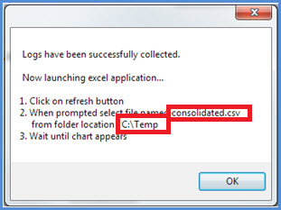
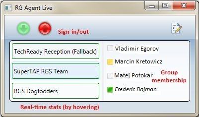

# <a name="skype-for-business-server-2015-resource-kit-tools-documentation"></a>Skype for Business Server 2015 リソース キット ツールのドキュメント

このトピックでは、Skype for Business Server 2015 リソースキットのツールについて説明します。各ツールの目的や使用例も記載されています。 Skype for Business Server 2015 リソースキットは、Skype for business Server 2015 を展開して管理する IT 管理者にとって、日常的なタスクを容易にするのに役立ちます。 たとえば、**Web Conf Data** ツールを使用すると、オンライン会議中にユーザーによってアップロードされたデータを簡単に制御できます。 **SEFAUtil** ツールを使用すると、ユーザーの問い合わせに対して自動転送や自動応答を設定できます。 IT 管理者はこれらのツールを使用して、より効率的に Skype for Business Server 2015 を管理することをお勧めします。

## <a name="installation-of-the-resource-kit-tools"></a>リソース キット ツールのインストール

Skype for Business Server 2015 リソースキットをインストールするには、ダウンロードセンターから[OCSReskit](https://www.microsoft.com/en-us/download/details.aspx?id=52631)をダウンロードしてください。

**OCSResKit.msi** を実行すると、簡易インストールが行われます。.msi によって、**%Program Files%\Skype for Business Server 2015\ResKit** のパスにすべてのツールがインストールされます。このフォルダーには、自己完結型のツールの実行可能ファイルが格納されます。各ツールのサポート ファイルは、それぞれのサブフォルダーに格納されます。

## <a name="supported-environments"></a>サポートされる環境

Skype for Business server 2015 リソースキットは、skype for business server 2015 に必要な仕様を満たしているサーバーにインストールする必要があります。通常は、Skype for business Server 2015 を実行するために使用されます。

## <a name="resource-kit-tools-overview"></a>リソース キット ツールの概要

以下は、Skype for Business Server 2015 リソースキットに用意されているツールの一覧です。 各ツールの要件や使用例については、以下のセクションで説明します。

- [ABSConfig](resource-kit-tools.md#ABSConfig)

- [Bandwidth Policy Service Monitor](resource-kit-tools.md#bpsm)

- [Bandwidth Utilization Analyzer](resource-kit-tools.md#bua)

- [Call Parkometer](resource-kit-tools.md#callpark)

- [DBAnalyze](resource-kit-tools.md#dba)

- [Import Storage Service Data](resource-kit-tools.md#Issd)

- [LCSSync](resource-kit-tools.md#LCSSync)

- [Lookup User Console](resource-kit-tools.md#LUC)

- [MsTurnPing](resource-kit-tools.md#MsTurnPing)

- [Network Configuration Viewer](resource-kit-tools.md#NCV)

- [Response Group Agent Live](resource-kit-tools.md#RGAL)

- [SEFAUtil](resource-kit-tools.md#SEFAUtil)

- [SYSPrep.ps1](resource-kit-tools.md#SYSPrep)

- [Unassigned Number Announcements Migration](resource-kit-tools.md#UNAM)

- [Web Conf Data](resource-kit-tools.md#WebConfData)

## <a name="absconfig"></a>ABSConfig
<a name="ABSConfig"> </a>

アドレス帳サービス構成ツール (ABSConfig) は、管理者が Skype for Business Server 2015 のアドレス帳サービス構成をカスタマイズするのに役立ちます。 このツールでは、Skype for Business Server 2015 管理者が、既定のアドレス帳サービス設定を復元することもできます。

### <a name="description"></a>説明

ABSConfig は、管理者がアドレス帳サービスに関連する Active Directory ドメインサービスの属性を構成できるようにするグラフィカルユーザーインターフェイスアプリケーションです。

このツールを使用する主なシナリオは、次のとおりです。

- 管理者が Active Directory ドメインサービスの属性を Skype for Business Server 2015 の属性にマッピングできるようにします。

- 管理者が Active Directory ドメイン サービスの属性をアドレス帳サービスのファイルに含めるか、ファイルから除外できるようにする。

- 管理者がアドレス帳サービスの既定の設定を復元できるようにする。

ABSConfig ツールは、absConfig.exe ファイルから起動できます。 ツールが [属性の**構成**] タブに表示されます。この表には、Active Directory ドメインサービスの属性を Skype for Business Server 2015 の属性フィールドにマップし、特定の属性フィルターに基づいてアドレス帳サービスファイルに含めるか除外するかを指定するオプションがあります。 また、アドレス帳ファイルに含める電話番号の値をカスタマイズできます。 [**Restore Defaults**] オプションを使用すると、アドレス帳サービスの設定を既定の値に復元できます。

> [!NOTE]
> 異なる OC フィールド名への AD 属性の再マッピングは、アドレス帳のファイルのダウンロードに対してのみ機能し、アドレス帳 Web クエリではサポートされません。

### <a name="output"></a>出力

ABSConfig は、アドレス帳サービスの構成をデータベースに格納します。

```console
Path: %ProgramFiles%\Skype for Business Server 2015\Reskit
```

### <a name="purpose"></a>用途

ABSConfig では、Skype for Business Server 2015 アドレス帳サービスをすばやく簡単にカスタマイズすることができます。

### <a name="requirements"></a>要件

#### <a name="computer"></a>コンピューター

ABSConfig は、Skype for Business Server 2015 がインストールされているドメインに参加しているコンピューターからのみ実行できます。 Skype for Business Server 2015 Enterprise Edition の場合、このツールは、セットアップ時にアドレス帳サービスが有効になっているすべてのフロントエンドサーバーで実行できます。

#### <a name="network"></a>ネットワーク

コンピューターは、フロントエンド プールとバックエンド データベースに接続できる必要があります。

#### <a name="software"></a>ソフトウェア

ABSConfig ツールを実行する前に、次のソフトウェア コンポーネントをインストールしておく必要があります。

- Skype for Business Server 2015

#### <a name="users"></a>ユーザー

Skype for Business Server 2015 の展開を更新するのに必要なアクセス許可を持つ管理者。

### <a name="examples"></a>例

ABSConfig は、コマンド プロンプトで **ABSConfig.exe** と入力して起動することができます。ABSConfig ツールのユーザー インターフェイスを以下に示します。


### <a name="summary"></a>概要

ABSConfig ツールでは、管理者は、Skype for Business Server 2015 アドレス帳サービスをカスタマイズするための簡単で使いやすいツールを提供しています。

## <a name="bandwidth-policy-service-monitor"></a>Bandwidth Policy Service Monitor
<a name="bpsm"> </a>

Bandwidth Policy Service Monitor ツールを使用すると、管理者は以下のリストを表示することができます。

1. トポロジで構成されているすべての Skype for Business Server 2015 帯域幅ポリシーサービス (認証とコア)

2. 各サービスの帯域幅ポリシー サービスとエッジ サーバーへの接続状況

3. ネットワーク構成ドキュメントで構成されたすべてのリンクと、各帯域幅ポリシー サービスから報告されたリアルタイムの帯域幅の使用状況

### <a name="description"></a>説明

Bandwidth Policy Service Monitor ツールは、GUI ベースのアプリケーションとして実装されています。管理者は、PDPMonUI.exe を実行してツールを起動します。

ツールを起動すると、ツールはトポロジ内の帯域幅ポリシー サービスの一覧を検索します。初期アップデートが完了すると、ウィンドウの左ペインに、所属するクラスターによってグループ分けされたサービスの一覧が表示されます。

管理者が特定の帯域幅ポリシー サービスを選ぶと、右ペインにそのサービスの情報が表示されます。次の 2 つのメイン タブにそれぞれ情報が表示されます。

#### <a name="machine-info-tab"></a>[Machine Info] タブ

[**Machine Info**] タブには、選択した帯域幅ポリシー サービスの詳細と、選択した帯域幅ポリシー サービスから別のサービスへの接続の一覧と状態が表示されます。

#### <a name="topology-info-tab"></a>[Topology Info] タブ

[**Topology Info**] タブには、ネットワーク構成設定で構成されたすべてのリンクの一覧が表示されます。各リンクには、音声とビデオの帯域幅容量が表示されます。さらに、現在使用されている帯域幅が、Kbps と容量に対する割合で表示されます。ツールでは色分けが使用され、容量の上限に近づいているリンクが強調表示されます。これにより、管理者は対象のリンクをすばやく分離できます。

> [!NOTE]
>  構成済みの帯域幅ポリシーサービスに接続しているときに帯域幅ポリシーのサービスモニターで障害が発生した場合、[**コンピューター情報**] タブと [**トポロジ情報**] タブにある情報は設定されません。 ただし、最初は接続されたにもかかわらず、後にサービスへの接続が途切れることもあります。 このような場合、管理者に古い情報が表示されることがあります。 各タブには [**Last Updated**] タイムスタンプが用意されているため、管理者は特定の帯域幅ポリシー サービスのデータが最後に更新された時間を確認できます。

### <a name="output"></a>出力

コマンドラインの出力はありません。プログラムの出力は、メインのグラフィカル ユーザー インターフェイス (GUI) に含まれています。

### <a name="purpose"></a>用途

Bandwidth Policy Service Monitor ツールを使用すると、管理者はトポロジに定義された各帯域幅ポリシー サービスの詳細を確認できます。さらに、管理者はネットワーク構成ドキュメントに定義されたすべてのリンクの帯域幅の使用状況を、リアルタイムで確認できます。

### <a name="requirements"></a>要件

帯域幅ポリシーのサービスモニターツールは、Skype for Business Server トポロジの一部であるコンピューターで実行する必要があります。

### <a name="summary"></a>概要

Bandwidth Policy Service Monitor ツールを使用すると、トポロジ内の帯域幅ポリシー サービスの状態を確認できます。さらに、ネットワーク構成設定で定義されたリンクの帯域幅のリアルタイムの使用状況を把握できるため、管理者にとって非常に重要なリソースです。

## <a name="bandwidth-utilization-analyzer"></a>Bandwidth Utilization Analyzer
<a name="bua"> </a>

Bandwidth Utilization Analyzer は、エンタープライズ ネットワークの WAN リンク全体の UC エンドポイントで消費される帯域幅を、さまざまな観点から確認できるレポートを作成するツールです。これらのレポートを使用すると、現在の帯域幅の消費パターンを把握して、帯域幅の容量計画に活用できます。

### <a name="description"></a>説明

Bandwidth Utilization Analyzer は、GUI ベースのアプリケーションとして実装されます。このツールは、ネットワーク全体音声に限定した使用状況に関するレポートを作成し、容量の計画に活用できます。また、さまざまなリンクに割り当てられた帯域幅容量を反復処理します。

### <a name="output"></a>出力

Bandwidth Utilization Analyzer には、システムで構成されたすべての WAN リンクにおける、音声の帯域幅容量と使用状況に関するグラフィカル プロットが用意されています。

### <a name="purpose"></a>用途

音声とビデオによる展開では、エンタープライズネットワーク全体でのメディアトラフィックの帯域幅使用率の傾向を監視し、理解することが重要です。 Bandwidth Utilization Analyzer ツールを使用すると、管理者はそれを把握できます。 このツールでは、次の操作を実行できます。

- ネットワーク全体にわたる音声の使用状況に関するレポートを生成する

- より効果的な容量計画の立案と、さまざまなリンクに割り当てられた帯域幅容量の反復処理をサポートする

Bandwidth Utilization Analyzer では、帯域幅容量のグラフィカル プロットと使用状況レポートを作成できます。その範囲と実行可能な操作は次のとおりです。

- エンタープライズ ネットワーク内のすべての WAN リンク

- 事前に指定した WAN リンクでフィルター処理

- リンク容量を超過した WAN リンクでフィルター処理

- 帯域幅の使用率が予測を下回る WAN リンクでフィルター処理

- 重大レベル (WAN リンクの帯域幅使用率が容量の 90% を超過している) に達している WAN リンクでフィルター処理

- WAN リンクの種類 (ネットワーク サイト リンク、地域間リンク、サイト内リンク) でフィルター処理

- ネットワーク地域でフィルター処理

#### <a name="applications"></a>アプリケーション

Bandwidth Utilization Analyzer には、次の 2 つのアプリケーション (ツール) が用意されています。

- **WanLinkLogCollector**このツールを使用すると、ユーザーは必要な情報を入力することができます。

- **BandwidthUtilizationAnalyzer** Microsoft Excel スプレッドシートソフトウェアレポートは、WanLinkLogCollector によって自動的に起動されます。 このアプリケーションでは、レポートにフィルターを適用できます (この記事の後半で説明します)。

#### <a name="phases-of-using-bandwidth-utilization-analyzer"></a>Bandwidth Utilization Analyzer の使用フェーズ

Bandwidth Utilization Analyzer の使用は、次の 2 つのフェーズに分けられます。

- ログの収集 (WanLinkLogCollector.exe を使用)

- レポートのカスタマイズ (BandwidthUtilizationAnalyzer.xlsm を使用)

    > [!IMPORTANT]
    > BandwidthUtilizationAnalyzer.xlsm はエンド ユーザーが手動で起動できないようにすることを強くお勧めします。

#### <a name="starting-bandwidth-utilization-analyzer"></a>Bandwidth Utilization Analyzer の起動

コマンド プロンプトで WanLinkLogCollector.exe を実行するか、Windows エクスプローラーを使用して起動します。

 **WanLinkLogCollector.exe の使用**

WanLinkLogCollector.exe を使用するには、次の 3 つの手順を実行します。

1. **タイムラインを記録する**レポートを生成する必要があるタイムラインを指定する

2. **ファイルディレクトリを指定**するファイルの場所情報を入力する

3. **ログを収集し、レポートビューアーを起動する**コマンドを実行してレポートを生成する

#### <a name="step-1---log-the-timeline"></a>手順 1 - ログのタイムラインを指定する

タイムラインのログを記録するには、以下の図に示すように、次の項目を指定します。

1. **Start date** レポートを生成するタイムラインの開始日 (例: 2010 年 8 月 1 日)。

2. **End date** レポートを生成するタイムラインの終了日 (例: 2010 年 9 月 30 日)。

     

#### <a name="step-2---specify-the-file-directories"></a>手順 2 - ファイルのディレクトリを指定する

図に示すように、以下のファイル ディレクトリを指定することができます。

- **サーバーのログファイルの場所**帯域幅ポリシーサーバーログが保存されているフォルダーの場所。 通常、これは\<、\> \\ \>\AppServerFiles\PDP. の<の選択を行うことになります。

- **一時ファイルの保存場所**レポートの生成中に中間ファイルが保存される一時ファイルの場所。

    

    > [!NOTE]
    > サーバー ログや一時ファイルを格納するフォルダーにアクセスできる十分な権限をツールのユーザーに割り当てるようにしてください。

#### <a name="step-3---collect-the-logs-and-start-the-report-viewer"></a>手順 3 - ログを収集してレポート ビューアーを起動する

ログを収集してレポート ビューアーを起動するには、以下の図に示す [**Execute**] をクリックします。この手順により、必要なデータが収集されます。


入力の検証が正常に行われると、以下のメッセージが表示されます。



[**OK **] をクリックします。BandwidthUtilizationAnalyzer.xlsm は自動的に起動します。メッセージ ボックスの指示に従います。詳細については、次のセクション「**BandwidthUtilizationAnalyzer.xlsm の使用**」を参照してください。


### <a name="using-bandwidthutilizationanalyzerxlsm"></a>BandwidthUtilizationAnalyzer.xlsm の使用

1. BandwidthUtilizationAnalyzer.xlsm が自動的に起動したら、以下の図に示す [**Refresh**] をクリックします。

     

2. ファイルのフォルダーが開いたら、メッセージ ボックスで指定した場所にある consolidated.csv を選びます。以下に示すように、場所は **C:\Temp** です。

     

3. [**Import**] をクリックします。

4. グラフィカル プロットが自動的に生成されます。バックグラウンドで作業中のポインターが表示されなくなると、使用できます。

     

#### <a name="applying-filters-to-the-report-view"></a>レポート ビューにフィルターを適用する

レポート ビューに適用できるフィルター (以下の図を参照) は、次のとおりです。


1. **Name** WAN リンクでフィルター処理 (グラフの右側のフィルター)。プレフィックス (縦長の青いボックスを参照) は、次のようなリンクの種類を示します。

   - **S: Site** ネットワーク サイトからネットワーク地域への WAN リンク

   - **IS Inter-Site** 2 つのネットワーク サイト間の WAN リンク

   - **R Inter-Region** 2 つのネットワーク地域間の WAN リンク

2. **Exceeded limit** 帯域幅の使用率が帯域幅容量を超過している WAN リンクでフィルター処理

3. **Critical levels** 帯域幅の使用率が帯域幅容量の 90% 以上に達した WAN リンクでフィルター処理

4. **Under-utilized** 帯域幅の使用率が帯域幅容量の 25% に達していない WAN リンクでフィルター処理

5. **Link type** 次に示す WAN リンクの種類でフィルター処理します。

   - **Network site** タイプ

   - **Inter-site** タイプ

   - **Inter-Region link** タイプ

6. **Region** ネットワーク地域でフィルター処理

次の図は、これまでに紹介したフィルターを示します。

[**Name**] でフィルター処理します。グラフに表示するリンクのリストを選びます。

![BandwidthUtilizationAnalyzer での [Name] でのフィルター処理](../media/Reskit_2012_Tools_Documentation_Image12.jpg)

[**Exceeded limit**] でフィルター処理します。 フィルターを適用するには、[**True**] を選びます。

![[Exceeded Limit] でのフィルター処理](../media/Reskit_2012_Tools_Documentation_Image13.jpg)

[**Critical levels **] でフィルター処理します。 フィルターを適用するには、[**TRUE **] を選びます。

![[Critical Levels] でのフィルター処理](../media/Reskit_2012_Tools_Documentation_Image14.jpg)

[**Under-utilized **] でフィルター処理します。 フィルターを適用するには、[**TRUE **] を選びます。

![[Under Utilized] でのフィルター処理](../media/Reskit_2012_Tools_Documentation_Image15.jpg)

[**Link Type**] でフィルター処理します。 表示する種類を 1 つ以上選びます。

![[Link Type] でのフィルター処理](../media/Reskit_2012_Tools_Documentation_Image16.jpg)

[**Region**] でフィルター処理します。 リンクを表示する地域のリストを選びます。

![[Region] でのフィルター処理](../media/Reskit_2012_Tools_Documentation_Image17.jpg)

### <a name="requirements"></a>要件

- .NET Framework 3.5

- Microsoft Excel 2010 または Excel 2007

### <a name="summary"></a>概要

Bandwidth Utilization Analyzer は、ネットワーク全体の UC トラフィックにおける音声の帯域幅の使用状況をプロットするために使用します。このツールは、ビデオの帯域幅の使用状況を報告する場合にも同様に使用できます。

## <a name="call-parkometer"></a>Call Parkometer
<a name="callpark"> </a>

Call Parkometer は、コール パーク オービット デバイスに簡単にアクセスできるコマンドライン アプリケーションです。

### <a name="description"></a>説明

Call Parkometer は、現在パークされている通話を追跡するツールです。 オービットやコール パーク サーバー (CPS) の使用状況に関する統計情報も収集します。 このコマンドラインツールは、CPS への読み取りアクセスと書き込みアクセスの両方を提供します。これには、ローカルまたはリモート接続コンピューターからの SQL Server データベースが使用されます。

すべてのオプションは同時に使用できません。 コマンドライン構文は次のとおりです。

- **-o**パラメーター—このプールで構成されているすべてのオービット範囲を一覧表示します。

- **-n**パラメーター—このプールで現在使用されているすべての orbits を一覧表示します。 情報は次のように表示されます。

  - パーク元とパーク先の SIP Uniform Resource Identifier (URI)。

  - 通話のパーク先の CPS のホスト名。

  - 通話がパークされた時点のタイムスタンプ。

- **-f**パラメーター—プール内の現在の空き orbits の数を一覧表示します。

- **-r \<n\> **パラメーター—\>最終保留\<された通話の一覧を表示します。 情報は次のように表示されます。

  - パーク先の SIP URI。

  - パーク元の SIP URI。

  - 通話のパーク先の CPS のホスト名。

  - 通話が保留解除または切断された時点のタイムスタンプ。

- **-t\<n\> **パラメーター-データベース内のオービットを予約して、割り当てられた値の乱数をランダムに表示します。

### <a name="output"></a>出力

コマンド プロンプトで指定された入力パラメーターによっては、Call Parkometer に次の出力が表示されます。

- このプールで構成されたすべてのオービット範囲

- 現在パークされている通話

- 有効な (使用可能な) オービットの数

- 最近パークされた通話

- 一定およびランダムなオービットの値をテストするために予約されたオービット

### <a name="purpose"></a>用途

CPS ツールを使用すると、CPS データベースへのコマンドライン アクセスを確立できます。管理者は、CPS の使用状況を確認して、プールに割り当てられているオービットの数を把握できます。

### <a name="requirements"></a>要件

CPS が実行されている同じコンピューターで実行する場合、このツールの使用に必要な条件はありません。 このツールがリモートコンピューターで実行される場合は、Skype for Business Server 2015 で使用される SQL Server データベースがリモートアクセスを許可するように構成されている必要があります。 呼び出しの場合は、プールの SQL Server に接続するために SQL Server データベース接続文字列を使用して構成されている必要があります。 この SQL Server データベース接続文字列は構成ファイルで定義されて**います。** このファイルは、par・・・・・・・・ m の場所にあるのと同じディレクトリに配置する必要があります。 次の XML ファイルは、par・メータの例です。構成が必要なパラメーターは、ユーザー名 (myの "管理者" など)、パスワード (mypassword など)、ホスト名 (たとえば、myserver) です。

```xml
<?xml version="1.0" encoding="utf-8" ?>
<configuration>
  <appSettings>
   <add key="SQL" value="server=myserver\RTC;
database=cpsdyn;
User Id=mydomain\Administrator;
Password=mypassword.;
Integrated Security=false;"/>
  </appSettings>
</configuration>
```

### <a name="examples"></a>例

展開された軌道範囲:-o パラメーターは、このプール用に構成されているすべてのオービット範囲を表示します。


現在保留中の通話:-n パラメーターは、このプールで現在使用されているすべての orbits を示しています。


無料 orbits の数:-f パラメーターには、プール内の現在の空き orbits の数が表示されます。


最近の保留中の通話: \<-\> r n パラメーター \<は\> 、表示されている最後の保留中の通話を一覧表示します。


軌道予約をテストします。 \<-\> t n パラメーターテストでは、データベース内のオービットが次のようになります。


### <a name="summary"></a>概要

Call Parkometer は、コール パーク サーバーに関する詳しい情報を提供するコマンドライン ツールです。

## <a name="dbanalyze"></a>DBAnalyze
<a name="dba"> </a>

### <a name="description"></a>説明

DBAnalyze は、管理者が Skype for Business Server 2015 データベースに関する分析レポートを収集するのに役立つコマンドラインツールです。 DBAnalyze には、診断モード、ユーザー データ モード、会議モード、MCU モード、ディスク断片化モードが用意されています。

- **診断モード**テーブル (レコード数、断片化回数など) に関する情報を含むレポートを作成します。データサイズとインデックスサイズ)、データとログファイルのサイズ、最後のバックアップ時間、連絡先の配布には、Microsoft Office Communications Server が実行されているサーバー間の平均数、アクセス許可の平均数、ユーザーごとに開催された電話会議の平均数、スケジュールされている会議、アクティブな会議の数、データベースのバージョン。

    > [!NOTE]
    > 診断モードを実行すると、サーバーのパフォーマンスに影響を与えることがあります。

- **ユーザーデータモード**指定したユーザーの連絡先、コンテナー、サブスクリプション、パブリケーション、アクセス許可、連絡先グループのデータ、またはそのユーザーを連絡先やアクセス許可の一覧に登録しているユーザーのレポートを作成します。 このモードでは、ユーザーが開催する、または招待された会議の概要データもレポートします。

- **会議モード**会議のすべてのスケジュールの詳細、招待者リスト、会議で許可されているメディアの種類の一覧、アクティブな Mcu (multipoint control ユニット)、アクティブな参加者の一覧、各参加者の通知状態など、特定の会議の詳細データを報告します。

- **会議 ID のデコード****/Pstnid**スイッチで指定されている公衆交換電話網 (PSTN) 会議 ID をデコードしますが、詳細情報についてはバックエンドに接続しません。

- **会議の解決****/Pstnid**スイッチで指定されている PSTN 会議 ID をデコードし、ID で示されている会議に関する情報を表示します。

- **Mcu モード**プール内の各 MCU の ID、メディアの種類、URL、ハートビートの状態、会議のロード、参加者の負荷をレポートします。

- **ディスクの最適化モード**すべてのディスクの断片化の状態を表示します。

このツールは、さまざまな問題を診断し、管理者の容量計画を支援するために使用できます。たとえば、サーバー A に所属する大多数のユーザーが、サーバー B に所属するユーザーを連絡先として選択した場合、管理者はサーバー A のユーザーをサーバー B に移動して、サーバー間のトラフィックを削減できます。

### <a name="output"></a>出力

このツールは、Skype for Business Server 2015 データベースに関する定義済みレポートを出力します。 **パス**: %ProgramFiles%\Skype for Business Server 2015\Reskit

### <a name="purpose"></a>用途

Dbanalyze .exe をインストールするには、ローカルフォルダーにコピーし、ツールを実行します。 このツールを使用するには、コマンドラインから次のコマンドを実行します。 `dbanalyze.exe [/v] [/report:value] [/sqlserver:value] [/user:user@domain.com] [/conf:value][/pstnid:Value] [/maxcontacts:value]`コマンドラインオプションの説明を以下に示します。


### <a name="requirements"></a>要件

 **コンピューター**DBAnalyze は、Skype for Business Server 2015 がインストールされているドメインに参加しているコンピューターからのみ実行できます。

 **ネットワーク** コンピューターは、バックエンド データベースに接続できる必要があります。

 **ソフトウェア**DBAnalyze を実行する前に、Skype for Business Server 2015 ソフトウェアコンポーネントをインストールする必要があります。

 **ユーザー**次の表は、Skype for Business Server 2015 データベースへのアクセスに必要な権限を持っている管理者を示しています。


> [!NOTE]
> **/report:disk** モードでは、ローカル管理者のアカウントが必要です。

### <a name="examples"></a>例

次に、有効な Dbanalyze.exe コマンドの例を示します。

```console
dbanalyze.exe /report:diag
dbanalyze.exe /report:user /user:usera@domainb.com
dbanalyze.exe /report:conf /user:bob@example.com /conf:1W9J71SKSX2X
dbanalyze.exe /report:resolve /pstnid:12345
dbanalyze.exe /report:mcus
dbanalyze.exe /report:disk
```

### <a name="summary"></a>概要

DBAnalyzer を使用すると、管理者は Skype for Business Server 2015 データベースの分析をすばやく簡単に行うことができます。

## <a name="import-storage-service-data"></a>Import Storage Service Data
<a name="Issd"> </a>

ImportStorageServiceData リソース キット ツールを使用すると、Storage Service (LYSS) からフラッシュされたキューやエンドポイントのデータを、ストレージ サービスに再インポートできます。

### <a name="description"></a>説明

Storage Service からのデータのフラッシュは、キュー アイテムの状態やデータベースのサイズに基づいて自動的 (定期的) に行われた可能性があります。 また、プール フェールオーバー コマンドレット、またはそれによって呼び出される StorageServiceFullFlush コマンドレットの手動呼び出しによって行われた可能性もあります。 フロントエンドのデータベースのサイズが通常のレベルよりも上にある場合は、データがより多くエクスポートされる可能性が高いため、データを再インポートしないことをお勧めします。さらに、ストレージサービスキューの増加を引き起こしたエラーの原因となった問題は、まず解決される必要があります (Exchange のエンドポイントエラー、ネットワークの問題、その他の問題など)。

 **シナリオ 1:** プールのフェールオーバー中に、各フロントエンドのストレージ サービスからファイルがフラッシュされる場合があります。 フェールオーバーが完了したら、ツールを実行してデータを再インポートする必要があります。

 **シナリオ 2:** データは毎日自動的にフラッシュされます。または、特定のサイズのしきい値を超える記憶域サービスデータベースに対応しています (たとえば、60%、80%、90%)。 この自動フラッシュデータは、管理者によって定期的に再インポートされる必要があります。 このような状況では、monitoring SCOM pack が展開されていない場合、ストレージサービスからフラッシュされるデータに関連した Skype for Business Server ストレージサービスのイベントがあります。 32075のイベント Id (完全なフラッシュ操作が開始されます)、32076 (完全なフラッシュが完了しました)、32082 (メンテナンスレベルのフラッシュ開始)、32083 (メンテナンスレベルのフラッシュの完了)、32089 (データベースの書き込みによるフラッシュ発生)。 注: これらのイベント Id は、RTM リリースに対応しています。 管理者にこれらのイベントが表示される場合は、フラッシュアウトされたファイルがあることを意味します。このデータは定期的にこのツールを使ってインポートし直す必要があります。たとえば、週ごとに1回。

オンラインサービスのリリースでは、Skype for Business Server 用の正常性監視 SCOM pack が展開されている場合は、管理者に対して、フラッシュされたデータを記憶域サービスに再インポートするように求める新しい通知が表示されることがあります。 警告の原因に対応するイベントは、フロントエンド サーバーのイベント ログに出されます。 イベントの出力には、フラッシュされたデータ ファイルが置かれている親パスや、警告の条件に一致するファイルの個数などが記述されています。 警告の条件は、指定の親パスに Y 日以上前のファイルが X 個以上あることです (X と Y は StorageService 内に事前設定されていますが、APPCONFIG ファイルを変更して上書きできます)。 状態の警告が出されるイベントで、親パスが異なる場合の例を以下に 2 つ示します。 1 つは Web サービスのファイル共有で、もう 1 つは各フロントエンドのローカルの Application Data ディレクトリ (例: c:\ProgramData\Microsoft\Skype for Business Server 2015\StorageService) です。 その後、管理者はこの reskit ツールを実行します。

このツールは、ツールが実行されているフロントエンドでデータが所有されていない場合に、このツールが実行されているフロントエンドの CPU と IO の負荷を、他のフロントエンドと共に増やします。 このツールは、フロントエンドの CPU と IO の負荷が高くない場合 (ピーク時間以外の場合など) に、このツールを実行することをお勧めします。 次に、このツールでは、1つのデータファイルをインポートするために 2 ~ 3 分間かかることがあります。 ツールの実行時間を見積もるときは、この点に注意してください。 ツールによって生成される詳細ログファイルは、既定でファイルストアに表示されます。 ログファイルの数が MB 以上である可能性があるため、エラーが報告されていない場合は削除します。


### <a name="requirements"></a>要件

Skype for Business Server 2015 リソースキットツールをインストールします。 このツールは、Skype for Business Server と Skype for Business Server 管理シェルがインストールされているドメインに参加しているコンピューターで実行されます。 このツールは、管理シェルのコマンドレットを使用して、プール内のすべてのフロントエンドサーバーを特定します。 第二に、このツールは、 **Rtclocal**データベースがインストールされているプール内のコンピューターから実行する必要があります。 このデータベースは、ツールによって、プールの WEBSERVICE ファイル共有の場所を取得するために使用されます。 さらに、このツールを使用する前に、各フロントエンドサーバーで、まず、各フロントエンドサーバーで**enable-PSRemoting**を使用して Windows PowerShell リモート処理を有効にする必要があります。また、このツールが実行されているコンピューターの場合もあります。 そうしないと、このツールのリモート Windows PowerShell コマンドが失敗します。 Windows PowerShell リモート処理は、プールの終了後、すべてのフロントエンドサーバーで無効にすることができます。 最後に、ツールを呼び出すアカウントまたは資格情報に、このツールを実行しているプールの webservice ファイル共有への読み取り/書き込みアクセス許可が必要です。 そうしないと、IO 権限のエラーでツールが失敗します。

> [!NOTE]
> Windows Server 2012 では、windows PowerShell リモート処理は既定で有効になっていますが、Windows Server 2008 オペレーティングシステムでは有効になっていません。

### <a name="examples"></a>例

```console
>  C:\StorageService>ImportStorageServiceData.exe
Description:
This tool will re-import Storage Service (LYSS) flushed queue data back in.  For a pool: you are required to run this tool on a machine inside the pool which has the Lync Server Management Shell installed.  Additionally, all front end machines need to have Windows Powershell Remoting enabled before executing this tool by executing Enable-PSRemoting.  Also, please ensure that all Storage Service instance DB Size are at the 'Normal' level (verify this by viewing Eventlog events). Otherwise re-importing may cause data to be flushed out again if any Storage Service instance DB size level goes above 'Normal'.
Usage: Default behavior is to Import data from web service file share as well as any files on all Front End machines in pool.
Additional Options:
-Verbose                    : Turn verbose output on.

-StorageServiceHostName     : Host Name of Storage Service WCF endpoint.  ( Default=localhost netnamedpipe binding. )

-FileSharePath              : Import only all data from just under the UNC path specified.

ActivityID: cc3b62ff-bb66-4e61-a6e2-96cb3626315c. <-- Use this to correlate with StorageService trace logs if troubleshooting.
Type Server name (TCP binding) or press <enter> for localhost (NamePipe binding):
Using NetNamedPipeBinding...
OnTopologyChanged Event received
Web Service File Share: \\dc.vdomain.com\OcsFileStore\co1-WebServices-1\StorageService

Front Ends:
server.vdomain.com
server2.vdomain.com
server1.vdomain.com
server3.vdomain.com
Looking under directory: \\dc.vdomain.com\OcsFileStore\co1-WebServices-1\StorageService for exported data.
# Files found: 8
Starting Import for file:\\dc.vdomain.com\OcsFileStore\co1-WebServices-1\StorageService\DataExport\2
0120910\SERVER.vdomain.com\944f5724c65c5f93900dc1c8c898b102__0.xml
Items deserialized: 20

All items in file were enqueued successfully, will try to delete file: \\dc.vdomain.com\OcsFileStore\co1-WebServices-1\StorageService\DataExport\20120910\SERVER.vdomain.com\944f5724c65c5f93900dc1c8c898b102__0.xml

All items in file failed to enqueue so file will not be deleted.  File path: \\dc.vdomain.com\OcsFileStore\co1-WebServices-1\StorageService\DataExport\20120910\SERVER.vdomain.com\944f5724c65c5f93900dc1c8c898b102__0.xml

Summary for file \\dc.vdomain.com\OcsFileStore\co1-WebServices-1\StorageService\DataExport\20120910\SERVER.vdomain.com\944f5724c65c5f93900dc1c8c898b102__0.xml: succeeded: 20, failed: 0

Starting Import for file:\\dc.vdomain.com\OcsFileStore\co1-WebServices-1\StorageService\DataExport\20120910\SERVER1.vdomain.com\17d5435ae40259f7bbdf1866776386e4__0.xml
Items deserialized: 20

[cc3b62ff-bb66-4e61-a6e2-96cb3626315c] Send EnqueueMessages to redirected, targetServer=server1.vdomain.com, queueItems=20

All items in file were enqueued successfully, will try to delete file: \\dc.vdomain.com\OcsFileStore\co1-WebServices-1\StorageService\DataExport\20120910\SERVER1.vdomain.com\17d5435ae40259f7bbdf1866776386e4__0.xml

All items in file failed to enqueue so file will not be deleted.  File path: \\dc.vdomain.com\OcsFileStore\co1-WebServices-1\StorageService\DataExport\20120910\SERVER1.vdomain.com\17d5435ae40259f7bbdf1866776386e4__0.xml

Summary for file \\dc.vdomain.com\OcsFileStore\co1-WebServices-1\StorageService\DataExport\20120910\
SERVER1.vdomain.com\17d5435ae40259f7bbdf1866776386e4__0.xml: succeeded: 20, failed: 0

Starting Import for file:\\dc.vdomain.com\OcsFileStore\co1-WebServices-1\StorageService\DataExport\20120910\SERVER1.vdomain.com\904f6c9b8ac951ae8b3c86684d3832e4__0.xml

Items deserialized: 20
[cc3b62ff-bb66-4e61-a6e2-96cb3626315c] Send EnqueueMessages to redirected, targetServer=server1.vdomain.com, queueItems=20

All items in file were enqueued successfully, will try to delete file: \\dc.vdomain.com\OcsFileStore
\co1-WebServices-1\StorageService\DataExport\20120910\SERVER1.vdomain.com\904f6c9b8ac951ae8b3c86684d
3832e4__0.xml

All items in file failed to enqueue so file will not be deleted.  File path: \\dc.vdomain.com\OcsFil
eStore\co1-WebServices-1\StorageService\DataExport\20120910\SERVER1.vdomain.com\904f6c9b8ac951ae8b3c
86684d3832e4__0.xml

Summary for file \\dc.vdomain.com\OcsFileStore\co1-WebServices-1\StorageService\DataExport\20120910\
SERVER1.vdomain.com\904f6c9b8ac951ae8b3c86684d3832e4__0.xml: succeeded: 20, failed: 0

Starting Import for file:\\dc.vdomain.com\OcsFileStore\co1-WebServices-1\StorageService\DataExport\2
0120910\SERVER2.vdomain.com\69844a271e6c5633a1f2b46a42287dd6__0.xml

Items deserialized: 20

[cc3b62ff-bb66-4e61-a6e2-96cb3626315c] Send EnqueueMessages to redirected, targetServer=server2.vdom
ain.com, queueItems=20

All items in file were enqueued successfully, will try to delete file: \\dc.vdomain.com\OcsFileStore
\co1-WebServices-1\StorageService\DataExport\20120910\SERVER2.vdomain.com\69844a271e6c5633a1f2b46a42
287dd6__0.xml

All items in file failed to enqueue so file will not be deleted.  File path: \\dc.vdomain.com\OcsFil
eStore\co1-WebServices-1\StorageService\DataExport\20120910\SERVER2.vdomain.com\69844a271e6c5633a1f2
b46a42287dd6__0.xml

Summary for file \\dc.vdomain.com\OcsFileStore\co1-WebServices-1\StorageService\DataExport\20120910\
SERVER2.vdomain.com\69844a271e6c5633a1f2b46a42287dd6__0.xml: succeeded: 20, failed: 0

Starting Import for file:\\dc.vdomain.com\OcsFileStore\co1-WebServices-1\StorageService\DataExport\2
0120910\SERVER3.vdomain.com\3313935458e35b9b9759e08a15d251e6__0.xml

Items deserialized: 20

[cc3b62ff-bb66-4e61-a6e2-96cb3626315c] Send EnqueueMessages to redirected, targetServer=server3.vdom
ain.com, queueItems=1

All items in file were enqueued successfully, will try to delete file: \\dc.vdomain.com\OcsFileStore
\co1-WebServices-1\StorageService\DataExport\20120910\SERVER3.vdomain.com\3313935458e35b9b9759e08a15
d251e6__0.xml

All items in file failed to enqueue so file will not be deleted.  File path: \\dc.vdomain.com\OcsFil
eStore\co1-WebServices-1\StorageService\DataExport\20120910\SERVER3.vdomain.com\3313935458e35b9b9759
e08a15d251e6__0.xml

Summary for file \\dc.vdomain.com\OcsFileStore\co1-WebServices-1\StorageService\DataExport\20120910\
SERVER3.vdomain.com\3313935458e35b9b9759e08a15d251e6__0.xml: succeeded: 20, failed: 0

Starting Import for file:\\dc.vdomain.com\OcsFileStore\co1-WebServices-1\StorageService\DataExport\2
0120910\SERVER3.vdomain.com\4501e04eae4856059346949ff817c220__0.xml
Items deserialized: 20
[cc3b62ff-bb66-4e61-a6e2-96cb3626315c] Send EnqueueMessages to redirected, targetServer=server3.vdom
ain.com, queueItems=1
All items in file were enqueued successfully, will try to delete file: \\dc.vdomain.com\OcsFileStore
\co1-WebServices-1\StorageService\DataExport\20120910\SERVER3.vdomain.com\4501e04eae4856059346949ff8
17c220__0.xml
All items in file failed to enqueue so file will not be deleted.  File path: \\dc.vdomain.com\OcsFil
eStore\co1-WebServices-1\StorageService\DataExport\20120910\SERVER3.vdomain.com\4501e04eae4856059346
949ff817c220__0.xml

Summary for file \\dc.vdomain.com\OcsFileStore\co1-WebServices-1\StorageService\DataExport\20120910\
SERVER3.vdomain.com\4501e04eae4856059346949ff817c220__0.xml: succeeded: 20, failed: 0
Starting Import for file:\\dc.vdomain.com\OcsFileStore\co1-WebServices-1\StorageService\DataExport\2
0120910\SERVER3.vdomain.com\5ad77443ad955a22a876749be66d5317__0.xml

Items deserialized: 20
[cc3b62ff-bb66-4e61-a6e2-96cb3626315c] Send EnqueueMessages to redirected, targetServer=server3.vdom
ain.com, queueItems=20
All items in file were enqueued successfully, will try to delete file: \\dc.vdomain.com\OcsFileStore
\co1-WebServices-1\StorageService\DataExport\20120910\SERVER3.vdomain.com\5ad77443ad955a22a876749be6
6d5317__0.xml
All items in file failed to enqueue so file will not be deleted.  File path: \\dc.vdomain.com\OcsFil
eStore\co1-WebServices-1\StorageService\DataExport\20120910\SERVER3.vdomain.com\5ad77443ad955a22a876
749be66d5317__0.xml
Summary for file \\dc.vdomain.com\OcsFileStore\co1-WebServices-1\StorageService\DataExport\20120910\
SERVER3.vdomain.com\5ad77443ad955a22a876749be66d5317__0.xml: succeeded: 20, failed: 0
Starting Import for file:\\dc.vdomain.com\OcsFileStore\co1-WebServices-1\StorageService\DataExport\2
0120910\SERVER3.vdomain.com\a11e27ae439a582288d4657eda86b565__0.xml
Items deserialized: 20
[cc3b62ff-bb66-4e61-a6e2-96cb3626315c] Send EnqueueMessages to redirected, targetServer=server3.vdom
ain.com, queueItems=20
All items in file were enqueued successfully, will try to delete file: \\dc.vdomain.com\OcsFileStore
\co1-WebServices-1\StorageService\DataExport\20120910\SERVER3.vdomain.com\a11e27ae439a582288d4657eda
86b565__0.xml
All items in file failed to enqueue so file will not be deleted.  File path: \\dc.vdomain.com\OcsFil
eStore\co1-WebServices-1\StorageService\DataExport\20120910\SERVER3.vdomain.com\a11e27ae439a582288d4
657eda86b565__0.xml
Summary for file \\dc.vdomain.com\OcsFileStore\co1-WebServices-1\StorageService\DataExport\20120910\
SERVER3.vdomain.com\a11e27ae439a582288d4657eda86b565__0.xml: succeeded: 20, failed: 0
All files have been imported into Storage Service for path: \\dc.vdomain.com\OcsFileStore\co1-WebSer
vices-1\StorageService
Importing files for: server.vdomain.com
No files founds.
Importing files for: server2.vdomain.com
No files founds.
Importing files for: server1.vdomain.com
No files founds.
Importing files for: server3.vdomain.com
No files founds.
Writing log: \\dc.vdomain.com\OcsFileStore\co1-WebServices-1\StorageService\ImportStorageServiceData
Log20120910_1609SS
Tool has finished execution.
>  C:\StorageService>
```

## <a name="lcssync"></a>LCSSync
<a name="LCSSync"> </a>

LCSSync ツールを使用すると、複数のフォレスト環境に Skype for Business Server 2015 通信ソフトウェアを展開することができます。 このツールは、Skype for Business Server 2015 がインストールされている中央フォレストに、異なるユーザーフォレストのユーザーとグループを Active Directory ドメインサービスの連絡先オブジェクトとして同期するために使用されます。

### <a name="description"></a>説明

 LCSSync は、中央のフォレストの同期された Active Directory ドメインサービスの連絡先オブジェクトを使用して、Skype for Business Server のユーザーを有効にします。 シングルサインインを提供するには、プライマリユーザーアカウントが、Skype for Business Server 2015 の中央フォレストの Active Directory ドメインサービスの連絡先オブジェクトにマップされている必要があります。 このツールは、そのマッピングを支援します。 このツールには、Microsoft Identity Integration Server で Management Agents を作成するためのテンプレートが用意されています。

### <a name="summary"></a>概要

LCSSync ツールを使用すると、複数のフォレスト環境に Skype for Business Server 2015 を展開することができます。

## <a name="lookup-user-console"></a>Lookup User Console
<a name="LUC"> </a>

LookupUserConsole ツールは、特定のユーザーに関する内部の Skype for Business Server ルーティング情報を表示します。 この情報は、Microsoft のサポート担当者が展開やルーティングの問題を解決するのに役立つ場合があります。

### <a name="description"></a>説明

 LookupUserConsole を実行すると、SIP アドレスを受け入れ、それに関連する内部の Skype for Business Server ルーティング情報を表示しようとするコマンドプロンプトが開きます。 LookupUserConsole ツールを終了するには、「**exit**」 と入力します。

### <a name="requirements"></a>要件

Skype for Business Server 2015 リソースキットをインストールします。 このツールは、Skype for Business Server がインストールされているドメインに参加しているコンピューターで実行されます。

### <a name="examples"></a>例

C:\Program Files\Skype for Business Server 2015 \ ResKit\>lookupuserconsole

```console
> sip:john.doe@vdomain.com

  Execution time (ms):                            171.094
  Exeuction result:                               Success
  SIP URI:                                        sip:john.doe@vdomain.com
  User info:
    SID:                                          S-1-5-21-2831376166-29632525...    Display name:                                     John Doe
    Grouping ID:                                  00000000-0000-0000-0000-...
    Line URI:                                     <null>
    Policy assignment:                            TenantId={00000000--0000-000....
    SIP enabled:                                  True
    UC enabled:                                   False
    Tenant ID:                                    00000000-0000-0000-0000-...  Cluster info:
    Active cluster:                               pool0.vdomain.com
    Backup registrar cluster:                     <null>
    Deployment location:                          <null>
    Home Front-End FQDN:                          SERVER.vdomain.com
    Primary Registrar cluster:                    pool0.vdomain.com
    Remote Director external SIP FQDN:            <null>
    Remote Director internal SIP FQDN:            <null>
    Remote Director Web FQDN:                     <null>
    Routing group ID:                             4501e04e-ae48-5605-9346...
    Service tag ID:                               1266953005
    User Front-End resolved:                      True
    User in local forest:                         True
    User in remote forest:                        False
    User in split domain:                         False
    User-Services cluster:                        pool0.vdomain.com

> sip:nouser@vdomain.com

  Execution time (ms):                            948.7574
  Exeuction result:                               UserDoesNotExist

> exit
```

## <a name="msturnping"></a>MsTurnPing
<a name="MsTurnPing"> </a>

MSTurnPing ツールを使用すると、Skype for Business Server 2015 通信ソフトウェアの管理者は、オーディオ/ビデオエッジとオーディオ/ビデオ認証サービスを実行しているサーバーと、トポロジで帯域幅ポリシーサービスを実行しているサーバーの状態を確認できます。

### <a name="description"></a>説明

MSTurnPing ツールを使用すると、Skype for Business Server 2015 通信ソフトウェアの管理者は、オーディオ/ビデオエッジとオーディオ/ビデオ認証サービスを実行しているサーバーと、トポロジで帯域幅ポリシーサービスを実行しているサーバーの状態を確認できます。

このツールを使用すると、管理者は次のテストを実行できます。

1. 音声ビデオ エッジ サーバー テスト: トポロジ内の音声ビデオ エッジ サーバーに対して次のテストを実行します。

   - Skype for Business Server の音声/ビデオ認証サービスが開始されていて、適切な資格情報を発行できることを確認します。

   - Skype for Business Server のオーディオ/ビデオエッジサービスが開始されていることを確認し、外部境界にリソースを正常に割り当てることができます。

2. 帯域幅ポリシー サービス テスト: トポロジ内の帯域幅ポリシー サービスを実行しているすべてのサーバーに対して次のテストを実行します。

   - Skype for Business Server 帯域幅ポリシーサービス (認証) が開始されていて、適切な資格情報を発行できることを確認します。

   - Skype for Business Server 帯域幅ポリシーサービス (コア) が開始されていて、帯域幅のチェックを正常に実行できることを確認します。

このツールは、トポロジの一部でありローカル ストアがインストールされているコンピューターから実行する必要があります。

### <a name="output"></a>出力

このツールでは、各操作の結果が出力されます。

- **AudioVideoEdgeServer** テストを実行した場合、ツールの出力は次のようになります。

  - トポロジで Skype for Business Server 2015 Audio/Video Authentication service を提供しているコンピューターのテスト結果

  - トポロジで Skype for Business Server 2015 オーディオ/ビデオエッジサービスを提供するコンピューターのテスト結果

- **BandwidthPolicyServer** テストを実行した場合、ツールの出力は次のようになります。

  - トポロジで Skype for Business Server 2015 帯域幅ポリシーサービス (Authentication) を提供するコンピューターのテスト結果

  - トポロジで Skype for Business Server 2015 帯域幅ポリシーサービス (コア) を提供するコンピューターのテスト結果

### <a name="requirements"></a>要件

- このツールは、トポロジ内のローカル ストアを持つコンピューターから実行する必要があります。

- このツールは、ローカル ストアへのアクセス権のある管理者として実行する必要があります。

### <a name="examples"></a>例

ツールの入力例は、次のとおりです。

```console
MsTurnPing -ServerRole AudioVideoEdgeServer

MsTurnPing -ServerRole BandwidthPolicyServer
```

### <a name="summary"></a>概要

このツールは、音声/ビデオおよび帯域幅ポリシーサービスを実行しているサーバーの状態を確認する、Skype for Business Server 2015 管理者にとって有益なリソースになることがあります。

## <a name="network-configuration-viewer"></a>Network Configuration Viewer
<a name="NCV"> </a>

Network Configuration Viewer は、Skype for Business Server 2015 communications software 管理者が、リアルタイム通信セッションを許可するようにプロビジョニングされている企業の通話受付制御 (CAC) ネットワークトポロジを表示するために使うことができます。指定した帯域幅に基づいて、音声通話またはビデオ通話を行います。 Skype for Business Server 2015 管理者は、Skype for business Server 2015 と共にインストールされている帯域幅ポリシーサービスによって適用される CAC ポリシーを定義しています。

### <a name="description"></a>説明

Network Configuration Viewer (NetworkConfigurationViewer.exe) を使用すると、管理者は次のタスクを実行できます。

- Skype for Business Server 2015 の展開からの CAC ネットワークトポロジの読み込みと表示は、グラフィカル形式で行うことができます。

- 帯域幅ポリシー サーバー ログ ファイルの CAC ネットワーク トポロジを読み込み、図の形式で表示する。

- CAC ネットワーク トポロジを XML 形式でディスクに保存、格納する。

- CAC ネットワーク トポロジ図を JPG または BMP 形式で保存、格納する。

- CAC ネットワーク トポロジ構成データを表示する。

- CAC ネットワーク トポロジをツリー形式で表示する。

- CAC ネットワーク トポロジ リンク (サイトから地域、地域から地域、サイトからサイトの各リンクなど) のカスタム コネクタを定義する。

- CAC ネットワーク トポロジのサイト情報、地域情報、プロビジョニングされた帯域幅ポリシーとネットワーク リンクを表示する。

### <a name="purpose"></a>用途

企業の CAC ネットワーク トポロジ リンクをグラフィカル インターフェイスで表示します。

### <a name="examples"></a>例

 Skype for business server **2015 の展開からの cac ネットワークトポロジの読み込みと表示グラフィカル形式で**の操作: skype for business server 2015 管理者は、次の図に示すように [**ネットワーク構成のダウンロード**] オプションを使用して、すべての skype for business SERVER 2015 コンピューターで cac ネットワークトポロジの構成を読み込み、表示することができます。 このツールでは、Skype for Business Server 2015 構成ストアへの接続がないコンピューターに展開された場合に、このような構成をダウンロードまたは表示することはできません。


 **帯域幅ポリシーサーバーログファイルからの CAC ネットワークトポロジを、グラフィカル形式で読み込み、表示します。** Skype for Business Server 2015 帯域幅ポリシーサーバーは、CAC ネットワークトポロジを、Skype for Business Server 2015 ファイル共有の場所にあるログメカニズムの一部として保存します。 Skype for Business Server 2015 管理者は、次に示すように、 **[ネットワーク構成を開く**] オプションを使用して、このようなファイルをグラフィカルな形式で表示できます。


CAC ネットワークトポロジを保存して、ディスク上の XML 形式で保存します。 Skype for Business Server 2015 管理者は、次のように [**ネットワーク構成のコピーを保存**] オプションを使用して、cac ネットワークトポロジ構成ファイルを xml 形式で保存することができます。 保存した構成ファイルはオフラインでのグラフィカルな表示に使用できます。


CAC ネットワークトポロジ図を JPG または BMP 形式で保存して保存します。 Skype for Business Server 2015 管理者は、次に示すように**ネットワーク構成ダイアグラムを [画像として保存**] オプションを使用して、cac ネットワークトポロジ構成をグラフィカルな形式 (JPG および bmp ファイル形式) で保存できます。


 <strong>CAC ネットワークトポロジ構成データを表示します。</strong>Skype for Business Server 2015 管理者は、以下に示すように [ネットワーク構成データの表示] オプションを使用して、ネットワーク領域、ネットワークサイト、帯域幅プロファイル、サイトサブネットの IP アドレスなどの関連ネットワーク構成データをテキスト形式で表示できます。


 **ツリービュー形式で CAC ネットワークトポロジを表示します。** Skype for Business Server 2015 管理者は、次に示すように、ツールウィンドウの左側にあるコントロールパネルを使用して、関連するネットワーク構成データをグラフィカルツリービュースタイルで表示できます。


 **CAC ネットワークトポロジリンク (サイト間、地域間、サイト間リンクなど) 用のカスタムコネクタを定義します (例:** Skype for Business Server 2015 管理者は、次に示すように設定オプションを使用して、CAC ネットワーク構成の WAN リンク用のカスタムグラフィカルコネクタを定義できます。 これは、ネットワーク構成にプロビジョニングされている各種ネットワーク リンクを区別するのに役立ちます。


 **CAC ネットワークトポロジのサイト情報、地域情報、およびプロビジョニングされた帯域幅ポリシーを表示します。** Skype for Business Server 2015 管理者は、以下に示すオプションを使用して、関連する CAC ネットワークの地域情報、サイト情報、および CAC 帯域幅プロビジョニングの情報を表示できます。 (たとえば、ネットワーク領域またはネットワークサイトオブジェクトの [**情報**] をクリックします)。


### <a name="summary"></a>概要

このツールは、Skype for Business Server 2015 管理者が、グラフィック形式で展開するための CAC ネットワークトポロジを表示するのに役立ちます。

## <a name="response-group-agent-live"></a>Response Group Agent Live
<a name="RGAL"> </a>

応答グループ アプリケーションによって、エージェントは組み込みの Web サービスを使用してリアルタイムの有効な情報にアクセスできるようになります。 ただし、このデータのグラフィカル表示はアプリケーションの外部では使用できません。 応答グループエージェントのライブリソースキットツールは、この情報に簡単かつグラフィカルな方法でアクセスすることでこの問題を解決します。この問題は、他のエージェントの存在など、リアルタイムの Skype for Business 通信ソフトウェア情報を使用することで強化されています。

### <a name="description"></a>説明

Response Group Agent Live は、サインインやサインアウト機能、リアルタイム情報 (グループのメンバーシップや現在の通話数など) を応答グループ エージェントに提供する Windows アプリケーションです。 これは、[エージェントグループ] ページの拡張バージョン (Skype for Business からアクセス可能) であることを目的としています。

### <a name="purpose"></a>用途

着信通話は応答グループ アプリケーションによってキューに配置されてから、エージェント グループにルーティングされます。どの通話を処理するかについて十分な情報に基づいて判断するために、エージェントは他のエージェントの状態や各キューで待機中の通話数など、エージェント グループに関するリアルタイム情報にアクセスできます。このような情報は、当初は応答グループ サービスからのみアクセスが可能でしたが、Response Group Agent Live によって直感的な方法で利用できるようになりました。

#### <a name="features"></a>機能

応答グループエージェントのライブツールは、応答グループサービスと Skype for Business Server 2015 SDK 上に構築されています。 このツールは応答グループ サービスから利用できる情報や機能 (グループのメンバーシップ、他のエージェントのプレゼンス、待機中の通話数など) を応答グループ エージェントに提供します。

下の図は、Response Group Agent Live のメイン インターフェイスを示しています。



Response Group Agent Live では、エージェントは次の主な 3 つの機能を使用できます。

- **サインイン/チェックアウト:**[エージェントグループ] ページ (Skype for Business Server 2015 からアクセス可能) とは異なり、応答グループエージェントの Live では、エージェントのみが一度にサインインまたはサインアウトすることができます。 このアプリケーションでは、次の3つの簡単な方法でエージェントにサインインまたはサインアウトできます。

  - アプリケーション内でサインイン/サインアウト (緑色と赤色) ボタンをクリックします。

  - システム トレイ アイコンを右クリックし、サインインまたはサインアウトを選択します。

  - 構成可能なキーボード ショートカットを使用します。

- **グループメンバーシップ:**[エージェント] グループが選択されている場合、[応答グループエージェント Live] は、右側のウィンドウにこのグループのエージェントの一覧を表示します。 Skype for Business Server 2015 がこのアプリケーションと同じコンピューターで実行されている場合、プレゼンス情報と連絡先カードが応答グループエージェントの Live に表示されます。 担当者は、そこから直接 IM を送信したり、他のエージェントに直接通話を発信したりできます。

- **リアルタイム統計情報:** Response Group Agent Live ではすべてのエージェント グループのリアルタイム統計情報を使用できます。更新間隔は 1 分です。応答グループが通話に応答すると、グループ名の横に視覚的なインジケーターが追加され、キュー内の現在の通話数が表示されます。グループにマウスを合わせると、最長の待機時間も表示されます。

### <a name="requirements"></a>要件

Response Group Agent Live には .NET Framework 4.0 が必要です。 さらに、プレゼンスと連絡先カードの機能を活用するには、Skype for Business をローカルでインストールし (実行中) 必要があります。

#### <a name="configuration"></a>構成

アプリケーションの [Options] ダイアログ ボックスを使用すると、Response Group Agent Live を個人の好みに合わせてカスタマイズできます。また、管理者は RGAgentLive.exe.config ファイルの defaultHostAddress プロパティを直接編集して既定のホスト アドレスを定義できます。

下の図は、エージェントがホスト アドレスやショートカット キーを構成できる [Options] ダイアログ ボックスを示しています。このダイアログを表示するには、メイン インターフェイスの右上にある [Options] ボタンをクリックします。

![[Response Group Agent Live Options] ダイアログ ボックス](../media/Reskit_2012_Tools_Documentation_Image38.JPG)

Response Group Agent Live の構成では次の 3 つの設定をカスタマイズできます。

- [Host address (ホストアドレス) (通常は、エージェントのホームプールに属している web プールの FQDN)。 この情報から、正確な応答グループ サービス アドレスがバックグラウンドで自動的に取得されます (ホストの後に適切なパスが付加されます)。

- [Shortcuts]: サインイン/サインアウト用の厳密なショートカットをカスタマイズできます。 唯一の制限は、両方のショートカットに "Windows ロゴ" キーが含まれている必要があります (これには、少なくとも別のキーを使用する必要があります)。

- [Start with Windows]: Windows と共に自動的に起動するようにアプリケーションを構成できます。

### <a name="examples"></a>例

下の図は、右側のウィンドウで連絡先を右クリックして、他のエージェントに電話をかけたり IM を送信したりする方法を示しています。


下の図は、Response Group Agent Live に表示されるキュー内の現在の通話数と全着信通話内での最長待機時間を示しています。


### <a name="summary"></a>概要

迅速なサインインとサインアウト、グループのメンバーシップ、基本的なリアルタイム統計情報は、アプリケーション外部でのみ利用できる、応答グループ サービスに基づいた便利な応答グループ エージェント機能です。 応答グループエージェントのライブリソースキットツールを使って、Skype for Business Server 2015 管理者は、迅速かつグラフィカルな方法でタスクを実行できる Windows アプリケーションでエージェントを提供できます。

## <a name="sefautil"></a>SEFAUtil
<a name="SEFAUtil"> </a>

SEFAUtil (セカンダリ拡張機能のアクティブ化) は、Skype for Business Server 2015 通信ソフトウェア管理者およびヘルプデスクエージェントによる代理人の呼び出し、着信の転送、同時呼び出しの構成を可能にするコマンドラインツールです。Skype for Business Server 2015 ユーザーの代わりに、チーム呼び出しの設定とグループの通話が集配されます。 このツールを使用すると、管理者は、特定のユーザーに対して公開されている通話ルーティング設定を照会することもできます。SEFAUtil ツールを使用すると、管理者は、ユーザーの代わりに着信の転送を有効または無効にしたり、変更したりすることができます。 管理者は、(SIP URI の形式で) ターゲットを指定するか、またはユーザーによって既に公開されているターゲットを使用できます。 このツールでは、管理者がユーザーに代わって代理人またはチーム呼び出しグループのメンバーを追加または削除することもできます。このツールは、Microsoft ユニファイドコミュニケーションマネージ API (UCMA) 3.0 に基づいて構築されており、管理者が SEFAUtil の中央管理ストアで信頼されたアプリケーションを作成する必要があります。

SEFAUtil (セカンダリ拡張機能のアクティブ化) を有効にすると、Skype for Business Server 2015 管理者およびヘルプデスクエージェントは、Skype の代わりに代理人の呼び出し、着信の転送、同時呼び出し、チーム呼び出しの設定、グループ通話のピックアップを構成することができます。Business Server 2015 ユーザーの場合。 また、管理者は特定のユーザー向けに公開されているコール ルーティング設定のクエリを実行できます。

### <a name="description"></a>説明

SEFAUtil の現在のバージョンは、コマンドラインツールにすぎません。グラフィカルユーザーインターフェイスはサポートされていません。 このツールは、Microsoft ユニファイドコミュニケーションマネージ API (UCMA) 3.0 に基づいています。 このツールの機能により、管理者やヘルプデスクの担当者は次の作業を行うことができます。

- ユーザーのすべてのコール ルーティング設定を表示する (着信転送、代理人、同時呼び出し、チーム呼び出し、グループ通話ピックアップなど)

- 着信転送設定を有効化、無効化、変更する (宛先や無応答タイマーなど)

- 着信転送の即時構成を有効化、無効化、変更する

- 代理人設定を有効化、無効化、変更する

- チーム呼び出しグループ設定を有効化、無効化、変更する

    > [!NOTE]
    > Skype for Business Server 2015 SEFAUtil の新ツール

- 同時呼び出し設定を有効化、無効化、変更する (宛先など)

    > [!NOTE]
    > Skype for Business Server 2015 SEFAUtil の新ツール

- グループ通話ピックアップ設定を有効化、無効化、変更する

    > [!CAUTION]
    > Skype for Business Server 2015 SEFAUtil の新ツール

このツールの制約は次のとおりです。

- Skype for Business Server プールに所属しているユーザーのみがサポートされます

- 複数ユーザーのコール ルーティング設定の一括編集はサポートされていません。

### <a name="output"></a>出力

ツールの現在のバージョンでは、[コマンド プロンプト] ウィンドウでのみ結果が表示されます。詳しくは、このドキュメント後半の「例」をご覧ください。

### <a name="purpose"></a>用途

このツールを使用するいくつかの主なシナリオを次に示します。

- Bob は役員で、Skype for Business Server テレフォニーに移動されました。 彼の既存の PBX システムには代理人が設定されています。 Skype for Business Server 2015 への移行の一部として、管理者は、Bob のルーティングを構成して、既存の委任構成を反映させることができます。

- 西村さんは旅行中で、顧客からの重要な連絡を待っています。しかし、ホテル滞在中はコンピューターを使うことができません。彼女はヘルプデスクに電話して、勤務先電話番号にかかってきたすべての電話を携帯電話の番号に転送してもらうよう頼みました。ヘルプデスク担当者は、彼女のためにこのような構成を行うことができます。

- Joe の勤務先の電話番号への通話は、勤務先の携帯電話のボイスメールに送られます。ただし、他のほとんどの場所で正常に動作しているように見えます。 ヘルプデスクの技術者は、Joe のルーティング構成を表示して、Joe が自分の携帯電話に同時呼び出しを設定していることを確認できます。 技術者は、自分のオフィスの携帯電話の範囲について Joe に質問し、自分のネットワークカバレージの品質が低いときに、通話が Joe の携帯電話のボイスメールに転送される原因と判断することができます。

- Mike は Contoso の新入社員で、新しいチームに参加して、メンバー全員がチーム呼び出し用に構成されています。 Skype for Business Server 2015 を有効にすると、管理者はチーム呼び出しグループ設定を設定して、すべての新しいチームメンバーを含めることができます。さらに、管理者は、チームのメンバー全員のチーム呼び出しグループメンバーとして Mike を追加します。

- Contoso の人事部門のカスタマー サービス プラクティスとは、すべての発信者に対して最初の電話から個人サービスを提供することです。 部門のメンバー全員がお互いのすぐそばに座っているとすれば、チーム呼び出しで全員の電話が一斉に鳴るのはチームにとって非常に混乱のもとになります。 Skype for Business Server 2015 管理者は、チームメンバーを中断することなく最良のサービスを提供するために、グループ通話のピックアップ機能を利用できます。 管理者は部門の全員をピックアップ グループに追加して、ピックアップ グループ番号を伝えます。 原田さんが席を外している場合は、彼女の電話が鳴っていることに気付いた松本さんが自分の席から電話に応答します。

### <a name="requirements"></a>要件

SEFAUtil ツールは信頼されたアプリケーション プールに属しているコンピューターでのみ実行できます。このコンピューターには UCMA 3.0 がインストールされている必要があります。ツールを実行するには、SEFAUtil アプリケーション ID を持つ新しい信頼されたアプリケーションをプール内に作成する必要があります。

### <a name="creating-a-new-trusted-application-for-the-sefautil-tool"></a>SEFAUtil ツール用の新しい信頼されたアプリケーションの作成

1. SEFAUTil ツールは信頼されたアプリケーション プールに属しているコンピューターでのみ実行できます。 必要に応じて、新しい信頼できるアプリケーションプールとしてプールを追加するには、次のコマンドレットを実行して、Skype for Business Server 管理シェルを使用します。

   ```powershell
   New-CsTrustedApplicationPool -id <Pool FQDN> -Registrar <Pool Registrar FQDN> -site Site:<Pool Site>
   ```

    > [!NOTE]
    > SEFAUtil ツールを実行するコンピューターには UCMA 3.0 をインストールする必要があります。

2. 信頼されたアプリケーションを SEFAUtil ツールのトポロジ内に定義する必要があります。 SEFAUtil を新しい信頼されたアプリケーションとして定義するには、Skype for Business Server 管理シェルを使用して、次のコマンドレットを実行します。

   ```powershell
   New-CsTrustedApplication -ApplicationId sefautil -TrustedApplicationPoolFqdn <Pool FQDN> -Port 7489
   ```

    > [!NOTE]
    > 必要に応じて、別のポートを使用できます。
    
    > [!NOTE]
    > プール FQDN: SEFAUtil アプリケーションをホストするサーバーまたはプールの FQDN (通常は、Skype for Business フロントエンドサーバー > またはプール)。
    > プールレジストラー FQDN: このアプリケーションプールに関連付けられている Skype for Business フロントエンドサーバーまたはプールの FQDN。
    > プールサイト: このプールが所属しているサイトのサイト ID です。

3. トポロジの変更を有効にする必要があります。 トポロジの変更を有効にするには、次のコマンドレットを実行します。

   ```powershell
   Enable-CsToplogy
   ```

4. 必要に応じて、SEFAUtil ツールの実行に使用するサーバーに Skype for Business Server 2015 リソースキットツールをインストールします (サーバーは信頼されたアプリケーションプールの一部である必要があります)。

5. SEFAUtil が正しく実行していることを確認します。 そのためには、Windows コマンド プロンプトから管理者権限でツールを実行し、展開内のユーザーの着信転送設定を表示します。 既定では、ツールは "..\Program Files\Skype for Business Server 2015 \ Reskit" に保存されます。 ユーザーの着信転送設定を表示するには、次のコマンドを実行します。

   ```console
   SEFAUtil.exe <user SIP address> /server:<Skype for Business Server/Pool FQDN>
   ```

    ユーザーの着信転送設定が表示されます。

#### <a name="group-call-pickup"></a>グループ通話ピックアップ

グループ通話のピックアップ機能を完全に有効にするには、Skype for Business Server 2015 で追加の構成が必要です。 ユーザーにピックアップ グループを割り当てる前に、この機能の計画と展開の手順について、グループ通話ピックアップの製品ドキュメントを参照してください。

### <a name="examples"></a>例

#### <a name="display-current-call-handling-settings"></a>現在の通話処理設定の表示

次のコマンドでは、ユーザーの通話処理が表示されます。  `SEFAUtil.exe /server:SfBS2015server.contoso.com katarina@contoso.com`

> [!NOTE]
> この例では、 **/server**スイッチを使用して、接続先の Skype For business サーバーを指定します。

 **出力**

```console
User Aor: sip:katarina@contoso.com
Display Name: Katarina Larsson
UM Enabled: True
Simulring enabled: False
User Ring time: 00:00:20
Call Forward No Answer to: voicemail
```

#### <a name="set-the-call-forwardno-answer-destination"></a>着信転送/応答なしの宛先の設定

この例では、着信転送/応答なしの宛先と呼び出しの遅延を設定します。 ここでは、/server スイッチは提供されません。SEFAUtil は、Skype for Business Server 2015 の自動検出を試みます。

```console
SEFAUtil.exe /server:SfBserver.contoso.com sip:katarina@contoso.com /enablefwdnoanswer /callanswerwaittime:30 /setfwddestination:+1425555 0126@contoso.com;user=phone
```

 **出力**

```console
User Aor: sip:katarina@contoso.com
Display Name: Katarina Larsson
UM Enabled: True
Simulring enabled: False
User Ring time: 00:00:30
Call Forward No Answer to: sip:+14255550126@contoso.com;user=phone
```

#### <a name="enable-call-forwarding-immediately"></a>着信転送の即時有効化

この例では、別のユーザーへの着信転送をすぐに有効にします。

```console
SEFAUtil.exe sip:katarina@contoso.com /enablefwdimmediate /setfwddestination:anders@contoso.com
```

 **出力**

```console
User Aor: sip:katarina@contoso.com
Display Name: Katarina Larsson
UM Enabled: True
Simulring enabled: False
Forward immediate to: sip:anders@contoso.com
```

#### <a name="disable-call-forwarding-immediately"></a>着信転送の即時無効化

この例では、別のユーザーへの着信転送をすぐに無効にします。

```console
SEFAUtil.exe /server:SfBserver.contoso.com katarina@contoso.com  /disablefwdimmediate
```

 **出力**

```console
User Aor: sip:katarina@contoso.com
Display Name: Katarina Larsson
UM Enabled: True
Simulring enabled: False
User Ring time: 00:00:30
Call Forward No Answer to: voicemail
```

#### <a name="add-a-user-as-a-delegate-and-set-up-simultaneous-ringing-of-delegates"></a>代理人としてのユーザーの追加と代理人の同時呼び出しの設定

この例では、ユーザーを代理人として追加し、代理人の同時呼び出しを設定します。

```console
SEFAUtil.exe /server:SfBserver.contoso.com sip:katarina@contoso.com /adddelegate:joe@contoso.com /simulringdelegates
```

 **出力**

```console
User Aor: sip:katarina@contoso.com
Display Name: Katarina Larsson
UM Enabled: True
Simultaneously Ringing Delegates: sip:joe@contoso.com
```

#### <a name="change-simultaneous-ringing-rule-of-delegates"></a>代理人の同時呼び出しルールの変更

この例では、前の例で設定した代理人の同時呼び出しルールを遅延呼び出しルールに変更します。

```console
SEFAUtil.exe /server:SfBserver.contoso.com sip:katarina@contoso.com /delayringdelegates:10
```

 **出力**

```console
User Aor: sip:katarina@contoso.com
Display Name: Katarina Larsson
UM Enabled: True
Simulring enabled: False
Delay Ringing Delegates (delay:10 seconds): sip:joe@contoso.com
```

#### <a name="remove-the-delegate"></a>代理人の削除

この例では代理人を削除します。

> [!NOTE]
> 最後の代理人が削除されると、代理人着信は自動的に無効になります。

```console
SEFAUtil.exe /server:SfBserver.contoso.com sip:katarina@contoso.com /removedelegate:joe@contoso.com
```

 **出力**

```console
User Aor: sip:katarina@contoso.com
Display Name: Katarina Larsson
UM Enabled: True
Simulring enabled: False
User Ring time: 00:00:30
Call Forward No Answer to: voicemail
```

#### <a name="add-a-delegate-and-set-up-the-call-forward-to-delegates-rule"></a>代理人の追加と代理人への着信転送ルールの設定

この例では、代理人を追加し、代理人への着信転送ルールを設定します。

```console
SEFAUtil.exe /server:SfBserver.contoso.com sip:katarina@contoso.com /adddelegate:anders@contoso.com /fwdtodelegates
```

 **出力**

```console
User Aor: sip:katarina@contoso.com
Display Name: Katarina Larsson
UM Enabled: True
Forwarding calls to Delegates: sip:anders@contoso.com
```

#### <a name="enable-simultaneous-ringing-and-set-a-destination-number"></a>同時呼び出しの有効化と宛先番号の設定

この例では、同時呼び出しを有効にして、同時呼び出しの宛先番号を設定します。

```console
SEFAUtil.exe /server:SfBserver.contoso.com sip:katarina@contoso.com /setsimulringdestination:+14255550126 /enablesimulring
```

> [!NOTE]
> 既に同時呼び出しを有効にしているユーザーの同時呼び出しの宛先番号を変更するには、コマンドに /enablesimulring スイッチを追加します。追加しない場合、宛先番号は変更されません。

 **出力**

```console
User Aor: sip:katarina@contoso.com
Display Name: Katarina Larsson
UM Enabled: True
Simulring enabled: True
Simul_Ringing to: sip:+14255550126@contoso.com;user=phone
```

#### <a name="disable-simultaneous-ringing"></a>同時呼び出しの無効化

この例では、同時呼び出しを無効にします。

```console
SEFAUtil.exe /server:SfBserver.contoso.com sip:katarina@contoso.com /disablesimulring
```

 **出力**

```console
User Aor: sip:katarina@contoso.com
Display Name: Katarina Larsson
UM Enabled: True
Simulring enabled: False
User Ring time: 00:00:30
Call Forward No Answer to: voicemail
```

#### <a name="add-a-team-member-for-team-call-and-set-up-simultaneous-ringing-to-the-team-call-members-group"></a>チーム呼び出しのチーム メンバーの追加とチーム呼び出しメンバー グループへの同時呼び出しの設定

この例では、ユーザーのチーム呼び出しグループにチーム メンバーを追加し、チーム呼び出しグループへの同時呼び出しを有効にします。

```console
SEFAUtil.exe /server:SfBserver.contoso.com sip:katarina@contoso.com /addteammember:anders@contoso.com /simulringteam
```

> [!NOTE]
> ユーザーのチーム呼び出しグループにチーム メンバーを追加すると、ユーザーの同時呼び出しの設定がチーム呼び出しグループを同時に呼び出すように自動的に切り替わります。

 **出力**

```console
User Aor: sip:katarina@contoso.com
Display Name: Katarina Larsson
UM Enabled: True
Team ringing enabled. Team: sip:anders@contoso.com
```

#### <a name="remove-a-member-from-the-team-call-group"></a>チーム呼び出しグループからのメンバーの削除

この例では、ユーザーのチーム呼び出しグループからチーム メンバーを削除します。

```console
SEFAUtil.exe /server:SfBserver.contoso.com sip:katarina@contoso.com /removeteammember:anders@contoso.com
```

> [!NOTE]
> 削除対象のメンバーがチーム呼び出しグループで唯一のメンバーである場合、チーム呼び出しグループの同時呼び出しは自動的に無効になります。

 **出力**

```console
User Aor: sip:katarina@contoso.com
Display Name: Katarina Larsson
UM Enabled: True
User Ring time: 00:00:30
Call Forward No Answer to: voicemail
```

#### <a name="set-the-delayed-ring-to-the-team-call-group"></a>チーム呼び出しグループの遅延呼び出しの設定

この例では、チーム呼び出しグループの時間設定の遅延呼び出しを変更します。

```console
SEFAUtil.exe /server:SfBserver.contoso.com sip:katarina@contoso.com /delayringteam:5
```

 **出力**

```console
User Aor: sip:katarina@contoso.com
Display Name: Katarina Larsson
UM Enabled: True
Delay Ringing Team (delay:5 seconds). Team: sip:anders@contoso.com
```

#### <a name="enable-team-call"></a>チーム呼び出しの有効化

この例では、ユーザーのチーム呼び出しを有効にします。

```console
SEFAUtil.exe /server:SfBserver.contoso.com sip:katarina@contoso.com /simulringteam
```

> [!NOTE]
> ユーザーのチーム呼び出しグループにメンバーがいない場合、チーム呼び出しは有効になりません。

 **出力**

#### <a name="disable-team-call"></a>チーム呼び出しの無効化

この例では、ユーザーのチーム呼び出しを無効にします。

```console
SEFAUtil.exe /server:SfBserver.contoso.com sip:katarina@contoso.com /disableteamcall
```

 **出力**

```console
User Aor: sip:katarina@contoso.com
Display Name: Katarina Larsson
UM Enabled: True
User Ring time: 00:00:30
Call Forward No Answer to: voicemail
```

#### <a name="enable-group-call-pickup-and-assign-a-pickup-group-to-a-user"></a>グループ通話ピックアップの有効化とユーザーへのピックアップ グループの割り当て

この例では、ユーザーにピックアップ グループを割り当て、グループ通話ピックアップを有効にします。

```console
SEFAUtil.exe /server:SfBserver.contoso.com sip:katarina@contoso.com /enablegrouppickup:199
```

 **出力**

```console
User Aor: sip:katarina@contoso.com
Display Name: Katarina Larsson
UM Enabled: True
Group Pickup Orbit: sip:199;phone-context=user-default@ contoso.com;user=phone
```

#### <a name="disable-group-call-pickup"></a>グループ通話ピックアップの無効化

この例では、特定のユーザーのグループ通話ピックアップを無効にします。

```console
SEFAUtil.exe /server:SfBserver.contoso.com sip:katarina@contoso.com /disablegrouppickup
```

> [!NOTE]
> ユーザーのグループ通話ピックアップを無効にした場合、ユーザーに割り当てられたグループ番号は保持されません。そのユーザーのグループ通話ピックアップを後からもう一度有効にする場合は、/enablegrouppickup スイッチでグループ番号をもう一度割り当てる必要があります。

```console
User Aor: sip:katarina@contoso.com
Display Name: Katarina Larsson
UM Enabled: True
```

## <a name="sysprepps1"></a>SYSPrep.ps1
<a name="SYSPrep"> </a>

### <a name="description"></a>説明

Sysprep.inf は、Windows Server 2008 オペレーティングシステムコンピューターに次の Skype for Business Server 2015 の前提条件をインストールする Windows PowerShell スクリプトです。

- Microsoft .Net Framework 4.5

- Microsoft SQL Server Express

- Windows Powershell バージョン 3.0

- Visual C++ 2010 再頒布可能パッケージ

- Internet Information Server の更新プログラム

- Windows Identity Foundation

- Skype for Business Server 2015 コアファイル

  このスクリプトは Microsoft Windows オペレーティング システム用のシステム準備ツールと名前は似ていますが、別のツールです。 このスクリプトでは、Skype for Business Server 2015 に必要な前提条件のみをインストールします。 これらの必須コンポーネントをインストールしたら、Windows SYSPrep ツールを使用して、サーバーのイメージを作成できます。

### <a name="requirements"></a>要件

Sysprep.inf スクリプトを実行する前に、必須ファイルを Windows Server 2008 オペレーティングシステムコンピューター上のローカルフォルダー ( **D:\Setup など)** にコピーする必要があります。 このフォルダーには、特定の**setup.exe**のように、Skype For business Server 2015 ファイルのコピーも含める必要があります。 必須ファイルは、次の場所からダウンロードできます。


| **必須コンポーネント**                                | **場所**                                                            |
|:------------------------------------------------|:------------------------------------------------------------------------|
| Microsoft .Net Framework 4.5  <br/>             | <https://go.microsoft.com/?linkid=9816306>  <br/>                       |
| Microsoft SQL Server Express 2008 R2  <br/>     | <https://www.microsoft.com/en-us/download/details.aspx?id=23650>  <br/> |
| Windows Powershell バージョン 3.0  <br/>           | <https://www.microsoft.com/en-us/download/details.aspx?id=34595>  <br/> |
| Visual C++ 2010 再頒布可能パッケージ  <br/>          | <https://www.microsoft.com/en-us/download/details.aspx?id=5555>  <br/>  |
| Internet Information Server の更新プログラム  <br/>      | <https://www.microsoft.com/en-us/download/details.aspx?id=34869>  <br/> |
| Windows Identity Foundation  <br/>              | <https://www.microsoft.com/en-us/download/details.aspx?id=17331>  <br/> |
| Skype for Business Server 2015 Setup.exe  <br/> | Skype for Business Server 2015 メディアからのコピー  <br/>                   |

### <a name="parameter"></a>パラメーター

**-Setupfolder**パラメーターは、必須ファイルのディレクトリの場所を引数として受け取ります。

### <a name="examples"></a>例

Sysprep.inf スクリプトを実行して、Skype for Business Server 2015 の前提条件をインストールするには、管理者特権のコマンドプロンプトから次のコマンドを実行します。

```console
./SysPrep.PS1 -SetupFolder D:\Setup
```

## <a name="unassigned-number-announcements-migration"></a>Unassigned Number Announcements Migration
<a name="UNAM"> </a>

未割り当て番号のお知らせ移行ツールを使用すると、Skype for Business Server 2015 管理者は、アナウンスメントアプリケーションによって提供されている、割り当てられていない番号の設定をソース Skype for Business サーバーまたはプールから a に移動することができます。接続先の Skype for Business サーバーまたはプール。

### <a name="description"></a>説明

Unassigned Number Announcements Migration ツールは Windows PowerShell スクリプトであり、アナウンス アプリケーションによるサービスを受けている未使用の番号の構成を移行元のサーバーまたはプールから別のサーバーまたはプールに移行します。

Unassigned Number Announcements Migration スクリプトを実行すると、次の操作が行われます。

1. 移行元のサーバーまたはプールでホストされているアナウンス アプリケーションの未使用の番号のアナウンスが使用しているすべての音声ファイルを、移行先のサーバーまたはプールのファイル ストアに移行します。

    > [!NOTE]
    > オーディオファイルは、移行先のプールにコピーされると、ソースプールから削除されます。

2. 移行元のサーバーまたはプールでホストされているアナウンス アプリケーションに構成されているすべての未使用の番号のアナウンスを、移行先のサーバーまたはプールに移行します。

3. 移行元のサーバーまたはプールでホストされているアナウンス アプリケーションによるサービスを受けているすべての未使用の番号の範囲を、移行先のサーバーまたはプールにもう一度割り当てます。

スクリプトの実行が成功すると、移行元のサーバーまたはプールでホストされているアナウンス アプリケーションによるサービスを受けていたすべての未使用の番号の範囲が、同じ構成を使用して移行先のサーバーまたはプールによるサービスを受けるようになります。

### <a name="output"></a>出力

**ムーブグループの移動 Ementconfiguration**スクリプトは、Skype For Business Server 管理シェルウィンドウで、移行操作の成功または失敗を実行した場所を示します。

エラーによって操作の実行が中断した場合、移行に成功した未使用の番号の範囲は稼動状態で移行先に残り、移行する予定の残りの未使用の番号の範囲も稼動状態で移行元に残ります。残りの構成を完全に移行するには、エラーを修正してからもう一度スクリプトを実行します。

### <a name="purpose"></a>用途

Unassigned Number Announcements Migration スクリプトは、次の 3 つのシナリオで使用できます。

- **新しいバージョンの Skype For Business Server に構成設定を移行する:** Contoso は、Skype for Business Server 2015 への移行プロセスの一環として、移行プロセスの一部として、skype for Business Server 管理者は、アナウンスメントアプリケーションによって提供された割り当てられていない番号の設定を、Lync Server 2013 の展開から新しい Skype for Business Server 2015 の展開に移動することを希望しています。 設定を移動するには、Skype for Business Server の管理者は、割り当てられていない番号のお知らせ移行ツールを使用します。

- **Skype For Business server 2015 から Lync server 2013 に展開をロールバックする:** 予期しない問題が発生したため、Contoso は移行をロールバックして、新しい Skype for Business Server 2015 の展開に移行します。 サービスの中断を最小限に抑えるため、Skype for Business Server の管理者は、割り当てられていない番号のお知らせ移行ツールを使用して、Skype for Business Server 2015 の展開から Lync Server 2013 の展開に構成をロールバックします。

- **展開間でのデータの移動:** Contoso は、1つのプールのすべてのサーバーを新しいサーバーに置き換えるプロセスを進めています。 この戦略は、新しい Skype for Business Server 2015 プールを展開して、古いプールから新しいプールにすべてのデータを移動し、古いプールを廃止することを目的としています。 新しいプールを展開した後は、Unassigned Number Announcements Migration ツールを使用して、古いプールから新しいプールに構成を移行します。

#### <a name="requirements"></a>要件

ツールの正常な実行に必要な主な要件は、次のとおりです。

1. このスクリプトは、Skype for Business Server 管理シェルがインストールされているコンピューターから実行する必要があります。

2. お知らせアプリケーションは、移行元と移行先の Skype for Business サーバーまたはプールに正常に展開される必要があります。

#### <a name="move-csannouncementconfiguration-script"></a>Move-CsAnnouncementConfiguration スクリプト

Move-CsAnnouncementConfiguration スクリプトでは、下の表に示す 2 つのパラメーターが必要です。


### <a name="examples"></a>例

#### <a name="moving-the-unassigned-number-announcements-configuration-from-a-lync-server-2013-pool-to-a-skype-for-business-server-2015-pool"></a>割り当てられていない番号のお知らせの構成を Lync Server 2013 プールから Skype for Business Server 2015 プールに移動する

この例では、割り当てられていない番号のアナウンスをソースプール (Lync Server 2013) から移行先プール (Skype for Business Server 2015) に移動します。

```powershell
Move-CsAnnouncementConfiguration.ps1 -Source LS2013Pool.contoso.com -Destination SfBS2015Pool.contoso.com
```

#### <a name="moving-the-unassigned-number-announcements-configuration-from-a-skype-for-business-server-2015-pool-to-a-lync-server-2013-pool"></a>割り当てられていない番号のお知らせの構成を Skype for Business Server 2015 プールから Lync Server 2013 プールに移動する

この例では、ソースプール (Skype for Business Server 2015) から割り当てられていない番号のアナウンスを移行先のプール (Lync Server 2013) に移動します。

```powershell
Move-CsAnnouncementConfiguration.ps1 -Source SfBS2015Pool.contoso.com -Destination LS2013Pool.contoso.com
```

## <a name="web-conf-data"></a>Web Conf Data
<a name="WebConfData"> </a>

Web Conf データツールを使用すると、Skype for Business Server 2015 通信ソフトウェアの管理者は開催者の Web 会議に関連付けられたデータをより詳細に制御できます。 シナリオには、タイムスタンプ条件に基づいて特定のユーザーの会議データを削除する機能が含まれます。

### <a name="description"></a>説明

このツールを使用すると、管理者は次の操作を実行できます。

1. 1 人のユーザーに関連付けられているすべての Web 会議データを検索する。

2. 1 人のユーザーに関連付けられているすべての Web 会議データを削除する。

3. 特定の日付よりも古い、1 人のユーザーに関連付けられているすべての Web 会議データを削除する。

4. ユーザーがあるプールから別のプールに移行した場合に、その 1 人のユーザーに関連付けられているすべての Web 会議データを移行する。

    > [!NOTE]
    > Lync Server 2010 用のリソースキットツールでは、1人のユーザーに関連付けられたすべての Web 会議データを別のプールに移動することができました。 このツールでは **MoveConferenceData** パラメーターのほうを優先して、この機能は現在廃止されています。 このパラメーターの詳細については、「[移動-CsUser](https://docs.microsoft.com/powershell/module/skype/move-csuser.md?view=skype-ps)コマンドレット」を参照してください。

このツールでは、非アクティブな会議の会議データのみが削除されます。アクティブな会議 (開催中の会議) は削除できません。

このツールはターゲット ユーザーと同じプール内にあるコンピューターから実行する必要があります。会議コンテンツ データをこのツールで管理しているユーザーは同じユーザー プールに所属している必要があります。

### <a name="output"></a>出力

このツールでは、次の各操作の結果が出力されます。

- クエリを実行した場合は、該当のユーザーを開催者とする、すべての非アクティブな会議のデータ フォルダーの一覧が出力されます。

- 削除を実行した場合は、削除対象のデータがあるすべての会議データ フォルダーの一覧が出力されます。

### <a name="requirements"></a>要件

このツールは、開催者が現在所属しているのと同じプール内で実行する必要があります。

このツールは、コンテンツ ファイル ストアへのアクセス権を持つ管理者特権を使用して実行する必要があります。

### <a name="examples"></a>例

下の表にパラメーターを示します (一部は例で使用されています)。


```console
WebConfDataTool.exe /User:user0@contoso.com /Action:query ""/ExpirationDate:08/09/2010 12:00:00""
```

上の例は query コマンドの動作を示しています。このコマンドの出力は、ツールの影響を受けるすべての会議コンテンツ フォルダーの一覧になります。

```console
WebConfDataTool.exe /User:user0@contoso.com /Action:delete
```

上の例は delete コマンドの動作を示しています。delete コマンドにより、このユーザーのすべての非アクティブな会議フォルダーが削除されます。

### <a name="summary"></a>概要

このツールは、会議データをより正確に制御する必要のある管理者にとって役立つツールとなります。


