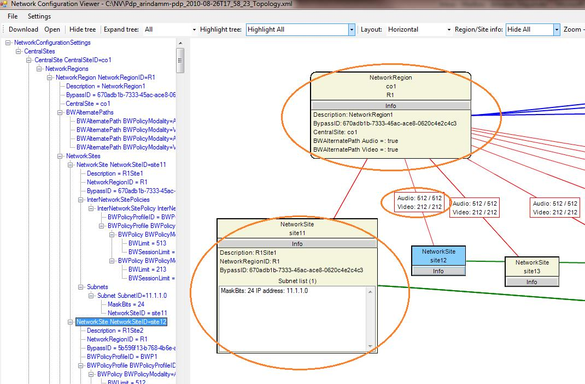

# <a name="skype-for-business-server-2015-resource-kit-tools-documentation"></a><span data-ttu-id="eabf9-107">Skype for Business Server 2015 リソース キット ツールのドキュメント</span><span class="sxs-lookup"><span data-stu-id="eabf9-107">Skype for Business Server 2015 Resource Kit Tools Documentation</span></span>

<span data-ttu-id="eabf9-108">このトピックでは、各ツール、およびその使用方法の例の目的を含む、ビジネス サーバー 2015 リソース キットの Skype では、ツールについて説明します。</span><span class="sxs-lookup"><span data-stu-id="eabf9-108">This topic describes the tools in the Skype for Business Server 2015 Resource Kit, including the purpose of each tool, and examples of its use.</span></span> <span data-ttu-id="eabf9-109">ビジネス 2015 リソース キットの Skype は、展開およびビジネス サーバー 2015 の Skype を管理する IT 管理者の日常的なタスクを容易に役立ちます。</span><span class="sxs-lookup"><span data-stu-id="eabf9-109">The Skype for Business Server 2015 Resource Kit helps to make routine tasks easier for IT administrators who deploy and manage Skype for Business Server 2015.</span></span> <span data-ttu-id="eabf9-110">たとえば、**Web Conf Data** ツールを使用すると、オンライン会議中にユーザーによってアップロードされたデータを簡単に制御できます。</span><span class="sxs-lookup"><span data-stu-id="eabf9-110">For example, the **Web Conf Data** tool can be used to easily control data that is uploaded by users during an online meeting.</span></span> <span data-ttu-id="eabf9-111">**SEFAUtil** ツールを使用すると、ユーザーの問い合わせに対して自動転送や自動応答を設定できます。</span><span class="sxs-lookup"><span data-stu-id="eabf9-111">The **SEFAUtil** tool can be used to set up delegate call forwarding and answering for users.</span></span> <span data-ttu-id="eabf9-112">IT 管理者は、ビジネス サーバー 2015 の Skype をより効果的に管理するためにこれらのツールを使用することをお勧めします。</span><span class="sxs-lookup"><span data-stu-id="eabf9-112">We encourage IT administrators to use these tools to more effectively manage Skype for Business Server 2015.</span></span>

## <a name="installation-of-the-resource-kit-tools"></a><span data-ttu-id="eabf9-113">リソース キット ツールのインストール</span><span class="sxs-lookup"><span data-stu-id="eabf9-113">Installation of the Resource Kit Tools</span></span>

<span data-ttu-id="eabf9-114">ビジネス 2015 リソース キットは、Skype をインストールするには、ダウンロード センターから[OCSReskit.msi](https://www.microsoft.com/en-us/download/details.aspx?id=52631)をダウンロードします。</span><span class="sxs-lookup"><span data-stu-id="eabf9-114">To install the Skype for Business Server 2015 Resource Kit, download [OCSReskit.msi](https://www.microsoft.com/en-us/download/details.aspx?id=52631) from the Download Center.</span></span>

<span data-ttu-id="eabf9-p103">**OCSResKit.msi** を実行すると、簡易インストールが行われます。.msi によって、**%Program Files%\Skype for Business Server 2015\ResKit** のパスにすべてのツールがインストールされます。このフォルダーには、自己完結型のツールの実行可能ファイルが格納されます。各ツールのサポート ファイルは、それぞれのサブフォルダーに格納されます。</span><span class="sxs-lookup"><span data-stu-id="eabf9-p103">Run **OCSResKit.msi** to do a simple installation. The .msi installs all the tools in the following path: **%Program Files%\Skype for Business Server 2015\ResKit**. Tools that are self-contained executables are in this folder. Tools that also have supporting files are in their own subfolders.</span></span>

## <a name="supported-environments"></a><span data-ttu-id="eabf9-119">サポートされる環境</span><span class="sxs-lookup"><span data-stu-id="eabf9-119">Supported Environments</span></span>

<span data-ttu-id="eabf9-120">ビジネス 2015 リソース キットの Skype は、Skype ビジネス サーバー 2015、通常 1 つのビジネス サーバー 2015 の Skype を実行に使用するのに必要な要件を満たすサーバーにインストールしてください。</span><span class="sxs-lookup"><span data-stu-id="eabf9-120">The Skype for Business Server 2015 Resource Kit should be installed on a server that meets the specifications required for Skype for Business Server 2015, usually one being used to run Skype for Business Server 2015.</span></span>

## <a name="resource-kit-tools-overview"></a><span data-ttu-id="eabf9-121">リソース キット ツールの概要</span><span class="sxs-lookup"><span data-stu-id="eabf9-121">Resource Kit Tools Overview</span></span>

<span data-ttu-id="eabf9-122">ビジネス 2015 リソース キットは、Skype で提供されているツールの一覧を次に示します。</span><span class="sxs-lookup"><span data-stu-id="eabf9-122">The following is a list of the tools that are provided in the Skype for Business Server 2015 Resource Kit.</span></span> <span data-ttu-id="eabf9-123">各ツールの要件や使用例については、以下のセクションで説明します。</span><span class="sxs-lookup"><span data-stu-id="eabf9-123">A description of each tool, including the requirements and example usage is covered in the following sections.</span></span>

- [<span data-ttu-id="eabf9-124">ABSConfig</span><span class="sxs-lookup"><span data-stu-id="eabf9-124">ABSConfig</span></span>](resource-kit-tools.md#ABSConfig)

- [<span data-ttu-id="eabf9-125">Bandwidth Policy Service Monitor</span><span class="sxs-lookup"><span data-stu-id="eabf9-125">Bandwidth Policy Service Monitor</span></span>](resource-kit-tools.md#bpsm)

- [<span data-ttu-id="eabf9-126">Bandwidth Utilization Analyzer</span><span class="sxs-lookup"><span data-stu-id="eabf9-126">Bandwidth Utilization Analyzer</span></span>](resource-kit-tools.md#bua)

- [<span data-ttu-id="eabf9-127">Call Parkometer</span><span class="sxs-lookup"><span data-stu-id="eabf9-127">Call Parkometer</span></span>](resource-kit-tools.md#callpark)

- [<span data-ttu-id="eabf9-128">DBAnalyze</span><span class="sxs-lookup"><span data-stu-id="eabf9-128">DBAnalyze</span></span>](resource-kit-tools.md#dba)

- [<span data-ttu-id="eabf9-129">Import Storage Service Data</span><span class="sxs-lookup"><span data-stu-id="eabf9-129">Import Storage Service Data</span></span>](resource-kit-tools.md#Issd)

- [<span data-ttu-id="eabf9-130">LCSSync</span><span class="sxs-lookup"><span data-stu-id="eabf9-130">LCSSync</span></span>](resource-kit-tools.md#LCSSync)

- [<span data-ttu-id="eabf9-131">Lookup User Console</span><span class="sxs-lookup"><span data-stu-id="eabf9-131">Lookup User Console</span></span>](resource-kit-tools.md#LUC)

- [<span data-ttu-id="eabf9-132">MsTurnPing</span><span class="sxs-lookup"><span data-stu-id="eabf9-132">MsTurnPing</span></span>](resource-kit-tools.md#MsTurnPing)

- [<span data-ttu-id="eabf9-133">Network Configuration Viewer</span><span class="sxs-lookup"><span data-stu-id="eabf9-133">Network Configuration Viewer</span></span>](resource-kit-tools.md#NCV)

- [<span data-ttu-id="eabf9-134">Response Group Agent Live</span><span class="sxs-lookup"><span data-stu-id="eabf9-134">Response Group Agent Live</span></span>](resource-kit-tools.md#RGAL)

- [<span data-ttu-id="eabf9-135">SEFAUtil</span><span class="sxs-lookup"><span data-stu-id="eabf9-135">SEFAUtil</span></span>](resource-kit-tools.md#SEFAUtil)

- [<span data-ttu-id="eabf9-136">SYSPrep.ps1</span><span class="sxs-lookup"><span data-stu-id="eabf9-136">SYSPrep.ps1</span></span>](resource-kit-tools.md#SYSPrep)

- [<span data-ttu-id="eabf9-137">Unassigned Number Announcements Migration</span><span class="sxs-lookup"><span data-stu-id="eabf9-137">Unassigned Number Announcements Migration</span></span>](resource-kit-tools.md#UNAM)

- [<span data-ttu-id="eabf9-138">Web Conf Data</span><span class="sxs-lookup"><span data-stu-id="eabf9-138">Web Conf Data</span></span>](resource-kit-tools.md#WebConfData)

## <a name="absconfig"></a><span data-ttu-id="eabf9-139">ABSConfig</span><span class="sxs-lookup"><span data-stu-id="eabf9-139">ABSConfig</span></span>
<span data-ttu-id="eabf9-140"><a name="ABSConfig"> </a></span><span class="sxs-lookup"><span data-stu-id="eabf9-140"></span></span>

<span data-ttu-id="eabf9-141">アドレス帳サービスの構成ツール (ABSConfig) は、ビジネス サーバー 2015 の Skype のアドレス帳サービスの構成をカスタマイズする管理者を支援する管理ツールです。</span><span class="sxs-lookup"><span data-stu-id="eabf9-141">The Address Book Service Configuration tool (ABSConfig) is an administrative tool that helps administrators customize Address Book Service configuration in Skype for Business Server 2015.</span></span> <span data-ttu-id="eabf9-142">このツールでは、既定のアドレス帳サービスの設定を復元するサーバー 2015 のビジネス管理者のための Skype も使用できます。</span><span class="sxs-lookup"><span data-stu-id="eabf9-142">This tool also enables Skype for Business Server 2015 administrators to restore the default Address Book Service settings.</span></span>

### <a name="description"></a><span data-ttu-id="eabf9-143">説明</span><span class="sxs-lookup"><span data-stu-id="eabf9-143">Description</span></span>

<span data-ttu-id="eabf9-144">ABSConfig は、アドレス帳サービスに関連する属性を Active Directory ドメイン サービスを構成する管理者を有効にするグラフィカル ユーザー インターフェイス アプリケーションです。</span><span class="sxs-lookup"><span data-stu-id="eabf9-144">ABSConfig is a graphical user interface application that enables administrators to configure Active Directory Domain Services attributes that are related to Address Book Service.</span></span>

<span data-ttu-id="eabf9-145">このツールを使用する主なシナリオは、次のとおりです。</span><span class="sxs-lookup"><span data-stu-id="eabf9-145">The primary scenarios for the tool are the following:</span></span>

- <span data-ttu-id="eabf9-146">ビジネス サーバー 2015 の Skype の Active Directory ドメイン サービス内の属性を属性にマップするのには管理者を有効にします。</span><span class="sxs-lookup"><span data-stu-id="eabf9-146">To enable administrators to map attributes in Active Directory Domain Services to the attributes for Skype for Business Server 2015.</span></span>

- <span data-ttu-id="eabf9-147">管理者が Active Directory ドメイン サービスの属性をアドレス帳サービスのファイルに含めるか、ファイルから除外できるようにする。</span><span class="sxs-lookup"><span data-stu-id="eabf9-147">To enable administrators to specify the Active Directory Domain Services attribute to be included or excluded in the Address Book Service files.</span></span>

- <span data-ttu-id="eabf9-148">管理者がアドレス帳サービスの既定の設定を復元できるようにする。</span><span class="sxs-lookup"><span data-stu-id="eabf9-148">To enable administrators to restore default Address Book Service settings.</span></span>

<span data-ttu-id="eabf9-149">ABSConfig ツールは、absConfig.exe ファイルから起動できます。</span><span class="sxs-lookup"><span data-stu-id="eabf9-149">The ABSConfig tool can be started by using the ABSConfig.exe file.</span></span> <span data-ttu-id="eabf9-150">ツールは、[**属性の構成**] タブを開きます。このテーブルには、ビジネス サーバー 2015 の Skype の Active Directory ドメイン サービスの属性を属性フィールドにマップしてフィルターの特定の属性に基づいてアドレス帳サービスのファイルに含めたり除外したりできるユーザーを指定するオプションがあります。</span><span class="sxs-lookup"><span data-stu-id="eabf9-150">The tool opens to the **Configure Attributes** tab. This table has options to map Active Directory Domain Services attributes to the attribute fields for Skype for Business Server 2015 and to specify which users to include or exclude in Address Book Service files based on specific attribute filters.</span></span> <span data-ttu-id="eabf9-151">また、アドレス帳ファイルに含める電話番号の値をカスタマイズできます。</span><span class="sxs-lookup"><span data-stu-id="eabf9-151">It also has options to customize which value of the phone number to be included in the Address Book file.</span></span> <span data-ttu-id="eabf9-152">[**Restore Defaults**] オプションを使用すると、アドレス帳サービスの設定を既定の値に復元できます。</span><span class="sxs-lookup"><span data-stu-id="eabf9-152">The **Restore Defaults** option enables administrators to restore Address Book Service settings to default values.</span></span>

> [!NOTE]
> <span data-ttu-id="eabf9-153">OC フィールド名を別の AD 属性の再マッピングして、アドレス帳ファイルをダウンロードするための作業だけでは、アドレス帳 Web クエリではサポートされていません。</span><span class="sxs-lookup"><span data-stu-id="eabf9-153">Re-mapping of AD attributes to different OC Field Names will only work for Address Book File Download, and is not supported by Address Book Web Query.</span></span>

### <a name="output"></a><span data-ttu-id="eabf9-154">出力</span><span class="sxs-lookup"><span data-stu-id="eabf9-154">Output</span></span>

<span data-ttu-id="eabf9-155">ABSConfig は、アドレス帳サービスの構成をデータベースに格納します。</span><span class="sxs-lookup"><span data-stu-id="eabf9-155">ABSConfig stores the Address Book Service configuration in the database.</span></span>

```
Path: %ProgramFiles%\Skype for Business Server 2015\Reskit
```

### <a name="purpose"></a><span data-ttu-id="eabf9-156">用途</span><span class="sxs-lookup"><span data-stu-id="eabf9-156">Purpose</span></span>

<span data-ttu-id="eabf9-157">ABSConfig は、ビジネス サーバー 2015 のアドレス帳サービスの Skype をカスタマイズするのには迅速で簡単な方法を提供します。</span><span class="sxs-lookup"><span data-stu-id="eabf9-157">ABSConfig provides a quick and easy way to customize Skype for Business Server 2015 Address Book Service.</span></span>

### <a name="requirements"></a><span data-ttu-id="eabf9-158">要件</span><span class="sxs-lookup"><span data-stu-id="eabf9-158">Requirements</span></span>

#### <a name="computer"></a><span data-ttu-id="eabf9-159">コンピューター</span><span class="sxs-lookup"><span data-stu-id="eabf9-159">Computer</span></span>

<span data-ttu-id="eabf9-160">ABSConfig は、Skype をビジネス サーバー 2015 がインストールされているのドメインに参加しているコンピューターからのみ実行できます。</span><span class="sxs-lookup"><span data-stu-id="eabf9-160">ABSConfig can be run only from a domain-joined computer that has Skype for Business Server 2015 installed.</span></span> <span data-ttu-id="eabf9-161">ビジネス サーバー 2015、Enterprise Edition の場合は、Skype の場合は、セットアップ中に有効なアドレス帳サービスを使用するフロント エンド サーバーでこのツールを実行できます。</span><span class="sxs-lookup"><span data-stu-id="eabf9-161">In the case of Skype for Business Server 2015, Enterprise Edition, this tool can be run on any Front End servers that have the Address Book Service enabled during setup.</span></span>

#### <a name="network"></a><span data-ttu-id="eabf9-162">ネットワーク</span><span class="sxs-lookup"><span data-stu-id="eabf9-162">Network</span></span>

<span data-ttu-id="eabf9-163">コンピューターは、フロントエンド プールとバックエンド データベースに接続できる必要があります。</span><span class="sxs-lookup"><span data-stu-id="eabf9-163">The computer should be able to connect to the Front End pool and back-end database.</span></span>

#### <a name="software"></a><span data-ttu-id="eabf9-164">ソフトウェア</span><span class="sxs-lookup"><span data-stu-id="eabf9-164">Software</span></span>

<span data-ttu-id="eabf9-165">ABSConfig ツールを実行する前に、次のソフトウェア コンポーネントをインストールしておく必要があります。</span><span class="sxs-lookup"><span data-stu-id="eabf9-165">The following software components must be installed before running the ABSConfig tool:</span></span>

- <span data-ttu-id="eabf9-166">Skype for Business Server 2015</span><span class="sxs-lookup"><span data-stu-id="eabf9-166">Skype for Business Server 2015</span></span>

#### <a name="users"></a><span data-ttu-id="eabf9-167">ユーザー</span><span class="sxs-lookup"><span data-stu-id="eabf9-167">Users</span></span>

<span data-ttu-id="eabf9-168">サーバー 2015 のビジネス展開に Skype を更新するために必要なアクセス許可を持つ管理者。</span><span class="sxs-lookup"><span data-stu-id="eabf9-168">Administrators who have the permissions required to update the Skype for Business Server 2015 deployment.</span></span>

### <a name="examples"></a><span data-ttu-id="eabf9-169">例</span><span class="sxs-lookup"><span data-stu-id="eabf9-169">Examples</span></span>

<span data-ttu-id="eabf9-p108">ABSConfig は、コマンド プロンプトで **ABSConfig.exe** と入力して起動することができます。ABSConfig ツールのユーザー インターフェイスを以下に示します。</span><span class="sxs-lookup"><span data-stu-id="eabf9-p108">ABSConfig can be started by typing **ABSConfig.exe** at a command prompt. Shown below is the ABSConfig tool user interface.</span></span>


### <a name="summary"></a><span data-ttu-id="eabf9-173">概要</span><span class="sxs-lookup"><span data-stu-id="eabf9-173">Summary</span></span>

<span data-ttu-id="eabf9-174">ABSConfig ツールは、ビジネス サーバー 2015 のアドレス帳サービスの Skype をカスタマイズするのには短時間で使いやすいツールを管理者に提供します。</span><span class="sxs-lookup"><span data-stu-id="eabf9-174">The ABSConfig tool provides administrators a quick and easy to use tool to customize Skype for Business Server 2015 Address Book Service.</span></span>

## <a name="bandwidth-policy-service-monitor"></a><span data-ttu-id="eabf9-175">Bandwidth Policy Service Monitor</span><span class="sxs-lookup"><span data-stu-id="eabf9-175">Bandwidth Policy Service Monitor</span></span>
<span data-ttu-id="eabf9-176"><a name="bpsm"> </a></span><span class="sxs-lookup"><span data-stu-id="eabf9-176"></span></span>

<span data-ttu-id="eabf9-177">Bandwidth Policy Service Monitor ツールを使用すると、管理者は以下のリストを表示することができます。</span><span class="sxs-lookup"><span data-stu-id="eabf9-177">The Bandwidth Policy Service Monitor tool is intended to allow administrators to view a list of the following:</span></span>

1. <span data-ttu-id="eabf9-178">ビジネス サーバー 2015 の帯域幅ポリシー サービス (認証とコア) トポロジで構成されているすべての Skype</span><span class="sxs-lookup"><span data-stu-id="eabf9-178">All the configured Skype for Business Server 2015 Bandwidth Policy services (Authentication and Core) in the topology</span></span>

2. <span data-ttu-id="eabf9-179">各サービスの帯域幅ポリシー サービスとエッジ サーバーへの接続状況</span><span class="sxs-lookup"><span data-stu-id="eabf9-179">The connections that each service makes to other Bandwidth Policy services and to the Edge servers</span></span>

3. <span data-ttu-id="eabf9-180">ネットワーク構成ドキュメントで構成されたすべてのリンクと、各帯域幅ポリシー サービスから報告されたリアルタイムの帯域幅の使用状況</span><span class="sxs-lookup"><span data-stu-id="eabf9-180">All the links that are configured in the Network configuration document and real-time bandwidth usage as reported by each of the Bandwidth Policy services</span></span>

### <a name="description"></a><span data-ttu-id="eabf9-181">説明</span><span class="sxs-lookup"><span data-stu-id="eabf9-181">Description</span></span>

<span data-ttu-id="eabf9-p109">Bandwidth Policy Service Monitor ツールは、GUI ベースのアプリケーションとして実装されています。管理者は、PDPMonUI.exe を実行してツールを起動します。</span><span class="sxs-lookup"><span data-stu-id="eabf9-p109">The Bandwidth Policy Service Monitor tool is implemented as a GUI-based application. Administrators start the tool by running PDPMonUI.exe.</span></span>

<span data-ttu-id="eabf9-p110">ツールを起動すると、ツールはトポロジ内の帯域幅ポリシー サービスの一覧を検索します。初期アップデートが完了すると、ウィンドウの左ペインに、所属するクラスターによってグループ分けされたサービスの一覧が表示されます。</span><span class="sxs-lookup"><span data-stu-id="eabf9-p110">When the tool starts, it attempts to discover the list of Bandwidth Policy services in the topology. After the initial update is done, the pane to the left of the window is populated with a list of services that are grouped by the clusters that they belong to.</span></span>

<span data-ttu-id="eabf9-p111">管理者が特定の帯域幅ポリシー サービスを選ぶと、右ペインにそのサービスの情報が表示されます。次の 2 つのメイン タブにそれぞれ情報が表示されます。</span><span class="sxs-lookup"><span data-stu-id="eabf9-p111">When administrators select a particular Bandwidth Policy Service, the pane on the right displays the information about that particular service. That pane also has two main tabs that display information.</span></span>

#### <a name="machine-info-tab"></a><span data-ttu-id="eabf9-188">[Machine Info] タブ</span><span class="sxs-lookup"><span data-stu-id="eabf9-188">Machine Info Tab</span></span>

<span data-ttu-id="eabf9-189">[**Machine Info**] タブには、選択した帯域幅ポリシー サービスの詳細と、選択した帯域幅ポリシー サービスから別のサービスへの接続の一覧と状態が表示されます。</span><span class="sxs-lookup"><span data-stu-id="eabf9-189">The **Machine Info** tab shows the details of the Bandwidth Policy Service that is selected and the list and state of all the connections that are made by the selected Bandwidth Policy Service to other services.</span></span>

#### <a name="topology-info-tab"></a><span data-ttu-id="eabf9-190">[Topology Info] タブ</span><span class="sxs-lookup"><span data-stu-id="eabf9-190">Topology Info Tab</span></span>

<span data-ttu-id="eabf9-p112">[**Topology Info**] タブには、ネットワーク構成設定で構成されたすべてのリンクの一覧が表示されます。各リンクには、音声とビデオの帯域幅容量が表示されます。さらに、現在使用されている帯域幅が、Kbps と容量に対する割合で表示されます。ツールでは色分けが使用され、容量の上限に近づいているリンクが強調表示されます。これにより、管理者は対象のリンクをすばやく分離できます。</span><span class="sxs-lookup"><span data-stu-id="eabf9-p112">The **Topology Info** tab shows a list of all the links that are configured in the Network configuration settings. For each link, the audio and video bandwidth capacity is displayed. Additionally, the currently utilized bandwidth is displayed, both in Kbps and as a percentage of the capacity. The tool uses color-coding to highlight links that have utilization that is close to the capacity—this allows administrators to quickly isolate such links.</span></span>

> [!NOTE]
>  <span data-ttu-id="eabf9-195">場合は、帯域幅ポリシー サービス監視ツールに障害が発生したは、構成されている帯域幅ポリシー サービスのいずれかに接続するとき、**マシン情報**および**トポロジー情報**のタブ内の情報を設定しません。</span><span class="sxs-lookup"><span data-stu-id="eabf9-195">If the Bandwidth Policy Service Monitor tool experiences failure when it connects to any of the configured Bandwidth Policy services, the information in the **Machine Info** and the **Topology Info** tabs won't be populated.</span></span> <span data-ttu-id="eabf9-196">ただし、最初は接続されたにもかかわらず、後にサービスへの接続が途切れることもあります。</span><span class="sxs-lookup"><span data-stu-id="eabf9-196">However, it is possible that the tool might connect initially but subsequently lose its connection to the service.</span></span> <span data-ttu-id="eabf9-197">このような場合、管理者に古い情報が表示されることがあります。</span><span class="sxs-lookup"><span data-stu-id="eabf9-197">In such cases, administrators might see outdated information.</span></span> <span data-ttu-id="eabf9-198">各タブには [**Last Updated**] タイムスタンプが用意されているため、管理者は特定の帯域幅ポリシー サービスのデータが最後に更新された時間を確認できます。</span><span class="sxs-lookup"><span data-stu-id="eabf9-198">There is a **Last Updated** time stamp on each of the tabs that can allow administrators to see when the data was last updated for a particular Bandwidth Policy Service.</span></span>

### <a name="output"></a><span data-ttu-id="eabf9-199">出力</span><span class="sxs-lookup"><span data-stu-id="eabf9-199">Output</span></span>

<span data-ttu-id="eabf9-200">コマンドラインの出力はありません。プログラムの出力は、メインのグラフィカル ユーザー インターフェイス (GUI) に含まれています。</span><span class="sxs-lookup"><span data-stu-id="eabf9-200">There is no command-line output; the program output is contained within the main graphical user interface (GUI).</span></span>

### <a name="purpose"></a><span data-ttu-id="eabf9-201">用途</span><span class="sxs-lookup"><span data-stu-id="eabf9-201">Purpose</span></span>

<span data-ttu-id="eabf9-p114">Bandwidth Policy Service Monitor ツールを使用すると、管理者はトポロジに定義された各帯域幅ポリシー サービスの詳細を確認できます。さらに、管理者はネットワーク構成ドキュメントに定義されたすべてのリンクの帯域幅の使用状況を、リアルタイムで確認できます。</span><span class="sxs-lookup"><span data-stu-id="eabf9-p114">The purpose of the Bandwidth Policy Service Monitor tool is to allow administrators visibility into the state of each of the Bandwidth Policy services that are defined in the topology. In addition, administrators can see real-time bandwidth usage for all the links that are defined in the Network configuration document.</span></span>

### <a name="requirements"></a><span data-ttu-id="eabf9-204">要件</span><span class="sxs-lookup"><span data-stu-id="eabf9-204">Requirements</span></span>

<span data-ttu-id="eabf9-205">帯域幅ポリシー サービス監視ツールは、ビジネスのサーバー トポロジの Skype の一部であるコンピューター上で実行する必要があります。</span><span class="sxs-lookup"><span data-stu-id="eabf9-205">The Bandwidth Policy Service Monitor tool needs to be run on a computer that is part of the Skype for Business Server topology.</span></span>

### <a name="summary"></a><span data-ttu-id="eabf9-206">概要</span><span class="sxs-lookup"><span data-stu-id="eabf9-206">Summary</span></span>

<span data-ttu-id="eabf9-207">Bandwidth Policy Service Monitor ツールを使用すると、トポロジ内の帯域幅ポリシー サービスの状態を確認できます。さらに、ネットワーク構成設定で定義されたリンクの帯域幅のリアルタイムの使用状況を把握できるため、管理者にとって非常に重要なリソースです。</span><span class="sxs-lookup"><span data-stu-id="eabf9-207">The Bandwidth Policy Service Monitor tool can be a valuable resource to administrators so they can inspect the state of all the Bandwidth Policy services in the topology—and more importantly—they can obtain real-time bandwidth utilization for the links that are defined in the Network configuration settings.</span></span>

## <a name="bandwidth-utilization-analyzer"></a><span data-ttu-id="eabf9-208">Bandwidth Utilization Analyzer</span><span class="sxs-lookup"><span data-stu-id="eabf9-208">Bandwidth Utilization Analyzer</span></span>
<span data-ttu-id="eabf9-209"><a name="bua"> </a></span><span class="sxs-lookup"><span data-stu-id="eabf9-209"></span></span>

<span data-ttu-id="eabf9-p115">Bandwidth Utilization Analyzer は、エンタープライズ ネットワークの WAN リンク全体の UC エンドポイントで消費される帯域幅を、さまざまな観点から確認できるレポートを作成するツールです。これらのレポートを使用すると、現在の帯域幅の消費パターンを把握して、帯域幅の容量計画に活用できます。</span><span class="sxs-lookup"><span data-stu-id="eabf9-p115">Bandwidth Utilization Analyzer is a tool that creates reports about various views of bandwidth consumption by the UC endpoints across WAN links in the enterprise network. These reports can be used to understand the current bandwidth consumption pattern and to aid in bandwidth capacity planning.</span></span>

### <a name="description"></a><span data-ttu-id="eabf9-212">説明</span><span class="sxs-lookup"><span data-stu-id="eabf9-212">Description</span></span>

<span data-ttu-id="eabf9-p116">Bandwidth Utilization Analyzer は、GUI ベースのアプリケーションとして実装されます。このツールは、ネットワーク全体音声に限定した使用状況に関するレポートを作成し、容量の計画に活用できます。また、さまざまなリンクに割り当てられた帯域幅容量を反復処理します。</span><span class="sxs-lookup"><span data-stu-id="eabf9-p116">Bandwidth Utilization Analyzer is implemented as a GUI-based application. This tool generates reports specifically for audio utilization across the network and helps with capacity planning. It also iterates on the bandwidth capacity that is assigned to various links.</span></span>

### <a name="output"></a><span data-ttu-id="eabf9-216">出力</span><span class="sxs-lookup"><span data-stu-id="eabf9-216">Output</span></span>

<span data-ttu-id="eabf9-217">Bandwidth Utilization Analyzer には、システムで構成されたすべての WAN リンクにおける、音声の帯域幅容量と使用状況に関するグラフィカル プロットが用意されています。</span><span class="sxs-lookup"><span data-stu-id="eabf9-217">Bandwidth Utilization Analyzer provides graphic al plots of bandwidth capacity and utilization for audio for all the WAN links that are configured in the system.</span></span>

### <a name="purpose"></a><span data-ttu-id="eabf9-218">用途</span><span class="sxs-lookup"><span data-stu-id="eabf9-218">Purpose</span></span>

<span data-ttu-id="eabf9-219">任意の音声とビデオの展開では、監視し、企業ネットワーク全体でメディア トラフィックの帯域幅使用率の傾向を理解するが重要です。</span><span class="sxs-lookup"><span data-stu-id="eabf9-219">In any voice and video deployment, it's critical to monitor and understand the trend of bandwidth utilization of media traffic across the enterprise network.</span></span> <span data-ttu-id="eabf9-220">Bandwidth Utilization Analyzer ツールを使用すると、管理者はそれを把握できます。</span><span class="sxs-lookup"><span data-stu-id="eabf9-220">The Bandwidth Utilization Analyzer tool allows an administrator to achieve just that.</span></span> <span data-ttu-id="eabf9-221">このツールでは、次の操作を実行できます。</span><span class="sxs-lookup"><span data-stu-id="eabf9-221">This tool does the following:</span></span>

- <span data-ttu-id="eabf9-222">ネットワーク全体にわたる音声の使用状況に関するレポートを生成する</span><span class="sxs-lookup"><span data-stu-id="eabf9-222">Generates specific reports for audio utilization across the network</span></span>

- <span data-ttu-id="eabf9-223">より効果的な容量計画の立案と、さまざまなリンクに割り当てられた帯域幅容量の反復処理をサポートする</span><span class="sxs-lookup"><span data-stu-id="eabf9-223">Helps with more effective capacity planning and iteration on the bandwidth capacity that is assigned to various links</span></span>

<span data-ttu-id="eabf9-224">Bandwidth Utilization Analyzer では、帯域幅容量のグラフィカル プロットと使用状況レポートを作成できます。その範囲と実行可能な操作は次のとおりです。</span><span class="sxs-lookup"><span data-stu-id="eabf9-224">Bandwidth Utilization Analyzer can generate graphical plots of bandwidth capacity and utilization reports; they are as follows:</span></span>

- <span data-ttu-id="eabf9-225">エンタープライズ ネットワーク内のすべての WAN リンク</span><span class="sxs-lookup"><span data-stu-id="eabf9-225">All the WAN links in the enterprise network</span></span>

- <span data-ttu-id="eabf9-226">事前に指定した WAN リンクでフィルター処理</span><span class="sxs-lookup"><span data-stu-id="eabf9-226">Filtered by selected WAN links that have been chosen</span></span>

- <span data-ttu-id="eabf9-227">リンク容量を超過した WAN リンクでフィルター処理</span><span class="sxs-lookup"><span data-stu-id="eabf9-227">Filtered by WAN links that have exceeded link capacity</span></span>

- <span data-ttu-id="eabf9-228">帯域幅の使用率が予測を下回る WAN リンクでフィルター処理</span><span class="sxs-lookup"><span data-stu-id="eabf9-228">Filtered by WAN links that have been under-utilizing the provisioned bandwidth</span></span>

- <span data-ttu-id="eabf9-229">重大レベル (WAN リンクの帯域幅使用率が容量の 90% を超過している) に達している WAN リンクでフィルター処理</span><span class="sxs-lookup"><span data-stu-id="eabf9-229">Filter by WAN links that have been reaching critical levels (a bandwidth utilization that is greater than 90% of bandwidth capacity of the WAN link)</span></span>

- <span data-ttu-id="eabf9-230">WAN リンクの種類 (ネットワーク サイト リンク、地域間リンク、サイト内リンク) でフィルター処理</span><span class="sxs-lookup"><span data-stu-id="eabf9-230">Filtered by WAN link type—network-site links, interregional links, and links within a site</span></span>

- <span data-ttu-id="eabf9-231">ネットワーク地域でフィルター処理</span><span class="sxs-lookup"><span data-stu-id="eabf9-231">Filtered by network region</span></span>

#### <a name="applications"></a><span data-ttu-id="eabf9-232">アプリケーション</span><span class="sxs-lookup"><span data-stu-id="eabf9-232">Applications</span></span>

<span data-ttu-id="eabf9-233">Bandwidth Utilization Analyzer には、次の 2 つのアプリケーション (ツール) が用意されています。</span><span class="sxs-lookup"><span data-stu-id="eabf9-233">Bandwidth Utilization Analyzer has the following two applications (tools):</span></span>

- <span data-ttu-id="eabf9-234">**WanLinkLogCollector.exe**このツールは、必要な情報を入力するには、そのユーザーを使用します。</span><span class="sxs-lookup"><span data-stu-id="eabf9-234">**WanLinkLogCollector.exe** This tool enables its user to input the required information.</span></span>

- <span data-ttu-id="eabf9-235">**BandwidthUtilizationAnalyzer.xlsm** WanLinkLogCollector.exe で A Microsoft Excel スプレッドシート ソフトウェア レポートが自動的に起動されます。</span><span class="sxs-lookup"><span data-stu-id="eabf9-235">**BandwidthUtilizationAnalyzer.xlsm** A Microsoft Excel spreadsheet software report is automatically launched by WanLinkLogCollector.exe.</span></span> <span data-ttu-id="eabf9-236">このアプリケーションでは、レポートにフィルターを適用できます (この記事の後半で説明します)。</span><span class="sxs-lookup"><span data-stu-id="eabf9-236">This application allows the user to apply filters to the report as shown later in this article.</span></span>

#### <a name="phases-of-using-bandwidth-utilization-analyzer"></a><span data-ttu-id="eabf9-237">Bandwidth Utilization Analyzer の使用フェーズ</span><span class="sxs-lookup"><span data-stu-id="eabf9-237">Phases of Using Bandwidth Utilization Analyzer</span></span>

<span data-ttu-id="eabf9-238">Bandwidth Utilization Analyzer の使用は、次の 2 つのフェーズに分けられます。</span><span class="sxs-lookup"><span data-stu-id="eabf9-238">There are two phases when using Bandwidth Utilization Analyzer:</span></span>

- <span data-ttu-id="eabf9-239">ログの収集 (WanLinkLogCollector.exe を使用)</span><span class="sxs-lookup"><span data-stu-id="eabf9-239">Collect logs, which is performed by using WanLinkLogCollector.exe</span></span>

- <span data-ttu-id="eabf9-240">レポートのカスタマイズ (BandwidthUtilizationAnalyzer.xlsm を使用)</span><span class="sxs-lookup"><span data-stu-id="eabf9-240">Customize reports, which is performed by using BandwidthUtilizationAnalyzer.xlsm</span></span>

> [!IMPORTANT]
> <span data-ttu-id="eabf9-241">BandwidthUtilizationAnalyzer.xlsm はエンド ユーザーが手動で起動できないようにすることを強くお勧めします。</span><span class="sxs-lookup"><span data-stu-id="eabf9-241">We strongly recommend that BandwidthUtilizationAnalyzer.xlsm not be manually launched by end users.</span></span>

#### <a name="starting-bandwidth-utilization-analyzer"></a><span data-ttu-id="eabf9-242">Bandwidth Utilization Analyzer の起動</span><span class="sxs-lookup"><span data-stu-id="eabf9-242">Starting Bandwidth Utilization Analyzer</span></span>

<span data-ttu-id="eabf9-243">コマンド プロンプトで WanLinkLogCollector.exe を実行するか、Windows エクスプローラーを使用して起動します。</span><span class="sxs-lookup"><span data-stu-id="eabf9-243">Start WanLinkLogCollector.exe at the command prompt or by using Windows Explorer.</span></span>

 <span data-ttu-id="eabf9-244">**WanLinkLogCollector.exe の使用**</span><span class="sxs-lookup"><span data-stu-id="eabf9-244">**Using WanLinkLogCollector.exe**</span></span>

<span data-ttu-id="eabf9-245">WanLinkLogCollector.exe を使用するには、次の 3 つの手順を実行します。</span><span class="sxs-lookup"><span data-stu-id="eabf9-245">There are three steps to using WanLinkLogCollector.exe:</span></span>

1. <span data-ttu-id="eabf9-246">**タイムラインのログ**レポートを生成する必要があるタイムラインを提供します。</span><span class="sxs-lookup"><span data-stu-id="eabf9-246">**Log the timeline** Provide the timeline that the report needs to be generated for</span></span>

2. <span data-ttu-id="eabf9-247">**ファイルのディレクトリを指定します。** ファイルの場所に関する情報を提供します。</span><span class="sxs-lookup"><span data-stu-id="eabf9-247">**Specify the file directories** Provide file location information</span></span>

3. <span data-ttu-id="eabf9-248">**ログを収集しレポート ビューアーを起動します。** レポートを生成するコマンドを実行します。</span><span class="sxs-lookup"><span data-stu-id="eabf9-248">**Collect the logs and launch the report viewer** Execute the command to generate the report</span></span>

#### <a name="step-1---log-the-timeline"></a><span data-ttu-id="eabf9-249">手順 1 - ログのタイムラインを指定する</span><span class="sxs-lookup"><span data-stu-id="eabf9-249">Step 1 - Log the timeline</span></span>

<span data-ttu-id="eabf9-250">タイムラインのログを記録するには、以下の図に示すように、次の項目を指定します。</span><span class="sxs-lookup"><span data-stu-id="eabf9-250">Logging the timeline allows the tool user to specify the following as shown in the figure below.</span></span>

1. <span data-ttu-id="eabf9-251">**Start date** レポートを生成するタイムラインの開始日 (例: 2010 年 8 月 1 日)。</span><span class="sxs-lookup"><span data-stu-id="eabf9-251">**Start date** This is the start date of the timeline that the report is to be generated for; for example, August 1, 2010.</span></span>

2. <span data-ttu-id="eabf9-252">**End date** レポートを生成するタイムラインの終了日 (例: 2010 年 9 月 30 日)。</span><span class="sxs-lookup"><span data-stu-id="eabf9-252">**End date** This is the end date of the timeline that the report is to be generated for; for example, September 30, 2010.</span></span>

     

#### <a name="step-2---specify-the-file-directories"></a><span data-ttu-id="eabf9-254">手順 2 - ファイルのディレクトリを指定する</span><span class="sxs-lookup"><span data-stu-id="eabf9-254">Step 2 - Specify the file directories</span></span>

<span data-ttu-id="eabf9-255">図に示すように、以下のファイル ディレクトリを指定することができます。</span><span class="sxs-lookup"><span data-stu-id="eabf9-255">The following file directories can be specified by the user as shown.</span></span>

- <span data-ttu-id="eabf9-256">**サーバー ログ ファイルの場所**帯域幅ポリシー サーバーのログが保存されているフォルダーの場所。</span><span class="sxs-lookup"><span data-stu-id="eabf9-256">**Server log files location** The folder location where Bandwidth policy server logs are stored.</span></span> <span data-ttu-id="eabf9-257">これは、通常の\<ファイル ・ サーバ\>\\FE の <choice\>\AppServerFiles\PDP。</span><span class="sxs-lookup"><span data-stu-id="eabf9-257">This is typically in \<fileserver\>\\<choice of FE\>\AppServerFiles\PDP.</span></span>

- <span data-ttu-id="eabf9-258">**一時ファイルの格納場所**レポートの中に中間ファイルが格納される一時ファイルの場所を生成しています。</span><span class="sxs-lookup"><span data-stu-id="eabf9-258">**Temporary file storage location** The temporary file location where intermediate files are stored while the report is being generated.</span></span>


> [!NOTE]
> <span data-ttu-id="eabf9-260">サーバー ログや一時ファイルを格納するフォルダーにアクセスできる十分な権限をツールのユーザーに割り当てるようにしてください。</span><span class="sxs-lookup"><span data-stu-id="eabf9-260">Ensure that sufficient file access to the server logs and the temporary file store folder is provided to the tool user.</span></span>

#### <a name="step-3---collect-the-logs-and-start-the-report-viewer"></a><span data-ttu-id="eabf9-261">手順 3 - ログを収集してレポート ビューアーを起動する</span><span class="sxs-lookup"><span data-stu-id="eabf9-261">Step 3 - Collect the logs and start the report viewer</span></span>

<span data-ttu-id="eabf9-p120">ログを収集してレポート ビューアーを起動するには、以下の図に示す [**Execute**] をクリックします。この手順により、必要なデータが収集されます。</span><span class="sxs-lookup"><span data-stu-id="eabf9-p120">To collect the logs and start the report viewer, click **Execute** as shown below. This step collects the required data.</span></span>


<span data-ttu-id="eabf9-265">入力の検証が正常に行われると、以下のメッセージが表示されます。</span><span class="sxs-lookup"><span data-stu-id="eabf9-265">When the input validation is successful, the message shown below is displayed.</span></span>


<span data-ttu-id="eabf9-p121">[**OK **] をクリックします。BandwidthUtilizationAnalyzer.xlsm は自動的に起動します。メッセージ ボックスの指示に従います。詳細については、次のセクション「**BandwidthUtilizationAnalyzer.xlsm の使用**」を参照してください。</span><span class="sxs-lookup"><span data-stu-id="eabf9-p121">Click **OK**. BandwidthUtilizationAnalyzer.xlsm is automatically started. Follow the instructions in the message box. For details, see **Using BandwidthUtilizationAnalyzer.xlsm** in the next section.</span></span>


### <a name="using-bandwidthutilizationanalyzerxlsm"></a><span data-ttu-id="eabf9-271">BandwidthUtilizationAnalyzer.xlsm の使用</span><span class="sxs-lookup"><span data-stu-id="eabf9-271">Using BandwidthUtilizationAnalyzer.xlsm</span></span>

1. <span data-ttu-id="eabf9-272">BandwidthUtilizationAnalyzer.xlsm が自動的に起動したら、以下の図に示す [**Refresh**] をクリックします。</span><span class="sxs-lookup"><span data-stu-id="eabf9-272">When BandwidthUtilizationAnalyzer.xlsm is automatically started, click **Refresh** as shown below.</span></span>

     

2. <span data-ttu-id="eabf9-p122">ファイルのフォルダーが開いたら、メッセージ ボックスで指定した場所にある consolidated.csv を選びます。以下に示すように、場所は **C:\Temp** です。</span><span class="sxs-lookup"><span data-stu-id="eabf9-p122">When a file folder is opened, select consolidated.csv from the location that is specified in the message box as shown below. It also shows the location as **C:\Temp**.</span></span>

     

3. <span data-ttu-id="eabf9-277">[**Import**] をクリックします。</span><span class="sxs-lookup"><span data-stu-id="eabf9-277">Click **Import**.</span></span>

4. <span data-ttu-id="eabf9-p123">グラフィカル プロットが自動的に生成されます。バックグラウンドで作業中のポインターが表示されなくなると、使用できます。</span><span class="sxs-lookup"><span data-stu-id="eabf9-p123">The graphical plot is automatically generated. It is available when the working-in-the-background pointer disappears.</span></span>

     

#### <a name="applying-filters-to-the-report-view"></a><span data-ttu-id="eabf9-281">レポート ビューにフィルターを適用する</span><span class="sxs-lookup"><span data-stu-id="eabf9-281">Applying Filters to the Report View</span></span>

<span data-ttu-id="eabf9-282">レポート ビューに適用できるフィルター (以下の図を参照) は、次のとおりです。</span><span class="sxs-lookup"><span data-stu-id="eabf9-282">The filters that can be applied to the report view as shown below are described as follows:</span></span>


1. <span data-ttu-id="eabf9-284">**Name** WAN リンクでフィルター処理 (グラフの右側のフィルター)。プレフィックス (縦長の青いボックスを参照) は、次のようなリンクの種類を示します。</span><span class="sxs-lookup"><span data-stu-id="eabf9-284">**Name** Filter by WAN links (the filter is on the right side of the graph).The prefix denotes the following link types; see the vertical (blue) box:</span></span>

   - <span data-ttu-id="eabf9-285">**S: Site** ネットワーク サイトからネットワーク地域への WAN リンク</span><span class="sxs-lookup"><span data-stu-id="eabf9-285">**S Site** The WAN link from a network site to a network region</span></span>

   - <span data-ttu-id="eabf9-286">**IS Inter-Site** 2 つのネットワーク サイト間の WAN リンク</span><span class="sxs-lookup"><span data-stu-id="eabf9-286">**IS Inter-Site** The WAN link between two network sites</span></span>

   - <span data-ttu-id="eabf9-287">**R Inter-Region** 2 つのネットワーク地域間の WAN リンク</span><span class="sxs-lookup"><span data-stu-id="eabf9-287">**R Inter-Region** The WAN link between two network region</span></span>

2. <span data-ttu-id="eabf9-288">**Exceeded limit** 帯域幅の使用率が帯域幅容量を超過している WAN リンクでフィルター処理</span><span class="sxs-lookup"><span data-stu-id="eabf9-288">**Exceeded limit** Filter by WAN links whose bandwidth utilization is more than the bandwidth capacity</span></span>

3. <span data-ttu-id="eabf9-289">**Critical levels** 帯域幅の使用率が帯域幅容量の 90% 以上に達した WAN リンクでフィルター処理</span><span class="sxs-lookup"><span data-stu-id="eabf9-289">**Critical levels** Filter by WAN links whose bandwidth utilization has reached 90% or more than the bandwidth capacity</span></span>

4. <span data-ttu-id="eabf9-290">**Under-utilized** 帯域幅の使用率が帯域幅容量の 25% に達していない WAN リンクでフィルター処理</span><span class="sxs-lookup"><span data-stu-id="eabf9-290">**Under-utilized** Filter by WAN links whose bandwidth utilization has been less than 25% of the bandwidth capacity</span></span>

5. <span data-ttu-id="eabf9-291">**Link type** 次に示す WAN リンクの種類でフィルター処理します。</span><span class="sxs-lookup"><span data-stu-id="eabf9-291">**Link type** Filter by the following WAN links types:</span></span>

   - <span data-ttu-id="eabf9-292">**Network site** タイプ</span><span class="sxs-lookup"><span data-stu-id="eabf9-292">**Network site** type</span></span>

   - <span data-ttu-id="eabf9-293">**Inter-site** タイプ</span><span class="sxs-lookup"><span data-stu-id="eabf9-293">**Inter-site** type</span></span>

   - <span data-ttu-id="eabf9-294">**Inter-Region link** タイプ</span><span class="sxs-lookup"><span data-stu-id="eabf9-294">**Inter-Region link** type</span></span>

6. <span data-ttu-id="eabf9-295">**Region** ネットワーク地域でフィルター処理</span><span class="sxs-lookup"><span data-stu-id="eabf9-295">**Region** Filter by network region</span></span>

<span data-ttu-id="eabf9-296">次の図は、これまでに紹介したフィルターを示します。</span><span class="sxs-lookup"><span data-stu-id="eabf9-296">The following figures show the previously described filters.</span></span>

<span data-ttu-id="eabf9-p124">[**Name**] でフィルター処理します。グラフに表示するリンクのリストを選びます。</span><span class="sxs-lookup"><span data-stu-id="eabf9-p124">Filter by **Name**. Select the list of links that need to be displayed in the graph.</span></span>

![BandwidthUtilizationAnalyzer での [Name] でのフィルター処理](../media/Reskit_2012_Tools_Documentation_Image12.jpg)

<span data-ttu-id="eabf9-300">[**Exceeded limit**] でフィルター処理します。</span><span class="sxs-lookup"><span data-stu-id="eabf9-300">Filter by **Exceeded limit**.</span></span> <span data-ttu-id="eabf9-301">フィルターを適用するには、[**True**] を選びます。</span><span class="sxs-lookup"><span data-stu-id="eabf9-301">Select **True** to enforce the filter.</span></span>

![[Exceeded Limit] でのフィルター処理](../media/Reskit_2012_Tools_Documentation_Image13.jpg)

<span data-ttu-id="eabf9-303">[\*\*Critical levels \*\*] でフィルター処理します。</span><span class="sxs-lookup"><span data-stu-id="eabf9-303">Filter by **Critical levels**.</span></span> <span data-ttu-id="eabf9-304">フィルターを適用するには、[\*\*TRUE \*\*] を選びます。</span><span class="sxs-lookup"><span data-stu-id="eabf9-304">Select **True** to enforce the filter.</span></span>

![[Critical Levels] でのフィルター処理](../media/Reskit_2012_Tools_Documentation_Image14.jpg)

<span data-ttu-id="eabf9-306">[\*\*Under-utilized \*\*] でフィルター処理します。</span><span class="sxs-lookup"><span data-stu-id="eabf9-306">Filter by **Under utilized**.</span></span> <span data-ttu-id="eabf9-307">フィルターを適用するには、[\*\*TRUE \*\*] を選びます。</span><span class="sxs-lookup"><span data-stu-id="eabf9-307">Select **True** to enforce the filter.</span></span>

![[Under Utilized] でのフィルター処理](../media/Reskit_2012_Tools_Documentation_Image15.jpg)

<span data-ttu-id="eabf9-309">[**Link Type**] でフィルター処理します。</span><span class="sxs-lookup"><span data-stu-id="eabf9-309">Filter by **Link Type**.</span></span> <span data-ttu-id="eabf9-310">表示する種類を 1 つ以上選びます。</span><span class="sxs-lookup"><span data-stu-id="eabf9-310">Select the type or types that need to be displayed.</span></span>

![[Link Type] でのフィルター処理](../media/Reskit_2012_Tools_Documentation_Image16.jpg)

<span data-ttu-id="eabf9-312">[**Region**] でフィルター処理します。</span><span class="sxs-lookup"><span data-stu-id="eabf9-312">Filter by **Region**.</span></span> <span data-ttu-id="eabf9-313">リンクを表示する地域のリストを選びます。</span><span class="sxs-lookup"><span data-stu-id="eabf9-313">Select a list of regions whose links need to be displayed.</span></span>

![[Region] でのフィルター処理](../media/Reskit_2012_Tools_Documentation_Image17.jpg)

### <a name="requirements"></a><span data-ttu-id="eabf9-315">要件</span><span class="sxs-lookup"><span data-stu-id="eabf9-315">Requirements</span></span>

- <span data-ttu-id="eabf9-316">.NET Framework 3.5</span><span class="sxs-lookup"><span data-stu-id="eabf9-316">The .NET Framework 3.5</span></span>

- <span data-ttu-id="eabf9-317">Microsoft Excel 2010 または Excel 2007</span><span class="sxs-lookup"><span data-stu-id="eabf9-317">Microsoft Excel 2010 or Excel 2007</span></span>

### <a name="summary"></a><span data-ttu-id="eabf9-318">概要</span><span class="sxs-lookup"><span data-stu-id="eabf9-318">Summary</span></span>

<span data-ttu-id="eabf9-p130">Bandwidth Utilization Analyzer は、ネットワーク全体の UC トラフィックにおける音声の帯域幅の使用状況をプロットするために使用します。このツールは、ビデオの帯域幅の使用状況を報告する場合にも同様に使用できます。</span><span class="sxs-lookup"><span data-stu-id="eabf9-p130">Bandwidth Utilization Analyzer is used to plot the audio bandwidth utilization for UC traffic across the network. This tool can be used to report the utilization of video bandwidth on the network as well.</span></span>

## <a name="call-parkometer"></a><span data-ttu-id="eabf9-321">Call Parkometer</span><span class="sxs-lookup"><span data-stu-id="eabf9-321">Call Parkometer</span></span>
<span data-ttu-id="eabf9-322"><a name="callpark"> </a></span><span class="sxs-lookup"><span data-stu-id="eabf9-322"></span></span>

<span data-ttu-id="eabf9-323">Call Parkometer は、コール パーク オービット デバイスに簡単にアクセスできるコマンドライン アプリケーションです。</span><span class="sxs-lookup"><span data-stu-id="eabf9-323">Call Parkometer is a command-line application that provides easy access to the Call Park orbit database.</span></span>

### <a name="description"></a><span data-ttu-id="eabf9-324">説明</span><span class="sxs-lookup"><span data-stu-id="eabf9-324">Description</span></span>

<span data-ttu-id="eabf9-325">Call Parkometer は、現在パークされている通話を追跡するツールです。</span><span class="sxs-lookup"><span data-stu-id="eabf9-325">Call Parkometer is a tool to track currently parked calls.</span></span> <span data-ttu-id="eabf9-326">オービットやコール パーク サーバー (CPS) の使用状況に関する統計情報も収集します。</span><span class="sxs-lookup"><span data-stu-id="eabf9-326">It also collects statistics about orbits and Call Park Server (CPS) usage.</span></span> <span data-ttu-id="eabf9-327">このコマンド ライン ツールは読み取りと書き込みアクセスの両方をローカルまたはリモートで接続されたコンピューターから CPS 回り込み SQL Server データベースに提供します。</span><span class="sxs-lookup"><span data-stu-id="eabf9-327">This command-line tool provides both read and write-access to the CPS orbit SQL Server database from a local or remotely connected computer.</span></span>

<span data-ttu-id="eabf9-328">すべてのオプションは同時に使用できません。</span><span class="sxs-lookup"><span data-stu-id="eabf9-328">All options are mutually exclusive.</span></span> <span data-ttu-id="eabf9-329">コマンドライン構文は次のとおりです。</span><span class="sxs-lookup"><span data-stu-id="eabf9-329">Command-line syntax is as follows:</span></span>

- <span data-ttu-id="eabf9-330">パラメーター**と-o**パラメーター、このプールに対して構成されている範囲をオービットのすべてのリストです。</span><span class="sxs-lookup"><span data-stu-id="eabf9-330">**-o** parameter—lists all orbit ranges configured for this pool.</span></span>

- <span data-ttu-id="eabf9-331">**-n**パラメーター: このプールに軌道を使用しているすべてのリストです。</span><span class="sxs-lookup"><span data-stu-id="eabf9-331">**-n** parameter—lists all currently used orbits in this pool.</span></span> <span data-ttu-id="eabf9-332">情報は次のように表示されます。</span><span class="sxs-lookup"><span data-stu-id="eabf9-332">The information displayed is as follows:</span></span>

  - <span data-ttu-id="eabf9-333">パーク元とパーク先の SIP Uniform Resource Identifier (URI)。</span><span class="sxs-lookup"><span data-stu-id="eabf9-333">SIP Uniform Resource Identifier (URI) of the parkee and parker.</span></span>

  - <span data-ttu-id="eabf9-334">通話のパーク先の CPS のホスト名。</span><span class="sxs-lookup"><span data-stu-id="eabf9-334">Host name of the CPS where the call is parked.</span></span>

  - <span data-ttu-id="eabf9-335">通話がパークされた時点のタイムスタンプ。</span><span class="sxs-lookup"><span data-stu-id="eabf9-335">Time stamp of when the call was parked.</span></span>

- <span data-ttu-id="eabf9-336">**-f**パラメーター-プール内の現在の空きの軌道の数を一覧表示します。</span><span class="sxs-lookup"><span data-stu-id="eabf9-336">**-f** parameter—lists the number of currently free orbits in the pool.</span></span>

- <span data-ttu-id="eabf9-337">**-r \<n\>** パラメーターなどの一覧が表示、 \<n\>最後の呼び出しを保持します。</span><span class="sxs-lookup"><span data-stu-id="eabf9-337">**-r \<n\>** parameter—lists the \<n\> last parked calls.</span></span> <span data-ttu-id="eabf9-338">情報は次のように表示されます。</span><span class="sxs-lookup"><span data-stu-id="eabf9-338">The information displayed is as follows:</span></span>

  - <span data-ttu-id="eabf9-339">パーク先の SIP URI。</span><span class="sxs-lookup"><span data-stu-id="eabf9-339">Parkee SIP URI.</span></span>

  - <span data-ttu-id="eabf9-340">パーク元の SIP URI。</span><span class="sxs-lookup"><span data-stu-id="eabf9-340">Parker SIP URI.</span></span>

  - <span data-ttu-id="eabf9-341">通話のパーク先の CPS のホスト名。</span><span class="sxs-lookup"><span data-stu-id="eabf9-341">Host name of the CPS where the call was parked.</span></span>

  - <span data-ttu-id="eabf9-342">通話が保留解除または切断された時点のタイムスタンプ。</span><span class="sxs-lookup"><span data-stu-id="eabf9-342">Time stamp of when the call was retrieved or dropped.</span></span>

- <span data-ttu-id="eabf9-343">**-t\<n\>** パラメーターのテストを軌道が割り当てられている番号のランダム性を表示するのにはデータベースの軌道を確保します。</span><span class="sxs-lookup"><span data-stu-id="eabf9-343">**-t\<n\>** parameter - tests reserving an orbit in the database to show the randomness of the assigned orbit numbers.</span></span>

### <a name="output"></a><span data-ttu-id="eabf9-344">出力</span><span class="sxs-lookup"><span data-stu-id="eabf9-344">Output</span></span>

<span data-ttu-id="eabf9-345">コマンド プロンプトで指定された入力パラメーターによっては、Call Parkometer に次の出力が表示されます。</span><span class="sxs-lookup"><span data-stu-id="eabf9-345">Depending on the input parameters that are specified at a command prompt, Call Parkometer displays the following output:</span></span>

- <span data-ttu-id="eabf9-346">このプールで構成されたすべてのオービット範囲</span><span class="sxs-lookup"><span data-stu-id="eabf9-346">All orbit ranges that are configured for this pool</span></span>

- <span data-ttu-id="eabf9-347">現在パークされている通話</span><span class="sxs-lookup"><span data-stu-id="eabf9-347">Currently parked calls</span></span>

- <span data-ttu-id="eabf9-348">有効な (使用可能な) オービットの数</span><span class="sxs-lookup"><span data-stu-id="eabf9-348">Number of free (available) orbits</span></span>

- <span data-ttu-id="eabf9-349">最近パークされた通話</span><span class="sxs-lookup"><span data-stu-id="eabf9-349">Recently parked calls</span></span>

- <span data-ttu-id="eabf9-350">一定およびランダムなオービットの値をテストするために予約されたオービット</span><span class="sxs-lookup"><span data-stu-id="eabf9-350">Reserved orbits for testing uniform and random orbit values</span></span>

### <a name="purpose"></a><span data-ttu-id="eabf9-351">用途</span><span class="sxs-lookup"><span data-stu-id="eabf9-351">Purpose</span></span>

<span data-ttu-id="eabf9-p135">CPS ツールを使用すると、CPS データベースへのコマンドライン アクセスを確立できます。管理者は、CPS の使用状況を確認して、プールに割り当てられているオービットの数を把握できます。</span><span class="sxs-lookup"><span data-stu-id="eabf9-p135">The purpose of the CPS tool is to provide command-line access to the CPS database. The administrator can view the CPS usage and determine the number of orbits assigned to a pool.</span></span>

### <a name="requirements"></a><span data-ttu-id="eabf9-354">要件</span><span class="sxs-lookup"><span data-stu-id="eabf9-354">Requirements</span></span>

<span data-ttu-id="eabf9-355">CPS が実行されている同じコンピューターで実行する場合、このツールの使用に必要な条件はありません。</span><span class="sxs-lookup"><span data-stu-id="eabf9-355">There are no requirements if this tool is run on the same computer that is running CPS.</span></span> <span data-ttu-id="eabf9-356">このツールがリモート コンピューターで実行する場合は、リモート アクセスを許可するビジネス サーバー 2015 Skype で使用する SQL Server データベースを構成しなければなりません。</span><span class="sxs-lookup"><span data-stu-id="eabf9-356">If this tool is run on a remote computer, the SQL Server database used by Skype for Business Server 2015 must be configured to allow remote access.</span></span> <span data-ttu-id="eabf9-357">Parkometer の呼び出しは、プールの SQL Server に接続する SQL Server データベースの接続文字列で構成しなければなりません。</span><span class="sxs-lookup"><span data-stu-id="eabf9-357">Call Parkometer must be configured with a SQL Server database connection string to connect to the pool's SQL Server.</span></span> <span data-ttu-id="eabf9-358">この SQL Server データベースの接続文字列は、 **parkometer.exe.config**の構成ファイルで定義されます。置く必要がある同じディレクトリに parkometer.exe が置かれています。</span><span class="sxs-lookup"><span data-stu-id="eabf9-358">This SQL Server database connection string is defined in the configuration file, **parkometer.exe.config**. It must be placed in the same directory where parkometer.exe is located.</span></span> <span data-ttu-id="eabf9-359">次の XML ファイルは、parkometer.exe.config の例です。構成する必要があるパラメーターには、ユーザー名 (たとえば、mydomain\Administrator)、パスワード (たとえば、mypassword)、およびホスト名 (たとえば、myserver) がいます。</span><span class="sxs-lookup"><span data-stu-id="eabf9-359">The following XML file is an example of a parkometer.exe.config. The parameters that must be configured are user name (for example, mydomain\Administrator), password (for example, mypassword), and host name (for example, myserver).</span></span>

```
<?xml version="1.0" encoding="utf-8" ?>
<configuration>
  <appSettings>
   <add key="SQL" value="server=myserver\RTC;
database=cpsdyn;
User Id=mydomain\Administrator;
Password=mypassword.;
Integrated Security=false;"/>
  </appSettings>
</configuration>
```

### <a name="examples"></a><span data-ttu-id="eabf9-360">例</span><span class="sxs-lookup"><span data-stu-id="eabf9-360">Examples</span></span>

<span data-ttu-id="eabf9-361">軌道の範囲の展開:-o パラメーターの一覧のように、このプールに対して構成されているすべての軌道の範囲</span><span class="sxs-lookup"><span data-stu-id="eabf9-361">Deployed orbit ranges: the -o parameter lists all orbit ranges that are configured for this pool as shown</span></span>


<span data-ttu-id="eabf9-363">現在の呼び出しを保持: のように、-n のパラメーターがこのプールで現在使用されているすべての軌道を一覧表示</span><span class="sxs-lookup"><span data-stu-id="eabf9-363">Currently parked calls: the -n parameter lists all currently used orbits on this pool as shown</span></span>


<span data-ttu-id="eabf9-365">自由軌道の数:-f パラメーターのように、プール内の現在の空きの軌道の数を一覧表示</span><span class="sxs-lookup"><span data-stu-id="eabf9-365">Number of free orbits: the -f parameter lists the number of currently free orbits in the pool as shown</span></span>


<span data-ttu-id="eabf9-367">最近の呼び出しを保持:-r \<n\>パラメーターのリスト、 \<n\>のように、最後の呼び出しを駐機しています。</span><span class="sxs-lookup"><span data-stu-id="eabf9-367">Recently parked calls: the -r \<n\> parameter lists the \<n\> last parked calls as shown</span></span>


<span data-ttu-id="eabf9-369">軌道予約のテスト:-t \<n\>パラメーターのテストのようにデータベースの軌道を予約します。</span><span class="sxs-lookup"><span data-stu-id="eabf9-369">Test orbit reservation: the -t \<n\> parameter tests reserving an orbit in the database as shown</span></span>


### <a name="summary"></a><span data-ttu-id="eabf9-371">概要</span><span class="sxs-lookup"><span data-stu-id="eabf9-371">Summary</span></span>

<span data-ttu-id="eabf9-372">Call Parkometer は、コール パーク サーバーに関する詳しい情報を提供するコマンドライン ツールです。</span><span class="sxs-lookup"><span data-stu-id="eabf9-372">Call Parkometer is a command-line tool that provides detailed information about the Call Park Server.</span></span>

## <a name="dbanalyze"></a><span data-ttu-id="eabf9-373">DBAnalyze</span><span class="sxs-lookup"><span data-stu-id="eabf9-373">DBAnalyze</span></span>
<span data-ttu-id="eabf9-374"><a name="dba"> </a></span><span class="sxs-lookup"><span data-stu-id="eabf9-374"></span></span>

### <a name="description"></a><span data-ttu-id="eabf9-375">説明</span><span class="sxs-lookup"><span data-stu-id="eabf9-375">Description</span></span>

<span data-ttu-id="eabf9-376">DBAnalyze は、データベースのビジネス サーバー 2015 Skype に関する分析レポートを収集するために管理者に役立つコマンド ライン ツールです。</span><span class="sxs-lookup"><span data-stu-id="eabf9-376">DBAnalyze is a command-line tool that helps administrators to gather analysis reports about the Skype for Business Server 2015 databases.</span></span> <span data-ttu-id="eabf9-377">DBAnalyze には、診断モード、ユーザー データ モード、会議モード、MCU モード、ディスク断片化モードが用意されています。</span><span class="sxs-lookup"><span data-stu-id="eabf9-377">DBAnalyze has the following modes: diagnostic, user data, conference, MCUs, and disk fragmentation:</span></span>

- <span data-ttu-id="eabf9-378">**診断モード**テーブル (レコード、断片化、データ サイズ、およびインデックスのサイズの数)、データとログ ファイルのサイズ、最後のバックアップに、Microsoft Office Communications Server を実行しているサーバー間での連絡先の配布に関する情報を含むレポートを作成しますユーザー、会議のスケジュール設定された、アクティブな会議は、アクセス許可、連絡先、コンテナー、サブスクリプション、パブリケーション、エンドポイント ユーザー、不適切なホーム ユーザー、ルーティングすることはできませんが、ユーザーごとの平均数は、会議の平均数の構成データベース バージョンを選択します。</span><span class="sxs-lookup"><span data-stu-id="eabf9-378">**Diagnostic mode** Creates a report that includes information about tables (number of records, fragmentation, data size, and index size), data and log file sizes, the last back-up time, contact distribution among servers that are running Microsoft Office Communications Server, the average number of permissions, contacts, containers, subscriptions, publications, endpoints per user, any improperly homed users, users that can't be routed, the average number of conferences organized per user, scheduled conferences, active conferences, and the database version.</span></span>

    > [!NOTE]
    > <span data-ttu-id="eabf9-379">診断モードを実行すると、サーバーのパフォーマンスに影響を与えることがあります。</span><span class="sxs-lookup"><span data-stu-id="eabf9-379">Running diagnostic mode can affect server performance.</span></span>

- <span data-ttu-id="eabf9-380">**ユーザー データ モード**レポート連絡先、コンテナー、サブスクリプション、パブリケーション、アクセス許可、および連絡先グループのデータや、連絡先とアクセス許可の一覧にそのユーザーを持つユーザーに対して、指定したユーザーです。</span><span class="sxs-lookup"><span data-stu-id="eabf9-380">**User data mode** Reports contact, container, subscription, publication, permission, and contact-group data for a specified user or for users who have that user in their contact and permission lists.</span></span> <span data-ttu-id="eabf9-381">このモードでは、ユーザーの編成またはに招待された会議の要約データをレポートします。</span><span class="sxs-lookup"><span data-stu-id="eabf9-381">This mode also reports summary data for conferences that a user organizes or is invited to.</span></span>

- <span data-ttu-id="eabf9-382">**会議モード**Mcu (マルチポイント コントロール ユニット)、アクティブな参加者のリスト、および各会議、作業中の会議、出席者リスト、メディアの種類の一覧のすべてのスケジュールに詳細を含む、特定の会議のレポートの詳細なデータが許可されます。参加者の信号の状態です。</span><span class="sxs-lookup"><span data-stu-id="eabf9-382">**Conference mode** Reports detailed data for a specific conference, including all schedule-time details for the conference, the invitee list, the list of media types allowed for the conference, active MCUs (multipoint control units), the active participant list, and each participant's signaling state.</span></span>

- <span data-ttu-id="eabf9-383">**ミーティング ID をデコードします。** ミーティングの ID を **/pstnid**スイッチで指定されていますが、詳細については、バック エンドに接続していない公衆交換電話網 (PSTN) をデコードします。</span><span class="sxs-lookup"><span data-stu-id="eabf9-383">**Decode Meeting ID** Decodes a public switched telephone network (PSTN) meeting ID that is specified by the **/pstnid** switch but does not connect to the back end for detailed information.</span></span>

- <span data-ttu-id="eabf9-384">**会議を解決するには\*\*\*\*/Pstnid**スイッチで指定された ID で示されている会議についての情報を表示する PSTN 会議 ID をデコードします。</span><span class="sxs-lookup"><span data-stu-id="eabf9-384">**Resolve conference** Decodes a PSTN meeting ID that is specified by the **/pstnid** switch and displays information about the conference indicated by the ID.</span></span>

- <span data-ttu-id="eabf9-385">**Mcu モード**プール内の各 MCU の ID、メディアの種類、URL、ハートビートの状態、会議の負荷、および参加者の負荷を報告します。</span><span class="sxs-lookup"><span data-stu-id="eabf9-385">**MCUs mode** Reports the ID, media type, URL, heartbeat status, conference load, and participant load for each MCU in the pool.</span></span>

- <span data-ttu-id="eabf9-386">**ディスクの断片化のモード**すべてのディスクの断片化の状態を表示します。</span><span class="sxs-lookup"><span data-stu-id="eabf9-386">**Disk fragmentation mode** Displays the fragmentation status of all disks.</span></span>

<span data-ttu-id="eabf9-p139">このツールは、さまざまな問題を診断し、管理者の容量計画を支援するために使用できます。たとえば、サーバー A に所属する大多数のユーザーが、サーバー B に所属するユーザーを連絡先として選択した場合、管理者はサーバー A のユーザーをサーバー B に移動して、サーバー間のトラフィックを削減できます。</span><span class="sxs-lookup"><span data-stu-id="eabf9-p139">This tool can be used to diagnose various problems or to assist administrators with capacity planning. For example, if most of the users homed on server A choose users homed on server B as their contacts, the administrator can move the users on server A to server B to reduce cross-server traffic.</span></span>

### <a name="output"></a><span data-ttu-id="eabf9-389">出力</span><span class="sxs-lookup"><span data-stu-id="eabf9-389">Output</span></span>

<span data-ttu-id="eabf9-390">このツールは、ビジネス サーバー 2015 データベースの Skype に関する定義済みのレポートを出力します。</span><span class="sxs-lookup"><span data-stu-id="eabf9-390">This tool outputs predefined reports about the Skype for Business Server 2015 database.</span></span> <span data-ttu-id="eabf9-391">**パス**: %ProgramFiles%\Skype for Business Server 2015\Reskit</span><span class="sxs-lookup"><span data-stu-id="eabf9-391">**Path**: %ProgramFiles%\Skype for Business Server 2015\Reskit</span></span>

### <a name="purpose"></a><span data-ttu-id="eabf9-392">用途</span><span class="sxs-lookup"><span data-stu-id="eabf9-392">Purpose</span></span>

<span data-ttu-id="eabf9-393">Dbanalyze.exe をインストールするには、ローカル フォルダーにコピーし、ツールを実行します。</span><span class="sxs-lookup"><span data-stu-id="eabf9-393">To install Dbanalyze.exe, copy it to a local folder and then run the tool.</span></span> <span data-ttu-id="eabf9-394">ツールを使用するには、コマンド ・ ラインから次のコマンドを実行します。</span><span class="sxs-lookup"><span data-stu-id="eabf9-394">To use the tool, run the following command from the command line.</span></span> <span data-ttu-id="eabf9-395">`dbanalyze.exe [/v] [/report:value] [/sqlserver:value] [/user:user@domain.com] [/conf:value][/pstnid:Value] [/maxcontacts:value]`コマンド ライン オプションの説明を以下に示します。</span><span class="sxs-lookup"><span data-stu-id="eabf9-395">`dbanalyze.exe [/v] [/report:value] [/sqlserver:value] [/user:user@domain.com] [/conf:value][/pstnid:Value] [/maxcontacts:value]` The descriptions for the command-line options are shown below.</span></span>


### <a name="requirements"></a><span data-ttu-id="eabf9-397">要件</span><span class="sxs-lookup"><span data-stu-id="eabf9-397">Requirements</span></span>

 <span data-ttu-id="eabf9-398">**コンピューター**DBAnalyze は、ビジネス サーバー 2015 がインストールされている Skype が含まれるドメインに参加しているコンピューターからのみ実行できます。</span><span class="sxs-lookup"><span data-stu-id="eabf9-398">**Computer** DBAnalyze can be run only from a domain-joined computer that has Skype for Business Server 2015 installed.</span></span>

 <span data-ttu-id="eabf9-399">**ネットワーク** コンピューターは、バックエンド データベースに接続できる必要があります。</span><span class="sxs-lookup"><span data-stu-id="eabf9-399">**Network** The computer should be able to connect to the back-end database.</span></span>

 <span data-ttu-id="eabf9-400">**ソフトウェア**Skype ビジネス サーバー 2015 ソフトウェア ・ コンポーネントは、DBAnalyze を実行する前にインストールしなければなりません。</span><span class="sxs-lookup"><span data-stu-id="eabf9-400">**Software** Skype for Business Server 2015 software components must be installed before running DBAnalyze.</span></span>

 <span data-ttu-id="eabf9-401">**ユーザー**Skype ビジネス サーバー 2015 のデータベースにアクセスするために必要なアクセス許可があるユーザー、管理者を次の表に示します。</span><span class="sxs-lookup"><span data-stu-id="eabf9-401">**Users**The table below shows the administrators who have the necessary permissions to access Skype for Business Server 2015 databases.</span></span>


> [!NOTE]
> <span data-ttu-id="eabf9-403">**/report:disk** モードでは、ローカル管理者のアカウントが必要です。</span><span class="sxs-lookup"><span data-stu-id="eabf9-403">A local administrator account is required for **/report:disk** mode.</span></span>

### <a name="examples"></a><span data-ttu-id="eabf9-404">例</span><span class="sxs-lookup"><span data-stu-id="eabf9-404">Examples</span></span>

<span data-ttu-id="eabf9-405">次に、有効な Dbanalyze.exe コマンドの例を示します。</span><span class="sxs-lookup"><span data-stu-id="eabf9-405">The following are examples of valid Dbanalyze.exe commands:</span></span>

```
dbanalyze.exe /report:diag
dbanalyze.exe /report:user /user:usera@domainb.com
dbanalyze.exe /report:conf /user:bob@example.com /conf:1W9J71SKSX2X
dbanalyze.exe /report:resolve /pstnid:12345
dbanalyze.exe /report:mcus
dbanalyze.exe /report:disk
```

### <a name="summary"></a><span data-ttu-id="eabf9-406">概要</span><span class="sxs-lookup"><span data-stu-id="eabf9-406">Summary</span></span>

<span data-ttu-id="eabf9-407">DBAnalyzer には、クイックと Skype をビジネス サーバー 2015 データベースの分析を簡単に、管理者が用意されています。</span><span class="sxs-lookup"><span data-stu-id="eabf9-407">DBAnalyzer provides administrators a quick and easy to analyze Skype for Business Server 2015 databases.</span></span>

## <a name="import-storage-service-data"></a><span data-ttu-id="eabf9-408">Import Storage Service Data</span><span class="sxs-lookup"><span data-stu-id="eabf9-408">Import Storage Service Data</span></span>
<span data-ttu-id="eabf9-409"><a name="Issd"> </a></span><span class="sxs-lookup"><span data-stu-id="eabf9-409"></span></span>

<span data-ttu-id="eabf9-410">ImportStorageServiceData リソース キット ツールを使用すると、Storage Service (LYSS) からフラッシュされたキューやエンドポイントのデータを、ストレージ サービスに再インポートできます。</span><span class="sxs-lookup"><span data-stu-id="eabf9-410">The ImportStorageServiceData resource kit tool allows for re-importing Queue and Endpoint data that was flushed out of the Storage Service (LYSS) back into the Storage Service.</span></span>

### <a name="description"></a><span data-ttu-id="eabf9-411">説明</span><span class="sxs-lookup"><span data-stu-id="eabf9-411">Description</span></span>

<span data-ttu-id="eabf9-412">Storage Service からのデータのフラッシュは、キュー アイテムの状態やデータベースのサイズに基づいて自動的 (定期的) に行われた可能性があります。</span><span class="sxs-lookup"><span data-stu-id="eabf9-412">The data flushed out of the Storage Service could have been automatic (periodic) based on Queue Item status or database size.</span></span> <span data-ttu-id="eabf9-413">また、プール フェールオーバー コマンドレット、またはそれによって呼び出される StorageServiceFullFlush コマンドレットの手動呼び出しによって行われた可能性もあります。</span><span class="sxs-lookup"><span data-stu-id="eabf9-413">It could have happened due to the manual invocation of the pool failover cmdlet, or the StorageServiceFullFlush cmdlet (which the pool failover cmdlet invokes).</span></span> <span data-ttu-id="eabf9-414">データ理想的には再インポートしない通常のレベルでは、上のフロント エンドのストレージ ・ サービス (LYSS) データベースのサイズのいずれかの場合これを行う可能性がありますだけより多くのデータを元に戻すにエクスポートするために注意してください。さらに、問題を拡張するストレージ ・ サービスのキューの原因となったエラーを提供したことがまず必要があります (Exchange エンドポイントのエラーの例、ネットワークの問題、またはその他の問題) の解決。</span><span class="sxs-lookup"><span data-stu-id="eabf9-414">Note that data should ideally not be re-imported if any of the Storage Service (LYSS ) database size on the front ends is above the normal level, because doing so will likely just cause more data to be exported back out. Furthermore, any problems which could have contributed to errors that caused the Storage Service Queue to grow should first be resolved (for example Exchange endpoint errors, network issues, or other problems).</span></span>

 <span data-ttu-id="eabf9-415">**シナリオ 1:** プールのフェールオーバー中に、各フロントエンドのストレージ サービスからファイルがフラッシュされる場合があります。</span><span class="sxs-lookup"><span data-stu-id="eabf9-415">**Scenario 1:** during pool failover, files may be flushed out from storage service for each front end.</span></span> <span data-ttu-id="eabf9-416">フェールオーバーが完了したら、ツールを実行してデータを再インポートする必要があります。</span><span class="sxs-lookup"><span data-stu-id="eabf9-416">After failover is completed, the tool should be run to re-import the data.</span></span>

 <span data-ttu-id="eabf9-417">**シナリオ 2:** データがフラッシュされて自動的に 1 日または記憶域サービスへの応答としてデータベース (たとえば 60%、80%、90%) に特定のサイズのしきい値を超えます。</span><span class="sxs-lookup"><span data-stu-id="eabf9-417">**Scenario 2:** data is being flushed automatically each day or in response to Storage Service database exceeding certain size thresholds ( for example 60%, 80%, 90% full ).</span></span> <span data-ttu-id="eabf9-418">この自動的にフラッシュされたデータ インポートしてください再日常的に、管理者によって。</span><span class="sxs-lookup"><span data-stu-id="eabf9-418">This automatically flushed data should be re-imported routinely by the administrator.</span></span> <span data-ttu-id="eabf9-419">上の状況では、監視、SCOM パックが展開されない場合があります Skype ビジネス サーバー ・ ストレージ ・ サービスがストレージ ・ サービスからフラッシュされるデータに関連のイベント。</span><span class="sxs-lookup"><span data-stu-id="eabf9-419">In the above situation, if the monitoring SCOM pack is not deployed, there are events for Skype for Business Server Storage Service relating to data being flushed from the Storage Service.</span></span> <span data-ttu-id="eabf9-420">32075 のイベント Id (完全にフラッシュ操作の開始)、32076 (全体がフラッシュが完了したら)、32082 (保守レベル フラッシュの開始)、32083 (メンテナンス ・ レベルに完全なフラッシュ)、(フラッシュのデータベースがいっぱいのためが発生しました) 32089。</span><span class="sxs-lookup"><span data-stu-id="eabf9-420">Event IDs of 32075 (full flush operation is started), 32076 (full flush has completed), 32082 (maintenance level flush started), 32083 (maintenance level flush complete), 32089 (flush occurred due to filling up of database).</span></span> <span data-ttu-id="eabf9-421">これらのイベント Id は、rtm 版のリリースに対応していることを注意してください。</span><span class="sxs-lookup"><span data-stu-id="eabf9-421">Note these event Ids correspond to the RTM release.</span></span> <span data-ttu-id="eabf9-422">管理者は、これらのイベントを見て、フラッシュされているファイルがあることを意味します。毎週 1 回など、このツールを使ってこのデータをインポートに定期的にする必要があります。</span><span class="sxs-lookup"><span data-stu-id="eabf9-422">When an administrator sees these events, it means that there are files that have been flushed out. This data should routinely be imported back using this tool, for example once per week.</span></span>

<span data-ttu-id="eabf9-423">オンライン サービス リリースでは、状態監視の Skype ビジネス サーバーに SCOM パックが展開されている場合は新しいアラートが発生する記憶域サービスにフラッシュされたデータを再インポートするのには管理者に問い合わせてください。</span><span class="sxs-lookup"><span data-stu-id="eabf9-423">For the Online Service release, if health monitoring SCOM pack for Skype for Business Server is deployed, there are new alerts which may be raised which ask the administrator to re-import the flushed data back into Storage Service.</span></span> <span data-ttu-id="eabf9-424">警告の原因に対応するイベントは、フロントエンド サーバーのイベント ログに出されます。</span><span class="sxs-lookup"><span data-stu-id="eabf9-424">There will be a corresponding event in the event log on the Front End server which triggered the alert.</span></span> <span data-ttu-id="eabf9-425">イベントの出力には、フラッシュされたデータ ファイルが置かれている親パスや、警告の条件に一致するファイルの個数などが記述されています。</span><span class="sxs-lookup"><span data-stu-id="eabf9-425">The event will give a description of the Parent path under which the flushed data files are located, as well as how many files there are which meet the alert criteria.</span></span> <span data-ttu-id="eabf9-426">警告の条件は、指定の親パスに Y 日以上前のファイルが X 個以上あることです (X と Y は StorageService 内に事前設定されていますが、APPCONFIG ファイルを変更して上書きできます)。</span><span class="sxs-lookup"><span data-stu-id="eabf9-426">The alert criteria is that there are X or more files under the particular parent path which are at least Y days old ( where X and Y are preset within the StorageService but can be overridden by changing the APPCONFIG file.)Two examples of events which can trigger the health alert are shown below, with the difference being their parent path.</span></span> <span data-ttu-id="eabf9-427">状態の警告が出されるイベントで、親パスが異なる場合の例を以下に 2 つ示します。</span><span class="sxs-lookup"><span data-stu-id="eabf9-427">One possibility is under Web service file share, while the other possibility is the local Application Data directory of each front end.</span></span> <span data-ttu-id="eabf9-428">1 つは Web サービスのファイル共有で、もう 1 つは各フロントエンドのローカルの Application Data ディレクトリ (例: c:\ProgramData\Microsoft\Skype for Business Server 2015\StorageService) です。</span><span class="sxs-lookup"><span data-stu-id="eabf9-428">( for example c:\ProgramData\Microsoft\Skype for Business Server 2015\StorageService ).</span></span> <span data-ttu-id="eabf9-429">その後、管理者はこの reskit ツールを実行します。</span><span class="sxs-lookup"><span data-stu-id="eabf9-429">The administrator will then run this reskit tool.</span></span>

<span data-ttu-id="eabf9-430">このツールには、こと、データが所有していないフロント エンドで、ツールが実行される状況で、他のフロント エンドと同様に、それを実行しているがフロント エンドの CPU と I/O の負荷が増加します。</span><span class="sxs-lookup"><span data-stu-id="eabf9-430">This tool will increase CPU and IO load on the front end it is running on, as well as other front ends, in the situation that the data is not owned by the front end that the tool is executed on.</span></span> <span data-ttu-id="eabf9-431">ユーザーがフロント エンドは負荷が高い CPU と IO、ピーク時間外などがない場合このツールを runng お勧めします。</span><span class="sxs-lookup"><span data-stu-id="eabf9-431">We recommend runng this tool when front ends are not under heavy CPU and IO load, for example outside of peak hours.</span></span> <span data-ttu-id="eabf9-432">次に、このツールでは、2 ~ 3 分を 1 つのデータ ファイルをインポートすることができます。</span><span class="sxs-lookup"><span data-stu-id="eabf9-432">Secondly, this tool can 2 to 3 minutes to import one data file.</span></span> <span data-ttu-id="eabf9-433">実行する時間を見積もる場合は、この点に留意してください。</span><span class="sxs-lookup"><span data-stu-id="eabf9-433">Keep this in mind when estimating how long tool will be running.</span></span> <span data-ttu-id="eabf9-434">ツールによって生成された詳細なログ ファイルが既定で表示されますファイル ストアにします。</span><span class="sxs-lookup"><span data-stu-id="eabf9-434">The verbose log file generated by the tool will by default appear on the File Store.</span></span> <span data-ttu-id="eabf9-435">数十 MB 以上のログ ファイルがあるために、報告されると、エラーがない場合は、それを削除します。</span><span class="sxs-lookup"><span data-stu-id="eabf9-435">Delete it if there are no errors reported, because the log file can be tens of MB or more.</span></span>


### <a name="requirements"></a><span data-ttu-id="eabf9-437">要件</span><span class="sxs-lookup"><span data-stu-id="eabf9-437">Requirements</span></span>

<span data-ttu-id="eabf9-438">ビジネス 2015 リソース キット ツールの Skype をインストールします。</span><span class="sxs-lookup"><span data-stu-id="eabf9-438">Install the Skype for Business Server 2015 Resource Kit tools.</span></span> <span data-ttu-id="eabf9-439">ツールは、ビジネス サーバーの Skype と Skype ビジネス サーバー管理シェルがインストールされているドメインに参加しているマシンで実行されます。</span><span class="sxs-lookup"><span data-stu-id="eabf9-439">The tool runs on domain-joined machines where Skype for Business Server and Skype for Business Server Management Shell are installed.</span></span> <span data-ttu-id="eabf9-440">ツールでは、管理シェルのコマンドレットを使用して、プール内のすべてのフロント エンド サーバーを識別します。</span><span class="sxs-lookup"><span data-stu-id="eabf9-440">The tool uses a cmdlet from the management shell to identify all the Front End servers in the pool.</span></span> <span data-ttu-id="eabf9-441">次に、 **RtcLocal**データベースがインストールされているプール内のコンピューターからこのツールを実行してください。</span><span class="sxs-lookup"><span data-stu-id="eabf9-441">Secondly, the tool must be executed from a machine in the pool which has the **RtcLocal** database installed.</span></span> <span data-ttu-id="eabf9-442">このデータベースは、プールの web サービス ファイル共有の場所を取得するのには、ツールによって使用されます。</span><span class="sxs-lookup"><span data-stu-id="eabf9-442">This database is used by the tool to retrieve the location of the WEBSERVICE file share for the pool.</span></span> <span data-ttu-id="eabf9-443">さらに、ツールを使用する前に各フロント エンド サーバーする必要があります最初を有効にするから、ツールが実行されるコンピューターと同様に、各フロント エンド サーバーで**有効にする PSRemoting**を使用して Windows PowerShell のリモート処理します。</span><span class="sxs-lookup"><span data-stu-id="eabf9-443">Additionally, before using the tool, each Front End server must first enable Windows PowerShell Remoting using **Enable-PSRemoting** on each Front End server, as well as the machine that the tool is executed from.</span></span> <span data-ttu-id="eabf9-444">それ以外の場合、このツールからリモートの Windows PowerShell コマンドは失敗します。</span><span class="sxs-lookup"><span data-stu-id="eabf9-444">Otherwise, remote Windows PowerShell commands from this tool will fail.</span></span> <span data-ttu-id="eabf9-445">終了後、プール内のすべてのフロント エンド サーバーで Windows PowerShell のリモート処理オフにすることができます。</span><span class="sxs-lookup"><span data-stu-id="eabf9-445">Windows PowerShell Remoting can be turned off on all Front End servers in the pool after it is finished.</span></span> <span data-ttu-id="eabf9-446">最後に、取引先企業または資格情報をツールを起動は、このツールを実行するのには、プールの web サービス ファイル共有への読み取り/書き込み権限が必要です。</span><span class="sxs-lookup"><span data-stu-id="eabf9-446">Finally, the account or credential invoking the tool must have read/write permission to the webservice file share for the pool they are executing this tool on.</span></span> <span data-ttu-id="eabf9-447">それ以外の場合、ツールは IO のアクセス許可エラーで失敗します。</span><span class="sxs-lookup"><span data-stu-id="eabf9-447">Otherwise the tool will fail with IO Permission errors.</span></span>

> [!NOTE]
> <span data-ttu-id="eabf9-448">Windows Server 2012 では、[デフォルトでは、Windows Server 2008 オペレーティング システムではなく、Windows PowerShell のリモート処理が有効になります。</span><span class="sxs-lookup"><span data-stu-id="eabf9-448">On Windows Server 2012, Windows PowerShell Remoting is enabled by default, but not on the Windows Server 2008 operating system.</span></span>

### <a name="examples"></a><span data-ttu-id="eabf9-449">例</span><span class="sxs-lookup"><span data-stu-id="eabf9-449">Examples</span></span>

```
>  C:\StorageService>ImportStorageServiceData.exe
Description:
This tool will re-import Storage Service (LYSS) flushed queue data back in.  For a pool: you are required to run this tool on a machine inside the pool which has the Lync Server Management Shell installed.  Additionally, all front end machines need to have Windows Powershell Remoting enabled before executing this tool by executing Enable-PSRemoting.  Also, please ensure that all Storage Service instance DB Size are at the 'Normal' level (verify this by viewing Eventlog events). Otherwise re-importing may cause data to be flushed out again if any Storage Service instance DB size level goes above 'Normal'.
Usage: Default behavior is to Import data from web service file share as well as any files on all Front End machines in pool.
Additional Options:
-Verbose                    : Turn verbose output on.

-StorageServiceHostName     : Host Name of Storage Service WCF endpoint.  ( Default=localhost netnamedpipe binding. )

-FileSharePath              : Import only all data from just under the UNC path specified.

ActivityID: cc3b62ff-bb66-4e61-a6e2-96cb3626315c. <-- Use this to correlate with StorageService trace logs if troubleshooting.
Type Server name (TCP binding) or press <enter> for localhost (NamePipe binding):
Using NetNamedPipeBinding...
OnTopologyChanged Event received
Web Service File Share: \\dc.vdomain.com\OcsFileStore\co1-WebServices-1\StorageService

Front Ends:
server.vdomain.com
server2.vdomain.com
server1.vdomain.com
server3.vdomain.com
Looking under directory: \\dc.vdomain.com\OcsFileStore\co1-WebServices-1\StorageService for exported data.
# Files found: 8
Starting Import for file:\\dc.vdomain.com\OcsFileStore\co1-WebServices-1\StorageService\DataExport\2
0120910\SERVER.vdomain.com\944f5724c65c5f93900dc1c8c898b102__0.xml
Items deserialized: 20

All items in file were enqueued successfully, will try to delete file: \\dc.vdomain.com\OcsFileStore\co1-WebServices-1\StorageService\DataExport\20120910\SERVER.vdomain.com\944f5724c65c5f93900dc1c8c898b102__0.xml

All items in file failed to enqueue so file will not be deleted.  File path: \\dc.vdomain.com\OcsFileStore\co1-WebServices-1\StorageService\DataExport\20120910\SERVER.vdomain.com\944f5724c65c5f93900dc1c8c898b102__0.xml

Summary for file \\dc.vdomain.com\OcsFileStore\co1-WebServices-1\StorageService\DataExport\20120910\SERVER.vdomain.com\944f5724c65c5f93900dc1c8c898b102__0.xml: succeeded: 20, failed: 0

Starting Import for file:\\dc.vdomain.com\OcsFileStore\co1-WebServices-1\StorageService\DataExport\20120910\SERVER1.vdomain.com\17d5435ae40259f7bbdf1866776386e4__0.xml
Items deserialized: 20

[cc3b62ff-bb66-4e61-a6e2-96cb3626315c] Send EnqueueMessages to redirected, targetServer=server1.vdomain.com, queueItems=20

All items in file were enqueued successfully, will try to delete file: \\dc.vdomain.com\OcsFileStore\co1-WebServices-1\StorageService\DataExport\20120910\SERVER1.vdomain.com\17d5435ae40259f7bbdf1866776386e4__0.xml

All items in file failed to enqueue so file will not be deleted.  File path: \\dc.vdomain.com\OcsFileStore\co1-WebServices-1\StorageService\DataExport\20120910\SERVER1.vdomain.com\17d5435ae40259f7bbdf1866776386e4__0.xml

Summary for file \\dc.vdomain.com\OcsFileStore\co1-WebServices-1\StorageService\DataExport\20120910\
SERVER1.vdomain.com\17d5435ae40259f7bbdf1866776386e4__0.xml: succeeded: 20, failed: 0

Starting Import for file:\\dc.vdomain.com\OcsFileStore\co1-WebServices-1\StorageService\DataExport\20120910\SERVER1.vdomain.com\904f6c9b8ac951ae8b3c86684d3832e4__0.xml

Items deserialized: 20
[cc3b62ff-bb66-4e61-a6e2-96cb3626315c] Send EnqueueMessages to redirected, targetServer=server1.vdomain.com, queueItems=20

All items in file were enqueued successfully, will try to delete file: \\dc.vdomain.com\OcsFileStore
\co1-WebServices-1\StorageService\DataExport\20120910\SERVER1.vdomain.com\904f6c9b8ac951ae8b3c86684d
3832e4__0.xml

All items in file failed to enqueue so file will not be deleted.  File path: \\dc.vdomain.com\OcsFil
eStore\co1-WebServices-1\StorageService\DataExport\20120910\SERVER1.vdomain.com\904f6c9b8ac951ae8b3c
86684d3832e4__0.xml

Summary for file \\dc.vdomain.com\OcsFileStore\co1-WebServices-1\StorageService\DataExport\20120910\
SERVER1.vdomain.com\904f6c9b8ac951ae8b3c86684d3832e4__0.xml: succeeded: 20, failed: 0

Starting Import for file:\\dc.vdomain.com\OcsFileStore\co1-WebServices-1\StorageService\DataExport\2
0120910\SERVER2.vdomain.com\69844a271e6c5633a1f2b46a42287dd6__0.xml

Items deserialized: 20

[cc3b62ff-bb66-4e61-a6e2-96cb3626315c] Send EnqueueMessages to redirected, targetServer=server2.vdom
ain.com, queueItems=20

All items in file were enqueued successfully, will try to delete file: \\dc.vdomain.com\OcsFileStore
\co1-WebServices-1\StorageService\DataExport\20120910\SERVER2.vdomain.com\69844a271e6c5633a1f2b46a42
287dd6__0.xml

All items in file failed to enqueue so file will not be deleted.  File path: \\dc.vdomain.com\OcsFil
eStore\co1-WebServices-1\StorageService\DataExport\20120910\SERVER2.vdomain.com\69844a271e6c5633a1f2
b46a42287dd6__0.xml

Summary for file \\dc.vdomain.com\OcsFileStore\co1-WebServices-1\StorageService\DataExport\20120910\
SERVER2.vdomain.com\69844a271e6c5633a1f2b46a42287dd6__0.xml: succeeded: 20, failed: 0

Starting Import for file:\\dc.vdomain.com\OcsFileStore\co1-WebServices-1\StorageService\DataExport\2
0120910\SERVER3.vdomain.com\3313935458e35b9b9759e08a15d251e6__0.xml

Items deserialized: 20

[cc3b62ff-bb66-4e61-a6e2-96cb3626315c] Send EnqueueMessages to redirected, targetServer=server3.vdom
ain.com, queueItems=1

All items in file were enqueued successfully, will try to delete file: \\dc.vdomain.com\OcsFileStore
\co1-WebServices-1\StorageService\DataExport\20120910\SERVER3.vdomain.com\3313935458e35b9b9759e08a15
d251e6__0.xml

All items in file failed to enqueue so file will not be deleted.  File path: \\dc.vdomain.com\OcsFil
eStore\co1-WebServices-1\StorageService\DataExport\20120910\SERVER3.vdomain.com\3313935458e35b9b9759
e08a15d251e6__0.xml

Summary for file \\dc.vdomain.com\OcsFileStore\co1-WebServices-1\StorageService\DataExport\20120910\
SERVER3.vdomain.com\3313935458e35b9b9759e08a15d251e6__0.xml: succeeded: 20, failed: 0

Starting Import for file:\\dc.vdomain.com\OcsFileStore\co1-WebServices-1\StorageService\DataExport\2
0120910\SERVER3.vdomain.com\4501e04eae4856059346949ff817c220__0.xml
Items deserialized: 20
[cc3b62ff-bb66-4e61-a6e2-96cb3626315c] Send EnqueueMessages to redirected, targetServer=server3.vdom
ain.com, queueItems=1
All items in file were enqueued successfully, will try to delete file: \\dc.vdomain.com\OcsFileStore
\co1-WebServices-1\StorageService\DataExport\20120910\SERVER3.vdomain.com\4501e04eae4856059346949ff8
17c220__0.xml
All items in file failed to enqueue so file will not be deleted.  File path: \\dc.vdomain.com\OcsFil
eStore\co1-WebServices-1\StorageService\DataExport\20120910\SERVER3.vdomain.com\4501e04eae4856059346
949ff817c220__0.xml

Summary for file \\dc.vdomain.com\OcsFileStore\co1-WebServices-1\StorageService\DataExport\20120910\
SERVER3.vdomain.com\4501e04eae4856059346949ff817c220__0.xml: succeeded: 20, failed: 0
Starting Import for file:\\dc.vdomain.com\OcsFileStore\co1-WebServices-1\StorageService\DataExport\2
0120910\SERVER3.vdomain.com\5ad77443ad955a22a876749be66d5317__0.xml

Items deserialized: 20
[cc3b62ff-bb66-4e61-a6e2-96cb3626315c] Send EnqueueMessages to redirected, targetServer=server3.vdom
ain.com, queueItems=20
All items in file were enqueued successfully, will try to delete file: \\dc.vdomain.com\OcsFileStore
\co1-WebServices-1\StorageService\DataExport\20120910\SERVER3.vdomain.com\5ad77443ad955a22a876749be6
6d5317__0.xml
All items in file failed to enqueue so file will not be deleted.  File path: \\dc.vdomain.com\OcsFil
eStore\co1-WebServices-1\StorageService\DataExport\20120910\SERVER3.vdomain.com\5ad77443ad955a22a876
749be66d5317__0.xml
Summary for file \\dc.vdomain.com\OcsFileStore\co1-WebServices-1\StorageService\DataExport\20120910\
SERVER3.vdomain.com\5ad77443ad955a22a876749be66d5317__0.xml: succeeded: 20, failed: 0
Starting Import for file:\\dc.vdomain.com\OcsFileStore\co1-WebServices-1\StorageService\DataExport\2
0120910\SERVER3.vdomain.com\a11e27ae439a582288d4657eda86b565__0.xml
Items deserialized: 20
[cc3b62ff-bb66-4e61-a6e2-96cb3626315c] Send EnqueueMessages to redirected, targetServer=server3.vdom
ain.com, queueItems=20
All items in file were enqueued successfully, will try to delete file: \\dc.vdomain.com\OcsFileStore
\co1-WebServices-1\StorageService\DataExport\20120910\SERVER3.vdomain.com\a11e27ae439a582288d4657eda
86b565__0.xml
All items in file failed to enqueue so file will not be deleted.  File path: \\dc.vdomain.com\OcsFil
eStore\co1-WebServices-1\StorageService\DataExport\20120910\SERVER3.vdomain.com\a11e27ae439a582288d4
657eda86b565__0.xml
Summary for file \\dc.vdomain.com\OcsFileStore\co1-WebServices-1\StorageService\DataExport\20120910\
SERVER3.vdomain.com\a11e27ae439a582288d4657eda86b565__0.xml: succeeded: 20, failed: 0
All files have been imported into Storage Service for path: \\dc.vdomain.com\OcsFileStore\co1-WebSer
vices-1\StorageService
Importing files for: server.vdomain.com
No files founds.
Importing files for: server2.vdomain.com
No files founds.
Importing files for: server1.vdomain.com
No files founds.
Importing files for: server3.vdomain.com
No files founds.
Writing log: \\dc.vdomain.com\OcsFileStore\co1-WebServices-1\StorageService\ImportStorageServiceData
Log20120910_1609SS
Tool has finished execution.
>  C:\StorageService>
```

## <a name="lcssync"></a><span data-ttu-id="eabf9-450">LCSSync</span><span class="sxs-lookup"><span data-stu-id="eabf9-450">LCSSync</span></span>
<span data-ttu-id="eabf9-451"><a name="LCSSync"> </a></span><span class="sxs-lookup"><span data-stu-id="eabf9-451"></span></span>

<span data-ttu-id="eabf9-452">LCSSync ツールは、Skype を複数のフォレスト環境でのビジネス サーバー 2015 通信ソフトウェアの展開に役立ちます。</span><span class="sxs-lookup"><span data-stu-id="eabf9-452">The LCSSync tool helps to deploy Skype for Business Server 2015 communications software in a multi-forest environment.</span></span> <span data-ttu-id="eabf9-453">このツールを使用してユーザーを同期して、中心的なビジネス サーバー 2015 の Skype がインストールされているフォレストにオブジェクトが、Active Directory ドメイン サービスとして別のユーザー フォレストからのグループにお問い合わせください。</span><span class="sxs-lookup"><span data-stu-id="eabf9-453">This tool is used to synchronize users and groups from different user forests as an Active Directory Domain Services contact object to a central forest where Skype for Business Server 2015 is installed.</span></span>

### <a name="description"></a><span data-ttu-id="eabf9-454">説明</span><span class="sxs-lookup"><span data-stu-id="eabf9-454">Description</span></span>

 <span data-ttu-id="eabf9-455">LCSSync は同期された Active Directory ドメイン サービスは、Skype のビジネス サーバーに対してユーザーを有効にするのには、中心のフォレスト内のオブジェクトを問い合わせてください。</span><span class="sxs-lookup"><span data-stu-id="eabf9-455">LCSSync uses the synchronized Active Directory Domain Services contact objects in the central forest to enable users for Skype for Business Server.</span></span> <span data-ttu-id="eabf9-456">シングル サインインを提供するには、プライマリ ・ ユーザー ・ アカウントする必要がありますマップ中心のフォレストの Active Directory ドメイン サービスの連絡先オブジェクトに Skype のビジネス サーバー 2015 の。</span><span class="sxs-lookup"><span data-stu-id="eabf9-456">To provide single sign-in, the primary user account must be mapped to the Active Directory Domain Services contact object in the central forest for Skype for Business Server 2015.</span></span> <span data-ttu-id="eabf9-457">このツールは、そのマッピングを支援します。</span><span class="sxs-lookup"><span data-stu-id="eabf9-457">This tool helps perform that mapping.</span></span> <span data-ttu-id="eabf9-458">このツールには、Microsoft Identity Integration Server で Management Agents を作成するためのテンプレートが用意されています。</span><span class="sxs-lookup"><span data-stu-id="eabf9-458">This tool provides templates for creating Management Agents in the Microsoft Identity Integration Server.</span></span>

### <a name="summary"></a><span data-ttu-id="eabf9-459">概要</span><span class="sxs-lookup"><span data-stu-id="eabf9-459">Summary</span></span>

<span data-ttu-id="eabf9-460">LCSSync ツールでは、Skype をビジネス サーバー 2015 の複数のフォレスト環境で展開できます。</span><span class="sxs-lookup"><span data-stu-id="eabf9-460">The LCSSync tool helps to deploy Skype for Business Server 2015 in a multi-forest environment.</span></span>

## <a name="lookup-user-console"></a><span data-ttu-id="eabf9-461">Lookup User Console</span><span class="sxs-lookup"><span data-stu-id="eabf9-461">Lookup User Console</span></span>
<span data-ttu-id="eabf9-462"><a name="LUC"> </a></span><span class="sxs-lookup"><span data-stu-id="eabf9-462"></span></span>

<span data-ttu-id="eabf9-463">LookupUserConsole ツールには、特定のユーザーに関するルーティング情報をビジネスのサーバーの内部に Skype が表示されます。</span><span class="sxs-lookup"><span data-stu-id="eabf9-463">The LookupUserConsole tool displays internal Skype for Business Server routing information about specific users.</span></span> <span data-ttu-id="eabf9-464">この情報は、Microsoft のサポート担当者が展開やルーティングの問題を解決するのに役立つ場合があります。</span><span class="sxs-lookup"><span data-stu-id="eabf9-464">This information may be useful to Microsoft support personal in diagnosing deployment and routing problems.</span></span>

### <a name="description"></a><span data-ttu-id="eabf9-465">説明</span><span class="sxs-lookup"><span data-stu-id="eabf9-465">Description</span></span>

 <span data-ttu-id="eabf9-466">LookupUserConsole.exe を実行すると、SIP アドレスを許可し、内部の Skype ビジネス サーバーのルーティング情報が関連するを表示しようとしています。 コマンド プロンプトを開きます。</span><span class="sxs-lookup"><span data-stu-id="eabf9-466">Executing LookupUserConsole.exe will open a command prompt that accepts SIP addresses and attempts to display internal Skype for Business Server routing information relating them.</span></span> <span data-ttu-id="eabf9-467">LookupUserConsole ツールを終了するには、「**exit**」 と入力します。</span><span class="sxs-lookup"><span data-stu-id="eabf9-467">Type **exit** to quit the LookupUserConsole tool.</span></span>

### <a name="requirements"></a><span data-ttu-id="eabf9-468">要件</span><span class="sxs-lookup"><span data-stu-id="eabf9-468">Requirements</span></span>

<span data-ttu-id="eabf9-469">ビジネス 2015 のサーバー リソース キットの Skype をインストールします。</span><span class="sxs-lookup"><span data-stu-id="eabf9-469">Install the Skype for Business Server 2015 Resource Kit.</span></span> <span data-ttu-id="eabf9-470">ツールは、ビジネス サーバーの Skype がインストールされているドメインに参加しているマシンで実行されます。</span><span class="sxs-lookup"><span data-stu-id="eabf9-470">The tool runs on domain-joined machines where Skype for Business Server is installed.</span></span>

### <a name="examples"></a><span data-ttu-id="eabf9-471">例</span><span class="sxs-lookup"><span data-stu-id="eabf9-471">Examples</span></span>

<span data-ttu-id="eabf9-472">ビジネスの C:\Program Files\Skype Server 2015\ResKit\>LookupUserConsole.exe</span><span class="sxs-lookup"><span data-stu-id="eabf9-472">C:\Program Files\Skype for Business Server 2015\ResKit\>LookupUserConsole.exe</span></span>

```
> sip:john.doe@vdomain.com

  Execution time (ms):                            171.094
  Exeuction result:                               Success
  SIP URI:                                        sip:john.doe@vdomain.com
  User info:
    SID:                                          S-1-5-21-2831376166-29632525...    Display name:                                     John Doe
    Grouping ID:                                  00000000-0000-0000-0000-...
    Line URI:                                     <null>
    Policy assignment:                            TenantId={00000000--0000-000....
    SIP enabled:                                  True
    UC enabled:                                   False
    Tenant ID:                                    00000000-0000-0000-0000-...  Cluster info:
    Active cluster:                               pool0.vdomain.com
    Backup registrar cluster:                     <null>
    Deployment location:                          <null>
    Home Front-End FQDN:                          SERVER.vdomain.com
    Primary Registrar cluster:                    pool0.vdomain.com
    Remote Director external SIP FQDN:            <null>
    Remote Director internal SIP FQDN:            <null>
    Remote Director Web FQDN:                     <null>
    Routing group ID:                             4501e04e-ae48-5605-9346...
    Service tag ID:                               1266953005
    User Front-End resolved:                      True
    User in local forest:                         True
    User in remote forest:                        False
    User in split domain:                         False
    User-Services cluster:                        pool0.vdomain.com

> sip:nouser@vdomain.com

  Execution time (ms):                            948.7574
  Exeuction result:                               UserDoesNotExist

> exit
```

## <a name="msturnping"></a><span data-ttu-id="eabf9-473">MsTurnPing</span><span class="sxs-lookup"><span data-stu-id="eabf9-473">MsTurnPing</span></span>
<span data-ttu-id="eabf9-474"><a name="MsTurnPing"> </a></span><span class="sxs-lookup"><span data-stu-id="eabf9-474"></span></span>

<span data-ttu-id="eabf9-475">MSTurnPing ツールにより、管理者は帯域幅のポリシーを実行しているサーバーと同様に、オーディオ/ビデオ エッジおよびオーディオ/ビデオの認証サービスを実行するサーバーの状態を確認するのにはビジネス サーバー 2015 通信ソフトウェアの Skype のトポロジ内のサービスです。</span><span class="sxs-lookup"><span data-stu-id="eabf9-475">The MSTurnPing tool allows an administrator of Skype for Business Server 2015 communications software to check the status of the servers running the Audio/Video Edge and Audio/Video Authentication services as well as the servers that are running Bandwidth Policy Services in the topology.</span></span>

### <a name="description"></a><span data-ttu-id="eabf9-476">説明</span><span class="sxs-lookup"><span data-stu-id="eabf9-476">Description</span></span>

<span data-ttu-id="eabf9-477">MSTurnPing ツールにより、管理者は帯域幅のポリシーを実行しているサーバーと同様に、オーディオ/ビデオ エッジおよびオーディオ/ビデオの認証サービスを実行するサーバーの状態を確認するのにはビジネス サーバー 2015 通信ソフトウェアの Skype のトポロジ内のサービスです。</span><span class="sxs-lookup"><span data-stu-id="eabf9-477">The MSTurnPing tool allows an administrator of Skype for Business Server 2015 communications software to check the status of the servers running the Audio/Video Edge and Audio/Video Authentication services as well as the servers that are running Bandwidth Policy Services in the topology.</span></span>

<span data-ttu-id="eabf9-478">このツールを使用すると、管理者は次のテストを実行できます。</span><span class="sxs-lookup"><span data-stu-id="eabf9-478">The tool allows the administrator to perform the following tests:</span></span>

1. <span data-ttu-id="eabf9-479">音声ビデオ エッジ サーバー テスト: トポロジ内の音声ビデオ エッジ サーバーに対して次のテストを実行します。</span><span class="sxs-lookup"><span data-stu-id="eabf9-479">A/V Edge Server test: The tool performs tests against all A/V Edge Servers in the topology by doing the following:</span></span>

   - <span data-ttu-id="eabf9-480">ビジネス サーバー オーディオ/ビデオの認証サービスの Skype を起動し、適切な資格情報を発行することを確認しています。</span><span class="sxs-lookup"><span data-stu-id="eabf9-480">Verifying that the Skype for Business Server Audio/Video Authentication service is started and can issue proper credentials.</span></span>

   - <span data-ttu-id="eabf9-481">ビジネス サーバー オーディオ/ビデオ エッジ サービスの Skype を起動し、正常に外部の境界上のリソースを割り当てることができますを確認します。</span><span class="sxs-lookup"><span data-stu-id="eabf9-481">Verifying that the Skype for Business Server Audio/Video Edge service is started and can allocate the resources on the external edge successfully.</span></span>

2. <span data-ttu-id="eabf9-482">帯域幅ポリシー サービス テスト: トポロジ内の帯域幅ポリシー サービスを実行しているすべてのサーバーに対して次のテストを実行します。</span><span class="sxs-lookup"><span data-stu-id="eabf9-482">Bandwidth Policy Service test: The tool performs tests against all the servers that are running the Bandwidth Policy Services in the topology by doing the following:</span></span>

   - <span data-ttu-id="eabf9-483">ビジネス サーバー帯域幅ポリシー サービス (認証) の Skype を起動し、適切な資格情報を発行することを確認しています。</span><span class="sxs-lookup"><span data-stu-id="eabf9-483">Verifying that the Skype for Business Server Bandwidth Policy Service (Authentication) is started and can issue proper credentials.</span></span>

   - <span data-ttu-id="eabf9-484">ビジネス サーバー帯域幅ポリシー サービス (コア) の Skype が起動され、帯域幅のチェックを正常に実行できることを確認します。</span><span class="sxs-lookup"><span data-stu-id="eabf9-484">Verifying that the Skype for Business Server Bandwidth Policy Service (Core) is started and can perform the bandwidth check successfully.</span></span>

<span data-ttu-id="eabf9-485">このツールは、トポロジの一部でありローカル ストアがインストールされているコンピューターから実行する必要があります。</span><span class="sxs-lookup"><span data-stu-id="eabf9-485">This tool must be run from a computer that is part of the topology and has the local store installed.</span></span>

### <a name="output"></a><span data-ttu-id="eabf9-486">出力</span><span class="sxs-lookup"><span data-stu-id="eabf9-486">Output</span></span>

<span data-ttu-id="eabf9-487">このツールでは、各操作の結果が出力されます。</span><span class="sxs-lookup"><span data-stu-id="eabf9-487">The tool outputs the results of each of the operations.</span></span>

- <span data-ttu-id="eabf9-488">**AudioVideoEdgeServer** テストを実行した場合、ツールの出力は次のようになります。</span><span class="sxs-lookup"><span data-stu-id="eabf9-488">If the **AudioVideoEdgeServer** test is performed, the tool outputs are the following:</span></span>

  - <span data-ttu-id="eabf9-489">トポロジでは、ビジネス サーバー 2015年のオーディオとビデオの認証サービスは、Skype を提供するコンピューターのテストの結果</span><span class="sxs-lookup"><span data-stu-id="eabf9-489">The test results of the computers that provide the Skype for Business Server 2015 Audio/Video Authentication service in the topology</span></span>

  - <span data-ttu-id="eabf9-490">トポロジでは、ビジネス サーバー 2015年のオーディオ/ビデオ エッジ サービスは、Skype を提供するコンピューターのテストの結果</span><span class="sxs-lookup"><span data-stu-id="eabf9-490">The test results of the computers that provide the Skype for Business Server 2015 Audio/Video Edge service in the topology</span></span>

- <span data-ttu-id="eabf9-491">**BandwidthPolicyServer** テストを実行した場合、ツールの出力は次のようになります。</span><span class="sxs-lookup"><span data-stu-id="eabf9-491">If the **BandwidthPolicyServer** test is performed, the tool outputs are the following:</span></span>

  - <span data-ttu-id="eabf9-492">ビジネス サーバー 2015 の帯域幅ポリシー サービス (認証) トポロジでは、Skype を提供するコンピューターのテストの結果</span><span class="sxs-lookup"><span data-stu-id="eabf9-492">The test results of the computers that provide the Skype for Business Server 2015 Bandwidth Policy Service (Authentication) in the topology</span></span>

  - <span data-ttu-id="eabf9-493">ビジネス サーバー 2015 の帯域幅ポリシー サービス (コア) トポロジでは、Skype を提供するコンピューターのテストの結果</span><span class="sxs-lookup"><span data-stu-id="eabf9-493">The test results of the computers that provide the Skype for Business Server 2015 Bandwidth Policy Service (Core) in the topology</span></span>

### <a name="requirements"></a><span data-ttu-id="eabf9-494">要件</span><span class="sxs-lookup"><span data-stu-id="eabf9-494">Requirements</span></span>

- <span data-ttu-id="eabf9-495">このツールは、トポロジ内のローカル ストアを持つコンピューターから実行する必要があります。</span><span class="sxs-lookup"><span data-stu-id="eabf9-495">This tool must be run from a computer that is in the topology and that has the local store.</span></span>

- <span data-ttu-id="eabf9-496">このツールは、ローカル ストアへのアクセス権のある管理者として実行する必要があります。</span><span class="sxs-lookup"><span data-stu-id="eabf9-496">The tool must be run as an administrator who has access to the local store.</span></span>

### <a name="examples"></a><span data-ttu-id="eabf9-497">例</span><span class="sxs-lookup"><span data-stu-id="eabf9-497">Examples</span></span>

<span data-ttu-id="eabf9-498">ツールの入力例は、次のとおりです。</span><span class="sxs-lookup"><span data-stu-id="eabf9-498">The following is an example of the tool input.</span></span>

```
MsTurnPing -ServerRole AudioVideoEdgeServer

MsTurnPing -ServerRole BandwidthPolicyServer
```

### <a name="summary"></a><span data-ttu-id="eabf9-499">概要</span><span class="sxs-lookup"><span data-stu-id="eabf9-499">Summary</span></span>

<span data-ttu-id="eabf9-500">このツールは、Skype にオーディオとビデオを実行しているサーバーと帯域幅ポリシー サービスの状態を確認するサーバー 2015 のビジネス管理者のための貴重なリソースです。</span><span class="sxs-lookup"><span data-stu-id="eabf9-500">This tool can be a valuable resource to Skype for Business Server 2015 administrators who want to check the status of the servers that are running audio/video and bandwidth policy services.</span></span>

## <a name="network-configuration-viewer"></a><span data-ttu-id="eabf9-501">Network Configuration Viewer</span><span class="sxs-lookup"><span data-stu-id="eabf9-501">Network Configuration Viewer</span></span>
<span data-ttu-id="eabf9-502"><a name="NCV"> </a></span><span class="sxs-lookup"><span data-stu-id="eabf9-502"></span></span>

<span data-ttu-id="eabf9-503">ネットワーク構成のビューアーは、次のように、リアルタイム通信セッションを許可するようにプロビジョニングされている企業の電話受付制御 (CAC) ネットワーク ・ トポロジーを表示するのにはビジネス サーバー 2015 通信ソフトウェアの管理者のための Skype で使用できます。音声またはビデオ通話の帯域幅の容量に基づきます。</span><span class="sxs-lookup"><span data-stu-id="eabf9-503">Network Configuration Viewer can be used by Skype for Business Server 2015 communications software administrators to view call admission control (CAC) network topology for an enterprise that is provisioned to allow real-time communication sessions, such as voice or video calls based on specified bandwidth capacity.</span></span> <span data-ttu-id="eabf9-504">ビジネス サーバー 2015 の管理者のための Skype は、ビジネス サーバー 2015 の Skype がインストールされている帯域幅ポリシー サービスによって適用される、CAC ポリシーを定義します。</span><span class="sxs-lookup"><span data-stu-id="eabf9-504">Skype for Business Server 2015 administrators define CAC policies, which are enforced by the Bandwidth Policy services that are installed with Skype for Business Server 2015.</span></span>

### <a name="description"></a><span data-ttu-id="eabf9-505">説明</span><span class="sxs-lookup"><span data-stu-id="eabf9-505">Description</span></span>

<span data-ttu-id="eabf9-506">Network Configuration Viewer (NetworkConfigurationViewer.exe) を使用すると、管理者は次のタスクを実行できます。</span><span class="sxs-lookup"><span data-stu-id="eabf9-506">Network Configuration Viewer (NetworkConfigurationViewer.exe) allows administrators to perform the following tasks:</span></span>

- <span data-ttu-id="eabf9-507">読み込むし、サーバー 2015 のビジネスを展開するため、Skype から CAC のネットワーク トポロジをグラフィカルな形式で表示します。</span><span class="sxs-lookup"><span data-stu-id="eabf9-507">Load and view CAC network topology from a Skype for Business Server 2015 deployment in a graphical format.</span></span>

- <span data-ttu-id="eabf9-508">帯域幅ポリシー サーバー ログ ファイルの CAC ネットワーク トポロジを読み込み、図の形式で表示する。</span><span class="sxs-lookup"><span data-stu-id="eabf9-508">Load and view CAC network topology from a Bandwidth Policy Server log file in a graphical format.</span></span>

- <span data-ttu-id="eabf9-509">CAC ネットワーク トポロジを XML 形式でディスクに保存、格納する。</span><span class="sxs-lookup"><span data-stu-id="eabf9-509">Save and store CAC network topology in an XML format on the disk.</span></span>

- <span data-ttu-id="eabf9-510">CAC ネットワーク トポロジ図を JPG または BMP 形式で保存、格納する。</span><span class="sxs-lookup"><span data-stu-id="eabf9-510">Save and store CAC network topology diagram in JPG or BMP format.</span></span>

- <span data-ttu-id="eabf9-511">CAC ネットワーク トポロジ構成データを表示する。</span><span class="sxs-lookup"><span data-stu-id="eabf9-511">View CAC network topology configuration data.</span></span>

- <span data-ttu-id="eabf9-512">CAC ネットワーク トポロジをツリー形式で表示する。</span><span class="sxs-lookup"><span data-stu-id="eabf9-512">View CAC network topology in a tree-view style.</span></span>

- <span data-ttu-id="eabf9-513">CAC ネットワーク トポロジ リンク (サイトから地域、地域から地域、サイトからサイトの各リンクなど) のカスタム コネクタを定義する。</span><span class="sxs-lookup"><span data-stu-id="eabf9-513">Define custom connectors for CAC network topology links (for example, site-to-region, region-to-region, and site-to-site links).</span></span>

- <span data-ttu-id="eabf9-514">CAC ネットワーク トポロジのサイト情報、地域情報、プロビジョニングされた帯域幅ポリシーとネットワーク リンクを表示する。</span><span class="sxs-lookup"><span data-stu-id="eabf9-514">View CAC network topology site information, region Information, and provisioned bandwidth policies and network links.</span></span>

### <a name="purpose"></a><span data-ttu-id="eabf9-515">用途</span><span class="sxs-lookup"><span data-stu-id="eabf9-515">Purpose</span></span>

<span data-ttu-id="eabf9-516">企業の CAC ネットワーク トポロジ リンクをグラフィカル インターフェイスで表示します。</span><span class="sxs-lookup"><span data-stu-id="eabf9-516">View enterprise CAC network topology links in a graphical interface.</span></span>

### <a name="examples"></a><span data-ttu-id="eabf9-517">例</span><span class="sxs-lookup"><span data-stu-id="eabf9-517">Examples</span></span>

 <span data-ttu-id="eabf9-518">**グラフィカルな形式でサーバー 2015 のビジネス展開に、Skype から CAC のネットワーク トポロジをロードし、表示**します。 ビジネス サーバー 2015 の管理者のための Skype がロードとビジネス サーバー 2015 のコンピューターでは、Skype の CAC ネットワーク トポロジの構成を表示します。次の図に示すように、**ネットワーク構成のダウンロード**] オプションを使用しています。</span><span class="sxs-lookup"><span data-stu-id="eabf9-518">**Load and view CAC network topology from a Skype for Business Server 2015 deployment in a graphical format**: Skype for Business Server 2015 administrators can load and view CAC network topology configuration on any Skype for Business Server 2015 computer by using the **Download Network Configuration** option as shown in the figure below.</span></span> <span data-ttu-id="eabf9-519">ツールをダウンロードするか、Skype のビジネス サーバー 2015 構成ストアへの接続がないコンピューターに展開されたときにこのような構成を表示できなくなります。</span><span class="sxs-lookup"><span data-stu-id="eabf9-519">The tool will fail to download or view such a configuration when deployed on a computer that does not have connectivity to the Skype for Business Server 2015 configuration store.</span></span>


 <span data-ttu-id="eabf9-521">**グラフィック形式で、帯域幅ポリシー サーバーのログ ファイルから読み込み、ビューの CAC のネットワーク トポロジ:** ビジネス サーバー 2015 の帯域幅ポリシー サーバーの Skype は、Skype のビジネス サーバー 2015 ファイル共有の場所のログ作成メカニズムの一部として CAC ネットワーク トポロジを保存します。</span><span class="sxs-lookup"><span data-stu-id="eabf9-521">**Load and View CAC network topology from a Bandwidth Policy server log file in a graphical format:** Skype for Business Server 2015 Bandwidth Policy servers save the CAC network topology as a part of the logging mechanism under the Skype for Business Server 2015 file share location.</span></span> <span data-ttu-id="eabf9-522">ビジネス サーバー 2015 の管理者のための Skype は、次のように、**開いているネットワークの構成**] オプションを使用して、グラフィカルな形式でこのようなファイルを表示できます。</span><span class="sxs-lookup"><span data-stu-id="eabf9-522">Skype for Business Server 2015 administrators can view such a file in a graphical format by using the **Open Network Configuration** option as shown below.</span></span>


<span data-ttu-id="eabf9-524">保存し、CAC のネットワーク トポロジをディスク上の XML 形式で格納します。 ビジネス サーバー 2015 の管理者のための Skype は以下のように、**ネットワークの構成のコピーを保存する**] オプションを使用して XML 形式で CAC ネットワーク トポロジの構成ファイルを保存することができます。</span><span class="sxs-lookup"><span data-stu-id="eabf9-524">Save and store CAC network topology in an XML format on the disk: Skype for Business Server 2015 administrators can save the CAC network topology configuration file in an XML format by using the **Save a copy of Network Configuration** option as shown below.</span></span> <span data-ttu-id="eabf9-525">保存した構成ファイルはオフラインでのグラフィカルな表示に使用できます。</span><span class="sxs-lookup"><span data-stu-id="eabf9-525">The saved configuration file can then be used offline for graphical viewing purposes.</span></span>


<span data-ttu-id="eabf9-527">保存し、JPG または BMP 形式でストアの CAC ネットワーク トポロジの図: サーバー 2015 のビジネス管理者のための Skype として**ネットワーク構成の保存のダイアグラムを使用してグラフィカルな形式 (JPG と BMP ファイル形式) で CAC のネットワーク トポロジの構成を保存することができます図**オプションを次のようにします。</span><span class="sxs-lookup"><span data-stu-id="eabf9-527">Save and Store CAC network topology diagram in JPG or BMP format: Skype for Business Server 2015 administrators can save the CAC network topology configuration in a graphical format (JPG and BMP file formats) by using the **Save Network Configuration diagram as picture** option as shown below.</span></span>


 <span data-ttu-id="eabf9-529"><strong>ビュー CAC ネットワーク トポロジの構成データ:</strong>Skype ビジネス サーバー 2015 管理者はようには、ネットワーク構成の表示データのオプションを使用してテキスト形式でネットワーク地域、ネットワーク サイト、帯域幅プロファイル、およびサイトのサブネットの IP アドレスなどの関連するネットワーク構成データを表示することができます。以下に。</span><span class="sxs-lookup"><span data-stu-id="eabf9-529"><strong>View CAC network topology configuration data:</strong>Skype for Business Server 2015 administrators can view related network configuration data such as network regions, network sites, bandwidth profiles, and site subnet IP addresses in a textual format by using the View Network Configuration data option as shown below.</span></span>


 <span data-ttu-id="eabf9-531">**ツリー ビュー形式で表示の CAC のネットワーク トポロジ:** ビジネス サーバー 2015 の管理者のための Skype は、以下のように、ツール ウィンドウの左側にあるコントロール パネルを使用してグラフィカルなツリー ビューのスタイルに関連のネットワーク構成データを表示できます。</span><span class="sxs-lookup"><span data-stu-id="eabf9-531">**View CAC network topology in a tree-view style:** Skype for Business Server 2015 administrators can view related network configuration data in a graphical tree view style by using the control panel on the left side of the tool window as shown below.</span></span>


 <span data-ttu-id="eabf9-533">**ネットワーク トポロジのリンク (サイトの地域に、地域の地域、およびサイト間のリンク) などの CAC のカスタム コネクタを定義する:** ビジネス サーバー 2015 の管理者のための Skype は、以下のように [設定] オプションを使用して、CAC ネットワークの構成の WAN リンクにカスタムのグラフィカルなコネクタを定義できます。</span><span class="sxs-lookup"><span data-stu-id="eabf9-533">**Define custom connectors for CAC network topology links (such as site-to-region, region-to-region, and site-to-site links):** Skype for Business Server 2015 administrators can define custom graphical connectors for CAC network configuration WAN links by using the Settings option as shown below.</span></span> <span data-ttu-id="eabf9-534">これは、ネットワーク構成にプロビジョニングされている各種ネットワーク リンクを区別するのに役立ちます。</span><span class="sxs-lookup"><span data-stu-id="eabf9-534">This helps differentiate between various types of network links that are provisioned in the network configuration.</span></span>


 <span data-ttu-id="eabf9-536">**ビュー CAC ネットワーク トポロジのサイト情報、地域情報、およびプロビジョニングされた帯域幅ポリシー:** ビジネス サーバー 2015 の管理者のための Skype は、CAC ネットワーク地域の関連情報、サイト情報、および次に示すオプションを使用して情報を提供する CAC 帯域幅を表示できます。</span><span class="sxs-lookup"><span data-stu-id="eabf9-536">**View CAC network topology site information, region information, and provisioned bandwidth policies:** Skype for Business Server 2015 administrators can view related CAC network region information, site information, and CAC bandwidth provisioning information by using options shown below.</span></span> <span data-ttu-id="eabf9-537">(たとえばをクリック ネットワーク地域、ネットワーク サイト オブジェクトの**情報**)</span><span class="sxs-lookup"><span data-stu-id="eabf9-537">(For example, click **Info** in a network region or network site object.)</span></span>



### <a name="summary"></a><span data-ttu-id="eabf9-539">概要</span><span class="sxs-lookup"><span data-stu-id="eabf9-539">Summary</span></span>

<span data-ttu-id="eabf9-540">このツールは、Skype に CAC のネットワーク トポロジの展開をグラフィック形式で表示したいサーバー 2015 のビジネス管理者のための貴重なリソースです。</span><span class="sxs-lookup"><span data-stu-id="eabf9-540">This tool can be a valuable resource to Skype for Business Server 2015 administrators who would like to view CAC network topology for their deployment in a graphical format.</span></span>

## <a name="response-group-agent-live"></a><span data-ttu-id="eabf9-541">Response Group Agent Live</span><span class="sxs-lookup"><span data-stu-id="eabf9-541">Response Group Agent Live</span></span>
<span data-ttu-id="eabf9-542"><a name="RGAL"> </a></span><span class="sxs-lookup"><span data-stu-id="eabf9-542"></span></span>

<span data-ttu-id="eabf9-543">応答グループ アプリケーションによって、エージェントは組み込みの Web サービスを使用してリアルタイムの有効な情報にアクセスできるようになります。</span><span class="sxs-lookup"><span data-stu-id="eabf9-543">The Response Group application gives agents the ability to access useful real-time information using its built-in Web service.</span></span> <span data-ttu-id="eabf9-544">ただし、このデータのグラフィカル表示はアプリケーションの外部では使用できません。</span><span class="sxs-lookup"><span data-stu-id="eabf9-544">Unfortunately, no graphical view of this data is available outside the application.</span></span> <span data-ttu-id="eabf9-545">応答グループ エージェント ライブ リソース キット ツールは、ビジネス通信ソフトウェアについては、プレゼンスなどの他のエージェントのリアルタイムの Skype で強化された、この情報にアクセスするためのシンプルでグラフィカルな方法を提供することでこの問題を解決します。</span><span class="sxs-lookup"><span data-stu-id="eabf9-545">The Response Group Agent Live Resource Kit tool solves this issue by providing a simple and graphical way to access this information, enhanced with real-time Skype for Business communications software information such as the presence of other agents.</span></span>

### <a name="description"></a><span data-ttu-id="eabf9-546">説明</span><span class="sxs-lookup"><span data-stu-id="eabf9-546">Description</span></span>

<span data-ttu-id="eabf9-547">Response Group Agent Live は、サインインやサインアウト機能、リアルタイム情報 (グループのメンバーシップや現在の通話数など) を応答グループ エージェントに提供する Windows アプリケーションです。</span><span class="sxs-lookup"><span data-stu-id="eabf9-547">Response Group Agent Live is a Windows application that provides sign-in and sign-out functionality and some real-time information (such as group membership and current number of calls) to Response Group agents.</span></span> <span data-ttu-id="eabf9-548">拡張したもので、エージェントのグループ] ページ (ビジネス用の Skype からアクセスできます。</span><span class="sxs-lookup"><span data-stu-id="eabf9-548">It is meant to be an enhanced version of the Agent Groups page (accessible from Skype for Business.</span></span>

### <a name="purpose"></a><span data-ttu-id="eabf9-549">用途</span><span class="sxs-lookup"><span data-stu-id="eabf9-549">Purpose</span></span>

<span data-ttu-id="eabf9-p161">着信通話は応答グループ アプリケーションによってキューに配置されてから、エージェント グループにルーティングされます。どの通話を処理するかについて十分な情報に基づいて判断するために、エージェントは他のエージェントの状態や各キューで待機中の通話数など、エージェント グループに関するリアルタイム情報にアクセスできます。このような情報は、当初は応答グループ サービスからのみアクセスが可能でしたが、Response Group Agent Live によって直感的な方法で利用できるようになりました。</span><span class="sxs-lookup"><span data-stu-id="eabf9-p161">The Response Group application queues incoming calls, and then routes them to agent groups. To make informed decisions about which calls to service, agents can access real-time information about their agent groups, such as what other agents are available and how many calls are waiting in each queue. This information, initially accessible only through the Response Group service, is made available in an intuitive way by Response Group Agent Live.</span></span>

#### <a name="features"></a><span data-ttu-id="eabf9-553">機能</span><span class="sxs-lookup"><span data-stu-id="eabf9-553">Features</span></span>

<span data-ttu-id="eabf9-554">ビジネス サーバー 2015 SDK の応答グループ サービスと、Skype で応答グループのエージェントのライブのツールが作成されます。</span><span class="sxs-lookup"><span data-stu-id="eabf9-554">The Response Group Agent Live tool is built on the Response Group service and the Skype for Business Server 2015 SDK.</span></span> <span data-ttu-id="eabf9-555">このツールは応答グループ サービスから利用できる情報や機能 (グループのメンバーシップ、他のエージェントのプレゼンス、待機中の通話数など) を応答グループ エージェントに提供します。</span><span class="sxs-lookup"><span data-stu-id="eabf9-555">It provides Response Group agents the information and capabilities that are available from the Response Group service (such as group membership, presence of other agents, and number of waiting calls).</span></span>

<span data-ttu-id="eabf9-556">下の図は、Response Group Agent Live のメイン インターフェイスを示しています。</span><span class="sxs-lookup"><span data-stu-id="eabf9-556">The figure below illustrates the main interface of Response Group Agent Live.</span></span>


<span data-ttu-id="eabf9-558">Response Group Agent Live では、エージェントは次の主な 3 つの機能を使用できます。</span><span class="sxs-lookup"><span data-stu-id="eabf9-558">The following three main features are available for agents in Response Group Agent Live:</span></span>

- <span data-ttu-id="eabf9-559">**記号の入力/出力:** エージェントのグループ (ビジネス サーバー 2015 の Skype からアクセス可能)、ページとは対照的応答グループのエージェントの Live にサインインするだけのエージェントでは、を一度にすべてのエージェントのグループ</span><span class="sxs-lookup"><span data-stu-id="eabf9-559">**Sign-in/out:** Contrary to the Agent Groups page (accessible from Skype for Business Server 2015), Response Group Agent Live allows only agents to sign-in or out of all agent groups at once.</span></span> <span data-ttu-id="eabf9-560">このアプリケーションでは、インポイントまたはアウトに署名するようにエージェントの 3 つのクイック方法を提供します。</span><span class="sxs-lookup"><span data-stu-id="eabf9-560">This application provides three quick ways for agents to sign in or out:</span></span>

  - <span data-ttu-id="eabf9-561">アプリケーション内でサインイン/サインアウト (緑色と赤色) ボタンをクリックします。</span><span class="sxs-lookup"><span data-stu-id="eabf9-561">Click the Sign-in/out (green and red) buttons within the application.</span></span>

  - <span data-ttu-id="eabf9-562">システム トレイ アイコンを右クリックし、サインインまたはサインアウトを選択します。</span><span class="sxs-lookup"><span data-stu-id="eabf9-562">Right-click the system tray icon, and select sign in or sign out.</span></span>

  - <span data-ttu-id="eabf9-563">構成可能なキーボード ショートカットを使用します。</span><span class="sxs-lookup"><span data-stu-id="eabf9-563">Using configurable keyboard shortcuts.</span></span>

- <span data-ttu-id="eabf9-564">**グループ メンバーシップ:** エージェント グループを選択すると、応答グループのエージェントのライブ一覧が表示されます、エージェントの右側のペインでこのグループに。</span><span class="sxs-lookup"><span data-stu-id="eabf9-564">**Group membership:** When an agent group is selected, Response Group Agent Live displays the list of agents in this group in the right pane.</span></span> <span data-ttu-id="eabf9-565">ビジネス サーバー 2015 の Skype は、このアプリケーションと同じコンピューターで実行されているは、プレゼンス情報と連絡先のカードが応答グループ エージェント Live で表示されます。</span><span class="sxs-lookup"><span data-stu-id="eabf9-565">If Skype for Business Server 2015 is running on the same computer as this application, presence information and the contact card are displayed in the Response Group Agent Live.</span></span> <span data-ttu-id="eabf9-566">エージェントでは、IM を送信したり、そこから直接他のエージェントを呼び出しすることができます。</span><span class="sxs-lookup"><span data-stu-id="eabf9-566">Agents can send an IM or call other agents directly from there.</span></span>

- <span data-ttu-id="eabf9-p165">**リアルタイム統計情報:** Response Group Agent Live ではすべてのエージェント グループのリアルタイム統計情報を使用できます。更新間隔は 1 分です。応答グループが通話に応答すると、グループ名の横に視覚的なインジケーターが追加され、キュー内の現在の通話数が表示されます。グループにマウスを合わせると、最長の待機時間も表示されます。</span><span class="sxs-lookup"><span data-stu-id="eabf9-p165">**Real-time statistics:** Response Group Agent Live provides real-time statistics for all agent groups. The update frequency is one minute. When a call is answered by a Response Group, a visual indicator is added next to the group name with the current number of queued calls. Pausing the pointer over a group also displays the longest waiting time.</span></span>

### <a name="requirements"></a><span data-ttu-id="eabf9-571">要件</span><span class="sxs-lookup"><span data-stu-id="eabf9-571">Requirements</span></span>

<span data-ttu-id="eabf9-572">Response Group Agent Live には .NET Framework 4.0 が必要です。</span><span class="sxs-lookup"><span data-stu-id="eabf9-572">Response Group Agent Live requires the .NET Framework 4.0.</span></span> <span data-ttu-id="eabf9-573">さらに、プレゼンス、連絡先カードの機能を利用する Skype ビジネスのローカルにインストールする必要があります (と実行している)。</span><span class="sxs-lookup"><span data-stu-id="eabf9-573">In addition, to take advantage of the presence and contact card features, Skype for Business must be installed locally (and be running).</span></span>

#### <a name="configuration"></a><span data-ttu-id="eabf9-574">構成</span><span class="sxs-lookup"><span data-stu-id="eabf9-574">Configuration</span></span>

<span data-ttu-id="eabf9-p167">アプリケーションの [Options] ダイアログ ボックスを使用すると、Response Group Agent Live を個人の好みに合わせてカスタマイズできます。また、管理者は RGAgentLive.exe.config ファイルの defaultHostAddress プロパティを直接編集して既定のホスト アドレスを定義できます。</span><span class="sxs-lookup"><span data-stu-id="eabf9-p167">Response Group Agent Live can be customized to individual preferences by using the Options dialog box in the application. In addition, the administrator can define the default host address by editing directly the defaultHostAddress property of the RGAgentLive.exe.config file.</span></span>

<span data-ttu-id="eabf9-p168">下の図は、エージェントがホスト アドレスやショートカット キーを構成できる [Options] ダイアログ ボックスを示しています。このダイアログを表示するには、メイン インターフェイスの右上にある [Options] ボタンをクリックします。</span><span class="sxs-lookup"><span data-stu-id="eabf9-p168">The figure below illustrates the Options dialog box that agents can use to configure the host address and shortcut keys. This dialog is accessed by clicking the Options button on the top right of the main interface.</span></span>

![[Response Group Agent Live Options] ダイアログ ボックス](../media/Reskit_2012_Tools_Documentation_Image38.JPG)

<span data-ttu-id="eabf9-580">Response Group Agent Live の構成では次の 3 つの設定をカスタマイズできます。</span><span class="sxs-lookup"><span data-stu-id="eabf9-580">The following three different settings can be customized in the Response Group Agent Live configuration:</span></span>

- <span data-ttu-id="eabf9-581">ホスト アドレス: これは、通常、web エージェントのホーム プールに属している FQDN をプールします。</span><span class="sxs-lookup"><span data-stu-id="eabf9-581">Host address: This is typically the web pool FQDN belonging to the agent's home pool.</span></span> <span data-ttu-id="eabf9-582">この情報から、正確な応答グループ サービス アドレスがバックグラウンドで自動的に取得されます (ホストの後に適切なパスが付加されます)。</span><span class="sxs-lookup"><span data-stu-id="eabf9-582">The exact Response Group service address is automatically derived in the background from this information (by appending the right path after the host).</span></span>

- <span data-ttu-id="eabf9-583">[Shortcuts]: サインイン/サインアウト用の厳密なショートカットをカスタマイズできます。</span><span class="sxs-lookup"><span data-stu-id="eabf9-583">Shortcuts: The exact shortcuts to sign-in/out can be customized.</span></span> <span data-ttu-id="eabf9-584">唯一の制限は、両方のショートカットが、「Windows ロゴ」キー (少なくとも他のキー) を含める必要があります。</span><span class="sxs-lookup"><span data-stu-id="eabf9-584">The only limitation is that both shortcuts must contain the "Windows Logo" key (in addition to at least another key).</span></span>

- <span data-ttu-id="eabf9-585">[Start with Windows]: Windows と共に自動的に起動するようにアプリケーションを構成できます。</span><span class="sxs-lookup"><span data-stu-id="eabf9-585">Start with Windows: The application can be configured to start automatically with Windows.</span></span>

### <a name="examples"></a><span data-ttu-id="eabf9-586">例</span><span class="sxs-lookup"><span data-stu-id="eabf9-586">Examples</span></span>

<span data-ttu-id="eabf9-587">下の図は、右側のウィンドウで連絡先を右クリックして、他のエージェントに電話をかけたり IM を送信したりする方法を示しています。</span><span class="sxs-lookup"><span data-stu-id="eabf9-587">The figure below illustrates how to call or send an IM to another agent by right-clicking the contact in the right pane.</span></span>


<span data-ttu-id="eabf9-589">下の図は、Response Group Agent Live に表示されるキュー内の現在の通話数と全着信通話内での最長待機時間を示しています。</span><span class="sxs-lookup"><span data-stu-id="eabf9-589">The figure below illustrates how Response Group Agent Live displays the current number of calls in the queue and the longest waiting time among all these incoming calls.</span></span>


### <a name="summary"></a><span data-ttu-id="eabf9-591">概要</span><span class="sxs-lookup"><span data-stu-id="eabf9-591">Summary</span></span>

<span data-ttu-id="eabf9-592">迅速なサインインとサインアウト、グループのメンバーシップ、基本的なリアルタイム統計情報は、アプリケーション外部でのみ利用できる、応答グループ サービスに基づいた便利な応答グループ エージェント機能です。</span><span class="sxs-lookup"><span data-stu-id="eabf9-592">Fast sign-in and sign-out, group membership, and basic real-time statistics are interesting Response Group agent features that are only available outside the application from the Response Group service.</span></span> <span data-ttu-id="eabf9-593">応答グループ エージェント ライブ リソース キット ツールを使用してサーバー 2015 のビジネス管理者のための Skype は、Windows アプリケーションを利用して高速化し、グラフィカルな方法でタスクを実行すると、エージェントを提供できます。</span><span class="sxs-lookup"><span data-stu-id="eabf9-593">With the Response Group Agent Live Resource Kit tool, Skype for Business Server 2015 administrators can provide their agents with a Windows application that allows them to perform tasks in a faster and graphical way.</span></span>

## <a name="sefautil"></a><span data-ttu-id="eabf9-594">SEFAUtil</span><span class="sxs-lookup"><span data-stu-id="eabf9-594">SEFAUtil</span></span>
<span data-ttu-id="eabf9-595"><a name="SEFAUtil"> </a></span><span class="sxs-lookup"><span data-stu-id="eabf9-595"></span></span>

<span data-ttu-id="eabf9-596">SEFAUtil (セカンダリ拡張機能のアクティブ化) は、代理人着信、通話転送、同時着信を構成するのには、ビジネス サーバー 2015 通信ソフトウェアの管理者とヘルプデスク担当者の Skype を有効にするコマンド ライン ツールチーム呼び出しの設定およびグループは、サーバー 2015 のビジネス ユーザーの Skype のためにピックアップを呼び出します。</span><span class="sxs-lookup"><span data-stu-id="eabf9-596">SEFAUtil (secondary extension feature activation) is a command-line tool that enables Skype for Business Server 2015 communications software administrators and helpdesk agents to configure delegate-ringing, call-forwarding, simultaneous ringing, team-call settings and group call pickup on behalf of a Skype for Business Server 2015 user.</span></span> <span data-ttu-id="eabf9-597">ツールは、管理者が特定のユーザーに対して公開されている通話のルーティングの設定を照会するようにできます。SEFAUtil ツールは、管理者がユーザーの代わりに同時に着信の転送または有効化/無効化/変更の呼び出しを使用できます。</span><span class="sxs-lookup"><span data-stu-id="eabf9-597">The tool also allows administrators to query the call-routing settings that are published for a particular user.The SEFAUtil tool allows the administrator to enable/disable/modify call forwarding or simultaneously ringing on behalf of the user.</span></span> <span data-ttu-id="eabf9-598">管理者では、(SIP URI の形式) で、ターゲットを指定したり、ユーザーが既に公開されているターゲットを使用することができます。</span><span class="sxs-lookup"><span data-stu-id="eabf9-598">The administrator can specify the target (in the form of a SIP URI) or use a target that has already been published by the user.</span></span> <span data-ttu-id="eabf9-599">このツールは、管理者を追加またはデリゲートを削除またはチーム呼び出しグループのメンバー ユーザーの代わりにもできます。このツールは、[マイクロソフト ユニファイド コミュニケーション管理 API (UCMA) 3.0 が組み込まれているし、管理者は、SEFAUtil の中央管理ストアの信頼されたアプリケーションを作成する必要があります。</span><span class="sxs-lookup"><span data-stu-id="eabf9-599">This tool also allows administrators to add or remove delegates or team-call group members on behalf of the user.This tool is built on Microsoft Unified Communications Managed API (UCMA) 3.0 and requires that administrators create a trusted application in the Central Management store for SEFAUtil.</span></span>

<span data-ttu-id="eabf9-600">構成代理人着信、通話転送、同時着信、チーム呼び出しの設定および、Skype のための呼び出しのピックアップをグループ化するには、ビジネス サーバー 2015 管理者およびヘルプデスク担当者の Skype を使用する SEFAUtil (第 2 の拡張機能のアクティブ化)ビジネス サーバー 2015 のユーザーです。</span><span class="sxs-lookup"><span data-stu-id="eabf9-600">SEFAUtil (secondary extension feature activation) enables Skype for Business Server 2015 administrators and helpdesk agents to configure delegate-ringing, call-forwarding, simultaneous ringing, team-call settings and group call pickup on behalf of a Skype for Business Server 2015 user.</span></span> <span data-ttu-id="eabf9-601">また、管理者は特定のユーザー向けに公開されているコール ルーティング設定のクエリを実行できます。</span><span class="sxs-lookup"><span data-stu-id="eabf9-601">This tool also allows administrators to query the call-routing settings that are published for a particular user.</span></span>

### <a name="description"></a><span data-ttu-id="eabf9-602">説明</span><span class="sxs-lookup"><span data-stu-id="eabf9-602">Description</span></span>

<span data-ttu-id="eabf9-603">SEFAUtil の現在のバージョンは、コマンド ライン ツールのみです。グラフィカル ユーザー インターフェイスがサポートされていません。</span><span class="sxs-lookup"><span data-stu-id="eabf9-603">The current version of SEFAUtil is only a command-line tool; there is no supporting graphical user interface.</span></span> <span data-ttu-id="eabf9-604">このツールは、[マイクロソフト ユニファイド コミュニケーション管理 API (UCMA) 3.0 に基づいています。</span><span class="sxs-lookup"><span data-stu-id="eabf9-604">This tool is based on Microsoft Unified Communications Managed API (UCMA) 3.0.</span></span> <span data-ttu-id="eabf9-605">このツールの機能は、管理者およびヘルプ デスクの担当者には、次を許可します。</span><span class="sxs-lookup"><span data-stu-id="eabf9-605">The features in this tool allow administrators and helpdesk agents to do the following:</span></span>

- <span data-ttu-id="eabf9-606">ユーザーのすべてのコール ルーティング設定を表示する (着信転送、代理人、同時呼び出し、チーム呼び出し、グループ通話ピックアップなど)</span><span class="sxs-lookup"><span data-stu-id="eabf9-606">View all call routing settings for a user (includes call-forwarding, delegation, simultaneous ringing, team-call and group call pickup)</span></span>

- <span data-ttu-id="eabf9-607">着信転送設定を有効化、無効化、変更する (宛先や無応答タイマーなど)</span><span class="sxs-lookup"><span data-stu-id="eabf9-607">Enable/disable/modify call-forwarding setting (includes destination and no-answer timer)</span></span>

- <span data-ttu-id="eabf9-608">着信転送の即時構成を有効化、無効化、変更する</span><span class="sxs-lookup"><span data-stu-id="eabf9-608">Enable/disable/modify call-forwarding immediate configurations</span></span>

- <span data-ttu-id="eabf9-609">代理人設定を有効化、無効化、変更する</span><span class="sxs-lookup"><span data-stu-id="eabf9-609">Enable/disable/modify delegation settings</span></span>

- <span data-ttu-id="eabf9-610">チーム呼び出しグループ設定を有効化、無効化、変更する</span><span class="sxs-lookup"><span data-stu-id="eabf9-610">Enable/disable/modify team-call group settings</span></span>

    > [!NOTE]
    > <span data-ttu-id="eabf9-611">ビジネス サーバー 2015 SEFAUtil ツールの Skype の新しい</span><span class="sxs-lookup"><span data-stu-id="eabf9-611">New in Skype for Business Server 2015 SEFAUtil tool</span></span>

- <span data-ttu-id="eabf9-612">同時呼び出し設定を有効化、無効化、変更する (宛先など)</span><span class="sxs-lookup"><span data-stu-id="eabf9-612">Enable/disable/modify simultaneous ringing settings (includes destination)</span></span>

    > [!NOTE]
    > <span data-ttu-id="eabf9-613">ビジネス サーバー 2015 SEFAUtil ツールの Skype の新しい</span><span class="sxs-lookup"><span data-stu-id="eabf9-613">New in Skype for Business Server 2015 SEFAUtil tool</span></span>

- <span data-ttu-id="eabf9-614">グループ通話ピックアップ設定を有効化、無効化、変更する</span><span class="sxs-lookup"><span data-stu-id="eabf9-614">Enable/disable/modify group call pickup settings</span></span>

    > [!CAUTION]
    > <span data-ttu-id="eabf9-615">ビジネス サーバー 2015 SEFAUtil ツールの Skype の新しい</span><span class="sxs-lookup"><span data-stu-id="eabf9-615">New in Skype for Business Server 2015 SEFAUtil tool</span></span>

<span data-ttu-id="eabf9-616">このツールの制約は次のとおりです。</span><span class="sxs-lookup"><span data-stu-id="eabf9-616">This tool has the following limitations:</span></span>

- <span data-ttu-id="eabf9-617">Skype のビジネス サーバー プールに置かれているユーザーに対してのみサポートされています。</span><span class="sxs-lookup"><span data-stu-id="eabf9-617">Supported only for users homed in a Skype for Business Server pool</span></span>

- <span data-ttu-id="eabf9-618">複数ユーザーのコール ルーティング設定の一括編集はサポートされていません。</span><span class="sxs-lookup"><span data-stu-id="eabf9-618">Bulk-edit of call routing settings for several users is not supported</span></span>

### <a name="output"></a><span data-ttu-id="eabf9-619">出力</span><span class="sxs-lookup"><span data-stu-id="eabf9-619">Output</span></span>

<span data-ttu-id="eabf9-p175">ツールの現在のバージョンでは、[コマンド プロンプト] ウィンドウでのみ結果が表示されます。詳しくは、このドキュメント後半の「例」をご覧ください。</span><span class="sxs-lookup"><span data-stu-id="eabf9-p175">The current version of this tool provides output only in the Command Prompt window. For details, see the Examples section later in this document.</span></span>

### <a name="purpose"></a><span data-ttu-id="eabf9-622">用途</span><span class="sxs-lookup"><span data-stu-id="eabf9-622">Purpose</span></span>

<span data-ttu-id="eabf9-623">このツールを使用するいくつかの主なシナリオを次に示します。</span><span class="sxs-lookup"><span data-stu-id="eabf9-623">Following are some of the key scenarios where this tool may be used:</span></span>

- <span data-ttu-id="eabf9-624">Bob は経営幹部、ビジネス サーバーのテレフォニーの Skype に移動されました</span><span class="sxs-lookup"><span data-stu-id="eabf9-624">Bob is an executive and has been moved to Skype for Business Server telephony.</span></span> <span data-ttu-id="eabf9-625">彼の既存の PBX システムには代理人が設定されています。</span><span class="sxs-lookup"><span data-stu-id="eabf9-625">He has delegation on his existing PBX system.</span></span> <span data-ttu-id="eabf9-626">ビジネス サーバー 2015 は、Skype への移行の一環として、管理者は、Bob は、既存の委任の構成を反映するようにルーティングを構成することができます。</span><span class="sxs-lookup"><span data-stu-id="eabf9-626">As part of the move to Skype for Business Server 2015, the administrator is able to configure Bob's routing to reflect his pre-existing delegation configuration.</span></span>

- <span data-ttu-id="eabf9-p177">西村さんは旅行中で、顧客からの重要な連絡を待っています。しかし、ホテル滞在中はコンピューターを使うことができません。彼女はヘルプデスクに電話して、勤務先電話番号にかかってきたすべての電話を携帯電話の番号に転送してもらうよう頼みました。ヘルプデスク担当者は、彼女のためにこのような構成を行うことができます。</span><span class="sxs-lookup"><span data-stu-id="eabf9-p177">Alice is travelling and realizes that she is expecting an important call from one of her customers. However, she is in a hotel and has no access to a computer. She calls the helpdesk and requests that they forward to her mobile number all the calls made to her work number. The helpdesk personnel are able to do the configuration on her behalf.</span></span>

- <span data-ttu-id="eabf9-631">自分の作業時間数のジョーの呼び出ししようとして、モバイルのボイスメール作業では常にただし、他のほとんどの場所で正しく機能していることが表示されます。</span><span class="sxs-lookup"><span data-stu-id="eabf9-631">Joe's calls to his work number are going to his mobile voicemail whenever he is at work; however, things appear to be working correctly in most other locations.</span></span> <span data-ttu-id="eabf9-632">レベルのヘルプデスク技術者では、Joe のルーティングの構成を表示することがし、Joe が自分の携帯電話に構成されている同時呼び出しを検出します。</span><span class="sxs-lookup"><span data-stu-id="eabf9-632">The helpdesk technician is able to view Joe's routing configuration and discovers that Joe has simultaneous ringing configured to his mobile phone.</span></span> <span data-ttu-id="eabf9-633">技術者は、彼のオフィスをモバイルのカバレッジに関する Joe が表示され、同時着信ルールであるジョーのモバイルのボイス メールには、ネットワーク ・ カバレッジが低いときに呼び出しの原因を特定することがします。</span><span class="sxs-lookup"><span data-stu-id="eabf9-633">The technician asks Joe about the mobile coverage at his office and is able to determine that the simultaneous ringing rule is what is causing the calls to go to Joe's mobile voicemail when his network coverage is poor.</span></span>

- <span data-ttu-id="eabf9-634">Mike は、contoso 社で新しい従業員とすべてのメンバーが構成されているチーム呼び出しには、Skype のビジネス サーバー 2015 に対して有効にすると、新しいチームに参加する彼は、管理者が設定を彼のチーム呼び出しグループに、すべての新しいチーム メンバーを含めること、さらに、管理者が彼のチームのメンバーのそれぞれのチーム呼び出しグループのメンバーとしてマイクを追加します。</span><span class="sxs-lookup"><span data-stu-id="eabf9-634">Mike is a new employee at Contoso and he's joining a new team on which all members are configured for team-call, when being enabled for Skype for Business Server 2015, the administrator is able to set his team-call group settings to include all his new team members, additionally, the administrator adds Mike as a team-call group member for each of the members in his team.</span></span>

- <span data-ttu-id="eabf9-635">Contoso の人事部門のカスタマー サービス プラクティスとは、すべての発信者に対して最初の電話から個人サービスを提供することです。</span><span class="sxs-lookup"><span data-stu-id="eabf9-635">A customer service practice in the human resources department at Contoso is to provide personal service for all callers since the first call.</span></span> <span data-ttu-id="eabf9-636">部門のメンバー全員がお互いのすぐそばに座っているとすれば、チーム呼び出しで全員の電話が一斉に鳴るのはチームにとって非常に混乱のもとになります。</span><span class="sxs-lookup"><span data-stu-id="eabf9-636">Given that all members of the department sit very close to each other, having all phones ringing at the same time with team-call is very disruptive for the team.</span></span> <span data-ttu-id="eabf9-637">チームのメンバーを中断することがなく最高のサービスを提供するには、ビジネス サーバー 2015 管理者の Skype 活用グループ コール ピックアップ機能します。</span><span class="sxs-lookup"><span data-stu-id="eabf9-637">To provide the best service without disrupting the team members, the Skype for Business Server 2015 administrator takes advantage of the Group Call Pickup capability.</span></span> <span data-ttu-id="eabf9-638">管理者は部門の全員をピックアップ グループに追加して、ピックアップ グループ番号を伝えます。</span><span class="sxs-lookup"><span data-stu-id="eabf9-638">The administrator adds all department members to a pickup group and communicates to the department the pickup group number.</span></span> <span data-ttu-id="eabf9-639">原田さんが席を外している場合は、彼女の電話が鳴っていることに気付いた松本さんが自分の席から電話に応答します。</span><span class="sxs-lookup"><span data-stu-id="eabf9-639">When Samantha is absent from her desk, Joe notices her phone ringing and he proceeds to answer the call from his desk.</span></span>

### <a name="requirements"></a><span data-ttu-id="eabf9-640">要件</span><span class="sxs-lookup"><span data-stu-id="eabf9-640">Requirements</span></span>

<span data-ttu-id="eabf9-p180">SEFAUtil ツールは信頼されたアプリケーション プールに属しているコンピューターでのみ実行できます。このコンピューターには UCMA 3.0 がインストールされている必要があります。ツールを実行するには、SEFAUtil アプリケーション ID を持つ新しい信頼されたアプリケーションをプール内に作成する必要があります。</span><span class="sxs-lookup"><span data-stu-id="eabf9-p180">The SEFAUtil tool can be run only on a computer that is a part of a Trusted Application Pool. UCMA 3.0 must be installed on that computer. To run the tool, a new Trusted Application with the SEFAUtil application ID must be created on that pool.</span></span>

### <a name="creating-a-new-trusted-application-for-the-sefautil-tool"></a><span data-ttu-id="eabf9-644">SEFAUtil ツール用の新しい信頼されたアプリケーションの作成</span><span class="sxs-lookup"><span data-stu-id="eabf9-644">Creating a new Trusted Application for the SEFAUtil tool</span></span>

1. <span data-ttu-id="eabf9-645">SEFAUTil ツールは信頼されたアプリケーション プールに属しているコンピューターでのみ実行できます。</span><span class="sxs-lookup"><span data-stu-id="eabf9-645">The SEFAUTil tool can be run only on a computer that is part of a trusted application pool.</span></span> <span data-ttu-id="eabf9-646">必要な場合、新しい信頼されたアプリケーション プールとプールを追加する実行できます、Skype 経由でビジネス サーバー管理シェルの次のコマンドレットで。</span><span class="sxs-lookup"><span data-stu-id="eabf9-646">If needed, adding a pool as a new trusted application pool can be done via the Skype for Business Server Management Shell with the following cmdlet:</span></span>

   ```
   New-CsTrustedApplicationPool -id <Pool FQDN> -Registrar <Pool Registrar FQDN> -site Site:<Pool Site>
   ```

    > [!NOTE]
    > <span data-ttu-id="eabf9-647">SEFAUtil ツールを実行するコンピューターには UCMA 3.0 をインストールする必要があります。</span><span class="sxs-lookup"><span data-stu-id="eabf9-647">UCMA 3.0 must be installed on any computer that will be used to run the SEFAUtil tool.</span></span>

2. <span data-ttu-id="eabf9-648">信頼されたアプリケーションを SEFAUtil ツールのトポロジ内に定義する必要があります。</span><span class="sxs-lookup"><span data-stu-id="eabf9-648">A trusted application needs to be defined in the topology for the SEFAUtil tool.</span></span> <span data-ttu-id="eabf9-649">SEFAUtil は、新しい信頼されたアプリケーションとして定義するにビジネス サーバー管理シェルには、Skype を使用し、次のコマンドレットを実行します。</span><span class="sxs-lookup"><span data-stu-id="eabf9-649">To define SEFAUtil as a new trusted application, use the Skype for Business Server Management Shell and execute the following cmdlet:</span></span>

   ```
   New-CsTrustedApplication -ApplicationId sefautil -TrustedApplicationPoolFqdn <Pool FQDN>  -Port 7489
   ```

    > [!NOTE]
    > <span data-ttu-id="eabf9-650">必要に応じて、別のポートを使用できます。</span><span class="sxs-lookup"><span data-stu-id="eabf9-650">A different port can be used if needed.</span></span>

3. <span data-ttu-id="eabf9-651">トポロジの変更を有効にする必要があります。</span><span class="sxs-lookup"><span data-stu-id="eabf9-651">The topology changes need to be enabled.</span></span> <span data-ttu-id="eabf9-652">トポロジの変更を有効にすることができるよう、Skype を使用してビジネス サーバー管理シェルの次のコマンドレットを実行します。</span><span class="sxs-lookup"><span data-stu-id="eabf9-652">Enabling the topology changes can be done via the Skype for Business Server Management Shell by executing the following cmdlet:</span></span>

   ```
   Enable-CsToplogy
   ```

4. <span data-ttu-id="eabf9-653">必要な場合、Skype ビジネス サーバー 2015 リソース キット ツールのサーバーにインストールする (サーバーが信頼されたアプリケーション プールの一部である必要があります) SEFAUtil ツールを実行するために使用します。</span><span class="sxs-lookup"><span data-stu-id="eabf9-653">If needed, install the Skype for Business Server 2015 Resource Kit Tools in the server that will be used to run the SEFAUtil tool (the server must be part of a trusted application pool).</span></span>

5. <span data-ttu-id="eabf9-654">SEFAUtil が正しく実行していることを確認します。</span><span class="sxs-lookup"><span data-stu-id="eabf9-654">Verify the SEFAUtil is running correctly.</span></span> <span data-ttu-id="eabf9-655">そのためには、Windows コマンド プロンプトから管理者権限でツールを実行し、展開内のユーザーの着信転送設定を表示します。</span><span class="sxs-lookup"><span data-stu-id="eabf9-655">To do this, run the tool from a windows command prompt with administrator privileges to display the call forwarding settings of a user in the deployment.</span></span> <span data-ttu-id="eabf9-656">既定では、ツールが配置されます:「ビジネス サーバー 2015\Reskit の ...\Program Files\Skype」です。</span><span class="sxs-lookup"><span data-stu-id="eabf9-656">By default the tool will be located in: "…\Program Files\Skype for Business Server 2015\Reskit".</span></span> <span data-ttu-id="eabf9-657">ユーザーの着信転送設定を表示するには、次のコマンドを実行します。</span><span class="sxs-lookup"><span data-stu-id="eabf9-657">To display the call forwarding settings of a user, use the following command:</span></span>

   ```
   SEFAUtil.exe <user SIP address> /server:<Skype for Business Server/Pool FQDN>
   ```

    <span data-ttu-id="eabf9-658">ユーザーの着信転送設定が表示されます。</span><span class="sxs-lookup"><span data-stu-id="eabf9-658">The call forwarding settings of the user should be displayed.</span></span>

#### <a name="group-call-pickup"></a><span data-ttu-id="eabf9-659">グループ通話ピックアップ</span><span class="sxs-lookup"><span data-stu-id="eabf9-659">Group Call Pickup</span></span>

<span data-ttu-id="eabf9-660">コール ピックアップのグループには、機能を完全に有効にするためのビジネス サーバー 2015 の Skype に追加の構成が必要です。</span><span class="sxs-lookup"><span data-stu-id="eabf9-660">Group Call Pickup requires additional configuration in Skype for Business Server 2015 for the capability to be fully enabled.</span></span> <span data-ttu-id="eabf9-661">ユーザーにピックアップ グループを割り当てる前に、この機能の計画と展開の手順について、グループ通話ピックアップの製品ドキュメントを参照してください。</span><span class="sxs-lookup"><span data-stu-id="eabf9-661">Before assigning pickup groups to users, refer to the Group Call Pickup product documentation for the planning and deployment steps of this capability.</span></span>

### <a name="examples"></a><span data-ttu-id="eabf9-662">例</span><span class="sxs-lookup"><span data-stu-id="eabf9-662">Examples</span></span>

#### <a name="display-current-call-handling-settings"></a><span data-ttu-id="eabf9-663">現在の通話処理設定の表示</span><span class="sxs-lookup"><span data-stu-id="eabf9-663">Display Current Call Handling Settings</span></span>

<span data-ttu-id="eabf9-664">次のコマンドでは、ユーザーの通話処理が表示されます。</span><span class="sxs-lookup"><span data-stu-id="eabf9-664">The following command displays the call handling for the user.</span></span>  `SEFAUtil.exe /server:SfBS2015server.contoso.com katarina@contoso.com`

> [!NOTE]
> <span data-ttu-id="eabf9-665">この例では、 **/server**スイッチを使用して、ビジネスのサーバーに接続するための Skype を指定します。</span><span class="sxs-lookup"><span data-stu-id="eabf9-665">This example uses the **/server** switch to specify the Skype for Business Server to connect to.</span></span>

 <span data-ttu-id="eabf9-666">**出力**</span><span class="sxs-lookup"><span data-stu-id="eabf9-666">**Output**</span></span>

```
User Aor: sip:katarina@contoso.com
Display Name: Katarina Larsson
UM Enabled: True
Simulring enabled: False
User Ring time: 00:00:20
Call Forward No Answer to: voicemail
```

#### <a name="set-the-call-forwardno-answer-destination"></a><span data-ttu-id="eabf9-667">着信転送/応答なしの宛先の設定</span><span class="sxs-lookup"><span data-stu-id="eabf9-667">Set the Call Forward/No Answer Destination</span></span>

<span data-ttu-id="eabf9-668">この例では、着信転送/応答なしの宛先と呼び出しの遅延を設定します。</span><span class="sxs-lookup"><span data-stu-id="eabf9-668">This example sets the call forward/no answer destination and the ring delay.</span></span> <span data-ttu-id="eabf9-669">ここでは、/server スイッチが指定されていません。SEFAUtil しようとすると自動検出、Skype のビジネス サーバー 2015。</span><span class="sxs-lookup"><span data-stu-id="eabf9-669">Here, the /server switch is not provided; SEFAUtil attempts to autodiscover the Skype for Business Server 2015.</span></span>

```
SEFAUtil.exe /server:SfBserver.contoso.com sip:katarina@contoso.com /enablefwdnoanswer /callanswerwaittime:30 /setfwddestination:+1425555 0126@contoso.com;user=phone
```

 <span data-ttu-id="eabf9-670">**出力**</span><span class="sxs-lookup"><span data-stu-id="eabf9-670">**Output**</span></span>

```
User Aor: sip:katarina@contoso.com
Display Name: Katarina Larsson
UM Enabled: True
Simulring enabled: False
User Ring time: 00:00:30
Call Forward No Answer to: sip:+14255550126@contoso.com;user=phone
```

#### <a name="enable-call-forwarding-immediately"></a><span data-ttu-id="eabf9-671">着信転送の即時有効化</span><span class="sxs-lookup"><span data-stu-id="eabf9-671">Enable Call Forwarding Immediately</span></span>

<span data-ttu-id="eabf9-672">この例では、別のユーザーへの着信転送をすぐに有効にします。</span><span class="sxs-lookup"><span data-stu-id="eabf9-672">This example immediately enables call-forwarding to another user.</span></span>

```
SEFAUtil.exe sip:katarina@contoso.com /enablefwdimmediate /setfwddestination:anders@contoso.com
```

 <span data-ttu-id="eabf9-673">**出力**</span><span class="sxs-lookup"><span data-stu-id="eabf9-673">**Output**</span></span>

```
User Aor: sip:katarina@contoso.com
Display Name: Katarina Larsson
UM Enabled: True
Simulring enabled: False
Forward immediate to: sip:anders@contoso.com
```

#### <a name="disable-call-forwarding-immediately"></a><span data-ttu-id="eabf9-674">着信転送の即時無効化</span><span class="sxs-lookup"><span data-stu-id="eabf9-674">Disable Call Forwarding Immediately</span></span>

<span data-ttu-id="eabf9-675">この例では、別のユーザーへの着信転送をすぐに無効にします。</span><span class="sxs-lookup"><span data-stu-id="eabf9-675">This example immediately disables call forwarding.</span></span>

```
SEFAUtil.exe /server:SfBserver.contoso.com katarina@contoso.com  /disablefwdimmediate
```

 <span data-ttu-id="eabf9-676">**出力**</span><span class="sxs-lookup"><span data-stu-id="eabf9-676">**Output**</span></span>

```
User Aor: sip:katarina@contoso.com
Display Name: Katarina Larsson
UM Enabled: True
Simulring enabled: False
User Ring time: 00:00:30
Call Forward No Answer to: voicemail
```

#### <a name="add-a-user-as-a-delegate-and-set-up-simultaneous-ringing-of-delegates"></a><span data-ttu-id="eabf9-677">代理人としてのユーザーの追加と代理人の同時呼び出しの設定</span><span class="sxs-lookup"><span data-stu-id="eabf9-677">Add a User as a Delegate and Set Up Simultaneous Ringing of Delegates</span></span>

<span data-ttu-id="eabf9-678">この例では、ユーザーを代理人として追加し、代理人の同時呼び出しを設定します。</span><span class="sxs-lookup"><span data-stu-id="eabf9-678">This example adds a user as a delegate and sets up simultaneous ringing of delegates.</span></span>

```
SEFAUtil.exe /server:SfBserver.contoso.com sip:katarina@contoso.com /adddelegate:joe@contoso.com /simulringdelegates
```

 <span data-ttu-id="eabf9-679">**出力**</span><span class="sxs-lookup"><span data-stu-id="eabf9-679">**Output**</span></span>

```
User Aor: sip:katarina@contoso.com
Display Name: Katarina Larsson
UM Enabled: True
Simultaneously Ringing Delegates: sip:joe@contoso.com
```

#### <a name="change-simultaneous-ringing-rule-of-delegates"></a><span data-ttu-id="eabf9-680">代理人の同時呼び出しルールの変更</span><span class="sxs-lookup"><span data-stu-id="eabf9-680">Change Simultaneous Ringing Rule of Delegates</span></span>

<span data-ttu-id="eabf9-681">この例では、前の例で設定した代理人の同時呼び出しルールを遅延呼び出しルールに変更します。</span><span class="sxs-lookup"><span data-stu-id="eabf9-681">This example changes the simultaneous ringing rule that was set in the previous example to the delayed ringing rule.</span></span>

```
SEFAUtil.exe /server:SfBserver.contoso.com sip:katarina@contoso.com /delayringdelegates:10
```

 <span data-ttu-id="eabf9-682">**出力**</span><span class="sxs-lookup"><span data-stu-id="eabf9-682">**Output**</span></span>

```
User Aor: sip:katarina@contoso.com
Display Name: Katarina Larsson
UM Enabled: True
Simulring enabled: False
Delay Ringing Delegates (delay:10 seconds): sip:joe@contoso.com
```

#### <a name="remove-the-delegate"></a><span data-ttu-id="eabf9-683">代理人の削除</span><span class="sxs-lookup"><span data-stu-id="eabf9-683">Remove the Delegate</span></span>

<span data-ttu-id="eabf9-684">この例では代理人を削除します。</span><span class="sxs-lookup"><span data-stu-id="eabf9-684">This example removes the delegate.</span></span>

> [!NOTE]
> <span data-ttu-id="eabf9-685">最後の代理人が削除されると、代理人着信は自動的に無効になります。</span><span class="sxs-lookup"><span data-stu-id="eabf9-685">When the last delegate is removed, delegate ringing is automatically disabled.</span></span>

```
SEFAUtil.exe /server:SfBserver.contoso.com sip:katarina@contoso.com /removedelegate:joe@contoso.com
```

 <span data-ttu-id="eabf9-686">**出力**</span><span class="sxs-lookup"><span data-stu-id="eabf9-686">**Output**</span></span>

```
User Aor: sip:katarina@contoso.com
Display Name: Katarina Larsson
UM Enabled: True
Simulring enabled: False
User Ring time: 00:00:30
Call Forward No Answer to: voicemail
```

#### <a name="add-a-delegate-and-set-up-the-call-forward-to-delegates-rule"></a><span data-ttu-id="eabf9-687">代理人の追加と代理人への着信転送ルールの設定</span><span class="sxs-lookup"><span data-stu-id="eabf9-687">Add a Delegate and Set Up the Call-Forward to Delegates Rule</span></span>

<span data-ttu-id="eabf9-688">この例では、代理人を追加し、代理人への着信転送ルールを設定します。</span><span class="sxs-lookup"><span data-stu-id="eabf9-688">This example adds a delegate and sets up the call-forward to delegates rule.</span></span>

```
SEFAUtil.exe /server:SfBserver.contoso.com sip:katarina@contoso.com /adddelegate:anders@contoso.com /fwdtodelegates
```

 <span data-ttu-id="eabf9-689">**出力**</span><span class="sxs-lookup"><span data-stu-id="eabf9-689">**Output**</span></span>

```
User Aor: sip:katarina@contoso.com
Display Name: Katarina Larsson
UM Enabled: True
Forwarding calls to Delegates: sip:anders@contoso.com
```

#### <a name="enable-simultaneous-ringing-and-set-a-destination-number"></a><span data-ttu-id="eabf9-690">同時呼び出しの有効化と宛先番号の設定</span><span class="sxs-lookup"><span data-stu-id="eabf9-690">Enable Simultaneous Ringing and Set a Destination Number</span></span>

<span data-ttu-id="eabf9-691">この例では、同時呼び出しを有効にして、同時呼び出しの宛先番号を設定します。</span><span class="sxs-lookup"><span data-stu-id="eabf9-691">This example enables simultaneous ringing and sets a simultaneous ringing destination number.</span></span>

```
SEFAUtil.exe /server:SfBserver.contoso.com sip:katarina@contoso.com /setsimulringdestination:+14255550126 /enablesimulring
```

> [!NOTE]
> <span data-ttu-id="eabf9-692">既に同時呼び出しを有効にしているユーザーの同時呼び出しの宛先番号を変更するには、コマンドに /enablesimulring スイッチを追加します。追加しない場合、宛先番号は変更されません。</span><span class="sxs-lookup"><span data-stu-id="eabf9-692">To change the simultaneous ringing destination number of a user that has already simultaneous ringing enabled, keep the command with the /enablesimulring switch, otherwise the destination number will not be changed.</span></span>

 <span data-ttu-id="eabf9-693">**出力**</span><span class="sxs-lookup"><span data-stu-id="eabf9-693">**Output**</span></span>

```
User Aor: sip:katarina@contoso.com
Display Name: Katarina Larsson
UM Enabled: True
Simulring enabled: True
Simul_Ringing to: sip:+14255550126@contoso.com;user=phone
```

#### <a name="disable-simultaneous-ringing"></a><span data-ttu-id="eabf9-694">同時呼び出しの無効化</span><span class="sxs-lookup"><span data-stu-id="eabf9-694">Disable Simultaneous Ringing</span></span>

<span data-ttu-id="eabf9-695">この例では、同時呼び出しを無効にします。</span><span class="sxs-lookup"><span data-stu-id="eabf9-695">This example disables simultaneous ringing.</span></span>

```
SEFAUtil.exe /server:SfBserver.contoso.com sip:katarina@contoso.com /disablesimulring
```

 <span data-ttu-id="eabf9-696">**出力**</span><span class="sxs-lookup"><span data-stu-id="eabf9-696">**Output**</span></span>

```
User Aor: sip:katarina@contoso.com
Display Name: Katarina Larsson
UM Enabled: True
Simulring enabled: False
User Ring time: 00:00:30
Call Forward No Answer to: voicemail
```

#### <a name="add-a-team-member-for-team-call-and-set-up-simultaneous-ringing-to-the-team-call-members-group"></a><span data-ttu-id="eabf9-697">チーム呼び出しのチーム メンバーの追加とチーム呼び出しメンバー グループへの同時呼び出しの設定</span><span class="sxs-lookup"><span data-stu-id="eabf9-697">Add a Team Member for Team-Call and Set up Simultaneous Ringing to the Team-Call Members Group</span></span>

<span data-ttu-id="eabf9-698">この例では、ユーザーのチーム呼び出しグループにチーム メンバーを追加し、チーム呼び出しグループへの同時呼び出しを有効にします。</span><span class="sxs-lookup"><span data-stu-id="eabf9-698">This example adds a team member to the team-call group of a user and enables simultaneous ringing to the team-call group.</span></span>

```
SEFAUtil.exe /server:SfBserver.contoso.com sip:katarina@contoso.com /addteammember:anders@contoso.com /simulringteam
```

> [!NOTE]
> <span data-ttu-id="eabf9-699">ユーザーのチーム呼び出しグループにチーム メンバーを追加すると、ユーザーの同時呼び出しの設定がチーム呼び出しグループを同時に呼び出すように自動的に切り替わります。</span><span class="sxs-lookup"><span data-stu-id="eabf9-699">Adding a member to the team-call group of a user will automatically switch the simultaneous ringing settigs of the users to simulring his team-call group.</span></span>

 <span data-ttu-id="eabf9-700">**出力**</span><span class="sxs-lookup"><span data-stu-id="eabf9-700">**Output**</span></span>

```
User Aor: sip:katarina@contoso.com
Display Name: Katarina Larsson
UM Enabled: True
Team ringing enabled. Team: sip:anders@contoso.com
```

#### <a name="remove-a-member-from-the-team-call-group"></a><span data-ttu-id="eabf9-701">チーム呼び出しグループからのメンバーの削除</span><span class="sxs-lookup"><span data-stu-id="eabf9-701">Remove a Member from the Team-Call Group</span></span>

<span data-ttu-id="eabf9-702">この例では、ユーザーのチーム呼び出しグループからチーム メンバーを削除します。</span><span class="sxs-lookup"><span data-stu-id="eabf9-702">This example removes a team member of the team-call group of a user.</span></span>

```
SEFAUtil.exe /server:SfBserver.contoso.com sip:katarina@contoso.com /removeteammember:anders@contoso.com
```

> [!NOTE]
> <span data-ttu-id="eabf9-703">削除対象のメンバーがチーム呼び出しグループで唯一のメンバーである場合、チーム呼び出しグループの同時呼び出しは自動的に無効になります。</span><span class="sxs-lookup"><span data-stu-id="eabf9-703">If the member being removed is the only member of the team-call group, simultaneously ringing to the team-call group will be automatically disabled.</span></span>

 <span data-ttu-id="eabf9-704">**出力**</span><span class="sxs-lookup"><span data-stu-id="eabf9-704">**Output**</span></span>

```
User Aor: sip:katarina@contoso.com
Display Name: Katarina Larsson
UM Enabled: True
User Ring time: 00:00:30
Call Forward No Answer to: voicemail
```

#### <a name="set-the-delayed-ring-to-the-team-call-group"></a><span data-ttu-id="eabf9-705">チーム呼び出しグループの遅延呼び出しの設定</span><span class="sxs-lookup"><span data-stu-id="eabf9-705">Set the Delayed Ring to the Team-Call Group</span></span>

<span data-ttu-id="eabf9-706">この例では、チーム呼び出しグループの時間設定の遅延呼び出しを変更します。</span><span class="sxs-lookup"><span data-stu-id="eabf9-706">This example changes the delayed ring to the team-call group time setting.</span></span>

```
SEFAUtil.exe /server:SfBserver.contoso.com sip:katarina@contoso.com /delayringteam:5
```

 <span data-ttu-id="eabf9-707">**出力**</span><span class="sxs-lookup"><span data-stu-id="eabf9-707">**Output**</span></span>

```
User Aor: sip:katarina@contoso.com
Display Name: Katarina Larsson
UM Enabled: True
Delay Ringing Team (delay:5 seconds). Team: sip:anders@contoso.com
```

#### <a name="enable-team-call"></a><span data-ttu-id="eabf9-708">チーム呼び出しの有効化</span><span class="sxs-lookup"><span data-stu-id="eabf9-708">Enable Team-Call</span></span>

<span data-ttu-id="eabf9-709">この例では、ユーザーのチーム呼び出しを有効にします。</span><span class="sxs-lookup"><span data-stu-id="eabf9-709">This example enables team-call for a given user.</span></span>

```
SEFAUtil.exe /server:SfBserver.contoso.com sip:katarina@contoso.com /simulringteam
```

> [!NOTE]
> <span data-ttu-id="eabf9-710">ユーザーのチーム呼び出しグループにメンバーが存在しない場合は、チーム呼び出しを使用できません。</span><span class="sxs-lookup"><span data-stu-id="eabf9-710">If the team-call group of the user has no members, team-call won't be enabled.</span></span>

 <span data-ttu-id="eabf9-711">**出力**</span><span class="sxs-lookup"><span data-stu-id="eabf9-711">**Output**</span></span>

#### <a name="disable-team-call"></a><span data-ttu-id="eabf9-712">チーム呼び出しの無効化</span><span class="sxs-lookup"><span data-stu-id="eabf9-712">Disable Team-Call</span></span>

<span data-ttu-id="eabf9-713">この例では、ユーザーのチーム呼び出しを無効にします。</span><span class="sxs-lookup"><span data-stu-id="eabf9-713">This example disables team-call for a given user.</span></span>

```
SEFAUtil.exe /server:SfBserver.contoso.com sip:katarina@contoso.com /disableteamcall
```

 <span data-ttu-id="eabf9-714">**出力**</span><span class="sxs-lookup"><span data-stu-id="eabf9-714">**Output**</span></span>

```
User Aor: sip:katarina@contoso.com
Display Name: Katarina Larsson
UM Enabled: True
User Ring time: 00:00:30
Call Forward No Answer to: voicemail
```

#### <a name="enable-group-call-pickup-and-assign-a-pickup-group-to-a-user"></a><span data-ttu-id="eabf9-715">グループ通話ピックアップの有効化とユーザーへのピックアップ グループの割り当て</span><span class="sxs-lookup"><span data-stu-id="eabf9-715">Enable Group Call Pickup and Assign a Pickup Group to a User</span></span>

<span data-ttu-id="eabf9-716">この例では、ユーザーにピックアップ グループを割り当て、グループ通話ピックアップを有効にします。</span><span class="sxs-lookup"><span data-stu-id="eabf9-716">This example assigns a pickup group to a user and enables Group Call Pickup.</span></span>

```
SEFAUtil.exe /server:SfBserver.contoso.com sip:katarina@contoso.com /enablegrouppickup:199
```

 <span data-ttu-id="eabf9-717">**出力**</span><span class="sxs-lookup"><span data-stu-id="eabf9-717">**Output**</span></span>

```
User Aor: sip:katarina@contoso.com
Display Name: Katarina Larsson
UM Enabled: True
Group Pickup Orbit: sip:199;phone-context=user-default@ contoso.com;user=phone
```

#### <a name="disable-group-call-pickup"></a><span data-ttu-id="eabf9-718">グループ通話ピックアップの無効化</span><span class="sxs-lookup"><span data-stu-id="eabf9-718">Disable Group Call Pickup</span></span>

<span data-ttu-id="eabf9-719">この例では、特定のユーザーのグループ通話ピックアップを無効にします。</span><span class="sxs-lookup"><span data-stu-id="eabf9-719">This example disables Group Call Pickup for a given user.</span></span>

```
SEFAUtil.exe /server:SfBserver.contoso.com sip:katarina@contoso.com /disablegrouppickup
```

> [!NOTE]
> <span data-ttu-id="eabf9-p187">ユーザーのグループ通話ピックアップを無効にした場合、ユーザーに割り当てられたグループ番号は保持されません。そのユーザーのグループ通話ピックアップを後からもう一度有効にする場合は、/enablegrouppickup スイッチでグループ番号をもう一度割り当てる必要があります。</span><span class="sxs-lookup"><span data-stu-id="eabf9-p187">When you disable Group Call Pickup for a user, the group number that was assigned to the user is not retained. If you subsequently want to re-enable Group Call Pickup for that user, you must assign the group number again with the /enablegrouppickup switch.</span></span>

```
User Aor: sip:katarina@contoso.com
Display Name: Katarina Larsson
UM Enabled: True
```

## <a name="sysprepps1"></a><span data-ttu-id="eabf9-722">SYSPrep.ps1</span><span class="sxs-lookup"><span data-stu-id="eabf9-722">SYSPrep.ps1</span></span>
<span data-ttu-id="eabf9-723"><a name="SYSPrep"> </a></span><span class="sxs-lookup"><span data-stu-id="eabf9-723"></span></span>

### <a name="description"></a><span data-ttu-id="eabf9-724">説明</span><span class="sxs-lookup"><span data-stu-id="eabf9-724">Description</span></span>

<span data-ttu-id="eabf9-725">SYSPrep.ps1 は、Windows Server 2008 オペレーティング システムのコンピューターに次の Skype ビジネス サーバー 2015 の前提条件をインストールする Windows PowerShell スクリプトです。</span><span class="sxs-lookup"><span data-stu-id="eabf9-725">SYSPrep.ps1 is a Windows PowerShell script that will install the following Skype for Business Server 2015 prerequisites on your Windows Server 2008 operating system machine.</span></span>

- <span data-ttu-id="eabf9-726">Microsoft .Net Framework 4.5</span><span class="sxs-lookup"><span data-stu-id="eabf9-726">Microsoft .Net Framework 4.5</span></span>

- <span data-ttu-id="eabf9-727">Microsoft SQL Server Express</span><span class="sxs-lookup"><span data-stu-id="eabf9-727">Microsoft SQL Server Express</span></span>

- <span data-ttu-id="eabf9-728">Windows Powershell バージョン 3.0</span><span class="sxs-lookup"><span data-stu-id="eabf9-728">Windows Powershell version 3.0</span></span>

- <span data-ttu-id="eabf9-729">Visual C++ 2010 再頒布可能パッケージ</span><span class="sxs-lookup"><span data-stu-id="eabf9-729">Visual C++ 2010 Redistributable</span></span>

- <span data-ttu-id="eabf9-730">Internet Information Server の更新プログラム</span><span class="sxs-lookup"><span data-stu-id="eabf9-730">Internet Information Server Updates</span></span>

- <span data-ttu-id="eabf9-731">Windows Identity Foundation</span><span class="sxs-lookup"><span data-stu-id="eabf9-731">Windows Identity Foundation</span></span>

- <span data-ttu-id="eabf9-732">Skype ビジネス サーバー 2015 のコア ファイルの</span><span class="sxs-lookup"><span data-stu-id="eabf9-732">Skype for Business Server 2015 Core files</span></span>

  <span data-ttu-id="eabf9-733">このスクリプトは Microsoft Windows オペレーティング システム用のシステム準備ツールと名前は似ていますが、別のツールです。</span><span class="sxs-lookup"><span data-stu-id="eabf9-733">While the script name is similar to the System Preparation Tool for the Microsoft Windows operating systems, they are different.</span></span> <span data-ttu-id="eabf9-734">このスクリプトのみサーバー 2015 のビジネスの Skype の必須コンポーネントがインストールされます。</span><span class="sxs-lookup"><span data-stu-id="eabf9-734">This script will only install the required prerequisites for Skype for Business Server 2015.</span></span> <span data-ttu-id="eabf9-735">これらの必須コンポーネントをインストールしたら、Windows SYSPrep ツールを使用して、サーバーのイメージを作成できます。</span><span class="sxs-lookup"><span data-stu-id="eabf9-735">Once those prerequisites are installed, the Windows SYSPrep tool can then be used to create an image of the server.</span></span>

### <a name="requirements"></a><span data-ttu-id="eabf9-736">要件</span><span class="sxs-lookup"><span data-stu-id="eabf9-736">Requirements</span></span>

<span data-ttu-id="eabf9-737">SYSPrep.ps1 スクリプトを実行する前に、Windows Server 2008 オペレーティング システムのコンピューター上のローカル フォルダーに必須コンポーネントのファイルをコピーする必要があります (たとえば**D:\Setup)**。</span><span class="sxs-lookup"><span data-stu-id="eabf9-737">Prior to running the SYSPrep.ps1 script, you must copy the prerequisite files to a local folder on the Windows Server 2008 operating system machine (for example **D:\Setup)**.</span></span> <span data-ttu-id="eabf9-738">このフォルダーが具体的にビジネス サーバー 2015 ファイルでは、Skype のコピーを含めるも必要があります**Setup.exe** 。</span><span class="sxs-lookup"><span data-stu-id="eabf9-738">This folder must also include a copy of the Skype for Business Server 2015 files, specifically **Setup.exe.**</span></span> <span data-ttu-id="eabf9-739">必須コンポーネントのファイルは、次の場所からダウンロードできます。</span><span class="sxs-lookup"><span data-stu-id="eabf9-739">The prerequisite files can be downloaded from the following locations:</span></span>


| <span data-ttu-id="eabf9-740">**必須コンポーネント**</span><span class="sxs-lookup"><span data-stu-id="eabf9-740">**Prerequisite**</span></span>                                | <span data-ttu-id="eabf9-741">**場所**</span><span class="sxs-lookup"><span data-stu-id="eabf9-741">**Location**</span></span>                                                            |
|:------------------------------------------------|:------------------------------------------------------------------------|
| <span data-ttu-id="eabf9-742">Microsoft .Net Framework 4.5</span><span class="sxs-lookup"><span data-stu-id="eabf9-742">Microsoft .Net Framework 4.5</span></span>  <br/>             | <https://go.microsoft.com/?linkid=9816306>  <br/>                       |
| <span data-ttu-id="eabf9-743">Microsoft SQL Server Express 2008 R2</span><span class="sxs-lookup"><span data-stu-id="eabf9-743">Microsoft SQL Server Express 2008 R2</span></span>  <br/>     | <https://www.microsoft.com/en-us/download/details.aspx?id=23650>  <br/> |
| <span data-ttu-id="eabf9-744">Windows Powershell バージョン 3.0</span><span class="sxs-lookup"><span data-stu-id="eabf9-744">Windows Powershell version 3.0</span></span>  <br/>           | <https://www.microsoft.com/en-us/download/details.aspx?id=34595>  <br/> |
| <span data-ttu-id="eabf9-745">Visual C++ 2010 再頒布可能パッケージ</span><span class="sxs-lookup"><span data-stu-id="eabf9-745">Visual C++ 2010 Redistributable</span></span>  <br/>          | <https://www.microsoft.com/en-us/download/details.aspx?id=5555>  <br/>  |
| <span data-ttu-id="eabf9-746">Internet Information Server の更新プログラム</span><span class="sxs-lookup"><span data-stu-id="eabf9-746">Internet Information Server Updates</span></span>  <br/>      | <https://www.microsoft.com/en-us/download/details.aspx?id=34869>  <br/> |
| <span data-ttu-id="eabf9-747">Windows Identity Foundation</span><span class="sxs-lookup"><span data-stu-id="eabf9-747">Windows Identity Foundation</span></span>  <br/>              | <https://www.microsoft.com/en-us/download/details.aspx?id=17331>  <br/> |
| <span data-ttu-id="eabf9-748">ビジネス サーバー 2015 の Setup.exe の Skype</span><span class="sxs-lookup"><span data-stu-id="eabf9-748">Skype for Business Server 2015 Setup.exe</span></span>  <br/> | <span data-ttu-id="eabf9-749">Skype ビジネス サーバー 2015 のメディアをコピーします。</span><span class="sxs-lookup"><span data-stu-id="eabf9-749">Copy from Skype for Business Server 2015 media</span></span>  <br/>                   |

### <a name="parameter"></a><span data-ttu-id="eabf9-750">パラメーター</span><span class="sxs-lookup"><span data-stu-id="eabf9-750">Parameter</span></span>

<span data-ttu-id="eabf9-751">**- SetupFolder**パラメーターには、引数としての必須コンポーネントのファイル ディレクトリの場所</span><span class="sxs-lookup"><span data-stu-id="eabf9-751">The **-SetupFolder** parameter takes as an argument the directory location of the prerequisite files</span></span>

### <a name="examples"></a><span data-ttu-id="eabf9-752">例</span><span class="sxs-lookup"><span data-stu-id="eabf9-752">Examples</span></span>

<span data-ttu-id="eabf9-753">SYSPrep.ps1 スクリプトを実行し、ビジネス サーバー 2015 の前提条件の Skype をインストールするには、管理者特権でコマンド プロンプトから次のコマンドを実行します。</span><span class="sxs-lookup"><span data-stu-id="eabf9-753">To run the SYSPrep.ps1 script and install the Skype for Business Server 2015 prerequisites, run the following command from an elevated command prompt:</span></span>

```
./SysPrep.PS1 -SetupFolder D:\Setup
```

## <a name="unassigned-number-announcements-migration"></a><span data-ttu-id="eabf9-754">Unassigned Number Announcements Migration</span><span class="sxs-lookup"><span data-stu-id="eabf9-754">Unassigned Number Announcements Migration</span></span>
<span data-ttu-id="eabf9-755"><a name="UNAM"> </a></span><span class="sxs-lookup"><span data-stu-id="eabf9-755"></span></span>

<span data-ttu-id="eabf9-756">未使用の番号のお知らせ移行ツールにより、ビジネスのサーバーまたはプールの Skype のソースからのお知らせアプリケーションでサービスが割り当てられていない番号構成を移動するのには管理者がビジネス サーバー 2015、Skype、先 Skype ビジネス サーバーまたはプール。</span><span class="sxs-lookup"><span data-stu-id="eabf9-756">The Unassigned Number Announcements Migration tool enables a Skype for Business Server 2015 administrator to move the unassigned numbers configuration that is serviced by the announcement application from a source Skype for Business Server or Pool to a destination Skype for Business Server or Pool.</span></span>

### <a name="description"></a><span data-ttu-id="eabf9-757">説明</span><span class="sxs-lookup"><span data-stu-id="eabf9-757">Description</span></span>

<span data-ttu-id="eabf9-758">Unassigned Number Announcements Migration ツールは Windows PowerShell スクリプトであり、アナウンス アプリケーションによるサービスを受けている未使用の番号の構成を移行元のサーバーまたはプールから別のサーバーまたはプールに移行します。</span><span class="sxs-lookup"><span data-stu-id="eabf9-758">The Unassigned Number Announcements Migration tool is a Windows PowerShell script that moves the unassigned numbers configuration serviced by the announcement application of a source server or pool to a different server or pool.</span></span>

<span data-ttu-id="eabf9-759">Unassigned Number Announcements Migration スクリプトを実行すると、次の操作が行われます。</span><span class="sxs-lookup"><span data-stu-id="eabf9-759">When executed, the Unassigned Number Announcements Migration script will perform the following operations:</span></span>

1. <span data-ttu-id="eabf9-760">移行元のサーバーまたはプールでホストされているアナウンス アプリケーションの未使用の番号のアナウンスが使用しているすべての音声ファイルを、移行先のサーバーまたはプールのファイル ストアに移行します。</span><span class="sxs-lookup"><span data-stu-id="eabf9-760">Move all the audio files used by the unassigned number announcements of the announcement application hosted in the source server or pool to the file store of the destination server or pool.</span></span>

    > [!NOTE]
    > <span data-ttu-id="eabf9-761">オーディオ ファイルは、移動先のプールにコピーしているした後、元のプールから削除されます。</span><span class="sxs-lookup"><span data-stu-id="eabf9-761">The audio files are removed from the source pool once they're copied to the destination pool.</span></span>

2. <span data-ttu-id="eabf9-762">移行元のサーバーまたはプールでホストされているアナウンス アプリケーションに構成されているすべての未使用の番号のアナウンスを、移行先のサーバーまたはプールに移行します。</span><span class="sxs-lookup"><span data-stu-id="eabf9-762">Move all unassigned number announcements configured for the announcement application hosted in the source server or pool to the destination server or pool.</span></span>

3. <span data-ttu-id="eabf9-763">移行元のサーバーまたはプールでホストされているアナウンス アプリケーションによるサービスを受けているすべての未使用の番号の範囲を、移行先のサーバーまたはプールにもう一度割り当てます。</span><span class="sxs-lookup"><span data-stu-id="eabf9-763">Reassign all the unassigned number ranges that are serviced by the announcement application hosted in the source server or pool to the destination server or pool.</span></span>

<span data-ttu-id="eabf9-764">スクリプトの実行が成功すると、移行元のサーバーまたはプールでホストされているアナウンス アプリケーションによるサービスを受けていたすべての未使用の番号の範囲が、同じ構成を使用して移行先のサーバーまたはプールによるサービスを受けるようになります。</span><span class="sxs-lookup"><span data-stu-id="eabf9-764">After successfully running the script, all the unassigned number ranges that were serviced by the announcement application hosted in the source server or pool will now be serviced with the same configuration by the destination server or pool.</span></span>

### <a name="output"></a><span data-ttu-id="eabf9-765">出力</span><span class="sxs-lookup"><span data-stu-id="eabf9-765">Output</span></span>

<span data-ttu-id="eabf9-766">**移動 CsAnnouncementConfiguration**スクリプトは、移行処理の成否に実行されたビジネス サーバー管理シェル ウィンドウの Skype で示されます。</span><span class="sxs-lookup"><span data-stu-id="eabf9-766">The **Move-CsAnnouncementConfiguration** script indicates in the Skype for Business Server Management Shell window from where it's executed the success or failure of the migration operation.</span></span>

<span data-ttu-id="eabf9-p190">エラーによって操作の実行が中断した場合、移行に成功した未使用の番号の範囲は稼動状態で移行先に残り、移行する予定の残りの未使用の番号の範囲も稼動状態で移行元に残ります。残りの構成を完全に移行するには、エラーを修正してからもう一度スクリプトを実行します。</span><span class="sxs-lookup"><span data-stu-id="eabf9-p190">If the execution of the operation is interrupted by any error, the unassigned number ranges that were successfully moved to the destination will remain in the destination in an operational form and the rest of the unassigned number ranges to be migrated will remain in the source as well in an operational form. To fully migrate the rest of the configuration, rerun the script after addressing the error.</span></span>

### <a name="purpose"></a><span data-ttu-id="eabf9-769">用途</span><span class="sxs-lookup"><span data-stu-id="eabf9-769">Purpose</span></span>

<span data-ttu-id="eabf9-770">Unassigned Number Announcements Migration スクリプトは、次の 3 つのシナリオで使用できます。</span><span class="sxs-lookup"><span data-stu-id="eabf9-770">The Unassigned Number Announcements Migration script can be used in the following three scenarios:</span></span>

- <span data-ttu-id="eabf9-771">**ビジネス サーバーの Skype の新しいバージョンに、構成設定を移行する:** ビジネス サーバー 2015 の Skype に移行する処理は、contoso 社と、Skype ビジネス サーバーの移行プロセスの一部として管理者には、Lync からのお知らせアプリケーションによって処理された割り当てられていない番号構成を移動します。ビジネス サーバー 2015 展開新しい Skype に server 2013 展開します。</span><span class="sxs-lookup"><span data-stu-id="eabf9-771">**Migrating configuration settings to a new version of Skype for Business Server:** Contoso is in the process of migrating to Skype for Business Server 2015 and as part of the migration process the Skype for Business Server administrator would like to move the unassigned numbers configuration serviced by the announcement application from the Lync Server 2013 deployment to the new Skype for Business Server 2015 deployment.</span></span> <span data-ttu-id="eabf9-772">構成の設定を移動するには、ビジネス サーバー管理者のための Skype は、割り当てられていない番号お知らせの移行ツールを使用します。</span><span class="sxs-lookup"><span data-stu-id="eabf9-772">To move the configuration settings, the Skype for Business Server administrator uses the Unassigned Number Announcements Migration tool.</span></span>

- <span data-ttu-id="eabf9-773">**にロールバックするには展開 Skype からビジネス サーバー 2015 の Lync Server 2013:** 予期しない要因は、期日は、Contoso は、ビジネス サーバー 2015 展開新しい Skype に移行をロールバックしています。</span><span class="sxs-lookup"><span data-stu-id="eabf9-773">**Rolling back a deployment from Skype for Business Server 2015 to Lync Server 2013:** Due unexpected factors, Contoso has to roll back the migration to the new Skype for Business Server 2015 deployment.</span></span> <span data-ttu-id="eabf9-774">サービスの中断を最小限に抑えるには、ビジネス管理者の Skype は構成のロールバック サーバー 2015 のビジネス展開を Skype から Lync Server 2013 の展開に割り当てられていない番号お知らせの移行ツールを使用します。</span><span class="sxs-lookup"><span data-stu-id="eabf9-774">To minimize disruptions to the service, the Skype for Business Server administrator uses the Unassigned Number Announcements Migration tool to roll back the configuration from the Skype for Business Server 2015 deployment to the Lync Server 2013 deployment.</span></span>

- <span data-ttu-id="eabf9-775">**展開間でデータを移動すること:** Contoso 社は、中、1 つのプールのすべてのサーバーを新しいサーバーに置き換えることです。</span><span class="sxs-lookup"><span data-stu-id="eabf9-775">**Moving data between deployments:** Contoso is in the process of replacing all the servers of one pool with newer servers.</span></span> <span data-ttu-id="eabf9-776">新しいプールには、以前からのすべてのデータ移動の戦略は、ビジネス サーバー 2015 プールの場合は、新しい Skype を導入して、古いプールを廃止します。</span><span class="sxs-lookup"><span data-stu-id="eabf9-776">Their strategy is to deploy a new Skype for Business Server 2015 pool, move all the data from the old to the new pool, and then deprecate the old pool.</span></span> <span data-ttu-id="eabf9-777">新しいプールを展開した後は、Unassigned Number Announcements Migration ツールを使用して、古いプールから新しいプールに構成を移行します。</span><span class="sxs-lookup"><span data-stu-id="eabf9-777">Once the new pool is deployed, the Unassigned Number Announcements Migration tool is used to move the configuration from the old pool to the new one.</span></span>

#### <a name="requirements"></a><span data-ttu-id="eabf9-778">要件</span><span class="sxs-lookup"><span data-stu-id="eabf9-778">Requirements</span></span>

<span data-ttu-id="eabf9-779">ツールの正常な実行に必要な主な要件は、次のとおりです。</span><span class="sxs-lookup"><span data-stu-id="eabf9-779">The following are the main requirements needed to successfully run the tool:</span></span>

1. <span data-ttu-id="eabf9-780">ビジネス サーバー管理シェルのインストールされている Skype を搭載したコンピューターからスクリプトを実行する必要があります。</span><span class="sxs-lookup"><span data-stu-id="eabf9-780">The script must be run from a computer that has Skype for Business Server Management Shell installed.</span></span>

2. <span data-ttu-id="eabf9-781">アナウンス アプリケーションは、ソースと宛先 Skype ビジネス サーバーまたはプールに正常に展開します。</span><span class="sxs-lookup"><span data-stu-id="eabf9-781">The announcement application has to be successfully deployed in the source and destination Skype for Business Servers or Pools.</span></span>

#### <a name="move-csannouncementconfiguration-script"></a><span data-ttu-id="eabf9-782">Move-CsAnnouncementConfiguration スクリプト</span><span class="sxs-lookup"><span data-stu-id="eabf9-782">Move-CsAnnouncementConfiguration script</span></span>

<span data-ttu-id="eabf9-783">Move-CsAnnouncementConfiguration スクリプトでは、下の表に示す 2 つのパラメーターが必要です。</span><span class="sxs-lookup"><span data-stu-id="eabf9-783">The Move-CsAnnouncementConfiguration script requires the two parameters that are described in the table below.</span></span>


### <a name="examples"></a><span data-ttu-id="eabf9-785">例</span><span class="sxs-lookup"><span data-stu-id="eabf9-785">Examples</span></span>

#### <a name="moving-the-unassigned-number-announcements-configuration-from-a-lync-server-2013-pool-to-a-skype-for-business-server-2015-pool"></a><span data-ttu-id="eabf9-786">ビジネス サーバー 2015 のプールの Lync Server 2013 プールから割り当てられていない番号お知らせの構成を Skype に移動</span><span class="sxs-lookup"><span data-stu-id="eabf9-786">Moving the Unassigned Number Announcements Configuration from a Lync Server 2013 Pool to a Skype for Business Server 2015 Pool</span></span>

<span data-ttu-id="eabf9-787">次の使用例では、未使用の番号のお知らせを (Lync Server 2013) 移動元のプールから移動先のプール (Skype のビジネス サーバー 2015) に移動します。</span><span class="sxs-lookup"><span data-stu-id="eabf9-787">This example moves the unassigned number announcements from the source pool (Lync Server 2013) to the destination pool (Skype for Business Server 2015).</span></span>

```
Move-CsAnnouncementConfiguration.ps1 -Source LS2013Pool.contoso.com -Destination SfBS2015Pool.contoso.com
```

#### <a name="moving-the-unassigned-number-announcements-configuration-from-a-skype-for-business-server-2015-pool-to-a-lync-server-2013-pool"></a><span data-ttu-id="eabf9-788">Lync Server 2013 プールに割り当てられていない番号お知らせの構成を Skype からビジネス 2015 のサーバー プールの移動</span><span class="sxs-lookup"><span data-stu-id="eabf9-788">Moving the Unassigned Number Announcements Configuration from a Skype for Business Server 2015 Pool to a Lync Server 2013 Pool</span></span>

<span data-ttu-id="eabf9-789">次の使用例では、未使用の番号のお知らせを (Skype ビジネス サーバー 2015 の) 元のプールから移動先のプール (Lync Server 2013) に移動します。</span><span class="sxs-lookup"><span data-stu-id="eabf9-789">This example moves the unassigned number announcements from the source pool (Skype for Business Server 2015) to the destination pool (Lync Server 2013).</span></span>

```
Move-CsAnnouncementConfiguration.ps1 -Source SfBS2015Pool.contoso.com -Destination LS2013Pool.contoso.com
```

## <a name="web-conf-data"></a><span data-ttu-id="eabf9-790">Web Conf Data</span><span class="sxs-lookup"><span data-stu-id="eabf9-790">Web Conf Data</span></span>
<span data-ttu-id="eabf9-791"><a name="WebConfData"> </a></span><span class="sxs-lookup"><span data-stu-id="eabf9-791"></span></span>

<span data-ttu-id="eabf9-792">Web Conf データ ツールは、Web 会議の開催者が関連付けられたデータをより細かく制御するビジネス サーバー 2015 通信ソフトウェアの Skype の管理者を使用できます。</span><span class="sxs-lookup"><span data-stu-id="eabf9-792">The Web Conf Data Tool allows an administrator of Skype for Business Server 2015 communications software to have more control over the data associated with an organizer's Web conferences.</span></span> <span data-ttu-id="eabf9-793">シナリオには、時刻のスタンプの条件に基づいて特定のユーザーの会議のデータを削除する機能が含まれます。</span><span class="sxs-lookup"><span data-stu-id="eabf9-793">Scenarios include the ability to delete a specific user's meeting data based on a time stamp criteria.</span></span>

### <a name="description"></a><span data-ttu-id="eabf9-794">説明</span><span class="sxs-lookup"><span data-stu-id="eabf9-794">Description</span></span>

<span data-ttu-id="eabf9-795">このツールを使用すると、管理者は次の操作を実行できます。</span><span class="sxs-lookup"><span data-stu-id="eabf9-795">This tool allows the administrator to perform the following operations:</span></span>

1. <span data-ttu-id="eabf9-796">1 人のユーザーに関連付けられているすべての Web 会議データを検索する。</span><span class="sxs-lookup"><span data-stu-id="eabf9-796">Find all Web conferencing data associated with a single user.</span></span>

2. <span data-ttu-id="eabf9-797">1 人のユーザーに関連付けられているすべての Web 会議データを削除する。</span><span class="sxs-lookup"><span data-stu-id="eabf9-797">Delete all Web conferencing data associated with a single user.</span></span>

3. <span data-ttu-id="eabf9-798">特定の日付よりも古い、1 人のユーザーに関連付けられているすべての Web 会議データを削除する。</span><span class="sxs-lookup"><span data-stu-id="eabf9-798">Delete all Web conferencing data associated with a single user that is older than a certain date.</span></span>

4. <span data-ttu-id="eabf9-799">ユーザーがあるプールから別のプールに移行した場合に、その 1 人のユーザーに関連付けられているすべての Web 会議データを移行する。</span><span class="sxs-lookup"><span data-stu-id="eabf9-799">Move all Web conferencing data associated with a single user when that user is moved from one pool to another.</span></span>

> [!NOTE]
> <span data-ttu-id="eabf9-800">Lync Server 2010 のリソース キット ツールには、そのユーザーが別の 1 つのプールに移動した場合に、1 人のユーザーに関連付けられているすべての Web 会議のデータの移動がサポートされています。</span><span class="sxs-lookup"><span data-stu-id="eabf9-800">The Resource Kit Tools for Lync Server 2010 supported moving all Web conferencing data associated with a single user when that user is moved from one pool to another.</span></span> <span data-ttu-id="eabf9-801">このツールでは **MoveConferenceData** パラメーターのほうを優先して、この機能は現在廃止されています。</span><span class="sxs-lookup"><span data-stu-id="eabf9-801">That functionality is now deprecated from this tool in favor of the **MoveConferenceData** parameter.</span></span> <span data-ttu-id="eabf9-802">詳細については、このパラメーターは、[移動 CsUser](https://docs.microsoft.com/powershell/module/skype/move-csuser.md?view=skype-ps)コマンドレットを参照してください。</span><span class="sxs-lookup"><span data-stu-id="eabf9-802">For details about this parameter, see the [Move-CsUser](https://docs.microsoft.com/powershell/module/skype/move-csuser.md?view=skype-ps) cmdlet.</span></span>

<span data-ttu-id="eabf9-p196">このツールでは、非アクティブな会議の会議データのみが削除されます。アクティブな会議 (開催中の会議) は削除できません。</span><span class="sxs-lookup"><span data-stu-id="eabf9-p196">The tool deletes meeting data only for meetings that are inactive. Active meetings (or meetings in sessions) cannot be deleted.</span></span>

<span data-ttu-id="eabf9-p197">このツールはターゲット ユーザーと同じプール内にあるコンピューターから実行する必要があります。会議コンテンツ データをこのツールで管理しているユーザーは同じユーザー プールに所属している必要があります。</span><span class="sxs-lookup"><span data-stu-id="eabf9-p197">This tool must be run from a computer that is in the same pool as the target user. The user whose meeting content data is being managed by this tool must be homed in the same user pool.</span></span>

### <a name="output"></a><span data-ttu-id="eabf9-807">出力</span><span class="sxs-lookup"><span data-stu-id="eabf9-807">Output</span></span>

<span data-ttu-id="eabf9-808">このツールでは、次の各操作の結果が出力されます。</span><span class="sxs-lookup"><span data-stu-id="eabf9-808">This tool outputs the results of each of the operations:</span></span>

- <span data-ttu-id="eabf9-809">クエリを実行した場合は、該当のユーザーを開催者とする、すべての非アクティブな会議のデータ フォルダーの一覧が出力されます。</span><span class="sxs-lookup"><span data-stu-id="eabf9-809">If a query is performed, the tool outputs the list of all inactive meeting data folders that have that user as an organizer.</span></span>

- <span data-ttu-id="eabf9-810">削除を実行した場合は、削除対象のデータがあるすべての会議データ フォルダーの一覧が出力されます。</span><span class="sxs-lookup"><span data-stu-id="eabf9-810">If a delete is performed, the tool outputs the list of all meeting data folders whose data will be deleted.</span></span>

### <a name="requirements"></a><span data-ttu-id="eabf9-811">要件</span><span class="sxs-lookup"><span data-stu-id="eabf9-811">Requirements</span></span>

<span data-ttu-id="eabf9-812">このツールは、開催者が現在所属しているのと同じプール内で実行する必要があります。</span><span class="sxs-lookup"><span data-stu-id="eabf9-812">The tool needs to be run in the same pool where the organizer is currently homed.</span></span>

<span data-ttu-id="eabf9-813">このツールは、コンテンツ ファイル ストアへのアクセス権を持つ管理者特権を使用して実行する必要があります。</span><span class="sxs-lookup"><span data-stu-id="eabf9-813">The tool must be run using administrator privileges with access to the Content File Store.</span></span>

### <a name="examples"></a><span data-ttu-id="eabf9-814">例</span><span class="sxs-lookup"><span data-stu-id="eabf9-814">Examples</span></span>

<span data-ttu-id="eabf9-815">下の表にパラメーターを示します (一部は例で使用されています)。</span><span class="sxs-lookup"><span data-stu-id="eabf9-815">The following table describes the parameters, some of which are used in the examples.</span></span>


```
WebConfDataTool.exe /User:user0@contoso.com /Action:query ""/ExpirationDate:08/09/2010 12:00:00""
```

<span data-ttu-id="eabf9-p198">上の例は query コマンドの動作を示しています。このコマンドの出力は、ツールの影響を受けるすべての会議コンテンツ フォルダーの一覧になります。</span><span class="sxs-lookup"><span data-stu-id="eabf9-p198">The preceding example shows how a query command would work. The output of such a command would be a list of all meeting content folders that would be affected by this tool.</span></span>

```
WebConfDataTool.exe /User:user0@contoso.com /Action:delete
```

<span data-ttu-id="eabf9-p199">上の例は delete コマンドの動作を示しています。delete コマンドにより、このユーザーのすべての非アクティブな会議フォルダーが削除されます。</span><span class="sxs-lookup"><span data-stu-id="eabf9-p199">The preceding is an example of a delete command. The delete command will remove all inactive meeting folders from this user.</span></span>

### <a name="summary"></a><span data-ttu-id="eabf9-821">概要</span><span class="sxs-lookup"><span data-stu-id="eabf9-821">Summary</span></span>

<span data-ttu-id="eabf9-822">このツールは、会議データをより正確に制御する必要のある管理者にとって役立つツールとなります。</span><span class="sxs-lookup"><span data-stu-id="eabf9-822">This tool can be a valuable resource to administrators who need more precise control over conference meeting data.</span></span>


