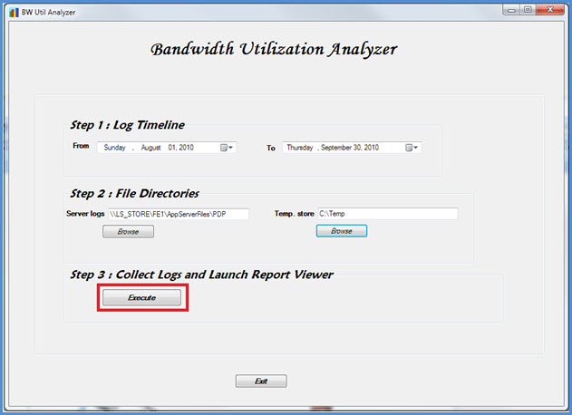

# <a name="skype-for-business-server-2015-resource-kit-tools-documentation"></a>Skype for Business Server 2015 リソース キット ツールのドキュメント

このトピックでは、Skype for Business Server 2015 リソース キットのツールについて説明します。各ツールの目的とその使用例を含む。 Skype for Business Server 2015 リソース キットは、Skype for Business Server 2015 を展開および管理する IT 管理者が日常的なタスクを容易にするのに役立ちます。 たとえば **、Web Conf Data ツール** を使用して、オンライン会議中にユーザーがアップロードしたデータを簡単に制御できます。 **SEFAUtil ツールを** 使用して、ユーザーの代理通話の転送と応答を設定できます。 IT 管理者は、これらのツールを使用して Skype for Business Server 2015 のより効果的な管理を行います。

## <a name="installation-of-the-resource-kit-tools"></a>リソース キット ツールのインストール

Skype for Business Server 2015 リソース キットをインストールするには、ダウンロード [ センター ](https://www.microsoft.com/download/details.aspx?id=52631)OCSReskit.msiをダウンロードします。

簡単 **OCSResKit.msi** を実行するには、次の手順を実行します。 .msi は **、%Program Files%\Skype for Business Server 2015\ResKit** のすべてのツールをインストールします。 自己格納型の実行可能ファイルであるツールは、このフォルダーにあります。 サポート ファイルも含むツールは、独自のサブフォルダーに含まれています。

## <a name="supported-environments"></a>サポートされている環境

Skype for Business Server 2015 リソース キットは、Skype for Business Server 2015 に必要な仕様を満たすサーバー (通常は Skype for Business Server 2015 の実行に使用される) にインストールする必要があります。

## <a name="resource-kit-tools-overview"></a>リソース キット ツールの概要

Skype for Business Server 2015 リソース キットで提供されるツールの一覧を次に示します。 要件と使用例を含む各ツールの説明については、次のセクションで説明します。

- [ABSConfig](resource-kit-tools.md#ABSConfig)

- [帯域幅ポリシー サービス モニター](resource-kit-tools.md#bpsm)

- [帯域幅使用率アナライザー](resource-kit-tools.md#bua)

- [Call Parkometer](resource-kit-tools.md#callpark)

- [DBAnalyze](resource-kit-tools.md#dba)

- [ストレージ サービス データのインポート](resource-kit-tools.md#Issd)

- [LCSSync](resource-kit-tools.md#LCSSync)

- [ユーザー コンソールの参照](resource-kit-tools.md#LUC)

- [MsTurnPing](resource-kit-tools.md#MsTurnPing)

- [ネットワーク構成ビューアー](resource-kit-tools.md#NCV)

- [応答グループ エージェント Live](resource-kit-tools.md#RGAL)

- [SEFAUtil](resource-kit-tools.md#SEFAUtil)

- [SYSPrep.ps1](resource-kit-tools.md#SYSPrep)

- [割り当てられていない番号のお知らせの移行](resource-kit-tools.md#UNAM)

- [Web Conf データ](resource-kit-tools.md#WebConfData)

## <a name="absconfig"></a>ABSConfig
<a name="ABSConfig"> </a>

アドレス帳サービス構成ツール (ABSConfig) は、管理者が Skype for Business Server 2015 のアドレス帳サービス構成をカスタマイズするのに役立つ管理ツールです。 また、このツールを使用すると、Skype for Business Server 2015 管理者は既定のアドレス帳サービス設定を復元できます。

### <a name="description"></a>説明

ABSConfig は、管理者がアドレス帳サービスに関連する Active Directory ドメイン サービス属性を構成できるグラフィカル ユーザー インターフェイス アプリケーションです。

ツールの主なシナリオは次のとおりです。

- 管理者が Active Directory ドメイン サービスの属性を Skype for Business Server 2015 の属性にマップできる。

- 管理者が、アドレス帳サービス ファイルに含めるか除外する Active Directory ドメイン サービス属性を指定できます。

- 管理者が既定のアドレス帳サービス設定を復元するには。

ABSConfig ツールは、このファイルを使用してABSConfig.exeできます。 ツールが開き、[属性の構成 **] タブが開** きます。この表には、Active Directory ドメイン サービス属性を Skype for Business Server 2015 の属性フィールドにマップし、特定の属性フィルターに基づいてアドレス帳サービス ファイルに含めるか除外するユーザーを指定するオプションがあります。 また、アドレス帳ファイルに含める電話番号の値をカスタマイズするオプションも用意されています。 [ **既定値の復元]** オプションを使用すると、管理者はアドレス帳サービスの設定を既定値に復元できます。

> [!NOTE]
> 異なる OC フィールドAD属性の再マッピングは、アドレス帳ファイルのダウンロードでのみ機能し、アドレス帳 Web クエリではサポートされません。

### <a name="output"></a>出力

ABSConfig は、アドレス帳サービス構成をデータベースに格納します。

```console
Path: %ProgramFiles%\Skype for Business Server 2015\Reskit
```

### <a name="purpose"></a>用途

ABSConfig は、Skype for Business Server 2015 アドレス帳サービスを迅速かつ簡単にカスタマイズする方法を提供します。

### <a name="requirements"></a>要件

#### <a name="computer"></a>コンピューター

ABSConfig は、Skype for Business Server 2015 がインストールされているドメインに参加しているコンピューターからのみ実行できます。 Skype for Business Server 2015 Enterprise Edition の場合、このツールは、セットアップ中にアドレス帳サービスが有効になっているフロントエンド サーバーで実行できます。

#### <a name="network"></a>ネットワーク

コンピューターがフロントエンド プールとバック エンド データベースに接続できる必要があります。

#### <a name="software"></a>ソフトウェア

ABSConfig ツールを実行する前に、次のソフトウェア コンポーネントをインストールする必要があります。

- Skype for Business Server 2015

#### <a name="users"></a>ユーザー

Skype for Business Server 2015 展開を更新するために必要なアクセス許可を持つ管理者。

### <a name="examples"></a>例

ABSConfig は、コマンド **プロンプトにABSConfig.exe** 入力して開始できます。 以下に、ABSConfig ツールのユーザー インターフェイスを示します。

![[ABSConfig.exe] ツール。](../media/Reskit_2012_Tools_Documentation_ABSConfig.JPG)

### <a name="summary"></a>概要

ABSConfig ツールは、管理者が Skype for Business Server 2015 アドレス帳サービスをカスタマイズするための迅速かつ簡単なツールを提供します。

## <a name="bandwidth-policy-service-monitor"></a>帯域幅ポリシー サービス モニター
<a name="bpsm"> </a>

帯域幅ポリシー サービス モニター ツールは、管理者が次のリストを表示することを目的とします。

1. トポロジで構成されている Skype for Business Server 2015 帯域幅ポリシー サービス (認証とコア)

2. 各サービスが他の帯域幅ポリシー サービスおよびエッジ サーバーに対して行う接続

3. ネットワーク構成ドキュメントで構成されているすべてのリンクと、各帯域幅ポリシー サービスによって報告されるリアルタイム帯域幅の使用状況

### <a name="description"></a>説明

帯域幅ポリシー サービス モニター ツールは、GUI ベースのアプリケーションとして実装されます。 管理者は、ツールを起動するには、次のPDPMonUI.exe。

ツールが起動すると、トポロジ内の帯域幅ポリシー サービスの一覧を検出します。 最初の更新が完了すると、ウィンドウの左側のウィンドウに、所属するクラスターによってグループ化されたサービスの一覧が表示されます。

管理者が特定の帯域幅ポリシー サービスを選択すると、右側のウィンドウに、その特定のサービスに関する情報が表示されます。 このウィンドウには、情報を表示する 2 つのメイン タブがあります。

#### <a name="machine-info-tab"></a>[コンピューター情報] タブ

[ **コンピューター情報]** タブには、選択した帯域幅ポリシー サービスの詳細と、選択した帯域幅ポリシー サービスによって他のサービスに対して行われたすべての接続の一覧と状態が表示されます。

#### <a name="topology-info-tab"></a>[トポロジ情報] タブ

[ **トポロジ情報] タブ** には、ネットワーク構成設定で構成されているすべてのリンクの一覧が表示されます。 各リンクについて、オーディオとビデオの帯域幅容量が表示されます。 さらに、現在使用されている帯域幅は、Kbps と容量の割合の両方で表示されます。 このツールでは、色分けを使用して、容量に近い使用率を持つリンクを強調表示します。これにより、管理者はそのようなリンクをすばやく分離できます。

> [!NOTE]
>  帯域幅ポリシー サービス モニター ツールが構成済みの帯域幅ポリシー サービスに接続するときにエラーが発生した場合、[コンピューター **情報**]タブと [トポロジ情報] タブの情報は入力されません。 ただし、ツールが最初に接続した後、サービスへの接続が失われる可能性があります。 このような場合、管理者に古い情報が表示される場合があります。 各タブ **には、特定** の帯域幅ポリシー サービスのデータが最後に更新された時刻を管理者が確認できる最終更新タイムスタンプがあります。

### <a name="output"></a>出力

コマンド ライン出力はありません。プログラム出力は、メインのグラフィカル ユーザー インターフェイス (GUI) 内に含まれる。

### <a name="purpose"></a>用途

帯域幅ポリシー サービス モニター ツールの目的は、管理者がトポロジで定義されている各帯域幅ポリシー サービスの状態を表示できる目的です。 さらに、管理者は、ネットワーク構成ドキュメントで定義されているリンクすべてについて、リアルタイムの帯域幅の使用状況を確認できます。

### <a name="requirements"></a>要件

帯域幅ポリシー サービス モニター ツールは、Skype for Business Server トポロジの一部であるコンピューターで実行する必要があります。

### <a name="summary"></a>概要

帯域幅ポリシー サービス モニター ツールは、管理者にとって貴重なリソースであり、トポロジ内のすべての帯域幅ポリシー サービスの状態を検査し、さらに重要なことに、ネットワーク構成設定で定義されているリンクのリアルタイム帯域幅使用率を取得できます。

## <a name="bandwidth-utilization-analyzer"></a>帯域幅使用率アナライザー
<a name="bua"> </a>

帯域幅使用率アナライザーは、エンタープライズ ネットワーク内の WAN リンク間の UC エンドポイントによる帯域幅消費のさまざまなビューに関するレポートを作成するツールです。 これらのレポートは、現在の帯域幅消費パターンを理解し、帯域幅の容量計画を支援するために使用できます。

### <a name="description"></a>説明

帯域幅使用率アナライザーは、GUI ベースのアプリケーションとして実装されます。 このツールは、ネットワーク全体のオーディオ使用率専用のレポートを生成し、容量計画に役立ちます。 また、さまざまなリンクに割り当てられている帯域幅の容量を反復処理します。

### <a name="output"></a>出力

帯域幅使用率アナライザーは、システムで構成されているすべての WAN リンクに対して、オーディオの帯域幅容量と使用率のグラフィック プロットを提供します。

### <a name="purpose"></a>用途

音声およびビデオの展開では、エンタープライズ ネットワーク全体のメディア トラフィックの帯域幅使用率の傾向を監視し、理解する必要があります。 帯域幅使用率アナライザー ツールを使用すると、管理者はこれを実現できます。 このツールは、次の手順を実行します。

- ネットワーク全体のオーディオ使用率に関する特定のレポートを生成します。

- さまざまなリンクに割り当てられている帯域幅の容量に対する、より効果的な容量計画と反復処理に役立ちます。

帯域幅使用率アナライザーは、帯域幅の容量と使用率レポートのグラフ プロットを生成できます。これらは次のとおりです。

- エンタープライズ ネットワーク内のすべての WAN リンク

- 選択されている選択された WAN リンクによってフィルター処理される

- リンク容量を超えた WAN リンクによってフィルター処理される

- プロビジョニングされた帯域幅を過小利用している WAN リンクによってフィルター処理される

- 重要なレベルに達している WAN リンクによるフィルター処理 (WAN リンクの帯域幅容量の 90% を超える帯域幅使用率)

- WAN リンクの種類 (ネットワーク サイトリンク、エリア間リンク、サイト内のリンク) でフィルター処理される

- ネットワーク地域でフィルター処理される

#### <a name="applications"></a>アプリケーション

帯域幅使用率アナライザーには、次の 2 つのアプリケーション (ツール) があります。

- **WanLinkLogCollector.exe** このツールを使用すると、ユーザーは必要な情報を入力できます。

- **BandwidthUtilizationAnalyzer.xlsm** Microsoft Excel スプレッドシート ソフトウェア レポートは、ユーザーが自動的にWanLinkLogCollector.exe。 このアプリケーションを使用すると、この記事の後半で示すように、ユーザーはレポートにフィルターを適用できます。

#### <a name="phases-of-using-bandwidth-utilization-analyzer"></a>帯域幅使用率アナライザーの使用のフェーズ

帯域幅使用率アナライザーを使用する場合は、次の 2 つのフェーズがあります。

- ログを収集します。これは、ログを使用して実行WanLinkLogCollector.exe

- m を使用して実行されるレポートをBandwidthUtilizationAnalyzer.xlsする

    > [!IMPORTANT]
    > エンド ユーザーが手動BandwidthUtilizationAnalyzer.xls起動しない方法を強く推奨します。

#### <a name="starting-bandwidth-utilization-analyzer"></a>帯域幅使用率アナライザーの開始

コマンド プロンプトWanLinkLogCollector.exe Windows エクスプローラーを使用して、コマンド を開始します。

 **ユーザー設定WanLinkLogCollector.exe**

次の 3 つの手順を使用WanLinkLogCollector.exe。

1. **タイムラインをログに記録する** レポートを生成する必要があるタイムラインを指定する

2. **ファイル ディレクトリを指定する** ファイルの場所情報を提供する

3. **ログを収集し、レポート ビューアーを起動する** コマンドを実行してレポートを生成する

#### <a name="step-1---log-the-timeline"></a>手順 1 - タイムラインをログに記録する

タイムラインをログに記録すると、ツール ユーザーは、次の図に示すように、次の値を指定できます。

1. **開始日** これは、レポートを生成する予定のタイムラインの開始日です。たとえば、2010 年 8 月 1 日です。

2. **終了日** これは、レポートが生成される予定のタイムラインの終了日です。たとえば、2010 年 9 月 30 日です。

     

#### <a name="step-2---specify-the-file-directories"></a>手順 2 - ファイル ディレクトリを指定する

次のファイル ディレクトリは、ユーザーが示すように指定できます。

- **サーバー ログ ファイルの場所** 帯域幅ポリシー サーバー ログが格納されているフォルダーの場所。 これは通常、FE \<fileserver\> \\ \> \AppServerFiles\PDP<選択する場合に使用します。

- **一時ファイルの保存場所** レポートの生成中に中間ファイルが保存される一時ファイルの場所。

    

    > [!NOTE]
    > サーバー ログと一時ファイル ストア フォルダーへの十分なファイル アクセスがツール ユーザーに提供されている必要があります。

#### <a name="step-3---collect-the-logs-and-start-the-report-viewer"></a>手順 3 - ログを収集し、レポート ビューアーを起動する

ログを収集してレポート ビューアーを起動するには、次に示すように **[実行]** をクリックします。 この手順では、必要なデータを収集します。



入力の検証が成功すると、次に示すメッセージが表示されます。


**[OK]** をクリックします。 BandwidthUtilizationAnalyzer.xlsm が自動的に開始されます。 メッセージ ボックスの指示に従います。 詳細については、次の **セクションBandwidthUtilizationAnalyzer.xlsm** を使用するを参照してください。


### <a name="using-bandwidthutilizationanalyzerxlsm"></a>m のBandwidthUtilizationAnalyzer.xls使用

1. m BandwidthUtilizationAnalyzer.xlsが自動的に開始された場合は、次に示すように **[更新** ] をクリックします。

     

2. ファイル フォルダーを開いた場合は、consolidated.csvメッセージ ボックスで指定された場所からファイル フォルダーを選択します。 また、場所は **C:\Temp として表示されます**。

     

3. [**インポート**] をクリックします。

4. グラフィカル プロットが自動的に生成されます。 これは、作業中の背景ポインターが消えたときに使用できます。

     

#### <a name="applying-filters-to-the-report-view"></a>レポート ビューへのフィルターの適用

次に示すように、レポート ビューに適用できるフィルターについて説明します。


1. **名前** WAN リンクによるフィルター (フィルターはグラフの右側にあります)。プレフィックスは、次のリンクの種類を示します。垂直 (青) ボックスを参照してください。

   - **S サイト** ネットワーク サイトからネットワーク地域への WAN リンク

   - **IS サイト間** 2 つのネットワーク サイト間の WAN リンク

   - **R 地域間** 2 つのネットワーク領域間の WAN リンク

2. **制限を超えた** 帯域幅使用率が帯域幅容量を超える WAN リンクによるフィルター処理

3. **重要なレベル** 帯域幅使用率が帯域幅容量の 90% 以上に達した WAN リンクによるフィルター

4. **利用が過小** 帯域幅使用率が帯域幅容量の 25% 未満である WAN リンクによるフィルター処理

5. **リンクの種類** 次の WAN リンクの種類でフィルター処理します。

   - **ネットワーク サイトの** 種類

   - **サイト間の** 種類

   - **地域間リンクの** 種類

6. **地域** ネットワーク地域でフィルター処理する

次の図は、前述のフィルターを示しています。

名前でフィルター **処理します**。 グラフに表示する必要があるリンクの一覧を選択します。


制限を超 **えてフィルターを適用します**。 **[True] を** 選択してフィルターを適用します。


クリティカル レベル **でフィルター処理します**。 **[True] を** 選択してフィルターを適用します。


[使用 **されているアンダー] でフィルターを適用します**。 **[True] を** 選択してフィルターを適用します。

![[使用] でフィルター処理します。](../media/Reskit_2012_Tools_Documentation_Image15.jpg)

[リンクの **種類でフィルター] をクリックします**。 表示する必要がある種類または種類を選択します。


地域で **フィルターを適用します**。 リンクを表示する必要がある地域の一覧を選択します。


### <a name="requirements"></a>要件

- 3.5 .NET Framework 3.5

- Microsoft Excel 2010 または Excel 2007

### <a name="summary"></a>概要

帯域幅使用率アナライザーは、ネットワーク全体の UC トラフィックのオーディオ帯域幅使用率をプロットするために使用されます。 このツールを使用して、ネットワーク上のビデオ帯域幅の使用率も報告できます。

## <a name="call-parkometer"></a>Call Parkometer
<a name="callpark"> </a>

Call Parkometer は、コール パーク オービット データベースに簡単にアクセスできるコマンド ライン アプリケーションです。

### <a name="description"></a>説明

Call Parkometer は、現在パークされている通話を追跡するツールです。 また、オービットとコール パーク サーバー (CPS) の使用状況に関する統計情報も収集します。 このコマンド ライン ツールは、ローカルまたはリモート接続されたコンピューターから、CPS オービット SQL Serverに読み取りおよび書き込みアクセスの両方を提供します。

すべてのオプションは相互に排他的です。 コマンド ライン構文は次のとおりです。

- **-o** パラメーター: このプールに構成されているオービット範囲の一覧を示します。

- **-n** パラメーター : このプールで現在使用されているオービットの一覧を示します。 表示される情報は次のとおりです。

  - パークリーとパーカーの SIP ユニフォーム リソース識別子 (URI)。

  - 呼び出しがパークされている CPS のホスト名。

  - 通話がパークされた時刻のタイムスタンプ。

- **-f** パラメーター : プール内の現在空きオービットの数を示します。

- **-r \<n\>** parameter - 最後にパーク \<n\> された呼び出しの一覧を示します。 表示される情報は次のとおりです。

  - PARKEE SIP URI。

  - パーカー SIP URI。

  - 呼び出しがパークされた CPS のホスト名。

  - 呼び出しが取得または削除された時刻のタイム スタンプ。

- **-t \<n\>** parameter - データベース内のオービットを予約し、割り当てられたオービット番号のランダム性を示すテストを行います。

### <a name="output"></a>出力

コマンド プロンプトで指定された入力パラメーターに応じて、Call Parkometer は次の出力を表示します。

- このプール用に構成されているすべてのオービット範囲

- 現在、パークされている通話

- 無料の (使用可能な) オービットの数

- 最近パークされた通話

- 均一なオービット値とランダムオービット値をテストする予約済みのオービット

### <a name="purpose"></a>用途

CPS ツールの目的は、CPS データベースへのコマンド ライン アクセスを提供します。 管理者は、CPS 使用状況を表示し、プールに割り当てられたオービットの数を決定できます。

### <a name="requirements"></a>要件

このツールが CPS を実行しているのと同じコンピューターで実行される場合、要件はありません。 このツールをリモート コンピューターで実行する場合は、Skype for Business Server 2015 で使用SQL Serverデータベースをリモート アクセスを許可するように構成する必要があります。 Call Parkometer は、プールのSQL Server接続するために、データベース接続文字列を使用して構成する必要SQL Server。 このSQL Serverデータベース接続文字列は、構成ファイルで定義されます。parkometer.exe.config。 **** このディレクトリは、そのディレクトリと同じディレクトリparkometer.exe必要があります。 次の XML ファイルは、次の XML ファイルの例parkometer.exe.config。構成する必要があるパラメーターは、ユーザー名 (mydomain\Administrator など)、パスワード (mypassword など)、ホスト名 (myserver など) です。

```xml
<?xml version="1.0" encoding="utf-8" ?>
<configuration>
  <appSettings>
   <add key="SQL" value="server=myserver\RTC;
database=cpsdyn;
User Id=mydomain\Administrator;
Password=mypassword.;
Integrated Security=false;"/>
  </appSettings>
</configuration>
```

### <a name="examples"></a>例

展開されたオービット範囲: -o パラメーターは、このプール用に構成されているすべてのオービット範囲を示すように一覧表示します。


現在パークされている呼び出し: -n パラメーターは、このプールで現在使用されているオービットの一覧を示します。


空きオービットの数: -f パラメーターは、プール内の現在空きオービットの数を示します。


最近パークされた呼び出し: -r パラメーターは、次に示すように、最後 \<n\> \<n\> にパークされた呼び出しを一覧表示します。


軌道予約のテスト: -t パラメーターは、次に示すように、データベース内のオービット \<n\> を予約するテストを行います。


### <a name="summary"></a>概要

Call Parkometer は、コール パーク サーバーに関する詳細情報を提供するコマンド ライン ツールです。

## <a name="dbanalyze"></a>DBAnalyze
<a name="dba"> </a>

### <a name="description"></a>説明

DBAnalyze は、管理者が Skype for Business Server 2015 データベースに関する分析レポートを収集するのに役立つコマンド ライン ツールです。 DBAnalyze には、診断モード、ユーザー データモード、会議モード、MCUs モード、ディスク断片化モードがあります。

- **診断モード** テーブルに関する情報を含むレポートを作成します (レコード数、 断片化、データ サイズ、ログ ファイル サイズ、データ ファイルサイズ、最後のバックアップ時間、Microsoft Office Communications Server を実行しているサーバー間の連絡先配布、アクセス許可の平均数、連絡先、コンテナー、サブスクリプション、パブリケーション、ユーザーごとのエンドポイント、不適切にホームユーザー、ルーティングできないユーザー、ユーザーごとの組織化された会議の平均数、スケジュールされた会議、アクティブな会議、およびデータベース バージョン。

    > [!NOTE]
    > 診断モードを実行すると、サーバーのパフォーマンスに影響を与える可能性があります。

- **ユーザー データ モード** 指定したユーザーの連絡先、コンテナー、サブスクリプション、パブリケーション、アクセス許可、および連絡先グループのデータ、または連絡先とアクセス許可リストにそのユーザーを持つユーザーを報告します。 また、このモードでは、ユーザーが開催または招待された会議の概要データも報告されます。

- **会議モード** 会議のすべてのスケジュール時間の詳細、招待者リスト、会議に許可されているメディアの種類の一覧、アクティブな MCUs (マルチポイントコントロール ユニット)、アクティブな参加者リスト、各参加者のシグナリング状態など、特定の会議の詳細なデータをレポートします。

- **会議 ID のデコード** /pstnid スイッチで指定されているが、詳細についてはバック エンドに接続しない公衆交換電話網 **(PSTN)** 会議 ID をデコードします。

- **会議の解決****/pstnid** スイッチで指定された PSTN 会議 ID をデコードし、ID で示された会議に関する情報を表示します。

- **MCUs モード** プール内の各 MCU の ID、メディアの種類、URL、ハートビートの状態、会議の負荷、および参加者の負荷を報告します。

- **ディスクの断片化モード** すべてのディスクの断片化状態を表示します。

このツールは、さまざまな問題を診断したり、管理者が容量計画を支援したりするために使用できます。 たとえば、サーバー A にホームされているユーザーのほとんどが、サーバー B のユーザーを連絡先として選択した場合、管理者はサーバー A のユーザーをサーバー B に移動して、サーバー間のトラフィックを削減できます。

### <a name="output"></a>出力

このツールは、Skype for Business Server 2015 データベースに関する定義済みのレポートを出力します。 **パス**: %ProgramFiles%\Skype for Business Server 2015\Reskit

### <a name="purpose"></a>用途

ファイルをインストールDbanalyze.exeローカル フォルダーにコピーし、ツールを実行します。 ツールを使用するには、コマンド ラインから次のコマンドを実行します。 `dbanalyze.exe [/v] [/report:value] [/sqlserver:value] [/user:user@domain.com] [/conf:value][/pstnid:Value] [/maxcontacts:value]` コマンド ライン オプションの説明を以下に示します。


### <a name="requirements"></a>要件

 **コンピューター** DBAnalyze は、Skype for Business Server 2015 がインストールされているドメインに参加しているコンピューターからのみ実行できます。

 **ネットワーク** コンピューターは、バック エンド データベースに接続できる必要があります。

 **ソフトウェア** DBAnalyze を実行する前に、Skype for Business Server 2015 ソフトウェア コンポーネントをインストールする必要があります。

 **ユーザー** 次の表に、Skype for Business Server 2015 データベースにアクセスするために必要なアクセス許可を持つ管理者を示します。


> [!NOTE]
> **/report:disk モードでは、ローカル管理者アカウントが必要** です。

### <a name="examples"></a>例

有効なコマンドの例を次にDbanalyze.exeします。

```console
dbanalyze.exe /report:diag
dbanalyze.exe /report:user /user:usera@domainb.com
dbanalyze.exe /report:conf /user:bob@example.com /conf:1W9J71SKSX2X
dbanalyze.exe /report:resolve /pstnid:12345
dbanalyze.exe /report:mcus
dbanalyze.exe /report:disk
```

### <a name="summary"></a>概要

DBAnalyzer は、管理者が Skype for Business Server 2015 データベースを迅速かつ簡単に分析できます。

## <a name="import-storage-service-data"></a>ストレージ サービス データのインポート
<a name="Issd"> </a>

ImportStorageServiceData リソース キット ツールを使用すると、記憶域サービス (LYSS) からフラッシュされたキューデータとエンドポイント データをストレージ サービスに再インポートできます。

### <a name="description"></a>説明

記憶域サービスからフラッシュされたデータは、キュー アイテムの状態またはデータベース サイズに基づいて自動 (定期的) に実行されている可能性があります。 これは、プール フェールオーバー コマンドレットの手動呼び出し、または StorageServiceFullFlush コマンドレット (プール フェールオーバー コマンドレットが呼び出す) が原因で発生した可能性があります。 フロントエンドのストレージ サービス (LYSS) データベース サイズが通常のレベルを超える場合は、データを再インポートしない方が理想的です。さらに、記憶域サービス キューの拡大を引き起こしたエラーの原因となる可能性がある問題は、最初に解決する必要があります (Exchange エンドポイントのエラー、ネットワークの問題、その他の問題など)。

 **シナリオ 1:** プールのフェールオーバー中に、ファイルが各フロントエンドのストレージ サービスからフラッシュアウトされる可能性があります。 フェールオーバーが完了したら、ツールを実行してデータを再インポートする必要があります。

 **シナリオ 2:** データが毎日自動的にフラッシュされる、または特定のサイズのしきい値を超える記憶域サービス データベースに応答します (たとえば、60%、80%、90% 満値)。 この自動的にフラッシュされたデータは、管理者が定期的に再インポートする必要があります。 上記の状況では、監視 SCOM パックが展開されていない場合、ストレージ サービスからフラッシュされるデータに関連する Skype for Business Server Storage Service のイベントがあります。 32075 のイベント ID (フル フラッシュ操作が開始されました)、32076 (フル フラッシュが完了しました)、32082 (メンテナンス レベルフラッシュが開始されました)、32083 (メンテナンス レベルフラッシュが完了)、32089 (データベースの満たされた原因でフラッシュが発生しました)。 これらのイベント Id は RTM リリースに対応しています。 管理者がこれらのイベントを見た場合は、フラッシュされたファイルがあるという意味です。このデータは、このツールを使用して定期的にインポートバックする必要があります (たとえば、週に 1 回)。

Online Service リリースの場合、Skype for Business Server 用の正常性監視 SCOM パックが展開されている場合、新しいアラートが発生し、管理者はフラッシュされたデータをストレージ サービスに再インポートする必要があります。 フロント エンド サーバーのイベント ログに対応するイベントが発生し、アラートがトリガーされます。 イベントでは、フラッシュされたデータ ファイルが置かれる親パスと、アラート条件を満たすファイルの数について説明します。 警告の条件は、特定の親パスの下に、少なくとも Y 日前の X 以上のファイルが含まれます (ここで、X と Y は StorageService 内で事前に設定されますが、APPCONFIG ファイルを変更することで上書きできます)。正常性アラートをトリガーできるイベントの 2 つの例を以下に示します。その違いは親パスです。 1 つの可能性は Web サービス ファイル共有の下にありますが、もう 1 つの可能性は、各フロントエンドのローカル アプリケーション データ ディレクトリです。 ( c:\ProgramData\Microsoft\Skype for Business Server 2015\StorageService など)。 管理者は、この reskit ツールを実行します。

このツールは、ツールが実行されるフロントエンドによってデータが所有されていない場合に、実行中のフロントエンドと他のフロントエンドの CPU と IO 負荷を増加します。 フロント エンドが CPU と IO の負荷が高い (ピーク時外など) 場合は、このツールを実行することをお勧めします。 次に、このツールは 2 ~ 3 分で 1 つのデータ ファイルをインポートできます。 ツールの実行時間を見積もる場合は、この問題に気を付ける必要があります。 ツールによって生成された詳細ログ ファイルは、既定でファイル ストアに表示されます。 ログ ファイルには数十 MB 以上のエラーが報告されていない場合は削除します。


### <a name="requirements"></a>要件

Skype for Business Server 2015 リソース キット ツールをインストールします。 このツールは、Skype for Business Server と Skype for Business Server 管理シェルがインストールされているドメインに参加しているコンピューターで実行されます。 このツールは、管理シェルのコマンドレットを使用して、プール内のすべてのフロントエンド サーバーを識別します。 次に **、RtcLocal** データベースがインストールされているプール内のコンピューターからツールを実行する必要があります。 このデータベースは、プールの WEBSERVICE ファイル共有の場所を取得するためにツールによって使用されます。 さらに、ツールを使用する前に、各フロントエンド サーバーで、各フロントエンド サーバーで **Enable-PSRemoting** を使用して Windows PowerShell リモート処理を有効にする必要があります。また、ツールが実行されるコンピューターも有効にする必要があります。 それ以外の場合、Windows PowerShellリモート コマンドは失敗します。 Windows PowerShell後、プール内のすべてのフロントエンド サーバーでリモート処理をオフにできます。 最後に、ツールを呼び出すアカウントまたは資格情報に、このツールを実行しているプールの Web サービス ファイル共有に対する読み取り/書き込みアクセス許可が必要です。 それ以外の場合、ツールは IO アクセス許可エラーで失敗します。

> [!NOTE]
> このWindows Server 2012、Windows PowerShellリモート処理は既定で有効になっていますが、Windows Server 2008 オペレーティング システムでは有効になっていません。

### <a name="examples"></a>例

```console
>  C:\StorageService>ImportStorageServiceData.exe
Description:
This tool will re-import Storage Service (LYSS) flushed queue data back in.  For a pool: you are required to run this tool on a machine inside the pool which has the Lync Server Management Shell installed.  Additionally, all front end machines need to have Windows Powershell Remoting enabled before executing this tool by executing Enable-PSRemoting.  Also, please ensure that all Storage Service instance DB Size are at the 'Normal' level (verify this by viewing Eventlog events). Otherwise re-importing may cause data to be flushed out again if any Storage Service instance DB size level goes above 'Normal'.
Usage: Default behavior is to Import data from web service file share as well as any files on all Front End machines in pool.
Additional Options:
-Verbose                    : Turn verbose output on.

-StorageServiceHostName     : Host Name of Storage Service WCF endpoint.  ( Default=localhost netnamedpipe binding. )

-FileSharePath              : Import only all data from just under the UNC path specified.

ActivityID: cc3b62ff-bb66-4e61-a6e2-96cb3626315c. <-- Use this to correlate with StorageService trace logs if troubleshooting.
Type Server name (TCP binding) or press <enter> for localhost (NamePipe binding):
Using NetNamedPipeBinding...
OnTopologyChanged Event received
Web Service File Share: \\dc.vdomain.com\OcsFileStore\co1-WebServices-1\StorageService

Front Ends:
server.vdomain.com
server2.vdomain.com
server1.vdomain.com
server3.vdomain.com
Looking under directory: \\dc.vdomain.com\OcsFileStore\co1-WebServices-1\StorageService for exported data.
# Files found: 8
Starting Import for file:\\dc.vdomain.com\OcsFileStore\co1-WebServices-1\StorageService\DataExport\2
0120910\SERVER.vdomain.com\944f5724c65c5f93900dc1c8c898b102__0.xml
Items deserialized: 20

All items in file were enqueued successfully, will try to delete file: \\dc.vdomain.com\OcsFileStore\co1-WebServices-1\StorageService\DataExport\20120910\SERVER.vdomain.com\944f5724c65c5f93900dc1c8c898b102__0.xml

All items in file failed to enqueue so file will not be deleted.  File path: \\dc.vdomain.com\OcsFileStore\co1-WebServices-1\StorageService\DataExport\20120910\SERVER.vdomain.com\944f5724c65c5f93900dc1c8c898b102__0.xml

Summary for file \\dc.vdomain.com\OcsFileStore\co1-WebServices-1\StorageService\DataExport\20120910\SERVER.vdomain.com\944f5724c65c5f93900dc1c8c898b102__0.xml: succeeded: 20, failed: 0

Starting Import for file:\\dc.vdomain.com\OcsFileStore\co1-WebServices-1\StorageService\DataExport\20120910\SERVER1.vdomain.com\17d5435ae40259f7bbdf1866776386e4__0.xml
Items deserialized: 20

[cc3b62ff-bb66-4e61-a6e2-96cb3626315c] Send EnqueueMessages to redirected, targetServer=server1.vdomain.com, queueItems=20

All items in file were enqueued successfully, will try to delete file: \\dc.vdomain.com\OcsFileStore\co1-WebServices-1\StorageService\DataExport\20120910\SERVER1.vdomain.com\17d5435ae40259f7bbdf1866776386e4__0.xml

All items in file failed to enqueue so file will not be deleted.  File path: \\dc.vdomain.com\OcsFileStore\co1-WebServices-1\StorageService\DataExport\20120910\SERVER1.vdomain.com\17d5435ae40259f7bbdf1866776386e4__0.xml

Summary for file \\dc.vdomain.com\OcsFileStore\co1-WebServices-1\StorageService\DataExport\20120910\
SERVER1.vdomain.com\17d5435ae40259f7bbdf1866776386e4__0.xml: succeeded: 20, failed: 0

Starting Import for file:\\dc.vdomain.com\OcsFileStore\co1-WebServices-1\StorageService\DataExport\20120910\SERVER1.vdomain.com\904f6c9b8ac951ae8b3c86684d3832e4__0.xml

Items deserialized: 20
[cc3b62ff-bb66-4e61-a6e2-96cb3626315c] Send EnqueueMessages to redirected, targetServer=server1.vdomain.com, queueItems=20

All items in file were enqueued successfully, will try to delete file: \\dc.vdomain.com\OcsFileStore
\co1-WebServices-1\StorageService\DataExport\20120910\SERVER1.vdomain.com\904f6c9b8ac951ae8b3c86684d
3832e4__0.xml

All items in file failed to enqueue so file will not be deleted.  File path: \\dc.vdomain.com\OcsFil
eStore\co1-WebServices-1\StorageService\DataExport\20120910\SERVER1.vdomain.com\904f6c9b8ac951ae8b3c
86684d3832e4__0.xml

Summary for file \\dc.vdomain.com\OcsFileStore\co1-WebServices-1\StorageService\DataExport\20120910\
SERVER1.vdomain.com\904f6c9b8ac951ae8b3c86684d3832e4__0.xml: succeeded: 20, failed: 0

Starting Import for file:\\dc.vdomain.com\OcsFileStore\co1-WebServices-1\StorageService\DataExport\2
0120910\SERVER2.vdomain.com\69844a271e6c5633a1f2b46a42287dd6__0.xml

Items deserialized: 20

[cc3b62ff-bb66-4e61-a6e2-96cb3626315c] Send EnqueueMessages to redirected, targetServer=server2.vdom
ain.com, queueItems=20

All items in file were enqueued successfully, will try to delete file: \\dc.vdomain.com\OcsFileStore
\co1-WebServices-1\StorageService\DataExport\20120910\SERVER2.vdomain.com\69844a271e6c5633a1f2b46a42
287dd6__0.xml

All items in file failed to enqueue so file will not be deleted.  File path: \\dc.vdomain.com\OcsFil
eStore\co1-WebServices-1\StorageService\DataExport\20120910\SERVER2.vdomain.com\69844a271e6c5633a1f2
b46a42287dd6__0.xml

Summary for file \\dc.vdomain.com\OcsFileStore\co1-WebServices-1\StorageService\DataExport\20120910\
SERVER2.vdomain.com\69844a271e6c5633a1f2b46a42287dd6__0.xml: succeeded: 20, failed: 0

Starting Import for file:\\dc.vdomain.com\OcsFileStore\co1-WebServices-1\StorageService\DataExport\2
0120910\SERVER3.vdomain.com\3313935458e35b9b9759e08a15d251e6__0.xml

Items deserialized: 20

[cc3b62ff-bb66-4e61-a6e2-96cb3626315c] Send EnqueueMessages to redirected, targetServer=server3.vdom
ain.com, queueItems=1

All items in file were enqueued successfully, will try to delete file: \\dc.vdomain.com\OcsFileStore
\co1-WebServices-1\StorageService\DataExport\20120910\SERVER3.vdomain.com\3313935458e35b9b9759e08a15
d251e6__0.xml

All items in file failed to enqueue so file will not be deleted.  File path: \\dc.vdomain.com\OcsFil
eStore\co1-WebServices-1\StorageService\DataExport\20120910\SERVER3.vdomain.com\3313935458e35b9b9759
e08a15d251e6__0.xml

Summary for file \\dc.vdomain.com\OcsFileStore\co1-WebServices-1\StorageService\DataExport\20120910\
SERVER3.vdomain.com\3313935458e35b9b9759e08a15d251e6__0.xml: succeeded: 20, failed: 0

Starting Import for file:\\dc.vdomain.com\OcsFileStore\co1-WebServices-1\StorageService\DataExport\2
0120910\SERVER3.vdomain.com\4501e04eae4856059346949ff817c220__0.xml
Items deserialized: 20
[cc3b62ff-bb66-4e61-a6e2-96cb3626315c] Send EnqueueMessages to redirected, targetServer=server3.vdom
ain.com, queueItems=1
All items in file were enqueued successfully, will try to delete file: \\dc.vdomain.com\OcsFileStore
\co1-WebServices-1\StorageService\DataExport\20120910\SERVER3.vdomain.com\4501e04eae4856059346949ff8
17c220__0.xml
All items in file failed to enqueue so file will not be deleted.  File path: \\dc.vdomain.com\OcsFil
eStore\co1-WebServices-1\StorageService\DataExport\20120910\SERVER3.vdomain.com\4501e04eae4856059346
949ff817c220__0.xml

Summary for file \\dc.vdomain.com\OcsFileStore\co1-WebServices-1\StorageService\DataExport\20120910\
SERVER3.vdomain.com\4501e04eae4856059346949ff817c220__0.xml: succeeded: 20, failed: 0
Starting Import for file:\\dc.vdomain.com\OcsFileStore\co1-WebServices-1\StorageService\DataExport\2
0120910\SERVER3.vdomain.com\5ad77443ad955a22a876749be66d5317__0.xml

Items deserialized: 20
[cc3b62ff-bb66-4e61-a6e2-96cb3626315c] Send EnqueueMessages to redirected, targetServer=server3.vdom
ain.com, queueItems=20
All items in file were enqueued successfully, will try to delete file: \\dc.vdomain.com\OcsFileStore
\co1-WebServices-1\StorageService\DataExport\20120910\SERVER3.vdomain.com\5ad77443ad955a22a876749be6
6d5317__0.xml
All items in file failed to enqueue so file will not be deleted.  File path: \\dc.vdomain.com\OcsFil
eStore\co1-WebServices-1\StorageService\DataExport\20120910\SERVER3.vdomain.com\5ad77443ad955a22a876
749be66d5317__0.xml
Summary for file \\dc.vdomain.com\OcsFileStore\co1-WebServices-1\StorageService\DataExport\20120910\
SERVER3.vdomain.com\5ad77443ad955a22a876749be66d5317__0.xml: succeeded: 20, failed: 0
Starting Import for file:\\dc.vdomain.com\OcsFileStore\co1-WebServices-1\StorageService\DataExport\2
0120910\SERVER3.vdomain.com\a11e27ae439a582288d4657eda86b565__0.xml
Items deserialized: 20
[cc3b62ff-bb66-4e61-a6e2-96cb3626315c] Send EnqueueMessages to redirected, targetServer=server3.vdom
ain.com, queueItems=20
All items in file were enqueued successfully, will try to delete file: \\dc.vdomain.com\OcsFileStore
\co1-WebServices-1\StorageService\DataExport\20120910\SERVER3.vdomain.com\a11e27ae439a582288d4657eda
86b565__0.xml
All items in file failed to enqueue so file will not be deleted.  File path: \\dc.vdomain.com\OcsFil
eStore\co1-WebServices-1\StorageService\DataExport\20120910\SERVER3.vdomain.com\a11e27ae439a582288d4
657eda86b565__0.xml
Summary for file \\dc.vdomain.com\OcsFileStore\co1-WebServices-1\StorageService\DataExport\20120910\
SERVER3.vdomain.com\a11e27ae439a582288d4657eda86b565__0.xml: succeeded: 20, failed: 0
All files have been imported into Storage Service for path: \\dc.vdomain.com\OcsFileStore\co1-WebSer
vices-1\StorageService
Importing files for: server.vdomain.com
No files founds.
Importing files for: server2.vdomain.com
No files founds.
Importing files for: server1.vdomain.com
No files founds.
Importing files for: server3.vdomain.com
No files founds.
Writing log: \\dc.vdomain.com\OcsFileStore\co1-WebServices-1\StorageService\ImportStorageServiceData
Log20120910_1609SS
Tool has finished execution.
>  C:\StorageService>
```

## <a name="lcssync"></a>LCSSync
<a name="LCSSync"> </a>

LCSSync ツールは、Skype for Business Server 2015 コミュニケーション ソフトウェアを複数フォレスト環境に展開するのに役立ちます。 このツールは、異なるユーザー フォレストのユーザーとグループを Active Directory ドメイン サービス連絡先オブジェクトとして、Skype for Business Server 2015 がインストールされている中央フォレストに同期するために使用されます。

### <a name="description"></a>説明

 LCSSync は、中央フォレスト内の同期された Active Directory ドメイン サービス連絡先オブジェクトを使用して、Skype for Business Server のユーザーを有効にします。 シングル サインインを提供するには、プライマリ ユーザー アカウントを、Skype for Business Server 2015 の中央フォレストの Active Directory ドメイン サービス連絡先オブジェクトにマップする必要があります。 このツールは、そのマッピングを実行するのに役立ちます。 このツールは、Microsoft Identity Integration Server で管理エージェントを作成するためのテンプレートを提供します。

### <a name="summary"></a>概要

LCSSync ツールは、複数フォレスト環境に Skype for Business Server 2015 を展開するのに役立ちます。

## <a name="lookup-user-console"></a>ユーザー コンソールの参照
<a name="LUC"> </a>

LookupUserConsole ツールは、特定のユーザーに関する内部 Skype for Business Server ルーティング情報を表示します。 この情報は、展開とルーティングの問題を診断する際に Microsoft が個人をサポートする場合に役立つ場合があります。

### <a name="description"></a>説明

 このLookupUserConsole.exeを実行すると、SIP アドレスを受け入れ、内部 Skype for Business Server ルーティング情報を表示しようとするコマンド プロンプトが開きます。 Exit **と入力** して LookupUserConsole ツールを終了します。

### <a name="requirements"></a>要件

Skype for Business Server 2015 リソース キットをインストールします。 このツールは、Skype for Business Server がインストールされているドメインに参加しているコンピューターで実行されます。

### <a name="examples"></a>例

C:\Program Files\Skype for Business Server 2015\ResKit \>LookupUserConsole.exe

```console
> sip:john.doe@vdomain.com

  Execution time (ms):                            171.094
  Exeuction result:                               Success
  SIP URI:                                        sip:john.doe@vdomain.com
  User info:
    SID:                                          S-1-5-21-2831376166-29632525...    Display name:                                     John Doe
    Grouping ID:                                  00000000-0000-0000-0000-...
    Line URI:                                     <null>
    Policy assignment:                            TenantId={00000000--0000-000....
    SIP enabled:                                  True
    UC enabled:                                   False
    Tenant ID:                                    00000000-0000-0000-0000-...  Cluster info:
    Active cluster:                               pool0.vdomain.com
    Backup registrar cluster:                     <null>
    Deployment location:                          <null>
    Home Front-End FQDN:                          SERVER.vdomain.com
    Primary Registrar cluster:                    pool0.vdomain.com
    Remote Director external SIP FQDN:            <null>
    Remote Director internal SIP FQDN:            <null>
    Remote Director Web FQDN:                     <null>
    Routing group ID:                             4501e04e-ae48-5605-9346...
    Service tag ID:                               1266953005
    User Front-End resolved:                      True
    User in local forest:                         True
    User in remote forest:                        False
    User in split domain:                         False
    User-Services cluster:                        pool0.vdomain.com

> sip:nouser@vdomain.com

  Execution time (ms):                            948.7574
  Exeuction result:                               UserDoesNotExist

> exit
```

## <a name="msturnping"></a>MsTurnPing
<a name="MsTurnPing"> </a>

MSTurnPing ツールを使用すると、Skype for Business Server 2015 コミュニケーション ソフトウェアの管理者は、オーディオ/ビデオ エッジおよびオーディオ/ビデオ認証サービスを実行しているサーバーと、トポロジで帯域幅ポリシー サービスを実行しているサーバーの状態を確認できます。

### <a name="description"></a>説明

MSTurnPing ツールを使用すると、Skype for Business Server 2015 コミュニケーション ソフトウェアの管理者は、オーディオ/ビデオ エッジおよびオーディオ/ビデオ認証サービスを実行しているサーバーと、トポロジで帯域幅ポリシー サービスを実行しているサーバーの状態を確認できます。

このツールを使用すると、管理者は次のテストを実行できます。

1. A/V エッジ サーバー テスト: このツールは、トポロジ内のすべての A/V エッジ サーバーに対して、次の操作を実行してテストを実行します。

   - Skype for Business Server オーディオ/ビデオ認証サービスが開始され、適切な資格情報を発行できると確認します。

   - Skype for Business Server Audio/Video Edge サービスが開始され、外部エッジにリソースを正常に割り当て可能な場合の確認。

2. 帯域幅ポリシー サービス テスト: このツールは、トポロジで帯域幅ポリシー サービスを実行しているすべてのサーバーに対して、次の操作を実行してテストを実行します。

   - Skype for Business Server 帯域幅ポリシー サービス (認証) が開始され、適切な資格情報を発行できるのを確認します。

   - Skype for Business Server 帯域幅ポリシー サービス (Core) が開始され、帯域幅チェックが正常に実行されたことを確認します。

このツールは、トポロジの一部であり、ローカル ストアがインストールされているコンピューターから実行する必要があります。

### <a name="output"></a>出力

ツールは、各操作の結果を出力します。

- **AudioVideoEdgeServer テストを実行** すると、ツールの出力は次のようになります。

  - トポロジで Skype for Business Server 2015 オーディオ/ビデオ認証サービスを提供するコンピューターのテスト結果

  - トポロジで Skype for Business Server 2015 Audio/Video Edge サービスを提供するコンピューターのテスト結果

- **BandwidthPolicyServer テストを実行** すると、ツールの出力は次のようになります。

  - トポロジで Skype for Business Server 2015 帯域幅ポリシー サービス (認証) を提供するコンピューターのテスト結果

  - トポロジで Skype for Business Server 2015 帯域幅ポリシー サービス (Core) を提供するコンピューターのテスト結果

### <a name="requirements"></a>要件

- このツールは、トポロジ内でローカル ストアを持つコンピューターから実行する必要があります。

- このツールは、ローカル ストアにアクセスできる管理者として実行する必要があります。

### <a name="examples"></a>例

ツール入力の例を次に示します。

```console
MsTurnPing -ServerRole AudioVideoEdgeServer

MsTurnPing -ServerRole BandwidthPolicyServer
```

### <a name="summary"></a>概要

このツールは、オーディオ/ビデオおよび帯域幅ポリシー サービスを実行しているサーバーの状態を確認する Skype for Business Server 2015 管理者にとって貴重なリソースになります。

## <a name="network-configuration-viewer"></a>ネットワーク構成ビューアー
<a name="NCV"> </a>

ネットワーク構成ビューアーは、Skype for Business Server 2015 コミュニケーション ソフトウェア管理者が、指定された帯域幅容量に基づく音声通話やビデオ通話などのリアルタイム通信セッションを許可するために準備されている企業の通話受付制御 (CAC) ネットワーク トポロジを表示するために使用できます。 Skype for Business Server 2015 管理者は CAC ポリシーを定義します。これは、Skype for Business Server 2015 にインストールされている帯域幅ポリシー サービスによって適用されます。

### <a name="description"></a>説明

ネットワーク構成ビューアー (NetworkConfigurationViewer.exe) を使用すると、管理者は次のタスクを実行できます。

- Skype for Business Server 2015 展開から CAC ネットワーク トポロジをグラフィカル形式で読み込み、表示します。

- 帯域幅ポリシー サーバー ログ ファイルから CAC ネットワーク トポロジをグラフィカルな形式で読み込み、表示します。

- CAC ネットワーク トポロジを XML 形式でディスクに保存して保存します。

- CAC ネットワーク トポロジ図を JPG または BMP 形式で保存して保存します。

- CAC ネットワーク トポロジ構成データを表示します。

- ツリー ビュー スタイルで CAC ネットワーク トポロジを表示します。

- CAC ネットワーク トポロジ リンクのカスタム コネクタ (サイト間リンク、地域間リンク、サイト間リンクなど) を定義します。

- CAC ネットワーク トポロジ サイト情報、地域情報、およびプロビジョニングされた帯域幅ポリシーとネットワーク リンクを表示します。

### <a name="purpose"></a>用途

グラフィカル インターフェイスでエンタープライズ CAC ネットワーク トポロジ リンクを表示します。

### <a name="examples"></a>例

 **Skype for Business Server 2015** の展開から CAC ネットワーク トポロジをグラフィカルな形式で読み込み、表示します。Skype for Business Server 2015 管理者は、下の図に示すように、[ネットワーク構成のダウンロード] オプションを使用して、すべての Skype for Business Server 2015 コンピューターで CAC ネットワーク トポロジ構成を読み込み、表示できます。 Skype for Business Server 2015 構成ストアに接続していないコンピューターに展開すると、このツールはこのような構成をダウンロードまたは表示できません。


 帯域幅ポリシー サーバー ログ ファイルから CAC ネットワーク トポロジをグラフィカル形式 **で読み込み、表示します。** Skype for Business Server 2015 帯域幅ポリシー サーバーは、SKYPE for Business Server 2015 ファイル共有場所の下のログメカニズムの一部として CAC ネットワーク トポロジを保存します。 Skype for Business Server 2015 管理者は、次に示すように [ネットワーク構成を開く] オプションを使用して、このようなファイルをグラフィカル形式で表示できます。


CAC ネットワーク トポロジをディスクに XML 形式で保存して保存します。Skype for Business Server 2015 管理者は、次に示すように [ネットワーク構成のコピーを保存する] オプションを使用して、CAC ネットワーク トポロジ構成ファイルを XML 形式で保存できます。 保存された構成ファイルは、グラフィカル表示の目的でオフラインで使用できます。


CAC ネットワーク トポロジ図を JPG または BMP 形式で保存および保存する: Skype for Business Server 2015 管理者は、以下に示すように [ネットワーク構成の保存] 図をピクチャ オプションとして使用して、CAC ネットワーク トポロジ構成をグラフィカル形式 (JPG および BMP ファイル形式) で保存できます。


 <strong>CAC ネットワーク トポロジ構成データの表示:</strong>Skype for Business Server 2015 管理者は、以下に示す [ネットワーク構成データの表示] オプションを使用して、ネットワーク領域、ネットワーク サイト、帯域幅プロファイル、サイト サブネット IP アドレスなどの関連するネットワーク構成データをテキスト形式で表示できます。


 **ツリー ビュー スタイルで CAC ネットワーク トポロジを表示する:** Skype for Business Server 2015 管理者は、以下に示すように、ツール ウィンドウの左側にあるコントロール パネルを使用して、関連するネットワーク構成データをグラフィカル ツリー ビュー スタイルで表示できます。


 CAC ネットワーク トポロジ リンクのカスタム コネクタ (サイト間、地域間リンク、サイト間リンクなど **) を定義します。** Skype for Business Server 2015 管理者は、以下に示すように [設定] オプションを使用して、CAC ネットワーク構成 WAN リンクのカスタム グラフィカル コネクタを定義できます。 これにより、ネットワーク構成でプロビジョニングされたさまざまな種類のネットワーク リンクを区別できます。


 **CAC ネットワーク トポロジ サイト情報、地域情報、およびプロビジョニングされた帯域幅ポリシーを表示します。** Skype for Business Server 2015 管理者は、以下に示すオプションを使用して、関連する CAC ネットワーク地域情報、サイト情報、CAC 帯域幅プロビジョニング情報を表示できます。 (たとえば、ネットワーク領域 **またはネットワーク** サイト オブジェクトの [情報] をクリックします)。


### <a name="summary"></a>概要

このツールは、展開の CAC ネットワーク トポロジをグラフィカルな形式で表示する Skype for Business Server 2015 管理者にとって貴重なリソースになります。

## <a name="response-group-agent-live"></a>応答グループ エージェント Live
<a name="RGAL"> </a>

応答グループ アプリケーションを使用すると、エージェントは組み込みの Web サービスを使用して有用なリアルタイム情報にアクセスできます。 残念ながら、このデータのグラフィカル ビューはアプリケーションの外部で使用できません。 Response Group Agent Live Resource Kit ツールは、他のエージェントの存在などのリアルタイムの Skype for Business 通信ソフトウェア情報で強化された、この情報にアクセスするための簡単でグラフィカルな方法を提供することで、この問題を解決します。

### <a name="description"></a>説明

応答グループ エージェント Live は、サインインおよびサインアウト機能と、応答グループ エージェントに対してリアルタイムの情報 (グループ メンバーシップや現在の通話数など) を提供する Windows アプリケーションです。 これは、エージェント グループ ページの拡張バージョン (Skype for Business からアクセス可能) を意図しています。

### <a name="purpose"></a>用途

応答グループ アプリケーションは、着信呼び出しをキューに入れ、エージェント グループにルーティングします。 サービスへの呼び出しに関する情報に基づいた意思決定を行う場合、エージェントは、エージェント グループに関するリアルタイムの情報 (他のエージェントが利用できるもの、各キューで待機している呼び出しの数など) にアクセスできます。 この情報は、最初は応答グループ サービスを通じてのみアクセス可能ですが、応答グループ エージェント Live によって直感的に利用できます。

#### <a name="features"></a>機能

応答グループ エージェント のライブ ツールは、応答グループ サービスと Skype for Business Server 2015 SDK に構築されています。 応答グループ エージェントは、応答グループ サービスから利用できる情報と機能 (グループ メンバーシップ、他のエージェントの存在、待機中の通話数など) を提供します。

次の図は、応答グループ エージェント Live のメイン インターフェイスを示しています。


次の 3 つの主な機能は、応答グループ エージェント Live のエージェントで使用できます。

- **サインイン/サインアウト:** [エージェント グループ] ページ (Skype for Business Server 2015 からアクセス可能) とは異なって、応答グループ エージェント Live では、エージェントだけがすべてのエージェント グループに一度にサインインまたはサインアウトできます。 このアプリケーションは、エージェントがサインインまたはサインアウトするための 3 つの簡単な方法を提供します。

  - アプリケーション内の [サインイン/アウト] (緑と赤) ボタンをクリックします。

  - システム トレイ アイコンを右クリックし、[サインイン] または [サインアウト] を選択します。

  - 構成可能なキーボード ショートカットの使用。

- **グループ メンバーシップ:** エージェント グループが選択されている場合、応答グループ エージェント Live は、このグループ内のエージェントの一覧を右側のウィンドウに表示します。 Skype for Business Server 2015 が、このアプリケーションと同じコンピューターで実行されている場合、プレゼンス情報と連絡先カードが応答グループ エージェント Live に表示されます。 エージェントは、IM を送信したり、そこから他のエージェントを直接呼び出したりできます。

- **リアルタイム統計:** 応答グループ エージェント Live は、すべてのエージェント グループのリアルタイム統計を提供します。 更新頻度は 1 分です。 応答グループから通話に応答すると、現在のキューに入っている呼び出し数を持つグループ名の横に視覚的インジケーターが追加されます。 ポインターをグループの上に一時停止すると、最も長い待機時間も表示されます。

### <a name="requirements"></a>要件

応答グループ エージェント Live には、.NET Framework 4.0 が必要です。 さらに、プレゼンス カード機能と連絡先カード機能を利用するには、Skype for Business をローカルにインストール (および実行中) する必要があります。

#### <a name="configuration"></a>構成

応答グループ エージェント Live は、アプリケーションの [オプション] ダイアログ ボックスを使用して、個々の基本設定に合わせてカスタマイズできます。 さらに、管理者は、既定のホスト アドレスを直接編集することで、既定のホスト アドレスを定義できます。既定のホスト アドレスファイルの defaultHostAddress プロパティRGAgentLive.exe.configできます。

次の図は、エージェントがホスト アドレスとショートカット キーを構成するために使用できる [オプション] ダイアログ ボックスを示しています。 このダイアログにアクセスするには、メイン インターフェイスの上部右側にある [オプション] ボタンをクリックします。

![[応答グループ エージェントのライブ オプション] ダイアログ ボックス。](../media/Reskit_2012_Tools_Documentation_Image38.JPG)

応答グループ エージェントの Live 構成では、次の 3 つの異なる設定をカスタマイズできます。

- ホスト アドレス: これは通常、エージェントのホーム プールに属する Web プールの FQDN です。 正確な応答グループ サービス アドレスは、この情報からバックグラウンドで自動的に派生します (ホストの後に正しいパスを追加します)。

- ショートカット: サインイン/サインアウトの正確なショートカットをカスタマイズできます。 唯一の制限は、両方のショートカットに "Windows ロゴ" キー (少なくとも別のキーに加えて) が含まれている必要がある場合です。

- Windows から開始: アプリケーションは、Windows で自動的に開始するように構成できます。

### <a name="examples"></a>例

次の図は、右側のウィンドウで連絡先を右クリックして IM を呼び出す方法または別のエージェントに送信する方法を示しています。


次の図は、応答グループ エージェント Live がキュー内の現在の通話数と、これらすべての着信呼び出しの中で最も長い待機時間を表示する方法を示しています。


### <a name="summary"></a>概要

高速サインインとサインアウト、グループ メンバーシップ、および基本的なリアルタイム統計は、応答グループ サービスからアプリケーションの外部でのみ利用できる興味深い応答グループ エージェント機能です。 応答グループ エージェント のライブ リソース キット ツールを使用すると、Skype for Business Server 2015 管理者は、エージェントに Windows アプリケーションを提供して、より迅速かつグラフィカルな方法でタスクを実行できます。

## <a name="sefautil"></a>SEFAUtil
<a name="SEFAUtil"> </a>

SEFAUtil (セカンダリ拡張機能機能のアクティブ化) は、Skype for Business Server 2015 コミュニケーション ソフトウェア管理者およびヘルプデスク エージェントが、Skype for Business Server 2015 ユーザーに代わって代理呼び出し、通話転送、同時呼び出し、チーム通話設定、およびグループ通話ピックアップを構成できるコマンド ライン ツールです。 また、このツールを使用すると、管理者は特定のユーザーに対して発行された通話ルーティング設定を照会できます。SEFAUtil ツールを使用すると、管理者はユーザーの代わりに通話転送または同時呼び出しを有効/無効/変更できます。 管理者は、(SIP URI の形式で) ターゲットを指定するか、ユーザーによって既に公開されているターゲットを使用できます。 また、このツールを使用すると、管理者はユーザーの代わりに代理人またはチーム通話グループ メンバーを追加または削除できます。このツールは、Microsoft Unified Communications Managed API (UCMA) 3.0 上に構築され、管理者が SEFAUtil の中央管理ストアで信頼できるアプリケーションを作成する必要があります。

SEFAUtil (セカンダリ拡張機能機能のアクティブ化) を使用すると、Skype for Business Server 2015 管理者およびヘルプデスク エージェントは、Skype for Business Server 2015 ユーザーに代わって、代理人呼び出し、通話転送、同時呼び出し、チーム通話の設定、グループ通話ピックアップを構成できます。 また、このツールを使用すると、管理者は特定のユーザーに対して発行された通話ルーティング設定を照会できます。

### <a name="description"></a>説明

現在のバージョンの SEFAUtil はコマンド ライン ツールのみです。グラフィカル ユーザー インターフェイスはサポートされません。 このツールは、Microsoft Unified Communications マネージ API (UCMA) 3.0 に基づいて作成されます。 このツールの機能を使用すると、管理者とヘルプデスク エージェントは次の操作を実行できます。

- ユーザーのすべての通話ルーティング設定を表示する (通話転送、委任、同時呼び出し、チーム通話、グループ通話ピックアップを含む)

- 通話転送の設定を有効/無効/変更する (宛先と応答なしタイマーを含む)

- 通話転送の即時構成を有効/無効/変更する

- 委任設定を有効/無効/変更する

- チーム通話グループの設定を有効/無効/変更する

    > [!NOTE]
    > Skype for Business Server 2015 SEFAUtil ツールの新機能

- 同時呼び出し設定の有効化/無効化/変更 (宛先を含む)

    > [!NOTE]
    > Skype for Business Server 2015 SEFAUtil ツールの新機能

- グループ通話ピックアップの設定を有効/無効/変更する

    > [!CAUTION]
    > Skype for Business Server 2015 SEFAUtil ツールの新機能

このツールには、次の制限があります。

- Skype for Business Server プールに含むユーザーにのみサポート

- 複数のユーザーの通話ルーティング設定の一括編集はサポートされていません

### <a name="output"></a>出力

このツールの現在のバージョンでは、コマンド プロンプト ウィンドウでのみ出力が提供されます。 詳細については、このドキュメントの「例」セクションを参照してください。

### <a name="purpose"></a>用途

このツールを使用できる主なシナリオの一部を次に示します。

- Bob はエグゼクティブであり、Skype for Business Server テレフォニーに移動されました。 彼は既存の PBX システムに委任を持っています。 Skype for Business Server 2015 への移行の一環として、管理者は、既存の委任構成を反映するように Bob のルーティングを構成できます。

- Alice は旅行中で、顧客の 1 人からの重要な呼び出しを期待しているという認識を持っています。 ただし、彼女はホテルにいて、コンピューターにアクセスできません。 ヘルプデスクを呼び出し、自分の携帯電話番号に転送し、自分の電話番号に対して行われたすべての呼び出しを要求します。 ヘルプデスク担当者は、自分の代わりに構成を実行できます。

- 仕事の番号に対する Joe の呼び出しは、仕事中にモバイル ボイスメールに送信されます。ただし、他のほとんどの場所では正常に動作している場合があります。 ヘルプデスクの技術者は、Joe のルーティング構成を表示し、Joe が携帯電話に同時呼び出しを構成しているのを検出できます。 技術者は、Joe に自分のオフィスでのモバイル カバレッジについて尋ね、同時呼び出しルールが原因で、ネットワークのカバレッジが悪いときに Joe のモバイル ボイスメールに通話が送信される原因と判断できます。

- マイクは Contoso の新入社員で、すべてのメンバーがチーム通話用に構成されている新しいチームに参加しています。Skype for Business Server 2015 が有効になっている場合、管理者はチーム通話グループ設定を設定して、新しいチーム メンバー全員を含め、さらに、管理者はチーム内の各メンバーのチーム通話グループ メンバーとしてマイクを追加します。

- Contoso の人事部門のカスタマー サービスプラクティスは、最初の呼び出し以降のすべての発信者に対して個人サービスを提供する方法です。 部門のすべてのメンバーが互いに非常に近い場所に座っているので、チーム通話と同時にすべての電話が鳴り出すのは、チームの非常に破壊的です。 チーム メンバーを中断することなく最高のサービスを提供するために、Skype for Business Server 2015 管理者はグループ通話ピックアップ機能を利用します。 管理者は、すべての部署メンバーをピックアップ グループに追加し、ピックアップ グループ番号を部署に伝達します。 サマンサが机から不在の場合、ジョーは自分の電話が鳴っているのに気づき、机から電話に出る。

### <a name="requirements"></a>要件

SEFAUtil ツールは、信頼されたアプリケーション プールの一部であるコンピューターでのみ実行できます。 UCMA 3.0 は、そのコンピューターにインストールする必要があります。 このツールを実行するには、SEFAUtil アプリケーション ID を持つ新しい信頼済みアプリケーションをそのプールに作成する必要があります。

### <a name="creating-a-new-trusted-application-for-the-sefautil-tool"></a>SEFAUtil ツール用の新しい信頼済みアプリケーションの作成

1. SEFAUTil ツールは、信頼できるアプリケーション プールの一部であるコンピューターでのみ実行できます。 必要に応じて、新しい信頼できるアプリケーション プールとしてプールを追加するには、次のコマンドレットを使用して Skype for Business Server 管理シェルを使用します。

   ```powershell
   New-CsTrustedApplicationPool -id <Pool FQDN> -Registrar <Pool Registrar FQDN> -site Site:<Pool Site>
   ```

    > [!NOTE]
    > UCMA 3.0 は、SEFAUtil ツールの実行に使用するコンピューターにインストールする必要があります。

2. 信頼できるアプリケーションは、SEFAUtil ツールのトポロジで定義する必要があります。 SEFAUtil を新しい信頼済みアプリケーションとして定義するには、Skype for Business Server 管理シェルを使用し、次のコマンドレットを実行します。

   ```powershell
   New-CsTrustedApplication -ApplicationId sefautil -TrustedApplicationPoolFqdn <Pool FQDN> -Port 7489
   ```

    > [!NOTE]
    > 必要に応じて、別のポートを使用できます。
    
    > [!NOTE]
    > プール FQDN: SEFAUtil アプリケーションをホストするサーバーまたはプールの FQDN (通常は Skype for Business フロントエンド サーバーまたはプール>です)。
    > プール レジストラー FQDN: このアプリケーション プールに関連付けられている Skype for Business フロントエンド サーバーまたはプールの FQDN。
    > プール サイト: このプールがホームであるサイトのサイト ID。

3. トポロジの変更を有効にする必要があります。 トポロジの変更を有効にするには、次のコマンドレットを実行して Skype for Business Server 管理シェルを使用します。

   ```powershell
   Enable-CsToplogy
   ```

4. 必要に応じて、SEFAUtil ツールの実行に使用するサーバーに Skype for Business Server 2015 リソース キット ツールをインストールします (サーバーは信頼できるアプリケーション プールの一部である必要があります)。

5. SEFAUtil が正しく実行されていることを確認します。 これを行うには、管理者特権を持つ Windows コマンド プロンプトからツールを実行して、展開でユーザーの通話転送設定を表示します。 既定では、ツールは "...\Program Files\Skype for Business Server 2015\Reskit" にあります。 ユーザーの通話転送設定を表示するには、次のコマンドを使用します。

   ```console
   SEFAUtil.exe <user SIP address> /server:<Skype for Business Server/Pool FQDN>
   ```

    ユーザーの通話転送設定が表示されます。

#### <a name="group-call-pickup"></a>グループ通話ピックアップ

グループ通話ピックアップでは、機能を完全に有効にするためには、Skype for Business Server 2015 で追加の構成が必要です。 ピックアップ グループをユーザーに割り当てる前に、この機能の計画と展開の手順については、グループ通話ピックアップ製品のドキュメントを参照してください。

### <a name="examples"></a>例

#### <a name="display-current-call-handling-settings"></a>現在の通話処理の設定を表示する

次のコマンドは、ユーザーの呼び出し処理を表示します。  `SEFAUtil.exe /server:SfBS2015server.contoso.com katarina@contoso.com`

> [!NOTE]
> この例では **、/server スイッチを** 使用して、接続する Skype for Business Server を指定します。

 **出力**

```console
User Aor: sip:katarina@contoso.com
Display Name: Katarina Larsson
UM Enabled: True
Simulring enabled: False
User Ring time: 00:00:20
Call Forward No Answer to: voicemail
```

#### <a name="set-the-call-forwardno-answer-destination"></a>[転送/ 応答なし] の宛先を設定する

次の使用例は、通話転送/応答先なしと呼び出し遅延を設定します。 ここでは、/server スイッチは提供されません。SEFAUtil は、Skype for Business Server 2015 の自動検出を試行します。

```console
SEFAUtil.exe /server:SfBserver.contoso.com sip:katarina@contoso.com /enablefwdnoanswer /callanswerwaittime:30 /setfwddestination:+14255550126@contoso.com;user=phone
```

 **出力**

```console
User Aor: sip:katarina@contoso.com
Display Name: Katarina Larsson
UM Enabled: True
Simulring enabled: False
User Ring time: 00:00:30
Call Forward No Answer to: sip:+14255550126@contoso.com;user=phone
```

#### <a name="enable-call-forwarding-immediately"></a>通話転送をすぐに有効にする

この例では、別のユーザーへの通話転送を直ちに有効にします。

```console
SEFAUtil.exe sip:katarina@contoso.com /enablefwdimmediate /setfwddestination:anders@contoso.com
```

 **出力**

```console
User Aor: sip:katarina@contoso.com
Display Name: Katarina Larsson
UM Enabled: True
Simulring enabled: False
Forward immediate to: sip:anders@contoso.com
```

#### <a name="disable-call-forwarding-immediately"></a>通話転送を直ちに無効にする

この例では、通話転送を直ちに無効にします。

```console
SEFAUtil.exe /server:SfBserver.contoso.com katarina@contoso.com /disablefwdimmediate
```

 **出力**

```console
User Aor: sip:katarina@contoso.com
Display Name: Katarina Larsson
UM Enabled: True
Simulring enabled: False
User Ring time: 00:00:30
Call Forward No Answer to: voicemail
```

#### <a name="add-a-user-as-a-delegate-and-set-up-simultaneous-ringing-of-delegates"></a>代理人としてユーザーを追加し、代理人の同時呼び出しを設定する

この例では、ユーザーを代理人として追加し、代理人の同時呼び出しを設定します。

```console
SEFAUtil.exe /server:SfBserver.contoso.com sip:katarina@contoso.com /adddelegate:joe@contoso.com /simulringdelegates
```

 **出力**

```console
User Aor: sip:katarina@contoso.com
Display Name: Katarina Larsson
UM Enabled: True
Simultaneously Ringing Delegates: sip:joe@contoso.com
```

#### <a name="change-simultaneous-ringing-rule-of-delegates"></a>代理人の同時呼び出しルールの変更

次の使用例は、前の例で設定した同時呼び出しルールを遅延呼び出しルールに変更します。

```console
SEFAUtil.exe /server:SfBserver.contoso.com sip:katarina@contoso.com /delayringdelegates:10
```

 **出力**

```console
User Aor: sip:katarina@contoso.com
Display Name: Katarina Larsson
UM Enabled: True
Simulring enabled: False
Delay Ringing Delegates (delay:10 seconds): sip:joe@contoso.com
```

#### <a name="remove-the-delegate"></a>代理人を削除する

次の使用例は、代理人を削除します。

> [!NOTE]
> 最後の代理人が削除されると、代理人の呼び出しは自動的に無効になります。

```console
SEFAUtil.exe /server:SfBserver.contoso.com sip:katarina@contoso.com /removedelegate:joe@contoso.com
```

 **出力**

```console
User Aor: sip:katarina@contoso.com
Display Name: Katarina Larsson
UM Enabled: True
Simulring enabled: False
User Ring time: 00:00:30
Call Forward No Answer to: voicemail
```

#### <a name="add-a-delegate-and-set-up-the-call-forward-to-delegates-rule"></a>代理人を追加し、委任ルールにCall-Forwardを設定する

次の使用例は、代理人を追加し、代理人ルールへの呼び出し転送を設定します。

```console
SEFAUtil.exe /server:SfBserver.contoso.com sip:katarina@contoso.com /adddelegate:anders@contoso.com /fwdtodelegates
```

 **出力**

```console
User Aor: sip:katarina@contoso.com
Display Name: Katarina Larsson
UM Enabled: True
Forwarding calls to Delegates: sip:anders@contoso.com
```

#### <a name="enable-simultaneous-ringing-and-set-a-destination-number"></a>同時呼び出しを有効にして宛先番号を設定する

この例では、同時呼び出しを有効にし、同時呼び出し先番号を設定します。

```console
SEFAUtil.exe /server:SfBserver.contoso.com sip:katarina@contoso.com /setsimulringdestination:+14255550126 /enablesimulring
```

> [!NOTE]
> 同時呼び出しが有効になっているユーザーの同時呼び出し先番号を変更するには、/enabledimulring スイッチを使用してコマンドを保持し、それ以外の場合は宛先番号は変更されません。

 **出力**

```console
User Aor: sip:katarina@contoso.com
Display Name: Katarina Larsson
UM Enabled: True
Simulring enabled: True
Simul_Ringing to: sip:+14255550126@contoso.com;user=phone
```

#### <a name="disable-simultaneous-ringing"></a>同時呼び出しを無効にする

次の使用例は、同時呼び出しを無効にします。

```console
SEFAUtil.exe /server:SfBserver.contoso.com sip:katarina@contoso.com /disablesimulring
```

 **出力**

```console
User Aor: sip:katarina@contoso.com
Display Name: Katarina Larsson
UM Enabled: True
Simulring enabled: False
User Ring time: 00:00:30
Call Forward No Answer to: voicemail
```

#### <a name="add-a-team-member-for-team-call-and-set-up-simultaneous-ringing-to-the-team-call-members-group"></a>グループのチーム メンバーを追加Team-Callメンバー グループに同時呼び出しTeam-Call設定する

次の使用例は、チーム メンバーをユーザーのチーム通話グループに追加し、チーム通話グループへの同時呼び出しを有効にしています。

```console
SEFAUtil.exe /server:SfBserver.contoso.com sip:katarina@contoso.com /addteammember:anders@contoso.com /simulringteam
```

> [!NOTE]
> ユーザーのチーム通話グループにメンバーを追加すると、ユーザーの同時呼び出し設定が自動的に切り替えて、チーム通話グループを同一化します。

 **出力**

```console
User Aor: sip:katarina@contoso.com
Display Name: Katarina Larsson
UM Enabled: True
Team ringing enabled. Team: sip:anders@contoso.com
```

#### <a name="remove-a-member-from-the-team-call-group"></a>グループからメンバーをTeam-Callする

次の使用例は、ユーザーのチーム通話グループのチーム メンバーを削除します。

```console
SEFAUtil.exe /server:SfBserver.contoso.com sip:katarina@contoso.com /removeteammember:anders@contoso.com
```

> [!NOTE]
> 削除するメンバーがチーム通話グループの唯一のメンバーである場合は、同時にチーム通話グループに呼び出し音が自動的に無効になります。

 **出力**

```console
User Aor: sip:katarina@contoso.com
Display Name: Katarina Larsson
UM Enabled: True
User Ring time: 00:00:30
Call Forward No Answer to: voicemail
```

#### <a name="set-the-delayed-ring-to-the-team-call-group"></a>遅延リングをグループにTeam-Callする

次の使用例は、遅延リングをチーム通話グループの時間設定に変更します。

```console
SEFAUtil.exe /server:SfBserver.contoso.com sip:katarina@contoso.com /delayringteam:5
```

 **出力**

```console
User Aor: sip:katarina@contoso.com
Display Name: Katarina Larsson
UM Enabled: True
Delay Ringing Team (delay:5 seconds). Team: sip:anders@contoso.com
```

#### <a name="enable-team-call"></a>[有効Team-Call

この例では、特定のユーザーに対してチーム呼び出しを有効にしています。

```console
SEFAUtil.exe /server:SfBserver.contoso.com sip:katarina@contoso.com /simulringteam
```

> [!NOTE]
> ユーザーのチーム通話グループにメンバーがない場合、チーム通話は有効になりません。

 **出力**

#### <a name="disable-team-call"></a>無効にするTeam-Call

この例では、特定のユーザーのチーム呼び出しを無効にします。

```console
SEFAUtil.exe /server:SfBserver.contoso.com sip:katarina@contoso.com /disableteamcall
```

 **出力**

```console
User Aor: sip:katarina@contoso.com
Display Name: Katarina Larsson
UM Enabled: True
User Ring time: 00:00:30
Call Forward No Answer to: voicemail
```

#### <a name="enable-group-call-pickup-and-assign-a-pickup-group-to-a-user"></a>グループ通話ピックアップの有効化とピックアップ グループのユーザーへの割り当て

次の使用例は、ピックアップ グループをユーザーに割り当て、グループ通話ピックアップを有効にしています。

```console
SEFAUtil.exe /server:SfBserver.contoso.com sip:katarina@contoso.com /enablegrouppickup:199
```

 **出力**

```console
User Aor: sip:katarina@contoso.com
Display Name: Katarina Larsson
UM Enabled: True
Group Pickup Orbit: sip:199;phone-context=user-default@contoso.com;user=phone
```

#### <a name="disable-group-call-pickup"></a>グループ通話ピックアップを無効にする

この例では、特定のユーザーのグループ通話ピックアップを無効にします。

```console
SEFAUtil.exe /server:SfBserver.contoso.com sip:katarina@contoso.com /disablegrouppickup
```

> [!NOTE]
> ユーザーのグループ通話ピックアップを無効にすると、ユーザーに割り当てられたグループ番号は保持されません。 その後、そのユーザーのグループ通話ピックアップを再度有効にする場合は、/enablegrouppickup スイッチでグループ番号を再度割り当てる必要があります。

```console
User Aor: sip:katarina@contoso.com
Display Name: Katarina Larsson
UM Enabled: True
```

## <a name="sysprepps1"></a>SYSPrep.ps1
<a name="SYSPrep"> </a>

### <a name="description"></a>説明

SYSPrep.ps1は、次Windows PowerShell Skype for Business Server 2015 の前提条件を Windows Server 2008 オペレーティング システム コンピューターにインストールするスクリプトです。

- Microsoft .Net Framework 4.5

- Microsoft SQL Server Express

- Windows Powershell バージョン 3.0

- Visual C++ 2010 再頒布可能

- インターネット インフォメーション サーバーの更新

- Windows Identity Foundation

- Skype for Business Server 2015 Core ファイル

  スクリプト名は Microsoft Windows オペレーティング システムのシステム準備ツールに似ていますが、異なります。 このスクリプトは、Skype for Business Server 2015 に必要な前提条件のみをインストールします。 これらの前提条件がインストールされた後、Windows SYSPrep ツールを使用してサーバーのイメージを作成できます。

### <a name="requirements"></a>要件

SYSPrep.ps1 スクリプトを実行する前に、前提条件ファイルを Windows Server 2008 オペレーティング システム コンピューターのローカル フォルダー **(D:\Setup など) にコピーする必要があります**。 このフォルダーには、Skype for Business Server 2015 ファイルのコピーも含 **める必要Setup.exe。** 前提条件ファイルは、次の場所からダウンロードできます。


| **前提条件**                                | **Location**                                                            |
|:------------------------------------------------|:------------------------------------------------------------------------|
| Microsoft .Net Framework 4.5  <br/>             | <https://go.microsoft.com/?linkid=9816306>  <br/>                       |
| Microsoft SQL Server Express 2008 R2  <br/>     | <https://www.microsoft.com/download/details.aspx?id=23650>  <br/> |
| Windows Powershell バージョン 3.0  <br/>           | <https://www.microsoft.com/download/details.aspx?id=34595>  <br/> |
| Visual C++ 2010 再頒布可能  <br/>          | <https://www.microsoft.com/download/details.aspx?id=5555>  <br/>  |
| インターネット インフォメーション サーバーの更新  <br/>      | <https://www.microsoft.com/download/details.aspx?id=34869>  <br/> |
| Windows Identity Foundation  <br/>              | <https://www.microsoft.com/download/details.aspx?id=17331>  <br/> |
| Skype for Business Server 2015 Setup.exe  <br/> | Skype for Business Server 2015 メディアからのコピー  <br/>                   |

### <a name="parameter"></a>パラメーター

**-SetupFolder パラメーターは**、必須ファイルのディレクトリの場所を引数として受け取ります

### <a name="examples"></a>例

このスクリプトをSYSPrep.ps1し、Skype for Business Server 2015 の前提条件をインストールするには、管理者特権でコマンド プロンプトから次のコマンドを実行します。

```console
./SysPrep.PS1 -SetupFolder D:\Setup
```

## <a name="unassigned-number-announcements-migration"></a>割り当てられていない番号のお知らせの移行
<a name="UNAM"> </a>

[割り当てられていない番号のお知らせの移行] ツールを使用すると、Skype for Business Server 2015 管理者は、アナウンス アプリケーションによってサービスされる割り当てられていない番号構成を、送信元の Skype for Business Server または Pool から宛先 Skype for Business Server または Pool に移動できます。

### <a name="description"></a>説明

[割り当てられていない番号のお知らせ] 移行ツールは、ソース サーバーまたはプールのアナウンス アプリケーションによってサービスされる割り当てられていない番号構成を別のサーバーまたはプールに移動する Windows PowerShell スクリプトです。

実行すると、[割り当てられていない番号のお知らせ] 移行スクリプトは、次の操作を実行します。

1. ソース サーバーまたはプールでホストされているアナウンス アプリケーションの割り当てられていない番号アナウンスで使用されるオーディオ ファイルを、移行先サーバーまたはプールのファイル ストアに移動します。

    > [!NOTE]
    > オーディオ ファイルは、コピー先プールにコピーされると、ソース プールから削除されます。

2. 送信元サーバーまたはプールでホストされているアナウンス アプリケーション用に構成された割り当てられていない番号アナウンスを、すべて移行先のサーバーまたはプールに移動します。

3. 送信元サーバーまたはプールでホストされているアナウンス アプリケーションによってサービスされる割り当てられていない番号範囲を、宛先サーバーまたはプールに再割り当てします。

スクリプトを正常に実行すると、ソース サーバーまたはプールでホストされているアナウンス アプリケーションによってサービスされた割り当てられていない番号範囲はすべて、宛先サーバーまたはプールによって同じ構成で処理されます。

### <a name="output"></a>出力

**Move-CsAnnouncementConfiguration** スクリプトは、Skype for Business Server 管理シェル ウィンドウで、移行操作の成功または失敗を実行した場所を示します。

操作の実行がエラーによって中断された場合、宛先に正常に移動された割り当てられていない番号範囲は、運用フォーム内の移動先に残り、移行する割り当てられていない番号範囲の残りの部分は、運用フォームのソースにも残ります。 構成の残りの部分を完全に移行するには、エラーに対処した後、スクリプトを再実行します。

### <a name="purpose"></a>用途

[割り当てられていない番号のお知らせ] 移行スクリプトは、次の 3 つのシナリオで使用できます。

- **Skype for Business Server の新しいバージョンへの構成設定の移行:** Contoso は Skype for Business Server 2015 に移行中であり、移行プロセスの一環として、Skype for Business Server 管理者はアナウンス アプリケーションによってサービスされる割り当てられていない番号構成を Lync Server 2013 展開から新しい Skype for Business Server 2015 展開に移動します。 構成設定を移動するには、Skype for Business Server 管理者が割り当てられていない番号アナウンス移行ツールを使用します。

- **Skype for Business Server 2015 から Lync Server 2013** への展開のロールバック:予期しない要因により、Contoso 社は新しい Skype for Business Server 2015 展開への移行をロールバックする必要があります。 サービスの中断を最小限に抑えるために、Skype for Business Server 管理者は、割り当てられていない番号アナウンス移行ツールを使用して、構成を Skype for Business Server 2015 展開から Lync Server 2013 展開にロールバックします。

- **展開間でのデータの移動:** Contoso は、1 つのプールのすべてのサーバーを新しいサーバーに置き換える過程にいます。 その戦略は、新しい Skype for Business Server 2015 プールを展開し、すべてのデータを古いプールから新しいプールに移動してから、古いプールを非推奨にすることです。 新しいプールを展開すると、[割り当てられていない番号のお知らせの移行] ツールを使用して、構成を古いプールから新しいプールに移動します。

#### <a name="requirements"></a>要件

ツールを正常に実行するために必要な主な要件は次のとおりです。

1. このスクリプトは、Skype for Business Server 管理シェルがインストールされているコンピューターから実行する必要があります。

2. アナウンス アプリケーションは、送信元と送信先の Skype for Business Servers またはプールに正常に展開する必要があります。

#### <a name="move-csannouncementconfiguration-script"></a>Move-CsAnnouncementConfiguration スクリプト

次Move-CsAnnouncementConfigurationスクリプトには、次の表に示す 2 つのパラメーターが必要です。


### <a name="examples"></a>例

#### <a name="moving-the-unassigned-number-announcements-configuration-from-a-lync-server-2013-pool-to-a-skype-for-business-server-2015-pool"></a>割り当てられていない番号アナウンス構成を Lync Server 2013 プールから Skype for Business Server 2015 プールに移動する

次の使用例は、割り当てられていない番号アナウンスをソース プール (Lync Server 2013) から宛先プール (Skype for Business Server 2015) に移動します。

```powershell
Move-CsAnnouncementConfiguration.ps1 -Source LS2013Pool.contoso.com -Destination SfBS2015Pool.contoso.com
```

#### <a name="moving-the-unassigned-number-announcements-configuration-from-a-skype-for-business-server-2015-pool-to-a-lync-server-2013-pool"></a>割り当てられていない番号アナウンス構成を Skype for Business Server 2015 プールから Lync Server 2013 プールに移動する

次の使用例は、割り当てられていない番号アナウンスをソース プール (Skype for Business Server 2015) から宛先プール (Lync Server 2013) に移動します。

```powershell
Move-CsAnnouncementConfiguration.ps1 -Source SfBS2015Pool.contoso.com -Destination LS2013Pool.contoso.com
```

## <a name="web-conf-data"></a>Web Conf データ
<a name="WebConfData"> </a>

Web Conf Data Tool を使用すると、Skype for Business Server 2015 コミュニケーション ソフトウェアの管理者は、オーガナイザーの Web 会議に関連付けられたデータを詳細に制御できます。 シナリオには、タイム スタンプ条件に基づいて特定のユーザーの会議データを削除する機能が含まれます。

### <a name="description"></a>説明

このツールを使用すると、管理者は次の操作を実行できます。

1. 1 人のユーザーに関連付けられているすべての Web 会議データを検索します。

2. 1 人のユーザーに関連付けられているすべての Web 会議データを削除します。

3. 特定の日付より古い単一のユーザーに関連付けられているすべての Web 会議データを削除します。

4. 1 人のユーザーに関連付けられているすべての Web 会議データを、そのユーザーがプール間で移動するときに移動します。

    > [!NOTE]
    > Lync Server 2010 のリソース キット ツールでは、そのユーザーがプール間で移動するときに、1 人のユーザーに関連付けられているすべての Web 会議データの移動がサポートされました。 この機能は **、MoveConferenceData** パラメーターを優先して、このツールから廃止されました。 このパラメーターの詳細については [、Move-CsUser コマンドレットを参照](/powershell/module/skype/move-csuser.md?view=skype-ps) してください。

ツールは、非アクティブな会議の会議データのみを削除します。 アクティブな会議 (またはセッション内の会議) は削除できません。

このツールは、ターゲット ユーザーと同じプール内にあるコンピューターから実行する必要があります。 このツールによって会議コンテンツ データが管理されているユーザーは、同じユーザー プールに保存されている必要があります。

### <a name="output"></a>出力

このツールは、各操作の結果を出力します。

- クエリが実行された場合、このツールは、そのユーザーをオーガナイザーとして持つすべての非アクティブな会議データ フォルダーの一覧を出力します。

- 削除が実行された場合、ツールは、データが削除されるすべての会議データ フォルダーの一覧を出力します。

### <a name="requirements"></a>要件

このツールは、現在開催者が参加している同じプールで実行する必要があります。

このツールは、コンテンツ ファイル ストアへのアクセス権を持つ管理者特権を使用して実行する必要があります。

### <a name="examples"></a>例

次の表では、パラメーターについて説明します。その一部は例で使用されています。


```console
WebConfDataTool.exe /User:user0@contoso.com /Action:query ""/ExpirationDate:08/09/2010 12:00:00""
```

前の例は、クエリ コマンドの動作を示しています。 このようなコマンドの出力は、このツールの影響を受けるすべての会議コンテンツ フォルダーの一覧になります。

```console
WebConfDataTool.exe /User:user0@contoso.com /Action:delete
```

前の例は、削除コマンドの例です。 削除コマンドは、このユーザーから非アクティブなすべての会議フォルダーを削除します。

### <a name="summary"></a>概要

このツールは、会議の会議データを正確に制御する必要がある管理者にとって貴重なリソースになります。