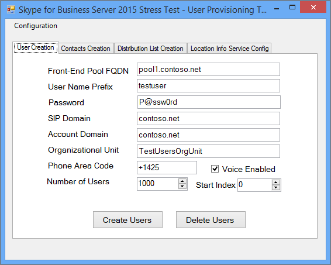

# <a name="using-the-skype-for-business-server-2015-stress-and-performance-tool"></a>Skype for Business Server 2015 Stress and Performance Tool の使用
 
Skype for Business Server 2015 Stress and Performance Tool を実行するには、ユーザー、連絡先、およびユーザー プロファイルの両方を管理し、ツールを実行用に構成してから、ツールによって生成された出力または結果を確認できる必要があります。
  
Skype for Business Server 2015 Stress and Performance Tool の実行には、次の 4 つの領域があります (実行可能ファイルは次LyncPerfTool.exe。
  
- [ユーザーと連絡先を作成する](using-the-tool.md#BKMK_CreateUsersAndContacts)
    
- [ユーザー プロファイルを構成する](using-the-tool.md#BKMK_UserProfile)
    
- [LyncPerfTool の実行](using-the-tool.md#BKMK_RunTool)
    
- [結果の解釈](using-the-tool.md#BKMK_Interpret)
    
## <a name="create-users-and-contacts"></a>ユーザーと連絡先を作成する
<a name="BKMK_CreateUsersAndContacts"> </a>

Skype for Business Server 2015 (SB 2015) ユーザー プロビジョニング ツール (UserProvisioningTool.exe) を使用して、ストレスおよびパフォーマンス テスト用のユーザーと連絡先を作成する必要があります。
  
トピックを読む上で役立つ可能性がある便利な用語の一覧を次に示します。
  
- **組織単位** - Active Directory ドメイン サービス (AD DS) 組織単位 (OU)。
    
- **フェデレーション/クロス プール** - 他のインスタント メッセージング (IM) サービスのユーザーと通信できるユーザー。
    
- **配布リスト** - または配布リスト。 これらは、DS ユーザー ADリストを含む AD DS 内のオブジェクトです。 これらは、ユーザーのグループ間の通信を容易にするために使用されます。
    
- **位置情報** サービス - Skype for Business Server 2015 サービス。電話ごとに有効にし、構成すると、Enhanced 911 (E911) サービスの物理的な場所を取得できます。
    
- **米国の電話番号** - 逆引き番号検索 (RNL) で着信および発信通話をルーティングするために使用される SIP URI に加えて、ユーザーに割り当てられた電話番号。
    
### <a name="create-users-and-contacts-by-using-userprovisioningtoolexe"></a>ユーザーと連絡先を使用してユーザーと連絡先をUserProvisioningTool.exe

> [!NOTE]
> 始める前に、このツールを実行するために Domain Admins セキュリティ グループのメンバーとしてログインしている必要があります。 Active Directory ユーザーを作成する場合は、これを行う必要があります。 
  
読み込みシミュレーション用のユーザーと連絡先を作成するには、Skype for Business Server ユーザー プロビジョニング ツールを使用する必要があります。
  
**Skype for Business Server ユーザー プロビジョニング ツール** は **、Skype for Business Server Stress and Performance Tool パッケージと一緒にインストール** されます。 テストするフロントエンド サーバーまたは Standard Edition サーバーで、パッケージ インストーラー (CapacityPlanningTool.msi) が実行済みである必要があります。
  
Skype for Business Server ユーザー プロビジョニング ツールを起動するには、フロントエンド サーバーまたは Standard Edition サーバー上でファイル UserProvisioningTool.exe (%InstalledDirectory%LyncStressAndPerfTool\LyncStress にあります) を実行します。
  
> [!IMPORTANT]
> 多数のユーザー (たとえば、10,000 以上) を作成する場合は、次のコマンドUserProvisioningTool.exe。 ツールは新しいユーザーを作成および構成するために、  *これを行う*  ADがあります。
  
ユーザー プロビジョニング ツールが開いたら、[構成] をクリックし、[構成の読み込み] を選択します。 
  
ユーザーと連絡先の構成を開始するには、パッケージに含まれている既定のファイル ("SampleData.xml" と呼ばれる) を読み込SampleData.xml。 これにより、展開に関連付けするために変更が必要なサンプル データがフィールドに事前に入力されます。
  
カスタマイズした設定が既に含まれている構成済みの XML ファイルがある場合は、代わりにそのファイルを読み込む必要があります。 以下のセクションで説明するように、ユーザー プロビジョニング ツールのフィールドに入力します。
  
### <a name="to-configure-server-options"></a>サーバー オプションを構成するには:

1. [ **フロントエンド プールの FQDN]** フィールドに、Standard Edition サーバーの完全修飾ドメイン名 (FQDN) またはユーザーをホストするフロントエンド プールを入力します。
    
2. [ **ユーザー名のプレフィックス** ] フィールドに、テスト目的でユーザー名を変更するために使用するプレフィックス ("TestUser" など) を入力します。
    
3. [ **パスワード] フィールド** に、すべてのテスト ユーザー アカウントで使用するパスワードを入力します。
    
4. [ **アカウント ドメイン]** フィールドに、現在のドメイン ドメインAD (テスト ユーザーを作成するドメイン) を入力します。
    
5. [組織 **単位]** フィールドに、これらのテスト ユーザーをADドメインの名前を入力します。 (OU が存在しない場合は、作成されます)。
    
6. [電話エリア **コード]** フィールドに、すべてのテスト ユーザー アカウントで使用する 3 桁のエリア コードを入力します。 選択したエリア コードが、他のユーザーのエリア コードと競合しないことをAD。
    
7. テスト ユーザーの音声を **有効** にする場合は、[音声が有効] チェック ボックスをオンエンタープライズ VoIP。
    
8. [ユーザー **数] フィールド** に、作成するテスト ユーザーの総数を指定します。
    
9. [開始 **インデックス** ] フィールドで、ユーザー名のプレフィックスのサフィックスとして使用される開始番号を指定します (たとえば、プレフィックスが "TestUser" で、下の例では名の末尾が "0" になります)。
    
     
  
#### <a name="create-users-button"></a>[ユーザーの作成] ボタン

[ユーザーの作成] ボタン **を** クリックすると、入力した入力パラメーターが検証されます。 検証エラーがある場合は、修正を求めるメッセージが表示されます。 または、すべての値が正しい場合、(指定した OU 内の) ADにユーザーが表示され始める可能性があります。 ツールの実行時に、ツールの下部に進行状況バーが表示されます。 進行状況バーがアクティブな間はアプリケーションを閉じない。
  
ユーザーの作成には時間がかかるので、必要に応じて計画してください。 このプロセスは、数分間のユーザーの場合は任意の時間、多数のユーザーの場合は数時間かかる場合があります。
  
テスト環境で AD ドメイン コントローラーにアクセスできない場合でも、作成するユーザー範囲のユーザーの 1 人としてログインすることで、ユーザーの作成を検証できます。 ユーザー名には、プレフィックスとサフィックスを@sipDomainしてください。 次に例を示します: <em>TestUser20@contoso.net。</em>
  
> [!NOTE]
> ユーザーが既に存在する場合は、[ユーザーの作成] ボタンをクリックすると、構成の変更によってユーザーが更新されます。 
  
#### <a name="delete-users-button"></a>[ユーザーの削除] ボタン

[ユーザーの削除] **ボタンをクリック** すると、タブの入力パラメーターが検証されます。 検証エラーがある場合は、修正を求めるメッセージが表示され、入力値が正しい場合は、指定したテスト ユーザーが無効になり、Active Directory から削除されます。 この場合も、このタブの下部に進行状況バーが表示され、進行状況バーがアクティブな間はアプリケーションを閉じてはならない。
  
> [!NOTE]
> サポートされているのは、米国形式の電話番号のみです。 電話番号は常にユーザーに割り当てられます。電話番号によって作成UserProvisioningTool.exeユーザーは、既定エンタープライズ VoIP有効になっています。 電話会議や UC-PSTN 通話など、自動応答を使用するシナリオでは、この電話番号を使用して通話を適切にルーティングします。 このため、すべてのユーザーは  *一意*  の電話番号 *を持っている必要があります*  。
  
> [!NOTE]
> **ユーザーを 2 回作成する必要がある場合は、別のエリア コードを使用しない限り、または以前のユーザーが Disable-CsUser コマンドレットを使用して無効になっている場合、コマンドは失敗します。**
  
> [!IMPORTANT]
> 連絡先を作成する前に、まずユーザーのレプリケーションを完了する必要があります (これは [ユーザー] タブから実行します)。 
  
> [!IMPORTANT]
> ユーザーを作成したばかりである場合は、Skype for Business Server のレプリケーションが完了し、データベースにユーザー アカウントが設定されるまで待機する必要があります。 **ユーザーがレプリケートを完了していない場合は、エラーが表示されます。** Skype for Business Server 2015 フロントエンド サービスが開始した場合、または指定した総数の最後のユーザーに対して Get-CsUser コマンドレットを正常に実行することで、ユーザーがレプリケートを完了した時間が分かっています。
  
#### <a name="contacts-creation-tab"></a>[連絡先の作成] タブ

このタブでは、テスト用にユーザーの連絡先の詳細を指定できます。
  
![[コンテンツの作成] タブを表示するユーザー プロビジョニング ツール。](../../media/dfb7fdf1-fb97-4e8e-8608-c4995f95dd5b.png)
  
### <a name="to-configure-users-contacts-do-the-following"></a>ユーザーの連絡先を構成するには、次の手順を実行します。

1. [Average **Contacts per User]** フィールドに、各ユーザーの連絡先リストに入力する連絡先の平均数を入力します。
    
2. すべてのユーザー **に対** して同じ数の連絡先を作成する場合は、[固定] チェック ボックスをオンにします。 ユーザー用に作成された連絡先の数を変更する場合は、そのチェック ボックスをオフにします。
    
3. [ユーザーあたりの **平均連絡先グループ数]** フィールドに、ユーザーごとの連絡先グループの数を入力します。 この数は、ユーザーごとの平均連絡先 **よりも小さくする必要があります**。
    
4. [フェデレーション/ **クロス プールの連絡先の割合** ] フィールドで、0 ~ 100 の数値を指定します。 この割合の連絡先は、フェデレーション ユーザーと一緒に作成されます。
    
5. [ **フェデレーション/ クロス プール** ユーザー プレフィックス] フィールドで、ローカル ユーザーの連絡先リストに追加されるフェデレーション ユーザーのユーザー名を指定します。
    
6. [フェデレーション **/クロス プール ユーザー SIP ドメイン** ] フィールドで、フェデレーション ユーザーの SIP ドメイン名を指定します。
    
7. [ **ユーザーの作成]** タブで、情報が正しいか確認します。 連絡先は、[ユーザーの作成] タブの値から作成されます。
    
8. [連絡先 **の作成] を** クリックして連絡先の作成を開始します。 このプロセスには数分かかる場合があります。 完了すると、"Operation Completed Successfully" というメッセージが表示されたダイアログ ボックスが表示されます。 作成された連絡先は、[ユーザーの作成] タブから作成されたユーザーとしてログオンすることで検証できます。
    
    > [!NOTE]
    > 連絡先が作成されると、このツールはターゲット プール内のすべてのフロントエンド サーバーを再起動します。 この操作によって作成された連絡先の数によっては、フロントエンド サーバーの起動に時間がかかる場合があります (最大 2 時間)。 
  
#### <a name="distribution-list"></a>配布リスト

Skype for Business Server 2015 Stress and Performance Tool は、Skype for Business 2015 クライアントの配布リスト (DL) 拡張機能をシミュレートできます。 ユーザー プロビジョニング ツールで DL 拡張を有効にしない場合は、この手順を省略できます。
  
![[配布リストの作成] タブを表示するユーザー プロビジョニング ツール。](../../media/4b689306-70c4-4569-9842-15c73f038eb6.png)
  
[配布リスト] タブでは、Stress and Performance Tool が配布リスト拡張機能に使用する配布リストを作成できます。 DLL を作成する前に、ForestPrep の実行を含め、Skype for Business Server 2015 を展開する必要があります。 これが行われなかった場合、DL 属性は AD スキーマに存在しないので、ツールは DL を作成できません。
  
### <a name="to-configure-distribution-lists"></a>配布リストを構成するには:

1. [配布 **リスト** の数] フィールドに、作成する配布リストの総数を指定します (ここでの推奨事項は、ユーザー数の 2 倍の値から始めるという方法です)。
    
2. [Distribution **List Prefix]** フィールドに、作成する DLL のプレフィックス *(testDL*  など) を入力します。 つまり、100 DL では、DL 名は testDL0、testDL1、testDL99 までのように表示されます。
    
3. **[Dist. List]** フィールドの [Minimum Members] に、各 DL に入力する最小ユーザー数を入力します。
    
4. **[Dist の最大メンバー** 数] フィールドに、各 DL に追加する最大ユーザー数を入力します。
    
#### <a name="create-distribution-lists-button"></a>[配布リストの作成] ボタン

[配布リストの作成] ボタンをクリックすると、このツールは Active Directory を照会して、プレフィックスと番号に一致する配布リストが既に存在していないか確認します。 このツールは、まだ存在していない DLL を作成します。 これらの新しく作成した配布リストにメンバーを追加するときに、[ユーザーの作成] タブで指定した範囲からユーザーを選択します。
  
#### <a name="location-info-service-config-tab"></a>[場所情報サービス構成] タブ

Skype for Business Server 2015 Stress and Performance Tool では、場所情報サービスのダミー構成ファイルを生成することもできます。 通常、場所情報サービスは、サーバーのパフォーマンスに大きな影響を与える点に注意してください。 
  
![[場所情報サービス構成] タブを表示するユーザー プロビジョニング ツール。](../../media/227662a2-e0c3-4e34-ab54-5f1459344f30.png)
  
If you choose to test this feature, fill in the values in the form and click the Generate LIS Config Files button, which will create .CSV ファイルの呼び出し:
  
- LIS_Subnet.csv
    
- LIS_Switches.csv
    
- LIS_Ports.csv
    
- LIS_WAP.csv
    
これらのファイルを LIS データベースにインポートするには、次の PowerShell コマンドレットを使用します。
  
- Set-CsLisSubnet
    
- Set-CsLisSwitch
    
- Set-CsLisPort
    
- Set-CsWirelessAccessPoint
    
## <a name="configure-user-profile"></a>ユーザー プロファイルを構成する
<a name="BKMK_UserProfile"> </a>

(ユーザー作成ツールを使用して) ユーザーを作成した後、Skype for Business Server 2015 Load Configuration ツール (UserProfileGenerator.exe) を使用してユーザー プロファイルを構成できます。
  
### <a name="running-the-skype-for-business-server-2015-load-configuration-tool"></a>Skype for Business Server 2015 Load Configuration ツールの実行

構成の読み込みツール (UserProfileGenerator.exe) を起動し、タブに入力します。 このツールは、シミュレーションの実行に必要なクライアント コンピューターごとにディレクトリを作成します。 各クライアント ディレクトリには、Skype for Business Server 2015 Stress and Performance ツール (LyncPerfTool.exe) を起動するスクリプトが付属しています。 以下のセクションでは、Skype for Business Server 2015 Load Configuration ツールの各タブのフィールドに入力する方法の例を示します。
  
> [!IMPORTANT]
> 読み込み構成ツール (UserProfileGenerator.exe) で使用されるユーザー固有の値は、プールの Skype for Business Server 2015 ユーザー作成ツール (UserProvisioningTool.exe) で指定された値と一致する必要があります。 
  
#### <a name="common-configuration-tab"></a>[共通の構成] タブ

Load Configuration Tool の [Common **Configuration]** タブを以下に示します。 次の手順で説明するように、[共通の構成] タブのフィールドに入力します。
  
![[共通の構成] タブを表示する [ユーザー プロビジョニング] タブ。](../../media/c25df343-3550-47fb-88e0-29194338fee2.png)
  
1. [利用可能 **なコンピューター** の数] フィールドに、Stress and Performance ツールの実行に使用するコンピューターの数を入力します (LyncPerfTool.exe)。 シミュレートする 4,500 ユーザーごとに 1 台のコンピューターを用意することをお勧めしますが、負荷レベルを下げるか、ツールの使用可能な機能のサブセットのみを使用する場合は、その数が異なる場合があります ([一般的なシナリオ] タブで読み込みレベルが設定されます)。
    
2. [ユーザー **名のプレフィックス]** フィールドに、すべてのユーザーのユーザー名フィールドのプレフィックスを入力します。 Uri (Uniform Resource Identifier) にログインするには *、UserPrefix[User Start Index...(ユーザー数-1)]@Userドメイン*  (たとえば、myUser009@Contoso.com)。
    
3. [すべての **ユーザーのパスワード] フィールドに** 、ユーザーの作成時に使用するパスワードを入力します。 このフィールドを空のままにすると、ユーザー名はパスワードとして設定されます。
    
4. [ユーザー **の開始インデックス]** フィールドに、構成する最初のユーザーのインデックスを入力します。 異なる種類または負荷レベルに対して異なる範囲を構成できますが、構成する範囲ごとに 1 回、Load Configuration ツール (UserProfileGenerator.exe) を実行する必要があります。
    
5. [ **ユーザー数] フィールド** に、構成するユーザーの総数を入力します。
    
6. [ユーザー **ドメイン] フィールド** に、SIP URI に使用するドメインを入力します。 これは、Skype for Business Server 2015 フロントエンド サーバーまたは Standard Edition サーバーにログオンする各ユーザーの SIP URI を作成するために使用され、アカウント ドメインとは異なる場合があります。
    
7. [アカウント **ドメイン] フィールド** に、DS ドメイン ログオンAD入力します。
    
8. **[MPOP の割合**] (複数のプレゼンス ポイントの割合) フィールドで、複数のコンピューターまたはデバイスからログオンしているユーザーの割合 (たとえば 10%) の値を指定します。
    
9. [サインイン/秒] (インスタンスごとに) フィールドに同時 **エンドポイントの最大数を入力** します。 これはユーザーのログインの最大数であり、推奨される割合は 1 秒あたり 2 以下 (<=2) です。
    
10. [アクセス プロキシ] または [プール **の FQDN]** フィールドに、クライアントが接続するサーバーの完全修飾ドメイン名 (FQDN) を入力します。 ユーザーが外部でログオンしている場合は、アクセス プロキシを入力する必要があります。 ユーザーが内部の場合は、エンタープライズ プールまたは Standard Edition サーバーの FQDN を指定します。
    
11. [ **ポート] フィールド** に、ユーザーが SIP に使用するポートを入力します (既定値は 5061 です)。
    
12. [外部 **ネットワーク サーバーの設定** ] フィールドで、アクセス プロキシまたはプールの FQDN を指定し、ここでもポートを指定 **します**。 これらの設定は、外部エンドポイントの負荷シミュレーションにのみ使用されます。
    
#### <a name="general-scenarios-tab"></a>[一般的なシナリオ] タブ

![[一般的なシナリオ] タブを表示する構成ツールの読み込み。](../../media/45792e57-4322-4c20-956f-fe480b0de1a7.png)
  
実行または無効のままにする処理を決定することで、提供される一般的な各シナリオの負荷レベルとパラメーターを構成できます。 一般的なオプションを次に示します。
  
> [!NOTE]
> ローカル 情報サービスを含むすべてのフィールドの読み込みレベルの値は **、無効**、**低**、**中、****高、** または **ユーザー設定です**。 [無効] を選択した場合は、クライアントごとに構成が生成されます。 この値が高い場合、サーバーでサポートされる負荷は最大になります。medium は高負荷の 60% です。low は 30% です。 
  
- **インスタント メッセージング -** これにはピアツーピアおよび会議が含まれます。読み込みレベルに適した値を選択します。
    
- **電話会議 -** 電話会議専用の負荷レベルを選択 *します*  。 ピアツーピア通話については、「音声シナリオ」セクションで少し **後で取り組む予定** です。 MultiView を **有効にするには** 、[詳細設定] タブを開きます。
    
- **アプリケーション共有 -** アプリケーション共有の負荷レベルを選択します。
    
- **データ コラボレーション -** データ会議を含むデータ コラボレーションの負荷レベルを選択します。
    
- **配布リストの展開 -** [詳細設定 **]** ボタンをクリックし、ユーザー作成ツール (UserProvisioningTool.exe) の [DL] タブで構成されている値と同じ値をフィールドに入力します。 負荷レベルを選択します。
    
- **アドレス帳 Web クエリ -** これは、アドレス帳ファイルのダウンロードではなく、アドレス帳参照サービスです。 アドレス帳ファイルのダウンロードに対してこれを有効にする場合は、[詳細設定] ボタンをクリックし **、EnableABSDownload** を True に設定します。 読み込みレベルの値を指定します。
    
- **応答グループ サービス -** [詳細設定 **] ボタン** をクリックし、応答グループ サービス エージェントの準備時に既に作成した応答グループの URI を指定します。 少なくとも 1 つの応答グループを選択する必要があります。 さらに多くの値を使用するには、応答グループをセミコロンで区切ります。 **RGSUriSuffixStartIndex** と **RGSUriSuffixEndIndex** を実際の値に更新します。 負荷レベルを選択します。
    
- **場所情報サービス -** [有効] または [無効] の読み込みレベルを選択します。
    
> [!NOTE]
> 各シナリオには、横に [詳細設定] ボタンがあります。また、既定の設定へのバリエーションを有効にする一連のチェック ボックスがあります。 
  
- *アドホックを選択* すると、ツールは 1 時間を通して作成される会議のシミュレーションを生成できます。
    
- 大きな  *Conf を選択*  すると、大規模な会議シナリオがシミュレートされます。
    
-  *External*  は、外部ユーザーもシミュレートする必要があります。
    
これらのボタンとチェック ボックスは、各シナリオに固有の追加の値であり、Stress and Performance Tool の動作を変更し、カスタマイズを可能にします。
  
[一般シナリオ] タブのシナリオごとに (場所情報サービスを除く)、読み込みレベルの値がユーザー設定の場合、[詳細設定] ダイアログ ボックスの対応するフィールドを使用して会話速度が計算されます。 シナリオによってフィールド名が異なる場合がありますが、フィールドの説明は次の状態になります。メモ この番号は、ドロップダウン メニューから [ユーザー設定] が選択されている場合にのみ  *使用されます*  。
  
値 **High、Medium、****および** **Low** は、すべてのシナリオのバランスが取れたユーザー モデルに合ったモダリティごとの会話レートを変更します。 期待される使用量の違いによりモダリティごとの負荷レベルを変更する必要がある場合は、カスタム会話レートを使用します。
  
#### <a name="voice-scenarios-tab"></a>[音声シナリオ] タブ

これは、音声関連のすべてのシナリオを構成するタブです。
  
![[構成ツールの音声シナリオの読み込み] タブ](../../media/042e406f-5156-4095-a4eb-6298f24bb51f.png)
  
選択肢は以下のとおりです。
  
- **VoIP -** [詳細設定 **] ボタン** をクリックし、PhoneAreaCode フィールドと LocationProfile (ダイヤル プラン) フィールドの値を追加します。 また、読み込みレベルの値も指定します。 VoIP または UC/PSTN ゲートウェイの負荷レベルを有効にした場合、外部通話をシミュレートするために公衆交換電話網 (PSTN) から統合コミュニケーション (UC) への構成ファイルが生成されます。
    
- **UC/PSTN ゲートウェイ -** 負荷レベルの値を選択する必要があります。無効以外の値を選択する場合は、[詳細設定] ボタンをクリックして PSTN エリア コードの値も **指定する必要** があります。 仲介 **サーバーと** PSTN の下の [追加] をクリックします。 エリア コード用にルートが構成されていることを確認します。
    
    > [!TIP]
    > Skype for Business コントロール パネルまたは Skype for Business 管理シェルを使用して、ボイス ルートの構成を確認できます。 
  
- **会議アテンダント -** 読み込みレベルの値を指定します。 Disabled 以外の値を指定すると、[電話番号] **フィールドが有効** になります。 使用する電話番号を自動応答入力します。 [ **詳細設定] を** クリックし **、[LocationProfile] フィールドの値を指定** します。
    
- **Call Parking Service -** ここでは、負荷レベルを指定します。
    
- **仲介サーバーと PSTN -** 使用する仲介サーバーごとに、独自の PSTN シミュレーターが必要です。 シミュレーターに使用するクライアントを決定した後、構成した PSTN シミュレーターで通話をそのコンピューターにルーティングするように仲介サーバーを構成します。 [追加 **] ボタン** をクリックして、仲介サーバーの値を構成します。
    
    > [!NOTE]
    > 各シナリオの横に [詳細設定] ボタンがあります。 [詳細] ダイアログ ボックスには、Stress and Performance Tool の動作を変更し、カスタマイズを有効にする各シナリオに固有の設定が含まれる。 > [音声シナリオ] タブのシナリオごとに、読み込みレベルの値が **カスタム** の場合、[詳細設定] ダイアログ ボックスの対応するフィールドを使用して会話速度が計算されます。 シナリオによってフィールド名が異なる場合がありますが、フィールドの説明は次の状態になります。メモ この番号は、ドロップダウン メニューから [ユーザー設定] が選択されている場合にのみ  *使用されます*  。
  
#### <a name="web-app-tab"></a>[Web App] タブ

![構成ツールの [Web アプリ] タブを読み込む。](../../media/505b54ef-8140-4dec-a43e-08091f592b34.png)
  
Web App は、フロントエンド サーバーにインストールされている Unified Communications Web API (UCWA) サーバーを介した会議シナリオをサポートします。 [Web アプリ] タブを使用して、すべての Web アプリ関連のシナリオを構成します。 オプションは、次のとおりです。
  
- **一般的な Web アプリの設定 -** [追加 **設定]** ボタンをクリックし **、ReachTargetServerUrl** をフロントエンド プールの VIP のディレクトリ プール仮想 IP (VIP) に設定します。
    
- **アプリケーション共有 -** 読み込みレベルの値を選択します。
    
- **データ コラボレーション -** 読み込みレベルの値を選択します。
    
- **インスタント メッセージング -** 読み込みレベルの値を選択します。
    
- **音声会議 -** 読み込みレベルの値を選択します。
    
> [!NOTE]
> 各シナリオの横に **[詳細設定** ] ボタンがあります。 詳細ダイアログには、Stress and Performance Tool の動作を変更し、カスタマイズを有効にする各シナリオに固有の値が含まれます。> Web App の各シナリオで、読み込みレベルが **カスタム** の場合は **、ConversationsPerHour** フィールドで指定された値が既定ではなく使用されます。
  
#### <a name="mobility-tab"></a>[モビリティ] タブ

モビリティ関連のすべてのシナリオを構成するには、このタブを使用します。
  
![[構成ツールのモビリティの読み込み] タブ](../../media/30af39c2-50ea-476a-8a56-ce2ddf08517e.png)
  
オプションは次のとおりです。
  
- **General Mobility Settings -** [ **追加設定]** をクリックし、フィールド UcwaTargetServerUrl をディレクター プール仮想 IP (VIP) またはフロントエンド プールの VIP に設定します。
    
- **プレゼンスと P2P インスタント メッセージング/オーディオ -** モビリティ シミュレーションを有効にするには、負荷レベルの値を選択します。
    
> [!NOTE]
> 各シナリオの横に **[詳細設定** ] ボタンがあります。 詳細ダイアログには、Stress and Performance Tool の動作を変更し、カスタマイズを有効にする各シナリオに固有の値が含まれます。> 各モビリティ シナリオで、負荷レベルが **カスタム** の場合は **、ConversationsPerHour** フィールドで指定された値が既定ではなく使用されます。
  
#### <a name="summary-tab"></a>[概要] タブ

[概要] タブは、各シナリオで使用するユーザーを示します。
  
![[構成ツールの概要] タブを読み込む。](../../media/436fb3f2-d73e-402d-bc6e-e8a6740819d2.png)
  
[概要] タブは、各シナリオで使用するユーザーを示します。 
  
ユーザー番号の範囲を手動で構成するには、[ユーザー範囲の生成を有効にする] チェック ボックスをオンにし、カスタマイズするユーザー範囲を含む表のシナリオをダブルクリックします。
  
**(RunClient.bat) サインイン** 速度に対応する生成されたバッチ ファイルに遅延を含めるには、開始時にサインインの遅延を追加します。 これは、多数のユーザーをサインインするときにサーバーの過負荷を防ぐのに役立ちます。
  
[ **ファイルの生成]** をクリックし、構成を生成するフォルダーを選択します。 ファイルが正常に作成されると、ダイアログ ボックスが表示されます。
  
![[正常に生成された構成ファイルの読み込み] メッセージ ボックス。 [OK] をクリックします。](../../media/c3c1d4a0-cb44-4837-8124-03354f5d9d8c.png)
  
## <a name="run-lyncperftool"></a>LyncPerfTool の実行
<a name="BKMK_RunTool"> </a>

Skype for Business Server 2015 Stress and Performance Tool (LyncPerfTool.exe) を実行する前に、ユーザー、連絡先、およびシナリオを作成する必要があります。 ツールを使用してこれらのアクションを実行する方法の詳細[](using-the-tool.md#BKMK_CreateUsersAndContacts)については、この記事で[](using-the-tool.md#BKMK_UserProfile)前に説明した「ユーザーと連絡先の作成とユーザー プロファイルの構成」を参照してください。 これらのツールを実行すると、必要なパラメーターを含むバッチ ファイルの一部として Stress and Performance ツールで実行されるファイルも生成されます。
  
### <a name="running-the-skype-for-business-server-2015-stress-and-performance-tool"></a>Skype for Business Server 2015 Stress and Performance ツールの実行

Load Configuration ツール (UserProfileGenerator.exe) は、パフォーマンス カウンターを登録し、XML 構成ファイルを読み込み、Stress and Performance Tool (LyncPerfTool.exe) を実行できるバッチ ファイルを作成します。 バッチ ファイルは、構成ファイルごとに 1 LyncPerfTool.exeインスタンスを実行します。 バッチ ファイルを実行するには、次の手順を実行します。
  
### <a name="run-the-stress-and-performance-test"></a>ストレスとパフォーマンスのテストを実行する

1. 構成フォルダーとファイルを含むフォルダーを、各クライアント コンピューター上にLyncPerfTool.exeディレクトリにコピーします。 (たとえば、1.28_13.16.16 という名前のフォルダーに構成ファイルを生成した場合は、そのフォルダーを LyncPerfTool.exe が含むフォルダーにコピーします。 これを各クライアントで行います)。
    
2. クライアント フォルダーに移動し **、RunClient** バッチ スクリプトを実行します。 エクスプローラーでバッチ ファイルをダブルクリックすると、そのクライアントのすべての構成ファイルが実行されます。 次の構文を使用して、クライアント フォルダーからスクリプトを実行することもできます。
    
   ```console
   RunClient0.bat "C:\Program Files\Skype for Business Server 2015\LyncStressAndPerfTool\LyncStress" 
   ```

Stress and Performance ツールを直接実行するには、コマンド プロンプトを開き、コマンド ラインで次のコマンドを入力します (初めて実行する場合は、このトピックの後半のメモに示すように、必ずパフォーマンス カウンターを登録してください)。 `regsvr32 /i /n /s LyncPerfToolPerf.dll`
  
```console
LyncPerfTool.exe /file:IM_client0.xml
```

ツールで構成ファイルの値を表示するには、前のコマンドにパラメーターを含め、次のように  `/displayfile` します。
  
```console
LyncPerfTool.exe /file:IM_client0.xml /displayfile
```

プロセス  *を終了*  するには、Ctrl + C キーを押します。
  
> [!NOTE]
> Stress and Performance ツールを直接実行する前に、次のコマンドを使用してパフォーマンス カウンターを登録する必要があります。  `regsvr32 /i /n /s LyncPerfToolPerf.dll`
  
> [!NOTE]
> 開始する Stress and Performance ツールのすべてのインスタンスは、すぐにユーザーのサインインを開始します。通常は、1 秒あたり 1 ユーザーの割合でサインインします。 
  
プールのユーザー サインイン率のピークは、1 秒あたり約 12 です。 つまり、ユーザーがサインインしている間、同時に 12 LyncPerfTool.exeを超えるインスタンスを開始してはならないことを意味します。 1 秒あたり 1 人のユーザーが完全にサインインするには、約 20 分かかります。
  
## <a name="interpreting-the-results"></a>結果の解釈
<a name="BKMK_Interpret"> </a>

Skype for Business Server 2015 Stress and Performance Tool には、クライアントが何を行い、問題が発生しているのかを理解するのに役立つカウンターが多数含まれています。
  
### <a name="client-counters"></a>クライアント カウンター

実行中のインスタンスLyncPerfTool.exeカウンターのインスタンスが個別に設定されます。 各インスタンスの名前は、プロセス ID によって指定されます。 クライアントが過負荷の場合は、他の問題が発生する可能性があります。 これらの問題を回避するには、次の手順を実行します。
  
- クライアント コンピューターの CPU とメモリの使用状況を監視します。 CPU が一貫して 90% を超える場合は、ユーザーの数を減らします。
    
- メモリ使用量が高い場合は、ページ ファイルの領域が足りなから始まると、問題が発生する可能性があります。 コミット チャージがコンピューターの制限に達していないのを確認します。 メモリ制限に達している場合は、ページ ファイルのサイズを大きくするか、ユーザー数を減らすことを検討してください。
    
主要なパフォーマンス カウンターの一覧を次に示します。
  
**一般的な情報**

|**パフォーマンス カウンター**|**説明**|
|:-----|:-----|
|時間 (分)  <br/> |プロセスが開始された後に費やされた時間。  <br/> |
|アクティブなエンドポイント  <br/> |サーバーに現在接続されているエンドポイントの数。  <br/> |
|失敗したログオン  <br/> |エンドポイント サインインの失敗の総数。  <br/> |
|ログオン試行回数  <br/> |エンドポイント サインインの合計試行回数。  <br/> |
|Endpoints Disconnected  <br/> |切断されたエンドポイントの総数。  <br/> |
   
**プレゼンス情報**

|**パフォーマンス カウンター**|**説明**|
|:-----|:-----|
|SetPresence Calls  <br/> |プレゼンス変更の合計試行回数。 さまざまな種類のプレゼンス変更については、「SetPresence (Presence Type) Calls Performance Counter」を参照してください。  <br/> |
|SetPresence の NNN 応答  <br/> |サーバーから受信した nnn 応答コードの総数。  <br/> |
|GetPresence Calls  <br/> |プレゼンス要求の取得試行の総数。  <br/> |
|GetPresence の NNN 応答  <br/> |サーバーから受信した nnn 応答コードの総数。  <br/> |
   
**アドレス帳サービス情報**

|**パフォーマンス カウンター**|**説明**|
|:-----|:-----|
|ABS Full/Delta File Downloads Attempted  <br/> |試行された完全ファイルまたは差分ファイルのダウンロード要求の総数。  <br/> |
|ABS Full/Delta File Downloads Succeeded  <br/> |試行された完全ファイルまたは差分ファイルのダウンロード要求の総数。  <br/> |
|アドレス帳 Web クエリ サービス関連のカウンター  <br/> |アドレス帳ファイルのダウンロードに関連するカウンター。  <br/> |
|ABS WS Calls attempted  <br/> |試行されたアドレス帳 Web クエリ サービス要求の総数。  <br/> |
|ABS WS Calls Succeeded  <br/> |正常な応答コードを返したアドレス帳 Web クエリ サービス要求の総数。  <br/> |
|ABS WS Calls Failed  <br/> |エラー応答コードを返したアドレス帳 Web クエリ サービス要求の総数。  <br/> |
   
> [!NOTE]
> このカテゴリには、アドレス帳サービス (ABS) ファイルのダウンロードとアドレス帳 Web クエリ サービス要求を監視するために使用されるカウンターが含まれます。 
  
**配布リスト (DL) 情報**

|**パフォーマンス カウンター**|**説明**|
|:-----|:-----|
|Calls Attempted  <br/> |試行された配布リスト拡張 (DLX) Web サービス要求の総数。  <br/> |
|Calls Succeeded  <br/> |成功した応答コードを返した DLX Web サービス要求の総数。  <br/> |
|Calls Failed  <br/> |エラー応答コードを返した DLX Web サービス要求の総数。  <br/> |
   

  
> [!NOTE]
> 以下に示すパフォーマンス カウンターは、仲介サーバー、音声ビデオ会議サーバー、エッジ サーバー、応答グループ アプリケーション、電話会議 自動応答 に対する通話を含む、すべてのボイス オーバー IP (VoIP) 呼び出し (これらのシナリオが有効な場合) の番号を報告します。 
  
**VoIP の基本情報**

|**パフォーマンス カウンター**|**説明**|
|:-----|:-----|
|Calls Active  <br/> |現在進行中の着信/発信音声通話の総数。  <br/> |
|Calls Terminated  <br/> |既に終了している着信/発信音声通話の総数。  <br/> |
|Calls Declined  <br/> |拒否された着信音声呼び出しの総数。  <br/> |
|着信/発信呼び出しの試行  <br/> |試行された着信/発信音声通話の総数。  <br/> |
|着信/発信通話の確立  <br/> |確立された着信/発信音声通話の総数。  <br/> |
|Calls Received NNN  <br/> |サーバーから受信した nnn 応答コードの総数。  <br/> |
|VoIP パス レート (%)  <br/> |Total calls established/Total calls attempted.  <br/> |
   
**応答グループ サービスの通話情報**

|**パフォーマンス カウンター**|**説明**|
|:-----|:-----|
|Calls Active  <br/> |応答グループ アプリケーションに対するアクティブな通話の総数。  <br/> |
|Calls Attempted  <br/> |試行された通話の総数。  <br/> |
   
**インスタント メッセージング (IM) 通話情報**

|**パフォーマンス カウンター**|**説明**|
|:-----|:-----|
|Calls Active  <br/> |進行中の着信/発信インスタント メッセージング呼び出しの総数。  <br/> |
|Calls Terminated  <br/> |既に終了している着信/発信インスタント メッセージング呼び出しの総数。  <br/> |
|Calls Received NNN  <br/> |サーバーから受信した nnn 応答コードの総数。  <br/> |
|IM メッセージの受信/送信  <br/> |すべてのセッションで受信または送信されたメッセージの総数。  <br/> |
|着信/発信呼び出しの試行  <br/> |試行された着信/発信インスタント メッセージング呼び出しの総数。  <br/> |
|着信/発信通話の確立  <br/> |確立された着信/発信インスタント メッセージ呼び出しの総数。  <br/> |
   
**アプリ共有呼び出し情報**

|**パフォーマンス カウンター**|**説明**|
|:-----|:-----|
|Calls Active  <br/> |進行中の着信/発信アプリケーション共有呼び出しの総数。  <br/> |
|Calls Terminated  <br/> |既に終了している着信/発信アプリケーション共有呼び出しの総数。  <br/> |
|Calls Received NNN  <br/> |サーバーから受信した nnn 応答コードの総数。  <br/> |
|着信/発信呼び出しの試行  <br/> |試行された着信/発信アプリケーション共有呼び出しの総数。  <br/> |
|着信/発信通話の確立  <br/> |確立された着信/発信アプリケーション共有呼び出しの総数。  <br/> |
   
**CAA 通話情報**

|**パフォーマンス カウンター**|**説明**|
|:-----|:-----|
|Calls Active  <br/> |現在進行中の着信/発信公衆交換電話網 (PSTN) 通話の総数。  <br/> |
|Calls Terminated  <br/> |既に終了している着信/発信 PSTN 通話の総数。  <br/> |
|着信/発信呼び出しの試行  <br/> |試行された着信/発信 PSTN 通話の総数。  <br/> |
|着信/発信通話の確立  <br/> |確立された着信/発信 PSTN 通話の総数。  <br/> |
   
**電話会議情報**

|**パフォーマンス カウンター**|**説明**|
|:-----|:-----|
|アクティブなインスタント メッセージング会議  <br/> |進行中のインスタント メッセージング会議の総数。  <br/> |
|アクティブな音声ビデオ会議  <br/> |進行中の音声ビデオ (A/V) 会議の総数。  <br/> |
|Active Application Sharing Conferences  <br/> |進行中のアプリケーション共有会議の総数。  <br/> |
|参加者数  <br/> |現在電話会議に接続している参加者の総数です。  <br/> |
|会議スケジュールの失敗  <br/> |電話会議をスケジュールしようとして失敗した合計回数。  <br/> |
|会議参加の失敗  <br/> |電話会議への接続中に発生したエラーの総数です。  <br/> |
   
**UCWA クライアント カウンター**

|**パフォーマンス カウンター**|**説明**|
|:-----|:-----|
|Total Number of IMMCU Joins Succeeded  <br/> |参加したインスタント メッセージング会議の総数。  <br/> |
|Total Number of DMCU Joins Succeeded  <br/> |参加した A/V 会議の総数。  <br/> |
   

