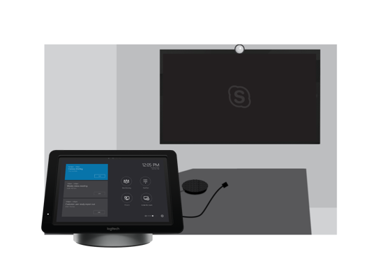

# Skype ルームの計画システム v2Plan Skype Room Systems v2 

この記事では、計画、配信、および全体的な会議と会議室の戦略の一環として Skype ルーム システム バージョン 2 (v2) を運用するエンド ・ ツー ・ エンドのアプローチを紹介します。This article introduces an end-to-end approach to planning, delivering, and operating Skype Room Systems version 2 (v2) as part of your overall meeting and conference room strategy.

いただける方法をお勧めするには、サポート技術情報へのリンクをする必要がある重要な決定事項を網羅する以下の情報を計画します。You’ll find planning information below covering the recommended approach and key decisions that you need to make, with links to supporting technical information. 既に完全に展開している場合でも、計画、展開、および管理のセクションを確認することをお勧めします。We recommend that you review the Plan, Deploy, and Manage sections even if you’re already fully deployed.

## ルーム システム v2 の Skype の概要Overview of Skype Room Systems v2

Skype ルーム システム v2 では、ビジネス会議エクスペリエンスを HD ビデオ、オーディオ、およびコンテンツの共有、あらゆる規模のミーティングを大会議室に小さな huddle の領域からの完全な Skype を提供します。Skype Room Systems v2 provides a complete Skype for Business meeting experience that brings HD video, audio, and content sharing to meetings of all sizes, from small huddle areas to large conference rooms.

![コンソール、マイク、および会議室の壁にマウントされている画面が大きいが、Skype ルーム システム v2 の使用例のセットアップの要素を示しています]。(../../media/room-systems-image1.png "コンソール、マイク、および会議室の壁にマウントされている画面が大きいが、Skype ルーム システム v2 の使用例のセットアップの要素を示しています")。

[Skype ルーム システム v2 のヘルプ](https://support.office.com/article/Skype-Room-Systems-version-2-help-e667f40e-5aab-40c1-bd68-611fe0002ba2)は、Skype ルーム システム v2 とビジネスを展開するため、Skype の一部として値を追加する方法の詳細を確認するのには優れたリソースです。[Skype Room Systems v2 help](https://support.office.com/article/Skype-Room-Systems-version-2-help-e667f40e-5aab-40c1-bd68-611fe0002ba2) is a great resource to find out more about Skype Room Systems v2 and how it can add value as part of your Skype for Business deployment. さらに、この[概要ビデオ](https://youtu.be/tNey5KZVCl0)の視聴をお勧めします。In addition, we recommend watching this [overview video](https://youtu.be/tNey5KZVCl0). 

## Skype ルーム システム v2 コンポーネントSkype Room Systems v2 components 

Skype ルーム システム v2 には、優れたユーザー エクスペリエンスを実現するのには次の主要コンポーネントが含まれています。Skype Room Systems v2 includes the following key components to deliver a great user experience:

-   タッチ スクリーンのコントロール パネルTouchscreen control panel
-   計算Compute
-   Skype ルーム システム v2 アプリケーションSkype Room Systems v2 application
-   ドッキング ステーションとエクステンダーDock/extender
-   周辺機器のデバイス (カメラ、マイク、スピーカー)Peripheral devices (camera, microphone, speaker)
-   外部画面 (2 つまで)External screens (maximum of two)
-   HDMI 入力HDMI input

プレインストール ・ バンドルとして、多くのベンダーからこれらのコンポーネントを調達することができます。 またはサポートされているコンポーネントを個別に購入するには、次の[要件は、この資料に記載されている](requirements.md)です。You can procure these components as preinstalled bundles from a number of vendors, or you can purchase the supported components individually by following the [requirements documented in this article](requirements.md). 

Surface Pro/ドッキング ステーションの組み合わせだけでなくもタッチ スクリーンのコントロール パネルで Skype ルーム システム v2 を購入、計算、ドッキング、または主な周辺機器を統合します。In addition to the Surface Pro/dock combination, you can also purchase Skype Room Systems v2 with the touchscreen control panel, compute, dock, and key peripheral devices integrated. 

通常、バンドル、統合された単位含まれてプレインストールされているソフトウェアは、Surface Pro のシステムを個別にサポートされているコンポーネントを購入する場合、ソフトウェアをインストールする必要があります。Typically, the bundles and integrated units include preinstalled software, whereas if you buy supported components individually for the Surface Pro systems, you’ll need to install the software. 手順については、[デバイス上のソフトウェアをインストールする方法には、この資料](../../deploy/deploy-clients/room-systems-scale.md)を参照してください。For instructions, see [this article about installing software on devices](../../deploy/deploy-clients/room-systems-scale.md). 

ビジネス online では、Skype または Skype ビジネスのハイブリッドまたは設置型展開の場合、Skype ルーム システム v2 を展開できます。You can deploy Skype Room Systems v2 with Skype for Business Online, or Skype for Business hybrid or on-premises deployments. 間もなくに非常にマイクロソフトのチームのサポートをします。Microsoft Teams support is coming very soon.

|    |     |
|-----------|------------|
|  意思決定ポイントDecision points|<ul><li>組織内で Skype ルーム システム v2 を展開するか。Will you deploy Skype Room Systems v2 in your organization? </li><li>Skype ルーム システム v2 システムはどのように調達する、バンドルされている個別のコンポーネントとして、または統合された単位としてでしょうか。How will you procure your Skype Room Systems v2 systems—bundled, as separate components, or as an integrated unit?</li></ul> |
|  次のステップNext steps | <ul><li>展開全体にわたって、主要な活動に着手するときはユーザーを識別します。Identify who will undertake the key activities throughout your deployment.</li><li>(して設定しようとしています) の会議室を確認、Skype ルーム システム v2 を展開して部屋のサイズに適切である周辺機器を理解します。Review the meeting rooms you have (and plan to set up) to understand where you want to deploy Skype Room Systems v2 and the peripheral devices that would be appropriate for the room size.</li></ul> |

## 展開全体にわたって、主要な活動に着手するときはユーザーを識別します。Identify who will undertake the key activities throughout your deployment

展開を進めることを次に示す方法を使用し、組織の必要に応じて、トピックの中で提供されるサンプル出力をカスタマイズします。Use the approach illustrated below to guide you through your deployment, and customize the sample outputs provided throughout these articles as needed for your organization.

どのような会議のルームを理解することで始まりますが、どのような構想は最も効果的な将来的に選択して、移動、変更する必要がある機器の調達、サイトを構成して、サービスの展開を準備し、ユーザーの採用、およびオペレーションとメンテナンスの手順を開発します。Begin with understanding what conference rooms you have and envisioning what would work best for you in the future, then move through selecting and procuring the equipment you need, readying your sites, configuring and deploying your service, managing change and user adoption, and developing operations and maintenance procedures.

何が移動して何が最も効果的な構想を選択し、必要な機器、サイトの準備の調達を理解するのには、![開始の構成と変更し、ユーザーの導入を管理するサービスを展開し、操作とメンテナンスの手順を開発します]。何が移動して何が最も効果的な構想を選択し、必要な機器、サイトの準備の調達を理解するのには、(../../media/room-systems-image2.png "開始の構成と変更し、ユーザーの導入を管理するサービスを展開し、操作とメンテナンスの手順を開発します")。

いくつかのチーム間でこれらの活動を調整する必要があります。You might need to coordinate these activities across several teams. カバーする必要がありますの主な活動とも担当には、通常の展開とを使用する必要があるユーザーを決定するために、会議室システムを管理するための推奨事項の概要を提供しています。We provide a high-level view of the main activities that you should cover, and also suggestions for the teams who are typically involved in deploying and managing conference room systems, to help you decide who you need to work with.

| タスクTask                       | 処理を実行する可能性があります。Who might undertake the task           | 割り当てられています。Assigned to | このコンテンツへのリンクLinks to this content |
|----------------------------|----------------------------------------|-------------|-----------------------|
| 在庫ルームInventory rooms            | 設備/AV チームと IT プロジェクト チームFacilities / AV team / IT Project Team |             | [ルームのインベントリと機能の計画Room inventory and capability planning](#room-inventory-and-capability-planning)        |
| 計画機能Plan capabilities          | IT プロジェクト チームIT Project Team                        |             | [ルームのインベントリと機能の計画Room inventory and capability planning](#room-inventory-and-capability-planning)                       |
| デバイスの選択Device selection           | IT プロジェクト チームとチームの AVIT Project Team / AV Team              |             | [デバイスの選択Device selection](#device-selection)                      |
| 調達Procurement                | IT プロジェクト チームとチームの AVIT Project Team / AV Team              |             | [調達Procurement](#procurement)                      |
| サイトの準備Site readiness             | 設備/AV チームと IT プロジェクト チームFacilities / AV team / IT Project Team |             | [サイトの準備Site readiness](../../deploy/deploy-clients/room-systems-v2.md#site-readiness)                      |
| サービスの準備状況Service readiness          | IT プロジェクト チームIT Project Team                        |             | [サービスの準備Service readiness](../../deploy/deploy-clients/room-systems-v2.md#service-readiness)                      |
| 構成Configuration              | IT プロジェクト チームIT Project Team                        |             | [構成と展開Configuration and deployment](../../deploy/deploy-clients/room-systems-v2.md#configuration-and-deployment)                      |
| 展開Deployment                 | 設備/AV チームと IT プロジェクト チームFacilities / AV team / IT Project Team |             | [展開のチェックリストDeployment checklist](../../deploy/deploy-clients/console.md#skype-room-systems-v2-deployment-checklist)                      |
| 導入Adoption                   | 設備/AV チームと IT プロジェクト チームFacilities / AV team / IT Project Team |             | [採用Adoption](#plan-for-adoption-and-change-management)                      |
| メンテナンスと運用Maintenance and operations | AV チームと IT プロジェクト チームAV team / IT Project Team              |             | [管理の概要Management overview](../../manage/skype-room-systems-v2/skype-room-systems-v2.md)                      |

## ルームのインベントリと機能の計画Room inventory and capability planning

最初の手順は、組織の既存の会議とその環境、部屋のサイズ、レイアウト、および目的を理解しておくとするなど、将来的にスコープの各部屋より豊富な機能を識別するのには、会議室の一覧を作成するのにはルームでは、共同作業機能を有効にするが。The first step is to inventory your organization’s existing meeting and conference rooms to understand their environment, room size, layout, and purpose, and to identify the capabilities you want each room in scope to have in the future such as which richer collaboration capabilities will be enabled in the room. 

各既存の部屋に装置および機能の一覧を作成したら、デバイスの選択が豊富な会議ソリューションを作成することを計画、そのルームの要件に渡します。After you create an inventory of the equipment and capabilities in each existing room, your requirements for that room feed into your device selection planning to create a rich conferencing solution. モダリティ (オーディオ、ビデオ) の各部屋に必要な: 部屋のサイズと目的だけでなく、各部屋に最適なソリューションの判断に重要な役割を果たすすべて。The modalities (audio, video) needed for each room—in addition to room size and purpose—all play an important role in deciding which solution is most appropriate for each room. 

証拠開示の一環として、それはの部屋の音響効果とレイアウトを検討するキーです。As part of your discovery, it’s key to consider room acoustics and layout. たとえば、部屋に椅子がカメラのビューをブロックしないことを確認します。For example, check that the chairs in the room won’t block the camera view. ルームが過剰なエコーやノイズの空調がないことと、画面と Skype ルーム システム v2 のための十分な電源が含まれていることを確認します。Verify that the room doesn’t have excessive echo or noisy air conditioning, and that it does have sufficient power for the screens and Skype Room Systems v2. オーディオ ・ ビジュアル (AV) チームやパートナーができることについてアドバイスを考慮すべき多くの要因があります。There are many factors to consider that your audio-visual (AV) team or partner will be able to advise on. 

|    |     |
|-----------|------------|
|   意思決定ポイントDecision points|<ul><li>部屋は、この配置のスコープ内にあるでしょうか。Which rooms are in scope for this deployment?</li><li>どのサイトを展開するためのスコープにありますか。Which sites are in scope for your deployment?</li><li>ミーティングを実施したが、在庫が室でしょうか。Who will undertake the meeting rooms inventory?</li></ul> |
|  次のステップNext steps|<ul><li>スコープ内で 2 つの部屋を確認し、それらの Skype ルーム システム v2 の構成を定義します。Review the rooms in scope, and define Skype Room Systems v2 configurations for them.</li></ul>|

_サンプル/会議室の在庫__Sample meeting/conference room inventory_

| **サイト****Site**  | **ルーム名****Room name** | **ルームのタイプ****Room type** | **人の数****Number of people**  | **スコープでしょうか。****In scope?** | **現在のルーム機能****Current room capabilities**       | **将来の部屋の機能****Future room capabilities**                             |
|-----------|---------------|---------------|-----------------------|--------------|-------------------------------------|----------------------------------------------------------|
| ロンドン本社London HQ | CurieCurie         | 中Medium        | 6&ndash;126&ndash;12                  | ありYes          | スピーカー フォンSpeakerphone                        | 1] 画面で、オーディオおよびビデオのプレゼンテーションと1 screen, audio and video plus presentation PSTN のアクセスPSTN Access |
| シドニー本社Sydney HQ | 丘Hill          | 大規模Large         | 12&ndash;1612&ndash;16                 | ありYes          | レガシー AV ユニット、1 画面とカメラLegacy AV unit, 1 screen and camera | オーディオおよびビデオのプレゼンテーションに加えて、2 つの画面2 screens, audio and video plus presentation PSTN のアクセスPSTN Access |

**Pro ヒント**– のインベントリを作成するのには多くのサイトがある場合、ダウンロードし[サイトの展開と移行のプランニング、サイトのアンケート](https://myadvisor.fasttrack.microsoft.com/CloudVoice/Downloads?SelectedIDs=5_1_0_15)を使用するします可能性があります。**Pro Tip** – If you have many sites to inventory, you might want to download and use the [Site Rollout and Migration Planning - Site Questionnaire](https://myadvisor.fasttrack.microsoft.com/CloudVoice/Downloads?SelectedIDs=5_1_0_15).

## デバイスの選択Device selection 

ルームの将来の機能に基づいて、各部屋の中で最適などの Skype ルーム システム v2 ソリューションを評価します。Evaluate which Skype Room Systems v2 solution is the most suitable for each room based on the future capabilities you want for the room. どの AV 周辺機器は、部屋のサイズとレイアウトに応じて、最適な幅を決定します。Decide which AV peripheral devices are the best fit, depending on room size and layout. 

ルームのタイプとサイズによってシステムと周辺機器の種類については、 [Skype ルーム システム v2 の要件](requirements.md)の資料を参照してください。For guidance for the type of system and peripheral devices by room type and size, see the [Skype Room Systems v2 requirements](requirements.md) article. 

Skype ルーム システム v2 と 1 つの部屋タイプでは、サポートされている周辺機器の構成を定義する要件の資料に記載されている情報を使用して、展開のテンプレートとして使用するこの仕入先に基づいています。Based on the vendor you prefer, use the information provided in the requirements article to define your Skype Room Systems v2 and supported peripheral device configuration per room type, and use this as a template for your deployment. 

**Pro ヒント**: 部屋の種類によっては、展開には適用できない場合があります。**Pro Tip** – Some room types might not be applicable for your deployment.

|    |     |
|-----------|------------|
|   意思決定ポイントDecision points|<ul><li>在庫から、配置のスコープ内の部屋の種類であるか。From your inventory, which types of rooms are in scope for your deployment?</li><li>ルームの種類ごとにシステムを展開するか。Which systems will you deploy for each room type?</li></ul>|
|  次のステップNext steps|<ul><li>選択したシステムの運用上キーのマテリアルを収集し、調達チームの協力を開始します。Start to gather key operational material for your chosen systems, and engage your procurement team.</li></ul>|

_組織の Skype ルーム システム v2 導入テンプレートのサンプル__Sample Skype Room Systems v2 deployment template for your organization_

| **ルームのタイプとサイズ****Room type/size** | **人の数****Number of people**  | **Skype ルーム システム v2 システム****Skype Room Systems v2 system** | **周辺機器****Peripheral devices**  | **実****Display(s)** |
|----------------------|-----------------------|----------------------------------|-------------------------|-----------------|
| フォーカス 10' 9'、Focus 10' by 9'      | 2&ndash;42&ndash;4                   |                                  |                         |                 |
| 小さい 16 ' で 16'Small 16' by 16'     | 4&ndash;64&ndash;6                   |                                  |                         |                 |
| 中 18' 20' でMedium 18' by 20'    | 6&ndash;126&ndash;12                  |                                  |                         |                 |
| 大きな 15 ' 32' でLarge 15' by 32'     | 12&ndash;1612&ndash;16                 |                                  |                         |                 |

**Pro のヒント:** これで、選択した Skype ルーム システム v2 ソリューションについての情報の収集を開始する絶好の機会です。**Pro Tip –** Now is a great time to start gathering information about the Skype Room Systems v2 solution you’ve chosen. 展開に関連する情報をキャプチャするのにはデザイン テンプレートの完了について説明するのには、ベンダーを使用することをお勧めします。MyAdvisor からの[この便利なテンプレートをダウンロードする](https://myadvisor.fasttrack.microsoft.com/CloudVoice/Downloads?SelectedIDs=4_4_0_11)ことができます。We recommend that you work with your vendor to discuss completing the design template to capture information that will be relevant to your deployment; you can [download this handy template](https://myadvisor.fasttrack.microsoft.com/CloudVoice/Downloads?SelectedIDs=4_4_0_11) from MyAdvisor. 

## 調達Procurement 

バンドルまたはデバイスのパートナーを使用して統合ソリューションで選択したシステムを調達することができます。You can procure your chosen system as a bundle or an integrated solution via device partners. パートナー デバイスのドッキング ステーションを取得し、Surface Pro デバイスと既存の周辺機器の AV_はサポート_を使用して Skype ルーム システム v2 ソリューションの準備もできます。You can also acquire a partner device dock and prepare your own Skype Room Systems v2 solution by using a Surface Pro device and existing, _supported_ AV peripheral devices. 

多くの[要件の資料](requirements.md)に記載されているパートナーからの Skype ルーム システム v2 を取得できます。You can acquire Skype Room Systems v2 from a number of partners who are listed in the [requirements article](requirements.md). これらのソリューションおよび調達のオプションの詳細については、パートナーの web サイトを参照してください。Please visit the partners’ websites to learn more about these solutions and procurement options. 

お使いの展開の規模とアプローチでは、Skype ルーム システムのバージョン 2 し、初期構成および割り当ての中央の場所に出荷される周辺機器のデバイスをサポートします。Depending on your deployment scale and approach, you might decide to have the Skype Room Systems v2 and supported peripheral devices shipped to a central location for initial configuration and assignment. 多くのサイト間で段階的に公開するのに有効なアプローチがあります。This might be a good approach for a staged rollout across many sites. または、サイトに直接バンドルを出荷することもできます。Or, you might choose to ship the bundles directly to your sites. 

|    |     |
|-----------|------------|
|   意思決定ポイントDecision points|<ul><li>サイトに直接、またはステージング サイトへのコンポーネントを出荷するでしょうか。Will you ship the components directly to a site or to a staging facility?</li><li>誰が管理するステージング機能 (1 つを使用する場合) か。Who will manage the staging facility (if you decide to use one)?</li></ul>|
|  次のステップNext steps|<ul><li>操作を計画します。Plan for operations.</li><li>導入を計画し、管理を変更します。Plan for adoption and change management.</li></ul>|

## 操作のための計画Plan for operations 

組織は必要があります、継続的にし、展開の初期段階でこれらのタスクに着手するときに同意するキーの監視、管理、および管理タスクを実行します。Your organization must execute monitoring, administration, and management tasks on an ongoing basis, and it’s key to agree who will undertake these tasks early in your deployment. 

AV チームや、会議室とデバイスを管理しているパートナーは、多くの組織があります。Many organizations have an AV team or partner who manages their conference rooms and devices. このチームは、パフォーマンスを監視し、ソフトウェア更新プログラムおよび修正プログラムの展開に今後 Skype ルーム システム v2 デバイスの管理人が同意したものと異なる必要があります。This team should be involved in agreeing who will manage the Skype Room Systems v2 devices going forward to monitor performance, and deploy software updates and hotfixes. 

ヘルプデスク キュー、Skype ルーム システムの v2֪ に関連する呼び出しをルーティングし、提供しますヘルプデスク チーム、向上させるために、よく寄せられる質問は、Skype ルーム システム v2 とトラブルシューティング手順を実行するキーを使用する方法を理解することを検討してください。Consider which helpdesk queue you’ll route Skype Room Systems v2֪–related calls to, and provide an FAQ to the helpdesk team so they can better understand how to use Skype Room Systems v2 and the key troubleshooting steps they can take. このよく寄せられる質問の開始点は、[ユーザーがヘルプ](https://support.office.com/article/Skype-Room-Systems-version-2-help-e667f40e-5aab-40c1-bd68-611fe0002ba2)し、の[既知の問題点のリスト](../../manage/skype-room-systems-v2/known-issues.md)です。A good starting point for this FAQ is the [user help](https://support.office.com/article/Skype-Room-Systems-version-2-help-e667f40e-5aab-40c1-bd68-611fe0002ba2) and the [known issues list](../../manage/skype-room-systems-v2/known-issues.md).

|    |     |
|-----------|------------|
|   意思決定ポイントDecision points|<ul><li>Skype ルーム システム v2 は誰が管理を決定します。Decide who will manage Skype Room Systems v2.</li><li>Skype ルーム システム関連の呼び出しをルーティングするヘルプデスク キューを決定します。Decide which helpdesk queue to route Skype Room Systems–related calls to.</li></ul>|
|  次のステップNext steps|<ul><li>アカウントをホストする準備をします。Prepare to host accounts. </li></ul>|

## 導入を計画および管理の変更Plan for adoption and change management

Skype ルーム システム v2 のシステムでは、ユーザーに新しい機能を紹介します。Skype Room Systems v2 systems introduce new capabilities to your users. ことを認識、ユーザーの変更になり、キャンペーン、ユーザーが新しいシステムの利点を識別することを確認する必要があり、トーキング ポイントの潜在顧客を使用するチームと話し合うことが重要です。It’s important that you recognize that this will be a change for your users, and you should ensure your campaign identifies the benefits the new system will have for your users and the key talking points leads can use to discuss with their teams. 

新機能を他のユーザーに通知するには、各サイトの削除 show-and-tell イベントとポスターのスケジュールを検討してください。Consider scheduling show-and-tell events and poster drops at each site to inform your users of the new capabilities. ルームで作成することも可能性があります」のクイック スタート ガイドです」。You might also create in-room “quick start guides.” 把握する上、デバイスの使用を開始し、他のユーザーを支援できる各サイトでの会議のチャンピオンを検索することを検討してください。Consider finding a meetings champion on each site who can help others get up to speed and start using the devices.
