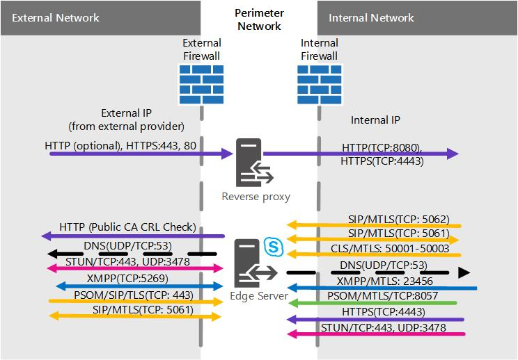

# Skype for Business Server のエッジサーバーのシナリオEdge Server scenarios in Skype for Business Server
 
**概要:** これらのシナリオを確認して、Skype for Business Server で Edge Server のトポロジを計画するのに役立ちます。**Summary:** Review these scenarios to help you plan your Edge Server topology in Skype for Business Server.
  
実装する Skype for Business Server Edge Server のトポロジを視覚化して決定するためのシナリオ図がいくつか用意されています。We have some scenarios diagrams to assist with visualizing and deciding on what Skype for Business Server Edge Server topology you want to implement. 適切な候補を選択すれば、対処する必要がある環境の要件を調査できます。Once you've picked a good candidate, you can go read up on the environmental requirements you'll need to address. 次に示す図はすべてのシナリオに適用されるため、最初に説明します。The following is applicable to any of the scenarios, so we're mentioning it first.
  
以下の図は例示のみを目的として示されている (つまり、サンプルの IPv4 および IPv6 データが含まれている) ため、実際の通信の流れではなく、可能なトラフィックの概要を表しています。ポートの詳細は、以下の各シナリオのポートの図でも確認できます。These figures, which are shown for example purposes only (and as such contains sample IPv4 and IPv6 data), don't represent the actual communication flow, but rather a high-level view of your possible traffic. Port details can also be seen in the Port diagrams for each scenario below.
  
図に示す .com は外部インターフェイス用で、.net は内部インターフェイス用ですが、これらもサンプル情報です。もちろん、最終的なエッジの計画を策定する際には、独自のエントリはまったく異なるものである可能性があります。The diagrams show .com for the external interface and .net for the internal, which is also sample material; of course your own entries may be quite different when you're putting together your own final Edge plan.
  
いずれの図面にもディレクター (オプションのコンポーネント) は含まれていませんが、別の方法で確認できます (他の計画トピックで説明しています)。We don't include the Director (which is an optional component) in any of the diagrams, but you can read about that separately (it's mentioned in other Planning topics).
  
上で説明したように、サンプルの IPv6 データがダイアグラムにあります。As noted above, there is sample IPv6 data in the diagrams. [Skype For Business server の Edge server 展開の計画](edge-server-deployments.md)に含まれているドキュメントのほとんどは IPv4 を参照していますが、IPv6 を使用する場合は、確実にサポートされます。Most of the documentation in [Plan for Edge Server deployments in Skype for Business Server](edge-server-deployments.md) will refer to IPv4, but you are certainly supported if you want to use IPv6. IPv6 アドレスが割り当てられたアドレススペースに必要になることに注意してください。 IPv4 Ip と同様に、内部および外部のアドレス管理機能が必要になります。Note that you'll need IPv6 addresses in your assigned address space, and they'll need to work with internal and external addressing, as with IPv4 IPs. Windows のおかげで、デュアルスタック機能が採用されました。これは、IPv4 と IPv6 用の独立した個別のネットワークスタックです。You can, thanks to Windows, employ the dual stack feature, which is a separate and distinct network stack for IPv4 and IPv6. 必要に応じて、IPv4 アドレスと IPv6 アドレスを同時に割り当てることができます。This will, if you need, allow you to assign IPv4 and IPv6 addresses concurrently.
  
NAT64 (IPv6 から IPv4) と NAT66 (ipv6 から IPv6) を許可する NAT デバイスはありますが、これは Skype for Business Server で使用する場合に有効です。There are NAT devices that allow for NAT64 (IPv6 to IPv4) and NAT66 (IPv6 to IPv6)), and this is valid for use with Skype for Business Server.
  
> [!IMPORTANT]
> 通話受付管理 (CAC) を使用している場合、CAC が機能するためには、内部インターフェイスで IPv4 を使用する必要があります。If you're using Call Admission Control (CAC) you do have to use IPv4 on the internal interface for it to work. 
  
## プライベート IP アドレスと NAT を備えた単一の統合 Skype for business Server エッジサーバーSingle consolidated Skype for Business Server Edge Server with private IP addresses and NAT

このシナリオでは、高可用性のオプションがありません。これは、ハードウェアへの出費が少なく、よりシンプルな展開を使用することを意味します。高可用性が必須である場合は、下記の拡張統合のシナリオを参照してください。With this scenario, there is no option for high availability. This will mean you spend less on hardware and have a simpler deployment. If high availability is a must, check out the Scaled consolidated scenarios below.
  

  
### ポートの図Port diagram

また、単一の統合エッジサーバー用のポートの図も用意されています。We also have a diagram for ports for single consolidated Edge Servers.
  

  
## パブリック IP アドレスを備えた単一の統合 Skype for business Server エッジサーバーSingle consolidated Skype for Business Server Edge Server with public IP addresses

このシナリオでは、高可用性のオプションがありません。これは、ハードウェアへの出費が少なく、よりシンプルな展開を使用することを意味します。高可用性が必須である場合は、下記の拡張統合のシナリオを参照してください。With this scenario, there is no option for high availability. This will mean you spend less on hardware and have a simpler deployment. If high availability is a must, check out the Scaled consolidated scenarios below.
  

  
### ポートの図Port diagram

また、単一の統合エッジサーバー用のポートの図も用意されています。We also have a diagram for ports for single consolidated Edge Servers.
  

  
## 拡張された Skype for Business Server Edge プール、DNS の負荷分散、プライベート IP アドレスと NATScaled consolidated Skype for Business Server Edge pool, with DNS load balancing, and private IP addresses and NAT

このシナリオではエッジ展開で高可用性を実現でき、スケーラビリティとフェールオーバー サポートのメリットが得られます。With this scenario, you are able to have high availability in your Edge deployment, which gives you the advantages of scalability and failover support.
  

  
### ポートの図Port diagram

また、統合されたエッジプールを拡張して、DNS の負荷分散を行うこともできます。We also have a diagram for scaled consolidated Edge pools with DNS load balancing.
  

  
## 拡張された Skype for Business Server Edge プール、DNS の負荷分散およびパブリック IP アドレスScaled consolidated Skype for Business Server Edge pool, with DNS load balancing and public IP addresses

このシナリオではエッジ展開で高可用性を実現でき、スケーラビリティとフェールオーバー サポートのメリットが得られます。With this scenario, you are able to have high availability in your Edge deployment, which gives you the advantages of scalability and failover support.
  

  
### ポートの図Port diagram

また、統合されたエッジプールを拡張して、DNS の負荷分散を行うこともできます。We also have a diagram for scaled consolidated Edge pools with DNS load balancing.
  

  
## 統合された Skype for Business Server Edge プール、ハードウェア負荷分散Scaled consolidated Skype for Business Server Edge pool, with hardware load balancing

このシナリオではエッジ展開で高可用性を実現でき、スケーラビリティとフェールオーバー サポートのメリットが得られます。With this scenario, you are able to have high availability in your Edge deployment, which gives you the advantages of scalability and failover support.
  

 
