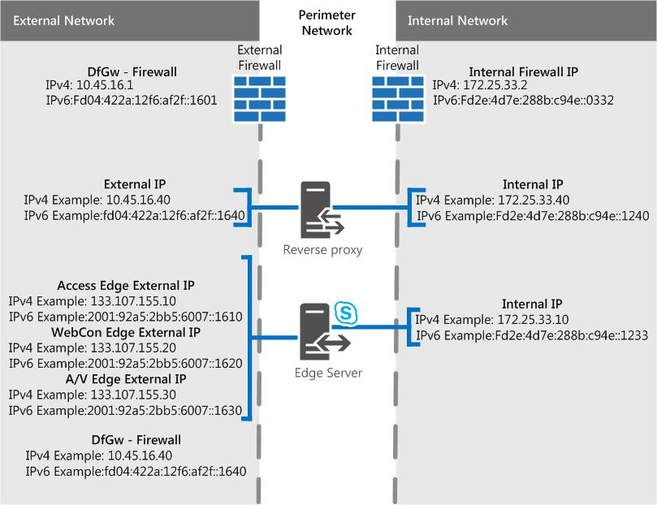

# Skype for Business Server のエッジ サーバーのシナリオEdge Server scenarios in Skype for Business Server
 
**概要:** これらのシナリオを確認して、Skype for Business Server でエッジ サーバー トポロジを計画します。**Summary:** Review these scenarios to help you plan your Edge Server topology in Skype for Business Server.
  
実装する Skype for Business Server エッジ サーバー トポロジの視覚化と決定に役立つシナリオ図がいくつか示されています。We have some scenarios diagrams to assist with visualizing and deciding on what Skype for Business Server Edge Server topology you want to implement. 有力候補を選んだら、対処する必要がある環境要件を確認できます。Once you've picked a good candidate, you can go read up on the environmental requirements you'll need to address. 以下は、すべてのシナリオに適用されます。そのため、最初に説明します。The following is applicable to any of the scenarios, so we're mentioning it first.
  
これらの図は、例としてのみ示されている (そのため、サンプルの IPv4 および IPv6 データが含まれている) ので、実際の通信フローではなく、考えられるトラフィックのハイレベルなビューを表しています。These figures, which are shown for example purposes only (and as such contains sample IPv4 and IPv6 data), don't represent the actual communication flow, but rather a high-level view of your possible traffic. ポートの詳細は、以下の各シナリオのポート図でも確認できます。Port details can also be seen in the Port diagrams for each scenario below.
  
図は、外部インターフェイスの .com と内部の .net を示しています。これはサンプル マテリアルです。もちろん、独自の最終的なエッジ プランをまとめる場合は、独自のエントリがかなり異なる場合があります。The diagrams show .com for the external interface and .net for the internal, which is also sample material; of course your own entries may be quite different when you're putting together your own final Edge plan.
  
どの図にもディレクター (オプションのコンポーネント) は含めされていませんが、その詳細については別途お読みください (他の「計画」のトピックに記載されています)。We don't include the Director (which is an optional component) in any of the diagrams, but you can read about that separately (it's mentioned in other Planning topics).
  
上で説明したように、図にはサンプル IPv6 データがあります。As noted above, there is sample IPv6 data in the diagrams. [Skype for Business Server](edge-server-deployments.md)でのエッジ サーバー展開の計画に関するドキュメントの大部分は IPv4 を参照しますが、IPv6 を使用する場合は確実にサポートされます。Most of the documentation in [Plan for Edge Server deployments in Skype for Business Server](edge-server-deployments.md) will refer to IPv4, but you are certainly supported if you want to use IPv6. 割り当てられたアドレス スペースには IPv6 アドレスが必要であり、IPv4 IP と同様に、内部および外部のアドレス指定で動作する必要があります。Note that you'll need IPv6 addresses in your assigned address space, and they'll need to work with internal and external addressing, as with IPv4 IPs. Windows により、デュアル スタック機能を使用できます。デュアル スタック機能は、IPv4 と IPv6 用の独立した個別のネットワーク スタックです。You can, thanks to Windows, employ the dual stack feature, which is a separate and distinct network stack for IPv4 and IPv6. これにより、必要に応じて、IPv4 アドレスと IPv6 アドレスを同時に割り当てできます。This will, if you need, allow you to assign IPv4 and IPv6 addresses concurrently.
  
NAT64 (IPv6 ~ IPv4) と NAT66 (IPv6 ~ IPv6) を許可する NAT デバイスがあります。これは Skype for Business Server で使用する場合に有効です。There are NAT devices that allow for NAT64 (IPv6 to IPv4) and NAT66 (IPv6 to IPv6)), and this is valid for use with Skype for Business Server.
  
> [!IMPORTANT]
> 通話受付管理 (CAC) を使用している場合は、内部インターフェイスで IPv4 を使用して動作する必要があります。If you're using Call Admission Control (CAC) you do have to use IPv4 on the internal interface for it to work. 
  
## プライベート IP アドレスと NAT を使用する単一統合 Skype for Business Server エッジ サーバーSingle consolidated Skype for Business Server Edge Server with private IP addresses and NAT

このシナリオでは、高可用性のオプションはありません。With this scenario, there is no option for high availability. つまり、ハードウェアの使用が少なく、展開が簡単になります。This will mean you spend less on hardware and have a simpler deployment. 高可用性が必要な場合は、以下の拡張統合シナリオを確認してください。If high availability is a must, check out the Scaled consolidated scenarios below.
  

  
### ポート図Port diagram

また、単一統合エッジ サーバーのポートの図も示します。We also have a diagram for ports for single consolidated Edge Servers.
  

  
## パブリック IP アドレスを使用する単一統合 Skype for Business Server エッジ サーバーSingle consolidated Skype for Business Server Edge Server with public IP addresses

このシナリオでは、高可用性のオプションはありません。With this scenario, there is no option for high availability. つまり、ハードウェアの使用が少なく、展開が簡単になります。This will mean you spend less on hardware and have a simpler deployment. 高可用性が必要な場合は、以下の拡張統合シナリオを確認してください。If high availability is a must, check out the Scaled consolidated scenarios below.
  

  
### ポート図Port diagram

また、単一統合エッジ サーバーのポートの図も示します。We also have a diagram for ports for single consolidated Edge Servers.
  

  
## 拡張統合 Skype for Business Server エッジ プール (DNS 負荷分散、プライベート IP アドレスと NAT を使用)Scaled consolidated Skype for Business Server Edge pool, with DNS load balancing, and private IP addresses and NAT

このシナリオでは、エッジ展開で高可用性を実現できます。これにより、スケーラビリティとフェールオーバーのサポートの利点が得されます。With this scenario, you are able to have high availability in your Edge deployment, which gives you the advantages of scalability and failover support.
  

  
### ポート図Port diagram

また、DNS 負荷分散を使用した拡張統合エッジ プールの図も示します。We also have a diagram for scaled consolidated Edge pools with DNS load balancing.
  

  
## 拡張統合 Skype for Business Server エッジ プール (DNS 負荷分散とパブリック IP アドレスを使用)Scaled consolidated Skype for Business Server Edge pool, with DNS load balancing and public IP addresses

このシナリオでは、エッジ展開で高可用性を実現できます。これにより、スケーラビリティとフェールオーバーのサポートの利点が得されます。With this scenario, you are able to have high availability in your Edge deployment, which gives you the advantages of scalability and failover support.
  

  
### ポート図Port diagram

また、DNS 負荷分散を使用した拡張統合エッジ プールの図も示します。We also have a diagram for scaled consolidated Edge pools with DNS load balancing.
  

  
## 拡張統合 Skype for Business Server エッジ プール (ハードウェア負荷分散を使用)Scaled consolidated Skype for Business Server Edge pool, with hardware load balancing

このシナリオでは、エッジ展開で高可用性を実現できます。これにより、スケーラビリティとフェールオーバーのサポートの利点が得されます。With this scenario, you are able to have high availability in your Edge deployment, which gives you the advantages of scalability and failover support.
  

 
