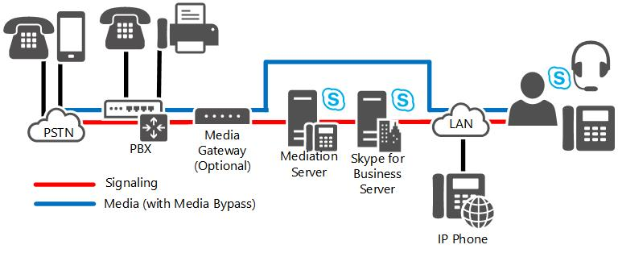

# Skype for Business Server での直接 SIP 接続Direct SIP connections in Skype for Business Server

直接 SIP 接続は、Skype for Business Server と PSTN ゲートウェイと IP-PBX の両方の間でサポートエンタープライズ VoIP。Direct SIP connections are supported between Skype for Business Server and both PSTN gateways and IP-PBX in Enterprise Voice.

直接 SIP 接続を使用して、Skype for Business Server を次のどちらかに接続できます。You can use direct SIP connections to connect Skype for Business Server to either of the following:

- IP-PBXAn IP-PBX

- PSTN ゲートウェイA PSTN gateway

直接 SIP 接続を実装する場合、基本的に SIP トランクの実装と同じ展開ステップを実行します。To implement a direct SIP connection, you follow essentially the same deployment steps as you would to implement a SIP trunk. どちらの場合も、仲介サーバーの外部インターフェイスを使用して接続を実装します。In both cases, you implement the connection by using the external interface of a Mediation Server. 唯一異なるのは、SIP トランクを外部エンティティ (ITSP ゲートウェイなど) に接続し、直接 SIP 接続をローカル ネットワーク内の内部エンティティ (IP-PBX や公衆交換電話網 (PSTN) ゲートウェイなど) に接続するという点です。The only difference is that you connect SIP trunks to an external entity, such as an ITSP gateway, and you connect direct SIP connections to an internal entity within your local network, such as an IP-PBX or a public switched telephone network (PSTN) gateway.

## 直接 SIP 展開オプションDirect SIP deployment options

### Skype for Business Server Stand-AloneSkype for Business Server Stand-Alone

組織でこのセクションで説明する展開のいずれかを使用している場合は、Skype for Business Server を組織の一部またはすべての唯一のテレフォニー ソリューションとして使用できます。If your organization uses one of the deployments described in this section, you can use Skype for Business Server as the sole telephony solution for part or all of an organization. このセクションでは、以下の展開について詳しく説明します。This section describes the following deployments in detail:

- **増分展開:** このオプションは、既存のプライベート ブランチ 交換 (PBX) インフラストラクチャを使用し、組織内の小規模なグループまたはチームに エンタープライズ VoIP を段階的に導入する予定です。**Incremental deployment:** This option assumes that you have an existing private branch exchange (PBX) infrastructure and you intend to introduce Enterprise Voice incrementally to smaller groups or teams within your organization.

- **VoIP 専用** の展開: このオプションでは、従来のテレフォニー インフラストラクチャを持エンタープライズ VoIPサイトでの展開を検討している必要があります。**VoIP-only deployment:** this option assumes that you are considering deploying Enterprise Voice at a site that does not have a traditional telephony infrastructure.

#### 増分展開Incremental Deployment

段階的展開では、Skype for Business Server は個々のチームまたは部門の唯一のテレフォニー ソリューションですが、組織内の他のユーザーは PBX を引き続き使用します。In incremental deployment, Skype for Business Server is the sole telephony solution for individual teams or departments, while the rest of the users in an organization continue to use a PBX. この増分展開戦略は、制御されたパイロット プログラムを通じて IP テレフォニーを企業に導入する 1 つの方法を提供します。This incremental deployment strategy provides one way to introduce IP telephony into your enterprise through controlled pilot programs. Microsoft Unified Communications が最適な通信ニーズを持つワークグループは、エンタープライズ VoIP に移動され、他のユーザーは既存の PBX に残ります。Workgroups whose communication needs are best served by Microsoft Unified Communications are moved to Enterprise Voice, while other users remain on the existing PBX. 必要に応じて、追加のワークグループエンタープライズ VoIPに移行できます。Additional workgroups can be migrated to Enterprise Voice, as needed.

通信要件が共通で、集中管理に利用できるユーザー グループが明確に定義されている場合は、増分オプションをお勧めします。The incremental option is recommended if you have clearly defined user groups that have communication requirements in common and that lend themselves to centralized management. このオプションは、広範囲の地理的領域に広がるチームや部署がある場合にも有効です。長距離料金の節約は大きい場合があります。This option is also effective if you have teams or departments that are spread over wide geographic areas, where the savings in long-distance charges can be significant. 実際、このオプションは、メンバーが世界中に散在する可能性がある仮想チームを作成する場合に役立ちます。In fact, this option is useful for creating virtual teams whose members may be scattered across the globe. このようなチームは、ビジネス要件の変化に迅速に対応して作成、変更、または解除できます。You can create, modify, or disband such teams in rapid response to shifting business requirements.

次の図は、PBX の背後に展開するエンタープライズ VoIPトポロジを示しています。The following figure shows the generic topology for deployment of Enterprise Voice behind a PBX. これは、増分展開に推奨されるトポロジです。This is the recommended topology for incremental deployment.

**増分展開オプション****Incremental deployment option**

> [!NOTE]
> Skype for Business Server 展開を認定されたダイレクト SIP パートナーに接続する場合、仲介サーバーと PBX の間の公衆交換電話網 (PSTN) ゲートウェイは必要ありません。If you are connecting your Skype for Business Server deployment to a certified Direct SIP partner, a public switched telephone network (PSTN) gateway between the Mediation Server and the PBX is not required. 認定された Direct SIP パートナーの一覧については  [、「Microsoft Unified Communications Open Interoperability Program」を参照してください](../../../SfbPartnerCertification/lync-cert/qualified-ip-pbx-gateway.md)。For a list of certified Direct SIP partners, see the  [Microsoft Unified Communications Open Interoperability Program](../../../SfbPartnerCertification/lync-cert/qualified-ip-pbx-gateway.md).

> [!NOTE]
> この図に示すメディア パスには、メディア バイパスが有効になっています (推奨される構成)。The media path shown in this figure has media bypass enabled (the recommended configuration). メディア バイパスを無効にした場合、メディア パスは仲介サーバー経由でルーティングされます。If you opt to disable media bypass, the media path is routed through the Mediation Server.

このトポロジでは、選択した部署またはワークグループが組織に対してエンタープライズ VoIP。In this topology, selected departments or workgroups are enabled for Enterprise Voice. PSTN ゲートウェイは、ボイス オーバー インターネット プロトコル (VoIP) が有効なワークグループを PBX にリンクします。A PSTN gateway links the Voice over Internet Protocol (VoIP)-enabled workgroup to the PBX. リモート ワーカーを含むエンタープライズ VoIP有効になっているユーザーは、IP ネットワークを介して通信します。Users who are enabled for Enterprise Voice, including remote workers, communicate across the IP network. ユーザーが PSTN エンタープライズ VoIP、およびユーザーに対して有効になっていない同僚エンタープライズ VoIP呼び出しは、適切な PSTN ゲートウェイにルーティングされます。Calls by Enterprise Voice users to the PSTN and to coworkers who are not enabled for Enterprise Voice are routed to the appropriate PSTN gateway. PBX システムにまだ参加している同僚、または PSTN の発信者からの呼び出しは PSTN ゲートウェイにルーティングされ、通話はルーティングのために Skype for Business Server に転送されます。Calls from colleagues who are still on the PBX system, or from callers on the PSTN, are routed to the PSTN gateway, which forwards the calls to Skype for Business Server for routing.

相互運用性を確保するために、エンタープライズ VoIPを既存の PBX インフラストラクチャに接続するための 2 つの推奨構成があります。PBX の背後に エンタープライズ VoIP、PBX の前にエンタープライズ VoIPを追加します。There are two recommended configurations for connecting Enterprise Voice to an existing PBX infrastructure for interoperability: Enterprise Voice behind the PBX and Enterprise Voice in front of the PBX.

#### エンタープライズ VoIP PBX の背後にあるEnterprise Voice Behind the PBX

PBX エンタープライズ VoIP展開すると、PSTN からのすべての呼び出しが PBX に到着し、エンタープライズ VoIP ユーザーに PSTN ゲートウェイに通話をルーティングし、PBX ユーザーを PBX に呼び出します。When Enterprise Voice is deployed behind the PBX, all calls from the PSTN arrive at the PBX, which routes calls to Enterprise Voice users to a PSTN gateway, and calls to PBX users to the PBX.

#### エンタープライズ VoIP PBX の前面に表示されるEnterprise Voice in Front of the PBX

PBX のエンタープライズ VoIP展開すると、すべての通話が PSTN ゲートウェイに到着し、エンタープライズ VoIP ユーザーの通話を Skype for Business Server にルーティングし、PBX ユーザーを PBX に呼び出します。When Enterprise Voice is deployed in front of the PBX, all calls arrive at the PSTN gateway, which routes calls for Enterprise Voice users to Skype for Business Server and calls for PBX users to the PBX. ユーザーと PBX ユーザーの両方エンタープライズ VoIP PSTN への呼び出しは、IP ネットワークを使用して最もコスト効率の高い PSTN ゲートウェイにルーティングされます。Calls to the PSTN from both Enterprise Voice and PBX users are routed over the IP network to the most cost-efficient PSTN gateway. 次の表に、この構成の長所と短所を示します。The following table shows the advantages and disadvantages of this configuration.

**PBX の前面に展開するエンタープライズ VoIPの利点と欠点****Advantages and Disadvantages of Deploying Enterprise Voice in Front of PBX**

|**メリット****Advantages**|**欠点****Disadvantages**|
|:-----|:-----|
|PBX は、引き続きユーザーに対して有効になっていないエンタープライズ VoIP。PBX still serves users not enabled for Enterprise Voice.    |既存のゲートウェイは、必要な機能や容量をサポートしていない場合があります。Existing gateways may not support the features or capacity that you want.    |
|PBX は、以前のすべてのデバイスを処理します。PBX handles all earlier devices.    |ゲートウェイから PBX へのトランクと、ゲートウェイから仲介サーバーへのトランクが必要です。Requires a trunk from gateway to the PBX and from the gateway to the Mediation Server. サービス プロバイダーからより多くのトランクが必要な場合があります。You may need more trunks from the service provider.    |
|エンタープライズ VoIPユーザーは同じ電話番号を保持します。Enterprise Voice users keep the same phone numbers.    |   |

#### VoIP-Only展開VoIP-Only Deployment

エンタープライズ VoIPは、PBX 統合を心配したり、IP-PBX インフラストラクチャの実質的な展開および保守コストを発生させずに、フル機能の VoIP ソリューションを実装する機会を得て、既存のビジネス向け新しいビジネスと新しいオフィス サイトを提供します。Enterprise Voice provides new businesses, and also new office sites for existing businesses, with the opportunity to implement a full-featured VoIP solution without having to worry about PBX integration or incurring the substantial deployment and maintenance costs of an IP-PBX infrastructure. このソリューションは、オンサイト ワーカーとリモート ワーカーの両方をサポートします。This solution supports both on-site and remote workers.

この展開では、すべての呼び出しが IP ネットワークを使用してルーティングされます。In this deployment, all calls are routed over the IP network. PSTN への呼び出しは、適切な PSTN ゲートウェイにルーティングされます。Calls to the PSTN are routed to the appropriate PSTN gateway. Skype for Business または Lync Phone Edition はソフトフォンとして機能します。Skype for Business or Lync Phone Edition serves as a softphone. ユーザーが制御する PBX 電話がないので、リモート通話制御は使用でき、不要です。Remote call control is unavailable and unnecessary because there are no PBX phones for users to control. ボイス メールサービスと自動応答サービスは、オプションで Exchange ユニファイド メッセージング (UM) を展開して利用できます。Voice mail and auto-attendant services are available through the optional deployment of Exchange Unified Messaging (UM).

> [!NOTE]
> Skype for Business Server をサポートするために必要なネットワーク インフラストラクチャに加えて、VoIP 専用の展開では、FAX マシンとアナログ デバイスをサポートする小規模で修飾されたゲートウェイを使用できます。In addition to the network infrastructure that is required to support Skype for Business Server, a VoIP-only deployment can use a small, qualified gateway to support fax machines and analog devices.

次の図は、VoIP 専用展開の一般的なトポロジを示しています。The following figure shows a typical topology for a VoIP-only deployment.

**VoIP 専用展開オプション****VoIP-only deployment option**

> [!NOTE]
> この図に示すメディア パスには、メディア バイパスが有効になっています (推奨される構成)。The media path shown in this figure has media bypass enabled (the recommended configuration). メディア バイパスを無効にした場合、メディア パスは仲介サーバー経由でルーティングされます。If you opt to disable media bypass, the media path is routed through the Mediation Server.

## PSTN ゲートウェイの展開オプションPSTN Gateway deployment options

### PSTN ゲートウェイPSTN Gateways

公衆交換電話網 (PSTN) ゲートウェイは、直接または SIP トランクへの接続を介して、エンタープライズ VoIP インフラストラクチャと PSTN の間で信号とメディアを変換するサードパーティのハードウェア コンポーネントです。Public switched telephone network (PSTN) gateways are third-party hardware components that translate signaling and media between the Enterprise Voice infrastructure and the PSTN, either directly or through connection to SIP trunks. どちらのトポロジでも、ゲートウェイは PSTN を終了します。In either topology, the gateway terminates the PSTN. ゲートウェイは独自のサブネットで分離され、仲介サーバーを介してエンタープライズ ネットワークに接続されます。The gateway is isolated in its own subnet and is connected to the enterprise network through the Mediation Server.

複数のサイトを持つ企業は、通常、各サイトに 1 つ以上のゲートウェイを展開します。An enterprise with multiple sites would typically deploy one or more gateways at each site. ブランチ サイトは、ゲートウェイを介して PSTN に接続するか、単一ボックスにゲートウェイとサーバーを組み合わせた存続可能ブランチ アプライアンスを介して接続できます。Branch sites can connect to the PSTN either through a gateway, or through a Survivable Branch Appliance, which combines gateway and servers in a single box. ブランチ サイトでゲートウェイを使用する場合、WAN リンクが回復力がない限り、レジストラー サーバーと仲介サーバーの両方がサイトで必要になります。If branch sites use a gateway, both a Registrar and Mediation Server are required on site, unless the WAN link is resilient. フロント エンド サーバー上に 1 つ以上の仲介サーバーを展開すると、各サイトで 1 つ以上のゲートウェイの呼び出しをルーティングできます。One or more Mediation Servers, which are collocated on Front End Servers, can route calls for the one or more gateways at each site. サイトで必要なレジストラー、仲介サーバー、ゲートウェイを存続可能ブランチ アプライアンスとして展開することをお勧めします。We recommend that the Registrar, Mediation Server, and gateway required on site are deployed as a Survivable Branch Appliance.

PSTN ゲートウェイの数、サイズ、場所を決定することが、インフラストラクチャの計画時に行う必要がある最も重要でコストエンタープライズ VoIPです。Determining the number, size, and location of PSTN gateways is perhaps the most important and expensive decision you must make when planning your Enterprise Voice infrastructure.

考慮すべき主な質問を次に示します。Here are the main questions to consider. これらの質問に対する答えはすべて相互依存的である点に気を付けKeep in mind that the answers to these questions are all interdependent

- 必要な PSTN ゲートウェイの数How many PSTN gateways are needed? 答えは、ユーザーの数、予想される同時通話数 (トラフィック負荷)、およびサイトの数 (各サイトに 1 つが必要) によって異なります。The answer depends on the number of users, the anticipated number of simultaneous calls (traffic load), and the number of sites (each site needs one).

- ゲートウェイのサイズは何ですか?What size should the gateways be? 答えは、サイトのユーザー数とトラフィック負荷によって異なります。The answer depends on the number of users at the site and on the traffic load.

- ゲートウェイはどこに位置する必要がありますか?Where should the gateways be located? 答えは、トポロジの一部と、組織の地理的な分布に依存します。The answer depends in part on the topology and in part on the geographic distribution of your organization.

  ゲートウェイ トポロジ オプションも検討する必要があります (詳細については、このトピックの「ゲートウェイ トポロジ」を参照してください)。You should also consider your gateway topology options (for details, see Gateway Topologies later in this topic).

#### M:N トランクのサポートM:N Trunk Support

仲介サーバーは、インターネット テレフォニー サービス プロバイダーによって提供される複数のゲートウェイ、セッション ボーダー コントローラー (SPC)、または 2 つの組み合わせを介して通話をルーティングできます。The Mediation Servers can route calls through multiple gateways, Session Border Controllers (SBCs) provided by Internet telephony service providers, or a combination of the two. さらに、プール内の複数の仲介サーバーが複数のゲートウェイと対話できます。Additionally, multiple Mediation Servers in the pool can interact with multiple gateways. 仲介サーバーとゲートウェイの間で定義される論理ルートはトランクと呼ばれる。The logical route defined between a Mediation Server and gateway is called a trunk. 内部ユーザーが PSTN 通話を発信すると、フロントエンド プール上の送信ルーティング ロジックによって、その特定の呼び出しをルーティングするために使用できる可能性があるすべての組み合わせからルーティングするトランクが選択されます。When an internal user places a PSTN call, outbound routing logic on the Front End pool chooses which trunk to route over out of all possible combinations that may be available for routing that particular call. DNS 負荷分散では、プール内の特定の仲介サーバーに問題が発生して、呼び出しがゲートウェイに到達できない場合、その呼び出しはプール内の代替仲介サーバーに再試行されます。With DNS load balancing, if a call fails to reach a gateway due to an issue with a particular Mediation Server in the pool, the call will be retried to an alternate Mediation Server in the pool.

複数のゲートウェイの計画の詳細については [、「Skype for Business Server の M:N トランク」を参照してください](m-n-trunk.md)。For details about planning for multiple gateways, see [M:N trunk in Skype for Business Server](m-n-trunk.md).

その他の送信ルーティング機能拡張の詳細については、「 [通話ルート」を参照してください](/previous-versions/office/lync-server-2013/lync-server-2013-voice-routes)。For details about other outbound routing enhancements, see [Call Routes](/previous-versions/office/lync-server-2013/lync-server-2013-voice-routes).

#### ゲートウェイ トポロジGateway Topologies

ゲートウェイの展開に関する基本的な質問を検討する場合は、次の手順を実行します。When you consider the fundamental questions of gateway deployment, follow these steps:

1. PSTN 接続を提供するサイトを数える場合は、PSTN 接続を使用してエンタープライズ VoIP。Count the sites at which you want to provide PSTN connectivity by using Enterprise Voice.

2. 各サイトのトラフィックを見積もります (ユーザー数とユーザーごとの 1 時間あたりの平均通話数)。Estimate the traffic at each site (number of users and average number of calls per hour per user).

3. 予想されるトラフィックを処理するために、各サイトに 1 つ以上のゲートウェイを展開します。Deploy one or more gateways at each site to handle the anticipated traffic.

このトポロジでは、各サイトおよびサイト間のワーカー間の呼び出しは、すべてイントラネット上でルーティングされます。With this topology, calls among workers at each site and between sites are all routed over your intranet. PSTN への呼び出しは、エンタープライズ IP ネットワークを通して、宛先番号の場所に最も近いゲートウェイにルーティングされます。しかし、多くの金融機関や他の大企業と同様に、組織が 1 つ以上の大陸に広がる数十、数百、数千のサイトをサポートしている場合は、どうなるでしょうか。Calls to the PSTN are routed over the enterprise IP network to the gateways that are closest to the location of the destination numbers.But what if your organization supports dozens or hundreds or even thousands of sites spread across one or more continents, as many financial institutions and other large enterprises do? このような場合、各サイトに個別のゲートウェイを展開する方法は実用的ではありません。In such cases, deploying a separate gateway at each site is not practical.

この問題に対処するために、多くの大企業は、1 つ以上の大規模なテレフォニー セントラル サイトを展開することを好む。To address this issue, many large companies prefer to deploy one or a few large telephony central sites.

このトポロジでは、予想されるユーザー負荷に対応するのに十分な大きなゲートウェイが各中央サイトに展開されます。In this topology, several large gateways sufficient to accommodate the anticipated user load are deployed at each central site. 企業内のユーザーへのすべての呼び出しは、会社の電話サービス プロバイダーによって中央サイトに転送されます。All calls to users in the enterprise are forwarded by the company's telephone service provider to a central site. 中央サイトのルーティング ロジックは、通話をイントラネットまたは PSTN にルーティングするかどうかを決定します。Routing logic at the central site determines whether the call should be routed over the intranet or to the PSTN.

#### ゲートウェイの場所Gateway Location

ゲートウェイの場所によって、選択したゲートウェイの種類と、その構成方法も決める場合があります。Gateway location may also determine the types of gateways that you choose and how they are configured. 何十もの PSTN プロトコルが存在しますが、いずれも世界標準です。There are dozens of PSTN protocols, none of which is a worldwide standard. すべてのゲートウェイが単一の国/地域に配置されている場合、これは問題ではありませんが、複数の国/地域でゲートウェイを見つける場合は、それぞれの国/地域の PSTN 標準に従って構成する必要があります。If all your gateways are located in a single country/region, this is not an issue, but if you locate gateways in several countries/regions, each must be configured according to the PSTN standards of that country/region. また、カナダなどで運用認証を受けたゲートウェイは、インド、ブラジル、または欧州連合では認定されない場合があります。Moreover, gateways that are certified for operation in, for example, Canada, may not be certified in India, Brazil, or the European Union.

#### ゲートウェイのサイズと番号Gateway Size and Number

ほとんどの組織が 2 ~ 960 ポートの範囲の展開を検討する PSTN ゲートウェイ。The PSTN gateways that most organizations will consider deploying range in size from 2 to as many as 960 ports. (さらに大きなゲートウェイがありますが、これらは主に電話サービス プロバイダーによって使用されます)。組織で必要なポート数を見積もる場合は、次のガイドラインを使用します。(There are even larger gateways, but these are used mainly by telephone service providers.) When estimating the number of ports your organization requires, use the following guidelines:

- テレフォニーの使用量が少ない組織 (ユーザー 1 時間に 1 回の PSTN 通話) は、15 人のユーザーごとに 1 つのポートを割り当てる必要があります。Organizations with light telephony usage (one PSTN call per user per hour) should allocate one port for every 15 users. たとえば、ユーザーが 20 人の場合は、2 つのポートを持つゲートウェイが必要です。For example, if you have 20 users, you will require a gateway with two ports.

- 中程度のテレフォニー使用量 (1 時間あたり 2 回の PSTN 通話) を持つ組織は、10 人のユーザーごとに 1 つのポートを割り当てる必要があります。Organizations with moderate telephony usage (two PSTN calls per user per hour) should allocate one port for every 10 users. たとえば、ユーザーが 100 人の場合は、1 つ以上のゲートウェイに合計 10 個のポートが割り当てられている必要があります。For example, if you have 100 users, you will require a total of 10 ports allocated among one or more gateways.

- テレフォニーの使用量が多い組織 (1 時間あたりユーザーあたり 3 つ以上の PSTN 通話) は、5 人のユーザーごとに 1 つのポートを割り当てる必要があります。Organizations with heavy telephony usage (three or more PSTN calls per user per hour) should allocate one port for every five users. たとえば、ユーザー数が 47,000 人の場合は、少なくとも 10 個の大規模ゲートウェイに割り当てられた合計 9,400 ポートが必要です。For example, if you have 47,000 users, you will require a total of 9,400 ports allocated among at least 10 large gateways.

- ユーザー数または組織内のトラフィック量が増加すると、追加のポートを取得できます。Additional ports can be acquired as the number of users or amount of traffic in your organization increases.

サポートする必要がある任意の数のユーザーに対して、より少ないゲートウェイ、より大きいゲートウェイ、または小規模なゲートウェイを展開できます。For any given number of users you must support, you have the choice of deploying fewer, larger gateways, or smaller ones. 原則として、1 つのゲートウェイで障害が発生した場合に可用性を維持するために、1 つの組織に対して少なくとも 2 つのゲートウェイが推奨されます。As a rule, a minimum of two gateways for an organization is recommended to maintain availability if one gateway fails.

展開する各 PSTN ゲートウェイには、対応する仲介サーバーが少なくとも 1 つ必要です。Each PSTN gateway that you deploy must have at least one corresponding Mediation Server.