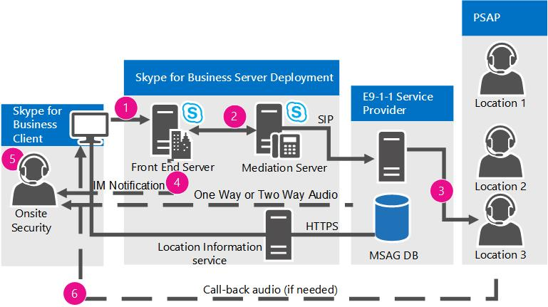

# Skype for Business Server で緊急サービスを計画するPlan for emergency services in Skype for Business Server

場所の取得や通話ルーティングなど、Skype for Business Server エンタープライズ VoIP の拡張 9-1-1 (E9-1-1) サービスについて説明します。Learn about Enhanced 9-1-1 (E9-1-1) services in Skype for Business Server Enterprise Voice, including location acquiring and call routing.

Skype for Business Server は、展開の一環として、米国内の拡張 9-1-1 (E9-1-1) サービスエンタープライズ VoIPします。Skype for Business Server supports Enhanced 9-1-1 (E9-1-1) services within the United States as part of an Enterprise Voice deployment. E9-1-1 は、9-1-1 呼び出しを緊急対応場所 (ERL) に関連付ける緊急ディスパッチ機能で、オフィスビルや他のマルチテナント施設からの呼び出しに対して、市民 (つまり、通り) アドレスやフロア番号などのより具体的な位置情報で構成されます。E9-1-1 is an emergency dispatch feature that associates a 9-1-1 call with an Emergency Response Location (ERL) that consists of civic (that is, street) addresses and other more specific location information, such as floor numbers, for calls from office buildings and other multitenant facilities. 提供された ERL を使用すると、公衆安全応答ポイント (PSAP) は、応答者に誤った場所またはあいまいな場所を誤って指示するリスクを減らして、最初の応答者を直ちに発信者にディスパッチできます。By using the provided ERL, a Public Safety Answering Point (PSAP) can immediately dispatch first responders to the caller in distress with reduced risk of inadvertently directing the responder to an incorrect or ambiguous location.

> [!NOTE]
> Skype for Business Server では、クライアントの複数の緊急電話番号の構成がサポートされます。Skype for Business Server now supports the configuration of multiple emergency numbers for a client. 詳細については [、「Skype for Business Server で複数の緊急電話番号を計画する」を参照してください](multiple-emergency-numbers.md)。For more information see [Plan for multiple emergency numbers in Skype for Business Server](multiple-emergency-numbers.md).

> [!NOTE]
> Skype for Business Server には、通話受付エンタープライズ VoIP緊急サービス (E9-1-1)、メディア バイパスの 3 つの高度な機能があります。Skype for Business Server has three advanced Enterprise Voice features: call admission control, emergency services (E9-1-1), and media bypass. これら 3 つの機能すべてに共通する計画情報の概要については [、「Skype for Business Server](network-settings-for-advanced-features.md)の高度な機能エンタープライズ VoIPネットワーク設定」を参照してください。For an overview of planning information that is common to all three of these features, see [Network settings for the advanced Enterprise Voice features in Skype for Business Server](network-settings-for-advanced-features.md).

Skype for Business Server は、Skype for Business クライアントおよび Lync Phone Edition デバイスからの拡張 9-1-1 (E9-1-1) 通話をサポートします。Skype for Business Server supports Enhanced 9-1-1 (E9-1-1) calling from Skype for Business clients and Lync Phone Edition devices. Skype for Business Server for E9-1-1 を構成する場合、Skype for Business または Lync Phone Edition から行う緊急通話には、場所情報サービス データベースからの緊急応答場所 (ERL) 情報が含まれます。When you configure Skype for Business Server for E9-1-1, emergency calls placed from Skype for Business or Lync Phone Edition include Emergency Response Location (ERL) information from the Location Information service database. ERL は、オフィスビルや他のマルチテナント施設のより正確な場所を特定するのに役立つ、市民 (つまり、ストリート) アドレスと他の情報で構成されます。ERLs consist of civic (that is, street) addresses and other information that helps to identify a more precise location in office buildings and other multitenant facilities. ユーザーが緊急通話を行う場合、Skype for Business Server は、場所とコールバック情報と共に通話音声を仲介サーバーを介して E9-1-1 サービス プロバイダーにルーティングします。When a user makes an emergency call, Skype for Business Server routes the call audio, along with the location and callback information, through a Mediation Server to an E9-1-1 service provider. E9-1-1 サービス プロバイダーは、発信者の市民アドレスを使用して、発信者の場所を提供する公衆安全応答ポイント (PSAP) に通話をルーティングし、PSAP が発信者の ERL を検索するために使用する緊急サービス クエリ キー (ESQK) に沿って送信します。The E9-1-1 service provider uses the civic address of the caller to route the call to the Public Safety Answering Point (PSAP) that serves the caller's location, and sends along an Emergency Service Query Key (ESQK) that the PSAP uses to look up the caller's ERL.

Skype for Business Server では、E9-1-1 サービス プロバイダーに緊急通話をルーティングする 2 つの方法がサポートされています。Skype for Business Server supports two methods for routing emergency calls to an E9-1-1 service provider:

- 対象となる E9-1-1 サービス プロバイダーへのセッション開始プロトコル (SIP) トランク接続A Session Initiation Protocol (SIP) trunk connection to a qualified E9-1-1 service provider

- 公衆交換電話網 (PSTN) ベースの E9-1-1 サービス プロバイダーへの緊急位置識別番号 (ELIN) ゲートウェイAn Emergency Location Identification Number (ELIN) gateway to a public switched telephone (PSTN)-based E9-1-1 service provider

SIP トランク E9-1-1 サービス プロバイダーを使用する場合は、ERL を位置情報サービス データベースに追加し、E9-1-1 サービス プロバイダーによって管理されているマスター ストリート アドレス ガイド (MSAG) に対して場所を検証します。When you use a SIP trunk E9-1-1 service provider, you add ERLs to the Location Information service database, and then validate the locations against a Master Street Address Guide (MSAG) that is maintained by the E9-1-1 service provider. E9-1-1 サービス プロバイダーが、位置情報を持たなかったり、MSAG に対して検証されていない場所を持つ呼び出しを受信した場合、E9-1-1 サービス プロバイダーは呼び出しを国内/地域緊急通話応答センター (ECRC) にルーティングします。これは、可能であれば、発信者の場所を口頭で取得し、適切な PSAP に手動で呼び出しをルーティングする特別な訓練を受けた担当者が担当します。If an E9-1-1 service provider receives a call that doesn't have location information or has a location that has not been validated against the MSAG, the E9-1-1 service provider routes the call to a national/regional Emergency Call Response Center (ECRC), which is staffed with specially trained personnel who verbally obtain the caller's location, if possible, and manually route the call to the appropriate PSAP. この番号は、SIP トランクが何らかの理由で失敗した場合に 9-1-1 通話をルーティングするための代替手段となります) 。(Some SIP trunk E9-1-1 service providers also provide customers with a PSTN direct inward dialing (DID) number to the ECRC, which provides an alternate means of routing 9-1-1 calls, if the SIP trunk fails for any reason.)

固定の場所を持つ時間分割多重化 (TDM) および IP ベースのプライベート ブランチ 交換機 (PBX) 電話とは異なり、Skype for Business エンドポイントは非常にモバイルになる可能性があります。Unlike time division multiplexing (TDM) and IP-based private branch exchange (PBX) phones, which have fixed locations, a Skype for Business endpoint can be very mobile. E9-1-1 機能を展開すると、Skype for Business Server は、発信者がどこに配置されている場合でも、発信者の場所を提供する PSAP に緊急通話をルーティングできます。When you deploy the E9-1-1 feature, Skype for Business Server helps to ensure that no matter where a caller is located, the emergency call can be routed to the PSAP that serves the caller's location. たとえば、ユーザーのメイン オフィスがワシントン州レドモンドにあり、ユーザーがカンザス州ウィチタのブランチ オフィスにあるコンピューターから緊急電話を発信した場合、SIP トランクまたは PSTN ベースの E9-1-1 サービス プロバイダーは、Redmond の PSAP ではなく、ウィチタの PSAP に通話をルーティングします。For example, if a user's main office is located in Redmond, Washington, but the user places an emergency call from a computer in a branch office in Wichita, Kansas, the SIP trunk or PSTN-based E9-1-1 service provider will route the call to the PSAP in Wichita, not to the PSAP in Redmond.

ELIN ゲートウェイを使用する場合は、場所情報サービス データベースにも ERL を追加しますが、場所ごとに ELIN 番号も含まれます。When you use an ELIN gateway, you also add ERLs to the Location Information service database, but you include also an ELIN number for each location. ELIN 番号は、緊急通話中の緊急通話番号になります。The ELIN number becomes the emergency calling number during the emergency call. その後で、使用する PSTN 事業者が ELIN を自動ロケーション識別 (ALI) データベースにアップロードすることを確認する必要があります。You must then make sure that your PSTN carrier uploads the ELINs to the Automatic Location Identification (ALI) database.

> [!NOTE]
> Skype for Business に接続されたアナログ デバイスは、位置情報サービスから位置情報を受信したり、E9-1-1 サービス プロバイダーに場所を送信したりすることはできません。Skype for Business-connected analog devices cannot receive location information from the Location Information service or transmit location to the E9-1-1 service provider.

 SIP トランク E9-1-1 サービス プロバイダー オプションを使用し、アナログ電話からの E9-1-1 をサポートする必要がある場合、次の 2 つの方法があります。If you use the SIP trunk E9-1-1 service provider option and need to support E9-1-1 from analog phones, you have two options:

- **従来の PS-ALI オプション** アナログ電話が展開され、各アナログ電話に DID が設定されている各サイトにローカル PSTN ゲートウェイがある場合は、プライベート スイッチ/自動場所識別 (PS-ALI) サービス プロバイダーを使用して、アナログ デバイスの場所を直接プロビジョニングできます。**Traditional PS-ALI option** If you have local PSTN gateways at each site where analog phones are deployed and each analog phone has a DID, you can provision the analog device's location directly with a Private Switch/Automatic Location Identification (PS-ALI) service provider. この場合、特別に細工された Skype for Business 音声ポリシーを構成し、アナログ デバイス連絡先オブジェクトに割り当て、それらの電話からの E9-1-1 通話がローカル ゲートウェイを経由して、サイトにサービスを提供する PSTN プロバイダーに直接ルーティングされます (E9-1-1 サービス プロバイダーの SIP トランクに通話をルーティングする代わりに)。In this case, you configure specially-crafted Skype for Business voice policies and assign them to the analog device contact objects so that E9-1-1 calls from those phones route directly through the local gateway to the PSTN provider that services the site (instead of routing the call to an E9-1-1 service provider SIP trunk). 緊急電話がかかってくると、PSTN トランクに関連付けられている PS-ALI プロバイダーのデータベースが各アナログ電話の DID を物理ロケーションにマッピングし、その場所を PSAP に提供します。When an emergency call is placed, a database at a PS-ALI provider that is associated with the PSTN trunk maps the DID of each analog phone to a physical location and provides this location to the PSAP. これらのレコードは、電話が異なる ERL に移動するたびに、PS-ALI サービス プロバイダーが更新する必要があります。These records must be updated with the PS-ALI service provider every time phones are moved to different ERLs.

- **E9-1-1 サービス プロバイダー オプション** E9-1-1 サービス プロバイダーでサポートされている場合は、アナログ電話の DID と対応する ERL を E9-1-1 サービス プロバイダーに登録できます。**E9-1-1 service provider option** You can register the analog phone DIDs and their corresponding ERLs with the E9-1-1 service provider, if this is supported by the E9-1-1 service provider. プロバイダーが、PIDF-LO データを含む Skype for Business Server から呼び出しを受け取った場合、プロバイダーは、呼び出し元の DID 番号にデータベース一致が存在しないか確認できます。If the provider receives a call from Skype for Business Server that doesn't include PIDF-LO data, the provider can see if there is a database match on the calling party's DID number. データベースから取得した ERL を使用すると、プロバイダーは緊急通話を正しい PSAP に自動的にルーティングし、PSAP はアナログ デバイスの DID と、ディスパッチャーが発信者の場所を参照できる ESQK レコードを受け取ります。By using the ERL retrieved from its database, the provider can automatically route the emergency call to the correct PSAP, and the PSAP will receive the DID of the analog device and an ESQK record that allows the dispatcher to lookup the caller's location.

ELIN ゲートウェイ オプションを使用し、アナログ電話からの E9-1-1 をサポートする必要がある場合、前述の 1 つ目のオプションで説明したように、アナログ機器のロケーションを直接 PS-ALI サービス プロバイダーに対してプロビジョニングすることができます。If you use the ELIN gateway option and need to support E9-1-1 from analog phones, you can provision the analog device's location directly with the PS-ALI service provider, as described in the first option above.

Skype for Business Server の観点から、E9-1-1 プロセスは次の 2 つの段階に分けできます。From a Skype for Business Server perspective, the E9-1-1 process can be separated into two stages:

- ステージ 1: 場所の取得Stage 1: Acquiring a location

- ステージ 2: E9-1-1 サービス プロバイダーへの緊急電話のルーティングStage 2: Routing the emergency call to an E9-1-1 service provider

このセクションでは、これらのステージがどのように動作するのかを説明します。This section describes how these stages work.

クライアントの場所を自動検出するようにインフラストラクチャを構成しようと計画している場合は、まず発信者を場所にマッピングするために使用するネットワーク構成要素を決定する必要があります。If you plan to configure your infrastructure to automatically detect client location, first you need to decide which network elements you will use to map callers to locations. 可能なオプションの詳細については、「Define the network elements used to determine location [in Skype for Business Server」を参照してください](network-location.md)。For details about the possible options, see [Define the network elements used to determine location in Skype for Business Server](network-location.md).

## 場所の取得Acquiring a location

Skype for Business Server E9-1-1 展開では、内部接続された各 Skype for Business または Lync Phone Edition クライアントが、独自の場所を積極的に取得します。In a Skype for Business Server E9-1-1 deployment, each internally-connected Skype for Business or Lync Phone Edition client actively acquires its own location. SIP 登録後、クライアントは、自身について知っているすべてのネットワーク接続情報を場所要求で Location Information Service に提供します。これは、レプリケートされた SQL Server データベースによってサポートされる Web サービスです。After SIP registration, the client furnishes all the network connectivity information that it knows about itself it in a location request to the Location Information service, which is a web service backed by a replicated SQL Server database. 各セントラル サイト プールには、ネットワーク情報を使用して一致する場所のレコードを照会する場所情報サービスがあります。Each central site pool has a Location Information service, which uses the network information to query its records for a matching location. 一致がある場合、位置情報サービスはクライアントに場所を返します。If there is a match, the Location Information service returns a location to the client. 一致しない場合は、場所を手動で入力するように求めるメッセージが表示される場合があります (場所ポリシーの設定に応じて)。If there is not a match, the user may be prompted to enter a location manually (depending on location policy settings). 場所データは、プレゼンス情報データ形式の場所オブジェクト (PIDF-LO) と呼ばれるインターネット エンジニアリング タスク フォース (IETF) の標準化された XML 形式でクライアントに送信されます。The location data are transmitted back to the client in an Internet Engineering Task Force (IETF) standardized XML format called Presence Information Data Format Location Object (PIDF-LO).

Skype for Business クライアントには緊急通話の一環として PIDF-LO データが含まれており、このデータは E9-1-1 サービス プロバイダーによって適切な PSAP を判別し、その PSAP に呼び出しをルーティングし、正しい ESQK と共に呼び出しをルーティングします。これにより、PSAP ディスパッチャーは発信者の場所を取得できます。The Skype for Business client includes the PIDF-LO data as part of an emergency call, and this data is used by the E9-1-1 service provider to determine the appropriate PSAP and route the call to that PSAP along with the correct ESQK, which allows the PSAP dispatcher to obtain the caller's location.

次の図は、Skype for Business クライアントが場所を取得する方法を示しています (サード パーティのクライアント MAC アドレスベースの場所の方法を除く)。The following diagram shows how a Skype for Business client acquires a location (except for the third-party client MAC address-based location method):

クライアントが場所情報を取得するには、次の手順を実行する必要があります。For a client to acquire a location, the following steps must take place:

1. 管理者は、位置情報サービス データベースにネットワーク ワイヤーマップ (さまざまな種類のネットワーク アドレスを対応する緊急対応の場所 (ERLs) にマップするテーブル) を設定します。The administrator populates the Location Information service database with the network wiremap (tables that map various types of network addresses to corresponding Emergency Response Locations (ERLs)).

2. SIP トランクの E9-1-1 サービス プロバイダーを使用する場合、その E9-1-1 サービス プロバイダーが維持する主要道路住所案内 (MSAG) データベースに対して、管理者は ERL の公的アドレス部分を確認します。ELIN ゲートウェイを使用する場合、管理者は、PSTN キャリアが自動ロケーション識別 (ALI) データベースに ELIN をアップロードすることを確認します。If you use a SIP trunk E9-1-1 service provider, the administrator validates the civic address portions of the ERLs against a Master Street Address Guide (MSAG) database maintained by the E9-1-1 service provider. If you use an ELIN gateway, the administrator ensures that the PSTN carrier uploads the ELINs to the Automatic Location Identification (ALI) database.

3. 登録中、またはネットワーク変更が発生するたびに、内部接続されたクライアントは、クライアントの検出されたネットワーク アドレスを含む場所要求を Location Information サービスに送信します。During registration or whenever a network change occurs, an internally-connected client sends a location request that contains the client's discovered network addresses to the Location Information service.

4. 位置情報サービスは、発行されたレコードに場所を照会し、一致が見つかった場合は、ERL を PIDF-LO 形式でクライアントに返します。The Location Information service queries its published records for a location, and, if a match is found, returns the ERL to the client in PIDF-LO format.

## SIP トランクを使用した E9-1-1 通話のルーティングRouting E9-1-1 calls using a SIP trunk

E9-1-1 を展開する方法に、SIP トランクを使用して、認定された E9-1-1 サービス プロバイダーに接続するという方法があります。Using a SIP trunk to connect to a qualified E9-1-1 service provider is one way that you can deploy E9-1-1. ELIN ゲートウェイを使用して公衆交換電話網 (PSTN) ベースの E9-1-1 サービス プロバイダーに接続する場合の詳細については、「[Routing E9-1-1 Calls by Using an ELIN Gateway](/previous-versions/office/lync-server-2013/lync-server-2013-routing-e9-1-1-calls-by-using-an-elin-gateway)」を参照してください。For details about using an ELIN gateway to connect to a public switched telephone network (PSTN)-based E9-1-1 service provider, see [Routing E9-1-1 Calls by Using an ELIN Gateway](/previous-versions/office/lync-server-2013/lync-server-2013-routing-e9-1-1-calls-by-using-an-elin-gateway).

次の図は、SIP トランクと認定された E9-1-1 サービス プロバイダーを使用する場合に、Skype for Business Server から公衆安全応答ポイント (PSAP) に緊急通話をルーティングする方法を示しています。The following diagram shows how an emergency call is routed from Skype for Business Server to the Public Safety Answering Point (PSAP) when you use a SIP trunk and qualified E9-1-1 service provider.

**SIP トランクを介した E9-1-1 通話のルーティング****Routing E9-1-1 calls through a SIP trunk**

互換性のある Skype for Business Server クライアントから緊急電話が出された場合は、次の条件を実行します。When an emergency call is placed from a compatible Skype for Business Server client:

1. 場所、発信者のコールバック番号、および (オプション) 通知 URL と会議コールバック番号を含む SIP INVITE は、Skype for Business Server にルーティングされます。A SIP INVITE that contains the location, the caller's callback number, and the (optional) Notification URL and conference callback number is routed to Skype for Business Server.

2. Skype for Business Server は緊急番号と一致し、(該当する場所ポリシーで定義されている **PSTN** 使用法の値に基づいて) 通話を仲介サーバーにルーティングし、そこから SIP トランク経由で E9-1-1 サービス プロバイダーにルーティングします。Skype for Business Server matches the emergency number and routes the call (based on the **PSTN Usage** value that is defined in the applicable location policy) to a Mediation Server, and from there, over a SIP trunk to the E9-1-1 service provider.

3. E9-1-1 サービス プロバイダーは、緊急電話と一緒に提供される場所情報に基づいて、通話を適切な PSAP にルーティングします。クライアントが、有効な緊急応答ロケーション (ERL) を緊急電話に含めている場合、プロバイダーはその通話を適切な PSAP に自動転送します。場所情報がユーザーによって手動入力されたものである場合、緊急通話応答センター (ECRC) は、緊急電話を PSAP にルーティングする前に、まず場所が正確かどうかを発信者に口頭で確認します。The E9-1-1 service provider routes the emergency call to the correct PSAP based on the location that is provided with the call. When the client includes a validated Emergency Response Location (ERL) with the emergency call, the provider automatically routes the call to the appropriate PSAP. If the location was manually entered by the user, the Emergency Call Response Center (ECRC) first verbally verifies the accuracy of the location with the caller before routing the emergency call to the PSAP.

4. 通知の場所ポリシーを構成した場合、組織のセキュリティ担当者の 1 つ以上に、特別な Skype for Business 緊急通知インスタント メッセージが送信されます。If you configured the location policy for notifications, one or more of your organization's security officers are sent a special Skype for Business emergency notification instant message. このメッセージは常にセキュリティ担当者の画面に表示され、発信者の名前、電話番号、時刻、場所が含まれているので、セキュリティ担当者はインスタント メッセージまたは音声を使用して緊急発信者に迅速に対応できます。This message always pops up on the security officers' screen(s) and contains the caller's name, phone number, time, and location, enabling security personnel to quickly respond to the emergency caller by using an instant message or voice.

5. 場所ポリシーを会議用に構成した場合で、その場所ポリシーが E9-1-1 サービス プロバイダーでサポートされている場合、社内のセキュリティ デスクが一方向音声または双方向の音声で通話に参加します。If you configured the location policy for conferencing and it is supported by the E9-1-1 service provider, an internal Security Desk is conferenced into the call with either one-way audio or two-way audio.

6. 通話が途中で終了した場合、PSAP はコールバック番号を使用して発信者に直接連絡します。If the call is broken prematurely, the PSAP uses the callback number to contact the caller directly.

## ELIN ゲートウェイを使用した E9-1-1 通話のルーティングRouting E9-1-1 calls by using an ELIN gateway

統合コミュニケーション相互運用プログラムの一部のパートナーは、正規の E9-1-1 サービス プロバイダーへの SIP トランク接続の代替としての機能を果たすことができる、緊急位置識別番号 (ELIN) 対応の正規のゲートウェイを提供しています。Some partners in the Unified Communications Open Interoperability Program provide qualified Emergency Location Identification Number (ELIN)-capable gateways, which can serve as an alternative to a SIP trunk connection to a qualified E9-1-1 service provider. ELIN ゲートウェイは、公衆交換電話網 (PSTN) ベースの E9-1-1 サービスへの ISDN 接続 または Centralized Automatic Message Accounting (CAMA) 接続をサポートします。ELIN gateways support ISDN or Centralized Automatic Message Accounting (CAMA) connectivity to public switched telephone network (PSTN)-based E9-1-1 services. ELIN ゲートウェイとドキュメントへのリンクを提供するパートナーの詳細については [、「Microsoft Lync](../../../SfbPartnerCertification/lync-cert/qualified-ip-pbx-gateway.md) のインフラストラクチャと Skype for Business のテレフォニー [インフラストラクチャ」を参照してください](../../../SfbPartnerCertification/certification/infra-gateways.md)。For details about partners who provide ELIN gateways and links to their documentation, see [Infrastructure qualified for Microsoft Lync](../../../SfbPartnerCertification/lync-cert/qualified-ip-pbx-gateway.md) and [Telephony Infrastructure for Skype for Business](../../../SfbPartnerCertification/certification/infra-gateways.md).

E9-1-1 サービス プロバイダーへの SIP トランク接続と同様に、ELIN ゲートウェイは発信者の最も適切な公衆安全応答ポイント (PSAP) に緊急通話をルーティングする手段も提供しますが、これらのゲートウェイは場所識別子として ELIN を使用します。Like SIP trunk connections to E9-1-1 service providers, ELIN gateways also provide the means of routing an emergency call to the caller's most appropriate Public Safety Answering Point (PSAP), but these gateways use an ELIN as the location identifier. 組織内の緊急対応場所 (ERL) ごとに [ELIN](elin-gateways.md)を定義します (詳細については、「Skype for Business Server の ELIN ゲートウェイの場所を管理する」を参照してください)。You define ELINs for each Emergency Response Location (ERL) in your organization (for details, see [Manage locations for ELIN gateways in Skype for Business Server](elin-gateways.md)).

緊急通話に ELIN ゲートウェイを使用する場合は、SIP トランク接続に使用するのと同じ Skype for Business Server E9-1-1 インフラストラクチャを使用します。When you use an ELIN gateway for emergency calls, you use the same Skype for Business Server E9-1-1 infrastructure that you would use for a SIP trunk connection. つまり、場所情報サービス データベースは Skype for Business クライアントに場所を提供し、場所ポリシーは機能を有効にし、ルーティングを定義します。That is, the Location Information service database provides the location to the Skype for Business client, and the location policy enables the feature and defines the routing. ただし、ELIN ゲートウェイでは、場所情報サービス データベースに ELIN を追加し、PSTN 通信事業者に自動場所識別 (ALI) データベースにアップロードする必要があります。With an ELIN gateway, however, you need to add the ELINs to the Location Information service database and have your PSTN carrier upload them to the Automatic Location Identification (ALI) database.

Skype for Business クライアントが位置情報サービスから場所を取得すると、その場所には ELIN が含まれます。When a Skype for Business client obtains its location from the Location Information service, the location includes the ELIN. 緊急通話時、ELIN ゲートウェイに送信される場所に ELIN が含まれています。During an emergency call, the ELIN is included with the location sent to the ELIN gateway. ELIN ゲートウェイが通話を緊急通話と認識すると、発信者の番号を ELIN に置き換えます。The ELIN gateway identifies the call as an emergency call and swaps the calling party's number with the ELIN. そして、ELIN を発信番号として、通話が PSTN にルーティングされます。The ELIN gateway then routes the call to the PSTN with the ELIN as the calling number. PSTN E9-1-1 プロバイダーでは、主要道路住所案内 (MSAG) データベースのコンパニオン データベースである ALI データベース内で ELIN を検索します。The PSTN E9-1-1 provider looks up the ELIN in the ALI database, which is a companion database to the Master Street Address Guide (MSAG) database. ALI 検索に基づいて最適な PSAP に通話が送られ、ALI 検索に基づいて発信者の場所に最初の対応員が送られます。The PSTN then sends the call to the most appropriate PSAP based on the ALI lookup, and the PSAP sends first responders to the caller's location based on the ALI lookup. 発信番号は、コールバック用に、事前に定義された時間だけ、ELIN ゲートウェイ上にキャッシュされます。The calling number is cached on the ELIN gateway for a predefined amount of time for callbacks. コールバック時には、PSAP が ELIN ゲートウェイにアクセスすると、そこで ELIN が発信者の Direct Inward Dialing (DID) 番号に置き換えられます。During a callback, the PSAP reaches the ELIN gateway, which swaps the ELIN for the caller's direct inward dialing (DID) number.

ELIN ゲートウェイは、組織のネットワーク内からの緊急通話のみをサポートします。ELIN gateways support emergency calls only from within your organization's network. ネットワーク外からの緊急通話はサポートしません。They do not support emergency calls made from outside your network.

> [!NOTE]
> 緊急通話での SIP トランク接続の使用の詳細については、「[Routing E9-1-1 Calls by Using a SIP Trunk](/previous-versions/office/lync-server-2013/lync-server-2013-routing-e9-1-1-calls-by-using-a-sip-trunk)」を参照してください。For details about using a SIP trunk connection for emergency calls, see [Routing E9-1-1 Calls by Using a SIP Trunk](/previous-versions/office/lync-server-2013/lync-server-2013-routing-e9-1-1-calls-by-using-a-sip-trunk).

次の図は、ELIN ゲートウェイを使用するときに、Skype for Business Server から PSAP に緊急通話をルーティングする方法を示しています。The following diagram shows how an emergency call is routed from Skype for Business Server to the PSAP when you use an ELIN gateway.

**ELIN ゲートウェイを使用する場合の E9-1-1 通話のルーティング****Routing E9-1-1 calls with an ELIN gateway**

1. 場所、発信者のコールバック番号、および (オプション) 通知 URL と会議コールバック番号を含む SIP INVITE は、Skype for Business Server にルーティングされます。A SIP INVITE containing the location, the caller's callback number, and the (optional) Notification URL and conference callback number is routed to Skype for Business Server.

2. Skype for Business Server は緊急電話番号と一致し、(該当する場所ポリシーで定義されている **PSTN** 使用法の値に基づいて) 通話を仲介サーバーにルーティングし、そこから ELIN ゲートウェイにルーティングします。Skype for Business Server matches the emergency number and then routes the call (based on the **PSTN Usage** value defined in the applicable location policy) to a Mediation Server, and from there to an ELIN gateway.

3. ELIN ゲートウェイは、ISDN または CAMA トランク経由で PSTN に通話をルーティングします。The ELIN gateway routes the call over an ISDN or CAMA trunk to the PSTN.

4. PSTN は通話を緊急通話と見なし、ネットワーク内で選択された E9-1-1 ルーターに通話をルーティングします。E9-1-1 ルーターは、ALI データベースで発信者の番号を検索して地理的な場所を取得します。E9-1-1 ルーターは、ALI データベースから取得した場所情報に基づいて最適な PSAP に通話を送信します。The PSTN identifies the call as an emergency call and routes it to an E9-1-1 selective router in the network. The E9-1-1 selective router looks up the caller's number in the ALI database to obtain the geographical location. The E9-1-1 selective router sends the call to the most appropriate PSAP based on the location information that was retrieved from the ALI database.

5. 通知の場所ポリシーを構成した場合、組織のセキュリティ担当者の 1 つ以上に、特別な Skype for Business 緊急通知インスタント メッセージが送信されます。If you configured the location policy for notifications, one or more of your organization's security officers are sent a special Skype for Business emergency notification instant message. このメッセージは常にセキュリティ担当者の画面に表示され、発信者の名前、電話番号、時刻、場所が含まれているので、セキュリティ担当者はインスタント メッセージまたは音声を使用して緊急発信者に迅速に対応できます。This message always pops up on the security officers' screen(s) and contains the caller's name, phone number, time, and location, enabling security personnel to quickly respond to the emergency caller by using an instant message or voice.

6. 通話が途中で終了した場合、PSAP は ELIN を使用して発信者に直接連絡します。ELIN ゲートウェイは、ELIN を発信者の DID に置き換えます。If the call is broken prematurely, the PSAP uses the ELIN to contact the caller directly. The ELIN gateway swaps the ELIN for the caller's DID.