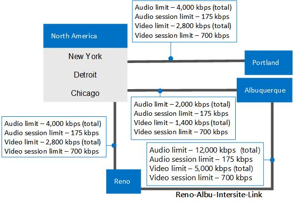

# 例: Skype for Business Server での通話受付制御の要件の収集Example: Gathering requirements for call admission control in Skype for Business Server

Skype for Business Server Enterprise Voice での通話受付制御の計画の詳細な例を示します。これには、ネットワークのサイト、地域、帯域幅に関する情報の収集が含まれます。Provides a detailed example of planning for call admission control in Skype for Business Server Enterprise Voice, including gathering information about your network's sites, regions, and bandwidth.

この例では、通話受付管理 (CAC) の計画および実装方法を示します。これは大まかに次の作業で構成されます。This example shows you how to plan for and implement call admission control (CAC). At a high level, this consists of the following activities:

1. すべてのネットワーク ハブおよびバックボーン (ネットワーク地域とも呼ばれます) を特定します。Identify all of your network hubs and backbones (known as network regions).

2. 各ネットワーク領域の CAC を管理する Skype for Business Server セントラルサイトを特定します。Identify the Skype for Business Server central site that will manage CAC for each network region.

3. 各ネットワーク地域に接続されるネットワーク サイトを特定および定義します。Identify and define the network sites that are connected to each network region.

4. WAN への接続に帯域幅の制約がある各ネットワークサイトについては、WAN 接続の帯域幅の容量と、ネットワーク管理者が Skype for Business Server メディアトラフィック用に設定した帯域幅制限 (該当する場合) について説明します。For each network site whose connection to the WAN is bandwidth-constrained, describe the bandwidth capacity of the WAN connection and the bandwidth limits that to the network administrator has set for Skype for Business Server media traffic, if applicable. WAN への接続に帯域幅の制限がないサイトは含める必要はありません。You do not need to include sites whose connection to the WAN is not bandwidth-constrained.

5. ネットワークの各サブネットをネットワーク サイトに関連付けます。Associate each subnet in your network with a network site.

6. ネットワーク地域間のリンクをマップします。Map the links between the network regions. 各リンクについて、帯域幅の容量と、ネットワーク管理者が Skype for Business Server メディアトラフィックに対して設定した制限事項について説明します。For each link, describe its bandwidth capacity and any limits that the network administrator has placed on Skype for Business Server media traffic.

7. ネットワーク地域のすべてのペア間のルートを定義します。Define a route between every pair of network regions.

## 必要な情報の収集Gather the Required Information

通話受付管理の準備を行うには、次の手順で示されている情報を収集します。To prepare for call admission control, gather the information described in the following steps:

1. ネットワーク地域を特定します。ネットワーク地域とは、ネットワーク バックボーンまたはネットワーク ハブを示します。Identify your network regions. A network region represents a network backbone or a network hub. 

    ネットワーク バックボーンまたはネットワーク ハブとは、異なる LAN またはサブネット間の情報交換用パスを提供して、ネットワークのさまざまな部分を相互接続するコンピューター ネットワーク インフラストラクチャの一部です。バックボーンは、小規模ロケーションから地理的に広範囲な地域まで、さまざまなネットワークを繋ぐことができます。通常、バックボーンの処理能力はバックボーンに接続するネットワークの処理能力よりも高くなっています。A network backbone or a network hub is a part of computer network infrastructure that interconnects various pieces of network, providing a path for the exchange of information between different LANs or subnets. A backbone can tie together diverse networks, from a small location to a wide geographic area. The backbone's capacity is typically greater than that of the networks connected to it.

    このトポロジ例では、北アメリカ、EMEA、および APAC の 3 つのネットワーク地域が存在します。 ネットワーク地域にはネットワーク サイトのコレクションが含まれます。 ネットワーク管理者と協力して、組織のネットワーク地域を定義します。Our example topology has three network regions: North America, EMEA, and APAC. A network region contains a collection of network sites. Work with your network administrator to define the network regions for your enterprise.

2. 各ネットワーク領域に関連付けられたセントラルサイトを特定します。Identify each network region's associated central site. セントラルサイトには、少なくとも1つのフロントエンドサーバーが含まれています。また、ネットワーク領域の WAN 接続を通過するすべてのメディアトラフィックに対して CAC を管理する Skype for Business Server 展開です。A central site contains at least one Front End Server and is the Skype for Business Server deployment that will manage CAC for all media traffic that passes through the network region's WAN connection.

   **3 つのネットワーク地域に分けられたエンタープライズ ネットワークの例****An example enterprise network divided into three network regions**

     

    > [!NOTE]
    > Multiprotocol Label Switching (MPLS) ネットワークは、それぞれの地理的な場所が対応するネットワーク サイトを有する、ネットワーク地域として表される必要があります。A Multiprotocol Label Switching (MPLS) network should be represented as a network region in which each geographic location has a corresponding network site. 詳細については、「 [Skype For business の通話受付制御のコンポーネントとトポロジ](components-and-topologies.md)」を参照してください。For details, see [Components and topologies for call admission control in Skype for Business](components-and-topologies.md). 

    上記のネットワークトポロジの例では、3つのネットワーク領域があります。各地域には、CAC を管理する Skype for Business Server セントラルサイトがあります。In the preceding example network topology, there are three network regions, each with a Skype for Business Server central site that manages CAC. ネットワーク地域の適切な中央サイトは、地理的な近さによって選択されます。The appropriate central site for a network region is chosen by the geographic vicinity. メディア トラフィックはネットワーク地域内で最も重くなるため、所有権が地理的な近さで決まることで自己完結型となり、その他の中央サイトが使用できなくなった場合でも、機能し続けます。Because media traffic will be heaviest within network regions, the ownership by geographic vicinity makes it self-contained and will continue to be functional even if other central sites become unavailable. 

    この例では、シカゴという名前の Skype for Business 展開は北米地域のセントラルサイトです。In this example, a Skype for Business deployment named Chicago is the central site for the North America region.

    北米のすべての Skype for Business ユーザーは、シカゴの展開でサーバーに所属しています。All Skype for Business users in North America are homed on servers in the Chicago deployment. 次の表に 3 つすべてのネットワーク地域の中央サイトを示します。The following table shows central sites for all three network regions.

    **ネットワーク地域と関連付けられた中央サイト****Network Regions and their Associated Central Sites**

    |**ネットワーク地域****Network Region**|**中央サイト****Central Site**|
    |:-----|:-----|
    |北アメリカNorth America    |シカゴChicago    |
    |EMEAEMEA    |ロンドンLondon    |
    |APACAPAC    |北京Beijing    |

    > [!NOTE]
    > Skype for Business Server のトポロジに応じて、同じセントラルサイトを複数のネットワーク領域に割り当てることができます。Depending on your Skype for Business Server topology, the same central site can be assigned to multiple network regions. 

3. それぞれのネットワーク地域で、帯域幅に制限がない WAN 接続を有するネットワーク サイト (オフィスまたは場所) すべてを特定します。 これらのサイトは帯域幅の制限がないため、CAC 帯域幅ポリシーを適用する必要はありません。For each network region, identify all of the network sites (offices or locations) whose WAN connections are not bandwidth-constrained. Because these sites are not bandwidth constrained, you do not need to apply CAC bandwidth policies to them.

    次の表に示されている例では、3 つのネットワーク サイトには帯域幅の制限がある WAN リンクがありません: ニューヨーク、シカゴ、およびデトロイト。In the example shown in the following table, three network sites do not have bandwidth-constrained WAN links: New York, Chicago, and Detroit.

   **WAN 帯域幅による制限がないネットワーク サイト****Network Sites not Constrained by WAN Bandwidth**

   | **ネットワークサイト****Network Site** | **ネットワーク地域****Network Region**   |
   |:-----------------|:---------------------|
   | ニューヨークNew York     | 北アメリカNorth America    |
   | シカゴChicago      | 北アメリカNorth America    |
   | デトロイトDetroit      | 北アメリカNorth America    |

4. それぞれのネットワーク地域で、帯域幅の制限がある WAN リンクを介してネットワーク地域に接続しているすべてのネットワーク サイトを特定します。For each network region, identify all of the network sites that connect to the network region through bandwidth-constrained WAN links.

    音声およびビデオの品質を確実なものにできるように、これらの帯域幅の制限があるネットワーク サイトは、WAN を監視し、ネットワーク地域への、およびネットワーク地域からのメディア (音声またはビデオ) トラフィック フローを制限する CAC 帯域幅ポリシーを使用することをお勧めします。To help ensure audio and video quality, we recommend that these bandwidth-constrained network sites have their WANs monitored and CAC bandwidth policies that limit media (voice or video) traffic flow to and from the network region.

    次の表に示されている例では、WAN 帯域幅による制限がある 3 つのネットワーク サイトが存在します。 ポートランド、リノ、およびアルバカーキ。In the example shown in the following table, there are three network sites that are constrained by WAN bandwidth: Portland, Reno and Albuquerque.

   **WAN 帯域幅による制限があるネットワーク サイト****Network Sites Constrained by WAN Bandwidth**

   |**ネットワークサイト****Network Site**|**ネットワーク地域****Network Region**|
   |:-----|:-----|
   |アルバカーキAlbuquerque    |北アメリカNorth America    |
   |リノReno    |北アメリカNorth America    |
   |ポートランドPortland    |北アメリカNorth America    |

   **帯域幅の制限がない 3 つのネットワーク サイト (シカゴ、ニューヨーク、デトロイト) および WAN 帯域幅の制限がある 3 つのネットワーク サイト (ポートランド、リノ、アルバカーキ) を持つ CAC ネットワーク地域、北アメリカ****CAC network region North America with three network sites that are unconstrained by bandwidth (Chicago, New York, and Detroit) and three network sites that are constrained by WAN bandwidth (Portland, Reno, and Albuquerque)**

     

5. 帯域幅の制限がある WAN リンクに対して、次の項目を決定します。For each bandwidth-constrained WAN link, determine the following:

   - すべての同時音声セッションに対して設定する全体的な帯域幅制限。Overall bandwidth limit that you want to set for all concurrent audio sessions. 新しいオーディオセッションによってこの制限を超過する場合、Skype for Business Server ではセッションの開始が許可されません。If a new audio session will cause this limit to be exceeded, Skype for Business Server does not allow the session to start.

   - 個々のオーディオセッションごとに設定する帯域幅の制限。Bandwidth limit that you want to set for each individual audio session. 既定の CAC 帯域幅制限は 175 kbps ですが、管理者が変更することができます。The default CAC bandwidth limit is 175 kbps, but it can be modified by the administrator.

   - すべての同時ビデオセッションに対して設定する全体的な帯域幅制限。Overall bandwidth limit that you want to set for all concurrent video sessions. 新しいビデオセッションによってこの制限を超過する場合は、Skype for Business Server でセッションの開始が許可されていません。If a new video session will cause this limit to be exceeded, Skype for Business Server does not allow the session to start.

   - 個々のビデオセッションに対して設定する帯域幅の制限。Bandwidth limit that you want to set for each individual video session. 既定の CAC 帯域幅制限は 700 kbps ですが、管理者が変更することができます。The default CAC bandwidth limit is 700 kbps, but it can be modified by the administrator.

     **WAN 帯域幅の制約情報 (kbps の帯域幅) を備えたネットワークサイト****Network Sites with WAN Bandwidth Constraint Information (Bandwidth in kbps)**

     | **ネットワークサイト****Network Site**   | **ネットワーク地域****Network Region**   | **BW Limit****BW Limit**      | **オーディオ制限****Audio Limit**   | **オーディオセッションの制限****Audio Session Limit** | **ビデオの制限****Video Limit**   | **ビデオセッションの制限****Video Session Limit** |
     |:-------------------|:---------------------|:------------------|:------------------|:------------------------|:------------------|:------------------------|
     | アルバカーキAlbuquerque    | 北アメリカNorth America    | 5,0005,000         | 20002,000         | 175175                 | 14001,400         | 700700                 |
     | リノReno           | 北アメリカNorth America    | 1万10,000        | 40004,000         | 175175                 | 28002,800         | 700700                 |
     | ポートランドPortland       | 北アメリカNorth America    | 5,0005,000         | 40004,000         | 175175                 | 28002,800         | 700700                 |
     | ニューヨークNew York       | 北アメリカNorth America    | (制限なし)(no limit)    | (制限なし)(no limit)    | (制限なし)(no limit)          | (制限なし)(no limit)    | (制限なし)(no limit)          |
     | シカゴChicago        | 北アメリカNorth America    | (制限なし)(no limit)    | (制限なし)(no limit)    | (制限なし)(no limit)          | (制限なし)(no limit)    | (制限なし)(no limit)          |
     | デトロイトDetroit        | 北アメリカNorth America    | (制限なし)(no limit)    | (制限なし)(no limit)    | (制限なし)(no limit)          | (制限なし)(no limit)    | (制限なし)(no limit)          |

6. ネットワーク内のすべてのサブネットについて、関連付けられたネットワークサイトを指定します。For every subnet in your network, specify its associated network site.

    > [!IMPORTANT]
    > ネットワークサイトが帯域幅の制約を受けていない場合でも、ネットワーク内のすべてのサブネットがネットワークサイトと関連付けられている必要があります。Every subnet in your network must be associated with a network site, even if the network site is not bandwidth constrained. これは、通話受付制御がサブネット情報を使用して、どのネットワークサイトでエンドポイントが配置されているかを判断するためです。This is because call admission control uses subnet information to determine at which network site an endpoint is located. セッションの両方の当事者の場所が決定されると、通話受付制御によって、通話を確立するための十分な帯域幅があるかどうかを判断できます。When the locations of both parties in the session are determined, call admission control can determine if there is sufficient bandwidth to establish a call. 帯域幅の制限がないリンクを経由してセッションが確立されると、通知が生成されます。When a session is established over a link that has no bandwidth limits, an alert is generated. 

    > [!IMPORTANT]
    > オーディオ/ビデオエッジサーバーを展開する場合、各エッジサーバーのパブリック IP アドレスが、エッジサーバーが展開されているネットワークサイトと関連付けられている必要があります。If you deploy Audio/Video Edge Servers, the public IP addresses of each Edge Server must be associated with the network site where the Edge Server is deployed. A/V エッジサーバーの各パブリック IP アドレスは、サブネットマスクが32のサブネットとして、ネットワーク構成の設定に追加されている必要があります。Each public IP address of the A/V Edge Server must be added to your network configuration settings as a subnet with a subnet mask of 32. たとえば、シカゴに A/V エッジサーバーを展開している場合、それらのサーバーの各外部 IP アドレスに対して、サブネットマスク32を持つサブネットを作成し、そのサブネットにネットワークサイトシカゴを関連付けます。For example, if you deploy A/V Edge Servers in Chicago, then for each external IP address of those servers create a subnet with a subnet mask of 32 and associate network site Chicago with those subnets. パブリック IP アドレスの詳細については、「 [Skype For business のネットワーク要件を計画](../../plan-your-deployment/network-requirements/network-requirements.md)する」を参照してください。For details about public IP addresses, see [Plan network requirements for Skype for Business](../../plan-your-deployment/network-requirements/network-requirements.md). 

    ネットワークに存在するが、サブネットに関連付けられていない、または IP アドレスを含むサブネットがネットワークサイトに関連付けられていない IP アドレスのリストを指定して、キー正常性インジケータ (KHI) アラートが発生します。A Key Health Indicator (KHI) alert is raised, specifying a list of IP addresses that are present in your network but are either not associated with a subnet, or the subnet that includes the IP addresses is not associated with a network site. このアラートは8時間以内に複数回発生することはありません。This alert will not be raised more than once within an 8 hour period. 関連する通知情報と例を以下に示します。The relevant alert information and an example are as follows:

    **ソース**: CS 帯域幅ポリシー サービス (コア)**Source**: CS Bandwidth Policy Service (Core) 

    **イベント番号**: 36034**Event number**: 36034

    **レベル**: 2**Level**: 2

    **説明**: 次の ip アドレスのサブネット: \<ip アドレス\>の一覧が構成されていないか、サブネットがネットワークサイトに関連付けられていません。**Description**: The subnets for the following IP Addresses: \<List of IP Addresses\> are either not configured or the subnets are not associated to a network site. 

    **原因**: 対応する IP アドレスのサブネットがネットワーク構成設定にないか、サブネットがネットワーク サイトに関連付けられていません。**Cause**: The subnets for the corresponding IP addresses are missing from the network configuration settings or the subnets are not associated to a network site. 

    **解決策**: 上の IP アドレスの一覧に対応するサブネットをネットワーク構成の設定に追加し、すべてのサブネットをネットワークサイトに関連付けます。**Resolution**: Add subnets corresponding to the preceding list of IP addresses into the network configuration settings and associate every subnet to a network site.

    たとえば、アラートの IP アドレス一覧に10.121.248.226 と10.121.249.20 が指定されている場合、これらの IP アドレスはサブネットに関連付けられていないか、または関連付けられているサブネットがネットワークサイトに属していません。For example, if the IP address list in the alert specifies 10.121.248.226 and 10.121.249.20, either these IP addresses are not associated with a subnet, or the subnet that they are associated with does not belong to a network site. 10.121.248.0/24 および 10.121.249.0/24 がこれらのアドレスに対応するサブネットである場合、次の手順でこの問題を解決することができます。If 10.121.248.0/24 and 10.121.249.0/24 are the corresponding subnets for these addresses, you can resolve this issue as follows:

    a.a. IP アドレス 10.121.248.226 が 10.121.248.0/24 サブネットに関連付けられていること、および IP アドレス 10.121.249.20 が 10.121.249.0/24 サブネットに関連付けられていることを確認します。Be sure that IP address 10.121.248.226 is associated with the 10.121.248.0/24 subnet and IP address 10.121.249.20 is associated with the 10.121.249.0/24 subnet.

    b.b. 10.121.248.0/24 および 10.121.249.0/24 サブネットがそれぞれネットワーク サイトに関連付けられていることを確認します。Be sure that the 10.121.248.0/24 and 10.121.249.0/24 subnets are each associated with a network site.

   **ネットワークサイトと関連サブネット (kbps の帯域幅)****Network Sites and Associated Subnets (Bandwidth in kbps)**

   | **ネットワークサイト****Network Site**   | **ネットワーク地域****Network Region**   | **BW Limit****BW Limit**      | **オーディオ制限****Audio Limit**   | **オーディオセッションの制限****Audio Session Limit** | **ビデオの制限****Video Limit**   | **ビデオセッションの制限****Video Session Limit** | **サブネット****Subnets**                                                            |
   |:-------------------|:---------------------|:------------------|:------------------|:------------------------|:------------------|:------------------------|:-----------------------------------------------------------------------|
   | アルバカーキAlbuquerque    | 北アメリカNorth America    | 5,0005,000         | 20002,000         | 175175                 | 14001,400         | 700700                 | 172.29.79.0/23、157.57.215.0/25、172.29.90.0/23、172.29.80.0/24172.29.79.0/23, 157.57.215.0/25, 172.29.90.0/23, 172.29.80.0/24    |
   | リノReno           | 北アメリカNorth America    | 1万10,000        | 40004,000         | 175175                 | 28002,800         | 700700                 | 157.57.210.0/23、172.28.151.128、25157.57.210.0/23, 172.28.151.128/25                                 |
   | ポートランドPortland       | 北アメリカNorth America    | 5,0005,000         | 40004,000         | 175175                 | 28002,800         | 700700                 | 172.29.77.0/24 10.71.108.0/24、157.57.208.0/23172.29.77.0/24 10.71.108.0/24, 157.57.208.0/23                     |
   | ニューヨークNew York       | 北アメリカNorth America    | (制限なし)(no limit)    | (制限なし)(no limit)    | (制限なし)(no limit)          | (制限なし)(no limit)    | (制限なし)(no limit)          | 172.29.80.0/23、157.57.216.0/25、172.29.91.0/23、172.29.81.0/24172.29.80.0/23, 157.57.216.0/25, 172.29.91.0/23, 172.29.81.0/24    |
   | シカゴChicago        | 北アメリカNorth America    | (制限なし)(no limit)    | (制限なし)(no limit)    | (制限なし)(no limit)          | (制限なし)(no limit)    | (制限なし)(no limit)          | 157.57.211.0/23、172.28.152.128、25157.57.211.0/23, 172.28.152.128/25                                 |
   | デトロイトDetroit        | 北アメリカNorth America    | (制限なし)(no limit)    | (制限なし)(no limit)    | (制限なし)(no limit)          | (制限なし)(no limit)    | (制限なし)(no limit)          | 172.29.78.0/24 10.71.109.0/24、157.57.209.0/23172.29.78.0/24 10.71.109.0/24, 157.57.209.0/23                     |

7. Skype for Business Server の通話受付制御では、ネットワーク領域間の接続は地域リンクと呼ばれます。In Skype for Business Server call admission control, the connections between network regions are called region links. 各地域のリンクについて、ネットワークサイトの場合と同様に、次のことを確認します。For each region link, determine the following, just as you did for the network sites:

   - すべての同時音声セッションに対して設定する全体的な帯域幅制限。Overall bandwidth limit that you want to set for all concurrent audio sessions. 新しいオーディオセッションによってこの制限を超過する場合、Skype for Business Server ではセッションの開始が許可されません。If a new audio session will cause this limit to be exceeded, Skype for Business Server does not allow the session to start.

   - 個々のオーディオセッションごとに設定する帯域幅の制限。Bandwidth limit that you want to set for each individual audio session. 既定の CAC 帯域幅制限は 175 kbps ですが、管理者が変更することができます。The default CAC bandwidth limit is 175 kbps, but it can be modified by the administrator.

   - すべての同時ビデオセッションに対して設定する全体的な帯域幅制限。Overall bandwidth limit that you want to set for all concurrent video sessions. 新しいビデオセッションによってこの制限を超過する場合は、Skype for Business Server でセッションの開始が許可されていません。If a new video session will cause this limit to be exceeded, Skype for Business Server does not allow the session to start.

   - 個々のビデオセッションに対して設定する帯域幅の制限。Bandwidth limit that you want to set for each individual video session. 既定の CAC 帯域幅制限は 700 kbps ですが、管理者が変更することができます。The default CAC bandwidth limit is 700 kbps, but it can be modified by the administrator.

   **帯域幅の制限が関連付けられたネットワーク領域のリンク****Network Region links with associated bandwidth limits**

     

   **地域リンクの帯域幅情報 (kbps の帯域幅)****Region Link Bandwidth Information (Bandwidth in kbps)**

   | **地域リンク名****Region Link Name**  | **First Region****First Region**     | **Second Region****Second Region** | **BW Limit****BW Limit**  | **オーディオ制限****Audio Limit** | **オーディオセッションの制限****Audio Session Limit** | **ビデオの制限****Video Limit** | **ビデオセッションの制限****Video Session Limit** |
   |:----------------------|:---------------------|:------------------|:--------------|:----------------|:------------------------|:----------------|:------------------------|
   | NA-EMEA-リンクNA-EMEA-LINK      | 北アメリカNorth America    | EMEAEMEA          | 5万50,000    | 2万20,000      | 175175                 | 1400014,000      | 700700                 |
   | EMEA-APAC リンクEMEA-APAC-LINK    | EMEAEMEA             | APACAPAC          | 25,00025,000    | 1万10,000      | 175175                 | 70007,000       | 700700                 |

8. ネットワーク地域のすべてのペア間のルートを定義します。Define a route between every pair of network regions.

    > [!NOTE]
    > 北アメリカと APAC の地域間のルートには、直接接続する地域のリンクがないため、2つのリンクが必要です。Two links are required for the route between the North America and APAC regions because there is no region link that directly connects them. 

   **地域ルート****Region Routes**

   | **地域ルート名****Region Route Name**  | **First Region****First Region**     | **Second Region****Second Region** | **地域リンク****Region Links**                    |
   |:-----------------------|:---------------------|:------------------|:------------------------------------|
   | NA-EMEA-ルートNA-EMEA-ROUTE      | 北アメリカNorth America    | EMEAEMEA          | NA-EMEA-リンクNA-EMEA-LINK                    |
   | EMEA-APAC-ルートEMEA-APAC-ROUTE    | EMEAEMEA             | APACAPAC          | EMEA-APAC リンクEMEA-APAC-LINK                  |
   | NA-APAC-ルートNA-APAC-ROUTE      | 北アメリカNorth America    | APACAPAC          | NA-EMEA-リンク、EMEA-APAC リンクNA-EMEA-LINK, EMEA-APAC-LINK    |

9. 1つのリンク (サイト間リンクと呼ばれます) によって直接接続されているネットワークサイトのペアごとに、次のことを確認します。For every pair of network sites that are directly connected by a single link (called an inter-site link), determine the following:

     - すべての同時音声セッションに対して設定する全体的な帯域幅制限。Overall bandwidth limit that you want to set for all concurrent audio sessions. 新しいオーディオセッションによってこの制限を超過する場合、Skype for Business Server ではセッションの開始が許可されません。If a new audio session will cause this limit to be exceeded, Skype for Business Server does not allow the session to start.

     - 個々のオーディオセッションごとに設定する帯域幅の制限。Bandwidth limit that you want to set for each individual audio session. 既定の CAC 帯域幅制限は 175 kbps ですが、管理者が変更することができます。The default CAC bandwidth limit is 175 kbps, but it can be modified by the administrator.

     - すべての同時ビデオセッションに対して設定する全体的な帯域幅制限。Overall bandwidth limit that you want to set for all concurrent video sessions. 新しいビデオセッションによってこの制限を超過する場合は、Skype for Business Server でセッションの開始が許可されていません。If a new video session will cause this limit to be exceeded, Skype for Business Server does not allow the session to start.

     - 個々のビデオセッションに対して設定する帯域幅の制限。Bandwidth limit that you want to set for each individual video session. 既定の CAC 帯域幅制限は 700 kbps ですが、管理者が変更することができます。The default CAC bandwidth limit is 700 kbps, but it can be modified by the administrator.

   **Reno とアルバカーキの間にあるサイト間リンクの帯域幅と帯域幅の制限を示す CAC ネットワークの地域 (北アメリカ)****CAC network region North America showing the bandwidth capacities and bandwidth limits for the inter-site link between Reno and Albuquerque**

     

   **2つのネットワークサイト間のサイト間リンクの帯域幅情報 (kbps 単位の帯域幅)****Bandwidth Information for an Inter-Site Link between Two Network Sites (Bandwidth in kbps)**

   |**サイト間リンク名****Inter-Site Link Name**|**第1のサイト****First Site**|**第2のサイト****Second Site**|**BW Limit****BW Limit**|**オーディオ制限****Audio Limit**|**オーディオセッションの制限****Audio Session Limit**|**ビデオの制限****Video Limit**|**ビデオセッションの制限****Video Session Limit**|
   |:-----|:-----|:-----|:-----|:-----|:-----|:-----|:-----|
   |Reno-Albu-サイト間リンクReno-Albu-Intersite-Link    |リノReno    |アルバカーキAlbuquerque    |2万20,000    |1200012,000    |175175    |5,0005,000    |700700    |

### 次のステップNext Steps

必要な情報を収集した後は、Skype for Business Server 管理シェルまたは Skype for Business Server コントロールパネルを使用して、CAC 展開を実行できます。After you have gathered the required information, you can perform CAC deployment either by using the Skype for Business Server Management Shell or Skype for Business Server Control Panel.

> [!NOTE]
> Skype for Business Server コントロールパネルを使用して、ほとんどのネットワーク構成タスクを実行できますが、サブネットとサイト間リンクを作成するには、Skype for Business Server 管理シェルを使用する必要があります。Although you can perform most network configuration tasks by using Skype for Business Server Control Panel, to create subnets and intersite links, you must use Skype for Business Server Management Shell. 詳細については、「[新しい-CsNetworkSubnet](https://docs.microsoft.com/powershell/module/skype/new-csnetworksubnet?view=skype-ps) and [new-CsNetworkInterSitePolicy](https://docs.microsoft.com/powershell/module/skype/new-csnetworkintersitepolicy?view=skype-ps)」を参照してください。For details, see [New-CsNetworkSubnet](https://docs.microsoft.com/powershell/module/skype/new-csnetworksubnet?view=skype-ps) and [New-CsNetworkInterSitePolicy](https://docs.microsoft.com/powershell/module/skype/new-csnetworkintersitepolicy?view=skype-ps). 

