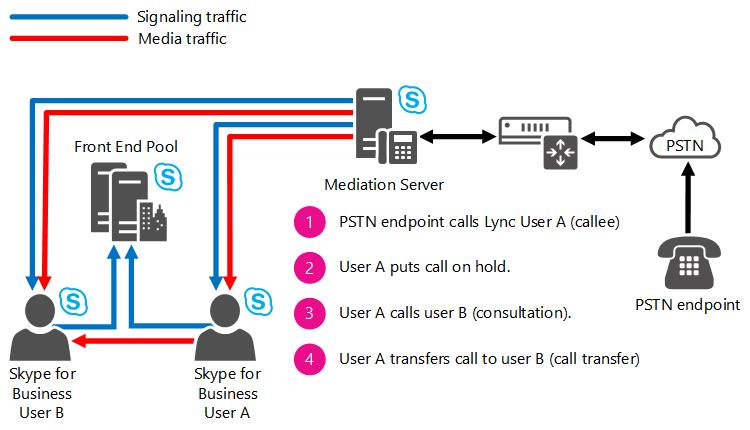

# Skype for Business Server での会議の場所に基づくルーティングLocation-Based Routing for Conferencing in Skype for Business Server

コンサルティング呼び出しの転送を含む、Skype for Business Server エンタープライズ Voip での会議の場所に基づくルーティングの計画。Planning for location-based routing for conferencing in Skype for Business Server Enterprise Voice, including consultative call transfers.

場所に基づくルーティングを使用すると、通話の当事者の場所に基づいて、VoIP エンドポイントと PSTN エンドポイント間での通話のルーティングを制限することができます。Location-Based Routing makes it possible to restrict the routing of calls between VoIP endpoints and PSTN endpoints based on the location of the parties in the call. 会議の場所に基づくルーティングを使用すると、会議 (会議) に対する場所ベースのルーティングルールを適用して、PSTN の有料電話を回避することができます。Location-Based Routing for Conferencing enables you to enforce Location-Based Routing rules on meetings (i.e. conferences) to prevent PSTN toll bypass. アプリケーションは、アクティブな会議を監視し、参加しているユーザーの場所に基づいて、場所に基づくルーティング制限を適用します。The application monitors an active conference and enforces Location-Based Routing restrictions based on the location of users participating. 会議アプリケーション用の場所に基づくルーティングでは、PSTN エンドポイントを使用する提案型転送に対して、場所に基づくルーティング制限を適用することもできます。The Location-Based Routing for Conferencing application additionally enables the enforcement of Location-Based Routing restrictions to consultative transfers involving PSTN endpoints.

場所に基づくルーティング会議アプリケーションは、PSTN 有料電話のバイパスを防止するためのメカニズムとして、Skype for Business 会議に提供されます。The Location-Based Routing Conferencing application provides to Skype for Business Conferences a mechanism for the prevention of PSTN toll bypass. アプリケーションは、アクティブな会議を監視し、参加している Skype for Business ユーザーの場所に基づいて、場所に基づくルーティング制限を適用します。The application monitors active conferences and enforces Location-Based Routing restrictions based on the location of the Skype for Business users participating.

場所に基づくルーティング会議アプリケーションは、次の条件が満たされた場合に、Skype for Business の会議に対して場所に基づくルーティングを適用するかどうかを決定します。The Location-Based Routing Conferencing application determines whether Location-Based Routing is to be enforced on a Skype for Business meeting if the following criteria are met:

- 会議の開催者は、場所に基づくルーティングが有効になっています。The meeting organizer is enabled for Location-Based Routing. 場所に基づくルーティングの制限は、場所に基づくルーティングが有効になっているユーザーによって開催される電話会議にのみ適用されます。Location-Based Routing restrictions will be applied only to conferences that are organized by users who are enabled for Location-Based Routing.

- 少なくとも1つの会議参加者が PSTN エンドポイントです。At least one meeting participant is a PSTN endpoint. 場所に基づくルーティング制限は、PSTN エンドポイントを含む電話会議に対してのみ適用されます。Location-Based Routing restrictions are applicable only for conferences that include PSTN endpoints.

- PSTN に電話会議をブリッジするために使用される PSTN ゲートウェイが配置されているネットワークサイト、および開催者と参加者が接続しているネットワークサイトがあります。The network site where the PSTN gateway used to bridge the conference to the PSTN is located as well as the network sites where the organizers and participants are connecting from.

会議アプリケーションの場所に基づくルーティングでは、Skype for Business ユーザーと PSTN エンドポイントを異なるネットワークサイトから同じ会議に参加させることができなくなります。The Location-Based Routing for Conferencing application prevents the participation of Skype for Business users and PSTN endpoints from different network sites to the same conference. 会議の開催者が場所に基づいたルーティングを有効にしている場合、会議アプリケーションは次の制限を適用します。If the organizer of a meeting is enabled for Location-Based Routing, the Conferencing application enforces the following restrictions:

- Skype for Business 会議に参加できるエンドポイントは、既に会議に参加しているエンドポイントによって異なります。この制限は、参加したエンドポイントが退室して新しいエンドポイントが会議に参加したときに調整されます。The endpoints that can join a Skype for Business meeting depend on the endpoints that already joined the conference, and this restriction adjusts as joined endpoints leave and new endpoints join the conference. 開催者と参加者が同一のネットワークサイトから Skype for Business 会議に参加している場合、PSTN エンドポイント、同じネットワークサイトの別の参加者、または別のネットワークサイトからの別の参加者、または不明なネットワークサイトの参加者が参加できるようになります。If organizers and participants are joining a Skype for Business meeting from the same network site, then a PSTN endpoint, another participant from the same network site, another participant from a different network site or a participant from an unknown network site are allowed to join.

- 開催者と参加者が、異なるまたは不明なネットワークサイトから会議に参加している場合、pstn エンドポイントは、場所に基づくルーティングが有効になっている SIP トランクからの ingresses による会議への参加を許可されません。If organizers and participants are joining the meeting from different or unknown network sites, a PSTN endpoint is not allowed to join the meeting if the PSTN call ingresses from a SIP trunk enabled for Location-Based Routing.

- 開催者と参加者が全員同じネットワークサイトから参加していて、PSTN から同じ会議に参加している参加者がいる場合、別のネットワークサイトからの Skype for Business エンドポイントは会議に参加できません。If organizers and participants are all joining the meeting from the same network site and there are participants joining the same meeting from the PSTN, a Skype for Business endpoint from a different network site is not allowed to join the meeting.

これらの会議の場所に基づくルーティング制限を次の表にまとめます。These conferencing Location-Based Routing restrictions are summarized in the following table.

| || |

|**任意の時点での会議のユーザー****User(s) in a conference at any given point**|**会議への参加が許可されたユーザー****User(s) allowed to join the conference**|**ユーザーが会議に参加することは許可されていません****User(s) not allowed to join the conference**|
|:-----|:-----|:-----|
|単一のネットワークサイトからの Skype for Business VoIP クライアントユーザーSkype for Business VoIP client user(s) from a single network site    |同じネットワークサイトからの Skype for Business VoIP クライアントユーザーSkype for Business VoIP client user from the same network site    別のネットワークサイトからの Skype for Business VoIP クライアントユーザーSkype for Business VoIP client user from a different network site    不明なネットワークサイトからの Skype for Business VoIP クライアントユーザーSkype for Business VoIP client user from an unknown network site    フェデレーション Skype for Business VoIP クライアントユーザーFederated Skype for Business VoIP client user    PSTN エンドポイントから参加しているユーザーUser joining from a PSTN endpoint    |なしNone    |
|不明なネットワークサイトからの Skype for Business VoIP クライアントユーザーSkype for Business VoIP client user(s) from an unknown network site    |任意のサイトからの Skype for Business VoIP クライアントユーザーSkype for Business VoIP client user from any site    不明なサイトからの Skype for Business VoIP クライアントユーザーSkype for Business VoIP client user from an unknown site    フェデレーション Skype for Business VoIP クライアントユーザーFederated Skype for Business VoIP client user    |PSTN エンドポイント経由で参加するユーザーUser joining via a PSTN endpoint    |
|異なるネットワークサイトからの Skype for Business VoIP クライアントユーザーSkype for Business VoIP client users from different network sites    |任意のネットワークサイトからの Skype for Business VoIP クライアントユーザーSkype for Business VoIP client user from any network site    不明なネットワークサイトからの Skype for Business VoIP クライアントユーザーSkype for Business VoIP client user from an unknown network site    フェデレーション Skype for Business VoIP クライアントユーザーFederated Skype for Business VoIP client user    |PSTN エンドポイント経由で参加するユーザーUser joining via a PSTN endpoint    |
|単一のネットワークサイトからの Skype for Business VoIP クライアントユーザーと PSTN エンドポイントから参加しているユーザーSkype for Business VoIP client user(s) from a single network site and users joining from a PSTN endpoint    |同じネットワークサイトからの Skype for Business VoIP クライアントユーザーSkype for Business VoIP client user from the same network site    |別のネットワークサイトからの Skype for Business VoIP クライアントユーザーSkype for Business VoIP client user from a different network site    不明なネットワークサイトからの Skype for Business VoIP クライアントユーザーSkype for Business VoIP client user from an unknown network site    フェデレーション Skype for Business VoIP クライアントユーザーFederated Skype for Business VoIP client user    |

会議アプリケーションの場所に基づくルーティングのその他の特徴は次のとおりです。The following are additional characteristics of the Location-Based Routing for Conferencing application:

- ユーザーが会議に参加することを許可されていない場合、場所に基づいたルーティング制限により、会議への通話は拒否され、Skype for Business クライアントは呼び出しが完了しなかったか終了したことを報告します。When a user is not allowed to join a conference given Location-Based Routing restrictions, the call to the conference will be rejected and the Skype for Business client will report that the call was not completed or has ended.

- 場所に基づくルーティングが有効になっていないトランクを介してエンドポイントが参加している場合、場所に基づいたルーティング強制を使用して会議に参加する PSTN エンドポイントは、その状態にかかわらず、会議への参加を制限されません。A PSTN endpoint joining a conference with Location-Based Routing enforcements will not be restricted to join the conference regardless of its state if the endpoint joins via a trunk that is not enabled for Location-Based Routing.

- PSTN への呼び出しを出口しない SIP トランクを介して仲介サーバーに接続された PBX システムは、SIP トランクが定義されているのと同じネットワークサイトにある Skype for Business ユーザーと同じ強制を持つことになります。A PBX system connected to a Mediation Server over a SIP trunk that does not egress calls to the PSTN will have the same enforcements as Skype for Business users located in the same network site where the SIP trunk is defined. たとえば、PSTN エンドポイントは、PBX ユーザーと Skype for Business ユーザーが同じネットワークサイトに配置されている場合に、電話会議に参加することができます。そうしないと、PBX ユーザーが Skype for Business ユーザーとは別のネットワークサイトにある場合、PSTN エンドポイントは会議への参加を許可されません。For example, a PSTN endpoint will be able to join a conference with a PBX user and a Skype for Business user if they are located in the same network site; otherwise, the PSTN endpoint will not be allowed to join the conference if the PBX user is in a different network site than the Skype for Business user.

> [!NOTE]
> Skype for Business の累積的な更新プログラム4では、次の表の動作を確認する必要があります。With Skype for Business Cumulative Update 4, the behavior in the following table should be observed:

|**User****User**|**その他の当事者****Other Party**|**Action****Action**|**結果****Result**|
|:-----|:-----|:-----|:-----|
|Skype for Business MobileSkype for Business Mobile    |PSTNPSTN    |Skype for Business Mobile は PSTN 通話になっています。Skype for Business Mobile is in a PSTN call. Skype for Business Mobile は、電話会議の自動応答 (CAA) に通話をエスカレートします。Skype for Business Mobile then escalates the call to a Conference Auto Attendant (CAA).    |呼び出しがブロックされ、適切なエラーメッセージが表示されます。The call is blocked, with an appropriate error message.    |
|Skype for Business MobileSkype for Business Mobile    |Skype for Business クライアントまたはフェデレーションユーザーSkype for Business Client or Federated User    |クライアントまたはフェデレーションユーザーは、Skype for Business のモバイルの場所に基づくルーティングユーザーへの VoIP 通話で、いずれかの CAA にエスカレーションされます。The Client or Federated User is on a VoIP call to a Skype for Business Mobile Location-Based Routing user, and either party escalates to a CAA.    |エスカレーション呼び出しがブロックされ、適切なエラーメッセージが表示されます。The escalation call is blocked, with an appropriate error message.    |

## 提案型通話の転送Consultative call transfers

Skype for Business 会議への場所ベースのルーティングを適用することに加えて、会議アプリケーションの場所に基づくルーティングでは、PSTN エンドポイントに出てくるコンサルティング呼び出し転送に対して、場所に基づくルーティング制限を適用します。In addition to enforcing Location-Based Routing to Skype for Business meetings, the Location-Based Routing for Conferencing application enforces Location-Based Routing restrictions on consultative call transfers that egress to PSTN endpoints. コンサルティング着信転送とは、当事者の一方が新しいユーザーに通話を転送する2つの当事者間で確立された通話のことです。A consultative call transfer is a call established between two parties where one of the parties transfers the call to a new user. たとえば、PSTN エンドポイントはユーザー A (Skype for Business の呼び出し先) を呼び出します。For example, a PSTN endpoint calls user A (Skype for Business callee). ユーザー A は、PSTN ユーザーをユーザー B (Skype for Business ユーザー) に転送する必要があることを決定します。User A determines the PSTN user should be forwarded to user B (Skype for Business user). ユーザー A は、PSTN ユーザーに通話を保留し、ユーザー B を呼び出します。ユーザー B は、PSTN ユーザーに連絡することに同意します。User A places the call with the PSTN user on hold, and calls user B. User B agrees to talk to the PSTN user. ユーザー A が通話を保留にして、ユーザー B に転送します。User A transfers the call on-hold to user B.

**コンサルティング呼び出し転送の通話フロー****Consultative call transfer call flow**

場所に基づくルーティングが有効になっているユーザーが PSTN エンドポイントのコンサルティング呼び出し転送を開始すると (前の図に示すように)、これにより、2つのアクティブ通話、PSTN ユーザーと Skype for Business ユーザー A の間の呼び出し、および Skype for Business ユーザー A と Skype for business ユーザー B 間のその他の動作が行われます。:When a user enabled for Location-Based Routing initiates a consultative call transfer of a PSTN endpoint (as shown in the preceding figure), this creates two active calls, one call between the PSTN user and Skype for Business user A, and the other between Skype for Business user A and Skype for Business user B. the following behavior is enforced by the Location-Based Routing for Conferencing application:

- PSTN 通話をルーティングする SIP トランクが、Skype for Business ユーザー B (つまり転送先) が配置されているネットワークサイトへの PSTN 通話の再ルーティングを許可されている場合は、呼び出し転送が許可されます。それ以外の場合は、コンサルティング呼び出しの転送がブロックされます。If the SIP trunk routing the PSTN call is authorized to re-route the PSTN call to the network site where Skype for Business user B (i.e. transfer target) is located,, then the call transfer will be allowed; otherwise, the consultative call transfer will be blocked. この認証は、PSTN エンドポイントへのアクティブな通話をルーティングしている SIP トランクと同じネットワークサイトにある、転送先のパーティの場所に基づいて実行されます。This authorization is performed based on the transferred party's location being in the same network site as the SIP trunk that is routing the active call to the PSTN endpoint.

- 着信 PSTN 通話をルーティングする SIP トランクが、転送先 (Skype for Business ユーザー B) が配置されているか、転送先が不明なネットワークサイトに配置されているネットワークサイトへの呼び出しをルーティングすることを許可されていない場合は、PSTN エンドポイントへのコンサルティング呼び出し転送 (つまり呼び出し転送ターゲット) はブロックされます。If the SIP trunk routing the inbound PSTN call is not authorized to route calls to the network site where the transferred party (Skype for Business user B) is located or the transferred party is located in an unknown network site, then the consultative call transfer to the PSTN endpoint (i.e. call transfer target) will be blocked.

次の表では、提案型呼び出しの転送に対して会議アプリケーションの場所に基づくルーティングによって、場所に基づくルーティング制限を適用する方法について説明します。The following table describes how Location-Based Routing restrictions are applied by the Location-Based Routing for Conferencing application for consultative call transfers. PBX エンドポイントはネットワークサイトに直接関連付けられていませんが、PBX に接続されている SIP トランクにはネットワークサイトを割り当てることができます。Although PBX endpoints are not directly associated with a network site, the SIP trunk the PBX is connected to can be assigned a network site. そのため、PBX エンドポイントは、ネットワークサイトに間接的に関連付けることができます。Therefore, the PBX endpoint can be indirectly associated with a network site.

|**着信転送された相手のネットワークサイト****Network site of call transferred party**|**着信転送ターゲットのネットワークサイト****Network site of call transfer target**|**動作****Behavior**|
|:-----|:-----|:-----|
|PSTN エンドポイントPSTN endpoint    |同じネットワークサイト内の Skype for Business ユーザー (つまり、サイト 1)Skype for Business user in the same network site (i.e. site 1)    |提案転送が許可されます。Consultative transfer will be allowed    |
|PSTN エンドポイントPSTN endpoint    |異なるネットワークサイトにある Skype for Business ユーザー (つまり、サイト 2)Skype for Business user in different network sites (i.e. site 2)    |提案転送が許可されないConsultative transfer will be disallowed    |
|PSTN エンドポイントPSTN endpoint    |不明なネットワークサイト内の Skype for Business ユーザーSkype for Business user in an unknown network site    |提案転送が許可されないConsultative transfer will be disallowed    |
|PSTN エンドポイントPSTN endpoint    |Skype for Business のフェデレーションユーザーFederated Skype for Business user    |提案転送が許可されないConsultative transfer will be disallowed    |
|PSTN エンドポイントPSTN endpoint    |同じサイト内の PBX エンドポイント (つまりサイト 1)PBX endpoint in the same site (i.e. site 1)    |提案転送が許可されます。Consultative transfer will be allowed    |
|PSTN エンドポイントPSTN endpoint    |別のサイトの PBX エンドポイント (つまりサイト 2)PBX endpoint in a different sites (i.e. site 2)    |提案転送が許可されないConsultative transfer will be disallowed    |
|同じサイト内の PBX エンドポイント (つまりサイト 1)PBX endpoint in the same site (i.e. site 1)    |PSTN エンドポイントPSTN endpoint    |提案転送が許可されます。Consultative transfer will be allowed    |
|別のサイトの PBX エンドポイント (つまりサイト 2)PBX endpoint in a different site (i.e. site 2)    |PSTN エンドポイントPSTN endpoint    |提案転送が許可されないConsultative transfer will be disallowed    |
|任意のサイトの PBX エンドポイントPBX endpoint in any site    |同じネットワークサイト内の Skype for Business ユーザー (つまり、サイト 1)Skype for Business user in the same network site (i.e. site 1)    |提案転送が許可されます。Consultative transfer will be allowed    |
|任意のサイトの PBX エンドポイントPBX endpoint in any site    |異なるネットワークサイトにある Skype for Business ユーザー (つまり、サイト 2)Skype for Business user in different network sites (i.e. site 2)    |提案転送が許可されます。Consultative transfer will be allowed    |
|任意のサイトの PBX エンドポイントPBX endpoint in any site    |不明なネットワークサイト内の Skype for Business ユーザーSkype for Business user in an unknown network site    |提案転送が許可されます。Consultative transfer will be allowed    |
|任意のサイトの PBX エンドポイントPBX endpoint in any site    |Skype for Business のフェデレーションユーザーFederated Skype for Business user    |提案転送が許可されます。Consultative transfer will be allowed    |

## RequirementsRequirements

会議アプリケーションの場所に基づくルーティングでは、トポロジ内のすべてのフロントエンドプールおよび Standard Edition サーバーに、Skype for Business Server または Lync Server 2013 の累積更新プログラム2が展開されている必要があります。The Location-Based Routing for Conferencing application requires that either Skype for Business Server or Lync Server 2013 Cumulative Update 2 is deployed on all Front-End pools and Standard Edition Servers in your topology. トポロジ内の一部のサーバーにこれらのサーバーバージョンがインストールされていない場合、会議および提案型通話の転送に対して、場所に基づくルーティング制限を完全に適用することはできません。If these server versions are not installed on some servers in your topology, Location-Based Routing restrictions cannot be fully enforced on meetings and consultative call transfers.

次の表は、場所に基づくルーティングをサポートするサーバーの役割とバージョンの組み合わせを示しています。The following table identifies the combination of server roles and versions that support Location-Based Routing.

|**フロントエンドプールのバージョン****Front-End Pool version**|**仲介サーバーのバージョン****Mediation Server version**|**サポートされている****Supported**|
|:-----|:-----|:-----|
|Skype for Business Server または Lync Server 2013 の累積的な更新プログラム2Skype for Business Server or Lync Server 2013 Cumulative Update 2    |Skype for Business Server または Lync Server 2013 の累積的な更新プログラム2Skype for Business Server or Lync Server 2013 Cumulative Update 2    |はいYes    |
|Lync Server 2013 累積更新プログラム2Lync Server 2013 Cumulative Update 2    |Lync Server 2013 累積更新プログラム1Lync Server 2013 Cumulative Update 1    |いいえNo    |
|Lync Server 2013 累積更新プログラム2Lync Server 2013 Cumulative Update 2    |Lync Server 2010Lync Server 2010    |いいえNo    |
|Lync Server 2013 累積更新プログラム2Lync Server 2013 Cumulative Update 2    |Office Communications Server 2007 R2Office Communications Server 2007 R2    |いいえNo    |
|Lync Server 2013 累積更新プログラム1Lync Server 2013 Cumulative Update 1    |任意Any    |いいえNo    |
|Lync Server 2010Lync Server 2010    |任意Any    |いいえNo    |
|Office Communications Server 2007 R2Office Communications Server 2007 R2    |任意Any    |いいえNo    |

## 会議の場所に基づくルーティングの構成Configuration of Location-Based Routing for Conferencing

会議アプリケーションの場所に基づくルーティングは、場所に基づくルーティングの構成に依存します。The Location-Based Routing for Conferencing application relies on the configuration of Location-Based Routing. 主な構成は次のとおりです。The main configurations are the following:

- 会議に参加する参加者の場所は、ネットワークサイトに基づいて決定されます。The location of participants joining a meeting is determined based on their network site. 場所に基づくルーティングを適用するには、ネットワークサイトとそれに関連付けられたネットワークサブネットが Skype for Business Server で定義されている必要があります。A network site and its associated network subnets must be defined in Skype for Business Server in order to enforce Location-Based Routing.

- 会議の場所に基づいたルーティングを実施するには、場所に基づくルーティングで Skype for Business の参加者を有効にする必要があります。To enforce Location-Based Routing of meetings, Skype for Business participants must be enabled for Location-Based Routing.

- 会議に参加する PSTN エンドポイントの場所ベースのルーティングを適用するには、PSTN エンドポイントへの接続に使用される SIP トランクを、場所に基づいたルーティング用に構成する必要があります。To enforce Location-Based Routing of PSTN endpoints joining meetings, the SIP trunk used to connect the PSTN endpoints must be configured for Location-Based Routing.

## 会議の場所に基づくルーティングを有効にするEnabling the Location-Based Routing for Conferencing

会議アプリケーションの場所に基づくルーティングは、既定では無効になっています。The Location-Based Routing for Conferencing application is disabled by default. このアプリケーションを有効にする前に、アプリケーションに割り当てる適切な優先順位を決定する必要があります。Before enabling this application, you need to determine the right priority to assign for the application. この優先順位を決定するには、Skype for Business Server 管理シェルで次のコマンドレットを実行します。To determine this priority, run the following cmdlet in Skype for Business Server Management Shell:

Get-CsServerApplication-Identity Service: レジストラー: <Pool FQDN> このコマンドレットで \<Pool FQDN\> は、会議アプリケーションの場所に基づくルーティングを有効にするプールを指定します。Get-CsServerApplication -Identity Service:Registrar:<Pool FQDN>In this cmdlet, \<Pool FQDN\> is the pool in which the Location-Based Routing for Conferencing application is to be enabled.

このコマンドレットは、Skype for Business Server によってホストされているアプリケーションの一覧とそれぞれの優先度の値を返します。This cmdlet will return the list of the applications hosted by Skype for Business Server and the priority value for each of them. 会議アプリケーションの場所に基づくルーティングには、"UdcAgent" アプリケーションよりも大きく、"DefaultRouting"、"ExumRouting"、および "OutboundRouting" アプリケーションより小さい優先度の値を割り当てる必要があります。The Location-Based Routing for Conferencing application needs to be assigned a priority value larger than the "UdcAgent" application and smaller than the "DefaultRouting", "ExumRouting" and "OutboundRouting" applications. 会議アプリケーションに対して、場所に基づくルーティングを割り当てることをお勧めします。この優先度の値は、"UdcAgent" アプリケーションの優先度の値よりも1ポイント高くなります。We recommend that you assign the Location-Based Routing for Conferencing application a priority value that is one point higher than the priority value of the "UdcAgent" application.

たとえば、"UdcAgent" アプリケーションの優先度の値が "2" の場合は、"DefaultRouting" アプリケーションの優先度値は "8" で、"ExumRouting" アプリケーションの優先度値は "9" で、"OutboundRouting" アプリケーションの優先度値は "10" に設定されているため、会議アプリケーション用の場所ベースのルーティングを優先度値 "3" に割り当てる必要があります。For example, if the "UdcAgent" application has a priority value of "2", the "DefaultRouting" application has a priority value of "8", the "ExumRouting" application has a priority value of "9" and the "OutboundRouting" application has a priority value of "10" then you should assign the Location-Based Routing for Conferencing application a priority value of "3". これにより、アプリケーションの優先度は次の順序で設定されます。その他のアプリケーション (優先順位: 0 から 1)、"UdcAgent" (優先度: 2)、場所に基づくルーティング会議アプリケーション (優先度: 3)、その他のアプリケーション (優先度: 4 ~ 8)、"DefaultRouting" (優先度: 9)、"ExumRouting" (優先度:11)。Doing so would place the priority of the applications in the following order: Other applications (Priorities: 0 to 1), "UdcAgent" (Priority: 2), Location-Based Routing Conferencing application (Priority: 3), other applications (Priorities: 4 to 8), "DefaultRouting" (Priority: 9), "ExumRouting" (Priority: 10) and "OutboundRouting" (Priority: 11).

会議アプリケーション用の場所に基づくルーティングの正しい優先度の値を見つけたら、各フロントエンドプールまたは Standard Edition サーバーに対して、場所に基づくルーティングが有効になっているユーザーのホームに次のコマンドレットを入力します。After you find the correct priority value for the Location-Based Routing for Conferencing application, type the following cmdlet for each Front-End pool or Standard Edition Server that homes users enabled for Location-Based Routing:

New-CsServerApplication-Identity Service: レジストラー: `<Pool FQDN`>/lbrouting-Priority \<Application Priority\> -Enabled $True-Critical $True-Uri<http://www.microsoft.com/LCS/LBRouting>New-CsServerApplication -Identity Service:Registrar:`<Pool FQDN`>/LBRouting -Priority \<Application Priority\> -Enabled $true -Critical $true -Uri <http://www.microsoft.com/LCS/LBRouting>

以下に例を示します。For example:

新規-CsServerApplication-Identity Service: レジストラー: Ls2013cu2lbrpool LBRouting/Priority 3-Priority 3-Enabled $true-Critical $true-Urihttp://www.microsoft.com/LCS/LBRoutingNew-CsServerApplication -Identity Service:Registrar:LS2013CU2LBRPool.contoso.com/LBRouting -Priority 3 -Enabled $true -Critical $true -Uri http://www.microsoft.com/LCS/LBRouting

このコマンドレットを使用した後、プール内のすべてのフロントエンドサーバー、または会議アプリケーションの場所に基づくルーティングが有効になっている Standard Edition サーバーを再起動します。After using this cmdlet, restart all Front End servers in the pool or the Standard Edition Servers where the Location-Based Routing for Conferencing application has been enabled.

> [!IMPORTANT]
> 場所に基づくルーティング強制から電話会議またはコンサルティング転送は、該当するプールまたは Standard Edition サーバーのすべてのフロントエンドサーバーが再起動されるまで適用されません。Location-Based Routing enforcements to conferences or consultative transfers won't be enforced until all the Front End Servers in the applicable pools or the Standard Edition Servers are restarted. 上記のコマンドレットで **$true**に**クリティカル**に設定した場合は、Skype for business Server サービスが直ちに再起動されます。If you set **-Critical** to **$true** in the preceding cmdlets, your Skype for Business Server services will be immediately restarted. これらのサービスが直ちに再起動しないようにする場合は、[**重要**] を [ **$false** ] に設定し、後でサービスを再起動した後で、[ **set-csserverapplication** ] を使用して **$true** **を変更し**ます。If you do not want these services to immediately restart, set **-Critical** to **$false** for now, and then use **Set-CsServerApplication** to change **-Critical** to **$true** later, after the services have been restarted.

会議アプリケーションの場所に基づくルーティングが正常に有効になり、適用可能なすべてのサーバーが再起動されると、場所に基づくルーティングが有効になっている Skype for Business ユーザーによって開催されたすべての会議が監視され、PSTN の有料電話をバイパスできます。Once the Location-Based Routing for Conferencing application has been successfully enabled and all applicable servers have been restarted, all conferences organized by Skype for Business users enabled for Location-Based Routing will be monitored to prevent PSTN toll bypass

