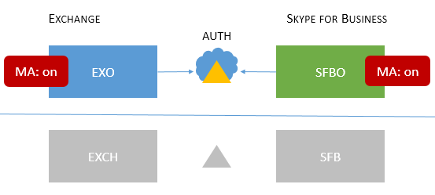
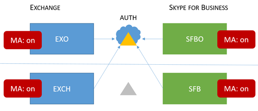

# 先進認証でサポートされる Skype for Business トポロジ
 
この記事では、どのオンラインおよびオンプレミス トポロジが Skype for Business での先進認証でサポートされるかを、各トポロジに適用されるセキュリティ機能とともに一覧表示します。
  
## Skype for Business での先進認証

Skype for Business は先進認証のセキュリティ上の長所を活用します。Skype for Business は Exchange と密接に動作するため、Skype for Business クライアントのユーザーに表示されるログイン動作は、MA status of Exchange の MA の状態による影響も受けます。これは、Skype for Business の分割ドメイン ハイブリッドを利用している場合にも適用されます。これは動きのある部分が多いですが、ここでの目的としてはサポートされるトポロジを簡単に見ることができる一覧を提供することです。
  
Skype for Business、Skype for Business Online、Exchange Server、Exchange Online の場合に、どのトポロジが MA でサポートされますか?
  
<!--  > [!TIP] > Not sure what Modern Authentication even is? No worries.  This Skype for Business article  4e6a99cd-7859-4062-8a30-5ac79ba36b52  explains it in the first paragraphs. --> 
  
### Skype for Business でサポートされる MA トポロジ

2 つのサーバー アプリケーション、MA によって使用される Skype for Business トポロジを含む、2 つの Office 365 ワークロードで構成される可能性があります。
  
- Skype ビジネス サーバー (CU 5) 設置
    
- Skype for Business Online (SFBO)
    
- Exchange Server オンプレミス
    
- Exchange Server Online (EXO)
    
MA のもう 1 つの重要な部分は、ユーザーの認証 (authN) と承認 (authZ) がどこで発生するかを理解していることです。次の 2 つのオプションがあります。
  
- Azure AD、Microsoft Cloud でオンライン
    
- Active Directory フェデレーション サーバー (ADFS) オンプレミス
    
EXO と SFBO と Azure AD は、雲の中で、次のようになる少しようと Exchange Server (EXCH) およびビジネス サーバー (デバイス) の prem. 上の Skype
  

  
サポートされるトポロジを以下に示します。これらの図では、次の重要な点に注意してください。
  
- 薄い、またはグレー表示のアイコンは、シナリオで使用されていません。
    
- EXO は Exchange Online です。
    
- SFBO は Skype for Business Online です。
    
- EXCH は Exchange オンプレミスです。
    
- SFB は Skype for Business オンプレミスです。
    
- 認証サーバーは三角形で表されます。たとえば、Azure AD は後ろに雲マークが付いた三角形になります。
    
- 矢印は、クライアントが指定されたサーバー リソースに到達しようと試みるときに使用する認証サーバーを指します。
    
最初に、オンプレミスのみ、クラウドのみの両方のトポロジの Skype for Business での MA について見ていきましょう。
  
> [!IMPORTANT]
> Skype for Business Online での先進認証をセットアップする準備が整いましたら、 この機能を有効にする手順は[ここで](https://social.technet.microsoft.com/wiki/contents/articles/34339.skype-for-business-online-enable-your-tenant-for-modern-authentication.aspx)。 
  
|トポロジの名前    |例    |説明    |サポート対象    |
|:-----|:-----|:-----|:-----|
|クラウドのみ    |ユーザーの所属/メールボックスの場所: オンライン     |MA は EXO と SFBO の両方でオンです。    このため、認証サーバーは Azure AD です。    |多要素認証 (MFA) では、クライアント証明書ベースの認証 (同行)、条件付きアクセス (CA)/Intune のように、モバイル アプリケーションの管理 (MAM)。 \*    |
|オンプレミスのみ    |ユーザーの所属/メールボックスの場所: オンプレミス    |MA が SFB オンプレミスでオンになります。    このため、認証サーバーは ADFS です。    構成の詳細についてを参照してください[この記事](https://technet.microsoft.com/en-us/library/mt710548.aspx)。   |MFA (Windows デスクトップのみ。モバイル クライアントはサポートされません)。Exchange 統合の機能はサポート対象外です。    |
   
> [!IMPORTANT]
> プロンプトの数を減らせるように、Skype for Business と Exchange (およびその他のオンライン上の同等製品) にわたり MA の状態が同じであることを推奨します。 
  
混合トポロジでは、SFB 分割ドメインのハイブリッドの組み合わせが含まれます。現在サポートされている混合トポロジを以下に示します。
  
|トポロジの名前    |例    |説明    |サポート対象    |
|:-----|:-----|:-----|:-----|
|混合 1    |             ユーザーの所属/メールボックスの場所: EXO および SFB    |MA は SFB で有効ではありません。このトポロジで利用できる SFB の MA 機能はありません。    |SFB の MA 機能はサポート対象外です。    |
|混合 2    |             ユーザーの所属/メールボックスの場所: EXCH および SFB    |MA は SFBO のみです。 認証サーバーは Azure AD SFBO、EXCH オンプレミスの AD に置かれているユーザーです。    |MFA、同行では、CA/Intune で MAM です。\*    |
|混合 3    |             ユーザーの所属/メールボックスの場所: EXO + SFB または EXCH + SFB    |このトポロジでは利用できる SFB の MA 機能はありません    |SFB の MA 機能はサポート対象外です。    |
|混合 4    |             ユーザーの所属/メールボックスの場所: EXCH + SFBO または EXCH + SFB     |MA が SFBO のでは、そのため、認証サーバーは、Azure AD SFBO に置かれているユーザーのです。 デバイスと EXO prem のユーザーは、AD を使用します。    |MFA、同行では、CA/Intune オンラインのユーザーのみに MAM です。\*    |
|混合 5    |             ユーザーの所属/メールボックスの場所: EXO + SFBO、EXO + SFB、EXCH + SFBO、または EXCH + SFB    |MA は EXO と SFBO、したがって SFBO; に置かれているユーザーの認証サーバーは、Azure AD です。EXCH とデバイスの prem のユーザーは、AD を使用します。    |MFA、同行では、CA/Intune オンラインのユーザーのみに MAM です。\*    |
|混合 6    |             ユーザーの所属/メールボックスの場所: EXO + SFBO、EXO + SFB、EXCH + SFBO、または EXCH + SFB    |MA は、すべての場所では、そのため、認証サーバーはすべてのユーザーは Azure AD。 (オンラインと設置型)     参照してください[https://aka.ms/ModernAuthOverview](https://aka.ms/ModernAuthOverview)の展開手順を実行します。   |MFA、同行および CA と MAM (Intune) 経由ですべてのユーザー用です。    |
   
\*-MFA は、Windows デスクトップ、MAC、iOS、Android デバイス、および Windows の電話は含まれています。同行には、Windows デスクトップ、iOS および Android デバイスが含まれています。CA と MAM Intune とには、Android と iOS のデバイスが含まれています。 
  
> [!IMPORTANT]
> 一部の場合において、ユーザーに対して**複数のプロンプト**が表示される可能性があることに注意してください。これは特に、すべてのバージョンの混合トポロジでの場合と同様に、クライアントで必要され要求されるすべてのサーバー リソースにわたり MA の状態が同じではない場合に発生します。

> [!IMPORTANT]
> 場合によっては注意してください (具体的には混合し、1、3、5) [AllowADALForNonLynIndependentOfLync](https://support.microsoft.com/en-us/help/3082803/info-about-the-allowadalfornonlyncindependentoflync-setting-in-skype-for-business,-lync-2013,-and-exchange-online)のレジストリ キーは、Windows デスクトップ クライアントの構成が適切に設定しなければなりません。
  

